# O'REILLY"

# Practica Statistics for Data Scientists

50 ESSENTIAL CONCEPTS

# Peter Bruce & Andrew Bruce

www.allitebooks.com

# **Practical Statistics for Data Scientists**

50 Essential Concepts

**Peter Bruce and Andrew Bruce**

[www.allitebooks.com](http://www.allitebooks.org)

### **Practical Statistics for Data Scientists**

by Peter Bruce and Andrew Bruce

Copyright © 2017 Peter Bruce and Andrew Bruce. All rights reserved.

Printed in the United States of America.

Published by O'Reilly Media, Inc., 1005 Gravenstein Highway North, Sebastopol, CA 95472.

O'Reilly books may be purchased for educational, business, or sales promotional use. Online editions are also available for most titles ([http://oreilly.com/safari\)](http://oreilly.com/safari). For more information, contact our corporate/institutional sales department: 800- 998-9938 or *corporate@oreilly.com*.

- Editor: Shannon Cutt
- Production Editor: Kristen Brown
- Copyeditor: Rachel Monaghan
- Proofreader: Eliahu Sussman
- Indexer: Ellen Troutman-Zaig
- Interior Designer: David Futato
- Cover Designer: Karen Montgomery
- Illustrator: Rebecca Demarest
- May 2017: First Edition

### **Revision History for the First Edition**

2017-05-09: First Release

See <http://oreilly.com/catalog/errata.csp?isbn=9781491952962> for release details.

The O'Reilly logo is a registered trademark of O'Reilly Media, Inc. *Practical Statistics for Data Scientists*, the cover image, and related trade dress are trademarks of O'Reilly Media, Inc.

While the publisher and the authors have used good faith efforts to ensure that the information and instructions contained in this work are accurate, the publisher and the authors disclaim all responsibility for errors or omissions, including without limitation responsibility for damages resulting from the use of or reliance on this work. Use of the information and instructions contained in this work is at your own risk. If any code samples or other technology this work contains or describes is subject to open source licenses or the intellectual property rights of others, it is your responsibility to ensure that your use thereof complies with such licenses and/or rights.

978-1-491-95296-2

[M]

### **Dedication**

We would like to dedicate this book to the memories of our parents Victor G. Bruce and Nancy C. Bruce, who cultivated a passion for math and science; and to our early mentors John W. Tukey and Julian Simon, and our lifelong friend Geoff Watson, who helped inspire us to pursue a career in statistics.

# <span id="page-5-0"></span>**Preface**

This book is aimed at the data scientist with some familiarity with the R programming language, and with some prior (perhaps spotty or ephemeral) exposure to statistics. Both of us came to the world of data science from the world of statistics, so we have some appreciation of the contribution that statistics can make to the art of data science. At the same time, we are well aware of the limitations of traditional statistics instruction: statistics as a discipline is a century and a half old, and most statistics textbooks and courses are laden with the momentum and inertia of an ocean liner.

Two goals underlie this book:

- To lay out, in digestible, navigable, and easily referenced form, key concepts from statistics that are relevant to data science.
- To explain which concepts are important and useful from a data science perspective, which are less so, and why.

### <span id="page-6-0"></span>**What to Expect**

#### **KEY TERMS**

Data science is a fusion of multiple disciplines, including statistics, computer science, information technology, and domain-specific fields. As a result, several different terms could be used to reference a given concept. Key terms and their synonyms will be highlighted throughout the book in a sidebar such as this.

### <span id="page-7-0"></span>**Conventions Used in This Book**

The following typographical conventions are used in this book:

*Italic*

Indicates new terms, URLs, email addresses, filenames, and file extensions.

*Constant width*

Used for program listings, as well as within paragraphs to refer to program elements such as variable or function names, databases, data types, environment variables, statements, and keywords.

### *Constant width bold*

Shows commands or other text that should be typed literally by the user.

*Constant width italic*

Shows text that should be replaced with user-supplied values or by values determined by context.

**TIP**

This element signifies a tip or suggestion.

### **NOTE**

This element signifies a general note.

### **WARNING**

This element indicates a warning or caution.

[www.allitebooks.com](http://www.allitebooks.org)

### <span id="page-8-0"></span>**Using Code Examples**

Supplemental material (code examples, exercises, etc.) is available for download at *<https://github.com/andrewgbruce/statistics-for-data-scientists>*.

This book is here to help you get your job done. In general, if example code is offered with this book, you may use it in your programs and documentation. You do not need to contact us for permission unless you're reproducing a significant portion of the code. For example, writing a program that uses several chunks of code from this book does not require permission. Selling or distributing a CD-ROM of examples from O'Reilly books does require permission. Answering a question by citing this book and quoting example code does not require permission. Incorporating a significant amount of example code from this book into your product's documentation does require permission.

We appreciate, but do not require, attribution. An attribution usually includes the title, author, publisher, and ISBN. For example: "*Practical Statistics for Data Scientists* by Peter Bruce and Andrew Bruce (O'Reilly). Copyright 2017 Peter Bruce and Andrew Bruce, 978-1-491-95296-2."

If you feel your use of code examples falls outside fair use or the permission given above, feel free to contact us at *[permissions@oreilly.com](mailto:permissions@oreilly.com)*.

### <span id="page-9-0"></span>**Safari® Books Online**

### **NOTE**

*Safari Books [Online](http://safaribooksonline.com)* is an on-demand digital library that delivers expert [content](https://www.safaribooksonline.com/explore/) in both book and video form from the world's leading authors in technology and business.

Technology professionals, software developers, web designers, and business and creative professionals use Safari Books Online as their primary resource for research, problem solving, learning, and certification training.

Safari Books Online offers a range of plans and [pricing](https://www.safaribooksonline.com/pricing/) for [enterprise,](https://www.safaribooksonline.com/enterprise/) [government,](https://www.safaribooksonline.com/government/) [education](https://www.safaribooksonline.com/academic-public-library/), and individuals.

Members have access to thousands of books, training videos, and prepublication manuscripts in one fully searchable database from publishers like O'Reilly Media, Prentice Hall Professional, Addison-Wesley Professional, Microsoft Press, Sams, Que, Peachpit Press, Focal Press, Cisco Press, John Wiley & Sons, Syngress, Morgan Kaufmann, IBM Redbooks, Packt, Adobe Press, FT Press, Apress, Manning, New Riders, McGraw-Hill, Jones & Bartlett, Course Technology, and hundreds [more](https://www.safaribooksonline.com/our-library/). For more information about Safari Books Online, please visit us online.

# <span id="page-10-0"></span>**How to Contact Us**

Please address comments and questions concerning this book to the publisher:

- O'Reilly Media, Inc.
- 1005 Gravenstein Highway North
- Sebastopol, CA 95472
- 800-998-9938 (in the United States or Canada)
- 707-829-0515 (international or local)
- 707-829-0104 (fax)

We have a web page for this book, where we list errata, examples, and any additional information. You can access this page at *[http://bit.ly/practicalStats\\_for\\_DataScientists](http://bit.ly/practicalStats_for_DataScientists)*.

To comment or ask technical questions about this book, send email to *[bookquestions@oreilly.com](mailto:bookquestions@oreilly.com)*.

For more information about our books, courses, conferences, and news, see our website at *<http://www.oreilly.com>*.

Find us on Facebook: *<http://facebook.com/oreilly>*

Follow us on Twitter: *<http://twitter.com/oreillymedia>*

Watch us on YouTube: *<http://www.youtube.com/oreillymedia>*

# <span id="page-11-0"></span>**Acknowledgments**

The authors acknowledge the many people who helped make this book a reality.

Gerhard Pilcher, CEO of the data mining firm Elder Research, saw early drafts of the book and gave us detailed and helpful corrections and comments. Likewise, Anya McGuirk and Wei Xiao, statisticians at SAS, and Jay Hilfiger, fellow O'Reilly author, provided helpful feedback on initial drafts of the book.

At O'Reilly, Shannon Cutt has shepherded us through the publication process with good cheer and the right amount of prodding, while Kristen Brown smoothly took our book through the production phase. Rachel Monaghan and Eliahu Sussman corrected and improved our writing with care and patience, while Ellen Troutman-Zaig prepared the index. We also thank Marie Beaugureau, who initiated our project at O'Reilly, as well as Ben Bengfort, O'Reilly author and statistics.com instructor, who introduced us to O'Reilly.

We, and this book, have also benefited from the many conversations Peter has had over the years with Galit Shmueli, coauthor on other book projects.

Finally, we would like to especially thank Elizabeth Bruce and Deborah Donnell, whose patience and support made this endeavor possible.

# <span id="page-12-0"></span>**Chapter 1. Exploratory Data Analysis**

<span id="page-12-2"></span>As a discipline, statistics has mostly developed in the past century. Probability theory — the mathematical foundation for statistics — was developed in the 17th to 19th centuries based on work by Thomas Bayes, Pierre-Simon Laplace, and Carl Gauss. In contrast to the purely theoretical nature of probability, statistics is an applied science concerned with analysis and modeling of data. Modern statistics as a rigorous scientific discipline traces its roots back to the late 1800s and Francis Galton and Karl Pearson. R. A. Fisher, in the early 20th century, was a leading pioneer of modern statistics, introducing key ideas of *experimental design* and *maximum likelihood estimation*. These and many other statistical concepts live largely in the recesses of data science. The main goal of this book is to help illuminate these concepts and clarify their importance — or lack thereof — in the context of data science and big data.

<span id="page-12-5"></span><span id="page-12-4"></span><span id="page-12-3"></span><span id="page-12-1"></span>This chapter focuses on the first step in any data science project: exploring the data. *Exploratory data analysis*, or *EDA*, is a comparatively new area of statistics. Classical statistics focused almost exclusively on *inference*, a sometimes complex set of procedures for drawing conclusions about large populations based on small samples. In 1962, John W. [Tukey](https://en.wikipedia.org/wiki/John_Tukey) ([Figure](#page-13-0) 1-1) called for a reformation of statistics in his seminal paper "The Future of Data Analysis" [\[Tukey-1962\].](#page-491-0) He proposed a new scientific discipline called *data analysis* that included statistical inference as just one component. Tukey forged links to the engineering and computer science communities (he coined the terms *bit*, short for binary digit, and *software*), and his original tenets are suprisingly durable and form part of the foundation for data science. The field of exploratory data analysis was established with Tukey's 1977 now-classic book *Exploratory Data Analysis* [\[Tukey-1977\].](#page-491-1)

<span id="page-13-0"></span>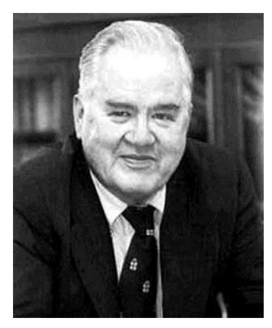

*Figure 1-1. John Tukey, the eminent statistician whose ideas developed over 50 years ago form the foundation of data science.*

<span id="page-13-1"></span>With the ready availablility of computing power and expressive data analysis software, exploratory data analysis has evolved well beyond its original scope. Key drivers of this discipline have been the rapid development of new technology, access to more and bigger data, and the greater use of quantitative analysis in a variety of disciplines. David Donoho, professor of statistics at Stanford University and former undergraduate student of Tukey's, authored an excellent article based on his presentation at the Tukey Centennial workshop in Princeton, New Jersey [\[Donoho-2015\]](#page-490-0). Donoho traces the genesis of data science back to Tukey's pioneering work in data analysis.

### <span id="page-14-0"></span>**Elements of Structured Data**

<span id="page-14-2"></span>Data comes from many sources: sensor measurements, events, text, images, and videos. The *Internet of Things* (IoT) is spewing out streams of information. Much of this data is unstructured: images are a collection of pixels with each pixel containing RGB (red, green, blue) color information. Texts are sequences of words and nonword characters, often organized by sections, subsections, and so on. Clickstreams are sequences of actions by a user interacting with an app or web page. In fact, a major challenge of data science is to harness this torrent of raw data into actionable information. To apply the statistical concepts covered in this book, unstructured raw data must be processed and manipulated into a structured form — as it might emerge from a relational database — or be collected for a study.

#### <span id="page-14-1"></span>**KEY TERMS FOR DATA TYPES**

#### *Continuous*

Data that can take on any value in an interval.

*Synonyms*

interval, float, numeric

#### *Discrete*

Data that can take on only integer values, such as counts.

*Synonyms*

integer, count

#### *Categorical*

Data that can take on only a specific set of values representing a set of possible categories.

*Synonyms*

enums, enumerated, factors, nominal, polychotomous

#### *Binary*

A special case of categorical data with just two categories of values (0/1, true/false).

*Synonyms*

dichotomous, logical, indicator, boolean

#### *Ordinal*

Categorical data that has an explicit ordering.

<span id="page-15-4"></span><span id="page-15-3"></span>*Synonyms* ordered factor

<span id="page-15-1"></span>There are two basic types of structured data: numeric and categorical. Numeric data comes in two forms: *continuous*, such as wind speed or time duration, and *discrete*, such as the count of the occurrence of an event. *Categorical* data takes only a fixed set of values, such as a type of TV screen (plasma, LCD, LED, etc.) or a state name (Alabama, Alaska, etc.). *Binary* data is an important special case of categorical data that takes on only one of two values, such as 0/1, yes/no, or true/false. Another useful type of categorical data is *ordinal* data in which the categories are ordered; an example of this is a numerical rating (1, 2, 3, 4, or 5).

<span id="page-15-6"></span><span id="page-15-0"></span>Why do we bother with a taxonomy of data types? It turns out that for the purposes of data analysis and predictive modeling, the data type is important to help determine the type of visual display, data analysis, or statistical model. In fact, data science software, such as R and Python, uses these data types to improve computational performance. More important, the data type for a variable determines how software will handle computations for that variable.

Software engineers and database programmers may wonder why we even need the notion of *categorical* and *ordinal* data for analytics. After all, categories are merely a collection of text (or numeric) values, and the underlying database automatically handles the internal representation. However, explicit identification of data as categorical, as distinct from text, does offer some advantages:

- <span id="page-15-7"></span><span id="page-15-2"></span>Knowing that data is categorical can act as a signal telling software how statistical procedures, such as producing a chart or fitting a model, should behave. In particular, ordinal data can be represented as an ordered.factor in R and Python, preserving a user-specified ordering in charts, tables, and models.
- Storage and indexing can be optimized (as in a relational database).
- The possible values a given categorical variable can take are enforced in the software (like an enum).

<span id="page-15-5"></span>The third "benefit" can lead to unintended or unexpected behavior: the default behavior of data import functions in R (e.g., read.csv) is to automatically convert a text column into a factor. Subsequent operations on that column will assume that the only allowable values for that column are the ones originally imported, and assigning a new text value will introduce a warning and produce an NA (missing value).

#### **KEY IDEAS**

- Data is typically classified in software by type.
- Data types include continuous, discrete, categorical (which includes binary), and ordinal.
- Data typing in software acts as a signal to the software on how to process the data.

### <span id="page-17-2"></span>**Further Reading**

- <span id="page-17-0"></span>Data types can be confusing, since types may overlap, and the taxonomy in one software may differ from that in another. The [R-Tutorial](http://www.r-tutor.com/r-introduction/basic-data-types) website covers the taxonomy for R.
- <span id="page-17-1"></span>Databases are more detailed in their classification of data types, incorporating considerations of precision levels, fixed- or variable-length fields, and more; see the [W3Schools](http://www.w3schools.com/sql/sql_datatypes_general.asp) guide for SQL.

### <span id="page-18-6"></span>**Rectangular Data**

The typical frame of reference for an analysis in data science is a *rectangular data* object, like a spreadsheet or database table.

#### <span id="page-18-2"></span><span id="page-18-0"></span>**KEY TERMS FOR RECTANGULAR DATA**

#### *Data frame*

Rectangular data (like a spreadsheet) is the basic data structure for statistical and machine learning models.

#### *Feature*

A column in the table is commonly referred to as a *feature*.

#### *Synonyms*

<span id="page-18-3"></span>attribute, input, predictor, variable

#### *Outcome*

Many data science projects involve predicting an *outcome* — often a yes/no outcome (in Table 1- 1, it is "auction was [competitive](#page-19-0) or not"). The *features* are sometimes used to predict the *outcome* in an experiment or study.

#### *Synonyms*

<span id="page-18-5"></span><span id="page-18-4"></span>dependent variable, response, target, output

#### *Records*

A row in the table is commonly referred to as a *record*.

#### *Synonyms*

<span id="page-18-1"></span>case, example, instance, observation, pattern, sample

*Rectangular data* is essentially a two-dimensional matrix with rows indicating records (cases) and columns indicating features (variables). The data doesn't always start in this form: unstructured data (e.g., text) must be processed and manipulated so that it can be represented as a set of features in the rectangular data (see "Elements of [Structured](#page-14-0) Data"). Data in relational databases must be extracted and put into a single table for most data analysis and modeling tasks.

In [Table](#page-19-0) 1-1, there is a mix of measured or counted data (e.g., duration and price), and categorical data (e.g., category and currency). As mentioned earlier, a special form of categorical variable is a binary (yes/no or 0/1) variable, seen in the rightmost column in [Table](#page-19-0) 1-1 — an indicator variable showing whether an

### <span id="page-19-0"></span>auction was competitive or not.

| Category         | currency | sellerRating | Duration | endDay | ClosePrice | OpenPrice | Competitive? |
|------------------|----------|--------------|----------|--------|------------|-----------|--------------|
| Music/Movie/Game | US       | 3249         | 5        | Mon    | 0.01       | 0.01      | 0            |
| Music/Movie/Game | US       | 3249         | 5        | Mon    | 0.01       | 0.01      | 0            |
| Automotive       | US       | 3115         | 7        | Tue    | 0.01       | 0.01      | 0            |
| Automotive       | US       | 3115         | 7        | Tue    | 0.01       | 0.01      | 0            |
| Automotive       | US       | 3115         | 7        | Tue    | 0.01       | 0.01      | 0            |
| Automotive       | US       | 3115         | 7        | Tue    | 0.01       | 0.01      | 0            |
| Automotive       | US       | 3115         | 7        | Tue    | 0.01       | 0.01      | 1            |
| Automotive       | US       | 3115         | 7        | Tue    | 0.01       | 0.01      | 1            |

### *Table 1-1. A typical data format*

### <span id="page-20-1"></span>**Data Frames and Indexes**

<span id="page-20-0"></span>Traditional database tables have one or more columns designated as an index. This can vastly improve the efficiency of certain SQLqueries. In *Python*, with the pandas library, the basic rectangular data structure is a DataFrame object. By default, an automatic integer index is created for a DataFrame based on the order of the rows. In pandas, it is also possible to set multilevel/hierarchical indexes to improve the efficiency of certain operations.

In *R*, the basic rectangular data structure is a data.frame object. A data.frame also has an implicit integer index based on the row order. While a custom key can be created through the row.names attribute, the native R data.frame does not support user-specified or multilevel indexes. To overcome this deficiency, two new packages are gaining widespread use: data.table and dplyr. Both support multilevel indexes and offer significant speedups in working with a data.frame.

### <span id="page-21-3"></span><span id="page-21-2"></span><span id="page-21-1"></span><span id="page-21-0"></span>**TERMINOLOGY DIFFERENCES**

Terminology for rectangular data can be confusing. Statisticians and data scientists use different terms for the same thing. For a statistician, *predictor variables* are used in a model to predict a *response* or *dependent variable*. For a data scientist, *features* are used to predict a *target*. One synonym is particularly confusing: computer scientists will use the term *sample* for a single row; a *sample* to a statistician means a collection of rows.

### <span id="page-22-6"></span>**Nonrectangular Data Structures**

<span id="page-22-2"></span>There are other data structures besides rectangular data.

<span id="page-22-5"></span>Time series data records successive measurements of the same variable. It is the raw material for statistical forecasting methods, and it is also a key component of the data produced by devices — the Internet of Things.

<span id="page-22-3"></span>Spatial data structures, which are used in mapping and location analytics, are more complex and varied than rectangular data structures. In the *object* representation, the focus of the data is an object (e.g., a house) and its spatial coordinates. The *field* view, by contrast, focuses on small units of space and the value of a relevant metric (pixel brightness, for example).

<span id="page-22-1"></span><span id="page-22-0"></span>Graph (or network) data structures are used to represent physical, social, and abstract relationships. For example, a graph of a social network, such as Facebook or LinkedIn, may represent connections between people on the network. Distribution hubs connected by roads are an example of a physical network. Graph structures are useful for certain types of problems, such as network optimization and recommender systems.

<span id="page-22-4"></span>Each of these data types has its specialized methodology in data science. The focus of this book is on rectangular data, the fundamental building block of predictive modeling.

### **GRAPHS IN STATISTICS**

In computer science and information technology, the term *graph* typically refers to a depiction of the connections among entities, and to the underlying data structure. In statistics, *graph* is used to refer to a variety of plots and *visualizations*, not just of connections among entities, and the term applies just to the visualization, not to the data structure.

#### <span id="page-23-0"></span>**KEY IDEAS**

- The basic data structure in data science is a rectangular matrix in which rows are records and columns are variables (features).
- Terminology can be confusing; there are a variety of synonyms arising from the different disciplines that contribute to data science (statistics, computer science, and information technology).

### <span id="page-24-0"></span>**Further Reading**

- [Documentation](https://stat.ethz.ch/R-manual/R-devel/library/base/html/data.frame.html) on data frames in R
- [Documentation](http://pandas.pydata.org/pandas-docs/stable/dsintro.html#dataframe) on data frames in Python

### <span id="page-25-0"></span>**Estimates of Location**

Variables with measured or count data might have thousands of distinct values. A basic step in exploring your data is getting a "typical value" for each feature (variable): an estimate of where most of the data is located (i.e., its central tendency).

#### <span id="page-25-7"></span><span id="page-25-2"></span><span id="page-25-1"></span>**KEY TERMS FOR ESTIMATES OF LOCATION**

#### *Mean*

The sum of all values divided by the number of values.

*Synonyms*

<span id="page-25-3"></span>average

#### *Weighted mean*

The sum of all values times a weight divided by the sum of the weights.

*Synonyms*

weighted average

#### *Median*

The value such that one-half of the data lies above and below.

*Synonyms*

<span id="page-25-8"></span><span id="page-25-4"></span>50th percentile

#### *Weighted median*

The value such that one-half of the sum of the weights lies above and below the sorted data.

#### *Trimmed mean*

The average of all values after dropping a fixed number of extreme values.

*Synonyms*

<span id="page-25-6"></span><span id="page-25-5"></span>truncated mean

#### *Robust*

Not sensitive to extreme values.

*Synonyms*

resistant

#### *Outlier*

A data value that is very different from most of the data.

*Synonyms*

<span id="page-26-0"></span>extreme value

At first glance, summarizing data might seem fairly trivial: just take the *mean* of the data (see ["Mean"\)](#page-28-0). In fact, while the mean is easy to compute and expedient to use, it may not always be the best measure for a central value. For this reason, statisticians have developed and promoted several alternative estimates to the mean.

### <span id="page-27-1"></span><span id="page-27-0"></span>**METRICS AND ESTIMATES**

Statisticians often use the term *estimates* for values calculated from the data at hand, to draw a distinction between what we see from the data, and the theoretical true or exact state of affairs. Data scientists and business analysts are more likely to refer to such values as a *metric*. The difference reflects the approach of statistics versus data science: accounting for uncertainty lies at the heart of the discipline of statistics, whereas concrete business or organizational objectives are the focus of data science. Hence, statisticians estimate, and data scientists measure.

### <span id="page-28-0"></span>**Mean**

The most basic estimate of location is the mean, or *average* value. The mean is the sum of all the values divided by the number of values. Consider the following set of numbers: {3 5 1 2}. The mean is (3 + 5 + 1 + 2) / 4 = 11 / 4 = 2.75. You will encounter the symbol (pronounced "x-bar") to represent the mean of a sample from a population. The formula to compute the mean for a set of *n* values is:

$$\text{Mean} = \overline{x} = \frac{\sum_{i}^{n} x_{i}}{n}$$

### <span id="page-28-1"></span>**NOTE**

*N* (or *n*) refers to the total number of records or observations. In statistics it is capitalized if it is referring to a population, and lowercase if it refers to a sample from a population. In data science, that distinction is not vitalso you may see it both ways.

<span id="page-28-2"></span>A variation of the mean is a *trimmed mean*, which you calculate by dropping a fixed number of sorted values at each end and then taking an average of the remaining values. Representing the sorted values by where is the smallest value and the largest, the formula to compute the trimmed mean with smallest and largest values omitted is:

Trimmed mean 
$$=\overline{x} = \frac{\sum_{i=p+1}^{n-p} x_{(i)}}{n-2p}$$

A trimmed mean eliminates the influence of extreme values. For example, in international diving the top and bottom scores from five judges are dropped, and the final score is the average of the three remaining judges [\[Wikipedia-2016\]](#page-490-1).

This makes it difficult for a single judge to manipulate the score, perhaps to favor his country's contestant. Trimmed means are widely used, and in many cases, are preferable to use instead of the ordinary mean: see "Median and Robust Estimates" for further [discussion.](#page-30-0)

Another type of mean is a *weighted mean*, which you calculate by multiplying each data value by a weight and dividing their sum by the sum of the weights. The formula for a weighted mean is:

<span id="page-29-0"></span>Weighted mean 
$$= \overline{x}_w = \frac{\sum_{i=1}^{n} w_i x_i}{\sum_{i=1}^{n} w_i}$$

There are two main motivations for using a weighted mean:

- Some values are intrinsically more variable than others, and highly variable observations are given a lower weight. For example, if we are taking the average from multiple sensors and one of the sensors is less accurate, then we might downweight the data from that sensor.
- The data collected does not equally represent the different groups that we are interested in measuring. For example, because of the way an online experiment was conducted, we may not have a set of data that accurately reflects all groups in the user base. To correct that, we can give a higher weight to the values from the groups that were underrepresented.

### <span id="page-30-0"></span>**Median and Robust Estimates**

<span id="page-30-1"></span>The *median* is the middle number on a sorted list of the data. If there is an even number of data values, the middle value is one that is not actually in the data set, but rather the average of the two values that divide the sorted data into upper and lower halves. Compared to the mean, which uses all observations, the median depends only on the values in the center of the sorted data. While this might seem to be a disadvantage, since the mean is much more sensitive to the data, there are many instances in which the median is a better metric for location. Let's say we want to look at typical household incomes in neighborhoods around Lake Washington in Seattle. In comparing the Medina neighborhood to the Windermere neighborhood, using the mean would produce very different results because Bill Gates lives in Medina. If we use the median, it won't matter how rich Bill Gates is — the position of the middle observation will remain the same.

<span id="page-30-3"></span>For the same reasons that one uses a weighted mean, it is also possible to compute a *weighted median*. As with the median, we first sort the data, although each data value has an associated weight. Instead of the middle number, the weighted median is a value such that the sum of the weights is equal for the lower and upper halves of the sorted list. Like the median, the weighted median is robust to outliers.

### **Outliers**

<span id="page-30-2"></span>The median is referred to as a *robust* estimate of location since it is not influenced by *outliers* (extreme cases) that could skew the results. An outlier is any value that is very distant from the other values in a data set. The exact definition of an outlier is somewhat subjective, although certain conventions are used in various data summaries and plots (see ["Percentiles](#page-46-0) and Boxplots"). Being an outlier in itself does not make a data value invalid or erroneous (as in the previous example with Bill Gates). Still, outliers are often the result of data errors such as mixing data of different units (kilometers versus meters) or bad readings from a sensor. When outliers are the result of bad data, the mean will result in a poor estimate of location, while the median will be still be valid. In any case, outliers should be identified and are usually worthy of further investigation.

### <span id="page-31-0"></span>**ANOMALY DETECTION**

In contrast to typical data analysis, where outliers are sometimes informative and sometimes a nuisance, in *anomaly detection* the points of interest are the outliers, and the greater mass of data serves primarily to define the "normal" against which anomalies are measured.

The median is not the only robust estimate of location. In fact, a trimmed mean is widely used to avoid the influence of outliers. For example, trimming the bottom and top 10% (a common choice) of the data will provide protection against outliers in all but the smallest data sets. The trimmed mean can be thought of as a compromise between the median and the mean: it is robust to extreme values in the data, but uses more data to calculate the estimate for location.

### **OTHER ROBUST METRICS FOR LOCATION**

Statisticians have developed a plethora of other estimators for location, primarily with the goal of developing an estimator more robust than the mean and also more *efficient* (i.e., better able to discern small location differences between data sets). While these methods are potentially useful for small data sets, they are not likely to provide added benefit for large or even moderately sized data sets.

### <span id="page-33-2"></span>**Example: Location Estimates of Population and Murder Rates**

[Table](#page-33-0) 1-2 shows the first few rows in the data set containing population and murder rates (in units of murders per 100,000 people per year) for each state.

|   | State       | Population | Murder<br>rate |  |  |
|---|-------------|------------|----------------|--|--|
| 1 | Alabama     | 4,779,736  | 5.7            |  |  |
| 2 | Alaska      | 710,231    | 5.6            |  |  |
| 3 | Arizona     | 6,392,017  | 4.7            |  |  |
| 4 | Arkansas    | 2,915,918  | 5.6            |  |  |
| 5 | California  | 37,253,956 | 4.4            |  |  |
| 6 | Colorado    | 5,029,196  | 2.8            |  |  |
| 7 | Connecticut | 3,574,097  | 2.4            |  |  |
| 8 | Delaware    | 897,934    | 5.8            |  |  |

### <span id="page-33-1"></span><span id="page-33-0"></span>*Table 1-2. A few rows of the data.frame state of population and murder rate by state*

Compute the mean, trimmed mean, and median for the population using R:

```
> state <- read.csv(file="/Users/andrewbruce1/book/state.csv")
> mean(state[["Population"]])
[1] 6162876
> mean(state[["Population"]], trim=0.1)
[1] 4783697
> median(state[["Population"]])
[1] 4436370
```

The mean is bigger than the trimmed mean, which is bigger than the median.

This is because the trimmed mean excludes the largest and smallest five states (trim=0.1 drops 10% from each end). If we want to compute the average murder rate for the country, we need to use a weighted mean or median to account for different populations in the states. Since base R doesn't have a function for weighted median, we need to install a package such as matrixStats:

```
> weighted.mean(state[["Murder.Rate"]], w=state[["Population"]])
[1] 4.445834
> library("matrixStats")
> weightedMedian(state[["Murder.Rate"]], w=state[["Population"]])
[1] 4.4
```

In this case, the weighted mean and median are about the same.

#### **KEY IDEAS**

- The basic metric for location is the mean, but it can be sensitive to extreme values (outlier).
- Other metrics (median, trimmed mean) are more robust.

### <span id="page-35-1"></span>**Further Reading**

- Michael Levine (Purdue University) has posted some [useful](http://www.stat.purdue.edu/~mlevins/STAT511_2012/Lecture2standard.pdf) slides on basic calculations for measures of location.
- <span id="page-35-0"></span>John Tukey's 1977 classic *Exploratory Data Analysis* (Pearson) is still widely read.

### <span id="page-36-0"></span>**Estimates of Variability**

Location is just one dimension in summarizing a feature. A second dimension, *variability*, also referred to as *dispersion*, measures whether the data values are tightly clustered or spread out. At the heart of statistics lies variability: measuring it, reducing it, distinguishing random from real variability, identifying the various sources of real variability, and making decisions in the presence of it.

#### <span id="page-36-9"></span><span id="page-36-3"></span><span id="page-36-2"></span><span id="page-36-1"></span>**KEY TERMS FOR VARIABILITY METRICS**

#### *Deviations*

The difference between the observed values and the estimate of location.

*Synonyms*

errors, residuals

#### *Variance*

<span id="page-36-10"></span>The sum of squared deviations from the mean divided by *n* – 1 where *n* is the number of data values.

*Synonyms*

mean-squared-error

#### *Standard deviation*

The square root of the variance.

#### *Synonyms*

<span id="page-36-8"></span><span id="page-36-4"></span>l2-norm, Euclidean norm

#### *Mean absolute deviation*

The mean of the absolute value of the deviations from the mean.

#### *Synonyms*

<span id="page-36-7"></span><span id="page-36-5"></span>l1-norm, Manhattan norm

#### *Median absolute deviation from the median*

The median of the absolute value of the deviations from the median.

#### *Range*

The difference between the largest and the smallest value in a data set.

#### *Order statistics*

Metrics based on the data values sorted from smallest to biggest.

*Synonyms*

<span id="page-36-6"></span>ranks

<span id="page-37-1"></span>

| Percentile                                                                                                                                                                                  |
|---------------------------------------------------------------------------------------------------------------------------------------------------------------------------------------------|
| The<br>value<br>such<br>that<br>P<br>percent<br>of<br>the<br>values<br>take<br>on<br>this<br>value<br>or<br>less<br>and<br>(100–P)<br>percent<br>take<br>on<br>this<br>value<br>or<br>more. |
| Synonyms                                                                                                                                                                                    |
| quantile                                                                                                                                                                                    |
| Interquartile<br>range                                                                                                                                                                      |
| The<br>difference<br>between<br>the<br>75th<br>percentile<br>and<br>the<br>25th<br>percentile.                                                                                              |
| Synonyms                                                                                                                                                                                    |
| IQR                                                                                                                                                                                         |
|                                                                                                                                                                                             |

<span id="page-37-0"></span>Just as there are different ways to measure location (mean, median, etc.) there are also different ways to measure variability.

### <span id="page-38-3"></span>**Standard Deviation and Related Estimates**

The most widely used estimates of variation are based on the differences, or *deviations*, between the estimate of location and the observed data. For a set of data {1, 4, 4}, the mean is 3 and the median is 4. The deviations from the mean are the differences: 1 – 3 = –2, 4 – 3 = 1 , 4 – 3 = 1. These deviations tell us how dispersed the data is around the central value.

<span id="page-38-1"></span>One way to measure variability is to estimate a typical value for these deviations. Averaging the deviations themselves would not tell us much — the negative deviations offset the positive ones. In fact, the sum of the deviations from the mean is precisely zero. Instead, a simple approach is to take the average of the absolute values of the deviations from the mean. In the preceding example, the absolute value of the deviations is {2 1 1} and their average is (2 + 1 + 1) / 3 = 1.33. This is known as the *mean absolute deviation* and is computed with the formula:

<span id="page-38-2"></span><span id="page-38-0"></span>
$$\frac{n}{i=1} \mid x_i - \overline{x} \mid$$

where is the sample mean.

The best-known estimates for variability are the *variance* and the *standard deviation*, which are based on squared deviations. The variance is an average of the squared deviations, and the standard deviation is the square root of the variance.

Variance = 
$$s^2 = \frac{\sum (x - \overline{x})^2}{n - 1}$$
  
tandard deviation =  $s = \sqrt{\text{Variance}}$ 

The standard deviation is much easier to interpret than the variance since it is on the same scale as the original data. Still, with its more complicated and less intuitive formula, it might seem peculiar that the standard deviation is preferred in statistics over the mean absolute deviation. It owes its preeminence to statistical theory: mathematically, working with squared values is much more convenient

<span id="page-39-0"></span>than absolute values, especially for statistical models.

### <span id="page-39-6"></span><span id="page-39-2"></span><span id="page-39-1"></span>**DEGREES OF FREEDOM, AND** *N* **OR** *N* **– 1?**

In statistics books, there is always some discussion of why we have *n* – 1 in the denominator in the variance formula, instead of *n*, leading into the concept of *degrees of freedom*. This distinction is not important since *n* is generally large enough that it won't make much difference whether you divide by *n* or *n* – 1. But in case you are interested, here is the story. It is based on the premise that you want to make estimates about a population, based on a sample.

If you use the intuitive denominator of *n* in the variance formula, you will underestimate the true value of the variance and the standard deviation in the population. This is referred to as a *biased* estimate. However, if you divide by *n* – 1 instead of *n*, the standard deviation becomes an *unbiased* estimate.

To fully explain why using *n* leads to a biased estimate involves the notion of degrees of freedom, which takes into account the number of constraints in computing an estimate. In this case, there are *n* – 1 degrees of freedom since there is one constraint: the standard deviation depends on calculating the sample mean. For many problems, data scientists do not need to worry about degrees of freedom, but there are cases where the concept is important (see ["Choosing](#page-383-0) K").

Neither the variance, the standard deviation, nor the mean absolute deviation is robust to outliers and extreme values (see "Median and Robust [Estimates"](#page-30-0) for a discussion of robust estimates for location). The variance and standard deviation are especially sensitive to outliers since they are based on the squared deviations.

A robust estimate of variability is the *median absolute deviation from the median* or MAD:

where *m* is the median. Like the median, the MAD is not influenced by extreme values. It is also possible to compute a trimmed standard deviation analogous to the trimmed mean (see ["Mean"\)](#page-28-0).

### <span id="page-39-5"></span><span id="page-39-4"></span><span id="page-39-3"></span>**NOTE**

The variance, the standard deviation, mean absolute deviation, and median absolute deviation from the median are not equivalent estimates, even in the case where the data comes from a normal distribution. In fact, the standard deviation is always greater than the mean absolute deviation, which itself is greater than the median absolute deviation. Sometimes, the median absolute deviation is multiplied by a constant scaling factor (it happens to work out to 1.4826) to put MAD on the same scale as the standard deviation in the case of a normal distribution.

### <span id="page-40-0"></span>**Estimates Based on Percentiles**

<span id="page-40-6"></span><span id="page-40-5"></span><span id="page-40-2"></span>A different approach to estimating dispersion is based on looking at the spread of the sorted data. Statistics based on sorted (ranked) data are referred to as *order statistics*. The most basic measure is the *range*: the difference between the largest and smallest number. The minimum and maximum values themselves are useful to know, and helpful in identifying outliers, but the range is extremely sensitive to outliers and not very useful as a general measure of dispersion in the data.

<span id="page-40-3"></span>To avoid the sensitivity to outliers, we can look at the range of the data after dropping values from each end. Formally, these types of estimates are based on differences between *percentiles*. In a data set, the *P*th percentile is a value such that at least *P* percent of the values take on this value or less and at least (100 – *P*) percent of the values take on this value or more. For example, to find the 80th percentile, sort the data. Then, starting with the smallest value, proceed 80 percent of the way to the largest value. Note that the median is the same thing as the 50th percentile. The percentile is essentially the same as a *quantile*, with quantiles indexed by fractions (so the .8 quantile is the same as the 80th percentile).

<span id="page-40-4"></span><span id="page-40-1"></span>A common measurement of variability is the difference between the 25th percentile and the 75th percentile, called the *interquartile range* (or IQR). Here is a simple example: 3,1,5,3,6,7,2,9. We sort these to get 1,2,3,3,5,6,7,9. The 25th percentile is at 2.5, and the 75th percentile is at 6.5, so the interquartile range is 6.5 – 2.5 = 4. Software can have slightly differing approaches that yield different answers (see the following note); typically, these differences are smaller.

For very large data sets, calculating exact percentiles can be computationally very expensive since it requires sorting all the data values. Machine learning and statistical software use special algorithms, such as [\[Zhang-Wang-2007\],](#page-492-0) to get an approximate percentile that can be calculated very quickly and is guaranteed to have a certain accuracy.

<span id="page-41-0"></span>**PERCENTILE: PRECISE DEFINITION** If we have an even number of data (*n* is even), then the percentile is ambiguous under the preceding definition. In fact, we could take on any value between the order statistics and where *j* satisfies: Formally, the percentile is the weighted average:

<span id="page-41-1"></span>for some weight *w* between 0 and 1. Statisticalsoftware has slightly differing approaches to choosing *w*. In fact, the R function quantile offers nine different alternatives to compute the quantile. Except for small data sets, you don't usually need to worry about the precise way a percentile is calculated.

### <span id="page-42-2"></span>**Example: Variability Estimates of State Population**

[Table](#page-42-0) 1-3 shows the first few rows in the data set containing population and murder rates for each state.

|   | State       | Population | Murder<br>rate |  |  |
|---|-------------|------------|----------------|--|--|
| 1 | Alabama     | 4,779,736  | 5.7            |  |  |
| 2 | Alaska      | 710,231    | 5.6            |  |  |
| 3 | Arizona     | 6,392,017  | 4.7            |  |  |
| 4 | Arkansas    | 2,915,918  | 5.6            |  |  |
| 5 | California  | 37,253,956 | 4.4            |  |  |
| 6 | Colorado    | 5,029,196  | 2.8            |  |  |
| 7 | Connecticut | 3,574,097  | 2.4            |  |  |
| 8 | Delaware    | 897,934    | 5.8            |  |  |

<span id="page-42-1"></span><span id="page-42-0"></span>*Table 1-3. A few rows of the data.frame state of population and murder rate by state*

Using R's built-in functions for the standard deviation, interquartile range (IQR), and the median absolution deviation from the median (MAD), we can compute estimates of variability for the state population data:

```
> sd(state[["Population"]])
[1] 6848235
> IQR(state[["Population"]])
[1] 4847308
> mad(state[["Population"]])
[1] 3849870
```

The standard deviation is almost twice as large as the MAD (in R, by default, the scale of the MAD is adjusted to be on the same scale as the mean). This is not surprising since the standard deviation is sensitive to outliers.

### **KEY IDEAS**

- The variance and standard deviation are the most widespread and routinely reported statistics of variability.
- Both are sensitive to outliers.
- More robust metrics include mean and median absolute deviations from the mean and percentiles (quantiles).

### <span id="page-44-1"></span>**Further Reading**

- 1. David Lane's online statistics resource has a section on [percentiles](http://onlinestatbook.com/2/introduction/percentiles.html).
- <span id="page-44-0"></span>2. Kevin Davenport has a [useful](http://www.r-bloggers.com/absolute-deviation-around-the-median/) post on deviations from the median, and their robust properties in R-Bloggers.

### <span id="page-45-6"></span>**Exploring the Data Distribution**

Each of the estimates we've covered sums up the data in a single number to describe the location or variability of the data. It is also useful to explore how the data is distributed overall.

#### <span id="page-45-2"></span><span id="page-45-1"></span><span id="page-45-0"></span>**KEY TERMS FOR EXPLORING THE DISTRIBUTION**

#### *Boxplot*

A plot introduced by Tukey as a quick way to visualize the distribution of data.

*Synonyms*

<span id="page-45-4"></span><span id="page-45-3"></span>Box and whiskers plot

#### *Frequency table*

A tally of the count of numeric data values that fall into a set of intervals (bins).

#### *Histogram*

<span id="page-45-5"></span>A plot of the frequency table with the bins on the x-axis and the count (or proportion) on the yaxis.

#### *Density plot*

A smoothed version of the histogram, often based on a *kernal density estimate*.

### <span id="page-46-0"></span>**Percentiles and Boxplots**

<span id="page-46-2"></span>In "Estimates Based on [Percentiles"](#page-40-0), we explored how percentiles can be used to measure the spread of the data. Percentiles are also valuable to summarize the entire distribution. It is common to report the quartiles (25th, 50th, and 75th percentiles) and the deciles (the 10th, 20th, …, 90th percentiles). Percentiles are especially valuable to summarize the *tails* (the outer range) of the distribution. Popular culture has coined the term *one-percenters* to refer to the people in the top 99th percentile of wealth.

[Table](#page-46-1) 1-4 displays some percentiles of the murder rate by state. In R, this would be produced by the quantile function:

```
quantile(state[["Murder.Rate"]], p=c(.05, .25, .5, .75, .95))
  5% 25% 50% 75% 95%
1.600 2.425 4.000 5.550 6.510
                            Table 1-4. Percentiles
                              of murder rate by
                                     state
                             5% 25% 50% 75% 95%
                             1.60 2.42 4.00 5.55 6.51
```

The median is 4 murders per 100,000 people, although there is quite a bit of variability: the 5th percentile is only 1.6 and the 95th percentile is 6.51.

*Boxplots*, introduced by Tukey [\[Tukey-1977\],](#page-491-1) are based on percentiles and give a quick way to visualize the distribution of data. [Figure](#page-47-0) 1-2 shows a boxplot of the population by state produced by R:

```
boxplot(state[["Population"]]/1000000, ylab="Population (millions)")
```

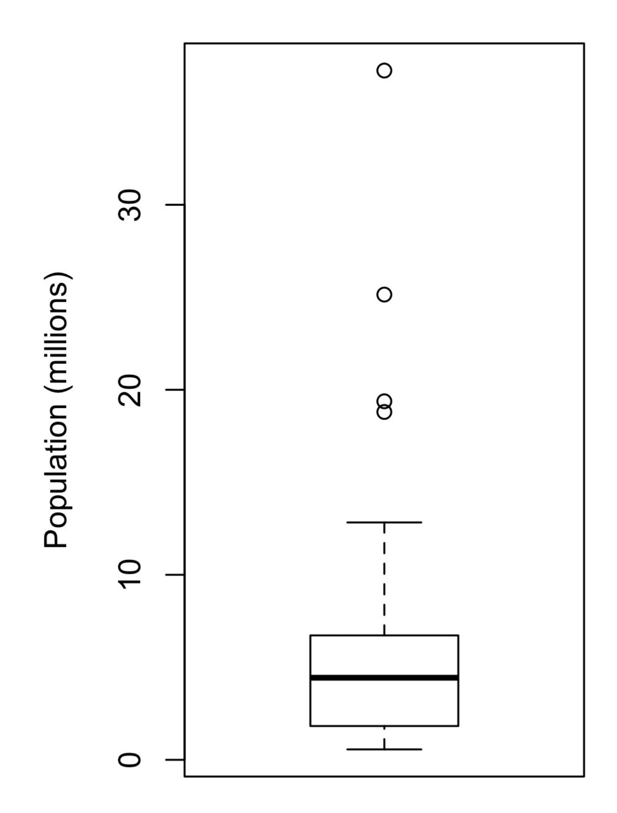

<span id="page-48-0"></span>The top and bottom of the box are the 75th and 25th percentiles, respectively. The median is shown by the horizontal line in the box. The dashed lines, referred to as *whiskers*, extend from the top and bottom to indicate the range for the bulk of the data. There are many variations of a boxplot; see, for example, the documentation for the R function boxplot [\[R-base-2015\]](#page-491-2). By default, the R function extends the whiskers to the furthest point beyond the box, except that it will not go beyond 1.5 times the IQR (other software may use a different rule). Any data outside of the whiskers is plotted as single points.

### <span id="page-49-1"></span>**Frequency Table and Histograms**

A frequency table of a variable divides up the variable range into equally spaced segments, and tells us how many values fall in each segment. [Table](#page-49-0) 1-5 shows a frequency table of the population by state computed in R:

```
breaks <- seq(from=min(state[["Population"]]),
                to=max(state[["Population"]]), length=11)
pop_freq <- cut(state[["Population"]], breaks=breaks,
                right=TRUE, include.lowest = TRUE)
table(pop_freq)
```

<span id="page-49-0"></span>

| BinNumber | BinRange                  | Count | States                                                                  |
|-----------|---------------------------|-------|-------------------------------------------------------------------------|
| 1         | 563,626–<br>4,232,658     | 24    | WY,VT,ND,AK,SD,DE,MT,RI,NH,ME,HI,ID,NE,WV,NM,NV,UT,KS,AR,MS,IA,CT,OK,OR |
| 2         | 4,232,659–<br>7,901,691   | 14    | KY,LA,SC,AL,CO,MN,WI,MD,MO,TN,AZ,IN,MA,WA                               |
| 3         | 7,901,692–<br>11,570,724  | 6     | VA,NJ,NC,GA,MI,OH                                                       |
| 4         | 11,570,725–<br>15,239,757 | 2     | PA,IL                                                                   |
| 5         | 15,239,758–<br>18,908,790 | 1     | FL                                                                      |
| 6         | 18,908,791–<br>22,577,823 | 1     | NY                                                                      |
| 7         | 22,577,824–<br>26,246,856 | 1     | TX                                                                      |
| 8         | 26,246,857–<br>29,915,889 | 0     |                                                                         |
| 9         | 29,915,890–<br>33,584,922 | 0     |                                                                         |
| 10        | 33,584,923–<br>37,253,956 | 1     | CA                                                                      |

<span id="page-49-2"></span>*Table 1-5. A frequency table of population by state*

<span id="page-50-1"></span><span id="page-50-0"></span>The least populous state is Wyoming, with 563,626 people (2010 Census) and the most populous is California, with 37,253,956 people. This gives us a range of 37,253,956 – 563,626 = 36,690,330, which we must divide up into equal size bins — let's say 10 bins. With 10 equal size bins, each bin will have a width of 3,669,033, so the first bin will span from 563,626 to 4,232,658. By contrast, the top bin, 33,584,923 to 37,253,956, has only one state: California. The two bins immediately below California are empty, until we reach Texas. It is important to include the empty bins; the fact that there are no values in those bins is useful information. It can also be useful to experiment with different bin sizes. If they are too large, important features of the distribution can be obscured. It they are too small, the result is too granular and the ability to see bigger pictures is lost.

### **NOTE**

Both frequency tables and percentiles summarize the data by creating bins. In general, quartiles and deciles will have the same count in each bin (equal-count bins), but the bin sizes will be different. The frequency table, by contrast, will have different counts in the bins (equal-size bins).

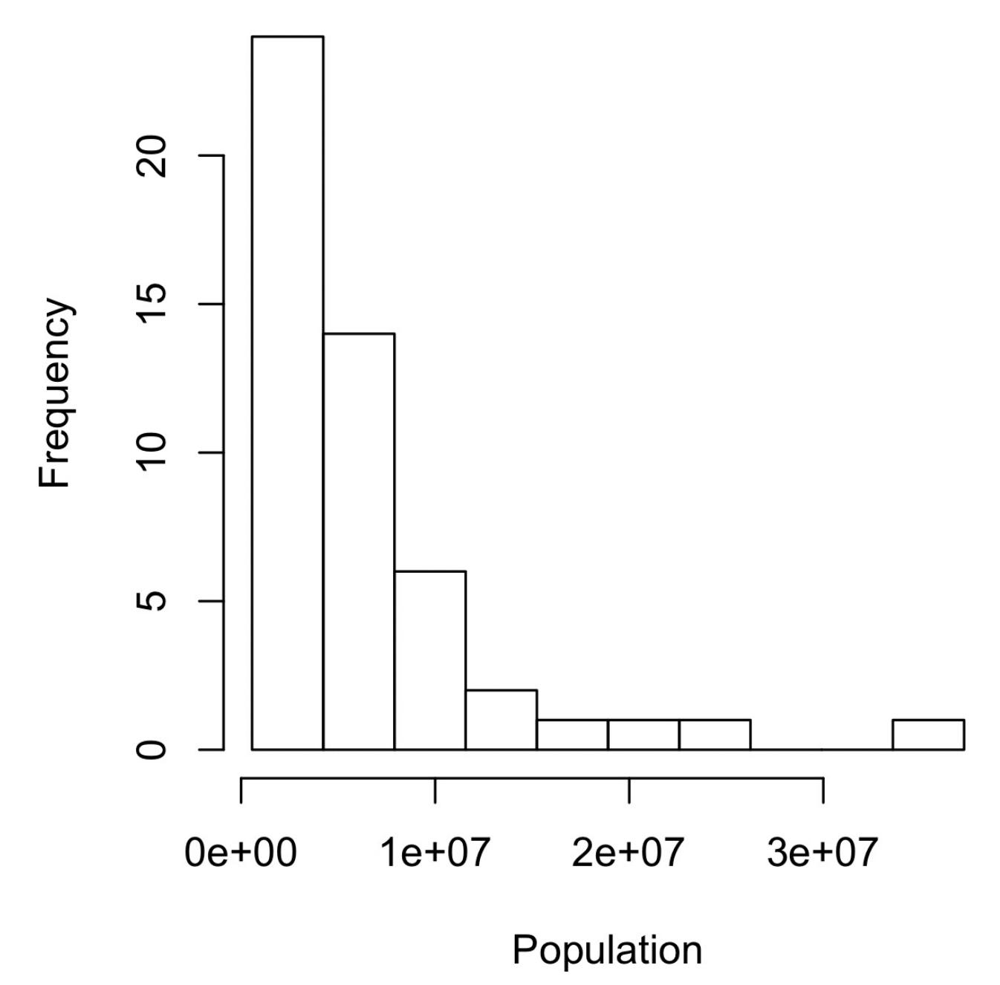

<span id="page-51-1"></span><span id="page-51-0"></span>*Figure 1-3. Histogram of state populations*

A histogram is a way to visualize a frequency table, with bins on the x-axis and data count on the y-axis. To create a histogram corresponding to [Table](#page-49-0) 1-5 in R, use the hist function with the breaks argument:

```
hist(state[["Population"]], breaks=breaks)
```

The histogram is shown in [Figure](#page-50-0) 1-3. In general, histograms are plotted such that:

- Empty bins are included in the graph.
- Bins are equal width.
- Number of bins (or, equivalently, bin size) is up to the user.
- Bars are contiguous no empty space shows between bars, unless there is an empty bin.

### <span id="page-53-0"></span>**STATISTICAL MOMENTS**

<span id="page-53-1"></span>In statistical theory, location and variability are referred to as the first and second *moments* of a distribution. The third and fourth moments are called *skewness* and *kurtosis*. Skewness refers to whether the data is skewed to larger or smaller values and kurtosis indicates the propensity of the data to have extreme values. Generally, metrics are not used to measure skewness and kurtosis; instead, these are discovered through visual displays such as Figures [1-2](#page-47-0) and [1-3](#page-50-0).

### <span id="page-54-3"></span>**Density Estimates**

<span id="page-54-2"></span><span id="page-54-0"></span>Related to the histogram is a density plot, which shows the distribution of data values as a continuous line. A density plot can be thought of as a smoothed histogram, although it is typically computed directly from the data through a *kernal density estimate* (see [\[Duong-2001\]](#page-490-2) for a short tutorial). [Figure](#page-55-0) 1-4 displays a density estimate superposed on a histogram. In R, you can compute a density estimate using the density function:

```
hist(state[["Murder.Rate"]], freq=FALSE)
lines(density(state[["Murder.Rate"]]), lwd=3, col="blue")
```

A key distinction from the histogram plotted in [Figure](#page-50-0) 1-3 is the scale of the yaxis: a density plot corresponds to plotting the histogram as a proportion rather than counts (you specify this in R using the argument freq=FALSE).

### <span id="page-55-1"></span>**DENSITY ESTIMATION**

<span id="page-55-0"></span>Density estimation is a rich topic with a long history in statistical literature. In fact, over 20 R packages have been published that offer functions for density estimation. [\[Deng-Wickham-2011\]](#page-490-3) give a comprehesive review of R packages, with a particular recommendation for ASH or KernSmooth. For many data science problems, there is no need to worry about the various types of density estimates; it suffices to use the base functions.

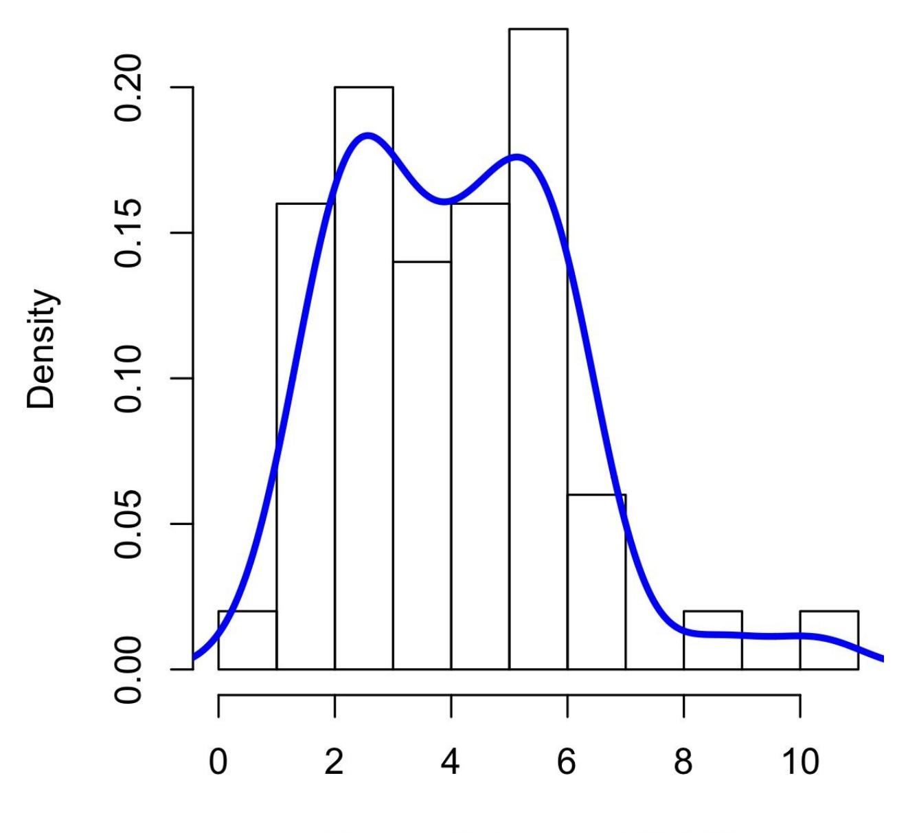

*Figure 1-4. Density of state murder rates*

#### **KEY IDEAS**

- A frequency histogram plots frequency counts on the y-axis and variable values on the x-axis; it gives a sense of the distribution of the data at a glance.
- A frequency table is a tabular version of the frequency counts found in a histogram.
- A boxplot with the top and bottom of the box at the 75th and 25th percentiles, respectively also gives a quick sense of the distribution of the data; it is often used in side-by-side displays to compare distributions.

A density plot is a smoothed version of a histogram; it requires a function to estimate a plot based on the data (multiple estimates are possible, of course).

### <span id="page-58-1"></span>**Further Reading**

- A SUNY Oswego professor provides a [step-by-step](http://www.oswego.edu/~srp/stats/bp_con.htm) guide to creating a boxplot.
- Density estimation in R is covered in Henry Deng and Hadley [Wickham's](http://vita.had.co.nz/papers/density-estimation.pdf) paper of the same name.
- R-Bloggers has a useful post on [histograms](http://www.r-bloggers.com/basics-of-histograms/) in R, including customization elements, such as binning (breaks)
- <span id="page-58-0"></span>R-Bloggers also has [similar](http://www.r-bloggers.com/box-plot-with-r-tutorial/) post on boxplots in R.

# <span id="page-59-6"></span>**Exploring Binary and Categorical Data**

For categorical data, simple proportions or percentages tell the story of the data.

#### <span id="page-59-4"></span><span id="page-59-3"></span><span id="page-59-2"></span><span id="page-59-1"></span>**KEY TERMS FOR EXPLORING CATEGORICAL DATA**

#### *Mode*

The most commonly occurring category or value in a data set.

#### *Expected value*

When the categories can be associated with a numeric value, this gives an average value based on a category's probability of occurrence.

#### *Bar charts*

The frequency or proportion for each category plotted as bars.

#### *Pie charts*

The frequency or proportion for each category plotted as wedges in a pie.

Getting a summary of a binary variable or a categorical variable with a few categories is a fairly easy matter: we just figure out the proportion of 1s, or of the important categories. For example, [Table](#page-59-0) 1-6 shows the percentage of delayed flights by the cause of delay at Dallas/Fort Worth airport since 2010. Delays are categorized as being due to factors under carrier control, air traffic control (ATC) system delays, weather, security, or a late inbound aircraft.

<span id="page-59-5"></span><span id="page-59-0"></span>

| Table<br>1-6.<br>Percentage<br>of<br>delays<br>by<br>cause<br>at<br>Dallas-Fort<br>Worth<br>airport |       |         |          |         |  |
|-----------------------------------------------------------------------------------------------------|-------|---------|----------|---------|--|
| Carrier                                                                                             | ATC   | Weather | Security | Inbound |  |
| 23.02                                                                                               | 30.40 | 4.03    | 0.12     | 42.43   |  |

Bar charts are a common visual tool for displaying a single categorical variable, often seen in the popular press. Categories are listed on the x-axis, and frequencies or proportions on the y-axis. [Figure](#page-60-0) 1-5 shows the airport delays per year by cause for Dallas/Fort Worth, and it is produced with the R function barplot:

<span id="page-60-0"></span><pre>barplot(as.matrix(dfw)/6, cex.axis=.5)</pre>

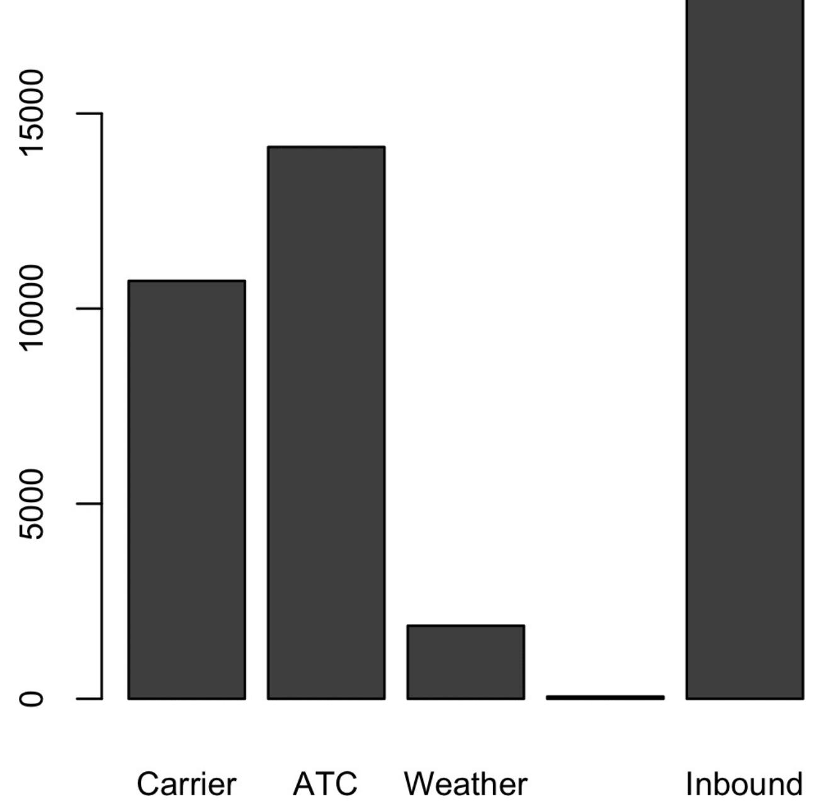

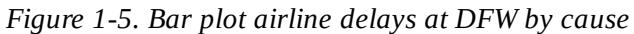

Note that a bar chart resembles a histogram; in a bar chart the x-axis represents different categories of a factor variable, while in a histogram the x-axis represents values of a single variable on a numeric scale. In a histogram, the bars are typically shown touching each other, with gaps indicating values that did not occur

in the data. In a bar chart, the bars are shown separate from one another.

Pie charts are an alternative to bar charts, although statisticians and data visualization experts generally eschew pie charts as less visually informative (see [\[Few-2007\]](#page-490-4)).

### <span id="page-63-0"></span>**NUMERICAL DATA AS CATEGORICAL DATA**

In "Frequency Table and [Histograms",](#page-49-1) we looked at frequency tables based on binning the data. This implicitly converts the numeric data to an ordered factor. In this sense, histograms and bar charts are similar, except that the categories on the x-axis in the bar chart are not ordered. Converting numeric data to categorical data is an important and widely used step in data analysis since it reduces the complexity (and size) of the data. This aids in the discovery of relationships between features, particularly at the initialstages of an analysis.

### <span id="page-64-1"></span>**Mode**

<span id="page-64-0"></span>The mode is the value — or values in case of a tie — that appears most often in the data. For example, the mode of the cause of delay at Dallas/Fort Worth airport is "Inbound." As another example, in most parts of the United States, the mode for religious preference would be Christian. The mode is a simple summary statistic for categorical data, and it is generally not used for numeric data.

### <span id="page-65-3"></span>**Expected Value**

<span id="page-65-0"></span>A special type of categorical data is data in which the categories represent or can be mapped to discrete values on the same scale. A marketer for a new cloud technology, for example, offers two levels of service, one priced at \$300/month and another at \$50/month. The marketer offers free webinars to generate leads, and the firm figures that 5% of the attendees will sign up for the \$300 service, 15% for the \$50 service, and 80% will not sign up for anything. This data can be summed up, for financial purposes, in a single "expected value," which is a form of weighted mean in which the weights are probabilities.

The expected value is calculated as follows:

- <span id="page-65-1"></span>1. Multiply each outcome by its probability of occurring.
- 2. Sum these values.

In the cloud service example, the expected value of a webinar attendee is thus \$22.50 per month, calculated as follows:

The expected value is really a form of weighted mean: it adds the ideas of future expectations and probability weights, often based on subjective judgment. Expected value is a fundamental concept in business valuation and capital budgeting — for example, the expected value of five years of profits from a new acquisition, or the expected cost savings from new patient management software at a clinic.

### <span id="page-65-2"></span>**KEY IDEAS**

- Categorical data is typically summed up in proportions, and can be visualized in a bar chart.
- Categories might represent distinct things (apples and oranges, male and female), levels of a factor variable (low, medium, and high), or numeric data that has been binned.
- Expected value is the sum of values times their probability of occurrence, often used to sum up factor variable levels.

### <span id="page-66-1"></span>**Further Reading**

<span id="page-66-0"></span>No statistics course is complete without a lesson on [misleading](http://passyworldofmathematics.com/misleading-graphs/) graphs, which often involve bar charts and pie charts.

### <span id="page-67-0"></span>**Correlation**

Exploratory data analysis in many modeling projects (whether in data science or in research) involves examining correlation among predictors, and between predictors and a target variable. Variables X and Y (each with measured data) are said to be positively correlated if high values of X go with high values of Y, and low values of X go with low values of Y. If high values of X go with low values of Y, and vice versa, the variables are negatively correlated.

#### <span id="page-67-3"></span><span id="page-67-2"></span><span id="page-67-1"></span>**KEY TERMS FOR CORRELATION**

#### *Correlation coefficient*

A metric that measures the extent to which numeric variables are associated with one another (ranges from –1 to +1).

#### *Correlation matrix*

<span id="page-67-4"></span>A table where the variables are shown on both rows and columns, and the cell values are the correlations between the variables.

#### *Scatterplot*

<span id="page-67-5"></span>A plot in which the x-axis is the value of one variable, and the y-axis the value of another.

Consider these two variables, perfectly correlated in the sense that each goes from low to high:

- v1: {1, 2, 3}
- v2: {4, 5, 6}

The vector sum of products is 4 + 10 + 18 = 32. Now try shuffling one of them and recalculating — the vector sum of products will never be higher than 32. So this sum of products could be used as a metric; that is, the observed sum of 32 could be compared to lots of random shufflings (in fact, this idea relates to a resampling-based estimate: see ["Permutation](#page-170-0) Test"). Values produced by this metric, though, are not that meaningful, except by reference to the resampling distribution.

More useful is a standardized variant: the *correlation coefficient*, which gives an estimate of the correlation between two variables that always lies on the same

<span id="page-68-3"></span><span id="page-68-1"></span>scale. To compute *Pearson's correlation coefficient*, we multiply deviations from the mean for variable 1 times those for variable 2, and divide by the product of the standard deviations:

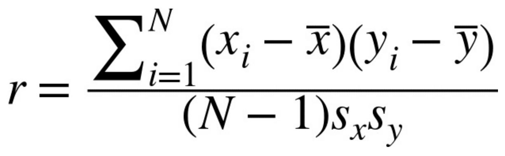

Note that we divide by *n* – 1 instead of *n*; see "Degrees of Freedom, and *n* or *n* – 1?" for more details. The [correlation](#page-39-0) coefficient always lies between +1 (perfect positive correlation) and –1 (perfect negative correlation); 0 indicates no correlation.

Variables can have an association that is not linear, in which case the correlation coefficient may not be a useful metric. The relationship between tax rates and revenue raised is an example: as tax rates increase from 0, the revenue raised also increases. However, once tax rates reach a high level and approach 100%, tax avoidance increases and tax revenue actually declines.

[Table](#page-68-0) 1-7, called a *correlation matrix*, shows the correlation between the daily returns for telecommunication stocks from July 2012 through June 2015. From the table, you can see that Verizon (VZ) and ATT (T) have the highest correlation. Level Three (LVLT), which is an infrastructure company, has the lowest correlation. Note the diagonal of 1s (the correlation of a stock with itself is 1), and the redundancy of the information above and below the diagonal.

<span id="page-68-2"></span><span id="page-68-0"></span>

| Table<br>1-7.<br>Correlation<br>between<br>telecommunication<br>stock<br>returns |       |       |       |       |       |
|----------------------------------------------------------------------------------|-------|-------|-------|-------|-------|
|                                                                                  | T     | CTL   | FTR   | VZ    | LVLT  |
| T                                                                                | 1.000 | 0.475 | 0.328 | 0.678 | 0.279 |
| CTL                                                                              | 0.475 | 1.000 | 0.420 | 0.417 | 0.287 |
| FTR                                                                              | 0.328 | 0.420 | 1.000 | 0.287 | 0.260 |

VZ 0.678 0.417 0.287 1.000 0.242 LVLT 0.279 0.287 0.260 0.242 1.000

<span id="page-69-0"></span>A table of correlations like [Table](#page-68-0) 1-7 is commonly plotted to visually display the relationship between multiple variables. [Figure](#page-69-0) 1-6 shows the correlation between the daily returns for major exchange traded funds (ETFs). In R, we can easily create this using the package corrplot:

```
etfs <- sp500_px[row.names(sp500_px)>"2012-07-01",
                 sp500_sym[sp500_sym$sector=="etf", 'symbol']]
library(corrplot)
corrplot(cor(etfs), method = "ellipse")
```

The ETFs for the S&P 500 (SPY) and the Dow Jones Index (DIA) have a high correlation. Similary, the QQQ and the XLK, composed mostly of technology companies, are postively correlated. Defensive ETFs, such as those tracking gold prices (GLD), oil prices (USO), or market volatility (VXX) tend to be negatively correlated with the other ETFs. The orientation of the ellipse indicates whether two variables are positively correlated (ellipse is pointed right) or negatively correlated (ellipse is pointed left). The shading and width of the ellipse indicate the strength of the association: thinner and darker ellipses correspond to stronger relationships.

<span id="page-69-1"></span>Like the mean and standard deviation, the correlation coefficient is sensitive to outliers in the data. Software packages offer robust alternatives to the classical correlation coefficient. For example, the R function cor has a trim argument similar to that for computing a trimmed mean (see [\[R-base-2015\]](#page-491-2)).

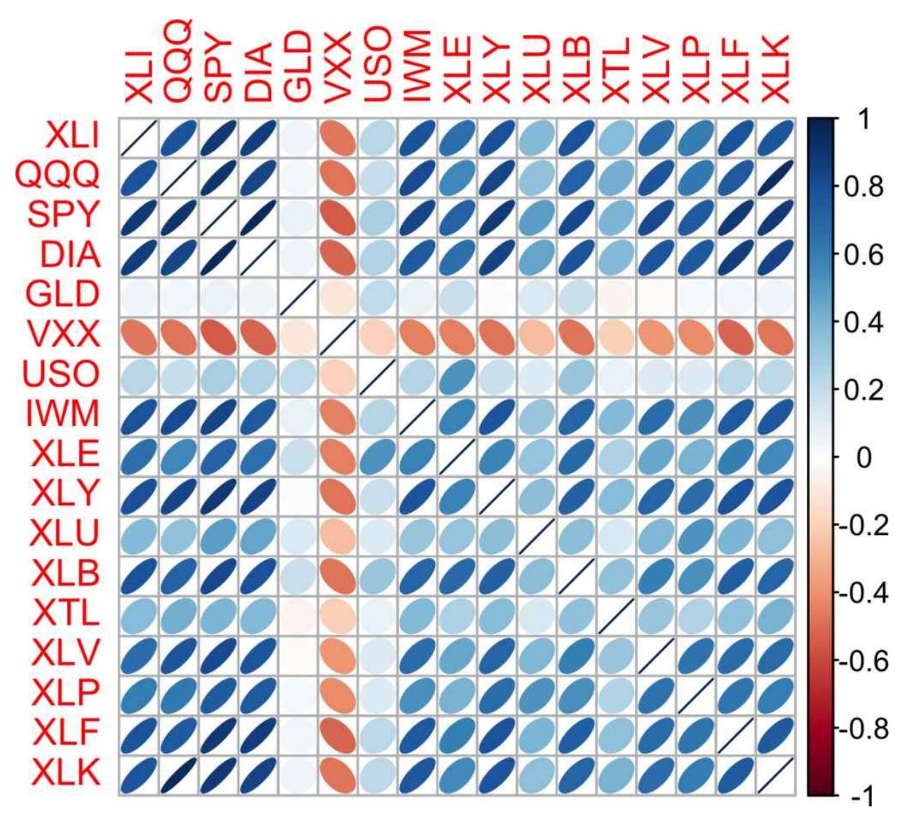

*Figure 1-6. Correlation between ETF returns*

### <span id="page-71-0"></span>**OTHER CORRELATION ESTIMATES**

Statisticians have long ago proposed other types of correlation coefficients, such as *Spearman's rho* or *Kendall's tau*. These are correlation coefficients based on the rank of the data. Since they work with ranks rather than values, these estimates are robust to outliers and can handle certain types of nonlinearities. However, data scientists can generally stick to Pearson's correlation coefficient, and its robust alternatives, for exploratory analysis. The appeal of rankbased estimates is mostly for smaller data sets and specific hypothesis tests.

### <span id="page-72-0"></span>**Scatterplots**

The standard way to visualize the relationship between two measured data variables is with a scatterplot. The x-axis represents one variable, the y-axis another, and each point on the graph is a record. See [Figure](#page-72-0) 1-7 for a plot between the daily returns for ATT and Verizon. This is produced in R with the command:

```
plot(telecom$T, telecom$VZ, xlab="T", ylab="VZ")
```

The returns have a strong positive relationship: on most days, both stocks go up or go down in tandem. There are very few days where one stock goes down significantly while the other stock goes up (and vice versa).

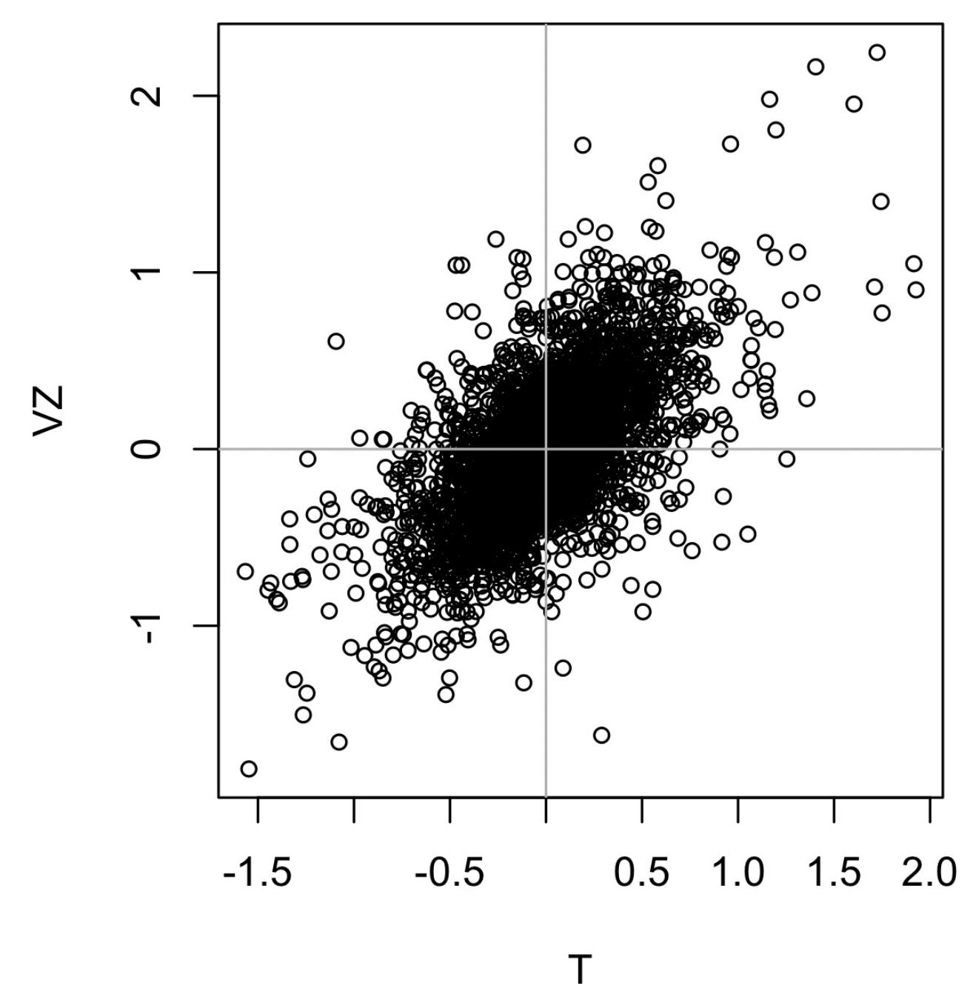

*Figure 1-7. Scatterplot between returns for ATT and Verizon*

#### **KEY IDEAS FOR CORRELATION**

- <span id="page-73-0"></span>The correlation coefficient measures the extent to which two variables are associated with one another.
- When high values of v1 go with high values of v2, v1 and v2 are positively associated.
- When high values of v1 are associated with low values of v2, v1 and v2 are negatively associated.

- The correlation coefficient is a standardized metric so that it always ranges from –1 (perfect negative correlation) to +1 (perfect positive correlation).
- A correlation coefficient of 0 indicates no correlation, but be aware that random arrangements of data will produce both positive and negative values for the correlation coefficient just by chance.

### <span id="page-75-1"></span>**Further Reading**

<span id="page-75-0"></span>*Statistics*, 4th ed., by David Freedman, Robert Pisani, and Roger Purves (W. W. Norton, 2007), has an excellent discussion of correlation.

### <span id="page-76-6"></span>**Exploring Two or More Variables**

Familiar estimators like mean and variance look at variables one at a time (*univariate analysis*). Correlation analysis (see ["Correlation"](#page-67-0)) is an important method that compares two variables (*bivariate analysis*). In this section we look at additional estimates and plots, and at more than two variables (*multivariate analysis*).

### <span id="page-76-5"></span><span id="page-76-4"></span><span id="page-76-3"></span><span id="page-76-2"></span><span id="page-76-1"></span><span id="page-76-0"></span>**KEY TERMS FOR EXPLORING TWO OR MORE VARIABLES**

### *Contingency tables*

A tally of counts between two or more categorical variables.

### *Hexagonal binning*

A plot of two numeric variables with the records binned into hexagons.

### *Contour plots*

A plot showing the density of two numeric variables like a topographical map.

*Violin plots*

Similar to a boxplot but showing the density estimate.

Like univariate analysis, bivariate analysis involves both computing summary statistics and producing visual displays. The appropriate type of bivariate or multivariate analysis depends on the nature of the data: numeric versus categorical.

### <span id="page-77-1"></span>**Hexagonal Binning and Contours (Plotting Numeric versus Numeric Data)**

<span id="page-77-0"></span>Scatterplots are fine when there is a relatively small number of data values. The plot of stock returns in [Figure](#page-72-0) 1-7 involves only about 750 points. For data sets with hundreds of thousands or millions of records, a scatterplot will be too dense, so we need a different way to visualize the relationship. To illustrate, consider the data set kc\_tax, which contains the tax-assessed values for residential properties in King County, Washington. In order to focus on the main part of the data, we strip out very expensive and very small or large residences using the subset function:

```
kc_tax0 <- subset(kc_tax, TaxAssessedValue < 750000 & SqFtTotLiving>100 &
                  SqFtTotLiving<3500)
nrow(kc_tax0)
[1] 432733
```

[Figure](#page-78-0) 1-8 is a *hexagon binning* plot of the relationship between the finished square feet versus the tax-assessed value for homes in King County. Rather than plotting points, which would appear as a monolithic dark cloud, we grouped the records into hexagonal bins and plotted the hexagons with a color indicating the number of records in that bin. In this chart, the positive relationship between square feet and tax-assessed value is clear. An interesting feature is the hint of a second cloud above the main cloud, indicating homes that have the same square footage as those in the main cloud, but a higher tax-assessed value.

[Figure](#page-78-0) 1-8 was generated by the powerful R package ggplot2, developed by Hadley Wickham [\[ggplot2\]](#page-490-5). ggplot2 is one of several new software libraries for advanced exploratory visual analysis of data; see ["Visualizing](#page-87-0) Multiple Variables".

```
ggplot(kc_tax0, (aes(x=SqFtTotLiving, y=TaxAssessedValue))) +
  stat_binhex(colour="white") +
  theme_bw() +
  scale_fill_gradient(low="white", high="black") +
  labs(x="Finished Square Feet", y="Tax Assessed Value")
```

<span id="page-78-0"></span>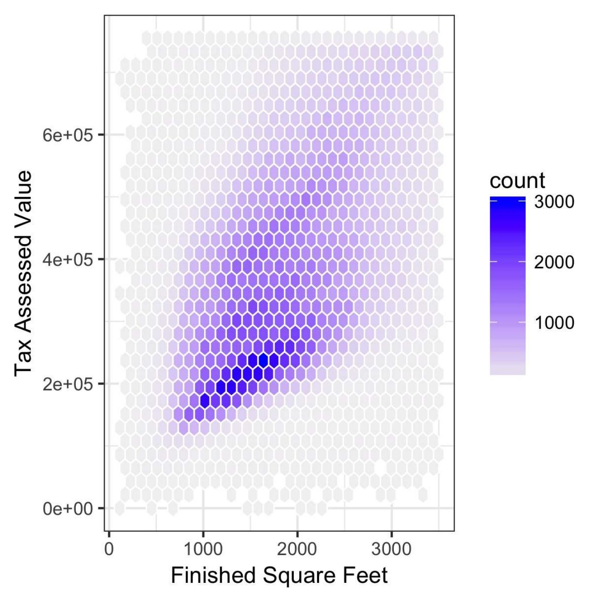

<span id="page-78-1"></span>*Figure 1-8. Hexagonal binning for tax-assessed value versus finished square feet*

[Figure](#page-79-0) 1-9 uses contours overlaid on a scatterplot to visualize the relationship between two numeric variables. The contours are essentially a topographical map to two variables; each contour band represents a specific density of points, increasing as one nears a "peak." This plot shows a similar story as [Figure](#page-78-0) 1-8: there is a secondary peak "north" of the main peak. This chart was also created using ggplot2 with the built-in geom\_density2d function.

```
ggplot(kc_tax0, aes(SqFtTotLiving, TaxAssessedValue)) +
  theme_bw() +
  geom_point( alpha=0.1) +
  geom_density2d(colour="white") +
  labs(x="Finished Square Feet", y="Tax Assessed Value")
```

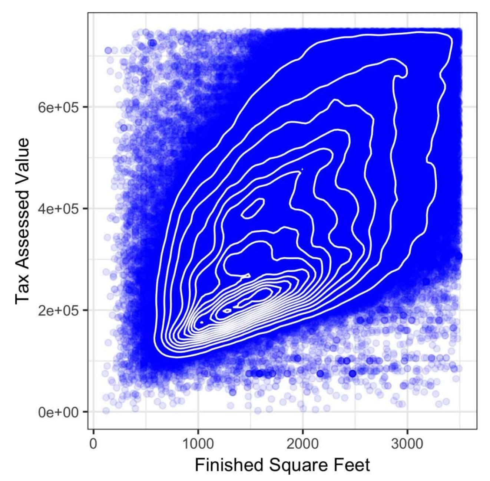

<span id="page-80-0"></span>*Figure 1-9. Contour plot for tax-assessed value versus finished square feet*

Other types of charts are used to show the relationship between two numeric variables, including *heat maps*. Heat maps, hexagonal binning, and contour plots all give a visual representation of a two-dimensional density. In this way, they are natural analogs to histograms and density plots.

### <span id="page-81-4"></span>**Two Categorical Variables**

<span id="page-81-2"></span><span id="page-81-1"></span>A useful way to summarize two categorical variables is a contingency table — a table of counts by category. [Table](#page-81-0) 1-8 shows the contingency table between the grade of a personal loan and the outcome of that loan. This is taken from data provided by Lending Club, a leader in the peer-to-peer lending business. The grade goes from A (high) to G (low). The outcome is either paid off, current, late, or charged off (the balance of the loan is not expected to be collected). This table shows the count and row percentages. High-grade loans have a very low late/charge-off percentage as compared with lower-grade loans. Contingency tables can look at just counts, or also include column and total percentages. Pivot tables in Excel are perhaps the most common tool used to create contingency tables. In R, the CrossTable function in the descr package produces contingency tables, and the following code was used to create [Table](#page-81-0) 1-8:

<span id="page-81-3"></span>library(descr) x\_tab <- CrossTable(lc\_loans\$grade, lc\_loans\$status, prop.c=**FALSE**, prop.chisq=**FALSE**, prop.t=**FALSE**)

| Grade | Fully<br>paid | Current | Late  | Charged<br>off | Total  |
|-------|---------------|---------|-------|----------------|--------|
| A     | 20715         | 52058   | 494   | 1588           | 74855  |
|       | 0.277         | 0.695   | 0.007 | 0.021          | 0.161  |
| B     | 31782         | 97601   | 2149  | 5384           | 136916 |
|       | 0.232         | 0.713   | 0.016 | 0.039          | 0.294  |
| C     | 23773         | 92444   | 2895  | 6163           | 125275 |
|       | 0.190         | 0.738   | 0.023 | 0.049          | 0.269  |
| D     | 14036         | 55287   | 2421  | 5131           | 76875  |
|       | 0.183         | 0.719   | 0.031 | 0.067          | 0.165  |
| E     | 6089          | 25344   | 1421  | 2898           | 35752  |
|       | 0.170         | 0.709   | 0.040 | 0.081          | 0.077  |

### <span id="page-81-0"></span>*Table 1-8. Contingency table of loan grade and status*

| F     | 2376  | 8675   | 621   | 1556  | 13228  |
|-------|-------|--------|-------|-------|--------|
|       | 0.180 | 0.656  | 0.047 | 0.118 | 0.028  |
| G     | 655   | 2042   | 206   | 419   | 3322   |
|       | 0.197 | 0.615  | 0.062 | 0.126 | 0.007  |
| Total | 99426 | 333451 | 10207 | 23139 | 466223 |

### <span id="page-83-2"></span>**Categorical and Numeric Data**

<span id="page-83-1"></span>Boxplots (see ["Percentiles](#page-46-0) and Boxplots") are a simple way to visually compare the distributions of a numeric variable grouped according to a categorical variable. For example, we might want to compare how the percentage of flight delays varies across airlines. [Figure](#page-83-0) 1-10 shows the percentage of flights in a month that were delayed where the delay was within the carrier's control.

<span id="page-83-0"></span>boxplot(pct\_delay ~ airline, data=airline\_stats, ylim=c(0, 50))

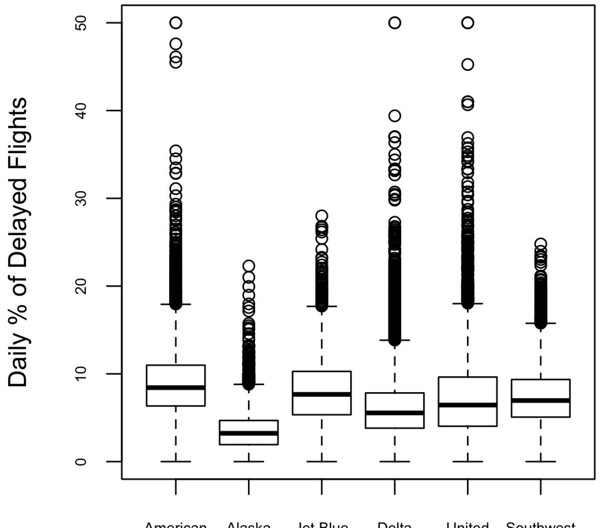

<span id="page-84-1"></span><span id="page-84-0"></span>*Figure 1-10. Boxplot of percent of airline delays by carrier*

Alaska stands out as having the fewest delays, while American has the most delays: the lower quartile for American is higher than the upper quartile for Alaska.

A *violin plot*, introduced by [\[Hintze-Nelson-1998\],](#page-490-6) is an enhancement to the boxplot and plots the density estimate with the density on the y-axis. The density is mirrored and flipped over and the resulting shape is filled in, creating an image resembling a violin. The advantage of a violin plot is that it can show nuances in the distribution that aren't perceptible in a boxplot. On the other hand, the boxplot more clearly shows the outliers in the data. In ggplot2, the function geom\_violin

<span id="page-85-0"></span>can be used to create a violin plot as follows:

```
ggplot(data=airline_stats, aes(airline, pct_carrier_delay)) +
  ylim(0, 50) +
  geom_violin() +
  labs(x="", y="Daily % of Delayed Flights")
```

The corresponding plot is shown in [Figure](#page-85-0) 1-11. The violin plot shows a concentration in the distribution near zero for Alaska, and to a lesser extent, Delta. This phenomenon is not as obvious in the boxplot. You can combine a violin plot with a boxplot by adding geom\_boxplot to the plot (although this is best when colors are used).

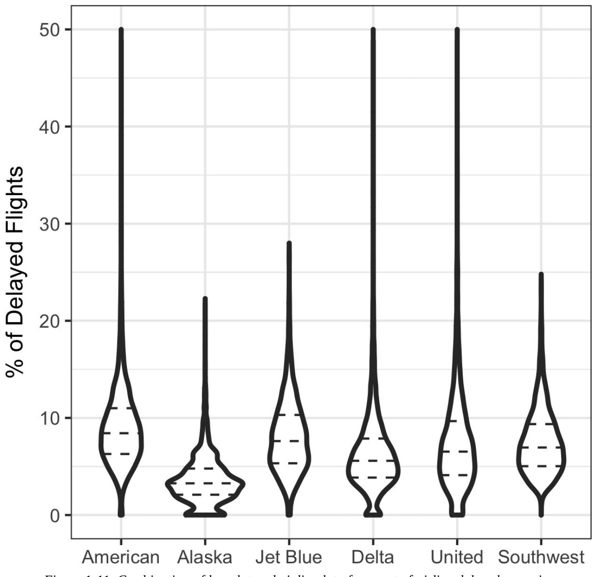

*Figure 1-11. Combination of boxplot and violin plot of percent of airline delays by carrier*

### <span id="page-87-0"></span>**Visualizing Multiple Variables**

<span id="page-87-1"></span>The types of charts used to compare two variables — scatterplots, hexagonal binning, and boxplots — are readily extended to more variables through the notion of *conditioning*. As an example, look back at [Figure](#page-78-0) 1-8, which showed the relationship between homes' finished square feet and tax-assessed values. We observed that there appears to be a cluster of homes that have higher tax-assessed value per square foot. Diving deeper, [Figure](#page-87-0) 1-12 accounts for the effect of location by plotting the data for a set of zip codes. Now the picture is much clearer: tax-assessed value is much higher in some zip codes (98112, 98105) than in others (98108, 98057). This disparity gives rise to the clusters observed in [Figure](#page-78-0) 1-8.

We created [Figure](#page-87-0) 1-12 using ggplot2 and the idea of *facets*, or a conditioning variable (in this case zip code):

```
ggplot(subset(kc_tax0, ZipCode %in% c(98188, 98105, 98108, 98126)),
         aes(x=SqFtTotLiving, y=TaxAssessedValue)) +
  stat_binhex(colour="white") +
  theme_bw() +
  scale_fill_gradient( low="white", high="blue") +
  labs(x="Finished Square Feet", y="Tax Assessed Value") +
  facet_wrap("ZipCode")
```

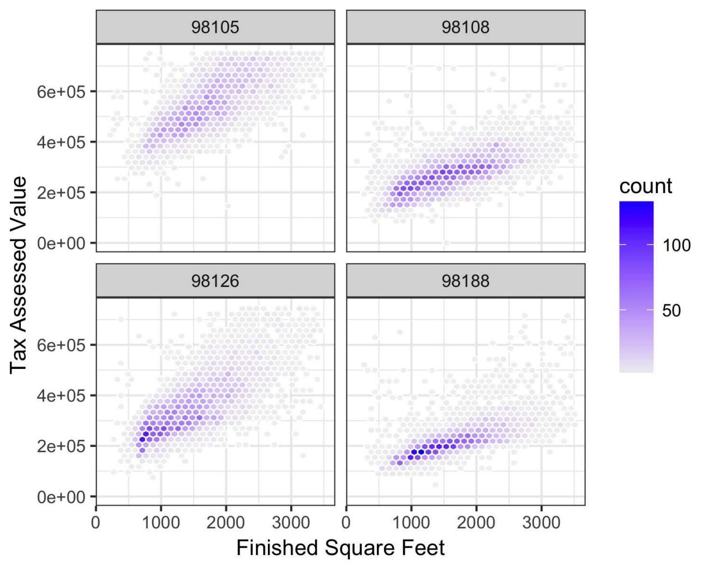

<span id="page-88-0"></span>*Figure 1-12. Tax-assessed value versus finished square feet by zip code*

<span id="page-88-1"></span>The concept of conditioning variables in a graphics system was pioneered with *Trellis graphics*, developed by Rick Becker, Bill Cleveland, and others at Bell Labs [\[Trellis-Graphics\]](#page-491-3). This idea has propogated to various modern graphics systems, such as the lattice ([\[lattice\]](#page-491-4)) and ggplot2 packages in R and the Seaborn ([\[seaborne\]](#page-491-5)) and Bokeh [\(\[bokeh\]](#page-490-7)) modules in Python. Conditioning variables are also integral to business intelligence platforms such as Tableau and Spotfire. With the advent of vast computing power, modern visualization platforms have moved well beyond the humble beginnings of exploratory data analysis. However, key concepts and tools developed over the years still form a foundation for these systems.

- Hexagonal binning and contour plots are useful tools that permit graphical examination of two numeric variables at a time, without being overwhelmed by huge amounts of data.
- Contingency tables are the standard tool for looking at the counts of two categorical variables.
- Boxplots and violin plots allow you to plot a numeric variable against a categorical variable.

### <span id="page-90-0"></span>**Further Reading**

- *Modern Data Science with R*, by Benjamin Baumer, Daniel Kaplan, and Nicholas Horton (CRC Press, 2017), has an excellent presentation of "a grammar for graphics" (the "gg" in ggplot).
- *Ggplot2: Elegant Graphics for Data Analysis*, by Hadley Wickham, is an excellent resource from the creator of ggplot2 (Springer, 2009).
- Josef Fruehwald has a web-based tutorial on [ggplot2](http://www.ling.upenn.edu/~joseff/avml2012/).

### <span id="page-91-2"></span>**Summary**

<span id="page-91-1"></span>With the development of exploratory data analysis (EDA), pioneered by John Tukey, statistics set a foundation that was a precursor to the field of data science. The key idea of EDA is that the first and most important step in any project based on data is to *look at the data*. By summarizing and visualizing the data, you can gain valuable intuition and understanding of the project.

<span id="page-91-0"></span>This chapter has reviewed concepts ranging from simple metrics, such as estimates of location and variability, to rich visual displays to explore the relationships between multiple variables, as in [Figure](#page-87-0) 1-12. The diverse set of tools and techniques being developed by the open source community, combined with the expressiveness of the R and Python languages, has created a plethora of ways to explore and analyze data. Exploratory analysis should be a cornerstone of any data science project.

# <span id="page-92-2"></span>**Chapter 2. Data and Sampling Distributions**

<span id="page-92-0"></span>A popular misconception holds that the era of big data means the end of a need for sampling. In fact, the proliferation of data of varying quality and relevance reinforces the need for sampling as a tool to work efficiently with a variety of data and to minimize bias. Even in a big data project, predictive models are typically developed and piloted with samples. Samples are also used in tests of various sorts (e.g., pricing, web treatments).

<span id="page-92-1"></span>[Figure](#page-93-0) 2-1 shows a schematic that underpins the concepts in this chapter. The lefthand side represents a population that, in statistics, is assumed to follow an underlying but *unknown* distribution. The only thing available is the *sample* data and its empirical distribution, shown on the righthand side. To get from the lefthand side to the righthand side, a *sampling* procedure is used (represented by dashed arrows). Traditional statistics focused very much on the lefthand side, using theory based on strong assumptions about the population. Modern statistics has moved to the righthand side, where such assumptions are not needed.

<span id="page-93-0"></span>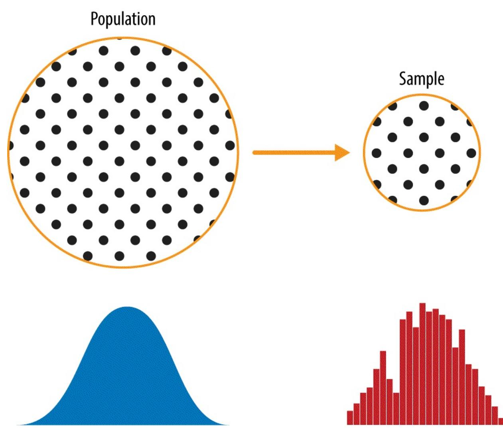

*Figure 2-1. Population versus sample*

In general, data scientists need not worry about the theoretical nature of the lefthand side, and instead should focus on the sampling procedures and the data at hand. There are some notable exceptions. Sometimes data is generated from a physical process that can be modeled. The simplest example is flipping a coin: this follows a binomial distribution. Any real-life binomial situation (buy or don't buy, fraud or no fraud, click or don't click) can be modeled effectively by a coin (with modified probability of landing heads, of course). In these cases, we can gain additional insight by using our understanding of the population.

### <span id="page-94-7"></span>**Random Sampling and Sample Bias**

<span id="page-94-1"></span>A *sample* is a subset of data from a larger data set; statisticians call this larger data set the *population*. A population in statistics is not the same thing as in biology — it is a large, defined but sometimes theoretical or imaginary, set of data.

#### <span id="page-94-6"></span><span id="page-94-0"></span>**KEY TERMS FOR RANDOM SAMPLING**

#### *Sample*

A subset from a larger data set.

#### *Population*

The larger data set or idea of a data set.

#### *N (n)*

The size of the population (sample).

#### *Random sampling*

Drawing elements into a sample at random.

*Stratified sampling* Dividing the population into strata and randomly sampling from each strata.

#### *Simple random sample*

<span id="page-94-5"></span>The sample that results from random sampling without stratifying the population.

#### *Sample bias*

<span id="page-94-4"></span><span id="page-94-2"></span>A sample that misrepresents the population.

*Random sampling* is a process in which each available member of the population being sampled has an equal chance of being chosen for the sample at each draw. The sample that results is called a *simple random sample*. Sampling can be done *with replacement*, in which observations are put back in the population after each draw for possible future reselection. Or it can be done *without replacement*, in which case observations, once selected, are unavailable for future draws.

<span id="page-94-3"></span>Data quality often matters more than data quantity when making an estimate or a model based on a sample. Data quality in data science involves completeness, consistency of format, cleanliness, and accuracy of individual data points. Statistics adds the notion of *representativeness*.

<span id="page-95-2"></span><span id="page-95-1"></span>The classic example is the *Literary Digest* poll of 1936 that predicted a victory of Al Landon against Franklin Roosevelt. The *Literary Digest*, a leading periodical of the day, polled its entire subscriber base, plus additional lists of individuals, a total of over 10 million, and predicted a landslide victory for Landon. George Gallup, founder of the Gallup Poll, conducted biweekly polls of just 2,000, and accurately predicted a Roosevelt victory. The difference lay in the selection of those polled.

<span id="page-95-3"></span><span id="page-95-0"></span>The *Literary Digest* opted for quantity, paying little attention to the method of selection. They ended up polling those with relatively high socioeconomic status (their own subscribers, plus those who, by virtue of owning luxuries like telephones and automobiles, appeared in marketers' lists). The result was *sample bias*; that is, the sample was different in some meaningful nonrandom way from the larger population it was meant to represent. The term *nonrandom* is important — hardly any sample, including random samples, will be exactly representative of the population. Sample bias occurs when the difference is meaningful, and can be expected to continue for other samples drawn in the same way as the first.

### <span id="page-96-0"></span>**SELF-SELECTION SAMPLING BIAS**

The reviews of restaurants, hotels, cafes, and so on that you read on social media sites like Yelp are prone to bias because the people submitting them are not randomly selected; rather, they themselves have taken the initiative to write. This leads to self-selection bias — the people motivated to write reviews may be those who had poor experiences, may have an association with the establishment, or may simply be a different type of person from those who do not write reviews. Note that while self-selection samples can be unreliable indicators of the true state of affairs, they may be more reliable in simply comparing one establishment to a similar one; the same self-selection bias might apply to each.

### <span id="page-97-2"></span>**Bias**

Statistical bias refers to measurement or sampling errors that are systematic and produced by the measurement or sampling process. An important distinction should be made between errors due to random chance, and errors due to bias. Consider the physical process of a gun shooting at a target. It will not hit the absolute center of the target every time, or even much at all. An unbiased process will produce error, but it is random and does not tend strongly in any direction (see [Figure](#page-97-0) 2-2). The results shown in [Figure](#page-98-0) 2-3 show a biased process — there is still random error in both the x and y direction, but there is also a bias. Shots tend to fall in the upper-right quadrant.

<span id="page-97-1"></span><span id="page-97-0"></span>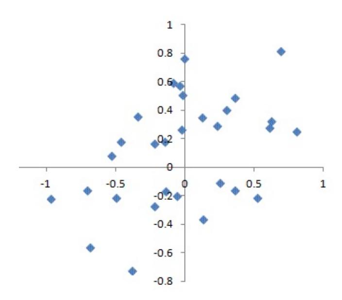

*Figure 2-2. Scatterplot of shots from a gun with true aim*

<span id="page-98-0"></span>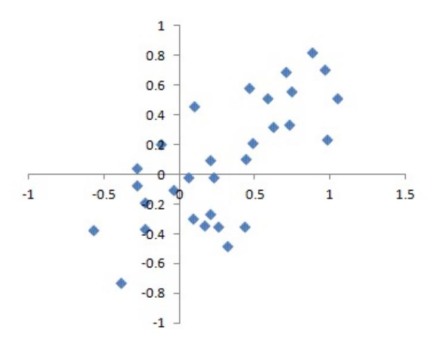

*Figure 2-3. Scatterplot of shots from a gun with biased aim*

Bias comes in different forms, and may be observable or invisible. When a result does suggest bias (e.g., by reference to a benchmark or actual values), it is often an indicator that a statistical or machine learning model has been misspecified, or an important variable left out.

### <span id="page-99-3"></span>**Random Selection**

To avoid the problem of sample bias that led the *Literary Digest* to predict Landon over Roosevelt, George Gallup (shown in [Figure](#page-99-0) 2-4) opted for more scientifically chosen methods to achieve a sample that was representative of the US voter. There are now a variety of methods to achieve representativeness, but at the heart of all of them lies *random sampling*.

<span id="page-99-1"></span><span id="page-99-0"></span>

*Figure 2-4. George Gallup, catapulted to fame by the Literary Digest's "big data" failure*

Random sampling is not always easy. Proper definition of an accessible population is key. Suppose we want to generate a representative profile of customers and we need to conduct a pilot customer survey. The survey needs to be representative but is labor intensive.

First we need to define who a customer is. We might select all customer records where purchase amount > 0. Do we include all past customers? Do we include refunds? Internal test purchases? Resellers? Both billing agent and customer?

Next we need to specify a sampling procedure. It might be "select 100 customers at random." Where a sampling from a flow is involved (e.g., real-time customer transactions or web visitors), timing considerations may be important (e.g., a web visitor at 10 a.m. on a weekday may be different from a web visitor at 10 p.m. on a weekend).

In *stratified sampling*, the population is divided up into *strata*, and random samples are taken from each stratum. Political pollsters might seek to learn the electoral preferences of whites, blacks, and Hispanics. A simple random sample

### <span id="page-99-2"></span>[www.allitebooks.com](http://www.allitebooks.org)

taken from the population would yield too few blacks and Hispanics, so those strata could be overweighted in stratified sampling to yield equivalent sample sizes.

### <span id="page-101-4"></span>**Size versus Quality: When Does Size Matter?**

<span id="page-101-2"></span>In the era of big data, it is sometimes surprising that smaller is better. Time and effort spent on random sampling not only reduce bias, but also allow greater attention to data exploration and data quality. For example, missing data and outliers may contain useful information. It might be prohibitively expensive to track down missing values or evaluate outliers in millions of records, but doing so in a sample of several thousand records may be feasible. Data plotting and manual inspection bog down if there is too much data.

So when *are* massive amounts of data needed?

<span id="page-101-3"></span><span id="page-101-0"></span>The classic scenario for the value of big data is when the data is not only big, but sparse as well. Consider the search queries received by Google, where columns are terms, rows are individual search queries, and cell values are either 0 or 1, depending on whether a query contains a term. The goal is to determine the best predicted search destination for a given query. There are over 150,000 words in the English language, and Google processes over 1 trillion queries per year. This yields a huge matrix, the vast majority of whose entries are "0."

This is a true big data problem — only when such enormous quantities of data are accumulated can effective search results be returned for most queries. And the more data accumulates, the better the results. For popular search terms this is not such a problem — effective data can be found fairly quickly for the handful of extremely popular topics trending at a particular time. The real value of modern search technology lies in the ability to return detailed and useful results for a huge variety of search queries, including those that occur only with a frequency, say, of one in a million.

Consider the search phrase "Ricky Ricardo and Little Red Riding Hood." In the early days of the internet, this query would probably have returned results on Ricky Ricardo the band leader, the television show *I Love Lucy* in which he starred, and the children's story *Little Red Riding Hood*. Later, now that trillions of search queries have been accumulated, this search query returns the exact *I Love Lucy* episode in which Ricky narrates, in dramatic fashion, the Little Red Riding Hood story to his infant son in a comic mix of English and Spanish.

<span id="page-101-1"></span>Keep in mind that the number of actual *pertinent* records — ones in which this

exact search query, or something very similar, appears (together with information on what link people ultimately clicked on) — might need only be in the thousands to be effective. However, many trillions of data points are needed in order to obtain these pertinent records (and random sampling, of course, will not help). See also "Long-Tailed [Distributions"](#page-134-0).

### <span id="page-103-2"></span>**Sample Mean versus Population Mean**

<span id="page-103-1"></span>The symbol (pronounced x-bar) is used to represent the mean of a sample from a population, whereas is used to represent the mean of a population. Why make the distinction? Information about samples is observed, and information about large populations is often inferred from smaller samples. Statisticians like to keep the two things separate in the symbology.

#### <span id="page-103-0"></span>**KEY IDEAS**

- Even in the era of big data, random sampling remains an important arrow in the data scientist's quiver.
- Bias occurs when measurements or observations are systematically in error because they are not representative of the full population.
- Data quality is often more important than data quantity, and random sampling can reduce bias and facilitate quality improvement that would be prohibitively expensive.

### <span id="page-104-1"></span>**Further Reading**

- A useful review of sampling procedures can be found in Ronald Fricker's chapter "Sampling Methods for Web and E-mail Surveys," found in the *Sage Handbook of Online Research Methods*. This chapter includes a review of the modifications to random sampling that are often used for practical reasons of cost or feasibility.
- <span id="page-104-0"></span>The story of the *[Literary](http://www.capitalcentury.com/1935.html) Digest* poll failure can be found on the Capital Century website.

# <span id="page-105-2"></span>**Selection Bias**

To paraphrase Yogi Berra, "If you don't know what you're looking for, look hard enough and you'll find it."

Selection bias refers to the practice of selectively choosing data — consciously or unconsciously — in a way that that leads to a conclusion that is misleading or ephemeral.

#### <span id="page-105-1"></span><span id="page-105-0"></span>**KEY TERMS**

*Bias*

Systematic error.

#### *Data snooping*

Extensive hunting through data in search of something interesting.

### *Vast search effect*

Bias or nonreproducibility resulting from repeated data modeling, or modeling data with large numbers of predictor variables.

If you specify a hypothesis and conduct a well-designed experiment to test it, you can have high confidence in the conclusion. Such is often not the case, however. Often, one looks at available data and tries to discern patterns. But is the pattern for real, or just the product of *data snooping* — that is, extensive hunting through the data until something interesting emerges? There is a saying among statisticians: "If you torture the data long enough, sooner or later it will confess."

The difference between a phenomenon that you verify when you test a hypothesis using an experiment, versus a phenomenon that you discover by perusing available data, can be illuminated with the following thought experiment.

Imagine that someone tells you she can flip a coin and have it land heads on the next 10 tosses. You challenge her (the equivalent of an experiment), and she proceeds to toss it 10 times, all landing heads. Clearly you ascribe some special talent to her — the probability that 10 coin tosses will land heads just by chance is 1 in 1,000.

Now imagine that the announcer at a sports stadium asks the 20,000 people in attendance each to toss a coin 10 times, and report to an usher if they get 10 heads in a row. The chance that *somebody* in the stadium will get 10 heads is extremely high (more than 99% — it's 1 minus the probability that nobody gets 10 heads). Clearly, selecting, after the fact, the person (or persons) who gets 10 heads at the stadium does not indicate they have any special talent — it's most likely luck.

<span id="page-106-0"></span>Since repeated review of large data sets is a key value proposition in data science, selection bias is something to worry about. A form of selection bias of particular concern to data scientists is what John Elder (founder of Elder Research, a respected data mining consultancy) calls the *vast search effect*. If you repeatedly run different models and ask different questions with a large data set, you are bound to find something interesting. Is the result you found truly something interesting, or is it the chance outlier?

<span id="page-106-1"></span>We can guard against this by using a holdout set, and sometimes more than one holdout set, against which to validate performance. Elder also advocates the use of what he calls *target shuffling* (a permutation test, in essence) to test the validity of predictive associations that a data mining model suggests.

Typical forms of selection bias in statistics, in addition to the vast search effect, include nonrandom sampling (see *sampling bias*), cherry-picking data, selection of time intervals that accentuate a partiular statistical effect, and stopping an experiment when the results look "interesting."

### <span id="page-107-2"></span>**Regression to the Mean**

<span id="page-107-1"></span>*Regression to the mean* refers to a phenomenon involving successive measurements on a given variable: extreme observations tend to be followed by more central ones. Attaching special focus and meaning to the extreme value can lead to a form of selection bias.

Sports fans are familiar with the "rookie of the year, sophomore slump" phenomenon. Among the athletes who begin their career in a given season (the rookie class), there is always one who performs better than all the rest. Generally, this "rookie of the year" does not do as well in his second year. Why not?

In nearly all major sports, at least those played with a ball or puck, there are two elements that play a role in overall performance:

- Skill
- <span id="page-107-0"></span>Luck

Regression to the mean is a consequence of a particular form of selection bias. When we select the rookie with the best performance, skill and good luck are probably contributing. In his next season, the skill will still be there but, in most cases, the luck will not, so his performance will decline — it will regress. The phenomenon was first identified by Francis Galton in 1886 [\[Galton-1886\],](#page-490-8) who wrote of it in connection with genetic tendencies; for example, the children of extremely tall men tend not to be as tall as their father (see [Figure](#page-108-0) 2-5).

<span id="page-108-0"></span>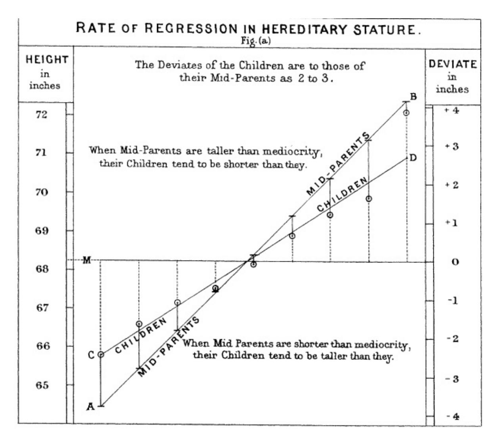

*Figure 2-5. Galton's study that identified the phenomenon of regression to the mean*

### **WARNING**

Regression to the mean, meaning to "go back," is distinct from the statistical modeling method of linear regression, in which a linear relationship is estimated between predictor variables and an outcome variable.

#### **KEY IDEAS**

- Specifying a hypothesis, then collecting data following randomization and random sampling principles, ensures against bias.
- All other forms of data analysis run the risk of bias resulting from the data collection/analysis

process (repeated running of models in data mining, data snooping in research, and after-the-fact selection of interesting events).

### <span id="page-110-1"></span>**Further Reading**

- Christopher J. Pannucci and Edwin G. Wilkins' article "Identifying and Avoiding Bias in Research" in (surprisingly) *Plastic and Reconstructive Surgery* (August 2010) has an excellent review of various types of bias that can enter into research, including selection bias.
- <span id="page-110-0"></span>Michael Harris's article "Fooled by [Randomness](http://systemtradersuccess.com/fooled-by-randomness-through-selection-bias/) Through Selection Bias" provides an interesting review of selection bias considerations in stock market trading schemes, from the perspective of traders.

### <span id="page-111-6"></span>**Sampling Distribution of a Statistic**

The term *sampling distribution* of a statistic refers to the distribution of some sample statistic, over many samples drawn from the same population. Much of classical statistics is concerned with making inferences from (small) samples to (very large) populations.

#### <span id="page-111-5"></span><span id="page-111-4"></span><span id="page-111-3"></span><span id="page-111-1"></span><span id="page-111-0"></span>**KEY TERMS**

#### *Sample statistic*

A metric calculated for a sample of data drawn from a larger population.

#### *Data distribution*

The frequency distribution of individual *values* in a data set.

#### *Sampling distribution*

The frequency distribution of a *sample statistic* over many samples or resamples.

#### *Central limit theorem*

The tendency of the sampling distribution to take on a normalshape as sample size rises.

#### *Standard error*

The variability (standard deviation) of a sample *statistic* over many samples (not to be confused with *standard deviation*, which, by itself, refers to variability of individual data *values*).

Typically, a sample is drawn with the goal of measuring something (with a *sample statistic*) or modeling something (with a statistical or machine learning model). Since our estimate or model is based on a sample, it might be in error; it might be different if we were to draw a different sample. We are therefore interested in how different it might be — a key concern is *sampling variability*. If we had lots of data, we could draw additional samples and observe the distribution of a sample statistic directly. Typically, we will calculate our estimate or model using as much data as is easily available, so the option of drawing additional samples from the population is not readily available.

### <span id="page-111-2"></span>**WARNING**

It is important to distinguish between the distribution of the individual data points, known as *the data distribution*, and the distribution of a sample statistic, known as the *sampling distribution*. <span id="page-112-0"></span>The distribution of a sample statistic such as the mean is likely to be more regular and bell-shaped than the distribution of the data itself. The larger the sample that the statistic is based on, the more this is true. Also, the larger the sample, the narrower the distribution of the sample statistic.

This is illustrated in an example using annual income for loan applicants to Lending Club (see "A Small Example: [Predicting](#page-374-0) Loan Default" for a description of the data). Take three samples from this data: a sample of 1,000 values, a sample of 1,000 means of 5 values, and a sample of 1,000 means of 20 values. Then plot a histogram of each sample to produce [Figure](#page-112-0) 2-6.

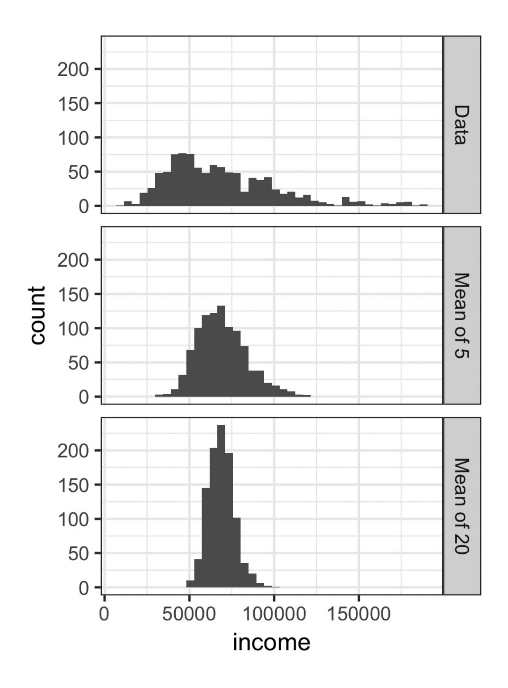

*Figure 2-6. Histogram of annual incomes of 1,000 loan applicants (top), then 1000 means of n=5 applicants (middle), and n=20 (bottom)*

The histogram of the individual data values is broadly spread out and skewed toward higher values as is to be expected with income data. The histograms of the means of 5 and 20 are increasingly compact and more bell-shaped. Here is the R code to generate these histograms, using the visualization package ggplot2.

```
library(ggplot2)
# take a simple random sample
samp_data <- data.frame(income=sample(loans_income, 1000),
                        type='data_dist')
# take a sample of means of 5 values
samp_mean_05 <- data.frame(
  income = tapply(sample(loans_income, 1000*5),
                  rep(1:1000, rep(5, 1000)), FUN=mean),
  type = 'mean_of_5')
# take a sample of means of 20 values
samp_mean_20 <- data.frame(
  income = tapply(sample(loans_income, 1000*20),
                  rep(1:1000, rep(20, 1000)), FUN=mean),
  type = 'mean_of_20')
# bind the data.frames and convert type to a factor
income <- rbind(samp_data, samp_mean_05, samp_mean_20)
income$type = factor(income$type,
                     levels=c('data_dist', 'mean_of_5', 'mean_of_20'),
                     labels=c('Data', 'Mean of 5', 'Mean of 20'))
# plot the histograms
ggplot(income, aes(x=income)) +
  geom_histogram(bins=40) +
  facet_grid(type ~ .)
```

### <span id="page-115-0"></span>**Central Limit Theorem**

<span id="page-115-1"></span>This phenomenon is termed the *central limit theorem*. It says that the means drawn from multiple samples will resemble the familiar bell-shaped normal curve (see "Normal [Distribution"](#page-129-0)), even if the source population is not normally distributed, provided that the sample size is large enough and the departure of the data from normality is not too great. The central limit theorem allows normal-approximation formulas like the t-distribution to be used in calculating sampling distributions for inference — that is, confidence intervals and hypothesis tests.

The central limit theorem receives a lot of attention in traditional statistics texts because it underlies the machinery of hypothesis tests and confidence intervals, which themselves consume half the space in such texts. Data scientists should be aware of this role, but, since formal hypothesis tests and confidence intervals play a small role in data science, and the bootstrap is available in any case, the central limit theorem is not so central in the practice of data science.

### <span id="page-116-2"></span>**Standard Error**

<span id="page-116-0"></span>The *standard error* is a single metric that sums up the variability in the sampling distribution for a statistic. The standard error can be estimated using a statistic based on the standard deviation *s* of the sample values, and the sample size *n*:

As the sample size increases, the standard error decreases, corresponding to what was observed in [Figure](#page-112-0) 2-6. The relationship between standard error and sample size is sometimes referred to as the *square-root of n* rule: in order to reduce the standard error by a factor of 2, the sample size must be increased by a factor of 4.

The validity of the standard error formula arises from the central limit theorem (see "Central Limit [Theorem"\)](#page-115-0). In fact, you don't need to rely on the central limit theorem to understand standard error. Consider the following approach to measure standard error:

- <span id="page-116-1"></span>1. Collect a number of brand new samples from the population.
- 2. For each new sample, calculate the statistic (e.g., mean).
- 3. Calculate the standard deviation of the statistics computed in step 2; use this as your estimate of standard error.

In practice, this approach of collecting new samples to estimate the standard error is typically not feasible (and statistically very wasteful). Fortunately, it turns out that it is not necessary to draw brand new samples; instead, you can use *bootstrap* resamples (see "The [Bootstrap"](#page-119-0)). In modern statistics, the bootstrap has become the standard way to to estimate standard error. It can be used for virtually any statistic and does not rely on the central limit theorem or other distributional assumptions.

### **STANDARD DEVIATION VERSUS STANDARD ERROR**

Do not confuse standard deviation (which measures the variability of individual data points) with standard error (which measures the variability of a sample metric).

#### <span id="page-117-0"></span>**KEY IDEAS**

- The frequency distribution of a sample statistic tells us how that metric would turn out differently from sample to sample.
- This sampling distribution can be estimated via the bootstrap, or via formulas that rely on the central limit theorem.
- A key metric that sums up the variability of a sample statistic is its standard error.

### <span id="page-118-1"></span>**Further Reading**

<span id="page-118-0"></span>David Lane's online [multimedia](http://onlinestatbook.com/stat_sim/sampling_dist/) resource in statistics has a useful simulation that allows you to select a sample statistic, a sample size and number of iterations and visualize a histogram of the resulting frequency distribution.

### <span id="page-119-0"></span>**The Bootstrap**

One easy and effective way to estimate the sampling distribution of a statistic, or of model parameters, is to draw additional samples, with replacement, from the sample itself and recalculate the statistic or model for each resample. This procedure is called the *bootstrap*, and it does not necessarily involve any assumptions about the data or the sample statistic being normally distributed.

#### <span id="page-119-4"></span><span id="page-119-3"></span><span id="page-119-2"></span>**KEY TERMS**

*Bootstrap sample* A sample taken with replacement from an observed data set.

#### *Resampling*

The process of taking repeated samples from observed data; includes both bootstrap and permutation (shuffling) procedures.

Conceptually, you can imagine the bootstrap as replicating the original sample thousands or millions of times so that you have a hypothetical population that embodies all the knowledge from your original sample (it's just larger). You can then draw samples from this hypothetical population for the purpose of estimating a sampling distribution. See [Figure](#page-119-1) 2-7.

<span id="page-119-1"></span>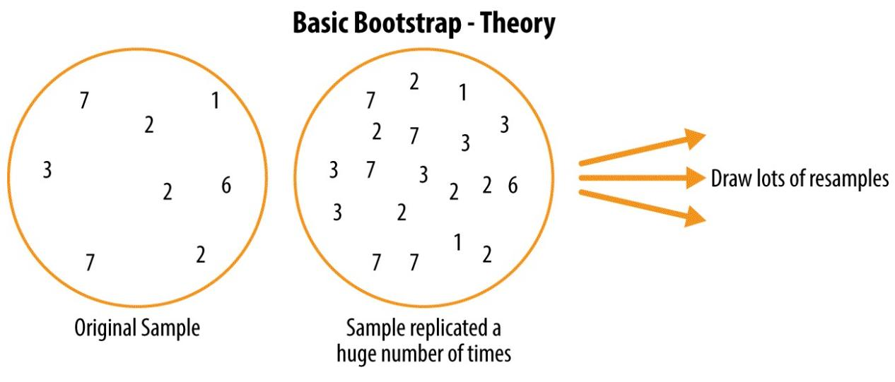

*Figure 2-7. The idea of the bootstrap*

<span id="page-120-0"></span>In practice, it is not necessary to actually replicate the sample a huge number of times. We simply replace each observation after each draw; that is, we *sample with replacement*. In this way we effectively create an infinite population in which the probability of an element being drawn remains unchanged from draw to draw. The algorithm for a bootstrap resampling of the mean is as follows, for a sample of size *n*:

- 1. Draw a sample value, record, replace it.
- 2. Repeat *n* times.
- 3. Record the mean of the *n* resampled values.
- 4. Repeat steps 1–3 *R* times.
- 5. Use the *R* results to:
  - a. Calculate their standard deviation (this estimates sample mean standard error).
  - b. Produce a histogram or boxplot.
  - c. Find a confidence interval.

*R*, the number of iterations of the bootstrap, is set somewhat arbitrarily. The more iterations you do, the more accurate the estimate of the standard error, or the confidence interval. The result from this procedure is a bootstrap set of sample statistics or estimated model parameters, which you can then examine to see how variable they are.

The R package boot combines these steps in one function. For example, the following applies the bootstrap to the incomes of people taking out loans:

```
library(boot)
stat_fun <- function(x, idx) median(x[idx])
boot_obj <- boot(loans_income, R = 1000, statistic=stat_fun)
```

The function stat\_fun computes the median for a given sample specified by the index idx. The result is as follows:

```
Bootstrap Statistics :
   original bias std. error
```

The original estimate of the median is \$62,000. The bootstrap distribution indicates that the estimate has a *bias* of about –\$70 and a standard error of \$209.

<span id="page-121-2"></span>The bootstrap can be used with multivariate data, where the rows are sampled as units (see [Figure](#page-121-0) 2-8). A model might then be run on the bootstrapped data, for example, to estimate the stability (variability) of model parameters, or to improve predictive power. With classification and regression trees (also called *decision trees*), running multiple trees on bootstrap samples and then averaging their predictions (or, with classification, taking a majority vote) generally performs better than using a single tree. This process is called *bagging* (short for "bootstrap aggregating": see ["Bagging](#page-404-0) and the Random Forest").

<span id="page-121-1"></span><span id="page-121-0"></span>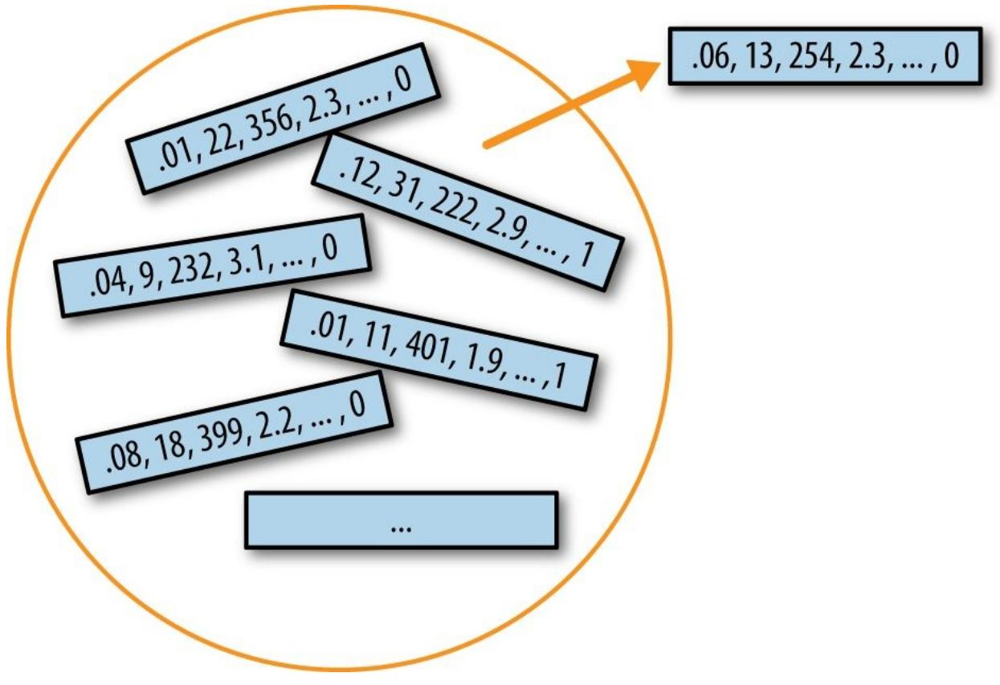

*Figure 2-8. Multivariate bootstrap sampling*

The repeated resampling of the bootstrap is conceptually simple, and Julian Simon, an economist and demographer, published a compendium of resampling examples, including the bootstrap, in his 1969 text *Basic Research Methods in*

*Social Science* (Random House). However, it is also computationally intensive, and was not a feasible option before the widespread availability of computing power. The technique gained its name and took off with the publication of several journal articles and a book by Stanford statistician Bradley Efron in the late 1970s and early 1980s. It was particularly popular among researchers who use statistics but are not statisticians, and for use with metrics or models where mathematical approximations are not readily available. The sampling distribution of the mean has been well established since 1908; the sampling distribution of many other metrics has not. The bootstrap can be used for sample size determination; experiment with different values for *n* to see how the sampling distribution is affected.

The bootstrap met with considerable skepticism when it was first introduced; it had the aura to many of spinning gold from straw. This skepticism stemmed from a misunderstanding of the bootstrap's purpose.

### **WARNING**

The bootstrap does not compensate for a smallsample size; it does not create new data, nor does it fill in holes in an existing data set. It merely informs us about how lots of additionalsamples would behave when drawn from a population like our originalsample.

### <span id="page-123-1"></span>**Resampling versus Bootstrapping**

Sometimes the term *resampling* is used synonymously with the term *bootstrapping*, as just outlined. More often, the term *resampling* also includes permutation procedures (see ["Permutation](#page-170-0) Test"), where multiple samples are combined and the sampling may be done without replacement. In any case, the term *bootstrap* always implies sampling with replacement from an observed data set.

### <span id="page-123-0"></span>**KEY IDEAS**

- The bootstrap (sampling with replacement from a data set) is a powerful tool for assessing the variability of a sample statistic.
- The bootstrap can be applied in similar fashion in a wide variety of circumstances, without extensive study of mathematical approximations to sampling distributions.
- It also allows us to estimate sampling distributions for statistics where no mathematical approximation has been developed.
- When applied to predictive models, aggregating multiple bootstrap sample predictions (bagging) outperforms the use of a single model.

### <span id="page-124-1"></span>**Further Reading**

- *An Introduction to the Bootstrap* by Bradley Efron and Robert Tibshirani (Chapman Hall, 1993) was the first book-length treatment of the bootstrap. It is still widely read.
- The retrospective on the bootstrap in the May 2003 issue of *Statistical Science*, (vol. 18, no. 2), discusses (among other antecedents, in Peter Hall's "Prehistory") Julian Simon's first publication of the bootstrap in 1969.
- <span id="page-124-0"></span>See *An Introduction to Statistical Learning* by Gareth James et al. (Springer, 2013) for sections on the bootstrap and, in particular, bagging.

# <span id="page-125-5"></span>**Confidence Intervals**

Frequency tables, histograms, boxplots, and standard errors are all ways to understand the potential error in a sample estimate. Confidence intervals are another.

#### <span id="page-125-2"></span><span id="page-125-1"></span>**KEY TERMS**

#### *Confidence level*

The percentage of confidence intervals, constructed in the same way from the same population, expected to contain the statistic of interest.

#### *Interval endpoints*

<span id="page-125-4"></span><span id="page-125-3"></span>The top and bottom of the confidence interval.

There is a natural human aversion to uncertainty; people (especially experts) say, "I don't know" far too rarely. Analysts and managers, while acknowledging uncertainty, nonetheless place undue faith in an estimate when it is presented as a single number (a *point estimate*). Presenting an estimate not as a single number but as a range is one way to counteract this tendency. Confidence intervals do this in a manner grounded in statistical sampling principles.

Confidence intervals always come with a coverage level, expressed as a (high) percentage, say 90% or 95%. One way to think of a 90% confidence interval is as follows: it is the interval that encloses the central 90% of the bootstrap sampling distribution of a sample statistic (see "The [Bootstrap"\)](#page-119-0). More generally, an *x*% confidence interval around a sample estimate should, on average, contain similar sample estimates *x*% of the time (when a similar sampling procedure is followed).

Given a sample of size *n*, and a sample statistic of interest, the algorithm for a bootstrap confidence interval is as follows:

- <span id="page-125-0"></span>1. Draw a random sample of size *n* with replacement from the data (a resample).
- 2. Record the statistic of interest for the resample.
- 3. Repeat steps 1–2 many (*R*) times.

- 4. For an *x*% confidence interval, trim [(1 [*x*/100]) / 2]% of the *R* resample results from either end of the distribution.
- 5. The trim points are the endpoints of an *x*% bootstrap confidence interval.

<span id="page-126-0"></span>[Figure](#page-126-0) 2-9 shows a a 90% confidence interval for the mean annual income of loan applicants, based on a sample of 20 for which the mean was \$57,573.

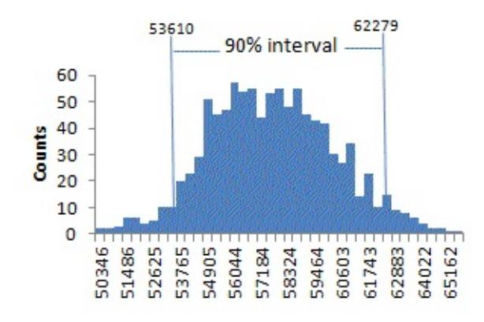

*Figure 2-9. Bootstrap confidence interval for the annual income of loan applicants, based on a sample of 20*

The bootstrap is a general tool that can be used to generate confidence intervals for most statistics, or model parameters. Statistical textbooks and software, with roots in over a half-century of computerless statistical analysis, will also reference confidence intervals generated by formulas, especially the t-distribution (see "Student's [t-Distribution"\)](#page-138-0).

### **NOTE**

Of course, what we are really interested in when we have a sample result is "what is the probability that the true value lies within a certain interval?" This is not really the question that a confidence interval answers, but it ends up being how most people interpret the answer.

The probability question associated with a confidence intervalstarts out with the phrase "Given a sampling procedure and a population, what is the probability that…" To go in the opposite direction, "Given a sample result, what is the probability that (something is true about the population)," involves more complex calculations and deeper imponderables.

<span id="page-127-0"></span>The percentage associated with the confidence interval is termed the *level of confidence*. The higher the level of confidence, the wider the interval. Also, the smaller the sample, the wider the interval (i.e., the more uncertainty). Both make sense: the more confident you want to be, and the less data you have, the wider you must make the confidence interval to be sufficiently assured of capturing the true value.

### **NOTE**

For a data scientist, a confidence interval is a tool to get an idea of how variable a sample result might be. Data scientists would use this information not to publish a scholarly paper or submit a result to a regulatory agency (as a researcher might), but most likely to communicate the potential error in an estimate, and, perhaps, learn whether a larger sample is needed.

#### **KEY IDEAS**

- Confidence intervals are the typical way to present estimates as an interval range.
- The more data you have, the less variable a sample estimate will be.
- The lower the level of confidence you can tolerate, the narrower the confidence interval will be.
- The bootstrap is an effective way to construct confidence intervals.

### <span id="page-128-1"></span>**Further Reading**

- For a bootstrap approach to confidence intervals, see *Introductory Statistics and Analytics: A Resampling Perspective* by Peter Bruce (Wiley, 2014) or *Statistics* by Robin Lock and four other Lock family members (Wiley, 2012).
- <span id="page-128-0"></span>Engineers, who have a need to understand the precision of their measurements, use confidence intervals perhaps more than most disciplines, and *Modern Engineering Statistics* by Tom Ryan (Wiley, 2007) discusses confidence intervals. It also reviews a tool that is just as useful and gets less attention: prediction intervals (intervals around a single value, as opposed to a mean or other summary statistic).

### <span id="page-129-0"></span>**Normal Distribution**

The bell-shaped normal distribution is iconic in traditional statistics. [1](#page-152-0) The fact that distributions of sample statistics are often normally shaped has made it a powerful tool in the development of mathematical formulas that approximate those distributions.

#### <span id="page-129-6"></span><span id="page-129-3"></span><span id="page-129-2"></span><span id="page-129-1"></span>**KEY TERMS**

*Error*

The difference between a data point and a predicted or average value.

*Standardize*

Subtract the mean and divide by the standard deviation.

*z-score*

The result of standardizing an individual data point.

*Standard normal*

A normal distribution with mean = 0 and standard deviation = 1.

*QQ-Plot*

A plot to visualize how close a sample distribution is to a normal distribution.

In a normal distribution ([Figure](#page-130-0) 2-10), 68% of the data lies within one standard deviation of the mean, and 95% lies within two standard deviations.

### <span id="page-129-5"></span><span id="page-129-4"></span>**WARNING**

It is a common misconception that the normal distribution is called that because most data follows a normal distribution — that is, it is the normal thing. Most of the variables used in a typical data science project — in fact most raw data as a whole — are *not* normally [distributed:see](#page-134-0) "Long-Tailed Distributions". The utility of the normal distribution derives from the fact that many statistics *are* normally distributed in their sampling distribution. Even so, assumptions of normality are generally a last resort, used when empirical probability distributions, or bootstrap distributions, are not available.

<span id="page-130-0"></span>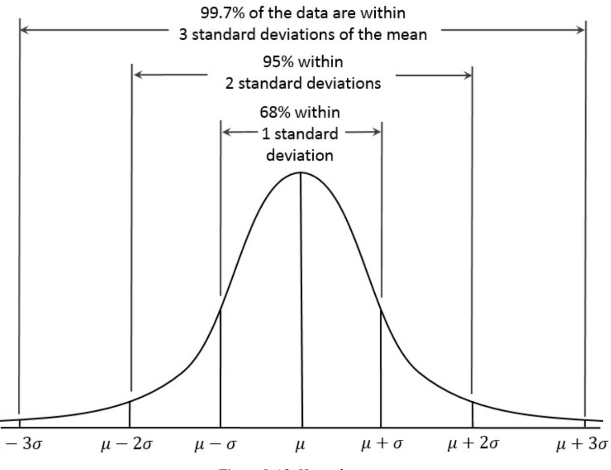

*Figure 2-10. Normal curve*

### **NOTE**

<span id="page-130-1"></span>The normal distribution is also referred to as a *Gaussian* distribution after Carl Friedrich Gauss, a prodigous German mathematician from the late 18th and early 19th century. Another name previously used for the normal distribution was the "error" distribution. Statistically speaking, an *error* is the difference between an actual value and a statistical estimate like the sample mean. For example, the standard deviation (see "Estimates of [Variability"](#page-36-0)) is based on the errors from the mean of the data. Gauss's development of the normal distribution came from his study of the errors of astronomical measurements that were found to be normally distributed.

### <span id="page-131-0"></span>**Standard Normal and QQ-Plots**

<span id="page-131-2"></span><span id="page-131-1"></span>A *standard normal* distribution is one in which the units on the x-axis are expressed in terms of standard deviations away from the mean. To compare data to a standard normal distribution, you subtract the mean then divide by the standard deviation; this is also called *normalization* or *standardization* (see ["Standardization](#page-380-0) (Normalization, Z-Scores)"). Note that "standardization" in this sense is unrelated to database record standardization (conversion to a common format). The transformed value is termed a *z-score*, and the normal distribution is sometimes called the *z-distribution*.

<span id="page-131-3"></span>A QQ-Plot is used to visually determine how close a sample is to the normal distribution. The QQ-Plot orders the *z*-scores from low to high, and plots each value's *z*-score on the y-axis; the x-axis is the corresponding quantile of a normal distribution for that value's rank. Since the data is normalized, the units correspond to the number of standard deviations away of the data from the mean. If the points roughly fall on the diagonal line, then the sample distribution can be considered close to normal. [Figure](#page-131-0) 2-11 shows a QQ-Plot for a sample of 100 values randomly generated from a normal distribution; as expected, the points closely follow the line. This figure can be produced in R with the qqnorm function:

```
norm_samp <- rnorm(100)
qqnorm(norm_samp)
abline(a=0, b=1, col='grey')
```

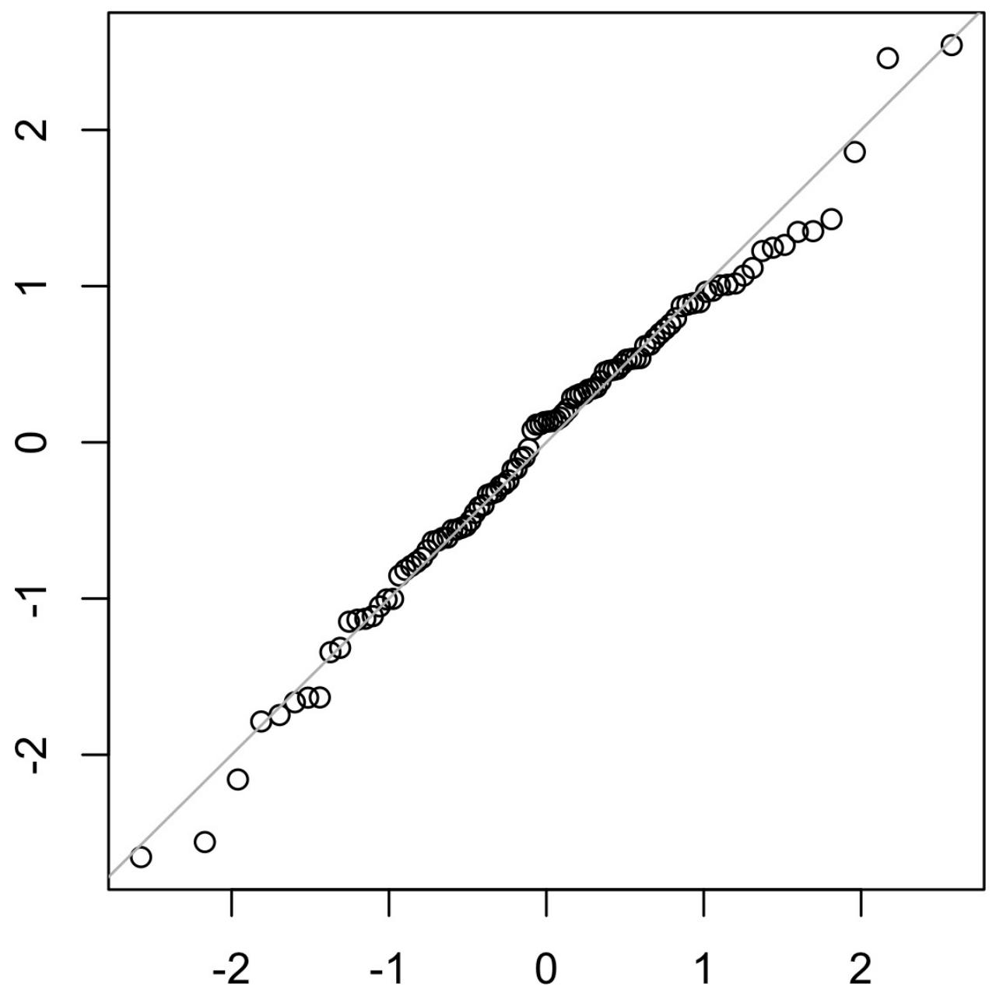

*Figure 2-11. QQ-Plot of a sample of 100 values drawn from a normal distribution*

### **WARNING**

Converting data to *z*-scores (i.e., standardizing or normalizing the data) does *not* make the data normally distributed. It just puts the data on the same scale as the standard normal distribution, often for comparison purposes.

#### <span id="page-133-1"></span><span id="page-133-0"></span>**KEY IDEAS**

- The normal distribution was essential to the historical development of statistics, as it permitted mathematical approximation of uncertainty and variability.
- While raw data is typically not normally distributed, errors often are, as are averages and totals in large samples.
- To convert data to *z*-scores, you subtract the mean of the data and divide by the standard deviation; you can then compare the data to a normal distribution.

### <span id="page-134-0"></span>**Long-Tailed Distributions**

Despite the importance of the normal distribution historically in statistics, and in contrast to what the name would suggest, data is generally not normally distributed.

### <span id="page-134-3"></span><span id="page-134-2"></span>**KEY TERMS FOR LONG-TAIL DISTRIBUTION**

*Tail*

<span id="page-134-4"></span>The long narrow portion of a frequency distribution, where relatively extreme values occur at low frequency.

*Skew*

Where one tail of a distribution is longer than the other.

While the normal distribution is often appropriate and useful with respect to the distribution of errors and sample statistics, it typically does not characterize the distribution of raw data. Sometimes, the distribution is highly *skewed* (asymmetric), such as with income data, or the distribution can be discrete, as with binomial data. Both symmetric and asymmetric distributions may have *long tails*. The tails of a distribution correspond to the extreme values (small and large). Long tails, and guarding against them, are widely recognized in practical work. Nassim Taleb has proposed the *black swan* theory, which predicts that anamolous events, such as a stock market crash, are much more likely to occur than would be predicted by the normal distribution.

<span id="page-134-1"></span>A good example to illustrate the long-tailed nature of data is stock returns. [Figure](#page-135-0) 2-12 shows the QQ-Plot for the daily stock returns for Netflix (NFLX). This is generated in R by:

```
nflx <- sp500_px[,'NFLX']
nflx <- diff(log(nflx[nflx>0]))
qqnorm(nflx)
abline(a=0, b=1, col='grey')
```

<span id="page-135-0"></span>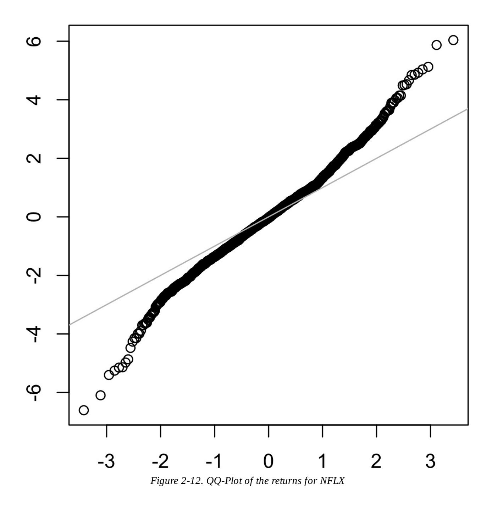

In contrast to [Figure](#page-131-0) 2-11, the points are far below the line for low values and far above the line for high values. This means that we are much more likely to observe extreme values than would be expected if the data had a normal distribution. [Figure](#page-135-0) 2-12 shows another common phenomena: the points are close to the line for the data within one standard deviation of the mean. Tukey refers to this phenomenon as data being "normal in the middle," but having much longer tails (see [\[Tukey-1987\]](#page-491-6)).

### **NOTE**

There is much statistical literature about the task of fitting statistical distributions to observed data. Beware an excessively data-centric approach to this job, which is as much art as science. Data is variable, and often consistent, on its face, with more than one shape and type of distribution. It is typically the case that domain and statistical knowledge must be brought to bear to determine what type of distribution is appropriate to model a given situation. For example, we might have data on the level of internet traffic on a server over many consecutive 5-second periods. It is useful to know that the best distribution to model "events per time period" is the Poisson (see "Poisson [Distributions"](#page-147-0)).

#### **KEY IDEAS FOR LONG-TAIL DISTRIBUTION**

- Most data is not normally distributed.
- Assuming a normal distribution can lead to underestimation of extreme events ("black swans").

### <span id="page-137-1"></span>**Further Reading**

- *The Black Swan*, 2nd ed., by Nassim Taleb (Random House, 2010).
- <span id="page-137-0"></span>*Handbook of Statistical Distributions with Applications*, 2nd ed., by K. Krishnamoorthy (CRC Press, 2016)

# <span id="page-138-0"></span>**Student's t-Distribution**

<span id="page-138-4"></span>The *t-distribution* is a normally shaped distribution, but a bit thicker and longer on the tails. It is used extensively in depicting distributions of sample statistics. Distributions of sample means are typically shaped like a t-distribution, and there is a family of t-distributions that differ depending on how large the sample is. The larger the sample, the more normally shaped the t-distribution becomes.

### <span id="page-138-3"></span><span id="page-138-2"></span>**KEY TERMS FOR STUDENT'S T-DISTRIBUTION**

*n*

Sample size.

#### *Degrees of freedom*

<span id="page-138-1"></span>A parameter that allows the t-distribution to adjust to different sample sizes, statistics, and number of groups.

The t-distribution is often called *Student's t* because it was published in 1908 in *Biometrika* by W. S. Gossett under the name "Student." Gossett's employer, the Guinness brewery, did not want competitors to know that it was using statistical methods, so insisted that Gossett not use his name on the article.

Gossett wanted to answer the question "What is the sampling distribution of the mean of a sample, drawn from a larger population?" He started out with a resampling experiment — drawing random samples of 4 from a data set of 3,000 measurements of criminals' height and left-middle-finger lengths. (This being the era of eugenics, there was much interest in data on criminals, and in discovering correlations between criminal tendencies and physical or psychological attributes.) He plotted the standardized results (the *z*-scores) on the x-axis and the frequency on the y-axis. Separately, he had derived a function, now known as *Student's t*, and he fit this function over the sample results, plotting the comparison (see [Figure](#page-139-0) 2-13).

<span id="page-139-0"></span>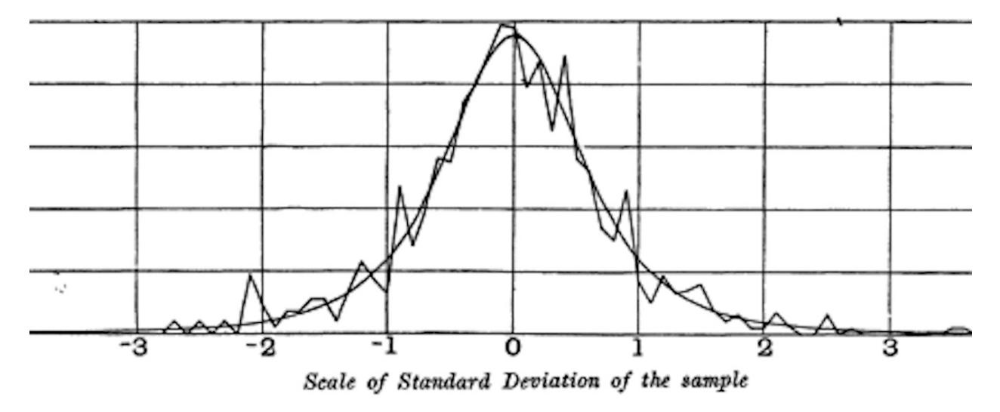

*Figure 2-13. Gossett's resampling experiment results and fitted t-curve (from his 1908 Biometrika paper)*

A number of different statistics can be compared, after standardization, to the tdistribution, to estimate confidence intervals in light of sampling variation. Consider a sample of size *n* for which the sample mean has been calculated. If *s* is the sample standard deviation, a 90% confidence interval around the sample mean is given by:

$$\overline{x} \pm t_{n-1}(.05) \times \frac{S}{n}$$

where is the value of the t-statistic, with (*n* – 1) degrees of freedom (see "Degrees of [Freedom"](#page-197-0)), that "chops off" 5% of the t-distribution at either end. The t-distribution has been used as a reference for the distribution of a sample mean, the difference between two sample means, regression parameters, and other statistics.

Had computing power been widely available in 1908, statistics would no doubt have relied much more heavily on computationally intensive resampling methods from the start. Lacking computers, statisticians turned to mathematics and functions such as the t-distribution to approximate sampling distributions. Computer power enabled practical resampling experiments in the 1980s, but by then, use of the tdistribution and similar distributions had become deeply embedded in textbooks

and software.

The t-distribution's accuracy in depicting the behavior of a sample statistic requires that the distribution of that statistic for that sample be shaped like a normal distribution. It turns out that sample statistics *are* often normally distributed, even when the underlying population data is not (a fact which led to widespread application of the t-distribution). This phenomenon is termed the *central limit theorem* (see "Central Limit [Theorem"\)](#page-115-0).

### <span id="page-140-1"></span><span id="page-140-0"></span>**NOTE**

<span id="page-140-2"></span>What do data scientists need to know about the t-distribution and the central limit theorem? Not a whole lot. These distributions are used in classicalstatistical inference, but are not as central to the purposes of data science. Understanding and quantifying uncertainty and variation are important to data scientists, but empirical bootstrap sampling can answer most questions about sampling error. However, data scientists will routinely encounter t-statistics in output from statisticalsoftware and statistical procedures in R, for example in A-B tests and regressions, so familiarity with its purpose is helpful.

#### **KEY IDEAS**

- The t-distribution is actually a family of distributions resembling the normal distribution, but with thicker tails.
- It is widely used as a reference basis for the distribution of sample means, differerences between two sample means, regression parameters, and more.

### <span id="page-141-1"></span>**Further Reading**

- The original Gossett paper in *Biometrica* from 1908 is available as a [PDF](http://seismo.berkeley.edu/~kirchner/eps_120/Odds_n_ends/Students_original_paper.pdf).
- <span id="page-141-0"></span>A standard treatment of the [t-distribution](http://onlinestatbook.com/2/estimation/t_distribution.html) can be found in David Lane's online resource.

# <span id="page-142-6"></span>**Binomial Distribution**

#### <span id="page-142-5"></span><span id="page-142-4"></span>**KEY TERMS FOR BINOMIAL DISTRIBUTION**

#### *Trial*

<span id="page-142-1"></span>An event with a discrete outcome (e.g., a coin flip).

#### *Success*

The outcome of interest for a trial.

*Synonyms*

<span id="page-142-0"></span>"1" (as opposed to "0")

#### *Binomial*

Having two outcomes.

*Synonyms*

<span id="page-142-2"></span>yes/no, 0/1, binary

#### *Binomial trial*

A trial with two outcomes.

*Synonym*

Bernoulli trial

#### *Binomial distribution*

Distribution of number of successes in *x* trials.

<span id="page-142-3"></span>*Synonym* Bernoulli distribution

Yes/no (binomial) outcomes lie at the heart of analytics since they are often the culmination of a decision or other process; buy/don't buy, click/don't click, survive/die, and so on. Central to understanding the binomial distribution is the idea of a set of *trials*, each trial having two possible outcomes with definite probabilities.

For example, flipping a coin 10 times is a binomial experiment with 10 trials, each trial having two possible outcomes (heads or tails); see [Figure](#page-143-0) 2-14. Such yes/no or 0/1 outcomes are termed *binary* outcomes, and they need not have 50/50 probabilities. Any probabilities that sum to 1.0 are possible. It is conventional in statistics to term the "1" outcome the *success* outcome; it is also common practice to assign "1" to the more rare outcome. Use of the term *success* does not imply

<span id="page-143-0"></span>that the outcome is desirable or beneficial, but it does tend to indicate the outcome of interest. For example, loan defaults or fraudulent transactions are relatively uncommon events that we may be interested in predicting, so they are termed "1s" or "successes."


*Figure 2-14. The tails side of a buffalo nickel*

The binomial distribution is the frequency distribution of the number of successes (*x*) in a given number of trials (*n*) with specified probability (*p*) of success in each trial. There is a family of binomial distributions, depending on the values of *x*, *n*, and *p*. The binomial distribution would answer a question like:

If the probability of a click converting to a sale is 0.02, what is the probability of observing 0 sales in 200 clicks?

The R function dbinom calculates binomial probabilities. For example:

```
dbinom(x=2, n=5, p=0.1)
```

would return 0.0729, the probability of observing exactly *x* = 2 successes in *n* = 5 trials, where the probability of success for each trial is *p* = 0.1.

Often we are interested in determining the probability of *x* or fewer successes in *n* trials. In this case, we use the function pbinom:

pbinom(2, 5, 0.1)

This would return 0.9914, the probability of observing two or fewer successes in five trials, where the probability of success for each trial is 0.1.

The mean of a binomial distribution is ; you can also think of this as the expected number of successes in *n* trials, for success probability = *p*.

The variance is . With a large enough number of trials

(particularly when *p* is close to 0.50), the binomial distribution is virtually indistinguishable from the normal distribution. In fact, calculating binomial probabilities with large sample sizes is computationally demanding, and most statistical procedures use the normal distribution, with mean and variance, as an approximation.

#### **KEY IDEAS**

- Binomial outcomes are important to model, since they represent, among other things, fundamental decisions (buy or don't buy, click or don't click, survive or die, etc.).
- A binomial trial is an experiment with two possible outcomes: one with probability *p* and the other with probability *1 – p*.
- With large *n*, and provided *p* is not too close to 0 or 1, the binomial distribution can be approximated by the normal distribution.

### <span id="page-145-1"></span>**Further Reading**

- Read about the ["quincunx",](https://www.mathsisfun.com/data/binomial-distribution.html) a pinball-like simulation device for illustrating the binomial distribution.
- <span id="page-145-0"></span>The binomial distribution is a staple of introductory statistics, and all introductory statistics texts will have a chapter or two on it.

### <span id="page-146-3"></span>**Poisson and Related Distributions**

Many processes produce events randomly at a given overall rate — visitors arriving at a website, cars arriving at a toll plaza (events spread over time), imperfections in a square meter of fabric, or typos per 100 lines of code (events spread over space).

#### <span id="page-146-1"></span>**KEY TERMS FOR POISSON AND RELATED DISTRIBUTIONS**

#### *Lambda*

The rate (per unit of time or space) at which events occur.

#### *Poisson distribution*

The frequency distribution of the number of events in sampled units of time or space.

#### *Exponential distribution*

<span id="page-146-0"></span>The frequency distribution of the time or distance from one event to the next event.

#### *Weibull distribution*

<span id="page-146-2"></span>A generalized version of the exponential, in which the event rate is allowed to shift over time.

### <span id="page-147-0"></span>**Poisson Distributions**

<span id="page-147-2"></span>From prior data we can estimate the average number of events per unit of time or space, but we might also want to know how different this might be from one unit of time/space to another. The Poisson distribution tells us the distribution of events per unit of time or space when we sample many such units. It is useful when addressing queuing questions like "How much capacity do we need to be 95% sure of fully processing the internet traffic that arrives on a server in any 5 second period?"

<span id="page-147-1"></span>The key parameter in a Poisson distribution is , or lambda. This is the mean number of events that occurs in a specified interval of time or space. The variance for a Poisson distribution is also .

A common technique is to generate random numbers from a Poisson distribution as part of a queuing simulation. The rpois function in R does this, taking only two arguments — the quantity of random numbers sought, and lambda:

rpois(100, lambda = 2)

This code will generate 100 random numbers from a Poisson distribution with = 2. For example, if incoming customer service calls average 2 per minute, this code will simulate 100 minutes, returning the number of calls in each of those 100 minutes.

### <span id="page-148-2"></span>**Exponential Distribution**

<span id="page-148-1"></span><span id="page-148-0"></span>Using the same parameter that we used in the Poisson distribution, we can also model the distribution of the time between events: time between visits to a website or between cars arriving at a toll plaza. It is also used in engineering to model time to failure, and in process management to model, for example, the time required per service call. The R code to generate random numbers from an exponential distribution takes two arguments, *n* (the quantity of numbers to be generated), and *rate*, the number of events per time period. For example:

rexp(n = 100, rate = .2)

This code would generate 100 random numbers from an exponential distribution where the mean number of events per time period is 2. So you could use it to simulate 100 intervals, in minutes, between service calls, where the average rate of incoming calls is 0.2 per minute.

A key assumption in any simulation study for either the Poisson or exponential distribution is that the rate, , remains constant over the period being considered. This is rarely reasonable in a global sense; for example, traffic on roads or data networks varies by time of day and day of week. However, the time periods, or areas of space, can usually be divided into segments that are sufficiently homogeneous so that analysis or simulation within those periods is valid.

### <span id="page-149-1"></span>**Estimating the Failure Rate**

<span id="page-149-0"></span>In many applications, the event rate, , is known or can be estimated from prior data. However, for rare events, this is not necessarily so. Aircraft engine failure, for example, is sufficiently rare (thankfully) that, for a given engine type, there may be little data on which to base an estimate of time between failures. With no data at all, there is little basis on which to estimate an event rate. However, you can make some guesses: if no events have been seen after 20 hours, you can be pretty sure that the rate is not 1 per hour. Via simulation, or direct calculation of probabilities, you can assess different hypothetical event rates and estimate threshold values below which the rate is very unlikely to fall. If there is some data but not enough to provide a precise, reliable estimate of the rate, a goodness-of-fit test (see ["Chi-Square](#page-208-0) Test") can be applied to various rates to determine how well they fit the observed data.

### <span id="page-150-4"></span>**Weibull Distribution**

<span id="page-150-0"></span>In many cases, the event rate does not remain constant over time. If the period over which it changes is much longer than the typical interval between events, there is no problem; you just subdivide the analysis into the segments where rates are relatively constant, as mentioned before. If, however, the event rate changes over the time of the interval, the exponential (or Poisson) distributions are no longer useful. This is likely to be the case in mechanical failure — the risk of failure increases as time goes by. The *Weibull* distribution is an extension of the exponential distribution, in which the event rate is allowed to change, as specified by a *shape parameter*, . If > 1, the probability of an event increases over time, if < 1, it decreases. Because the Weibull distribution is used with time-tofailure analysis instead of event rate, the second parameter is expressed in terms of characteristic life, rather than in terms of the rate of events per interval. The symbol used is , the Greek letter eta. It is also called the *scale* parameter.

<span id="page-150-3"></span><span id="page-150-2"></span>With the Weibull, the estimation task now includes estimation of both parameters, and . Software is used to model the data and yield an estimate of the bestfitting Weibull distribution.

The R code to generate random numbers from a Weibull distribution takes three arguments, n (the quantity of numbers to be generated), shape, and scale. For example, the following code would generate 100 random numbers (lifetimes) from a Weibull distribution with shape of 1.5 and characteristic life of 5,000:

rweibull(100,1.5,5000)

#### <span id="page-150-1"></span>**KEY IDEAS**

- For events that occur at a constant rate, the number of events per unit of time or space can be modeled as a Poisson distribution.
- In this scenario, you can also model the time or distance between one event and the next as an exponential distribution.
- A changing event rate over time (e.g., an increasing probability of device failure) can be modeled with the Weibull distribution.

### <span id="page-151-0"></span>**Further Reading**

- *Modern Engineering Statistics* by Tom Ryan (Wiley, 2007) has a chapter devoted to the probability distributions used in engineering applications.
- Read an engineering-based perspective on the use of the Weibull distribution (mainly from an engineering perspective) [here](http://bit.ly/2qGs8de) and [here.](http://bit.ly/2qAMBkw)

### <span id="page-152-3"></span>**Summary**

<span id="page-152-2"></span>In the era of big data, the principles of random sampling remain important when accurate estimates are needed. Random selection of data can reduce bias and yield a higher quality data set than would result from just using the conveniently available data. Knowledge of various sampling and data generating distributions allows us to quantify potential errors in an estimate that might be due to random variation. At the same time, the bootstrap (sampling with replacement from an observed data set) is an attractive "one size fits all" method to determine possible error in sample estimates.

<span id="page-152-1"></span><span id="page-152-0"></span>The bell curve is iconic but perhaps overrated. George W. Cobb, the Mount Holyoke statistician noted for his contribution to the philosophy of teaching introductory statistics, argued in a November 2015 editorial in the *American Statistician* that the "standard introductory course, which puts the normal distribution at its center, had outlived the usefulness of its centrality." [1](#page-129-1)

# <span id="page-153-4"></span>**Chapter 3. Statistical Experiments and Significance Testing**

<span id="page-153-2"></span>Design of experiments is a cornerstone of the practice of statistics, with applications in virtually all areas of research. The goal is to design an experiment in order to confirm or reject a hypothesis. Data scientists are faced with the need to conduct continual experiments, particularly regarding user interface and product marketing. This chapter reviews traditional experimental design and discusses some common challenges in data science. It also covers some oft-cited concepts in statistical inference and explains their meaning and relevance (or lack of relevance) to data science.

<span id="page-153-3"></span>Whenever you see references to statistical significance, t-tests, or p-values, it is typically in the context of the classical statistical inference "pipeline" (see [Figure](#page-153-0) 3-1). This process starts with a hypothesis ("drug A is better than the existing standard drug," "price A is more profitable than the existing price B"). An experiment (it might be an A/B test) is designed to test the hypothesis designed in such a way that, hopefully, will deliver conclusive results. The data is collected and analyzed, and then a conclusion is drawn. The term *inference* reflects the intention to apply the experiment results, which involve a limited set of data, to a larger process or population.

<span id="page-153-0"></span>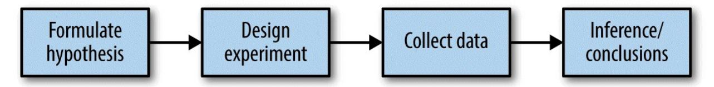

<span id="page-153-1"></span>*Figure 3-1. The classical statistical inference pipeline*

### <span id="page-154-0"></span>**A/B Testing**

An A/B test is an experiment with two groups to establish which of two treatments, products, procedures, or the like is superior. Often one of the two treatments is the standard existing treatment, or no treatment. If a standard (or no) treatment is used, it is called the *control*. A typical hypothesis is that treatment is better than control.

#### <span id="page-154-4"></span><span id="page-154-3"></span><span id="page-154-1"></span>**KEY TERMS FOR A/B TESTING**

#### *Treatment*

Something (drug, price, web headline) to which a subject is exposed.

#### *Treatment group*

A group of subjects exposed to a specific treatment.

*Control group*

<span id="page-154-2"></span>A group of subjects exposed to no (or standard) treatment.

*Randomization*

The process of randomly assigning subjects to treatments.

#### *Subjects*

The items (web visitors, patients, etc.) that are exposed to treatments.

#### *Test statistic*

The metric used to measure the effect of the treatment.

A/B tests are common in web design and marketing, since results are so readily measured. Some examples of A/B testing include:

- Testing two soil treatments to determine which produces better seed germination
- Testing two therapies to determine which suppresses cancer more effectively
- Testing two prices to determine which yields more net profit
- Testing two web headlines to determine which produces more clicks ([Figure](#page-155-0) 3-2)

Testing two web ads to determine which generates more conversions

<span id="page-155-0"></span>

*Figure 3-2. Marketers continually test one web presentation against another*

A proper A/B test has *subjects* that can be assigned to one treatment or another. The subject might be a person, a plant seed, a web visitor; the key is that the subject is exposed to the treatment. Ideally, subjects are *randomized* (assigned randomly) to treatments. In this way, you know that any difference between the treatment groups is due to one of two things:

- The effect of the different treatments
- Luck of the draw in which subjects are assigned to which treatments (i.e., the random assignment may have resulted in the naturally better-performing subjects being concentrated in A or B)

You also need to pay attention to the *test statistic* or metric you use to compare group A to group B. Perhaps the most common metric in data science is a binary variable: click or no-click, buy or don't buy, fraud or no fraud, and so on. Those results would be summed up in a 2×2 table. [Table](#page-156-0) 3-1 is a 2×2 table for an actual price test.

<span id="page-156-0"></span>*Table 3-1. 2×2 table for ecommerce experiment results*

| Outcome          | Price<br>A | Price<br>B |
|------------------|------------|------------|
| Conversion       | 200        | 182        |
| No<br>conversion | 23,539     | 22,406     |

<span id="page-156-1"></span>If the metric is a continuous variable (purchase amount, profit, etc.), or a count (e.g., days in hospital, pages visited) the result might be displayed differently. If one were interested not in conversion, but in revenue per page view, the results of the price test in [Table](#page-156-0) 3-1 might look like this in typical default software output:

Revenue/page-view with price A: mean = 3.87, SD = 51.10 Revenue/page-view with price B: mean = 4.11, SD = 62.98

"SD" refers to the standard deviation of the values within each group.

### <span id="page-156-4"></span><span id="page-156-3"></span><span id="page-156-2"></span>**WARNING**

Just because statisticalsoftware — including R — generates output by default does not mean that all the output is useful or relevant. You can see that the preceding standard deviations are not that useful; on their face they suggest that numerous values might be negative, when negative revenue is not feasible. This data consists of a smallset of relatively high values (page views with conversions) and a huge number of 0-values (page views with no conversion). It is difficult to sum up the variability of such data with a single number, though the mean absolute deviation from the mean (7.68 for A and 8.15 for B) is more reasonable than the standard deviation.

### <span id="page-158-1"></span>**Why Have a Control Group?**

<span id="page-158-0"></span>Why not skip the control group and just run an experiment applying the treatment of interest to only one group, and compare the outcome to prior experience?

Without a control group, there is no assurance that "other things are equal" and that any difference is really due to the treatment (or to chance). When you have a control group, it is subject to the same conditions (except for the treatment of interest) as the treatment group. If you simply make a comparison to "baseline" or prior experience, other factors, besides the treatment, might differ.

### <span id="page-159-2"></span><span id="page-159-1"></span>**BLINDING IN STUDIES**

<span id="page-159-0"></span>A *blind study* is one in which the subjects are unaware of whether they are getting treatment A or treatment B. Awareness of receiving a particular treatment can affect response. A *double blind* study is one in which the investigators and facilitators (e.g., doctors and nurses in a medical study) are unaware which subjects are getting which treatment. Blinding is not possible when the nature of the treatment is transparent — for example, cognitive therapy from a computer versus a psychologist.

The use of A/B testing in data science is typically in a web context. Treatments might be the design of a web page, the price of a product, the wording of a headline, or some other item. Some thought is required to preserve the principles of randomization. Typically the subject in the experiment is the web visitor, and the outcomes we are interested in measuring are clicks, purchases, visit duration, number of pages visited, whether a particular page is visited, and the like. In a standard A/B experiment, you need to decide on one metric ahead of time. Multiple behavior metrics might be collected and be of interest, but if the experiment is expected to lead to a decision between treatment A and treatment B, a single metric, or *test statistic*, needs to be established beforehand. Selecting a test statistic *after* the experiment is conducted opens the door to researcher bias.

### <span id="page-160-1"></span>**Why Just A/B? Why Not C, D…?**

A/B tests are popular in the marketing and ecommerce worlds, but are far from the only type of statistical experiment. Additional treatments can be included. Subjects might have repeated measurements taken. Pharmaceutical trials where subjects are scarce, expensive, and acquired over time are sometimes designed with multiple opportunities to stop the experiment and reach a conclusion.

Traditional statistical experimental designs focus on answering a static question about the efficacy of specified treatments. Data scientists are less interested in the question:

Is the difference between price A and price B statistically significant?

than in the question:

<span id="page-160-0"></span>Which, out of multiple possible prices, is best?

For this, a relatively new type of experimental design is used: the *multi-arm bandit* (see ["Multi-Arm](#page-219-0) Bandit Algorithm").

### <span id="page-161-0"></span>**GETTING PERMISSION**

In scientific and medical research involving human subjects, it is typically necessary to get their permission, as well as obtain the approval of an institutional review board. Experiments in business that are done as a part of ongoing operations almost never do this. In most cases (e.g., pricing experiments, or experiments about which headline to show or which offer should be made), this practice is widely accepted. Facebook, however, ran afoul of this general acceptance in 2014 when it experimented with the emotional tone in users' newsfeeds. Facebook used sentiment analysis to classify newsfeed posts as positive or negative, then altered the positive/negative balance in what it showed users. Some randomly selected users experienced more positive posts, while others experienced more negative posts. Facebook found that the users who experienced a more positive newsfeed were more likely to post positively themselves, and vice versa. The magnitude of the effect was small, however, and Facebook faced much criticism for conducting the experiment without users' knowledge. Some users speculated that Facebook might have pushed some extremely depressed users over the edge, if they got the negative version of their feed.

#### **KEY IDEAS**

- Subjects are assigned to two (or more) groups that are treated exactly alike, except that the treatment under study differs from one to another.
- Ideally, subjects are assigned randomly to the groups.

### <span id="page-162-1"></span>**For Further Reading**

- Two-group comparisons (A/B tests) are a staple of traditional statistics, and just about any introductory statistics text will have extensive coverage of design principles and inference procedures. For a discussion that places A/B tests in more of a data science context and uses resampling, see *Introductory Statistics and Analytics: A Resampling Perspective* by Peter Bruce (Wiley, 2014).
- For web testing, the logistical aspects of testing can be just as challenging as the statistical ones. A good place to start is the Google Analytics help section on [Experiments.](http://bit.ly/2p6zPsb)
- <span id="page-162-0"></span>Beware advice found in the ubiquitous guides to A/B testing that you see on the web, such as these words in one such guide: "Wait for about 1,000 total visitors and make sure you run the test for a week." Such general rules of thumb are not statistically meaningful; see ["Power](#page-224-0) and Sample Size" for more detail.

### <span id="page-163-0"></span>**Hypothesis Tests**

Hypothesis tests, also called *significance tests*, are ubiquitous in the traditional statistical analysis of published research. Their purpose is to help you learn whether random chance might be responsible for an observed effect.

#### <span id="page-163-6"></span><span id="page-163-4"></span><span id="page-163-3"></span><span id="page-163-2"></span>**KEY TERMS**

*Null hypothesis*

<span id="page-163-1"></span>The hypothesis that chance is to blame.

*Alternative hypothesis* Counterpoint to the null (what you hope to prove).

*One-way test*

Hypothesis test that counts chance results only in one direction.

*Two-way test*

Hypothesis test that counts chance results in two directions.

An A/B test (see "A/B [Testing"](#page-154-0)) is typically constructed with a hypothesis in mind. For example, the hypothesis might be that price B produces higher profit. Why do we need a hypothesis? Why not just look at the outcome of the experiment and go with whichever treatment does better?

The answer lies in the tendency of the human mind to underestimate the scope of natural random behavior. One manifestation of this is the failure to anticipate extreme events, or so-called "black swans" (see "Long-Tailed [Distributions"](#page-134-0)). Another manifestation is the tendency to misinterpret random events as having patterns of some significance. Statistical hypothesis testing was invented as a way to protect researchers from being fooled by random chance.

#### <span id="page-163-5"></span>**MISINTERPRETING RANDOMNESS**

You can observe the human tendency to underestimate randomness in this experiment. Ask several friends to invent a series of 50 coin flips: have them write down a series of random Hs and Ts. Then ask them to actually flip a coin 50 times and write down the results. Have them put the real coin flip results in one pile, and the made-up results in another. It is easy to tell which results are real: the real ones will have longer runs of Hs or Ts. In a set of 50 *real* coin flips, it is not at all unusual to see five or six Hs or Ts in a row. However, when most of us are inventing random coin flips and we have gotten three or four Hs in a row, we tell ourselves that, for the series to look random, we had better switch to T.

The other side of this coin, so to speak, is that when we *do* see the real-world equivalent of six Hs in a row (e.g., when one headline outperforms another by 10%), we are inclined to attribute it to something real, not just chance.

In a properly designed A/B test, you collect data on treatments A and B in such a way that any observed difference between A and B must be due to either:

- Random chance in assignment of subjects
- A true difference between A and B

A statistical hypothesis test is further analysis of an A/B test, or any randomized experiment, to assess whether random chance is a reasonable explanation for the observed difference between groups A and B.

### <span id="page-165-0"></span>**The Null Hypothesis**

<span id="page-165-1"></span>Hypothesis tests use the following logic: "Given the human tendency to react to unusual but random behavior and interpret it as something meaningful and real, in our experiments we will require proof that the difference between groups is more extreme than what chance might reasonably produce." This involves a baseline assumption that the treatments are equivalent, and any difference between the groups is due to chance. This baseline assumption is termed the *null hypothesis*. Our hope is then that we can, in fact, prove the null hypothesis *wrong*, and show that the outcomes for groups A and B are more different than what chance might produce.

<span id="page-165-2"></span>One way to do this is via a resampling permutation procedure, in which we shuffle together the results from groups A and B and then repeatedly deal out the data in groups of similar sizes, then observe how often we get a difference as extreme as the observed difference. See ["Resampling"](#page-169-0) for more detail.

### <span id="page-166-1"></span>**Alternative Hypothesis**

Hypothesis tests by their nature involve not just a null hypothesis, but also an offsetting alternative hypothesis. Here are some examples:

- <span id="page-166-0"></span>Null = "no difference between the means of group A and group B," alternative = "A is different from B" (could be bigger or smaller)
- Null = "A B," alternative = "B > A"
- Null = "B is not X% greater than A," alternative = "B is X% greater than A"

Taken together, the null and alternative hypotheses must account for all possibilities. The nature of the null hypothesis determines the structure of the hypothesis test.

### <span id="page-167-5"></span>**One-Way, Two-Way Hypothesis Test**

<span id="page-167-2"></span>Often, in an A/B test, you are testing a new option (say B), against an established default option (A) and the presumption is that you will stick with the default option unless the new option proves itself definitively better. In such a case, you want a hypothesis test to protect you from being fooled by chance in the direction favoring B. You don't care about being fooled by chance in the other direction, because you would be sticking with A unless B proves definitively better. So you want a *directional* alternative hypothesis (B is better than A). In such a case, you use a *one-way* (or one-tail) hypothesis test. This means that extreme chance results in only one direction direction count toward the p-value.

<span id="page-167-4"></span><span id="page-167-3"></span><span id="page-167-0"></span>If you want a hypothesis test to protect you from being fooled by chance in either direction, the alternative hypothesis is *bidirectional* (A is different from B; could be bigger or smaller). In such a case, you use a *two-way* (or two-tail) hypothesis. This means that extreme chance results in either direction count toward the pvalue.

A one-tail hypothesis test often fits the nature of A/B decision making, in which a decision is required and one option is typically assigned "default" status unless the other proves better. Software, however, including R, typically provides a twotail test in its default output, and many statisticians opt for the more conservative two-tail test just to avoid argument. One-tail versus two-tail is a confusing subject, and not that relevant for data science, where the precision of p-value calculations is not terribly important.

### <span id="page-167-1"></span>**KEY IDEAS**

- A *null hypothesis* is a logical construct embodying the notion that nothing special has happened, and any effect you observe is due to random chance.
- The *hypothesis test* assumes that the null hypothesis is true, creates a "null model" (a probability model), and tests whether the effect you observe is a reasonable outcome of that model.

### <span id="page-168-1"></span>**Further Reading**

- *The Drunkard's Walk* by Leonard Mlodinow (Vintage Books, 2008) is a readable survey of the ways in which "randomness rules our lives."
- David Freedman, Robert Pisani, and Roger Purves's classic statistics text *Statistics*, 4th ed. (W. W. Norton, 2007) has excellent nonmathematical treatments of most statistics topics, including hypothesis testing.
- <span id="page-168-0"></span>*Introductory Statistics and Analytics: A Resampling Perspective* by Peter Bruce (Wiley, 2014) develops hypothesis testing concepts using resampling.

### <span id="page-169-0"></span>**Resampling**

*Resampling* in statistics means to repeatedly sample values from observed data, with a general goal of assessing random variability in a statistic. It can also be used to assess and improve the accuracy of some machine-learning models (e.g., the predictions from decision tree models built on multiple bootstrapped data sets can be averaged in a process known as *bagging*: see ["Bagging](#page-404-0) and the Random Forest").

<span id="page-169-2"></span><span id="page-169-1"></span>There are two main types of resampling procedures: the *bootstrap* and *permutation* tests. The bootstrap is used to assess the reliability of an estimate; it was discussed in the previous chapter (see "The [Bootstrap"\)](#page-119-0). Permutation tests are used to test hypotheses, typically involving two or more groups, and we discuss those in this section.

### <span id="page-169-6"></span><span id="page-169-5"></span><span id="page-169-4"></span><span id="page-169-3"></span>**KEY TERMS**

#### *Permutation test*

The procedure of combining two or more samples together, and randomly (or exhaustively) reallocating the observations to resamples.

#### *Synonyms*

Randomization test, random permutation test, exact test.

#### *With or without replacement*

In sampling, whether or not an item is returned to the sample before the next draw.

### <span id="page-170-0"></span>**Permutation Test**

<span id="page-170-1"></span>In a *permutation* procedure, two or more samples are involved, typically the groups in an A/B or other hypothesis test. *Permute* means to change the order of a set of values. The first step in a *permutation test* of a hypothesis is to combine the results from groups A and B (and, if used, C, D, …) together. This is the logical embodiment of the null hypothesis that the treatments to which the groups were exposed do not differ. We then test that hypothesis by randomly drawing groups from this combined set, and seeing how much they differ from one another. The permutation procedure is as follows:

- 1. Combine the results from the different groups in a single data set.
- 2. Shuffle the combined data, then randomly draw (without replacing) a resample of the same size as group A.
- 3. From the remaining data, randomly draw (without replacing) a resample of the same size as group B.
- 4. Do the same for groups C, D, and so on.
- 5. Whatever statistic or estimate was calculated for the original samples (e.g., difference in group proportions), calculate it now for the resamples, and record; this constitutes one permutation iteration.
- <span id="page-170-2"></span>6. Repeat the previous steps *R* times to yield a permutation distribution of the test statistic.

Now go back to the observed difference between groups and compare it to the set of permuted differences. If the observed difference lies well within the set of permuted differences, then we have not proven anything — the observed difference is within the range of what chance might produce. However, if the observed difference lies outside most of the permutation distribution, then we conclude that chance is *not* responsible. In technical terms, the difference is *statistically significant*. (See "Statistical [Significance](#page-179-0) and P-Values".)

### <span id="page-171-0"></span>**Example: Web Stickiness**

A company selling a relatively high-value service wants to test which of two web presentations does a better selling job. Due to the high value of the service being sold, sales are infrequent and the sales cycle is lengthy; it would take too long to accumulate enough sales to know which presentation is superior. So the company decides to measure the results with a proxy variable, using the detailed interior page that describes the service.

### <span id="page-171-2"></span><span id="page-171-1"></span>**TIP**

A *proxy* variable is one that stands in for the true variable of interest, which may be unavailable, too costly, or too time-consuming to measure. In climate research, for example, the oxygen content of ancient ice cores is used as a proxy for temperature. It is useful to have at least *some* data on the true variable of interest, so the strength of its association with the proxy can be assessed.

One potential proxy variable for our company is the number of clicks on the detailed landing page. A better one is how long people spend on the page. It is reasonable to think that a web presentation (page) that holds people's attention longer will lead to more sales. Hence, our metric is average session time, comparing page A to page B.

Due to the fact that this is an interior, special-purpose page, it does not receive a huge number of visitors. Also note that Google Analytics, which is how we measure session time, cannot measure session time for the last session a person visits. Instead of deleting that session from the data, though, GA records it as a zero, so the data requires additional processing to remove those sessions. The result is a total of 36 sessions for the two different presentations, 21 for page A and 15 for page B. Using ggplot, we can visually compare the session times using side-by-side boxplots:

```
ggplot(session_times, aes(x=Page, y=Time)) +
  geom_boxplot()
```

The boxplot, shown in [Figure](#page-172-0) 3-3, indicates that page B leads to longer sessions than page A. The means for each group can be computed as follows:

```
mean_a <- mean(session_times[session_times['Page']=='Page A', 'Time'])
mean_b <- mean(session_times[session_times['Page']=='Page B', 'Time'])
mean_b - mean_a
[1] 21.4
```

Page B has session times greater, on average, by 21.4 seconds versus page A. The question is whether this difference is within the range of what random chance might produce, or, alternatively, is statistically significant. One way to answer this is to apply a permutation test — combine all the session times together, then repeatedly shuffle and divide them into groups of 21 (recall that *n* = 21 for page A) and 15 (*n* = 15 for B).

To apply a permutation test, we need a function to randomly assign the 36 session times to a group of 21 (page A) and a group of 15 (page B):

```
perm_fun <- function(x, n1, n2)
{
  n <- n1 + n2
  idx_b <- sample(1:n, n1)
  idx_a <- setdiff(1:n, idx_b)
  mean_diff <- mean(x[idx_b]) - mean(x[idx_a])
  return(mean_diff)
}
```

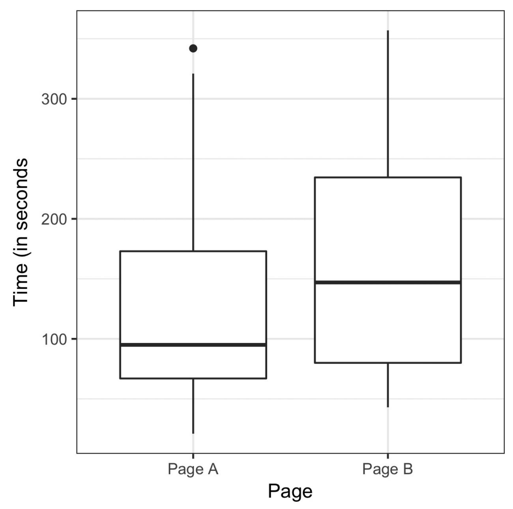

*Figure 3-3. Session times for web pages A and B*

This function works by sampling without replacement n2 indices and assigning them to the B group; the remaining n1 indices are assigned to group A. The difference between the two means is returned. Calling this function *R* = 1,000 times and specifying n2 = 15 and n1 = 21 leads to a distribution of differences in the session times that can be plotted as a histogram.

```
perm_diffs <- rep(0, 1000)
for(i in 1:1000)
  perm_diffs[i] = perm_fun(session_times[,'Time'], 21, 15)
```

hist(perm\_diffs, xlab='Session time differences (in seconds)') abline(v = mean\_b - mean\_a)

<span id="page-174-0"></span>The histogram, shown in [Figure](#page-174-0) 3-4 shows that mean difference of random permutations often exceeds the observed difference in session times (the vertical line). This suggests that the oberved difference in session time between page A and page B is well within the range of chance variation, thus is not statistically significant.

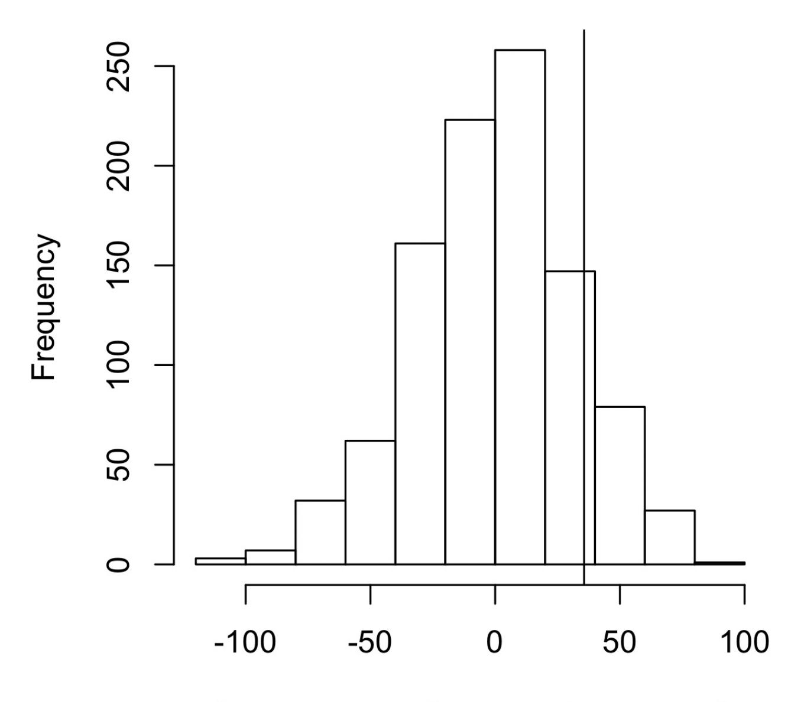

*Figure 3-4. Frequency distribution for session time differences between pages A and B*

### <span id="page-176-4"></span>**Exhaustive and Bootstrap Permutation Test**

In addition to the preceding random shuffling procedure, also called a *random permutation test* or a *randomization test*, there are two variants of the permutation test:

- <span id="page-176-3"></span>An *exhaustive permutation test*
- <span id="page-176-2"></span><span id="page-176-1"></span>A *bootstrap permutation test*

In an exhaustive permutation test, instead of just randomly shuffling and dividing the data, we actually figure out all the possible ways it could be divided. This is practical only for relatively small sample sizes. With a large number of repeated shufflings, the random permutation test results approximate those of the exhaustive permutation test, and approach them in the limit. Exhaustive permutation tests are also sometimes called *exact tests*, due to their statistical property of guaranteeing that the null model will not test as "significant" more than the alpha level of the test (see "Statistical [Significance](#page-179-0) and P-Values").

<span id="page-176-0"></span>In a bootstrap permutation test, the draws outlined in steps 2 and 3 of the random permutation test are made *with replacement* instead of without replacement. In this way the resampling procedure models not just the random element in the assignment of treatment to subject, but also the random element in the selection of subjects from a population. Both procedures are encountered in statistics, and the distinction between them is somewhat convoluted and not of consequence in the practice of data science.

### <span id="page-177-1"></span>**Permutation Tests: The Bottom Line for Data Science**

<span id="page-177-0"></span>Permutation tests are useful heuristic procedures for exploring the role of random variation. They are relatively easy to code, interpret and explain, and they offer a useful detour around the formalism and "false determinism" of formula-based statistics.

One virtue of resampling, in contrast to formula approaches, is that it comes much closer to a "one size fits all" approach to inference. Data can be numeric or binary. Sample sizes can be the same or different. Assumptions about normallydistributed data are not needed.

### **KEY IDEAS**

- In a permutation test, multiple samples are combined, then shuffled.
- The shuffled values are then divided into resamples, and the statistic of interest is calculated.
- This process is then repeated, and the resampled statistic is tabulated.
- Comparing the observed value of the statistic to the resampled distribution allows you to judge whether an observed difference between samples might occur by chance.

### <span id="page-178-1"></span>**For Further Reading**

- *Randomization Tests*, 4th ed., by Eugene Edgington and Patrick Onghena (Chapman Hall, 2007), but don't get too drawn into the thicket of nonrandom sampling.
- <span id="page-178-0"></span>*Introductory Statistics and Analytics: A Resampling Perspective* by Peter Bruce (Wiley, 2015).

### <span id="page-179-0"></span>**Statistical Significance and P-Values**

<span id="page-179-4"></span>Statistical significance is how statisticians measure whether an experiment (or even a study of existing data) yields a result more extreme than what chance might produce. If the result is beyond the realm of chance variation, it is said to be statistically significant.

#### <span id="page-179-3"></span>**KEY TERMS**

#### *P-value*

Given a chance model that embodies the null hypothesis, the p-value is the probability of obtaining results as unusual or extreme as the observed results.

#### *Alpha*

<span id="page-179-2"></span>The probability threshold of "unusualness" that chance results must surpass, for actual outcomes to be deemed statistically significant.

#### *Type 1 error*

<span id="page-179-5"></span>Mistakenly concluding an effect is real (when it is due to chance).

#### *Type 2 error*

Mistakenly concluding an effect is due to chance (when it is real).

Consider in [Table](#page-179-1) 3-2 the results of the web test shown earlier.

<span id="page-179-6"></span><span id="page-179-1"></span>

| Table<br>3-2.<br>2×2<br>table<br>for<br>ecommerce<br>experiment<br>results |            |            |  |  |  |
|----------------------------------------------------------------------------|------------|------------|--|--|--|
| Outcome                                                                    | Price<br>A | Price<br>B |  |  |  |
| Conversion                                                                 | 200        | 182        |  |  |  |
| No<br>conversion                                                           | 23539      | 22406      |  |  |  |

Price A converts almost 5% better than price B (0.8425% versus 0.8057% — a difference of 0.0368 percentage points), big enough to be meaningful in a highvolume business. We have over 45,000 data points here, and it is tempting to consider this as "big data," not requiring tests of statistical significance (needed mainly to account for sampling variability in small samples). However, the

conversion rates are so low (less than 1%) that the actual meaningful values the conversions — are only in the 100s, and the sample size needed is really determined by these conversions. We can test whether the difference in conversions between prices A and B is within the range of chance variation, using a resampling procedure. By "chance variation," we mean the random variation produced by a probability model that embodies the null hypothesis that there is no difference between the rates (see "The Null [Hypothesis"](#page-165-0)). The following permutation procedure asks "if the two prices share the same conversion rate, could chance variation produce a difference as big as 5%?"

- 1. Create an urn with all sample results: this represents the supposed shared conversion rate of 382 ones and 45,945 zeros = 0.008246 = 0.8246%.
- 2. Shuffle and draw out a resample of size 23,739 (same *n* as price A), and record how many 1s.
- 3. Record the number of 1s in the remaining 22,588 (same *n* as price B).
- 4. Record the difference in proportion 1s.
- 5. Repeat steps 2–4.
- 6. How often was the difference >= 0.0368?

Reusing the function perm\_fun defined in "Example: Web [Stickiness",](#page-171-0) we can create a histogram of randomly permuted differences in conversion rate:

```
obs_pct_diff <- 100*(200/23739 - 182/22588)
conversion <- c(rep(0, 45945), rep(1, 382))
perm_diffs <- rep(0, 1000)
for(i in 1:1000)
  perm_diffs[i] = 100*perm_fun(conversion, 23739, 22588 )
hist(perm_diffs, xlab='Session time differences (in seconds)')
abline(v = obs_pct_diff)
```

See the histogram of 1,000 resampled results in [Figure](#page-181-0) 3-5: as it happens, in this case the observed difference of 0.0368% is well within the range of chance variation.

<span id="page-181-0"></span>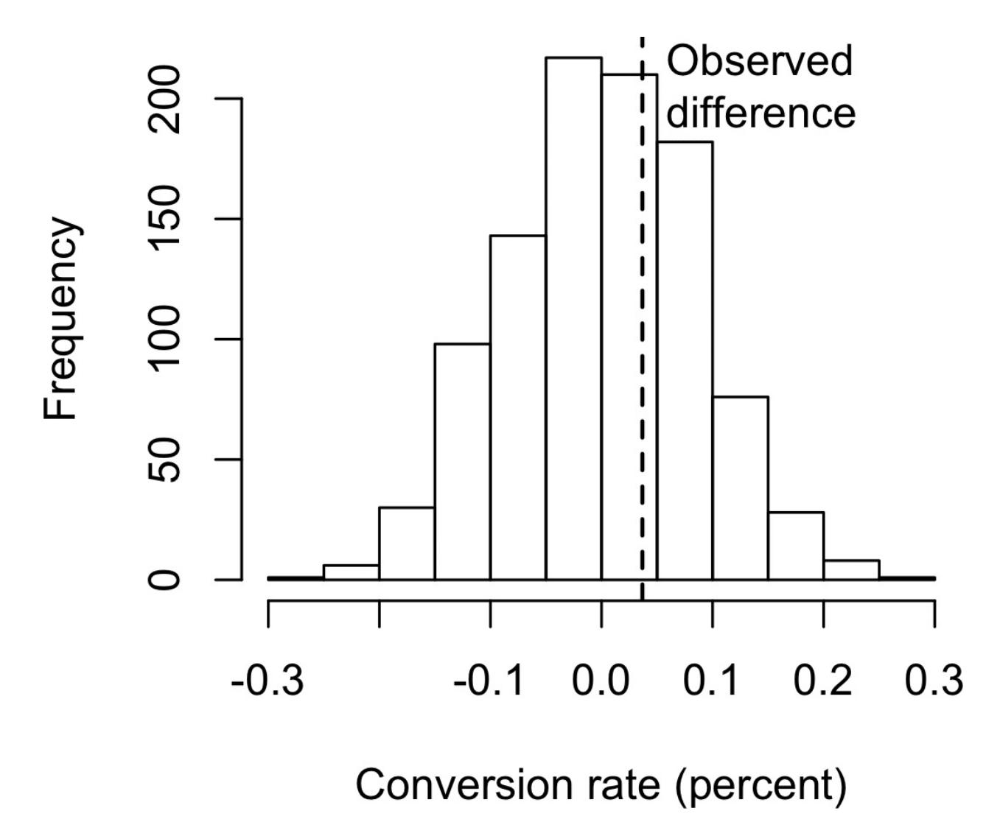

*Figure 3-5. Frequency distribution for the difference in conversion rates between pages A and B*

### <span id="page-182-0"></span>**P-Value**

<span id="page-182-1"></span>Simply looking at the graph is not a very precise way to measure statistical significance, so of more interest is the *p-value*. This is the frequency with which the chance model produces a result more extreme than the observed result. We can estimate a p-value from our permutation test by taking the proportion of times that the permutation test produces a difference equal to or greater than the observed difference:

```
mean(perm_diffs > obs_pct_diff)
[1] 0.308
```

The p-value is 0.308, which means that we would expect to achieve the same result by random chance over 30% of the time.

In this case, we didn't need to use a permutation test to get a p-value. Since we have a binomial distribution, we can approximate the p-value using the normal distribution. In R code, we do this using the function prop.test:

```
> prop.test(x=c(200,182), n=c(23739,22588), alternative="greater")
       2-sample test for equality of proportions with continuity correction
data: c(200, 182) out of c(23739, 22588)
X-squared = 0.14893, df = 1, p-value = 0.3498
alternative hypothesis: greater
95 percent confidence interval:
-0.001057439 1.000000000
sample estimates:
    prop 1 prop 2
0.008424955 0.008057376
```

The argument x is the number of successes for each group and the argument n is the number of trials. The normal approximation yields a p-value of 0.3498, which is close to the p-value obtained from the permutation test.

### <span id="page-183-3"></span>**Alpha**

<span id="page-183-2"></span><span id="page-183-0"></span>Statisticians frown on the practice of leaving it to the researcher's discretion to determine whether a result is "too unusual" to happen by chance. Rather, a threshold is specified in advance, as in "more extreme than 5% of the chance (null hypothesis) results"; this threshold is known as alpha. Typical alpha levels are 5% and 1%. Any chosen level is an arbitrary decision — there is nothing about the process that will guarantee correct decisions x% of the time. This is because the probability question being answered is *not* "what is the probability that this happened by chance?" but rather "given a chance model, what is the probability of a result this extreme?" We then deduce backward about the appropriateness of the chance model, but that judgment does not carry a probability. This point has been the subject of much confusion.

### **Value of the p-value**

<span id="page-183-1"></span>Considerable controversy has surrounded the use of the p-value in recent years. One psychology journal has gone so far as to "ban" the use of p-values in submitted papers on the grounds that publication decisions based solely on the pvalue were resulting in the publication of poor research. Too many researchers, only dimly aware of what a p-value really means, root around in the data and among different possible hypotheses to test, until they find a combination that yields a significant p-value and, hence, a paper suitable for publication.

The real problem is that people want more meaning from the p-value than it contains. Here's what we would *like* the p-value to convey:

The probability that the result is due to chance.

We hope for a low value, so we can conclude that we've proved something. This is how many journal editors were interpreting the p-value. But here's what the pvalue *actually* represents:

The probability that, *given a chance model*, results as extreme as the observed results could occur.

The difference is subtle, but real. A significant p-value does not carry you quite as far along the road to "proof" as it seems to promise. The logical foundation for the conclusion "statistically significant" is somewhat weaker when the real meaning

of the p-value is understood.

In March 2016, the American Statistical Association, after much internal deliberation, revealed the extent of misunderstanding about p-values when it issued a cautionary statement regarding their use.

The ASA statement stressed six principles for researchers and journal editors:

- <span id="page-184-0"></span>1. P-values can indicate how incompatible the data are with a specified statistical model.
- 2. P-values do not measure the probability that the studied hypothesis is true, or the probability that the data were produced by random chance alone.
- 3. Scientific conclusions and business or policy decisions should not be based only on whether a p-value passes a specific threshold.
- 4. Proper inference requires full reporting and transparency.
- 5. A p-value, or statistical significance, does not measure the size of an effect or the importance of a result.
- 6. By itself, a p-value does not provide a good measure of evidence regarding a model or hypothesis.

### <span id="page-185-3"></span>**Type 1 and Type 2 Errors**

In assessing statistical significance, two types of error are possible:

- <span id="page-185-1"></span><span id="page-185-0"></span>Type 1 error, in which you mistakenly conclude an effect is real, when it is really just due to chance
- <span id="page-185-2"></span>Type 2 error, in which you mistakenly conclude that an effect is not real (i.e., due to chance), when it really is real

Actually, a Type 2 error is not so much an error as a judgment that the sample size is too small to detect the effect. When a p-value falls short of statistical significance (e.g., it exceeds 5%), what we are really saying is "effect not proven." It could be that a larger sample would yield a smaller p-value.

The basic function of significance tests (also called *hypothesis tests*) is to protect against being fooled by random chance; thus they are typically structured to minimize Type 1 errors.

### <span id="page-186-2"></span>**Data Science and P-Values**

<span id="page-186-0"></span>The work that data scientists do is typically not destined for publication in scientific journals, so the debate over the value of a p-value is somewhat academic. For a data scientist, a p-value is a useful metric in situations where you want to know whether a model result that appears interesting and useful is within the range of normal chance variability. As a decision tool in an experiment, a pvalue should not be considered controlling, but merely another point of information bearing on a decision. For example, p-values are sometimes used as intermediate inputs in some statistical or machine learning models — a feature night be included in or excluded from a model depending on its p-value.

#### <span id="page-186-1"></span>**KEY IDEAS**

- Significance tests are used to determine whether an observed effect is within the range of chance variation for a null hypothesis model.
- The p-value is the probability that results as extreme as the observed results might occur, given a null hypothesis model.
- The alpha value is the threshold of "unusualness" in a null hypothesis chance model.
- Significance testing has been much more relevant for formal reporting of research than for data science (but has been fading recently, even for the former).

### <span id="page-187-1"></span>**Further Reading**

- Stephen Stigler, "Fisher and the 5% Level," *Chance* vol. 21, no. 4 (2008): 12. This article is a short commentary on Ronald Fisher's 1925 book *Statistical Methods for Research Workers*, and his emphasis on the 5% level of significance.
- <span id="page-187-0"></span>See also ["Hypothesis](#page-163-0) Tests" and the further reading mentioned there.

### <span id="page-188-4"></span>**t-Tests**

<span id="page-188-0"></span>There are numerous types of significance tests, depending on whether the data comprises count data or measured data, how many samples there are, and what's being measured. A very common one is the *t-test*, named after Student's tdistribution, originally developed by W. S. Gossett to approximate the distribution of a single sample mean (see "Student's [t-Distribution"](#page-138-0)).

### <span id="page-188-3"></span><span id="page-188-2"></span>**KEY TERMS**

#### *Test statistic*

A metric for the difference or effect of interest.

#### *t-statistic*

A standardized version of the test statistic.

#### *t-distribution*

<span id="page-188-1"></span>A reference distribution (in this case derived from the null hypothesis), to which the observed tstatistic can be compared.

All significance tests require that you specify a *test statistic* to measure the effect you are interested in, and help you determine whether that observed effect lies within the range of normal chance variation. In a resampling test (see the discussion of permutation in ["Permutation](#page-170-0) Test"), the scale of the data does not matter. You create the reference (null hypothesis) distribution from the data itself, and use the test statistic as is.

In the 1920s and 30s, when statistical hypothesis testing was being developed, it was not feasible to randomly shuffle data thousands of times to do a resampling test. Statisticians found that a good approximation to the permutation (shuffled) distribution was the t-test, based on Gossett's t-distribution. It is used for the very common two-sample comparison — A/B test — in which the data is numeric. But in order for the t-distribution to be used without regard to scale, a standardized form of the test statistic must be used.

A classic statistics text would at this stage show various formulas that incorporate Gossett's distribution and demonstrate how to standardize your data to compare it to the standard t-distribution. These formulas are not shown here because all

statistical software, as well as R and Python, include commands that embody the formula. In R, the function is t.test:

```
> t.test(Time ~ Page, data=session_times, alternative='less' )
       Welch Two Sample t-test
data: Time by Page
t = -1.0983, df = 27.693, p-value = 0.1408
alternative hypothesis: true difference in means is less than 0
95 percent confidence interval:
    -Inf 19.59674
sample estimates:
mean in group Page A mean in group Page B
           126.3333 162.0000
```

The alternative hypothesis is that the session time mean for page A is less than for page B. This is fairly close to the permutation test p-value of 0.124 (see "Example: Web [Stickiness"\)](#page-171-0).

In a resampling mode, we structure the solution to reflect the observed data and the hypothesis to be tested, not worrying about whether the data is numeric or binary, sample sizes are balanced or not, sample variances, or a variety of other factors. In the formula world, many variations present themselves, and they can be bewildering. Statisticians need to navigate that world and learn its map, but data scientists do not — they are typically not in the business of sweating the details of hypothesis tests and confidence intervals the way a researcher preparing a paper for presentation might.

#### **KEY IDEAS**

- Before the advent of computers, resampling tests were not practical and statisticians used standard reference distributions.
- A test statistic could then be standardized and compared to the reference distribution.
- One such widely used standardized statistic is the t-statistic.

### <span id="page-190-1"></span>**Further Reading**

- Any introductory statistics text will have illustrations of the t-statistic and its uses; two good ones are *Statistics*, 4th ed., by David Freedman, Robert Pisani, and Roger Purves (W. W. Norton, 2007) and *The Basic Practice of Statistics* by David S. Moore (Palgrave Macmillan, 2010).
- <span id="page-190-0"></span>For a treatment of both the t-test and resampling procedures in parallel, see *Introductory Statistics and Analytics: A Resampling Perspective* by Peter Bruce (Wiley, 2014) or *Statistics* by Robin Lock and four other Lock family members (Wiley, 2012).

# <span id="page-191-0"></span>**Multiple Testing**

As we've mentioned previously, there is a saying in statistics: "torture the data long enough, and it will confess." This means that if you look at the data through enough different perspectives, and ask enough questions, you can almost invariably find a statistically significant effect.

### <span id="page-191-6"></span><span id="page-191-4"></span><span id="page-191-3"></span><span id="page-191-2"></span>KEY TERMS

Type 1 error Mistakenly concluding that an effect is statistically significant. **False discovery rate** Across multiple tests, the rate of making a Type 1 error. **Adjustment of p-values** 

Accounting for doing multiple tests on the same data.

### Overfitting

<span id="page-191-5"></span><span id="page-191-1"></span>Fitting the noise.

For example, if you have 20 predictor variables and one outcome variable, all *randomly* generated, the odds are pretty good that at least one predictor will (falsely) turn out to be statistically significant if you do a series of 20 significance tests at the alpha =  $0.05$  level. As previously discussed, this is called a *Type 1 error*. You can calculate this probability by first finding the probability that all will *correctly* test nonsignificant at the 0.05 level. The probability that *one* will correctly test nonsignificant is 0.95, so the probability that all 20 will correctly test nonsignificant is  $0.95 \times 0.95 \times 0.95$  ... or  $0.95^{20} = 0.36$ .<sup>1</sup> The probability that at least one predictor will (falsely) test significant is the flip side of this probability, or  $1 - (probability that all will be nonsignificant) = 0.64$ .

This issue is related to the problem of overfitting in data mining, or "fitting the model to the noise." The more variables you add, or the more models you run, the greater the probability that something will emerge as "significant" just by chance.

In supervised learning tasks, a holdout set where models are assessed on data that the model has not seen before mitigates this risk. In statistical and machine learning tasks not involving a labeled holdout set, the risk of reaching conclusions based on statistical noise persists.

In statistics, there are some procedures intended to deal with this problem in very specific circumstances. For example, if you are comparing results across multiple treatment groups you might ask multiple questions. So, for treatments A–C, you might ask:

- Is A different from B?
- Is B different from C?
- <span id="page-192-0"></span>Is A different from C?

Or, in a clinical trial, you might want to look at results from a therapy at multiple stages. In each case, you are asking multiple questions, and with each question, you are increasing the chance of being fooled by chance. Adjustment procedures in statistics can compensate for this by setting the bar for statistical significance more stringently than it would be set for a single hypothesis test. These adjustment procedures typically involve "dividing up the alpha" according to the number of tests. This results in a smaller alpha (i.e., a more stringent bar for statistical significance) for each test. One such procedure, the Bonferroni adjustment, simply divides the alpha by the number of observations *n*.

However, the problem of multiple comparisons goes beyond these highly structured cases and is related to the phenomenon of repeated data "dredging" that gives rise to the saying about torturing the data. Put another way, given sufficiently complex data, if you haven't found something interesting, you simply haven't looked long and hard enough. More data is available now than ever before, and the number of journal articles published nearly doubled between 2002 and 2010. This gives rise to lots of opportunities to find something interesting in the data, including multiplicity issues such as:

- Checking for multiple pairwise differences across groups
- Looking at multiple subgroup results ("we found no significant treatment effect overall, but we did find an effect for unmarried women younger than 30")
- Trying lots of statistical models

- Including lots of variables in models
- Asking a number of different questions (i.e., different possible outcomes)

### <span id="page-194-0"></span>**FALSE DISCOVERY RATE**

The term *false discovery rate* was originally used to describe the rate at which a given set of hypothesis tests would falsely identify a significant effect. It became particularly useful with the advent of genomic research, in which massive numbers of statistical tests might be conducted as part of a gene sequencing project. In these cases, the term applies to the testing protocol, and a single false "discovery" refers to the outcome of a hypothesis test (e.g., between two samples). Researchers sought to set the parameters of the testing process to control the false discovery rate at a specified level. The term has also been used in the data mining community in a classification context, in which a false discovery is a mislabeling of a single record — in particular the mislabeling of 0s as 1s (see [Chapter](#page-309-0) 5 and "The Rare Class [Problem"](#page-348-0)).

For a variety of reasons, including especially this general issue of "multiplicity," more research does not necessarily mean better research. For example, the pharmaceutical company Bayer found in 2011 that when it tried to replicate 67 scientific studies, it could fully replicate only 14 of them. Nearly two-thirds could not be replicated at all.

In any case, the adjustment procedures for highly defined and structured statistical tests are too specific and inflexible to be of general use to data scientists. The bottom line for data scientists on multiplicity is:

- For predictive modeling, the risk of getting an illusory model whose apparent efficacy is largely a product of random chance is mitigated by crossvalidation (see ["Cross-Validation"\)](#page-252-0), and use of a holdout sample.
- For other procedures without a labeled holdout set to check the model, you must rely on:

Awareness that the more you query and manipulate the data, the greater the role that chance might play; and

Resampling and simulation heuristics to provide random chance benchmarks against which observed results can be compared.

### <span id="page-194-1"></span>**KEY IDEAS**

- Multiplicity in a research study or data mining project (multiple comparisons, many variables, many models, etc.) increases the risk of concluding that something is significant just by chance.
- For situations involving multiple statistical comparisons (i.e., multiple tests of significance) there are

statistical adjustment procedures.

In a data mining situation, use of a holdout sample with labeled outcome variables can help avoid misleading results.

### <span id="page-196-1"></span>**Further Reading**

- 1. For a short exposition of one procedure (Dunnett's) to adjust for multiple comparisons, see David Lane's online [statistics](http://davidmlane.com/hyperstat/B112114.html) text.
- 2. Megan Goldman offers a slightly longer treatment of the [Bonferroni](http://www.stat.berkeley.edu/~mgoldman/Section0402.pdf) adjustment procedure.
- 3. For an in-depth treatment of more flexible statistical procedures to adjust p-values, see *Resampling-Based Multiple Testing* by Peter Westfall and Stanley Young (Wiley, 1993).
- <span id="page-196-0"></span>4. For a discussion of data partitioning and the use of holdout samples in predictive modeling, see *Data Mining for Business Analytics*, Chapter 2, by Galit Shmueli, Peter Bruce, and Nitin Patel (Wiley, 2016).

### <span id="page-197-0"></span>**Degrees of Freedom**

In the documentation and settings to many statistical tests, you will see reference to "degrees of freedom." The concept is applied to statistics calculated from sample data, and refers to the number of values free to vary. For example, if you know the mean for a sample of 10 values, and you also know 9 of the values, you also know the 10th value. Only 9 are free to vary.

#### <span id="page-197-2"></span>**KEY TERMS**

<span id="page-197-3"></span>*n or sample size* The number of observations (also called *rows* or *records*) in the data. *d.f.*

<span id="page-197-1"></span>Degrees of freedom.

The number of degrees of freedom is an input to many statistical tests. For example, degrees of freedom is the name given to the *n* – 1 denominator seen in the calculations for variance and standard deviation. Why does it matter? When you use a sample to estimate the variance for a population, you will end up with an estimate that is slightly biased downward if you use *n* in the denominator. If you use *n* – 1 in the denominator, the estimate will be free of that bias.

A large share of a traditional statistics course or text is consumed by various standard tests of hypotheses (t-test, F-test, etc.). When sample statistics are standardized for use in traditional statistical formulas, degrees of freedom is part of the standardization calculation to ensure that your standardized data matches the appropriate reference distribution (t-distribution, F-distribution, etc.).

Is it important for data science? Not really, at least in the context of significance testing. For one thing, formal statistical tests are used only sparingly in data science. For another, the data size is usually large enough that it rarely makes a real difference for a data scientist whether, for example, the denominator has *n* or *n* – 1.

There is one context, though, in which it is relevant: the use of factored variables in regression (including logistic regression). Regression algorithms choke if exactly redundant predictor variables are present. This most commonly occurs

when factoring categorical variables into binary indicators (dummies). Consider day of week. Although there are seven days of the week, there are only six degrees of freedom in specifying day of week. For example, once you know that day of week is not Monday through Saturday, you know it must be Sunday. Inclusion of the Mon–Sat indicators thus means that *also* including Sunday would cause the regression to fail, due to a *multicollinearity* error.

#### <span id="page-198-0"></span>**KEY IDEAS**

- The number of degrees of freedom (d.f.) forms part of the calculation to standardize test statistics so they can be compared to reference distributions (t-distribution, F-distribution, etc.).
- The concept of degrees of freedom lies behind the factoring of categorical variables into *n* 1 indicator or dummy variables when doing a regression (to avoid multicollinearity).

### <span id="page-199-1"></span>**Further Reading**

<span id="page-199-0"></span>There are several web [tutorials](http://blog.minitab.com/blog/statistics-and-quality-data-analysis/what-are-degrees-of-freedom-in-statistics) on degrees of freedom.

### <span id="page-200-6"></span>**ANOVA**

Suppose that, instead of an A/B test, we had a comparison of multiple groups, say A-B-C-D, each with numeric data. The statistical procedure that tests for a statistically significant difference among the groups is called *analysis of variance*, or *ANOVA*.

#### <span id="page-200-4"></span><span id="page-200-3"></span><span id="page-200-0"></span>**KEY TERMS FOR ANOVA**

#### *Pairwise comparison*

A hypothesis test (e.g., of means) between two groups among multiple groups.

#### *Omnibus test*

A single hypothesis test of the overall variance among multiple group means.

#### *Decomposition of variance*

<span id="page-200-1"></span>Separation of components. contributing to an individual value (e.g., from the overall average, from a treatment mean, and from a residual error).

#### *F-statistic*

<span id="page-200-2"></span>A standardized statistic that measures the extent to which differences among group means exceeds what might be expected in a chance model.

#### *SS*

<span id="page-200-5"></span>"Sum of squares," referring to deviations from some average value.

[Table](#page-201-0) 3-3 shows the stickiness of four web pages, in numbers of seconds spent on the page. The four pages are randomly switched out so that each web visitor receives one at random. There are a total of five visitors for each page, and, in [Table](#page-201-0) 3-3, each column is an independent set of data. The first viewer for page 1 has no connection to the first viewer for page 2. Note that in a web test like this, we cannot fully implement the classic randomized sampling design in which each visitor is selected at random from some huge population. We must take the visitors as they come. Visitors may systematically differ depending on time of day, time of week, season of the year, conditions of their internet, what device they are using, and so on. These factors should be considered as potential bias when the experiment results are reviewed.

> *Table 3-3. Stickiness (in seconds) for four web pages*

<span id="page-201-1"></span><span id="page-201-0"></span>

|                  | Page<br>1 | Page<br>2 | Page<br>3 | Page<br>4 |
|------------------|-----------|-----------|-----------|-----------|
|                  | 164       | 178       | 175       | 155       |
|                  | 172       | 191       | 193       | 166       |
|                  | 177       | 182       | 171       | 164       |
|                  | 156       | 185       | 163       | 170       |
|                  | 195       | 177       | 176       | 168       |
| Average          | 172       | 185       | 176       | 162       |
| Grand<br>average |           |           |           | 173.75    |

Now, we have a conundrum (see [Figure](#page-201-1) 3-6). When we were comparing just two groups, it was a simple matter; we merely looked at the difference between the means of each group. With four means, there are six possible comparisons between groups:

- Page 1 compared to page 2
- Page 1 compared to page 3
- Page 1 compared to page 4
- Page 2 compared to page 3
- Page 2 compared to page 4
- Page 3 compared to page 4

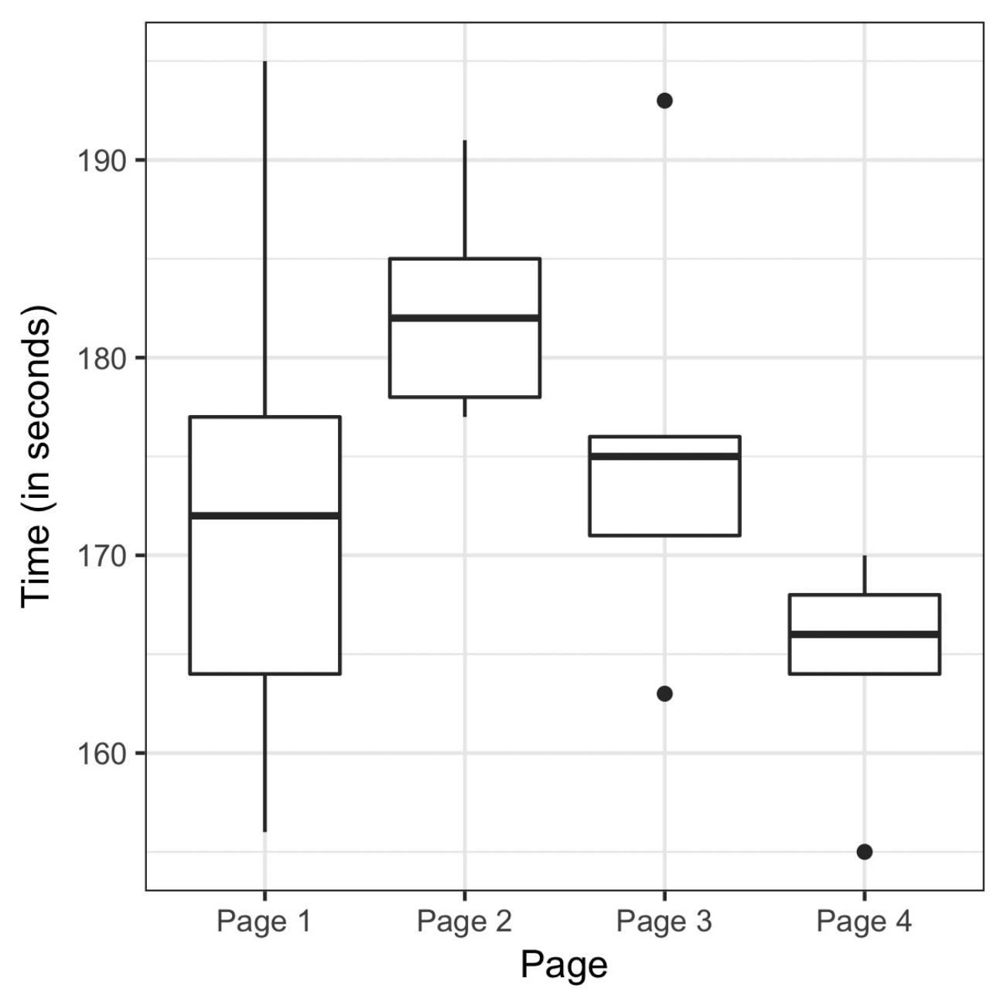

*Figure 3-6. Boxplots of the four groups show considerable differences among them*

The more such *pairwise* comparisons we make, the greater the potential for being fooled by random chance (see ["Multiple](#page-191-0) Testing"). Instead of worrying about all the different comparisons between individual pages we could possibly make, we can do a single overall *omnibus* test that addresses the question, "Could all the pages have the same underlying stickiness, and the differences among them be due to the random way in which a common set of session times got allocated among the four pages?"

The procedure used to test this is ANOVA. The basis for it can be seen in the following resampling procedure (specified here for the A-B-C-D test of web page stickiness):

- 1. Combine all the data together in a single box
- 2. Shuffle and draw out four resamples of five values each
- 3. Record the mean of each of the four groups
- 4. Record the variance among the four group means
- <span id="page-203-0"></span>5. Repeat steps 2–4 many times (say 1,000)

What proportion of the time did the resampled variance exceed the observed variance? This is the p-value.

This type of permutation test is a bit more involved than the type used in ["Permutation](#page-170-0) Test". Fortunately, the aovp function in the lmPerm package computes a permutation test for this case:

```
> library(lmPerm)
> summary(aovp(Time ~ Page, data=four_sessions))
[1] "Settings: unique SS "
Component 1 :
           Df R Sum Sq R Mean Sq Iter Pr(Prob)
Page 3 831.4 277.13 3104 0.09278 .
Residuals 16 1618.4 101.15
---
Signif. codes: 0 '***' 0.001 '**' 0.01 '*' 0.05 '.' 0.1 ' ' 1
```

The p-value, given by Pr(Prob), is 0.09278. The column Iter lists the number of iterations taken in the permutation test. The other columns correspond to a traditional ANOVA table and are described next.

### <span id="page-204-3"></span>**F-Statistic**

<span id="page-204-0"></span>Just like the t-test can be used instead of a permutation test for comparing the mean of two groups, there is a statistical test for ANOVA based on the *F-statistic*. The F-statistic is based on the ratio of the variance across group means (i.e., the treatment effect) to the variance due to residual error. The higher this ratio, the more statistically significant the result. If the data follows a normal distribution, then statistical theory dictates that the statistic should have a certain distribution. Based on this, it is possible to compute a p-value.

In R, we can compute an *ANOVA table* using the aov function:

```
> summary(aov(Time ~ Page, data=four_sessions))
           Df Sum Sq Mean Sq F value Pr(>F)
Page 3 831.4 277.1 2.74 0.0776 .
Residuals 16 1618.4 101.2
---
Signif. codes: 0 '***' 0.001 '**' 0.01 '*' 0.05 '.' 0.1 ' ' 1
```

<span id="page-204-2"></span>Df is "degrees of freedom," Sum Sq is "sum of squares," Mean Sq is "mean squares" (short for mean-squared deviations), and F value is the F-statistic. For the grand average, sum of squares is the departure of the grand average from 0, squared, times 20 (the number of observations). The degrees of freedom for the grand average is 1, by definition. For the treatment means, the degrees of freedom is 3 (once three values are set, and then the grand average is set, the other treatment mean cannot vary). Sum of squares for the treatment means is the sum of squared departures between the treatment means and the grand average. For the residuals, degrees of freedom is 20 (all observations can vary), and SS is the sum of squared difference between the individual observations and the treatment means. Mean squares (MS) is the sum of squares divided by the degrees of freedom. The F-statistic is MS(treatment)/MS(error). The F value thus depends only on this ratio, and can be compared to a standard F distribution to determine whether the differences among treatment means is greater than would be expected in random chance variation.

### **DECOMPOSITION OF VARIANCE**

Observed values in a data set can be considered sums of different components. For any observed data value within a data set, we can break it down into the grand average, the treatment effect, and the residual error. We call this a "decomposition of variance."

- 1. Start with grand average (173.75 for web page stickiness data).
- 2. Add treatment effect, which might be negative (independent variable = web page).
- 3. Add residual error, which might be negative.

Thus, the decomposition of the variance for the top-left value in the A-B-C-D test table is as follows:

- 1. Start with grand average: 173.75
- 2. Add treatment (group) effect: –1.75 (172 173.75).
- 3. Add residual: –8 (164 172).
- 4. Equals: 164.

### <span id="page-206-1"></span>**Two-Way ANOVA**

<span id="page-206-0"></span>The A-B-C-D test just described is a "one-way" ANOVA, in which we have one factor (group) that is varying. We could have a second factor involved — say, "weekend versus weekday" — with data collected on each combination (group A weekend, group A weekday, group B weekend, etc.). This would be a "two-way ANOVA," and we would handle it in similar fashion to the one-way ANOVA by identifying the "interaction effect." After identifying the grand average effect, and the treatment effect, we then separate the weekend and the weekday observations for each group, and find the difference between the averages for those subsets and the treatment average.

You can see that ANOVA, then two-way ANOVA, are the first steps on the road toward a full statistical model, such as regression and logistic regression, in which multiple factors and their effects can be modeled (see [Chapter](#page-230-0) 4).

### **KEY IDEAS**

- ANOVA is a statistical proecdure for analyzing the results of an experiment with multiple groups.
- It is the extension of similar procedures for the A/B test, used to assess whether the overall variation among groups is within the range of chance variation.
- A useful outcome of an ANOVA is the identification of variance components associated with group treatments, interaction effects, and errors.

### <span id="page-207-1"></span>**Further Reading**

- 1. *Introductory Statistics: A Resampling Perspective* by Peter Bruce (Wiley, 2014) has a chapter on ANOVA.
- <span id="page-207-0"></span>2. *Introduction to Design and Analysis of Experiments* by George Cobb (Wiley, 2008) is a comprehensive and readable treatment of its subject.

# <span id="page-208-0"></span>**Chi-Square Test**

Web testing often goes beyond A/B testing and tests multiple treatments at once. The chi-square test is used with count data to test how well it fits some expected distribution. The most common use of the *chi-square* statistic in statistical practice is with contingency tables, to assess whether the null hypothesis of independence among variables is reasonable.

The chi-square test was originally [developed](http://www.economics.soton.ac.uk/staff/aldrich/1900.pdf) by Karl Pearson in 1900. The term "chi" comes from the greek letter used by Pearson in the article.

### <span id="page-208-5"></span><span id="page-208-2"></span><span id="page-208-1"></span>**KEY TERMS**

#### *Chi-square statistic*

A measure of the extent to which some observed data departs from expectation.

#### *Expectation or expected*

How we would expect the data to turn out under some assumption, typically the null hypothesis.

*d.f.*

<span id="page-208-3"></span>Degrees of freedom.

### <span id="page-208-4"></span>**NOTE**

means "rows by columns" — a 2×3 table has two rows and three columns.

### <span id="page-209-5"></span>**Chi-Square Test: A Resampling Approach**

Suppose you are testing three different headlines — A, B, and C — and you run them each on 1,000 visitors, with the results shown in [Table](#page-209-0) 3-4.

|          | Headline<br>A | Headline<br>B | Headline<br>C |
|----------|---------------|---------------|---------------|
| Click    | 14            | 8             | 12            |
| No-click | 986           | 992           | 988           |

<span id="page-209-2"></span><span id="page-209-0"></span>

| Table<br>3-4.<br>Web<br>testing<br>results<br>of<br>three |
|-----------------------------------------------------------|
| different<br>headlines                                    |

The headlines certainly appear to differ. Headline A returns nearly twice the click rate of B. The actual numbers are small, though. A resampling procedure can test whether the click rates differ to an extent greater than chance might cause. For this test, we need to have the "expected" distribution of clicks, and, in this case, that would be under the null hypothesis assumption that all three headlines share the same click rate, for an overall click rate of 34/3,000. Under this assumption, our contingency table would look like [Table](#page-209-1) 3-5.

<span id="page-209-4"></span><span id="page-209-1"></span>*Table 3-5. Expected if all three headlines have the same click rate (null hypothesis)*

<span id="page-209-3"></span>

|          | Headline<br>A | Headline<br>B | Headline<br>C |
|----------|---------------|---------------|---------------|
| Click    | 11.33         | 11.33         | 11.33         |
| No-click | 988.67        | 988.67        | 988.67        |

The *Pearson residual* is defined as:

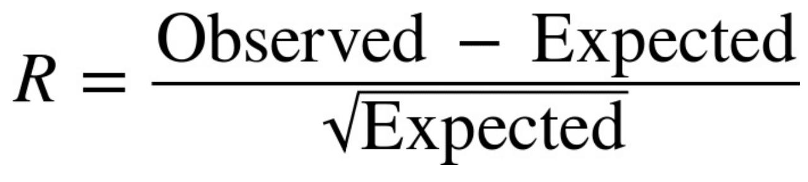

*R* measures the extent to which the actual counts differ from these expected counts (see [Table](#page-210-0) 3-6).

<span id="page-210-0"></span>*Table 3-6. Pearson residuals*

|          | Headline<br>A | Headline<br>B | Headline<br>C |
|----------|---------------|---------------|---------------|
| Click    | 0.792         | -0.990        | 0.198         |
| No-click | -0.085        | 0.106         | -0.021        |

The chi-squared statistic is defined as the sum of the squared Pearson residuals:

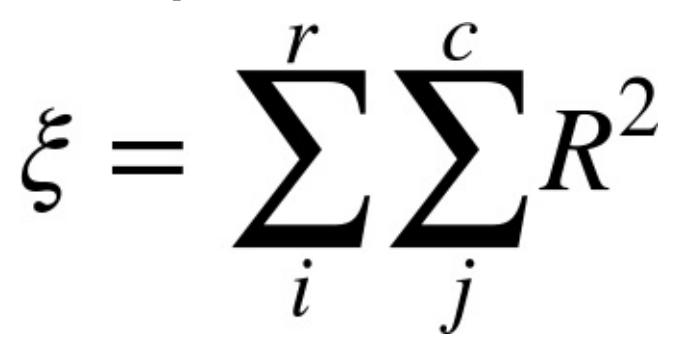

where *r* and *c* are the number of rows and columns, respectively. The chi-squared statistic for this example is 1.666. Is that more than could reasonably occur in a chance model?

We can test with this resampling algorithm:

- 1. Constitute a box with 34 ones (clicks) and 2,966 zeros (no clicks).
- 2. Shuffle, take three separate samples of 1,000, and count the clicks in each.
- 3. Find the squared differences between the shuffled counts and the expected counts, and sum them.
- 4. Repeat steps 2 and 3, say, 1,000 times.
- 5. How often does the resampled sum of squared deviations exceed the observed? That's the p-value.

The function chisq.test can be used to compute a resampled chi-square statistic. For the click data, the chi-square test is:

```
> chisq.test(clicks, simulate.p.value=TRUE)
        Pearson's Chi-squared test with simulated p-value (based on 2000 replicates)
data: clicks
X-squared = 1.6659, df = NA, p-value = 0.4853
```

The test shows that this result could easily have been obtained by randomness.

### <span id="page-212-3"></span>**Chi-Squared Test: Statistical Theory**

<span id="page-212-1"></span><span id="page-212-0"></span>Asymptotic statistical theory shows that the distribution of the chi-squared statistic can be approximated by a *chi-square distribution*. The appropriate standard chisquare [distribution](#page-197-0) is determined by the *degrees of freedom* (see "Degrees of Freedom"). For a contingency table, the degrees of freedom are related to the number of rows (r) and columns (s) as follows:

The chi-square distribution is typically skewed, with a long tail to the right; see [Figure](#page-213-0) 3-7 for the distribution with 1, 2, 5, and 10 degrees of freedom. The further out on the chi-square distribution the observed statistic is, the lower the p-value.

The function chisq.test can be used to compute the p-value using the chisquared distribution as a reference:

```
> chisq.test(clicks, simulate.p.value=FALSE)
        Pearson's Chi-squared test
data: clicks
X-squared = 1.6659, df = 2, p-value = 0.4348
```

The p-value is a little less than the resampling p-value: this is because the chisquare distribution is only an approximation of the actual distribution of the statistic.

<span id="page-213-0"></span>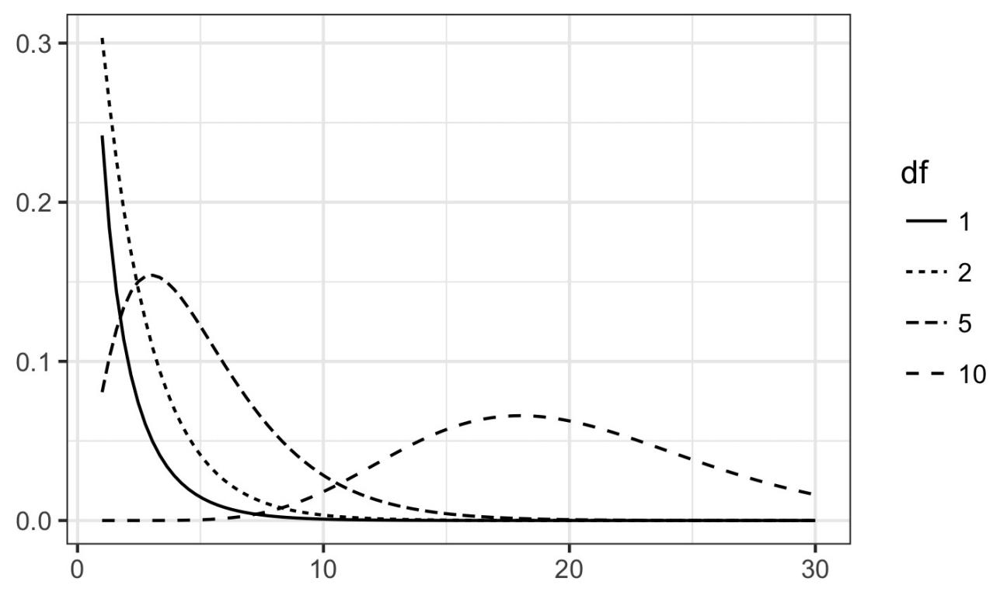

*Figure 3-7. Chi-square distribution with various degrees of freedom (probability on y-axis, value of chisquare statistic on x-axis)*

### <span id="page-214-4"></span>**Fisher's Exact Test**

<span id="page-214-1"></span>The chi-square distribution is a good approximation of the shuffled resampling test just described, except when counts are extremely low (single digits, especially five or fewer). In such cases, the resampling procedure will yield more accurate p-values. In fact, most statistical software has a procedure to actually enumerate *all* the possible rearrangements (permutations) that can occur, tabulate their frequencies, and determine exactly how extreme the observed result is. This is called *Fisher's exact test* after the great statistician R. A. Fisher. R code for Fisher's exact test is simple in its basic form:

<span id="page-214-2"></span>> fisher.test(clicks) Fisher's Exact Test for Count Data data: clicks p-value = 0.4824 alternative hypothesis: two.sided

The p-value is very close to the p-value of 0.4853 obtained using the resampling method.

Where some counts are very low but others are quite high (e.g., the denominator in a conversion rate), it may be necessary to do a shuffled permutation test instead of a full exact test, due to the difficulty of calculating all possible permutations. The preceding R function has several arguments that control whether to use this approximation (simulate.p.value=TRUE or FALSE), how many iterations should be used (B=...), and a computational constraint (workspace=...) that limits how far calculations for the *exact* result should go.

### <span id="page-214-3"></span><span id="page-214-0"></span>**DETECTING SCIENTIFIC FRAUD**

An interesting example is provided by Tufts University researcher Thereza Imanishi-Kari, who was accused in 1991 of fabricating data in her research. Congressman John Dingell became involved, and the case eventually led to the resignation of her colleague, David Baltimore, from the presidency of Rockefeller University.

Imanishi-Kari was ultimately exonerated after a lengthy proceeding. However, one element in the case rested on statistical evidence regarding the expected distribution of digits in her laboratory data, where each observation had many digits. Investigators focused on the *interior* digits, which would be expected to follow a *uniform random* distribution. That is, they would occur randomly, with each digit having equal probability of occurring (the lead digit might be predominantly one value, and the final digits might be affected by rounding). [Table](#page-215-0) 3-7 lists the frequencies of interior digits from the actual data in the case.

<span id="page-215-1"></span><span id="page-215-0"></span>

| Table<br>3-7.<br>Central<br>digit<br>in<br>laboratory<br>data |           |  |
|---------------------------------------------------------------|-----------|--|
| Digit                                                         | Frequency |  |
| 0                                                             | 14        |  |
| 1                                                             | 71        |  |
| 2                                                             | 7         |  |
| 3                                                             | 65        |  |
| 4                                                             | 23        |  |
| 5                                                             | 19        |  |
| 6                                                             | 12        |  |
| 7                                                             | 45        |  |
| 8                                                             | 53        |  |
| 9                                                             | 6         |  |

The distribution of the 315 digits, shown in [Figure](#page-215-1) 3-8 certainly looks nonrandom:

Investigators calculated the departure from expectation (31.5 — that's how often each digit would occur in a strictly uniform distribution) and used a chi-square test (a resampling procedure could equally have been used) to show that the actual distribution was well beyond the range of normal chance variation.

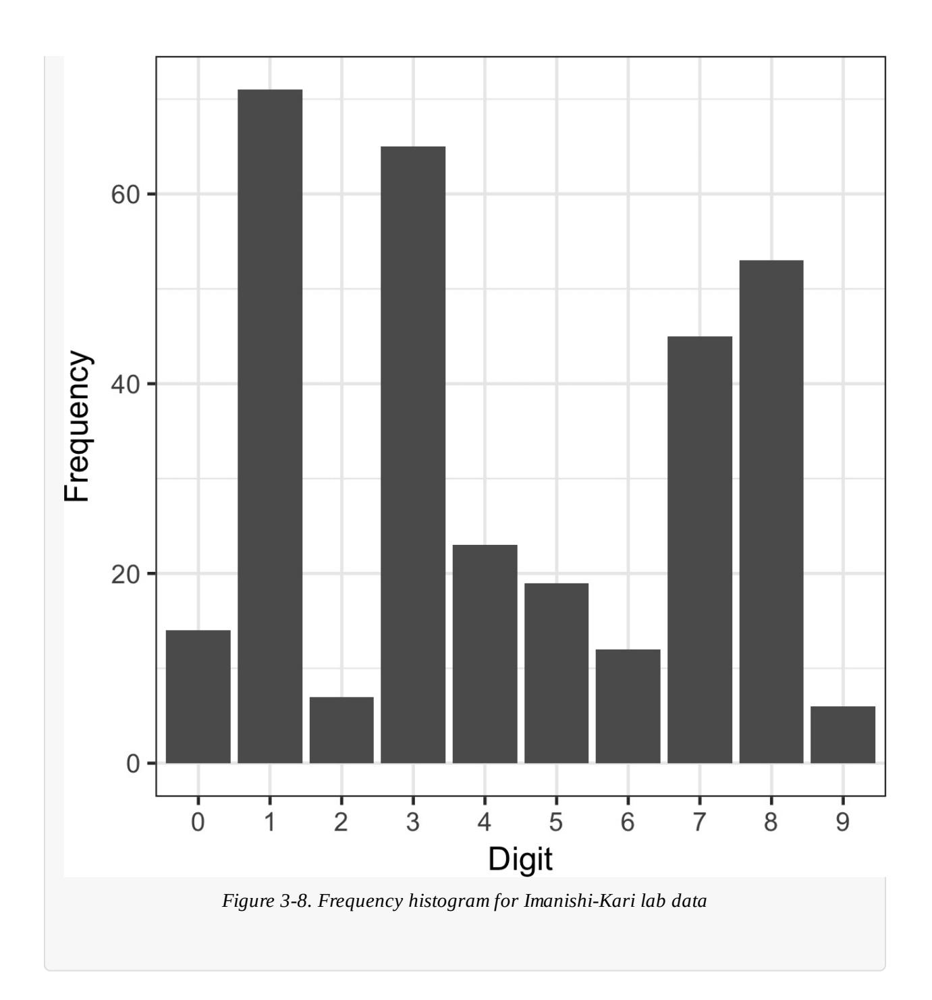

### <span id="page-217-2"></span>**Relevance for Data Science**

<span id="page-217-0"></span>Most standard uses of the chi-square test, or Fisher's exact test, are not terribly relevant for data science. In most experiments, whether A-B or A-B-C…, the goal is not simply to establish statistical significance, but rather to arive at the best treatment. For this purpose, [multi-armed](#page-219-0) bandits (see "Multi-Arm Bandit Algorithm") offer a more complete solution.

One data science application of the chi-square test, especially Fisher's exact version, is in determining appropriate sample sizes for web experiments. These experiments often have very low click rates and, despite thousands of exposures, count rates might be too small to yield definitive conclusions in an experiment. In such cases, Fisher's exact test, the chi-square test, and other tests can be useful as a component of power and sample size [calculations](#page-224-0) (see "Power and Sample Size").

Chi-square tests are used widely in research by investigators in search of the elusive statistically significant p-value that will allow publication. Chi-square tests, or similar resampling simulations, are used in data science applications more as a filter to determine whether an effect or feature is worthy of further consideration than as a formal test of significance. For example, they are used in spatial statistics and mapping to determine whether spatial data conforms to a specified null distribution (e.g., are crimes concentrated in a certain area to a greater degree than random chance would allow?). They can also be used in automated feature selection in machine learning, to assess class prevalence across features and identify features where the prevalence of a certain class is unusually high or low, in a way that is not compatible with random variation.

### <span id="page-217-1"></span>**KEY IDEAS**

- A common procedure in statistics is to test whether observed data counts are consistent with an assumption of independence (e.g., propensity to buy a particular item is independent of gender).
- The chi-square distribution is the reference distribution (which embodies the assumption of independence) to which the observed calculated chi-square statistic must be compared.

### <span id="page-218-1"></span>**Further Reading**

- R. A. Fisher's famous "Lady Tasting Tea" example from the beginning of the 20th century remains a simple and effective illustration of his exact test. Google "Lady Tasting Tea," and you will find a number of good writeups.
- <span id="page-218-0"></span>Stat Trek offers a good tutorial on the [chi-square](http://stattrek.com/chi-square-test/independence.aspx?Tutorial=AP) test.

# <span id="page-219-0"></span>**Multi-Arm Bandit Algorithm**

Multi-arm bandits offer an approach to testing, especially web testing, that allows explicit optimization and more rapid decision making than the traditional statistical approach to designing experiments.

#### <span id="page-219-4"></span><span id="page-219-3"></span><span id="page-219-2"></span>**KEY TERMS**

#### *Multi-arm bandit*

An imaginary slot machine with multiple arms for the customer to choose from, each with different payoffs, here taken to be an analogy for a multitreatment experiment.

*Arm*

<span id="page-219-1"></span>A treatment in an experiment (e.g., "headline A in a web test").

*Win*

The experimental analog of a win at the slot machine (e.g., "customer clicks on the link").

A traditional A/B test involves data collected in an experiment, according to a specified design, to answer a specific question such as, "Which is better, treatment A or treatment B?" The presumption is that once we get an answer to that question, the experimenting is over and we proceed to act on the results.

You can probably perceive several difficulties with that approach. First, our answer may be inconclusive: "effect not proven." In other words, the results from the experiment may suggest an effect, but if there is an effect, we don't have a big enough sample to prove it (to the satisfaction of the traditional statistical standards). What decision do we take? Second, we might want to begin taking advantage of results that come in prior to the conclusion of the experiment. Third, we might want the right to change our minds or to try something different based on additional data that comes in after the experiment is over. The traditional approach to experiments and hypothesis tests dates from the 1920s, and is rather inflexible. The advent of computer power and software has enabled more powerful flexible approaches. Moreover, data science (and business in general) is not so worried about statistical significance, but more concerned with optimizing overall effort and results.

Bandit algorithms, which are very popular in web testing, allow you to test

<span id="page-220-0"></span>multiple treatments at once and reach conclusions faster than traditional statistical designs. They take their name from slot machines used in gambling, also termed one-armed bandits (since they are configured in such a way that they extract money from the gambler in a steady flow). If you imagine a slot machine with more than one arm, each arm paying out at a different rate, you would have a multi-armed bandit, which is the full name for this algorithm.

Your goal is to win as much money as possible, and more specifically, to identify and settle on the winning arm sooner rather than later. The challenge is that you don't know at what rate the arms pay out — you only know the results of pulling the arm. Suppose each "win" is for the same amount, no matter which arm. What differs is the probability of a win. Suppose further that you initially try each arm 50 times and get the following results:

- Arm A: 10 wins out of 50
- Arm B: 2 win out of 50
- Arm C: 4 wins out of 50

One extreme approach is to say, "Looks like arm A is a winner — let's quit trying the other arms and stick with A." This takes full advantage of the information from the initial trial. If A is truly superior, we get the benefit of that early on. On the other hand, if B or C is truly better, we lose any opportunity to discover that. Another extreme approach is to say, "This all looks to be within the realm of chance — let's keep pulling them all equally." This gives maximum opportunity for alternates to A to show themselves. However, in the process, we are deploying what seem to be inferior treatments. How long do we permit that? Bandit algorithms take a hybrid approach: we start pulling A more often, to take advantage of its apparent superiority, but we don't abandon B and C. We just pull them less often. If A continues to outperform, we continue to shift resources (pulls) away from B and C and pull A more often. If, on the other hand, C starts to do better, and A starts to do worse, we can shift pulls from A back to C. If one of them turns out to be superior to A and this was hidden in the initial trial due to chance, it now has an opportunity to emerge with further testing.

Now think of applying this to web testing. Instead of multiple slot machine arms, you might have multiple offers, headlines, colors, and so on, being tested on a

website. Customers either click (a "win" for the merchant) or don't click. Initially, the offers are shown randomly and equally. If, however, one offer starts to outperform the others, it can be shown ("pulled") more often. But what should the parameters of the algorithm that modifies the pull rates be? What "pull rates" should we change to, and when should we change?

Here is one simple algorithm, the epsilon-greedy algorithm for an A/B test:

- <span id="page-221-0"></span>1. Generate a random number between 0 and 1.
- 2. If the number lies between 0 and epsilon (where epsilon is a number between 0 and 1, typically fairly small), flip a fair coin (50/50 probability), and:
  - a. If the coin is heads, show offer A.
  - b. If the coin is tails, show offer B.
- 3. If the number is ≥ epsilon, show whichever offer has had the highest response rate to date.

Epsilon is the single parameter that governs this algorithm. If epsilon is 1, we end up with a standard simple A/B experiment (random allocation between A and B for each subject). If epsilon is 0, we end up with a purely *greedy* algorithm — it seeks no further experimentation, simply assigning subjects (web visitors) to the best-performing treatment.

<span id="page-221-3"></span><span id="page-221-2"></span><span id="page-221-1"></span>A more sophisticated algorithm uses "Thompson's sampling." This procedure "samples" (pulls a bandit arm) at each stage to maximize the probability of choosing the best arm. Of course you don't know which is the best arm — that's the whole problem! — but as you observe the payoff with each successive draw, you gain more information. Thompson's sampling uses a Bayesian approach: some prior distribution of rewards is assumed initially, using what is called a *beta distribution* (this is a common mechanism for specifying prior information in a Bayesian problem). As information accumulates from each draw, this information can be updated, allowing the selection of the next draw to be better optimized as far as choosing the right arm.

Bandit algorithms can efficiently handle 3+ treatments and move toward optimal selection of the "best." For traditional statistical testing procedures, the

complexity of decision making for 3+ treatments far outstrips that of the traditional A/B test, and the advantage of bandit algorithms is much greater.

#### <span id="page-222-0"></span>**KEY IDEAS**

- Traditional A/B tests envision a random sampling process, which can lead to excessive exposure to the inferior treatment.
- Multi-arm bandits, in contrast, alter the sampling process to incorporate information learned during the experiment and reduce the frequency of the inferior treatment.
- They also facilitate efficient treatment of more than two treatments.
- There are different algorithms for shifting sampling probability away from the inferior treatment(s) and to the (presumed) superior one.

### <span id="page-223-1"></span>**Further Reading**

- An excellent short treatment of multi-arm bandit algorithms is found in *Bandit Algorithms*, by John Myles White (O'Reilly, 2012). White includes Python code, as well as the results of simulations to assess the performance of bandits.
- <span id="page-223-0"></span>For more (somewhat technical) information about Thompson sampling, see "Analysis of Thompson Sampling for the [Multi-armed](http://jmlr.org/proceedings/papers/v23/agrawal12/agrawal12.pdf) Bandit Problem" by Shipra Agrawal and Navin Goyal.

### <span id="page-224-0"></span>**Power and Sample Size**

If you run a web test, how do you decide how long it should run (i.e., how many impressions per treatment are needed)? Despite what you may read in many guides to web testing on the web, there is no good general guidance — it depends, mainly, on the frequency with which the desired goal is attained.

#### <span id="page-224-4"></span><span id="page-224-3"></span><span id="page-224-2"></span>**KEY TERMS**

#### *Effect size*

<span id="page-224-1"></span>The minimum size of the effect that you hope to be able to detect in a statistical test, such as "a 20% improvement in click rates".

#### *Power*

The probability of detecting a given effect size with a given sample size.

#### *Significance level*

The statisticalsignificance level at which the test will be conducted.

One step in statistical calculations for sample size is to ask "Will a hypothesis test actually reveal a difference between treatments A and B?" The outcome of a hypothesis test — the p-value — depends on what the real difference is between treatment A and treatment B. It also depends on the luck of the draw — who gets selected for the groups in the experiment. But it makes sense that the bigger the actual difference between treatments A and B, the greater the probability that our experiment will reveal it; and the smaller the difference, the more data will be needed to detect it. To distinguish between a .350 hitter in baseball, and a .200 hitter, not that many at-bats are needed. To distinguish between a .300 hitter and a .280 hitter, a good many more at-bats will be needed.

*Power* is the probability of detecting a specified *effect size* with specified sample characteristics (size and variability). For example, we might say (hypothetically) that the probability of distinguishing between a .330 hitter and a .200 hitter in 25 at-bats is 0.75. The effect size here is a difference of .130. And "detecting" means that a hypothesis test will reject the null hypothesis of "no difference" and conclude there is a real effect. So the experiment of 25 at-bats (*n* = 25) for two hitters, with an effect size of 0.130, has (hypothetical) power of 0.75 or 75%.

You can see that there are several moving parts here, and it is easy to get tangled up with the numerous statistical assumptions and formulas that will be needed (to specify sample variability, effect size, sample size, alpha-level for the hypothesis test, etc., and to calculate power). Indeed, there is special-purpose statistical software to calculate power. Most data scientists will not need to go through all the formal steps needed to report power, for example, in a published paper. However, they may face occasions where they want to collect some data for an A/B test, and collecting or processing the data involves some cost. In that case, knowing approximately how much data to collect can help avoid the situation where you collect data at some effort, and the result ends up being inconclusive. Here's a fairly intuitive alternative approach:

- 1. Start with some hypothetical data that represents your best guess about the data that will result (perhaps based on prior data) — for example, a box with 20 ones and 80 zeros to represent a .200 hitter, or a box with some observations of "time spent on website."
- 2. Create a second sample simply by adding the desired effect size to the first sample — for example, a second box with 33 ones and 67 zeros, or a second box with 25 seconds added to each initial "time spent on website."
- 3. Draw a bootstrap sample of size *n* from each box.
- 4. Conduct a permutation (or formula-based) hypothesis test on the two bootstrap samples and record whether the difference between them is statistically significant.
- 5. Repeat the preceding two steps many times and determine how often the difference was significant — that's the estimated power.

### <span id="page-226-0"></span>**Sample Size**

The most common use of power calculations is to estimate how big a sample you will need.

For example, suppose you are looking at click-through rates (clicks as a percentage of exposures), and testing a new ad against an existing ad. How many clicks do you need to accumulate in the study? If you are only interested in results that show a huge difference (say a 50% difference), a relatively small sample might do the trick. If, on the other hand, even a minor difference would be of interest, then a much larger sample is needed. A standard approach is to establish a policy that a new ad must do better than an existing ad by some percentage, say 10%; otherwise, the existing ad will remain in place. This goal, the "effect size," then drives the sample size.

For example, suppose current click-through rates are about 1.1%, and you are seeking a 10% boost to 1.21%. So we have two boxes, box A with 1.1% ones (say 110 ones and 9,890 zeros), and box B with 1.21% ones (say 121 ones and 9,879 zeros). For starters, let's try 300 draws from each box (this would be like 300 "impressions" for each ad). Suppose our first draw yields the following:

- Box A: 3 ones
- Box B: 5 ones

Right away we can see that any hypothesis test would reveal this difference (5 versus 3) to be well within the range of chance variation. This combination of sample size (*n* = 300 in each group) and effect size (10% difference) is too small for any hypothesis test to reliably show a difference.

So we can try increasing the sample size (let's try 2,000 impressions), and require a larger improvement (30% instead of 10%).

For example, suppose current click-through rates are still 1.1%, but we are now seeking a 50% boost to 1.65%. So we have two boxes: box A still with 1.1% ones (say 110 ones and 9,890 zeros), and box B with 1.65% ones (say 165 ones and 9,868 zeros). Now we'll try 2,000 draws from each box. Suppose our first draw yields the following:

Box A: 19 ones

Box B: 34 ones

A significance test on this difference (34–19) shows it still registers as "not significant" (though much closer to significance than the earlier difference of 5–3). To calculate power, we would need to repeat the previous procedure many times, or use statistical software that can calculate power, but our initial draw suggests to us that even detecting a 50% improvement will require several thousand ad impressions.

In summary, for calculating power or required sample size, there are four moving parts:

- Sample size
- Effect size you want to detect
- Significance level (alpha) at which the test will be conducted
- Power

Specify any three of them, and the fourth can be calculated. Most commonly, you would want to calculate sample size, so you must specify the other three. Here is R code for a test involving two proportions, where both samples are the same size (this uses the pwr package):

```
pwr.2p.test(h = ..., n = ..., sig.level = ..., power = )
h= effect size (as a proportion)
n = sample size
sig.level = the significance level (alpha) at which the test will be conducted
power = power (probability of detecting the effect size)
```

### <span id="page-227-0"></span>**KEY IDEAS**

- Finding out how big a sample size you need requires thinking ahead to the statistical test you plan to conduct.
- You must specify the minimum size of the effect that you want to detect.
- You must also specify the required probability of detecting that effect size (power).
- Finally, you must specify the significance level (alpha) at which the test will be conducted.

### <span id="page-228-1"></span>**Further Reading**

- 1. *Sample Size Determination and Power*, by Tom Ryan (Wiley, 2013), is a comprehensive and readable review of this subject.
- <span id="page-228-0"></span>2. Steve Simon, a statistical consultant, has written a very engaging [narrative-style](http://www.pmean.com/09/AppropriateSampleSize.html) post on the subject.

### <span id="page-229-2"></span>**Summary**

The principles of experimental design — randomization of subjects into two or more groups receiving different treatments — allow us to draw valid conclusions about how well the treatments work. It is best to include a control treatment of "making no change." The subject of formal statistical inference — hypothesis testing, p-values, t-tests, and much more along these lines — occupies much time and space in a traditional statistics course or text, and the formality is mostly unneeded from a data science perspective. However, it remains important to recognize the role that random variation can play in fooling the human brain. Intuitive resampling procedures (permutation and bootstrap) allow data scientists to gauge the extent to which chance variation can play a role in their data analysis.

<span id="page-229-1"></span><span id="page-229-0"></span>The multiplication rule states that the probability of *n* independent events all happening is the product of the individual probabilities. For example, if you and I each flip a coin once, the probability that your coin and my coin will both land heads is 0.5 × 0.5 = 0.25. [1](#page-191-1)

# <span id="page-230-0"></span>**Chapter 4. Regression and Prediction**

Perhaps the most common goal in statistics is to answer the question: Is the variable *X* (or more likely, ) associated with a variable *Y*, and, if so, what is the relationship and can we use it to predict *Y*?

<span id="page-230-2"></span><span id="page-230-1"></span>Nowhere is the nexus between statistics and data science stronger than in the realm of prediction — specifically the prediction of an outcome (target) variable based on the values of other "predictor" variables. Another important connection is in the area of *anomaly detection*, where regression diagnostics originally intended for data analysis and improving the regression model can be used to detect unusual records. The antecedents of correlation and linear regression date back over a century.

### <span id="page-231-10"></span>**Simple Linear Regression**

Simple linear regression models the relationship between the magnitude of one variable and that of a second — for example, as *X* increases, *Y* also increases. Or as *X* increases, *Y* decreases. [1](#page-308-0) Correlation is another way to measure how two variables are related: see the section ["Correlation".](#page-67-0) The difference is that while correlation measures the strength of an association between two variables, regression quantifies the nature of the relationship.

#### <span id="page-231-8"></span><span id="page-231-5"></span><span id="page-231-1"></span><span id="page-231-0"></span>**KEY TERMS FOR SIMPLE LINEAR REGRESSION**

#### *Response*

The variable we are trying to predict.

*Synonyms*

<span id="page-231-3"></span>dependent variable, Y-variable, target, outcome

#### *Independent variable*

The variable used to predict the response.

*Synonyms*

independent variable, X-variable, feature, attribute

#### *Record*

The vector of predictor and outcome values for a specific individual or case.

*Synonyms*

<span id="page-231-6"></span>row, case, instance, example

#### *Intercept*

The intercept of the regression line — that is, the predicted value when .

*Synonyms*

<span id="page-231-4"></span>
$$b_{0,\beta_{0}}$$

#### *Regression coefficient*

The slope of the regression line.

*Synonyms*

<span id="page-231-9"></span><span id="page-231-7"></span><span id="page-231-2"></span>slope, , , parameter estimates, weights

#### *Fitted values*

The estimates obtained from the regression line.

*Synonyms*

<span id="page-232-1"></span>predicted values

#### *Residuals*

The difference between the observed values and the fitted values.

*Synonyms*

errors

#### *Least squares*

The method of fitting a regression by minimizing the sum of squared residuals.

*Synonyms*

<span id="page-232-0"></span>ordinary least squares

### <span id="page-233-0"></span>**The Regression Equation**

<span id="page-233-4"></span>Simple linear regression estimates exactly how much *Y* will change when *X* changes by a certain amount. With the correlation coefficient, the variables *X* and *Y* are interchangable. With regression, we are trying to predict the *Y* variable from *X* using a linear relationship (i.e., a line):

<span id="page-233-1"></span>We read this as "Y equals b<sup>1</sup> times X, plus a constant b<sup>0</sup> ." The symbol is known as the *intercept* (or constant), and the symbol as the *slope* for *X*. Both appear in R output as *coefficients*, though in general use the term *coefficient* is often reserved for . The *Y* variable is known as the *response* or *dependent* variable since it depends on *X*. The *X* variable is known as the *predictor* or *independent* variable. The machine learning community tends to use other terms, calling *Y* the *target* and *X* a *feature* vector.

<span id="page-233-3"></span><span id="page-233-2"></span>Consider the scatterplot in [Figure](#page-233-0) 4-1 displaying the number of years a worker was exposed to cotton dust (Exposure) versus a measure of lung capacity (PEFR or "peak expiratory flow rate"). How is PEFR related to Exposure? It's hard to tell just based on the picture.

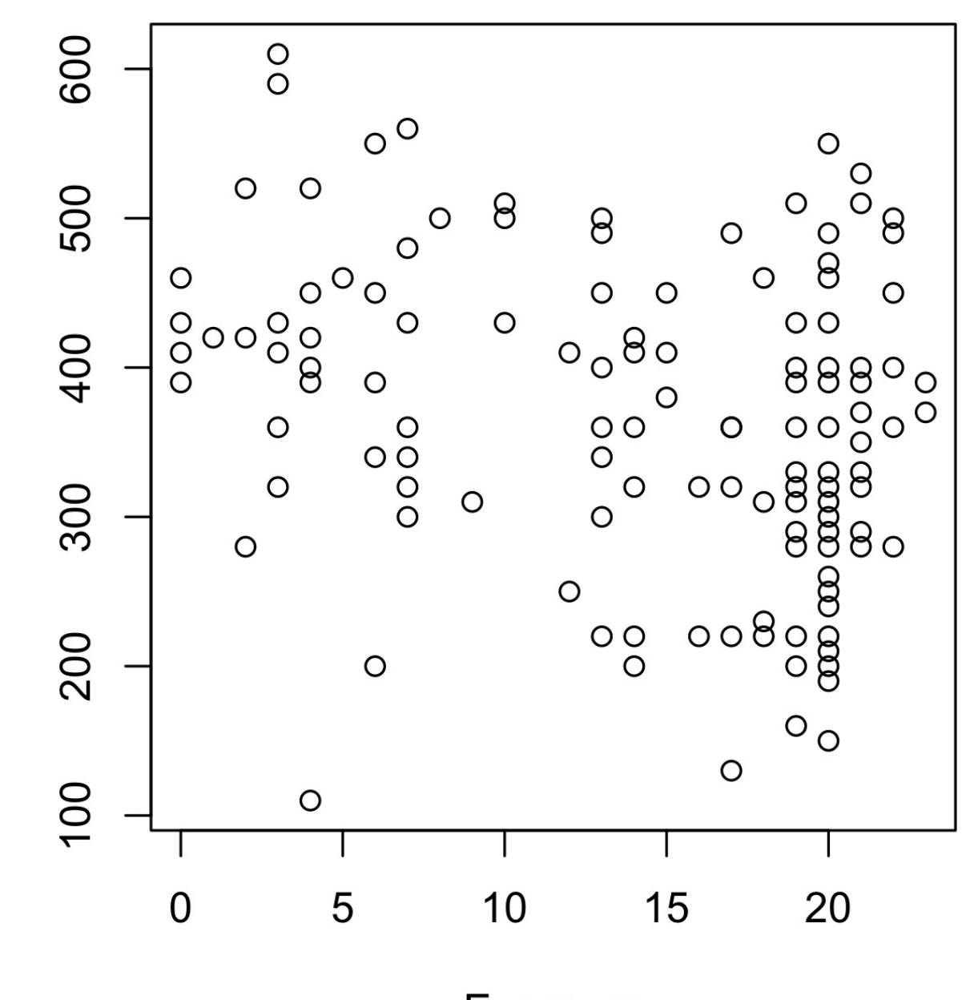

*Figure 4-1. Cotton exposure versus lung capacity*

Simple linear regression tries to find the "best" line to predict the response PEFR as a function of the predictor variable Exposure.

The lm function in R can be used to fit a linear regression.

```
model <- lm(PEFR ~ Exposure, data=lung)
```

lm standards for *linear model* and the ~ symbol denotes that PEFR is predicted by Exposure.

Printing the model object produces the following output:

```
Call:
lm(formula = PEFR ~ Exposure, data = lung)
Coefficients:
(Intercept) Exposure
   424.583 -4.185
```

The intercept, or , is 424.583 and can be interpreted as the predicted PEFR for a worker with zero years exposure. The regression coefficient, or , can be interpreted as follows: for each additional year that a worker is exposed to cotton dust, the worker's PEFR measurement is reduced by –4.185.

<span id="page-235-0"></span>The regression line from this model is displayed in [Figure](#page-235-0) 4-2.

<span id="page-235-2"></span><span id="page-235-1"></span>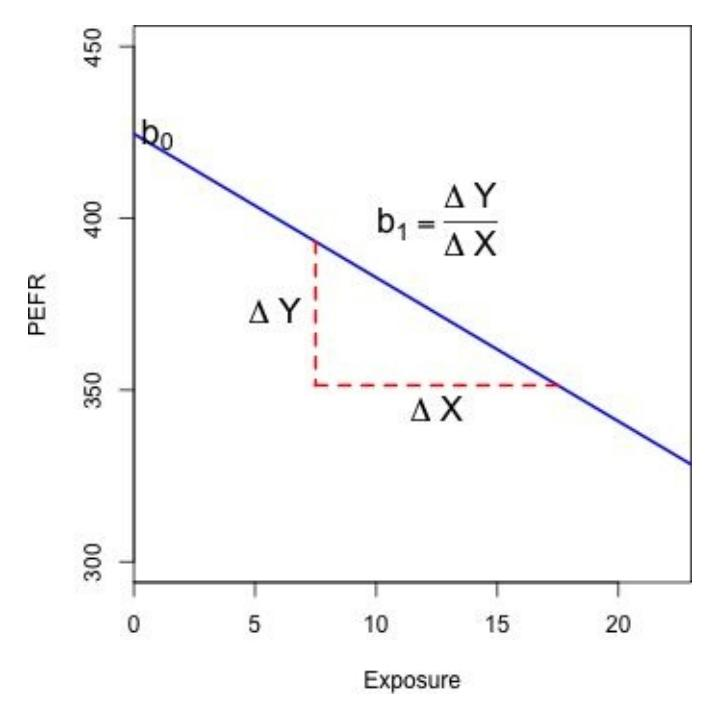

*Figure 4-2. Slope and intercept for the regression fit to the lung data*

### <span id="page-236-3"></span>**Fitted Values and Residuals**

<span id="page-236-1"></span>Important concepts in regression analysis are the *fitted* values and *residuals*. In general, the data doesn't fall exactly on a line, so the regression equation should include an explicit error term :

$$Y_i = b_0 + b_1 X_i + e_i$$

The *fitted* values, also referred to as the *predicted* values, are typically denoted by (Y-hat). These are given by:

<span id="page-236-2"></span>
$$\hat{Y}_i = \hat{b}_0 + \hat{b}_1 X_i$$

<span id="page-236-0"></span>The notation and indicates that the coefficients are estimated versus known.

### <span id="page-237-2"></span><span id="page-237-0"></span>**HAT NOTATION: ESTIMATES VERSUS KNOWN VALUES**

<span id="page-237-3"></span><span id="page-237-1"></span>The "hat" notation is used to differentiate between estimates and known values. So the symbol ("b-hat") is an estimate of the unknown parameter . Why do statisticians differentiate between the estimate and the true value? The estimate has uncertainty, whereas the true value is fixed. [2](#page-308-1)

We compute the residuals by subtracting the *predicted* values from the original data:

$$\hat{e}_i = Y_i - \hat{Y}_i$$

In R, we can obtain the fitted values and residuals using the functions predict and residuals:

```
fitted <- predict(model)
resid <- residuals(model)
```

[Figure](#page-237-0) 4-3 illustrates the residuals from the regression line fit to the lung data. The residuals are the length of the vertical dashed lines from the data to the line.

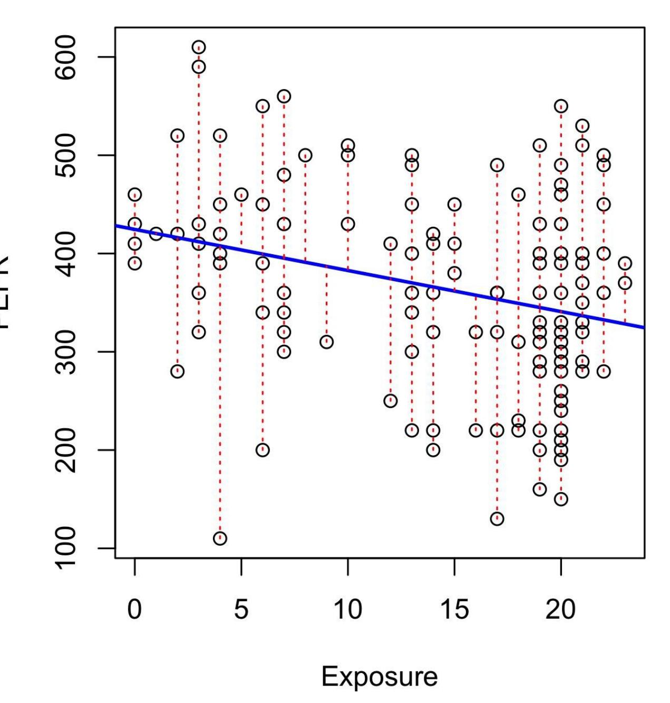

*Figure 4-3. Residuals from a regression line (note the different y-axis scale from [Figure](#page-235-0) 4-2, hence the apparently different slope)*

### <span id="page-239-0"></span>**Least Squares**

<span id="page-239-3"></span><span id="page-239-1"></span>How is the model fit to the data? When there is a clear relationship, you could imagine fitting the line by hand. In practice, the regression line is the estimate that minimizes the sum of squared residual values, also called the *residual sum of squares* or *RSS*:

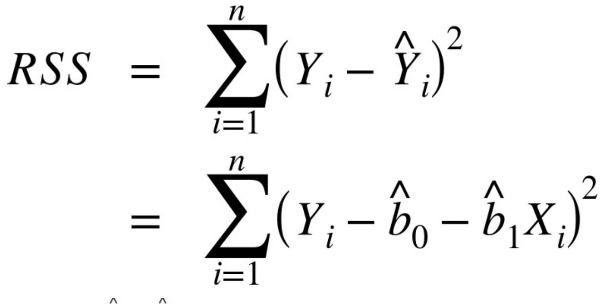

The estimates and are the values that minimize RSS.

<span id="page-239-2"></span>The method of minimizing the sum of the squared residuals is termed *least squares* regression, or *ordinary least squares* (OLS) regression. It is often attributed to Carl Friedrich Gauss, the German mathmetician, but was first published by the French mathmetician Adrien-Marie Legendre in 1805. Least squares regression leads to a simple formula to compute the coefficients:

<span id="page-240-0"></span>Historically, computational convenience is one reason for the widespread use of least squares in regression. With the advent of big data, computational speed is still an important factor. Least squares, like the mean (see "Median and Robust [Estimates"\),](#page-30-0) are sensitive to outliers, although this tends to be a signicant problem only in small or moderate-sized problems. See ["Outliers"](#page-280-0) for a discussion of outliers in regression.

### <span id="page-241-0"></span>**REGRESSION TERMINOLOGY**

When analysts and researchers use the term *regression* by itself, they are typically referring to linear regression; the focus is usually on developing a linear model to explain the relationship between predictor variables and a numeric outcome variable. In its formalstatisticalsense, regression also includes nonlinear models that yield a functional relationship between predictors and outcome variables. In the machine learning community, the term is also occasionally used loosely to refer to the use of any predictive model that produces a predicted numeric outcome (standing in distinction from classification methods that predict a binary or categorical outcome).

### <span id="page-242-4"></span>**Prediction versus Explanation (Profiling)**

<span id="page-242-2"></span>Historically, a primary use of regression was to illuminate a supposed linear relationship between predictor variables and an outcome variable. The goal has been to understand a relationship and explain it using the data that the regression was fit to. In this case, the primary focus is on the estimated slope of the regression equation, . Economists want to know the relationship between consumer spending and GDP growth. Public health officials might want to understand whether a public information campaign is effective in promoting safe sex practices. In such cases, the focus is not on predicting individual cases, but rather on understanding the overall relationship.

<span id="page-242-0"></span>With the advent of big data, regression is widely used to form a model to predict individual outcomes for new data, rather than explain data in hand (i.e., a predictive model). In this instance, the main items of interest are the fitted values . In marketing, regression can be used to predict the change in revenue in response to the size of an ad campaign. Universities use regression to predict students' GPA based on their SAT scores.

<span id="page-242-3"></span><span id="page-242-1"></span>A regression model that fits the data well is set up such that changes in X lead to changes in Y. However, by itself, the regression equation does not prove the direction of causation. Conclusions about causation must come from a broader context of understanding about the relationship. For example, a regression equation might show a definite relationship between number of clicks on a web ad and number of conversions. It is our knowledge of the marketing process, not the regression equation, that leads us to the conclusion that clicks on the ad lead to sales, and not vice versa.

### **KEY IDEAS**

- The regression equation models the relationship between a response variable *Y* and a predictor variable *X* as a line.
- A regression model yields fitted values and residuals predictions of the response and the errors of the predictions.
- Regression models are typically fit by the method of least squares.
- Regression is used both for prediction and explanation.

### <span id="page-244-1"></span>**Further Reading**

<span id="page-244-0"></span>For an in-depth treatment of prediction versus explanation, see Galit Shmueli's article "To Explain or to [Predict".](https://projecteuclid.org/euclid.ss/1294167961)

### <span id="page-245-0"></span>**Multiple Linear Regression**

When there are multiple predictors, the equation is simply extended to accommodate them:

$$Y = b_0 + b_1 X_1 + b_2 X_2 + \dots + b_p X_p + e$$

Instead of a line, we now have a linear model — the relationship between each coefficient and its variable (feature) is linear.

#### <span id="page-245-4"></span><span id="page-245-1"></span>**KEY TERMS FOR MULTIPLE LINEAR REGRESSION**

#### *Root mean squared error*

The square root of the average squared error of the regression (this is the most widely used metric to compare regression models).

*Synonyms*

RMSE

#### *Residual standard error*

The same as the root mean squared error, but adjusted for degrees of freedom.

*Synonyms*

<span id="page-245-3"></span><span id="page-245-2"></span>RSE

#### *R-squared*

The proportion of variance explained by the model, from 0 to 1.

*Synonyms*

<span id="page-245-5"></span>coefficient of determination,

#### *t-statistic*

The coefficient for a predictor, divided by the standard error of the coefficient, giving a metric to compare the importance of variables in the model.

#### *Weighted regression*

Regression with the records having different weights.

All of the other concepts in simple linear regression, such as fitting by least squares and the definition of fitted values and residuals, extend to the multiple linear regression setting. For example, the fitted values are given by:

 $\hat{Y}_{i} = \hat{b}_{0} + \hat{b}_{1}X_{1,i} + \hat{b}_{2}X_{2,i} + \dots + \hat{b}_{p}X_{p,i}$ 

### <span id="page-247-0"></span>**Example: King County Housing Data**

An example of using regression is in estimating the value of houses. County assessors must estimate the value of a house for the purposes of assessing taxes. Real estate consumers and professionals consult popular websites such as [Zillow](http://zillow.com) to ascertain a fair price. Here are a few rows of housing data from King County (Seattle), Washington, from the house data.frame:

```
head(house[, c("AdjSalePrice", "SqFtTotLiving", "SqFtLot", "Bathrooms",
         "Bedrooms", "BldgGrade")])
Source: local data frame [6 x 6]
 AdjSalePrice SqFtTotLiving SqFtLot Bathrooms Bedrooms BldgGrade
     (dbl) (int) (int) (dbl) (int) (int)
1 300805 2400 9373 3.00 6 7
2 1076162 3764 20156 3.75 4 10
3 761805 2060 26036 1.75 4 8
4 442065 3200 8618 3.75 5 7
5 297065 1720 8620 1.75 4 7
6 411781 930 1012 1.50 2 8
```

The goal is to predict the sales price from the other variables. The lm handles the multiple regression case simply by including more terms on the righthand side of the equation; the argument na.action=na.omit causes the model to drop records that have missing values:

```
house_lm <- lm(AdjSalePrice ~ SqFtTotLiving + SqFtLot + Bathrooms +
                 Bedrooms + BldgGrade,
               data=house, na.action=na.omit)
```

Printing house\_lm object produces the following output:

```
house_lm
Call:
lm(formula = AdjSalePrice ~ SqFtTotLiving + SqFtLot + Bathrooms +
   Bedrooms + BldgGrade, data = house, na.action = na.omit)
Coefficients:
 (Intercept) SqFtTotLiving SqFtLot Bathrooms
  -5.219e+05 2.288e+02 -6.051e-02 -1.944e+04
    Bedrooms BldgGrade
  -4.778e+04 1.061e+05
```

The interpretation of the coefficients is as with simple linear regression: the

<span id="page-248-0"></span>predicted value changes by the coefficient for each unit change in assuming all the other variables, for , remain the same. For example, adding an extra finished square foot to a house increases the estimated value by roughly \$229; adding 1,000 finished square feet implies the value will increase by \$228,800.

### <span id="page-249-0"></span>**Assessing the Model**

<span id="page-249-1"></span>The most important performance metric from a data science perspective is *root mean squared error*, or *RMSE*. RMSE is the square root of the average squared error in the predicted values:

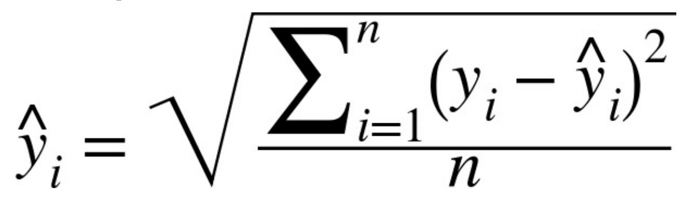

<span id="page-249-2"></span>This measures the overall accuracy of the model, and is a basis for comparing it to other models (including models fit using machine learning techniques). Similar to RMSE is the *residual standard error*, or *RSE*. In this case we have *p* predictors, and the RSE is given by:

$$RSE = \sqrt{\frac{\sum_{i=1}^{n} (y_i - \hat{y}_i)^2}{(n - p - 1)}}$$

The only difference is that the denominator is the degrees of freedom, as opposed to number of records (see "Degrees of [Freedom"\)](#page-197-0). In practice, for linear regression, the difference between RMSE and RSE is very small, particularly for big data applications.

The summary function in R computes RSE as well as other metrics for a regression model:

```
summary(house_lm)
Call:
lm(formula = AdjSalePrice ~ SqFtTotLiving + SqFtLot + Bathrooms +
    Bedrooms + BldgGrade, data = house, na.action = na.omit)
```

Residuals: Min 1Q Median 3Q Max -1199508 -118879 -20982 87414 9472982 Coefficients: Estimate Std. Error t value Pr(>|t|) (Intercept) -5.219e+05 1.565e+04 -33.349 < 2e-16 \*\*\* SqFtTotLiving 2.288e+02 3.898e+00 58.699 < 2e-16 \*\*\* SqFtLot -6.051e-02 6.118e-02 -0.989 0.323 Bathrooms -1.944e+04 3.625e+03 -5.362 8.32e-08 \*\*\* Bedrooms -4.778e+04 2.489e+03 -19.194 < 2e-16 \*\*\* BldgGrade 1.061e+05 2.396e+03 44.287 < 2e-16 \*\*\* --- Signif. codes: 0 '\*\*\*' 0.001 '\*\*' 0.01 '\*' 0.05 '.' 0.1 ' ' 1 Residual standard error: 261200 on 22683 degrees of freedom Multiple R-squared: 0.5407, Adjusted R-squared: 0.5406 F-statistic: 5340 on 5 and 22683 DF, p-value: < 2.2e-16

Another useful metric that you will see in software output is the *coefficient of determination*, also called the *R-squared* statistic or . R-squared ranges from 0 to 1 and measures the proportion of variation in the data that is accounted for in the model. It is useful mainly in explanatory uses of regression where you want to assess how well the model fits the data. The formula for is:

<span id="page-250-1"></span>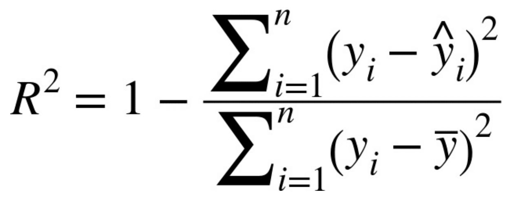

The denominator is proportional to the variance of *Y*. The output from R also reports an *adjusted R-squared*, which adjusts for the degrees of freedom; seldom is this significantly different in multiple regression.

<span id="page-250-2"></span><span id="page-250-0"></span>Along with the estimated coefficients, R reports the standard error of the coefficients (SE) and a *t-statistic*:

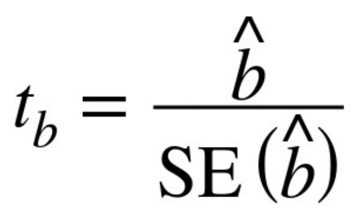

The t-statistic — and its mirror image, the p-value — measures the extent to which a coefficient is "statistically significant" — that is, outside the range of what a random chance arrangement of predictor and target variable might produce. The higher the t-statistic (and the lower the p-value), the more significant the predictor. Since parsimony is a valuable model feature, it is useful to have a tool like this to guide choice of variables to include as predictors (see "Model Selection and Stepwise [Regression"\).](#page-253-0)

### <span id="page-251-0"></span>**WARNING**

<span id="page-251-1"></span>In addition to the t-statistic, R and other packages will often report a *p-value* (Pr(>|t|) in the R output) and *F-statistic*. Data scientists do not generally get too involved with the interpretation of these statistics, nor with the issue of statisticalsignificance. Data scientists primarily focus on the t-statistic as a useful guide for whether to include a predictor in a model or not. High t-statistics (which go with p-values near 0) indicate a predictor should be retained in a model, while very low t-statistics indicate a predictor could be dropped. See ["P-Value"](#page-182-0) for more discussion.

### <span id="page-252-0"></span>**Cross-Validation**

<span id="page-252-1"></span>Classic statistical regression metrics ( $R^2$ , F-statistics, and p-values) are all "insample" metrics — they are applied to the same data that was used to fit the model. Intuitively, you can see that it would make a lot of sense to set aside some of the original data, not use it to fit the model, and then apply the model to the setaside (holdout) data to see how well it does. Normally, you would use a majority of the data to fit the model, and use a smaller portion to test the model.

This idea of "out-of-sample" validation is not new, but it did not really take hold until larger data sets became more prevalent; with a small data set, analysts typically want to use all the data and fit the best possible model.

Using a holdout sample, though, leaves you subject to some uncertainty that arises simply from variability in the small holdout sample. How different would the assessment be if you selected a different holdout sample?

Cross-validation extends the idea of a holdout sample to multiple sequential holdout samples. The algorithm for basic *k*-fold cross-validation is as follows:

- <span id="page-252-3"></span>1. Set aside  $1/k$  of the data as a holdout sample.
- 2. Train the model on the remaining data.
- 3. Apply (score) the model to the  $1/k$  holdout, and record needed model assessment metrics.
- 4. Restore the first  $1/k$  of the data, and set aside the next  $1/k$  (excluding any records that got picked the first time).
- 5. Repeat steps 2 and 3.
- 6. Repeat until each record has been used in the holdout portion.
- <span id="page-252-2"></span>7. Average or otherwise combine the model assessment metrics.

The division of the data into the training sample and the holdout sample is also called a *fold*.

### <span id="page-253-0"></span>**Model Selection and Stepwise Regression**

In some problems, many variables could be used as predictors in a regression. For example, to predict house value, additional variables such as the basement size or year built could be used. In R, these are easy to add to the regression equation:

```
house_full <- lm(AdjSalePrice ~ SqFtTotLiving + SqFtLot + Bathrooms +
                 Bedrooms + BldgGrade + PropertyType + NbrLivingUnits +
                 SqFtFinBasement + YrBuilt + YrRenovated +
                 NewConstruction,
               data=house, na.action=na.omit)
```

Adding more variables, however, does not necessarily mean we have a better model. Statisticians use the principle of *Occam's razor* to guide the choice of a model: all things being equal, a simpler model should be used in preference to a more complicated model.

Including additional variables always reduces RMSE and increases . Hence, these are not appropriate to help guide the model choice. In the 1970s, Hirotugu Akaike, the eminent Japanese statistician, deveoped a metric called *AIC* (Akaike's Information Criteria) that penalizes adding terms to a model. In the case of regression, AIC has the form:

<span id="page-253-1"></span>AIC = 2*P* + *n* log(RSS/*n*)

where *p* is the number of variables and *n* is the number of records. The goal is to find the model that minimizes AIC; models with *k* more extra variables are penalized by 2*k*.

### <span id="page-254-5"></span><span id="page-254-4"></span><span id="page-254-3"></span><span id="page-254-0"></span>**AIC, BIC AND MALLOWS CP**

The formula for AIC may seem a bit mysterious, but in fact it is based on asymptotic results in information theory. There are several variants to AIC:

- AICc: a version of AIC corrected for smallsample sizes.
- BIC or Bayesian information criteria:similar to AIC with a stronger penalty for including additional variables to the model.
- <span id="page-254-1"></span>Mallows Cp: A variant of AIC developed by Colin Mallows.

Data scientists generally do not need to worry about the differences among these in-sample metrics or the underlying theory behind them.

How do we find the model that minimizes AIC? One approach is to search through all possible models, called *all subset regression*. This is computationally expensive and is not feasible for problems with large data and many variables. An attractive alternative is to use *stepwise regression*, which successively adds and drops predictors to find a model that lowers AIC. The MASS package by Venebles and Ripley offers a stepwise regression function called stepAIC:

```
library(MASS)
step <- stepAIC(house_full, direction="both")
step
Call:
lm(formula = AdjSalePrice ~ SqFtTotLiving + Bathrooms + Bedrooms +
   BldgGrade + PropertyType + SqFtFinBasement + YrBuilt, data = house0,
   na.action = na.omit)
Coefficients:
           (Intercept) SqFtTotLiving
            6227632.22 186.50
            Bathrooms Bedrooms
             44721.72 -49807.18
            BldgGrade PropertyTypeSingle Family
            139179.23 23328.69
   PropertyTypeTownhouse SqFtFinBasement
             92216.25 9.04
              YrBuilt
             -3592.47
```

The function chose a model in which several variables were dropped from house\_full: SqFtLot, NbrLivingUnits, YrRenovated, and NewConstruction.

<span id="page-254-2"></span>Simpler yet are *forward selection* and *backward selection*. In forward selection,

you start with no predictors and add them one-by-one, at each step adding the predictor that has the largest contribution to , stopping when the contribution is no longer statistically significant. In backward selection, or *backward elimination*, you start with the full model and take away predictors that are not statistically significant until you are left with a model in which all predictors are statistically significant.

<span id="page-255-4"></span><span id="page-255-0"></span>*Penalized regression* is similar in spirit to AIC. Instead of explicitly searching through a discrete set of models, the model-fitting equation incorporates a constraint that penalizes the model for too many variables (parameters). Rather than eliminating predictor variables entirely — as with stepwise, forward, and backward selection — penalized regression applies the penalty by reducing coefficients, in some cases to near zero. Common penalized regression methods are *ridge regression* and *lasso regression*.

<span id="page-255-3"></span><span id="page-255-2"></span><span id="page-255-1"></span>Stepwise regression and all subset regression are *in-sample* methods to assess and tune models. This means the model selection is possibly subject to overfitting and may not perform as well when applied to new data. One common approach to avoid this is to use cross-validation to validate the models. In linear regression, overfitting is typically not a major issue, due to the simple (linear) global structure imposed on the data. For more sophisticated types of models, particularly iterative procedures that respond to local data structure, crossvalidation is a very important tool; see ["Cross-Validation"](#page-252-0) for details.

### <span id="page-256-1"></span>**Weighted Regression**

Weighted regression is used by statisticians for a variety of purposes; in particular, it is important for analysis of complex surveys. Data scientists may find weighted regression useful in two cases:

- <span id="page-256-0"></span>Inverse-variance weighting when different observations have been measured with different precision.
- Analysis of data in an aggregated form such that the weight variable encodes how many original observations each row in the aggregated data represents.

For example, with the housing data, older sales are less reliable than more recent sales. Using the DocumentDate to determine the year of the sale, we can compute a Weight as the number of years since 2005 (the beginning of the data).

```
library(lubridate)
house$Year = year(house$DocumentDate)
house$Weight = house$Year - 2005
```

We can compute a weighted regression with the lm function using the weight argument.

```
house_wt <- lm(AdjSalePrice ~ SqFtTotLiving + SqFtLot + Bathrooms +
               Bedrooms + BldgGrade,
             data=house, weight=Weight)
round(cbind(house_lm=house_lm$coefficients,
          house_wt=house_wt$coefficients), digits=3)
                 house_lm house_wt
(Intercept) -521924.722 -584265.244
SqFtTotLiving 228.832 245.017
SqFtLot -0.061 -0.292
Bathrooms -19438.099 -26079.171
Bedrooms -47781.153 -53625.404
BldgGrade 106117.210 115259.026
```

The coefficents in the weighted regression are slightly different from the original regression.

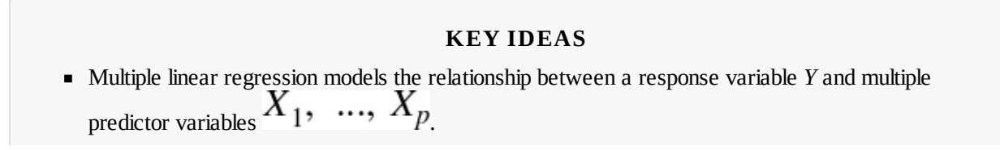

- The most important metrics to evaluate a model are root mean squared error (RMSE) and Rsquared ( $R^2$ ).
- The standard error of the coefficients can be used to measure the reliability of a variable's contribution to a model.
- Stepwise regression is a way to automatically determine which variables should be included in the model.
- <span id="page-257-0"></span>• Weighted regression is used to give certain records more or less weight in fitting the equation.

### <span id="page-258-3"></span>**Prediction Using Regression**

The primary purpose of regression in data science is prediction. This is useful to keep in mind, since regression, being an old and established statistical method, comes with baggage that is more relevant to its traditional explanatory modeling role than to prediction.

#### <span id="page-258-2"></span><span id="page-258-1"></span><span id="page-258-0"></span>**KEY TERMS FOR PREDICTION USING REGRESSION**

#### *Prediction interval*

An uncertainty interval around an individual predicted value.

#### *Extrapolation*

Extension of a model beyond the range of the data used to fit it.

### <span id="page-259-1"></span>**The Dangers of Extrapolation**

<span id="page-259-0"></span>Regression models should not be used to extrapolate beyond the range of the data. The model is valid only for predictor values for which the data has sufficient values (even in the case that sufficient data is available, there could be other problems: see "Testing the [Assumptions:](#page-279-0) Regression Diagnostics"). As an extreme case, suppose model\_lm is used to predict the value of a 5,000-squarefoot empty lot. In such a case, all the predictors related to the building would have a value of 0 and the regression equation would yield an absurd prediction of – 521,900 + 5,000 × –.0605 = –\$522,202. Why did this happen? The data contains only parcels with buildings — there are no records corresponding to vacant land. Consequently, the model has no information to tell it how to predict the sales price for vacant land.

### <span id="page-260-0"></span>**Confidence and Prediction Intervals**

<span id="page-260-3"></span>Much of statistics involves understanding and measuring variability (uncertainty). The t-statistics and p-values reported in regression output deal with this in a formal way, which is sometimes useful for variable selection (see ["Assessing](#page-249-0) the Model"). More useful metrics are confidence intervals, which are uncertainty intervals placed around regression coefficients and predictions. An easy way to understand this is via the bootstrap (see "The [Bootstrap"](#page-119-0) for more details about the general bootstrap procedure). The most common regression confidence intervals encountered in software output are those for regression parameters (coefficients). Here is a bootstrap algorithm for generating confidence intervals for regression parameters (coefficients) for a data set with *P* predictors and *n* records (rows):

- <span id="page-260-2"></span><span id="page-260-1"></span>1. Consider each row (including outcome variable) as a single "ticket" and place all the *n* tickets in a box.
- 2. Draw a ticket at random, record the values, and replace it in the box.
- 3. Repeat step 2 *n* times; you now have one bootstrap resample.
- 4. Fit a regression to the bootstrap sample, and record the estimated coefficients.
- 5. Repeat steps 2 through 4, say, 1,000 times.
- 6. You now have 1,000 bootstrap values for each coefficient; find the appropriate percentiles for each one (e.g., 5th and 95th for a 90% confidence interval).

You can use the Boot function in R to generate actual bootstrap confidence intervals for the coefficients, or you can simply use the formula-based intervals that are a routine R output. The conceptual meaning and interpretation are the same, and not of central importance to data scientists, because they concern the regression coefficients. Of greater interest to data scientists are intervals around predicted *y* values ( ). The uncertainty around comes from two sources:

Uncertainty about what the relevant predictor variables and their coefficients

are (see the preceding bootstrap algorithm)

Additional error inherent in individual data points

The individual data point error can be thought of as follows: even if we knew for certain what the regression equation was (e.g., if we had a huge number of records to fit it), the *actual* outcome values for a given set of predictor values will vary. For example, several houses — each with 8 rooms, a 6,500 square foot lot, 3 bathrooms, and a basement — might have different values. We can model this individual error with the residuals from the fitted values. The bootstrap algorithm for modeling both the regression model error and the individual data point error would look as follows:

- 1. Take a bootstrap sample from the data (spelled out in greater detail earlier).
- 2. Fit the regression, and predict the new value.
- 3. Take a single residual at random from the original regression fit, add it to the predicted value, and record the result.
- 4. Repeat steps 1 through 3, say, 1,000 times.
- 5. Find the 2.5th and the 97.5th percentiles of the results.

### **PREDICTION INTERVAL OR CONFIDENCE INTERVAL?**

A prediction interval pertains to uncertainty around a single value, while a confidence interval pertains to a mean or other statistic calculated from multiple values. Thus, a prediction interval will typically be much wider than a confidence interval for the same value. We model this individual value error in the bootstrap model by selecting an individual residual to tack on to the predicted value. Which should you use? That depends on the context and the purpose of the analysis, but, in general, data scientists are interested in specific individual predictions, so a prediction interval would be more appropriate. Using a confidence interval when you should be using a prediction interval will greatly underestimate the uncertainty in a given predicted value.

#### <span id="page-262-1"></span><span id="page-262-0"></span>**KEY IDEAS**

- Extrapolation beyond the range of the data can lead to error.
- Confidence intervals quantify uncertainty around regression coefficients.
- Prediction intervals quantify uncertainty in individual predictions.
- Most software, R included, will produce prediction and confidence intervals in default or specified output, using formulas.
- The bootstrap can also be used; the interpretation and idea are the same.

### <span id="page-263-0"></span>**Factor Variables in Regression**

<span id="page-263-6"></span>*Factor* variables, also termed *categorical* variables, take on a limited number of discrete values. For example, a loan purpose can be "debt consolidation," "wedding," "car," and so on. The binary (yes/no) variable, also called an *indicator* variable, is a special case of a factor variable. Regression requires numerical inputs, so factor variables need to be recoded to use in the model. The most common approach is to convert a variable into a set of binary *dummy* variables.

#### <span id="page-263-7"></span><span id="page-263-4"></span><span id="page-263-3"></span><span id="page-263-1"></span>**KEY TERMS FOR FACTOR VARIABLES**

#### *Dummy variables*

Binary 0–1 variables derived by recoding factor data for use in regression and other models.

#### *Reference coding*

The most common type of coding used by statisticians, in which one level of a factor is used as a reference and other factors are compared to that level.

*Synonyms*

treatment coding

#### *One hot encoder*

<span id="page-263-5"></span>A common type of coding used in the machine learning community in which all factors levels are retained. While useful for certain machine learning algorithms, this approach is not appropriate for multiple linear regression.

#### *Deviation coding*

<span id="page-263-2"></span>A type of coding that compares each level against the overall mean as opposed to the reference level.

#### *Synonyms*

sum contrasts

### <span id="page-264-3"></span>**Dummy Variables Representation**

In the King County housing data, there is a factor variable for the property type; a small subset of six records is shown below.

```
head(house[, 'PropertyType'])
Source: local data frame [6 x 1]
  PropertyType
        (fctr)
1 Multiplex
2 Single Family
3 Single Family
4 Single Family
5 Single Family
6 Townhouse
```

There are three possible values: Multiplex, Single Family, and Townhouse. To use this factor variable, we need to convert it to a set of binary variables. We do this by creating a binary variable for each possible value of the factor variable. To do this in R, we use the model.matrix function: [3](#page-308-2)

<span id="page-264-0"></span>

|   | prop_type_dummies <- model.matrix(~PropertyType -1, data=house)<br>head(prop_type_dummies) |                                                                       |   |  |
|---|--------------------------------------------------------------------------------------------|-----------------------------------------------------------------------|---|--|
|   |                                                                                            | PropertyTypeMultiplex PropertyTypeSingle Family PropertyTypeTownhouse |   |  |
| 1 | 1                                                                                          | 0                                                                     | 0 |  |
| 2 | 0                                                                                          | 1                                                                     | 0 |  |
| 3 | 0                                                                                          | 1                                                                     | 0 |  |
| 4 | 0                                                                                          | 1                                                                     | 0 |  |
| 5 | 0                                                                                          | 1                                                                     | 0 |  |
| 6 | 0                                                                                          | 0                                                                     | 1 |  |

<span id="page-264-2"></span>The function model.matrix converts a data frame into a matrix suitable to a linear model. The factor variable PropertyType, which has three distinct levels, is represented as a matrix with three columns. In the machine learning community, this representation is referred to as *one hot encoding* (see "One Hot [Encoder"](#page-379-0)). In certain machine learning algorithms, such as nearest neighbors and tree models, one hot encoding is the standard way to represent factor variables (for example, see "Tree [Models"](#page-387-0)).

In the regression setting, a factor variable with *P* distinct levels is usually represented by a matrix with only *P* – 1 columns. This is because a regression model typically includes an intercept term. With an intercept, once you have defined the values for *P* – 1 binaries, the value for the *P*th is known and could be <span id="page-265-1"></span>considered redundant. Adding the *P*th column will cause a multicollinearity error (see ["Multicollinearity"\)](#page-274-0).

The default representation in R is to use the first factor level as a *reference* and interpret the remaining levels relative to that factor.

```
lm(AdjSalePrice ~ SqFtTotLiving + SqFtLot + Bathrooms +
+ Bedrooms + BldgGrade + PropertyType, data=house)
Call:
lm(formula = AdjSalePrice ~ SqFtTotLiving + SqFtLot + Bathrooms +
   Bedrooms + BldgGrade + PropertyType, data = house)
Coefficients:
           (Intercept) SqFtTotLiving
           -4.469e+05 2.234e+02
              SqFtLot Bathrooms
           -7.041e-02 -1.597e+04
             Bedrooms BldgGrade
           -5.090e+04 1.094e+05
PropertyTypeSingle Family PropertyTypeTownhouse
           -8.469e+04 -1.151e+05
```

<span id="page-265-0"></span>The output from the R regression shows two coefficients corresponding to PropertyType: PropertyTypeSingle Family and PropertyTypeTownhouse. There is no coefficient of Multiplex since it is implicitly defined when PropertyTypeSingle Family == 0 and PropertyTypeTownhouse == 0. The coefficients are interpreted as relative to Multiplex, so a home that is Single Family is worth almost \$85,000 less, and a home that is Townhouse is worth over \$150,000 less. [4](#page-308-3)

### <span id="page-266-2"></span><span id="page-266-1"></span><span id="page-266-0"></span>**DIFFERENT FACTOR CODINGS**

There are several different ways to encode factor variables, known as *contrast coding* systems. For example, *deviation coding*, also know as *sum contrasts*, compares each level against the overall mean. Another contrast is *polynomial coding*, which is appropriate for ordered factors; see the section "Ordered Factor [Variables"](#page-269-0). With the exception of ordered factors, data scientists will generally not encounter any type of coding besides reference coding or one hot encoder.

### <span id="page-267-0"></span>**Factor Variables with Many Levels**

table(house\$ZipCode)

<span id="page-267-1"></span>Some factor variables can produce a huge number of binary dummies — zip codes are a factor variable and there are 43,000 zip codes in the US. In such cases, it is useful to explore the data, and the relationships between predictor variables and the outcome, to determine whether useful information is contained in the categories. If so, you must further decide whether it is useful to retain all factors, or whether the levels should be consolidated.

In King County, there are 82 zip codes with a house sale:

```
9800 89118 98001 98002 98003 98004 98005 98006 98007 98008 98010 98011
   1 1 358 180 241 293 133 460 112 291 56 163
98014 98019 98022 98023 98024 98027 98028 98029 98030 98031 98032 98033
  85 242 188 455 31 366 252 475 263 308 121 517
98034 98038 98039 98040 98042 98043 98045 98047 98050 98051 98052 98053
 575 788 47 244 641 1 222 48 7 32 614 499
98055 98056 98057 98058 98059 98065 98068 98070 98072 98074 98075 98077
 332 402 4 420 513 430 1 89 245 502 388 204
98092 98102 98103 98105 98106 98107 98108 98109 98112 98113 98115 98116
 289 106 671 313 361 296 155 149 357 1 620 364
98117 98118 98119 98122 98125 98126 98133 98136 98144 98146 98148 98155
 619 492 260 380 409 473 465 310 332 287 40 358
98166 98168 98177 98178 98188 98198 98199 98224 98288 98354
 193 332 216 266 101 225 393 3 4 9
```

ZipCode is an important variable, since it is a proxy for the effect of location on the value of a house. Including all levels requires 81 coefficients corresponding to 81 degrees of freedom. The original model house\_lm has only 5 degress of freedom; see ["Assessing](#page-249-0) the Model". Moreover, several zip codes have only one sale. In some problems, you can consolidate a zip code using the first two or three digits, corresponding to a submetropolitan geographic region. For King County, almost all of the sales occur in 980xx or 981xx, so this doesn't help.

An alternative approach is to group the zip codes according to another variable, such as sale price. Even better is to form zip code groups using the residuals from an initial model. The following dplyr code consolidates the 82 zip codes into five groups based on the median of the residual from the house\_lm regression:

```
zip_groups <- house %>%
  mutate(resid = residuals(house_lm)) %>%
  group_by(ZipCode) %>%
  summarize(med_resid = median(resid),
```

```
cnt = n()) %>%
  arrange(med_resid) %>%
  mutate(cum_cnt = cumsum(cnt),
         ZipGroup = ntile(cum_cnt, 5))
house <- house %>%
  left_join(select(zip_groups, ZipCode, ZipGroup), by='ZipCode')
```

The median residual is computed for each zip and the ntile function is used to split the zip codes, sorted by the median, into five groups. See ["Confounding](#page-275-0) Variables" for an example of how this is used as a term in a regression improving upon the original fit.

The concept of using the residuals to help guide the regression fitting is a fundamental step in the modeling process; see "Testing the [Assumptions:](#page-279-0) Regression Diagnostics".

### <span id="page-269-0"></span>**Ordered Factor Variables**

Some factor variables reflect levels of a factor; these are termed *ordered factor variables* or *ordered categorical variables*. For example, the loan grade could be A, B, C, and so on — each grade carries more risk than the prior grade. Ordered factor variables can typically be converted to numerical values and used as is. For example, the variable BldgGrade is an ordered factor variable. Several of the types of grades are shown in [Table](#page-269-1) 4-1. While the grades have specific meaning, the numeric value is ordered from low to high, corresponding to higher-grade homes. With the regression model house\_lm, fit in "Multiple Linear [Regression"](#page-245-0), BldgGrade was treated as a numeric variable.

<span id="page-269-2"></span><span id="page-269-1"></span>

| Table<br>4-1.<br>A<br>typical<br>data<br>format |              |  |  |
|-------------------------------------------------|--------------|--|--|
| Value                                           | Description  |  |  |
| 1                                               | Cabin        |  |  |
| 2                                               | Substandard  |  |  |
| 5                                               | Fair         |  |  |
| 10                                              | Very<br>good |  |  |
| 12                                              | Luxury       |  |  |
| 13                                              | Mansion      |  |  |

Treating ordered factors as a numeric variable preserves the information contained in the ordering that would be lost if it were converted to a factor.

### **KEY IDEAS**

- Factor variables need to be converted into numeric variables for use in a regression.
- The most common method to encode a factor variable with P distinct values is to represent them using P-1 dummy variables.
- A factor variable with many levels, even in very big data sets, may need to be consolidated into a variable with fewer levels.

<span id="page-270-0"></span>Some factors have levels that are ordered and can be represented as a single numeric variable.

### <span id="page-271-0"></span>**Interpreting the Regression Equation**

<span id="page-271-6"></span>In data science, the most important use of regression is to predict some dependent (outcome) variable. In some cases, however, gaining insight from the equation itself to understand the nature of the relationship between the predictors and the outcome can be of value. This section provides guidance on examining the regression equation and interpreting it.

#### **KEY TERMS FOR INTERPRETING THE REGRESSION EQUATION**

#### *Correlated variables*

<span id="page-271-2"></span>When the predictor variables are highly correlated, it is difficult to interpret the individual coefficients.

#### *Multicollinearity*

When the predictor variables have perfect, or near-perfect, correlation, the regression can be unstable or impossible to compute.

#### *Synonyms*

<span id="page-271-5"></span><span id="page-271-4"></span><span id="page-271-3"></span><span id="page-271-1"></span>collinearity

#### *Confounding variables*

An important predictor that, when omitted, leads to spurious relationships in a regression equation.

#### *Main effects*

The relationship between a predictor and the outcome variable, independent from other variables.

#### *Interactions*

An interdependent relationship between two or more predictors and the response.

### <span id="page-272-1"></span>**Correlated Predictors**

<span id="page-272-0"></span>In multiple regression, the predictor variables are often correlated with each other. As an example, examine the regression coefficients for the model step\_lm, fit in "Model Selection and Stepwise [Regression"](#page-253-0):

| step_lm\$coefficients |                                     |
|-----------------------|-------------------------------------|
| (Intercept)           | SqFtTotLiving                       |
| 6.227632e+06          | 1.865012e+02                        |
| Bathrooms             | Bedrooms                            |
| 4.472172e+04          | -4.980718e+04                       |
|                       | BldgGrade PropertyTypeSingle Family |
| 1.391792e+05          | 2.332869e+04                        |
| PropertyTypeTownhouse | SqFtFinBasement                     |
| 9.221625e+04          | 9.039911e+00                        |
| YrBuilt               |                                     |
| -3.592468e+03         |                                     |

The coefficient for Bedrooms is negative! This implies that adding a bedroom to a house will reduce its value. How can this be? This is because the predictor variables are correlated: larger houses tend to have more bedrooms, and it is the size that drives house value, not the number of bedrooms. Consider two homes of the exact same size: it is reasonable to expect that a home with more, but smaller, bedrooms would be considered less desirable.

Having correlated predictors can make it difficult to interpret the sign and value of regression coefficients (and can inflate the standard error of the estimates). The variables for bedrooms, house size, and number of bathrooms are all correlated. This is illustrated by the following example, which fits another regression removing the variables SqFtTotLiving, SqFtFinBasement, and Bathrooms from the equation:

```
update(step_lm, . ~ . -SqFtTotLiving - SqFtFinBasement - Bathrooms)
Call:
lm(formula = AdjSalePrice ~ Bedrooms + BldgGrade + PropertyType +
   YrBuilt, data = house0, na.action = na.omit)
Coefficients:
          (Intercept) Bedrooms
             4834680 27657
            BldgGrade PropertyTypeSingle Family
              245709 -17604
   PropertyTypeTownhouse YrBuilt
              -47477 -3161
```

The update function can be used to add or remove variables from a model. Now the coefficient for bedrooms is positive — in line with what we would expect (though it is really acting as a proxy for house size, now that those variables have been removed).

Correlated variables are only one issue with interpreting regression coefficients. In house\_lm, there is no variable to account for the location of the home, and the model is mixing together very different types of regions. Location may be a *confounding* variable; see ["Confounding](#page-275-0) Variables" for further discussion.

### <span id="page-274-0"></span>**Multicollinearity**

An extreme case of correlated variables produces multicollinearity — a condition in which there is redundance among the predictor variables. Perfect multicollinearity occurs when one predictor variable can be expressed as a linear combination of others. Multicollinearity occurs when:

- <span id="page-274-1"></span>A variable is included multiple times by error.
- *P* dummies, instead of *P* 1 dummies, are created from a factor variable (see "Factor Variables in [Regression"](#page-263-0)).
- Two variables are nearly perfectly correlated with one another.

Multicollinearity in regression must be addressed — variables should be removed until the multicollinearity is gone. A regression does not have a well-defined solution in the presence of perfect multicollinearity. Many software packages, including R, automatically handle certain types of multicolliearity. For example, if SqFtTotLiving is included twice in the regression of the house data, the results are the same as for the house\_lm model. In the case of nonperfect multicollinearity, the software may obtain a solution but the results may be unstable.

### **NOTE**

Multicollinearity is not such a problem for nonregression methods like trees, clustering, and nearest-neighbors, and in such methods it may be advisable to retain *P* dummies (instead of *P* – 1). That said, even in those methods, nonredundancy in predictor variables is still a virtue.

### <span id="page-275-0"></span>**Confounding Variables**

<span id="page-275-2"></span>With correlated variables, the problem is one of commission: including different variables that have a similar predictive relationship with the response. With *confounding variables*, the problem is one of omission: an important variable is not included in the regression equation. Naive interpretation of the equation coefficients can lead to invalid conclusions.

Take, for example, the King County regression equation house\_lm from ["Example:](#page-247-0) King County Housing Data". The regression coefficients of SqFtLot, Bathrooms, and Bedrooms are all negative. The original regression model does not contain a variable to represent location — a very important predictor of house price. To model location, include a variable ZipGroup that categorizes the zip code into one of five groups, from least expensive (1) to most expensive (5). [5](#page-308-4)

```
lm(AdjSalePrice ~ SqFtTotLiving + SqFtLot +
   Bathrooms + Bedrooms +
   BldgGrade + PropertyType + ZipGroup,
  data=house, na.action=na.omit)
Coefficients:
         (Intercept) SqFtTotLiving
          -6.709e+05 2.112e+02
            SqFtLot Bathrooms
           4.692e-01 5.537e+03
           Bedrooms BldgGrade
          -4.139e+04 9.893e+04
PropertyTypeSingle Family PropertyTypeTownhouse
           2.113e+04 -7.741e+04
           ZipGroup2 ZipGroup3
           5.169e+04 1.142e+05
           ZipGroup4 ZipGroup5
           1.783e+05 3.391e+05
```

ZipGroup is clearly an important variable: a home in the most expensive zip code group is estimated to have a higher sales price by almost \$340,000. The coefficients of SqFtLot and Bathrooms are now positive and adding a bathroom increases the sale price by \$7,500.

The coefficient for Bedrooms is still negative. While this is unintuitive, this is a well-known phenomenon in real estate. For homes of the same livable area and number of bathrooms, having more, and therefore smaller, bedrooms is associated with less valuable homes.

### <span id="page-276-0"></span>**Interactions and Main Effects**

<span id="page-276-2"></span><span id="page-276-1"></span>Statisticians like to distinguish between *main effects*, or independent variables, and the *interactions* between the main effects. Main effects are what are often referred to as the *predictor variables* in the regression equation. An implicit assumption when only main effects are used in a model is that the relationship between a predictor variable and the response is independent of the other predictor variables. This is often not the case.

For example, the model fit to the King County Housing Data in ["Confounding](#page-275-0) Variables" includes several variables as main effects, including ZipCode. Location in real estate is everything, and it is natural to presume that the relationship between, say, house size and the sale price depends on location. A big house built in a low-rent district is not going to retain the same value as a big house built in an expensive area. You include interactions between variables in R using the \* operator. For the King County data, the following fits an interaction between SqFtTotLiving and ZipGroup:

| lm(AdjSalePrice ~<br>SqFtTotLiving*ZipGroup + SqFtLot +<br>Bathrooms + Bedrooms + BldgGrade + PropertyType,<br>data=house, na.action=na.omit) |                         |  |  |  |
|-----------------------------------------------------------------------------------------------------------------------------------------------|-------------------------|--|--|--|
| Coefficients:                                                                                                                                 |                         |  |  |  |
| (Intercept)                                                                                                                                   | SqFtTotLiving           |  |  |  |
| -4.919e+05                                                                                                                                    | 1.176e+02               |  |  |  |
| ZipGroup2                                                                                                                                     | ZipGroup3               |  |  |  |
| -1.342e+04                                                                                                                                    | 2.254e+04               |  |  |  |
| ZipGroup4                                                                                                                                     | ZipGroup5               |  |  |  |
| 1.776e+04                                                                                                                                     | -1.555e+05              |  |  |  |
| SqFtLot                                                                                                                                       | Bathrooms               |  |  |  |
| 7.176e-01                                                                                                                                     | -5.130e+03              |  |  |  |
| Bedrooms                                                                                                                                      | BldgGrade               |  |  |  |
| -4.181e+04                                                                                                                                    | 1.053e+05               |  |  |  |
| PropertyTypeSingle Family                                                                                                                     | PropertyTypeTownhouse   |  |  |  |
| 1.603e+04                                                                                                                                     | -5.629e+04              |  |  |  |
| SqFtTotLiving:ZipGroup2                                                                                                                       | SqFtTotLiving:ZipGroup3 |  |  |  |
| 3.165e+01                                                                                                                                     | 3.893e+01               |  |  |  |
| SqFtTotLiving:ZipGroup4                                                                                                                       | SqFtTotLiving:ZipGroup5 |  |  |  |
| 7.051e+01                                                                                                                                     | 2.298e+02               |  |  |  |

The resulting model has four new terms: SqFtTotLiving:ZipGroup2,

SqFtTotLiving:ZipGroup3, and so on.

Location and house size appear to have a strong interaction. For a home in the lowest ZipGroup, the slope is the same as the slope for the main effect

<span id="page-277-0"></span>SqFtTotLiving, which is \$177 per square foot (this is because R uses *reference* coding for factor variables; see "Factor Variables in [Regression"](#page-263-0)). For a home in the highest ZipGroup, the slope is the sum of the main effect plus SqFtTotLiving:ZipGroup5, or \$177 + \$230 = \$447 per square foot. In other words, adding a square foot in the most expensive zip code group boosts the predicted sale price by a factor of almost 2.7, compared to the boost in the least expensive zip code group.

### <span id="page-278-1"></span>**MODEL SELECTION WITH INTERACTION TERMS**

In problems involving many variables, it can be challenging to decide which interaction terms should be included in the model. Several different approaches are commonly taken:

- In some problems, prior knowledge and intuition can guide the choice of which interaction terms to include in the model.
- Stepwise selection (see "Model Selection and Stepwise [Regression"](#page-253-0)) can be used to sift through the various models.
- Penalized regression can automatically fit to a large set of possible interaction terms.
- Perhaps the most common approach is the use *tree models*, as well as their descendents, *random forest* and *gradient boosted trees*. This class of models automatically searches for optimal interaction terms; see "Tree [Models"](#page-387-0).

#### <span id="page-278-3"></span><span id="page-278-2"></span><span id="page-278-0"></span>**KEY IDEAS**

- Because of correlation between predictors, care must be taken in the interpretation of the coefficients in multiple linear regression.
- Multicollinearity can cause numerical instability in fitting the regression equation.
- A confounding variable is an important predictor that is omitted from a model and can lead to a regression equation with spurious relationships.
- An interaction term between two variables is needed if the relationship between the variables and the response is interdependent.

### <span id="page-279-0"></span>**Testing the Assumptions: Regression Diagnostics**

In explanatory modeling (i.e., in a research context), various steps, in addition to the metrics mentioned previously (see ["Assessing](#page-249-0) the Model"), are taken to assess how well the model fits the data. Most are based on analysis of the residuals, which can test the assumptions underlying the model. These steps do not directly address predictive accuracy, but they can provide useful insight in a predictive setting.

#### <span id="page-279-9"></span><span id="page-279-8"></span><span id="page-279-6"></span><span id="page-279-4"></span><span id="page-279-3"></span>**KEY TERMS FOR REGRESSION DIAGNOSTICS**

#### *Standardized residuals*

Residuals divided by the standard error of the residuals.

#### *Outliers*

Records (or outcome values) that are distant from the rest of the data (or the predicted outcome).

#### *Influential value*

A value or record whose presence or absence makes a big difference in the regression equation.

#### *Leverage*

The degree of influence that a single record has on a regression equation.

<span id="page-279-1"></span>*Synonyms* hat-value

#### *Non-normal residuals*

<span id="page-279-5"></span>Non-normally distributed residuals can invalidate some technical requirements of regression, but are usually not a concern in data science.

#### *Heteroskedasticity*

<span id="page-279-2"></span>When some ranges of the outcome experience residuals with higher variance (may indicate a predictor missing from the equation).

#### *Partial residual plots*

A diagnostic plot to illuminate the relationship between the outcome variable and a single predictor.

*Synonyms*

<span id="page-279-7"></span>added variables plot

### <span id="page-280-0"></span>**Outliers**

<span id="page-280-2"></span>Generally speaking, an extreme value, also called an *outlier*, is one that is distant from most of the other observations. Just as outliers need to be handled for estimates of location and variability (see ["Estimates](#page-25-0) of Location" and "Estimates of [Variability"\),](#page-36-0) outliers can cause problems with regression models. In regression, an outlier is a record whose actual *y* value is distant from the predicted value. You can detect outliers by examining the *standardized residual*, which is the residual divided by the standard error of the residuals.

<span id="page-280-3"></span><span id="page-280-1"></span>There is no statistical theory that separates outliers from nonoutliers. Rather, there are (arbitrary) rules of thumb for how distant from the bulk of the data an observation needs to be in order to be called an outlier. For example, with the boxplot, outliers are those data points that are too far above or below the box boundaries (see ["Percentiles](#page-46-0) and Boxplots"), where "too far" = "more than 1.5 times the inter-quartile range." In regression, the standardized residual is the metric that is typically used to determine whether a record is classified as an outlier. Standardized residuals can be interpreted as "the number of standard errors away from the regression line."

Let's fit a regression to the King County house sales data for all sales in zip code 98105:

```
house_98105 <- house[house$ZipCode == 98105,]
lm_98105 <- lm(AdjSalePrice ~ SqFtTotLiving + SqFtLot + Bathrooms +
                 Bedrooms + BldgGrade, data=house_98105)
```

We extract the standardized residuals using the rstandard function and obtain the index of the smallest residual using the order function:

```
sresid <- rstandard(lm_98105)
idx <- order(sresid)
sresid[idx[1]]
    20431
-4.326732
```

The biggest overestimate from the model is more than four standard errors above the regression line, corresponding to an overestimate of \$757,753. The original data record corresponding to this outlier is as follows:

|   | house_98105[idx[1], c('AdjSalePrice', 'SqFtTotLiving', 'SqFtLot', |       |       | 'Bathrooms', 'Bedrooms', 'BldgGrade')] |       |       |
|---|-------------------------------------------------------------------|-------|-------|----------------------------------------|-------|-------|
|   | AdjSalePrice SqFtTotLiving SqFtLot Bathrooms Bedrooms BldgGrade   |       |       |                                        |       |       |
|   | (dbl)                                                             | (int) | (int) | (dbl)                                  | (int) | (int) |
| 1 | 119748                                                            | 2900  | 7276  | 3                                      | 6     | 7     |

In this case, it appears that there is something wrong with the record: a house of that size typically sells for much more than \$119,748 in that zip code. [Figure](#page-281-0) 4-4 shows an excerpt from the statuatory deed from this sale: it is clear that the sale involved only partial interest in the property. In this case, the outlier corresonds to a sale that is anomalous and should not be included in the regression. Outliers could also be the result of other problems, such as a "fat-finger" data entry or a mismatch of units (e.g., reporting a sale in thousands of dollars versus simply dollars).

<span id="page-281-0"></span>

<span id="page-281-1"></span>*Figure 4-4. Statutory warrant of deed for the largest negative residual*

For big data problems, outliers are generally not a problem in fitting the regression to be used in predicting new data. However, outliers are central to anomaly detection, where finding outliers is the whole point. The outlier could also correspond to a case of fraud or an accidental action. In any case, detecting outliers can be a critical business need.

### <span id="page-282-0"></span>**Influential Values**

<span id="page-282-3"></span>A value whose absence would significantly change the regression equation is termed an *infuential observation*. In regression, such a value need not be associated with a large residual. As an example, consider the regression lines in [Figure](#page-282-0) 4-5. The solid line corresponds to the regression with all the data, while the dashed line corresonds to the regression with the point in the upper-right removed. Clearly, that data value has a huge influence on the regression even though it is not associated with a large outlier (from the full regression). This data value is considered to have high *leverage* on the regression.

<span id="page-282-4"></span><span id="page-282-2"></span><span id="page-282-1"></span>In addition to standardized residuals (see ["Outliers"\)](#page-280-0), statisticians have developed several metrics to determine the influence of a single record on a regression. A common measure of leverage is the *hat-value*; values above indicate a high-leverage data value. [6](#page-308-5)

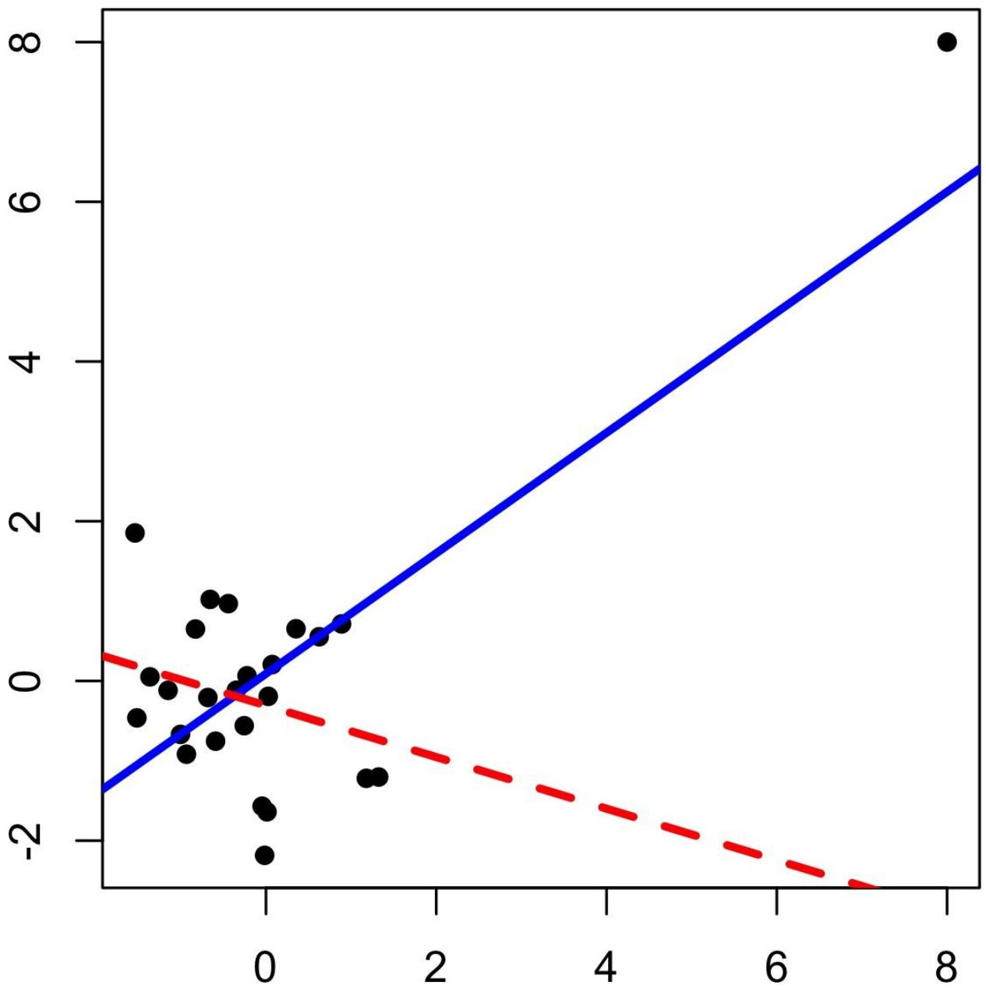

<span id="page-283-1"></span><span id="page-283-0"></span>*Figure 4-5. An example of an influential data point in regression*

Another metric is *Cook's distance*, which defines influence as a combination of leverage and residual size. A rule of thumb is that an observation has high influence if Cook's distance exceeds .

An *influence plot* or *bubble plot* combines standardized residuals, the hat-value, and Cook's distance in a single plot. [Figure](#page-284-0) 4-6 shows the influence plot for the King County house data, and can be created by the following R code.

```
std_resid <- rstandard(lm_98105)
cooks_D <- cooks.distance(lm_98105)
hat_values <- hatvalues(lm_98105)
plot(hat_values, std_resid, cex=10*sqrt(cooks_D))
abline(h=c(-2.5, 2.5), lty=2)
```

There are apparently several data points that exhibit large influence in the regression. Cook's distance can be computed using the function cooks.distance, and you can use hatvalues to compute the diagnostics. The hat values are plotted on the x-axis, the residuals are plotted on the y-axis, and the size of the points is related to the value of Cook's distance.

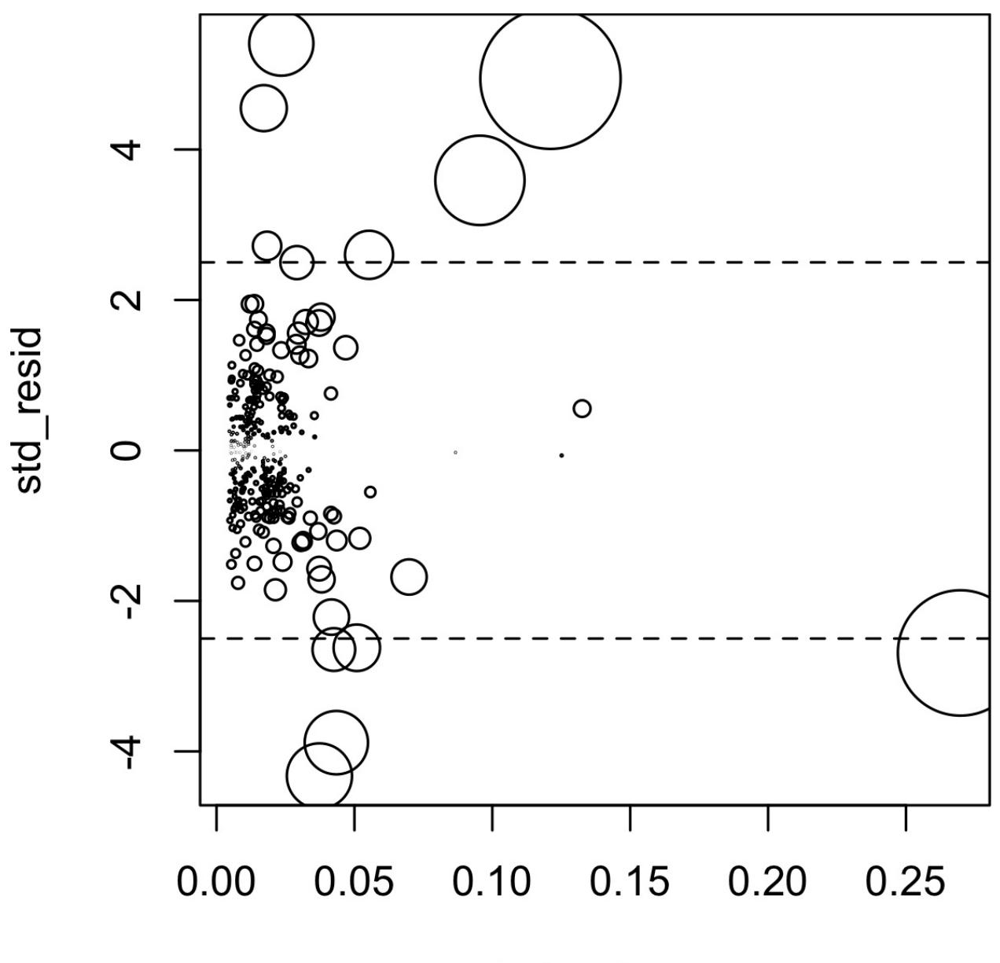

*Figure 4-6. A plot to determine which observations have high influence*

[Table](#page-286-0) 4-2 compares the regression with the full data set and with highly influential data points removed. The regression coefficient for Bathrooms changes quite dramatically. [7](#page-308-6)

> <span id="page-285-0"></span>*Table 4-2. Comparison of regression coefficients with the full data and with influential data removed*

<span id="page-286-0"></span>

| removed       |          |                        |  |  |  |
|---------------|----------|------------------------|--|--|--|
|               | Original | Influential<br>removed |  |  |  |
| (Intercept)   | –772550  | –647137                |  |  |  |
| SqFtTotLiving | 210      | 230                    |  |  |  |
| SqFtLot       | 39       | 33                     |  |  |  |
| Bathrooms     | 2282     | –16132                 |  |  |  |
| Bedrooms      | –26320   | –22888                 |  |  |  |
| BldgGrade     | 130000   | 114871                 |  |  |  |

For purposes of fitting a regression that reliably predicts future data, identifying influential observations is only useful in smaller data sets. For regressions involving many records, it is unlikely that any one observation will carry sufficient weight to cause extreme influence on the fitted equation (although the regression may still have big outliers). For purposes of anomaly detection, though, identifying influential observations can be very useful.

### <span id="page-287-2"></span>**Heteroskedasticity, Non-Normality and Correlated Errors**

<span id="page-287-1"></span>Statisticians pay considerable attention to the distribution of the residuals. It turns out that ordinary least squares (see "Least [Squares"](#page-239-0)) are unbiased, and in some cases the "optimal" estimator, under a wide range of distributional assumptions. This means that in most problems, data scientists do not need to be too concerned with the distribution of the residuals.

The distribution of the residuals is relevant mainly for the validity of formal statistical inference (hypothesis tests and p-values), which is of minimal importance to data scientists concerned mainly with predictive accuracy. For formal inference to be fully valid, the residuals are assumed to be normally distributed, have the same variance, and be independent. One area where this may be of concern to data scientists is the standard calculation of confidence intervals for predicted values, which are based upon the assumptions about the residuals (see ["Confidence](#page-260-0) and Prediction Intervals").

<span id="page-287-0"></span>*Heteroskedasticity* is the lack of constant residual variance across the range of the predicted values. In other words, errors are greater for some portions of the range than for others. The ggplot2 package has some convenient tools to analyze residuals.

The following code plots the absolute residuals versus the predicted values for the lm\_98105 regression fit in ["Outliers"](#page-280-0).

```
df <- data.frame(
  resid = residuals(lm_98105),
  pred = predict(lm_98105))
ggplot(df, aes(pred, abs(resid))) +
  geom_point() +
  geom_smooth()
```

[Figure](#page-288-0) 4-7 shows the resulting plot. Using geom\_smooth, it is easy to superpose a smooth of the absolute residuals. The function calls the loess method to produce a visual smooth to estimate the relationship between the variables on the x-axis and y-axis in a scatterplot (see [Scatterplot](#page-292-0) Smoothers).

<span id="page-288-0"></span>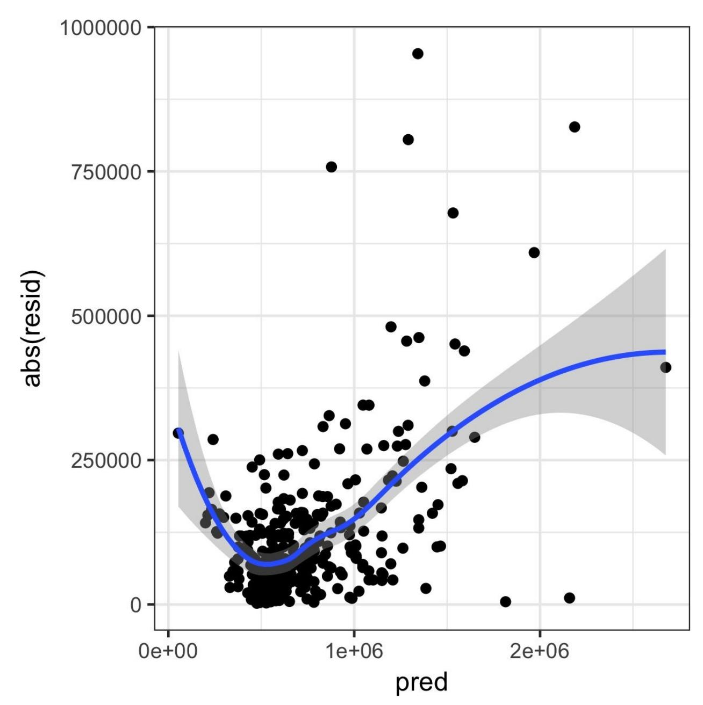

<span id="page-288-1"></span>*Figure 4-7. A plot of the absolute value of the residuals versus the predicted values*

Evidently, the variance of the residuals tends to increase for higher-valued homes, but is also large for lower-valued homes. This plot indicates that lm\_98105 has *heteroskedastic* errors.

### <span id="page-289-0"></span>**WHY WOULD A DATA SCIENTIST CARE ABOUT HETEROSKEDASTICITY?**

Heteroskedasticity indicates that prediction errors differ for different ranges of the predicted value, and may suggest an incomplete model. For example, the heteroskedasticity in lm\_98105 may indicate that the regression has left something unaccounted for in high- and low-range homes.

[Figure](#page-289-0) 4-8 is a histogram of the standarized residuals for the lm\_98105 regression. The distribution has decidely longer tails than the normal distribution, and exhibits mild skewness toward larger residuals.

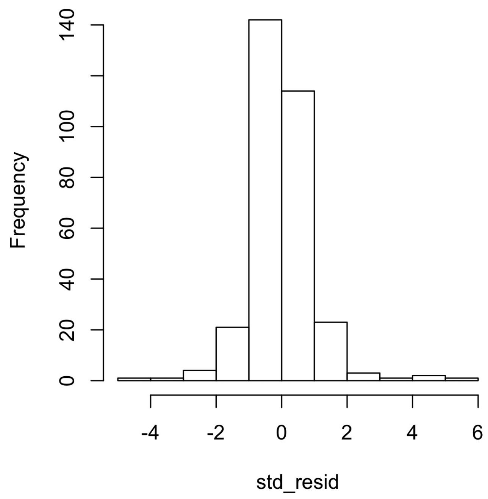

<span id="page-290-0"></span>*Figure 4-8. A histogram of the residuals from the regression of the housing data*

Statisticians may also check the assumption that the errors are independent. This is particularly true for data that is collected over time. The *Durbin-Watson* statistic can be used to detect if there is significant autocorrelation in a regression involving time series data.

Even though a regression may violate one of the distributional assumptions, should we care? Most often in data science, the interest is primarily in predictive

accuracy, so some review of heteroskedasticity may be in order. You may discover that there is some signal in the data that your model has not captured. Satisfying distributional assumptions simply for the sake of validating formal statistical inference (p-values, F-statistics, etc.), however, is not that important for the data scientist.

### <span id="page-292-1"></span>**SCATTERPLOT SMOOTHERS**

<span id="page-292-0"></span>Regression is about modeling the relationship between the response and predictor variables. In evaluating a regression model, it is useful to use a *scatterplot smoother* to visually highlight relationships between two variables.

For example, in [Figure](#page-288-0) 4-7, a smooth of the relationship between the absolute residuals and the predicted value shows that the variance of the residuals depends on the value of the residual. In this case, the loess function was used; loess works by repeatedly fitting a series of local regressions to contiguous subsets to come up with a smooth. While loess is probably the most commonly used smoother, other scatterplot smoothers are available in R, such as super smooth (supsmu) and kernalsmoothing (ksmooth). For the purposes of evaluating a regression model, there is typically no need to worry about the details of these scatterplot smooths.

### <span id="page-293-0"></span>**Partial Residual Plots and Nonlinearity**

<span id="page-293-2"></span><span id="page-293-1"></span>*Partial residual plots* are a way to visualize how well the estimated fit explains the relationship between a predictor and the outcome. Along with detection of outliers, this is probably the most important diagnostic for data scientists. The basic idea of a partial residual plot is to isolate the relationship between a predictor variable and the response, *taking into account all of the other predictor variables*. A partial residual might be thought of as a "synthetic outcome" value, combining the prediction based on a single predictor with the actual residual from the full regression equation. A partial residual for predictor is the ordinary residual plus the regression term associated with :

where is the estimated regression coefficient. The predict function in R has an option to return the individual regression terms :

```
terms <- predict(lm_98105, type='terms')
partial_resid <- resid(lm_98105) + terms
```

The partial residual plot displays the on the x-axis and the partial residuals on the y-axis. Using ggplot2 makes it easy to superpose a smooth of the partial residuals.

```
df <- data.frame(SqFtTotLiving = house_98105[, 'SqFtTotLiving'],
                 Terms = terms[, 'SqFtTotLiving'],
                 PartialResid = partial_resid[, 'SqFtTotLiving'])
ggplot(df, aes(SqFtTotLiving, PartialResid)) +
  geom_point(shape=1) + scale_shape(solid = FALSE) +
  geom_smooth(linetype=2) +
  geom_line(aes(SqFtTotLiving, Terms))
```

The resulting plot is shown in [Figure](#page-294-0) 4-9. The partial residual is an estimate of the contribution that SqFtTotLiving adds to the sales price. The relationship between SqFtTotLiving and the sales price is evidently nonlinear. The regression line underestimates the sales price for homes less than 1,000 square feet and overestimates the price for homes between 2,000 and 3,000 square feet.

<span id="page-294-0"></span>There are too few data points above 4,000 square feet to draw conclusions for those homes.

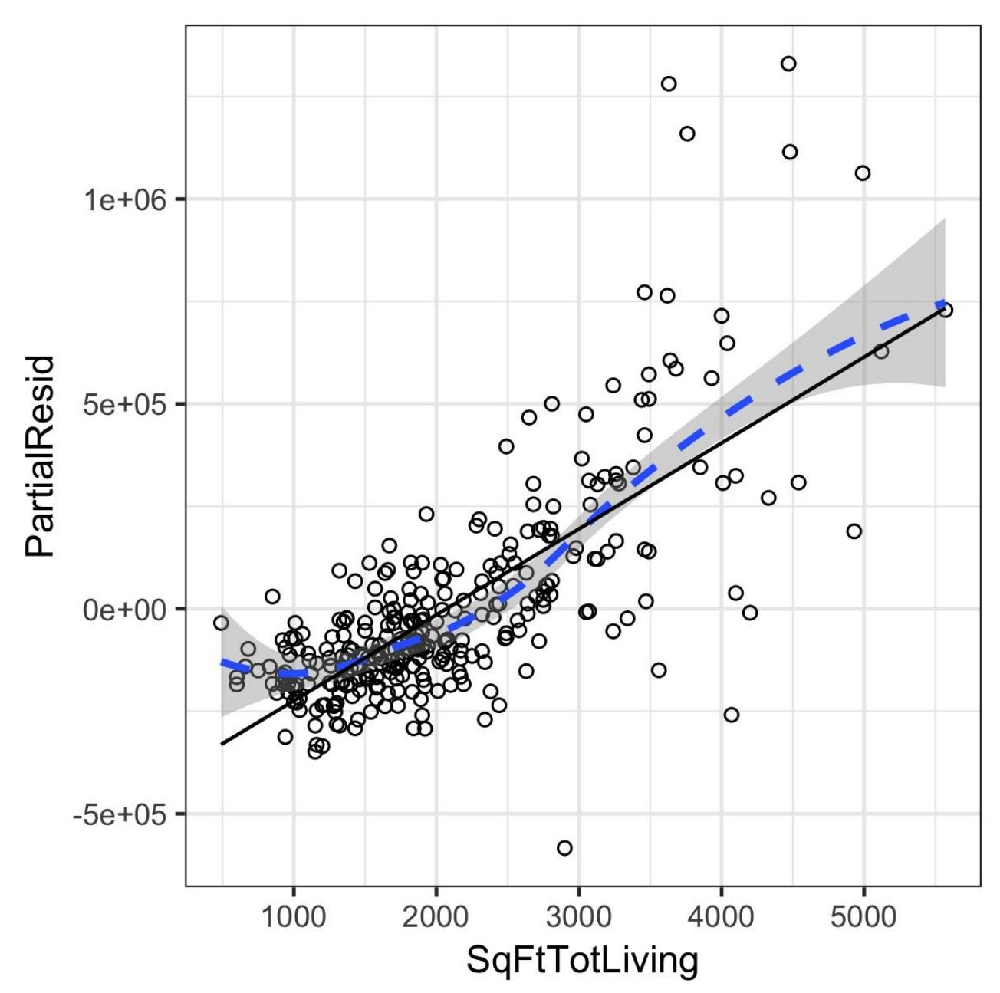

*Figure 4-9. A partial residual plot for the variable SqFtTotLiving*

This nonlinearity makes sense in this case: adding 500 feet in a small home makes a much bigger difference than adding 500 feet in a large home. This suggests that, instead of a simple linear term for SqFtTotLiving, a nonlinear term should be considered (see ["Polynomial](#page-297-0) and Spline Regression").

#### **KEY IDEAS**

While outliers can cause problems for small data sets, the primary interest with outliers is to identify

problems with the data, or locate anomalies.

- Single records (including regression outliers) can have a big influence on a regression equation with small data, but this effect washes out in big data.
- If the regression model is used for formal inference (p-values and the like), then certain assumptions about the distribution of the residuals should be checked. In general, however, the distribution of residuals is not critical in data science.
- The partial residuals plot can be used to qualitatively assess the fit for each regression term, possibly leading to alternative modelspecification.

### <span id="page-297-0"></span>**Polynomial and Spline Regression**

<span id="page-297-3"></span>The relationship between the response and a predictor variable is not necessarily linear. The response to the dose of a drug is often nonlinear: doubling the dosage generally doesn't lead to a doubled response. The demand for a product is not a linear function of marketing dollars spent since, at some point, demand is likely to be saturated. There are several ways that regression can be extended to capture these nonlinear effects.

#### <span id="page-297-6"></span><span id="page-297-5"></span><span id="page-297-4"></span><span id="page-297-2"></span>**KEY TERMS FOR NONLINEAR REGRESSION**

*Polynomial regression* Adds polynomial terms (squares, cubes, etc.) to a regression. *Spline regression*

Fitting a smooth curve with a series of polynomialsegments.

*Knots*

Values that separate spline segments.

#### *Generalized additive models*

<span id="page-297-1"></span>Spline models with automated selection of knots.

*Synonyms* GAM

### <span id="page-298-0"></span>**NONLINEAR REGRESSION**

When statisticians talk about *nonlinear regression*, they are referring to models that can't be fit using least squares. What kind of models are nonlinear? Essentially all models where the response cannot be expressed as a linear combination of the predictors or some transform of the predictors. Nonlinear regression models are harder and computationally more intensive to fit, since they require numerical optimization. For this reason, it is generally preferred to use a linear model if possible.

### <span id="page-299-1"></span>**Polynomial**

<span id="page-299-0"></span>*Polynomial regression* involves including polynomial terms to a regression equation. The use of polynomial regression dates back almost to the development of regression itself with a paper by Gergonne in 1815. For example, a quadratic regression between the response *Y* and the predictor *X* would take the form:

$$Y = b_0 + b_1 X + b_2 X^2 + e$$

Polynomial regression can be fit in R through the poly function. For example, the following fits a quadratic polynomial for SqFtTotLiving with the King County housing data:

```
lm(AdjSalePrice ~ poly(SqFtTotLiving, 2) + SqFtLot +
             BldgGrade + Bathrooms + Bedrooms,
                data=house_98105)
Call:
lm(formula = AdjSalePrice ~ poly(SqFtTotLiving, 2) + SqFtLot +
   BldgGrade + Bathrooms + Bedrooms, data = house_98105)
Coefficients:
          (Intercept) poly(SqFtTotLiving, 2)1
          -402530.47 3271519.49
poly(SqFtTotLiving, 2)2 SqFtLot
           776934.02 32.56
           BldgGrade Bathrooms
           135717.06 -1435.12
            Bedrooms
            -9191.94
```

There are now two coefficients associated with SqFtTotLiving: one for the linear term and one for the quadratic term.

The partial residual plot (see "Partial Residual Plots and [Nonlinearity"](#page-293-0)) indicates some curvature in the regression equation associated with SqFtTotLiving. The fitted line more closely matches the smooth (see ["Splines"](#page-301-0)) of the partial residuals as compared to a linear fit (see [Figure](#page-300-0) 4-10).

<span id="page-300-0"></span>

*Figure 4-10. A polynomial regression fit for the variable SqFtTotLiving (solid line) versus a smooth (dashed line; see the following section about splines)*

### <span id="page-301-0"></span>**Splines**

<span id="page-301-4"></span><span id="page-301-3"></span>Polynomial regression only captures a certain amount of curvature in a nonlinear relationship. Adding in higher-order terms, such as a cubic quartic polynomial, often leads to undesirable "wiggliness" in the regression equation. An alternative, and often superior, approach to modeling nonlinear relationships is to use *splines*. *Splines* provide a way to smoothly interpolate between fixed points. Splines were originally used by draftsmen to draw a smooth curve, particularly in ship and aircraft building.

The splines were created by bending a thin piece of wood using weights, referred to as "ducks"; see [Figure](#page-301-1) 4-11.

<span id="page-301-1"></span>

*Figure 4-11. Splines were originally created using bendable wood and "ducks," and were used as a draftsman tool to fit curves. Photo courtesy Bob Perry.*

<span id="page-301-2"></span>The technical definition of a spline is a series of piecewise continuous polynomials. They were first developed during World War II at the US Aberdeen Proving Grounds by I. J. Schoenberg, a Romanian mathematician. The polynomial pieces are smoothly connected at a series of fixed points in a predictor variable, referred to as *knots*. Formulation of splines is much more complicated than polynomial regression; statistical software usually handles the details of fitting a spline. The R package splines includes the function bs to create a *b-spline* term in a regression model. For example, the following adds a b-spline term to the house regression model:

```
library(splines)
knots <- quantile(house_98105$SqFtTotLiving, p=c(.25, .5, .75))
lm_spline <- lm(AdjSalePrice ~ bs(SqFtTotLiving, knots=knots, degree=3) +
  SqFtLot + Bathrooms + Bedrooms + BldgGrade, data=house_98105)
```

Two parameters need to be specified: the degree of the polynomial and the location of the knots. In this case, the predictor SqFtTotLiving is included in the model using a cubic spline (degree=3). By default, bs places knots at the boundaries; in addition, knots were also placed at the lower quartile, the median quartile, and the upper quartile.

In contrast to a linear term, for which the coefficient has a direct meaning, the coefficients for a spline term are not interpretable. Instead, it is more useful to use the visual display to reveal the nature of the spline fit. [Figure](#page-302-0) 4-12 displays the partial residual plot from the regression. In contrast to the polynomial model, the spline model more closely matches the smooth, demonstrating the greater flexibility of splines. In this case, the line more closely fits the data. Does this mean the spline regression is a better model? Not necessarily: it doesn't make economic sense that very small homes (less than 1,000 square feet) would have higher value than slightly larger homes. This is possibly an artifact of a confounding variable; see ["Confounding](#page-275-0) Variables".

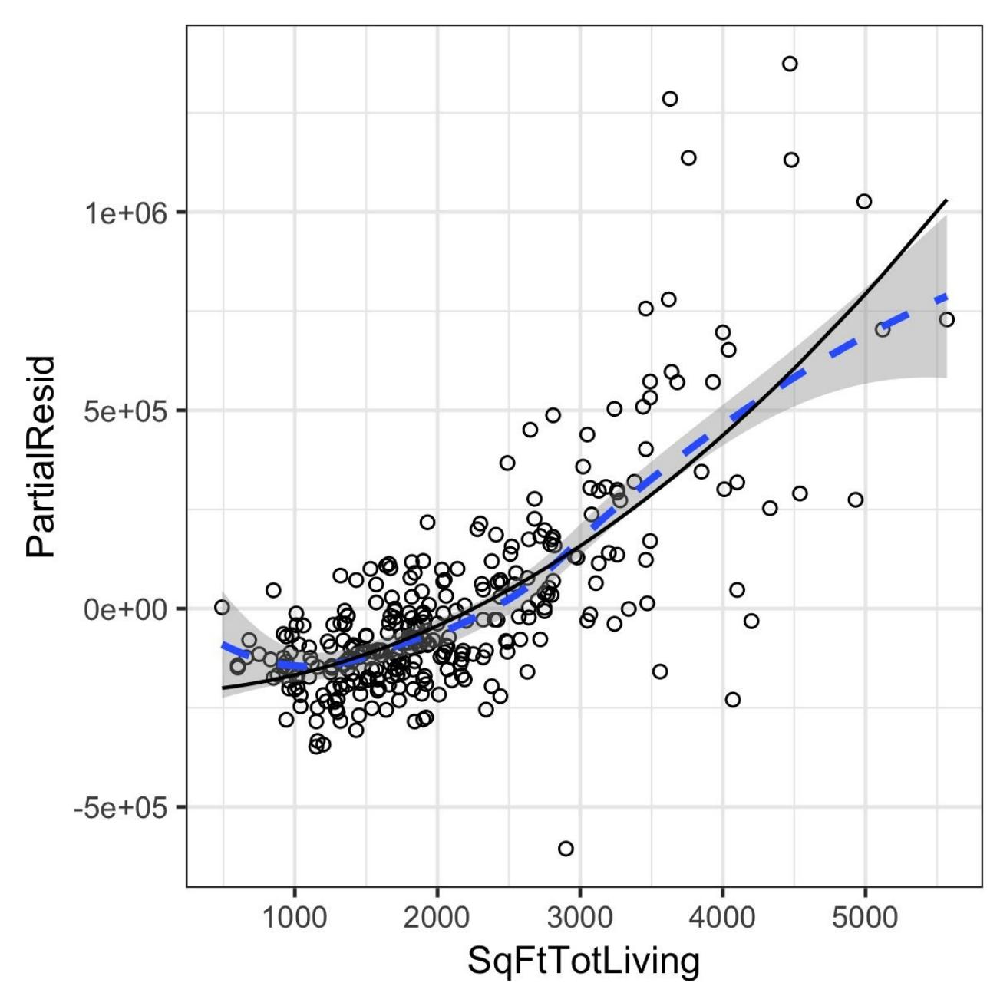

Figure 4-12. A spline regression fit for the variable SqFtTotLiving (solid line) compared to a smooth (dashed line)

### <span id="page-304-0"></span>**Generalized Additive Models**

<span id="page-304-1"></span>Suppose you suspect a nonlinear relationship between the response and a predictor variable, either by a priori knowledge or by examining the regression diagnostics. Polynomial terms may not flexible enough to capture the relationship, and spline terms require specifying the knots. *Generalized additive models*, or *GAM*, are a technique to automatically fit a spline regression. The gam package in R can be used to fit a GAM model to the housing data:

```
library(mgcv)
lm_gam <- gam(AdjSalePrice ~ s(SqFtTotLiving) + SqFtLot +
                      Bathrooms + Bedrooms + BldgGrade,
                    data=house_98105)
```

The term s(SqFtTotLiving) tells the gam function to find the "best" knots for a spline term (see [Figure](#page-304-0) 4-13).

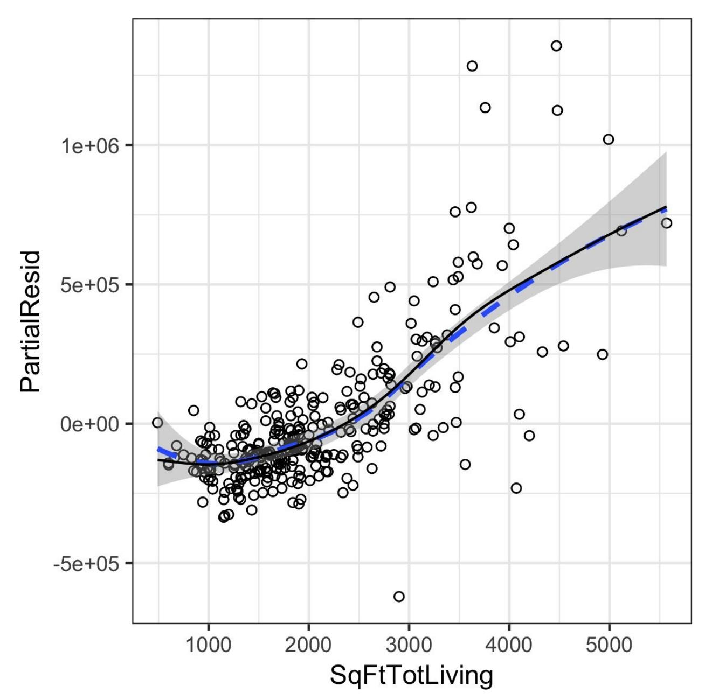

*Figure 4-13. A GAM regression fit for the variable SqFtTotLiving (solid line) compared to a smooth (dashed line)*

#### **KEY IDEAS**

- Outliers in a regression are records with a large residual.
- Multicollinearity can cause numerical instability in fitting the regression equation.
- A confounding variable is an important predictor that is omitted from a model and can lead to a regression equation with spurious relationships.
- An interaction term between two variables is needed if the effect of one variable depends on the

*level* of the other.

- Polynomial regression can fit nonlinear relationships between predictors and the outcome variable.
- Splines are series of polynomialsegments strung together, joining at knots.
- Generalized additive models (GAM) automate the process of specifying the knots in splines.

### <span id="page-307-1"></span>**Further Reading**

<span id="page-307-0"></span>For more on spline models and GAMS, see *The Elements of Statistical Learning* by Trevor Hastie, Robert Tibshirani, and Jerome Friedman, and its shorter cousin based on R, *An Introduction to Statistical Learning* by Gareth James, Daniela Witten, Trevor Hastie, and Robert Tibshirani; both are Springer books.

### <span id="page-308-9"></span>**Summary**

<span id="page-308-8"></span>Perhaps no other statistical method has seen greater use over the years than regression — the process of establishing a relationship between multiple predictor variables and an outcome variable. The fundamental form is linear: each predictor variable has a coefficient that describes a linear relationship between the predictor and the outcome. More advanced forms of regression, such as polynomial and spline regression, permit the relationship to be nonlinear. In classical statistics, the emphasis is on finding a good fit to the observed data to explain or describe some phenomenon, and the strength of this fit is how traditional ("in-sample") metrics are used to assess the model. In data science, by contrast, the goal is typically to predict values for new data, so metrics based on predictive accuracy for out-of-sample data are used. Variable selection methods are used to reduce dimensionality and create more compact models.

- <span id="page-308-7"></span><span id="page-308-0"></span>This and subsequent sections in this chapter © 2017 Datastats, LLC, Peter Bruce and Andrew Bruce, used by permission. [1](#page-231-0)
- <span id="page-308-1"></span>In Bayesian statistics, the true value is assumed to be a random variable with a specified distribution. In the Bayesian context, instead of estimates of unknown parameters, there are posterior and prior distributions. [2](#page-237-1)
- <span id="page-308-2"></span>The -1 argument in the model.matrix produces one hot encoding representation (by removing the intercept, hence the "-"). Otherwise, the default in R is to produce a matrix with *P* – 1 columns with the first factor level as a reference. [3](#page-264-0)
- <span id="page-308-3"></span>This is unintuitive, but can be explained by the impact of location as a confounding variable; see ["Confounding](#page-275-0) Variables". [4](#page-265-0)
- <span id="page-308-4"></span>There are 82 zip codes in King County, several with just a handful of sales. An alternative to directly using zip code as a factor variable, ZipGroup clusters similar zip codes into a single group. See "Factor [Variables](#page-267-0) with Many Levels" for details. [5](#page-275-1)
- <span id="page-308-5"></span>The term *hat-value* comes from the notion of the hat matrix in regression. Multiple linear regression can be expressed by the formula where is the hat matrix. The hat-values correspond to the diagonal of . [6](#page-282-1)
- <span id="page-308-6"></span>The coefficient for Bathrooms becomes negative, which is unintuitive. Location has not been taken into account and the zip code 98105 contains areas of disparate types of homes. See ["Confounding](#page-275-0) Variables" for a discussion of confounding variables. [7](#page-285-0)

<span id="page-309-1"></span><span id="page-309-0"></span>Data scientists are often faced with a problem that requires an automated decision. Is an email an attempt at phishing? Is a customer likely to churn? Is the web user likely to click on an advertisement? These are all *classification* problems. Classification is perhaps the most important form of prediction: the goal is to predict whether a record is a 0 or a 1 (phishing/not-phishing, click/don't click, churn/don't churn), or in some cases, one of several categories (for example, Gmail's filtering of your inbox into "primary," "social," "promotional," or "forums").

Often, we need more than a simple binary classification: we want to know the predicted probability that a case belongs to a class.

Rather than having a model simply assign a binary classification, most algorithms can return a probability score (propensity) of belonging to the class of interest. In fact, with logistic regression, the default output from R is on the log-odds scale, and this must be transformed to a propensity. A sliding cutoff can then be used to convert the propensity score to a decision. The general approach is as follows:

- <span id="page-309-2"></span>1. Establish a cutoff probability for the class of interest above which we consider a record as belonging to that class.
- 2. Estimate (with any model) the probability that a record belongs to the class of interest.
- 3. If that probability is above the cutoff probability, assign the new record to the class of interest.

The higher the cutoff, the fewer records predicted as 1 — that is, belonging to the class of interest. The lower the cutoff, the more records predicted as 1.

This chapter covers several key techniques for classification and estimating propensities; additional methods that can be used both for classification and numerical prediction are described in the next chapter.

### **MORE THAN TWO CATEGORIES?**

<span id="page-310-0"></span>The vast majority of problems involve a binary response. Some classification problems, however, involve a response with more than two possible outcomes. For example, at the anniversary of a customer's subscription contract, there might be three outcomes: the customer leaves, or "churns" (*Y=2*), goes on a month-to-month (*Y=1*) contract, or signs a new long-term contract (*Y=0*). The goal is to predict *Y = j* for *j =* 0, 1 or 2. Most of the classification methods in this chapter can be applied, either directly or with modest adaptations, to responses that have more than two outcomes. Even in the case of more than two outcomes, the problem can often be recast into a series of binary problems using conditional probabilities. For example, to predict the outcome of the contract, you can solve two binary prediction problems:

- Predict whether *Y = 0* or *Y > 0*.
- Given that *Y > 0*, predict whether *Y = 1* or *Y = 2*.

In this case, it makes sense to break up the problem into two cases: whether the customer churns, and if they don't churn, what type of contract they will choose. From a model-fitting viewpoint, it is often advantageous to convert the multiclass problem to a series of binary problems. This is particularly true when one category is much more common than the other categories.

### <span id="page-311-6"></span>**Naive Bayes**

The naive Bayes algorithm uses the probability of observing predictor values, given an outcome, to estimate the probability of observing outcome *Y = i*, given a set of predictor values. [1](#page-369-0)

#### <span id="page-311-5"></span><span id="page-311-2"></span><span id="page-311-0"></span>**KEY TERMS FOR NAIVE BAYES**

### *Conditional probability*

<span id="page-311-3"></span>The probability of observing some event (say *X = i*) given some other event (say *Y = i*), written as .

### *Posterior probability*

The probability of an outcome after the predictor information has been incorporated (in contrast to the *prior probability* of outcomes, not taking predictor information into account).

To understand Bayesian classification, we can start out by imagining "non-naive" Bayesian classification. For each record to be classified:

- <span id="page-311-1"></span>1. Find all the other records with the same predictor profile (i.e., where the predictor values are the same).
- 2. Determine what classes those records belong to and which class is most prevalent (i.e., probable).
- 3. Assign that class to the new record.

The preceding approach amounts to finding all the records in the sample that are exactly like the new record to be classified in the sense that all the predictor values are identical.

### **NOTE**

<span id="page-311-4"></span>Predictor variables must be categorical (factor) variables in the standard naive Bayes algorithm. See "Numeric Predictor [Variables"](#page-316-0) for two workarounds for using continuous variables.

### <span id="page-312-1"></span>**Why Exact Bayesian Classification Is Impractical**

When the number of predictor variables exceeds a handful, many of the records to be classified will be without exact matches. This can be understood in the context of a model to predict voting on the basis of demographic variables. Even a sizable sample may not contain even a single match for a new record who is a male Hispanic with high income from the US Midwest who voted in the last election, did not vote in the prior election, has three daughters and one son, and is divorced. And this is just eight variables, a small number for most classification problems. The addition of just a single new variable with five equally frequent categories reduces the probability of a match by a factor of 5.

### <span id="page-312-0"></span>**WARNING**

Despite its name, naive Bayes is not considered a method of Bayesian statistics. Naive Bayes is a data–driven, empirical method requiring relatively little statistical expertise. The name comes from the *Bayes rule*–like calculation in forming the predictions — specifically the initial calculation of predictor value probabilities given an outcome, and then the final calculation of outcome probabilities.

### <span id="page-313-0"></span>**The Naive Solution**

In the naive Bayes solution, we no longer restrict the probability calculation to those records that match the record to be classified. Instead, we use the entire data set. The naive Bayes modification is as follows:

- 1. For a binary response *Y = i* (*i* = 0 or 1), estimate the individual conditional probabilities for each predictor ; these are the probabilities that the predictor value is in the record when we observe *Y = i*. This probability is estimated by the proportion of *X<sup>j</sup>* values among the *Y = i* records in the training set.
- 2. Multiply these probabilities by each other, and then by the proportion of records belonging to *Y = i*.
- 3. Repeat steps 1 and 2 for all the classes.
- 4. Estimate a probability for outcome *i* by taking the value calculated in step 2 for class *i* and dividing it by the sum of such values for all classes.
- 5. Assign the record to the class with the highest probability for this set of predictor values.

This naive Bayes algorithm can also be stated as an equation for the probability of observing outcome *Y = i*, given a set of predictor values :

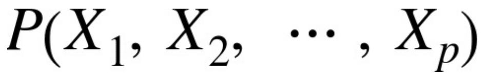

The value of is a scaling factor to ensure the probability is between 0 and 1 and does not depend on *Y*:

$$P(X_1, X_2, \cdots, X_p) = P(Y = 0)(P(X_1 \mid Y = 0)P(X_2 \mid Y = 0) \cdots P(X_p \mid Y = 0)) + P(Y = 1)(P(X_1 \mid Y = 1)P(X_2 \mid Y = 1) \cdots P(X_p \mid Y = 1)) + P(Y = 1)(P(X_1 \mid Y = 1)P(X_2 \mid Y = 1) \cdots P(X_p \mid Y = 1)) + P(Y = 1)(P(X_1 \mid Y = 1)P(X_2 \mid Y = 1) \cdots P(X_p \mid Y = 1)) + P(Y = 1)(P(X_1 \mid Y = 1)P(X_2 \mid Y = 1) \cdots P(X_p \mid Y = 1)) + P(Y = 1)(P(X_1 \mid Y = 1)P(X_2 \mid Y = 1) \cdots P(X_p \mid Y = 1)) + P(Y = 1)(P(X_1 \mid Y = 1)P(X_2 \mid Y = 1) \cdots P(X_p \mid Y = 1)) + P(Y = 1)(P(X_1 \mid Y = 1)P(X_2 \mid Y = 1) \cdots P(X_p \mid Y = 1)) + P(Y = 1)(P(X_1 \mid Y = 1)P(X_2 \mid Y = 1) \cdots P(X_p \mid Y = 1)) + P(Y = 1)(P(X_1 \mid Y = 1)P(X_2 \mid Y = 1) \cdots P(X_p \mid Y = 1)) + P(Y = 1)(P(X_1 \mid Y = 1)P(X_2 \mid Y = 1) \cdots P(X_p \mid Y = 1)) + P(Y = 1)(P(X_1 \mid Y = 1)P(X_2 \mid Y = 1) \cdots P(X_p \mid Y = 1)) + P(Y = 1)(P(X_1 \mid Y = 1)P(X_2 \mid Y = 1)) + P(Y = 1)(P(X_1 \mid Y = 1)P(X_2 \mid Y = 1)) + P(Y = 1)(P(X_1 \mid Y = 1)P(X_2 \mid Y = 1)) + P(Y = 1)(P(X_1 \mid Y = 1)P(X_2 \mid Y = 1)) + P(Y = 1)(P(X_1 \mid Y = 1)P(X_2 \mid Y = 1)) + P(Y = 1)(P(X_1 \mid Y = 1)P(X_2 \mid Y = 1)) + P(Y = 1)(P(X_1 \mid Y = 1)P(X_2 \mid Y = 1)) + P(Y = 1)(P(X_1 \mid Y = 1)P(X_2 \mid Y = 1)) + P(Y = 1)(P(X_1 \mid Y = 1)P(X_2 \mid Y = 1)) + P(Y = 1)(P(X_1 \mid Y = 1)P(X_2 \mid Y = 1)) + P(Y = 1)(P(X_1 \mid Y = 1)P(X_2 \mid Y = 1)) + P(Y = 1)(P(X_1 \mid Y = 1)P(X_2 \mid Y = 1)) + P(Y = 1)(P(X_1 \mid Y = 1)P(X_2 \mid Y = 1)) + P(Y = 1)(P(X_1 \mid Y = 1)P(X_2 \mid Y = 1)) + P(Y = 1)(P(X_1 \mid Y = 1)P(X_2 \mid Y = 1)) + P(Y = 1)(P(X_1 \mid Y = 1)P(X_2 \mid Y = 1)) + P(Y = 1)(P(X_1 \mid Y = 1)P(X_2 \mid Y = 1)) + P(Y = 1)($$

Why is this formula called "naive"? We have made a simplifying assumption that the *exact conditional probability* of a vector of predictor values, given observing an outcome, is sufficiently well estimated by the product of the individual conditional probabilities . In other words, in estimating

$$P(X_j \mid Y = i)_{\text{instead of}} P(X_1, X_2, \cdots X_p \mid Y = i)_{\text{, we are assuming}} X_j$$
 is *independent* of all the other predictor variables  $X_k$  for  $k \neq j$ .

Several packages in R can be used to estimate a naive Bayes model. The following fits a model using the klaR package:

```
library(klaR)
naive_model <- NaiveBayes(outcome ~ purpose_ + home_ + emp_len_,
                       data = na.omit(loan_data))
naive_model$table
$purpose_
        var
grouping credit_card debt_consolidation home_improvement major_purchase
 paid off 0.1857711 0.5523427 0.07153354 0.05541148
 default 0.1517548 0.5777144 0.05956086 0.03708506
        var
grouping medical other small_business
 paid off 0.01236169 0.09958506 0.02299447
 default 0.01434993 0.11415111 0.04538382
$home_
        var
grouping MORTGAGE OWN RENT
 paid off 0.4966286 0.08043741 0.4229340
 default 0.4327455 0.08363589 0.4836186
$emp_len_
        var
grouping > 1 Year < 1 Year
 paid off 0.9690526 0.03094744
 default 0.9523686 0.04763140
```

The output from the model is the conditional probabilities . The model can be used to predict the outcome of a new loan:

```
new_loan
       purpose_ home_ emp_len_
1 small_business MORTGAGE > 1 Year
```

In this case, the model predicts a default:

```
predict(naive_model, new_loan)
$class
[1] default
Levels: paid off default
$posterior
      paid off default
[1,] 0.3717206 0.6282794
```

The prediction also returns a posterior estimate of the probability of default.

<span id="page-315-0"></span>The naive Bayesian classifier is known to produce *biased* estimates. However, where the goal is to *rank* records according to the probability that *Y* = 1, unbiased estimates of probability are not needed and naive Bayes produces good results.

### <span id="page-316-0"></span>**Numeric Predictor Variables**

From the definition, we see that the Bayesian classifier works only with categorical predictors (e.g., with spam classification, where presence or absence of words, phrases, characters, and so on, lies at the heart of the predictive task). To apply naive Bayes to numerical predictors, one of two approaches must be taken:

- Bin and convert the numerical predictors to categorical predictors and apply the algorithm of the previous section.
- Use a probability model for example, the normal distribution (see "Normal [Distribution"\)](#page-129-0) — to estimate the conditional probability .

### <span id="page-316-1"></span>**CAUTION**

When a predictor category is absent in the training data, the algorithm assigns *zero probability* to the outcome variable in new data, rather than simply ignoring this variable and using the information from other variables, as other methods might. This is something to pay attention to when binning continuous variables.

### **KEY IDEAS**

- Naive Bayes works with categorical (factor) predictors and outcomes.
- It asks, "Within each outcome category, which predictor categories are most probable?"
- That information is then inverted to estimate probabilities of outcome categories, given predictor values.

### <span id="page-317-1"></span>**Further Reading**

- *Elements of Statistical Learning*, 2nd ed., by Trevor Hastie, Robert Tibshirani, and Jerome Friedman (Springer, 2009).
- <span id="page-317-0"></span>There is a full chapter on naive Bayes in *Data Mining for Business Analytics*, 3rd ed., by Galit Shmueli, Peter Bruce, and Nitin Patel (Wiley, 2016, with variants for R, Excel, and JMP).

### <span id="page-318-1"></span>**Discriminant Analysis**

*Discriminant analysis* is the earliest statistical classifier; it was introduced by R. A. Fisher in 1936 in an article published in the *Annals of Eugenics* journal. [2](#page-369-1)

#### <span id="page-318-5"></span><span id="page-318-4"></span><span id="page-318-3"></span><span id="page-318-2"></span><span id="page-318-0"></span>**KEY TERMS FOR DISCRIMINANT ANALYSIS**

#### *Covariance*

A measure of the extent to which one variable varies in concert with another (i.e., similar magnitude and direction).

#### *Discriminant function*

The function that, when applied to the predictor variables, maximizes the separation of the classes.

#### *Discriminant weights*

The scores that result from the application of the discriminant function, and are used to estimate probabilities of belonging to one class or another.

While discriminant analysis encompasses several techniques, the most commonly used is *linear discriminant analysis*, or *LDA*. The original method proposed by Fisher was actually slightly different from LDA, but the mechanics are essentially the same. LDA is now less widely used with the advent of more sophisticated techniques, such as tree models and logistic regression.

However, you may still encounter LDA in some applications and it has links to other more widely used methods (such as principal components analysis; see "Principal [Components](#page-433-0) Analysis"). In addition, discriminant analysis can provide a measure of predictor importance, and it is used as a computationally efficient method of feature selection.

### <span id="page-318-7"></span>**WARNING**

<span id="page-318-6"></span>Linear discriminant analysis should not be confused with Latent Dirichlet Allocation, also referred to as LDA. Latent Dirichlet Allocation is used in text and natural language processing and is unrelated to linear discriminant analysis.

### <span id="page-319-0"></span>**Covariance Matrix**

<span id="page-319-1"></span>To understand discriminant analysis, it is first necessary to introduce the concept of *covariance* between two or more variables. The covariance measures the relationship between two variables and . Denote the mean for each variable by and (see ["Mean"\)](#page-28-0). The covariance between and is given by:

$$s_{x,z} = \frac{\sum_{i=1}^{n} (x_i - \overline{x})(z_i - \overline{z})}{n - 1}$$

where *n* is the number of records (note that we divide by *n* – 1 instead of *n*: see "Degrees of [Freedom,](#page-39-0) and *n* or *n* – 1?").

As with the correlation coefficient (see ["Correlation"\)](#page-67-0), positive values indicate a positive relationship and negative values indicate a negative relationship. Correlation, however, is constrained to be between –1 and 1, whereas covariance is on the same scale as the variables and . The *covariance matrix* for

and consists of the individual variable variances, and , on the diagonal (where row and column are the same variable) and the covariances between variable pairs on the off-diagonals.

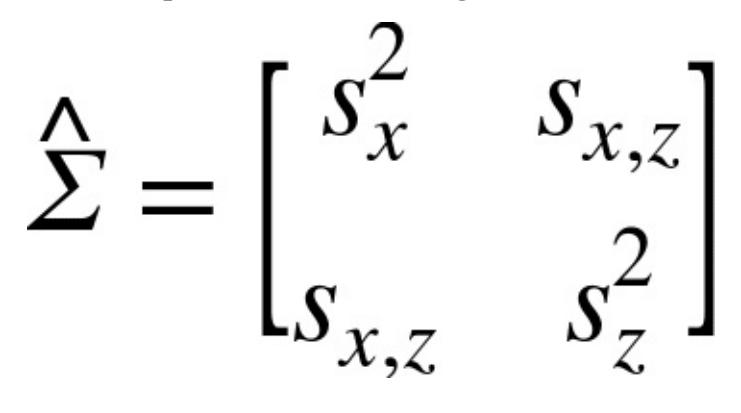

### <span id="page-319-3"></span><span id="page-319-2"></span>**NOTE**

Recall that the standard deviation is used to normalize a variable to a *z*-score; the covariance matrix is used in a multivariate extension of this standardization process. This is known as

<span id="page-320-0"></span>Mahalanobis distance (see Other [Distance](#page-378-0) Metrics) and is related to the LDA function.

### <span id="page-321-2"></span>**Fisher's Linear Discriminant**

<span id="page-321-1"></span><span id="page-321-0"></span>For simplicity, we focus on a classification problem in which we want to predict a binary outcome *y* using just two continuous numeric variables . Technically, discriminant analysis assumes the predictor variables are normally distributed continuous variables, but, in practice, the method works well even for nonextreme departures from normality, and for binary predictors. Fisher's linear discriminant distinguishes variation *between* groups, on the one hand, from variation *within* groups on the other. Specifically, seeking to divide the records into two groups, LDA focuses on maximizing the "between" sum of squares (measuring the variation between the two groups) relative to the "within" sum of squares (measuring the within-group variation). In this case, the two groups correspond to the records for which *y* = 0 and the records for which *y* = 1. The method finds the linear combination that maximizes that sum of squares ratio.

The between sum of squares is the squared distance between the two group means, and the within sum of squares is the spread around the means within each group, weighted by the covariance matrix. Intuitively, by maximizing the between sum of squares and minimizing the within sum of squares, this method yields the greatest separation between the two groups.

### <span id="page-322-1"></span>**A Simple Example**

<span id="page-322-0"></span>The MASS package, associated with the book *Modern Applied Statistics with S* by W. N. Venables and B. D. Ripley (Springer, 1994), provides a function for LDA with R. The following applies this function to a sample of loan data using two predictor variables, borrower\_score and payment\_inc\_ratio, and prints out the estimated linear discriminator weights.

```
library(MASS)
loan_lda <- lda(outcome ~ borrower_score + payment_inc_ratio,
                    data=loan3000)
loan_lda$scaling
                        LD1
borrower_score -6.2962811
payment_inc_ratio 0.1288243
```

### **USING DISCRIMINANT ANALYSIS FOR FEATURE SELECTION**

<span id="page-323-0"></span>If the predictor variables are normalized prior to running LDA, the discriminator weights are measures of variable importance, thus providing a computationally efficient method of feature selection.

The lda function can predict the probability of "default" versus "paid off":

```
pred <- predict(loan_lda)
head(pred$posterior)
       paid off default
25333 0.5554293 0.4445707
27041 0.6274352 0.3725648
7398 0.4014055 0.5985945
35625 0.3411242 0.6588758
17058 0.6081592 0.3918408
2986 0.6733245 0.3266755
```

A plot of the predictions helps illustrate how LDA works. Using the output from the predict function, a plot of the estimated probability of default is produced as follows:

```
lda_df <- cbind(loan3000, prob_default=pred$posterior[,'default'])
ggplot(data=lda_df,
       aes(x=borrower_score, y=payment_inc_ratio, color=prob_default)) +
  geom_point(alpha=.6) +
  scale_color_gradient2(low='white', high='blue') +
geom_line(data=lda_df0, col='green', size=2, alpha=.8) +
```

The resulting plot is shown in [Figure](#page-324-0) 5-1.

<span id="page-324-0"></span>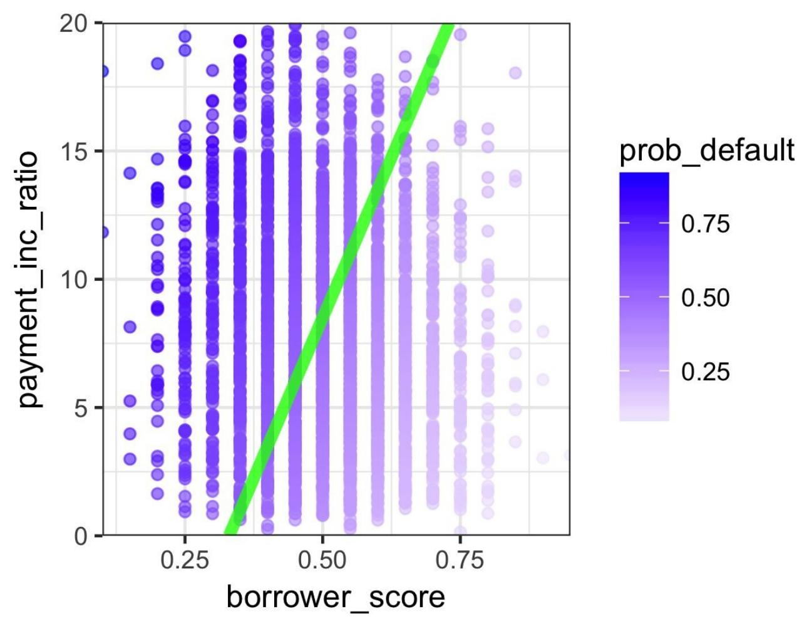

<span id="page-324-1"></span>*Figure 5-1. LDA prediction of loan default using two variables: a score of the borrower's creditworthiness and the payment to income ratio.*

Using the discriminant function weights, LDA splits the predictor space into two regions as shown by the solid line. The predictions farther away from the line have a higher level of confidence (i.e., a probability further away from 0.5).

### <span id="page-325-0"></span>**EXTENSIONS OF DISCRIMINANT ANALYSIS**

More predictor variables: while the text and example in this section used just two predictor variables, LDA works just as well with more than two predictor variables. The only limiting factor is the number of records (estimating the covariance matrix requires a sufficient number of records per variable, which is typically not an issue in data science applications).

Quadratic Discriminant Analysis: There are other variants of discriminant analysis. The best known is quadratic discriminant analysis (QDA). Despite its name, QDA is still a linear discriminant function. The main difference is that in LDA, the covariance matrix is assumed to be the same for the two groups corresponding to *Y* = 0 and *Y* = 1. In QDA, the covariance matrix is allowed to be different for the two groups. In practice, the difference in most applications is not critical.

#### <span id="page-325-1"></span>**KEY IDEAS FOR DISCRIMINANT ANALYSIS**

- Discriminant analysis works with continuous or categorical predictors, as well as categorical outcomes.
- Using the covariance matrix, it calculates a *linear discriminant function*, which is used to distinguish records belonging to one class from those belonging to another.
- This function is applied to the records to derive weights, or scores, for each record (one weight for each possible class) that determines its estimated class.

### <span id="page-326-1"></span>**Further Reading**

- *Elements of Statistical Learning*, 2nd ed., by Trevor Hastie, Robert Tibshirani, Jerome Freidman, and its shorter cousin, *An Introduction to Statistical Learning*, by Gareth James, Daniela Witten, Trevor Hastie, and Robert Tibshirani (both from Springer). Both have a section on discriminant analysis.
- *Data Mining for Business Analytics*, 3rd ed., by Galit Shmueli, Peter Bruce, and Nitin Patel (Wiley, 2016, with variants for R, Excel, and JMP) has a full chapter on discriminant analysis.
- <span id="page-326-0"></span>For historical interest, Fisher's original article on the topic, "The Use of Multiple Measurements in Taxonomic Problems," as published in 1936 in *Annals of Eugenics* (now called *Annals of Genetics*) can be found [online.](http://onlinelibrary.wiley.com/doi/10.1111/j.1469-1809.1936.tb02137.x/epdf)

### <span id="page-327-0"></span>**Logistic Regression**

<span id="page-327-1"></span>Logistic regression is analogous to multiple linear regression, except the outcome is binary. Various transformations are employed to convert the problem to one in which a linear model can be fit. Like discriminant analysis, and unlike *K*-Nearest Neighbor and naive Bayes, logistic regression is a structured model approach, rather than a data-centric approach. Due to its fast computational speed and its output of a model that lends itself to rapid scoring of new data, it is a popular method.

### <span id="page-327-3"></span><span id="page-327-2"></span>**KEY TERMS FOR LOGISTIC REGRESSION**

*Logit*

The function that maps the probability of belonging to a class with a range from ± ∞ (instead of 0 to 1).

*Synonym*

Log odds (see below)

*Odds*

<span id="page-327-4"></span>The ratio of "success" (1) to "not success" (0).

*Log odds*

The response in the transformed model (now linear), which gets mapped back to a probability.

How do we get from a binary outcome variable to an outcome variable that can be modeled in linear fashion, then back again to a binary outcome?

### <span id="page-328-2"></span>**Logistic Response Function and Logit**

The key ingredients are the *logistic response function* and the *logit*, in which we map a probability (which is on a 0–1 scale) to a more expansive scale suitable for linear modeling.

<span id="page-328-0"></span>The first step is to think of the outcome variable not as a binary label, but as the probability *p* that the label is a "1." Naively, we might be tempted to model *p* as a linear function of the predictor variables:

$$p = \beta_0 + \beta_1 x_1 + \beta_2 x_2 + \cdots + \beta_q x_q,$$

However, fitting this model does not ensure that *p* will end up between 0 and 1, as a probability must.

Instead, we model *p* by applying a *logistic response* or *inverse logit* function to the predictors:

$$p = \frac{1}{1 + e^{-(\beta_0 + \beta_1 x_1 + \beta_2 x_2 + \dots + \beta_q x_q)}}.$$

This transform ensures that the *p* stays between 0 and 1.

<span id="page-328-1"></span>To get the exponential expression out of the denominator, we consider *odds* instead of probabilities. Odds, familiar to bettors everywhere, are the ratio of "successes" (1) to "nonsuccesses" (0). In terms of probabilities, odds are the probability of an event divided by the probability that the event will not occur. For example, if the probability that a horse will win is 0.5, the probability of "won't win" is (1 – 0.5) = 0.5, and the odds are 1.0.

$$\text{Odds}(Y = 1) = \frac{p}{1 - p}.$$

We can obtain the probability from the odds using the inverse odds function:

<span id="page-329-0"></span>We combine this with the logistic response function, shown earlier, to get:

Finally, taking the logarithm of both sides, we get an expression that involves a linear function of the predictors:

$$\log (\text{Odds}(Y = 1)) = \beta_0 + \beta_1 x_1 + \beta_2 x_2 + \cdots + \beta_q x_q.$$

<span id="page-329-1"></span>The *log-odds* function, also known as the *logit* function, maps the probability *p* from to any value : see [Figure](#page-329-0) 5-2. The transformation circle is complete; we have used a linear model to predict a probability, which, in turn, we can map to a class label by applying a cutoff rule — any record with a probability greater than the cutoff is classified as a 1.

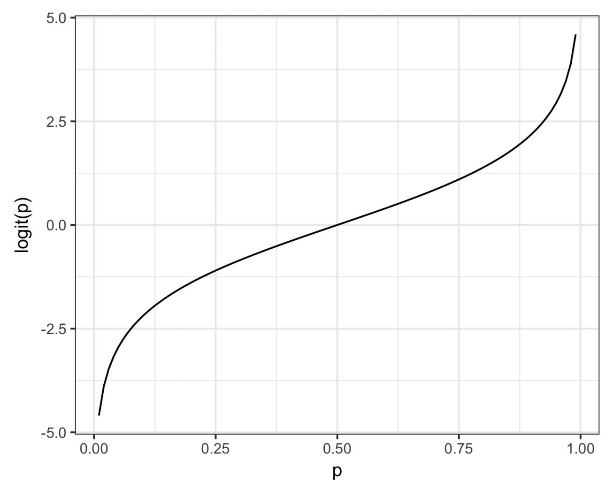

*Figure 5-2. The function that maps a probability to a scale suitable for a linear model (logit)*

### <span id="page-331-0"></span>**Logistic Regression and the GLM**

<span id="page-331-1"></span>The response in the logistic regression formula is the log odds of a binary outcome of 1. We only observe the binary outcome, not the log odds, so special statistical methods are needed to fit the equation. Logistic regression is a special instance of a *generalized linear model* (GLM) developed to extend linear regression to other settings.

<span id="page-331-2"></span>In R, to fit a logistic regression, the glm function is used with the family parameter set to binomial. The following code fits a logistic regression to the personal loan data introduced in ["K-Nearest](#page-373-0) Neighbors".

```
logistic_model
Call: glm(formula = outcome ~ payment_inc_ratio + purpose_ + home_ +
   emp_len_ + borrower_score, family = "binomial", data = loan_data)
Coefficients:
           (Intercept) payment_inc_ratio
              1.26982 0.08244
purpose_debt_consolidation purpose_home_improvement
              0.25216 0.34367
   purpose_major_purchase purpose_medical
              0.24373 0.67536
         purpose_other purpose_small_business
              0.59268 1.21226
             home_OWN home_RENT
              0.03132 0.16867
      emp_len_ < 1 Year borrower_score
              0.44489 -4.63890
Degrees of Freedom: 46271 Total (i.e. Null); 46260 Residual
Null Deviance: 64150
Residual Deviance: 58530 AIC: 58550
```

<span id="page-331-3"></span>The response is outcome, which takes a 0 if the loan is paid off and 1 if the loan defaults. purpose\_ and home\_ are factor variables representing the purpose of the loan and the home ownership status. As in regression, a factor variable with *P* levels is represented with *P* – 1 columns. By default in R, the *reference* coding is used and the levels are all compared to the reference level (see "Factor Variables in [Regression"\).](#page-263-0) The reference levels for these factors are credit\_card and MORTGAGE, respectively. The variable borrower\_score is a score from 0 to 1 representing the creditworthiness of the borrower (from poor to excellent). This variable was created from several other variables using *K*-Nearest Neighbor: see "KNN as a Feature [Engine".](#page-385-0)

### <span id="page-332-1"></span>**Generalized Linear Models**

Generalized linear models (GLMs) are the second most important class of models besides regression. GLMs are characterized by two main components:

- A probability distribution or family (binomial in the case of logistic regression)
- A link function mapping the response to the predictors (logit in the case of logistic regression)

<span id="page-332-0"></span>Logistic regression is by far the most common form of GLM. A data scientist will encounter other types of GLMs. Sometimes a log link function is used instead of the logit; in practice, use of a log link is unlikely to lead to very different results for most applications. The poisson distribution is commonly used to model count data (e.g., the number of times a user visits a web page in a certain amount of time). Other families include negative binomial and gamma, often used to model elapsed time (e.g., time to failure). In contrast to logistic regression, application of GLMs with these models is more nuanced and involves greater care. These are best avoided unless you are familiar with and understand the utility and pitfalls of these methods.

### <span id="page-333-2"></span>**Predicted Values from Logistic Regression**

The predicted value from logistic regression is in terms of the log odds:

<span id="page-333-0"></span>. The predicted probability is given by the logistic response function:

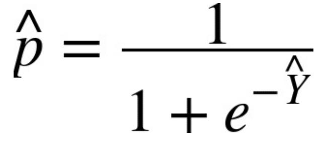

For example, look at the predictions from the model logistic\_model:

```
pred <- predict(logistic_model)
summary(pred)
    Min. 1st Qu. Median Mean 3rd Qu. Max.
-2.728000 -0.525100 -0.005235 0.002599 0.513700 3.658000
```

Converting these values to probabilities is a simple transform:

```
prob <- 1/(1 + exp(-pred))
> summary(prob)
  Min. 1st Qu. Median Mean 3rd Qu. Max.
0.06132 0.37170 0.49870 0.50000 0.62570 0.97490
```

<span id="page-333-1"></span>These are on a scale from 0 to 1 and don't yet declare whether the predicted value is default or paid off. We could declare any value greater than 0.5 as default, analogous to the *K*-Nearest Neighbors classifier. In practice, a lower cutoff is often [appropriate](#page-348-0) if the goal is to identify members of a rare class (see "The Rare Class Problem").

### <span id="page-334-3"></span>**Interpreting the Coefficients and Odds Ratios**

<span id="page-334-0"></span>One advantage of logistic regression is that it produces a model that can be scored to new data rapidly, without recomputation. Another is the relative ease of interpretation of the model, as compared with other classification methods. The key conceptual idea is understanding an *odds ratio*. The odds ratio is easiest to understand for a binary factor variable *X*:

This is interpreted as the odds that *Y* = 1 when *X* = 1 versus the odds that *Y* = 1 when *X* = 0. If the odds ratio is 2, then the odds that *Y* = 1 are two times higher when *X* = 1 versus *X* = 0.

<span id="page-334-1"></span>Why bother with an odds ratio, instead of probabilities? We work with odds because the coefficient in the logistic regression is the log of the odds ratio for .

An example will make this more explicit. For the model fit in "Logistic [Regression](#page-331-0) and the GLM", the regression coefficient for purpose\_small\_business is 1.21226. This means that a loan to a small business compared to a loan to pay off credit card debt reduces the odds of defaulting versus being paid off by . Clearly, loans for the purpose of creating or expanding a small business are considerably riskier than other types of loans.

<span id="page-334-2"></span>[Figure](#page-335-0) 5-3 shows the relationship between the odds ratio and log-odds ratio for odds ratios greater than 1. Because the coefficients are on the log scale, an increase of 1 in the coefficient results in an increase of in the odds ratio.

<span id="page-335-0"></span>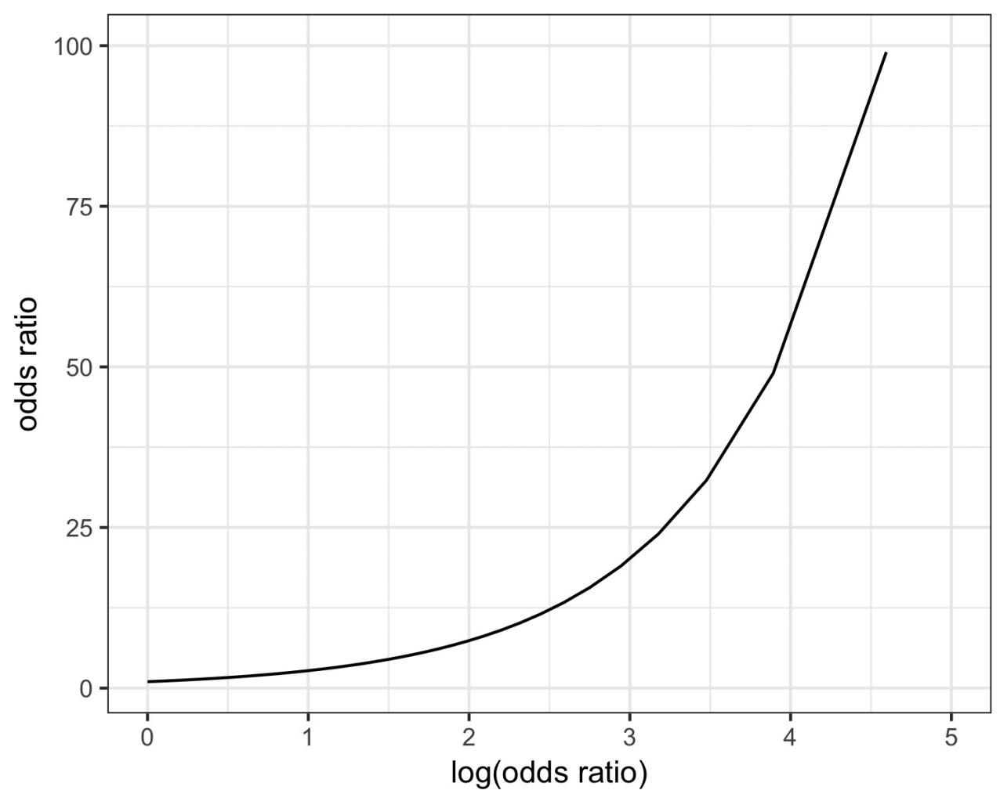

*Figure 5-3. The relationship between the odds ratio and the log-odds ratio*

Odds ratios for numeric variables *X* can be interpreted similarly: they measure the change in the odds ratio for a unit change in *X*. For example, the effect of increasing the payment to income ratio from, say, 5 to 6 increases the odds of the loan defaulting by a factor of . The variable borrower\_score is a score on the borrowers' creditworthiness and ranges from 0 (low) to 1 (high). The odds of the best borrowers relative to the worst borrowers defaulting on their loans is smaller by a factor of . In other words, the default risk from the borrowers with the poorest creditworthiness is 100 times greater than that of the best borrowers!

### <span id="page-336-4"></span>**Linear and Logistic Regression: Similarities and Differences**

Multiple linear regression and logistic regression share many commonalities. Both assume a parametric linear form relating the predictors with the response. Exploring and finding the best model are done in very similar ways. Generalities to the linear model to use a spline transform of the predictor are equally applicable in the logistic regression setting. Logistic regression differs in two fundamental ways:

- <span id="page-336-1"></span>The way the model is fit (least squares is not applicable)
- The nature and analysis of the residuals from the model

### **Fitting the model**

<span id="page-336-3"></span>Linear regression is fit using least squares, and the quality of the fit is evaluated using RMSE and R-squared statistics. In logistic regression (unlike in linear regression), there is no closed-form solution and the model must be fit using *maximum likelihood estimation* (MLE). Maximum likelihood estimation is a process that tries to find the model that is most likely to have produced the data we see. In the logistic regression equation, the response is not 0 or 1 but rather an estimate of the log odds that the response is 1. The MLE finds the solution such that the estimated log odds best describes the observed outcome. The mechanics of the algorithm involve a quasi-Newton optimization that iterates between a scoring step (*Fisher's scoring*), based on the current parameters, and an update to the parameters to improve the fit.

# <span id="page-336-2"></span><span id="page-336-0"></span>**MAXIMUM LIKELIHOOD ESTIMATION** More detail, if you like statisticalsymbols:start with a set of data and a probability model that depends on a set of parameters . The goal of MLE is to find the set of parameters that maximizes the value of ; that is, it maximizes the probability of observing given the model ..] In the fitting process, the model is evaluated using a metric called *deviance*:

Lower deviance corresponds to a better fit.

Fortunately, most users don't need to concern themselves with the details of the fitting algorithm since this is handled by the software. Most data scientists will not need to worry about the fitting method, other than understanding that it is a way to find a good model under certain assumptions.

### <span id="page-338-0"></span>**HANDLING FACTOR VARIABLES**

In logistic regression, factor variables should be coded as in linear regression; see "Factor Variables in Regression". In R and other software, this is normally handled [automatically](#page-263-0) and generally reference encoding is used. All of the other classification methods covered in this chapter typically use the one hot encoder representation (see "One Hot [Encoder"\)](#page-379-0).

### <span id="page-339-1"></span>**Assessing the Model**

<span id="page-339-0"></span>Like other classification methods, logistic regression is assessed by how accurately the model classifies new data (see "Evaluating [Classification](#page-344-0) Models"). As with linear regression, some additional standard statistical tools are available to assess and improve the model. Along with the estimated coefficients, R reports the standard error of the coefficients (SE), a *z*-value, and a p-value:

```
summary(logistic_model)
Call:
glm(formula = outcome ~ payment_inc_ratio + purpose_ + home_ +
   emp_len_ + borrower_score, family = "binomial", data = loan_data)
Deviance Residuals:
    Min 1Q Median 3Q Max
-2.71430 -1.06806 -0.04482 1.07446 2.11672
Coefficients:
                        Estimate Std. Error z value Pr(>|z|)
(Intercept) 1.269822 0.051929 24.453 < 2e-16 ***
payment_inc_ratio 0.082443 0.002485 33.177 < 2e-16 ***
purpose_debt_consolidation 0.252164 0.027409 9.200 < 2e-16 ***
purpose_home_improvement 0.343674 0.045951 7.479 7.48e-14 ***
purpose_major_purchase 0.243728 0.053314 4.572 4.84e-06 ***
purpose_medical 0.675362 0.089803 7.520 5.46e-14 ***
purpose_other 0.592678 0.039109 15.154 < 2e-16 ***
purpose_small_business 1.212264 0.062457 19.410 < 2e-16 ***
home_OWN 0.031320 0.037479 0.836 0.403
home_RENT 0.168670 0.021041 8.016 1.09e-15 ***
emp_len_ < 1 Year 0.444892 0.053342 8.340 < 2e-16 ***
borrower_score -4.638902 0.082433 -56.275 < 2e-16 ***
---
Signif. codes: 0 '***' 0.001 '**' 0.01 '*' 0.05 '.' 0.1 ' ' 1
(Dispersion parameter for binomial family taken to be 1)
   Null deviance: 64147 on 46271 degrees of freedom
Residual deviance: 58531 on 46260 degrees of freedom
AIC: 58555
Number of Fisher Scoring iterations: 4
```

Interpretation of the p-value comes with the same caveat as in regression, and should be viewed more as a relative indicator of variable importance (see ["Assessing](#page-249-0) the Model") than as a formal measure of statistical significance. A logistic regression model, which has a binary response, does not have an associated RMSE or R-squared. Instead, a logistic regression model is typically evaluated using more general metrics for [classification;](#page-344-0) see "Evaluating Classification Models".

<span id="page-340-0"></span>Many other concepts for linear regression carry over to the logistic regression setting (and other GLMs). For example, you can use stepwise regression, fit interaction terms, or include spline terms. The same concerns regarding confounding and correlated variables apply to logistic regression (see ["Interpreting](#page-271-0) the Regression Equation"). You can fit generalized additive models (see ["Generalized](#page-304-0) Additive Models") using the mgcv package:

```
logistic_gam <- gam(outcome ~ s(payment_inc_ratio) + purpose_ +
                        home_ + emp_len_ + s(borrower_score),
                      data=loan_data, family='binomial')
```

One area where logistic regression differs is in the analysis of the residuals. As in regression (see [Figure](#page-294-0) 4-9), it is straightforward to compute partial residuals:

```
terms <- predict(logistic_gam, type='terms')
partial_resid <- resid(logistic_model) + terms
df <- data.frame(payment_inc_ratio = loan_data[, 'payment_inc_ratio'],
                 terms = terms[, 's(payment_inc_ratio)'],
                 partial_resid = partial_resid[, 's(payment_inc_ratio)'])
ggplot(df, aes(x=payment_inc_ratio, y=partial_resid, solid = FALSE)) +
  geom_point(shape=46, alpha=.4) +
  geom_line(aes(x=payment_inc_ratio, y=terms),
            color='red', alpha=.5, size=1.5) +
  labs(y='Partial Residual')
```

<span id="page-340-1"></span>The resulting plot is displayed in [Figure](#page-340-0) 5-4. The estimated fit, shown by the line, goes between two sets of point clouds. The top cloud corresponds to a response of 1 (defaulted loans), and the bottom cloud corresponds to a response of 0 (loans paid off). This is very typical of residuals from a logistic regression since the output is binary. Partial residuals in logistic regression, while less valuable than in regression, are still useful to confirm nonlinear behavior and identify highly influential records.

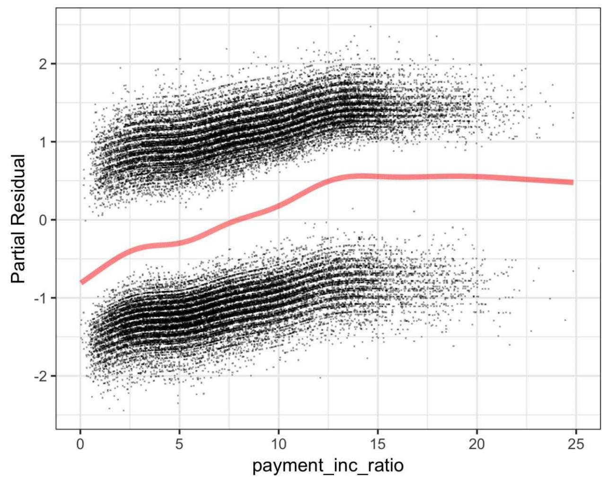

*Figure 5-4. Partial residuals from logistic regression*

### **WARNING**

Some of the output from the summary function can effectively be ignored. The dispersion parameter does not apply to logistic regression and is there for other types of GLMs. The residual deviance and the number of scoring iterations are related to the maximum likelihood fitting method; see "Maximum Likelihood [Estimation".](#page-336-0)

### **KEY IDEAS FOR LOGISTIC REGRESSION**

- Logistic regression is like linear regression, except that the outcome is a binary variable.
- Several transformations are needed to get the model into a form that can be fit as a linear model, with the log of the odds ratio as the response variable.

- After the linear model is fit (by an iterative process), the log odds is mapped back to a probability.
- Logistic regression is popular because it is computationally fast, and produces a model that can be scored to new data without recomputation.

### <span id="page-343-1"></span>**Further Reading**

- 1. The standard reference on logistic regression is *Applied Logistic Regression*, 3rd ed., by David Hosmer, Stanley Lemeshow, and Rodney Sturdivant (Wiley).
- 2. Also popular are two books by Joseph Hilbe: *Logistic Regression Models* (very comprehensive) and *Practical Guide to Logistic Regression* (compact), both from CRC Press.
- 3. *Elements of Statistical Learning*, 2nd ed., by Trevor Hastie, Robert Tibshirani, Jerome Freidman, and its shorter cousin, *An Introduction to Statistical Learning*, by Gareth James, Daniela Witten, Trevor Hastie, and Robert Tibshirani (both from Springer) both have a section on logistic regression.
- <span id="page-343-0"></span>4. *Data Mining for Business Analytics*, 3rd ed., by Galit Shmueli, Peter Bruce, and Nitin Patel (Wiley, 2016, with variants for R, Excel, and JMP) has a full chapter on logistic regression.

# <span id="page-344-0"></span>**Evaluating Classification Models**

It is common in predictive modeling to try out a number of different models, apply each to a holdout sample (also called a *test* or *validation sample*), and assess their performance. Fundamentally, this amounts to seeing which produces the most accurate predictions.

#### <span id="page-344-8"></span><span id="page-344-4"></span><span id="page-344-3"></span><span id="page-344-2"></span>**KEY TERMS FOR EVALUATING CLASSIFICATION MODELS**

#### *Accuracy*

The percent (or proportion) of cases classified correctly.

#### *Confusion matrix*

A tabular display (2×2 in the binary case) of the record counts by their predicted and actual classification status.

#### *Sensitivity*

The percent (or proportion) of 1s correctly classified.

*Synonym*

<span id="page-344-7"></span>Recall

#### *Specificity*

The percent (or proportion) of 0s correctly classified.

#### *Precision*

The percent (proportion) of predicted 1s that are actually 1s.

*ROC curve*

<span id="page-344-6"></span>A plot of sensitivity versus specificity.

*Lift*

<span id="page-344-5"></span>A measure of how effective the model is at identifying (comparitively rare) 1s at different probability cutoffs.

A simple way to measure classification performance is to count the proportion of predictions that are correct.

<span id="page-344-1"></span>In most classification algorithms, each case is assigned an "estimated probability of being a 1." [3](#page-369-2) The default decision point, or cutoff, is typically 0.50 or 50%. If the probability is above 0.5, the classification is "1," otherwise it is "0." An alternative default cutoff is the prevalent probability of 1s in the data.

Accuracy is simply a measure of total error:

$$accuracy = \frac{\sum True Positive + \sum True Negative}{SampleSize}$$

### <span id="page-346-2"></span>**Confusion Matrix**

<span id="page-346-1"></span><span id="page-346-0"></span>At the heart of classification metrics is the *confusion matrix*. The confusion matrix is a table showing the number of correct and incorrect predictions categorized by type of response. Several packages are available in R to compute a confusion matrix, but in the binary case, it is simple to compute one by hand.

To illustrate the confusion matrix, consider the logistic\_gam model that was trained on a balanced data set with an equal number of defaulted and paid-off loans (see [Figure](#page-340-0) 5-4). Following the usual conventions *Y* = 1 corresponds to the event of interest (e.g., default) and *Y* = 0 corresponds to a negative (or usual) event (e.g., paid off). The following computes the confusion matrix for the logistic\_gam model applied to the entire (unbalanced) training set:

```
pred <- predict(logistic_gam, newdata=train_set)
pred_y <- as.numeric(pred > 0)
true_y <- as.numeric(train_set$outcome=='default')
true_pos <- (true_y==1) & (pred_y==1)
true_neg <- (true_y==0) & (pred_y==0)
false_pos <- (true_y==0) & (pred_y==1)
false_neg <- (true_y==1) & (pred_y==0)
conf_mat <- matrix(c(sum(true_pos), sum(false_pos),
                     sum(false_neg), sum(true_neg)), 2, 2)
colnames(conf_mat) <- c('Yhat = 1', 'Yhat = 0')
rownames(conf_mat) <- c('Y = 1', 'Y = 0')
conf_mat
      Yhat = 1 Yhat = 0
Y = 1 14635 8501
Y = 0 8236 14900
```

The predicted outcomes are columns and the true outcomes are the rows. The diagonal elements of the matrix show the number of correct predictions and the off-diagonal elements show the number of incorrect predictions. For example, 6,126 defaulted loans were correctly predicted as a default, but 17,010 defaulted loans were incorrectly predicted as paid off.

[Figure](#page-347-0) 5-5 shows the relationship between the confusion matrix for a binary reponse *Y* and different metrics (see "Precision, Recall, and [Specificity"](#page-349-0) for more on the metrics). As with the example for the loan data, the actual response is along the rows and the predicted response is along the columns. (You may see confusion matrices with this reversed.) The diagonal boxes (upper left, lower right) show when the predictions correctly predict the response. One important metric not

explicitly called out is the false positive *rate* (the mirror image of precision). When 1s are rare, the ratio of false positives to all predicted positives can be high, leading to the unintuitive situation where a predicted 1 is most likely a 0. This problem plagues medical screening tests (e.g., mammograms) that are widely applied: due to the relative rarity of the condition, positive test results most likely do not mean breast cancer. This leads to much confusion in the public.

<span id="page-347-0"></span>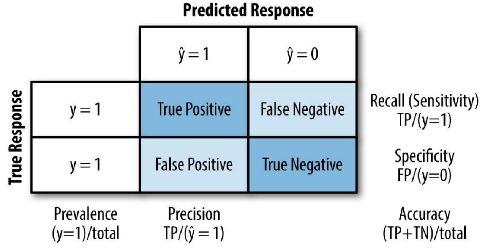

*Figure 5-5. Confusion matrix for a binary response and various metrics*

### <span id="page-348-0"></span>**The Rare Class Problem**

<span id="page-348-1"></span>In many cases, there is an imbalance in the classes to be predicted, with one class much more prevalent than the other — for example, legitimate insurance claims versus fraudulent ones, or browsers versus purchasers at a website. The rare class (e.g., the fraudulent claims) is usually the class of more interest, and is typically designated 1, in contrast to the more prevalent 0s. In the typical scenario, the 1s are the more important case, in the sense that misclassifying them as 0s is costlier than misclassfying 0s as 1s. For example, correctly identifying a fraudulent insurance claim may save thousands of dollars. On the other hand, correctly identifying a nonfraudulent claim merely saves you the cost and effort of going through the claim by hand with a more careful review (which is what you would do if the claim were tagged as "fraudulent").

In such cases, unless the classes are easily separable, the most accurate classification model may be one that simply classifies everything as a 0. For example, if only 0.1% of the browsers at a web store end up purchasing, a model that predicts that each browser will leave without purchasing will be 99.9% accurate. However, it will be useless. Instead, we would be happy with a model that is less accurate overall, but is good at picking out the purchasers, even if it misclassifies some nonpurchasers along the way.

### <span id="page-349-0"></span>**Precision, Recall, and Specificity**

<span id="page-349-2"></span><span id="page-349-1"></span>Metrics other than pure accuracy — metrics that are more nuanced — are commonly used in evaluating classification models. Several of these have a long history in statistics — especially biostatistics, where they are used to describe the expected performance of diagnostic tests. The *precision* measures the accuracy of a predicted positive outcome (see [Figure](#page-347-0) 5-5):

<span id="page-349-3"></span>The *recall*, also known as *sensitivity*, measures the strength of the model to predict a positive outcome — the proportion of the 1s that it correctly identifies (see [Figure](#page-347-0) 5-5). The term *sensitivity* is used a lot in biostatistics and medical diagnostics, whereas *recall* is used more in the machine learning community. The definition of recall is:

$$recall = \frac{\sum True Positive}{\sum True Positive + \sum False Negative}$$

<span id="page-349-4"></span>Another metric used is *specificity*, which measures a model's ability to predict a negative outcome:

$$specificity = \frac{\sum True Negative}{\sum True Negative + \sum False Negative}$$

```
# precision
conf_mat[1,1]/sum(conf_mat[,1])
# recall
conf_mat[1,1]/sum(conf_mat[1,])
# specificity
conf_mat[2,2]/sum(conf_mat[2,])
```

### <span id="page-350-3"></span>**ROC Curve**

<span id="page-350-1"></span>You can see that there is a tradeoff between recall and specificity. Capturing more 1s generally means misclassifying more 0s as 1s. The ideal classifier would do an excellent job of classifying the 1s, without misclassifying more 0s as 1s.

<span id="page-350-2"></span>The metric that captures this tradeoff is the "Receiver Operating Characteristics" curve, usually referred to as the *ROC curve*. The ROC curve plots recall (sensitivity) on the y-axis against specificity on the x-axis. [4](#page-369-3) The ROC curve shows the trade-off between recall and specificity as you change the cutoff to determine how to classify a record. Sensitivity (recall) is plotted on the y-axis, and you may encounter two forms in which the x-axis is labeled:

- <span id="page-350-0"></span>Specificity plotted on the x-axis, with 1 on the left and 0 on the right
- Specificity plotted on the x-axis, with 0 on the left and 1 on the right

The curve looks identical whichever way it is done. The process to compute the ROC curve is:

- 1. Sort the records by the predicted probability of being a 1, starting with the most probable and ending with the least probable.
- 2. Compute the cumulative specificity and recall based on the sorted records.

Computing the ROC curve in R is straightforward. The following code computes ROC for the loan data:

```
idx <- order(-pred)
recall <- cumsum(true_y[idx]==1)/sum(true_y==1)
specificity <- (sum(true_y==0) - cumsum(true_y[idx]==0))/sum(true_y==0)
roc_df <- data.frame(recall = recall, specificity = specificity)
ggplot(roc_df, aes(x=specificity, y=recall)) +
  geom_line(color='blue') +
  scale_x_reverse(expand=c(0, 0)) +
  scale_y_continuous(expand=c(0, 0)) +
  geom_line(data=data.frame(x=(0:100)/100), aes(x=x, y=1-x),
            linetype='dotted', color='red')
```

The result is shown in [Figure](#page-351-0) 5-6. The dotted diagonal line corresponds to a classifier no better than random chance. An extremely effective classifier (or, in medical situations, an extremely effective diagnostic test) will have an ROC that <span id="page-351-0"></span>hugs the upper-left corner — it will correctly identify lots of 1s without misclassifying lots of 0s as 1s. For this model, if we want a classifier with a specificity of at least 50%, then the recall is about 75%.

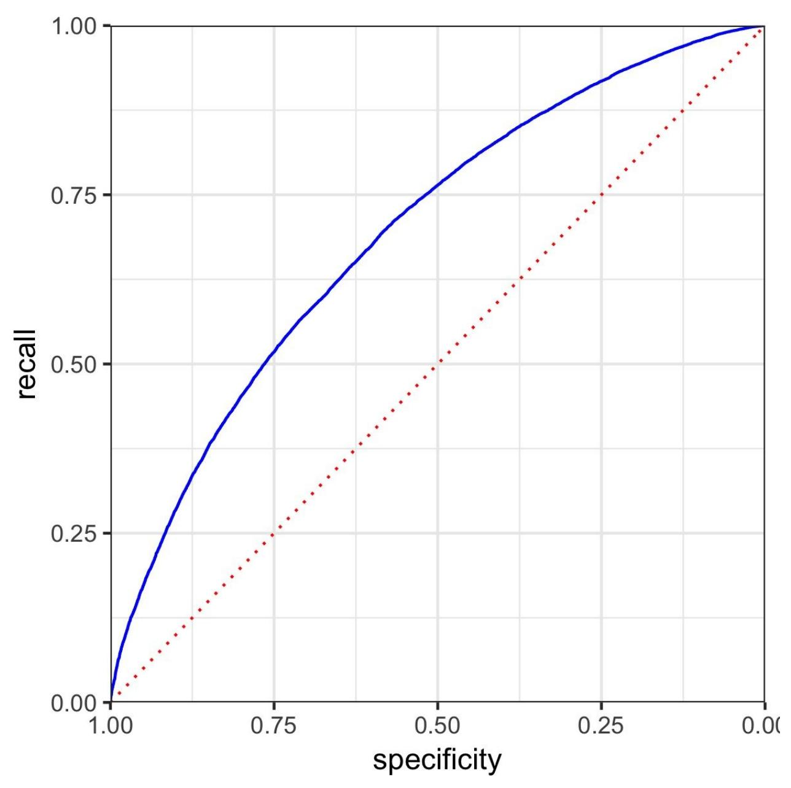

*Figure 5-6. ROC curve for the loan data*

### **PRECISION-RECALL CURVE**

In addition to ROC curves, it can be illuminating to examine the [precision-recall](http://machinelearning.wustl.edu/mlpapers/paper_files/icml2006_DavisG06.pdf) (PR) curve. PR curves are computed in a similar way except that the data is ordered from least to most probable and cumulative precision and recallstatistics are computed. PR curves are especially useful in evaluating data with highly unbalanced outcomes.

### <span id="page-354-1"></span><span id="page-354-0"></span>**AUC**

<span id="page-354-2"></span>The ROC curve is a valuable graphical tool but, by itself, doesn't constitute a single measure for the performance of a classifier. The ROC curve can be used, however, to produce the area underneath the curve (AUC) metric. AUC is simply the total area under the ROC curve. The larger the value of AUC, the more effective the classifier. An AUC of 1 indicates a perfect classifier: it gets all the 1s correctly classified, and doesn't misclassify any 0s as 1s.

A completely ineffective classifier — the diagonal line — will have an AUC of 0.5.

[Figure](#page-354-0) 5-7 shows the area under the ROC curve for the loan model. The value of AUC can be computed by a numerical integration:

```
sum(roc_df$recall[-1] * diff(1-roc_df$specificity))
[1] 0.5924072
```

The model has an AUC of about 0.59, corresponding to a relatively weak classifier.

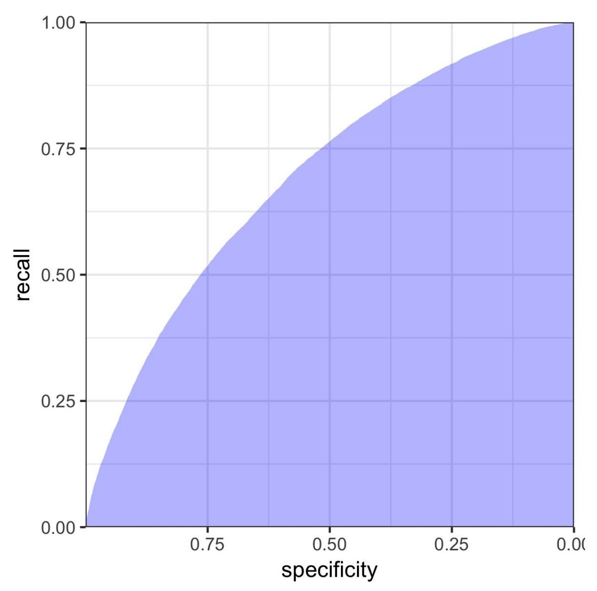

*Figure 5-7. Area under the ROC curve for the loan data*

### <span id="page-356-0"></span>**FALSE POSITIVE RATE CONFUSION**

False positive/negative rates are often confused or conflated with specificity or sensitivity (even in publications and software!). Sometimes the false positive rate is defined as the proportion of true negatives that test positive. In many cases (such as network intrusion detection), the term is used to refer to the proportion of positive signals that are true negatives.

### <span id="page-357-5"></span>**Lift**

<span id="page-357-0"></span>Using the AUC as a metric is an improvement over simple accuracy, as it can assess how well a classifier handles the tradeoff between overall accuracy and the need to identify the more important 1s. But it does not completely address the rare-case problem, where you need to lower the model's probability cutoff below 0.5 to avoid having all records classified as 0. In such cases, for a record to be classified as a 1, it might be sufficient to have a probability of 0.4, 0.3, or lower. In effect, we end up overidentifying 1s, reflecting their greater importance.

Changing this cutoff will improve your chances of catching the 1s (at the cost of misclassifying more 0s as 1s). But what is the optimum cutoff?

The concept of lift lets you defer answering that question. Instead, you consider the records in order of their predicted probability of being 1s. Say, of the top 10% classified as 1s, how much better did the algorithm do, compared to the benchmark of simply picking blindly? If you can get 0.3% response in this top decile instead of the 0.1% you get overall picking randomly, the algorithm is said to have a *lift* (also called *gains*) of 3 in the top decile. A lift chart (gains chart) quantifies this over the range of the data. It can be produced decile by decile, or continuously over the range of the data.

<span id="page-357-4"></span><span id="page-357-3"></span><span id="page-357-2"></span><span id="page-357-1"></span>To compute a lift chart, you first produce a *cumulative gains chart* that shows the recall on the y-axis and the total number of records on the x-axis. The *lift curve* is the ratio of the cumulative gains to the diagonal line corresponding to random selection. *Decile gains charts* are one of the oldest techniques in predictive modeling, dating from the days before internet commerce. They were particularly popular among direct mail professionals. Direct mail is an expensive method of advertising if applied indiscriminantly, and advertisers used predictive models (quite simple ones, in the early days) to identify the potential customers with the likeliest prospect of payoff.

### <span id="page-358-0"></span>**UPLIFT**

Sometimes the term *uplift* is used to mean the same thing as lift. An alternate meaning is used in a more restrictive setting, when an A-B test has been conducted and the treatment (A or B) is then used as a predictor variable in a predictive model. The uplift is the improvement in response predicted *for an individual case* with treatment A versus treatment B. This is determined by scoring the individual case first with the predictor set to A, and then again with the predictor toggled to B. Marketers and political campaign consultants use this method to determine which of two messaging treatments should be used with which customers or voters.

A lift curve lets you look at the consequences of setting different probability cutoffs for classifying records as 1s. It can be an intermediate step in settling on an appropriate cutoff level. For example, a tax authority might only have a certain amount of resources that it can spend on tax audits, and want to spend them on the likeliest tax cheats. With its resource constraint in mind, the authority would use a lift chart to estimate where to draw the line between tax returns selected for audit and those left alone.

### **KEY IDEAS FOR EVALUATING CLASSIFICATION MODELS**

- Accuracy (the percent of predicted classifications that are correct) is but a first step in evaluating a model.
- Other metrics (recall, specificity, precision) focus on more specific performance characteristics (e.g., recall measures how good a model is at correctly identifying 1s).
- AUC (area under the ROC curve) is a common metric for the ability of a model to distinguish 1s from 0s.
- Similarly, lift measures how effective a model is in identifying the 1s, and it is often calculated decile by decile, starting with the most probable 1s.

### <span id="page-359-1"></span>**Further Reading**

Evaluation and assessment are typically covered in the context of a particular model (e.g., *K*-Nearest Neighbors or decision trees); three books that handle it in its own chapter are:

- *Data Mining*, 3rd ed., by Ian Whitten, Elbe Frank, and Mark Hall (Morgan Kaufmann, 2011).
- *Modern Data Science with R* by Benjamin Baumer, Daniel Kaplan, and Nicholas Horton (CRC Press, 2017).
- *Data Mining for Business Analytics*, 3rd ed., by Galit Shmueli, Peter Bruce, and Nitin Patel (Wiley, 2016, with variants for R, Excel, and JMP).

An excellent treatment of cross-validation and resampling can be found in:

<span id="page-359-0"></span>*An Introduction to Statistical Learning* by Gareth James, et al. (Springer, 2013).

### <span id="page-360-0"></span>**Strategies for Imbalanced Data**

<span id="page-360-1"></span>The previous section dealt with evaluation of classification models using metrics that go beyond simple accuracy, and are suitable for imbalanced data — data in which the outcome of interest (purchase on a website, insurance fraud, etc.) is rare. In this section, we look at additional strategies that can improve predictive modeling performance with imbalanced data.

#### <span id="page-360-3"></span>**KEY TERMS FOR IMBALANCED DATA**

#### *Undersample*

Use fewer of the prevalent class records in the classification model.

*Synonym*

Downsample

#### *Oversample*

Use more of the rare class records in the classification model, bootstrapping if necessary.

*Synonym*

<span id="page-360-4"></span><span id="page-360-2"></span>Upsample

#### *Up weight or down weight*

Attach more (or less) weight to the rare (or prevalent) class in the model.

#### *Data generation*

Like bootstrapping, except each new bootstrapped record is slightly different from its source.

#### *Z-score*

<span id="page-360-5"></span>The value that results after standardization.

#### *K*

The number of neighbors considered in the nearest neighbor calculation.

### <span id="page-361-0"></span>**Undersampling**

<span id="page-361-2"></span><span id="page-361-1"></span>If you have enough data, as is the case with the loan data, one solution is to *undersample* (or downsample) the prevalent class, so the data to be modeled is more balanced between 0s and 1s. The basic idea in undersampling is that the data for the dominant class has many redundant records. Dealing with a smaller, more balanced data set yields benefits in model performance, and makes it easier to prepare the data, and to explore and pilot models.

How much data is enough? It depends on the application, but in general, having tens of thousands of records for the less dominant class is enough. The more easily distinguishable the 1s are from the 0s, the less data needed.

The loan data analyzed in "Logistic [Regression"](#page-327-0) was based on a balanced training set: half of the loans were paid off and the other half were in default. The predicted values were similar: half of the probabilities were less than 0.5 and half were greater than 0.5. In the full data set, only about 5% of the loans were in default:

```
mean(loan_all_data$outcome == 'default')
[1] 0.05024048
```

What happens if we use the full data set to train the model?

```
full_model <- glm(outcome ~ payment_inc_ratio + purpose_ +
                        home_ + emp_len_+ dti + revol_bal + revol_util,
                      data=train_set, family='binomial')
pred <- predict(full_model)
mean(pred > 0)
[1] 0.00386009
```

Only 0.39% of the loans are predicted to be in default, or less than 1/12 of the expected number. The loans that were paid off overwhelm the loans in default because the model is trained using all the data equally. Thinking about it intuitively, the presence of so many nondefaulting loans, coupled with the inevitable variability in predictor data, means that, even for a defaulting loan, the model is likely to find some nondefaulting loans that it is similar to, by chance. When a balanced sample was used, roughly 50% of the loans were predicted to be in default.

### <span id="page-362-3"></span>**Oversampling and Up/Down Weighting**

<span id="page-362-1"></span><span id="page-362-0"></span>One criticism of the undersampling method is that it throws away data and is not using all the information at hand. If you have a relatively small data set, and the rarer class contains a few hundred or a few thousand records, then undersampling the dominant class has the risk of throwing out useful information. In this case, instead of downsampling the dominant case, you should oversample (upsample) the rarer class by drawing additional rows with replacement (bootstrapping).

You can achieve a similar effect by weighting the data. Many classification algorithms take a weight argument that will allow you to up/down weight the data. For example, apply a weight vector to the loan data using the weight argument to glm:

```
wt <- ifelse(loan_all_data$outcome=='default',
             1/mean(loan_all_data$outcome == 'default'), 1)
full_model <- glm(outcome ~ payment_inc_ratio + purpose_ +
                    home_ + emp_len_+ dti + revol_bal + revol_util,
                  data=loan_all_data, weight=wt, family='binomial')
pred <- predict(full_model)
mean(pred > 0)
[1] 0.4344177
```

The weights for loans that default are set to where *p* is the probability of default. The nondefaulting loans have a weight of 1. The sum of the weights for the defaulted loans and nondefaulted loans are roughly equal. The mean of the predicted values is now 43% instead of 0.39%.

Note that weighting provides an alternative to both upsampling the rarer class and downsampling the dominant class.

### <span id="page-363-0"></span>**ADAPTING THE LOSS FUNCTION**

Many classification and regression algorithms optimize a certain criteria or *loss function*. For example, logistic regression attempts to minimize the deviance. In the literature, some propose to modify the loss function in order to avoid the problems caused by a rare class. In practice, this is hard to do: classification algorithms can be complex and difficult to modify. Weighting is an easy way to change the loss function, discounting errors for records with low weights in favor of records of higher weights.

### <span id="page-364-2"></span>**Data Generation**

<span id="page-364-0"></span>A variation of upsampling via bootstrapping (see ["Undersampling"](#page-361-0)) is *data generation* by perturbing existing records to create new records. The intuition behind this idea is that since we only observe a limited set of instances, the algorithm doesn't have a rich set of information to build classification "rules." By creating new records that are similar but not identical to existing records, the algorithm has a chance to learn a more robust set of rules. This notion is similar in spirit to ensemble statistical models such as boosting and bagging (see [Chapter](#page-370-0) 6).

<span id="page-364-1"></span>The idea gained traction with the publication of the *SMOTE* algorithm, which stands for "Synthetic Minority Oversampling Technique." The SMOTE algorithm finds a record that is similar to the record being upsampled (see "K-Nearest [Neighbors"\)](#page-373-0) and creates a synthetic record that is a randomly weighted average of the original record and the neighboring record, where the weight is generated separately for each predictor. The number of synthetic oversampled records created depends on the oversampling ratio required to bring the data set into approximate balance, with respect to outcome classes.

There are several implementations of SMOTE in R. The most comprehensive package for handling unbalanced data is unbalanced. It offers a variety of techniques, including a "Racing" algorithm to select the best method. However, the SMOTE algorithm is simple enough that it can be implemented directly in R using the knn package.

### <span id="page-365-1"></span>**Cost-Based Classification**

<span id="page-365-0"></span>In practice, accuracy and AUC are a poor man's way to choose a classification rule. Often, an estimated cost can be assigned to false positives versus false negatives, and it is more appropriate to incorporate these costs to determine the best cutoff when classifying 1s and 0s. For example, suppose the expected cost of a default of a new loan is and the expected return from a paid-off loan is . Then the expected return for that loan is:

Instead of simply labeling a loan as default or paid off, or determining the probability of default, it makes more sense to determine if the loan has a positive expected return. Predicted probability of default is an intermediate step, and it must be combined with the loan's total value to determine expected profit, which is the ultimate planning metric of business. For example, a smaller value loan might be passed over in favor of a larger one with a slightly higher predicted default probability.

### <span id="page-366-0"></span>**Exploring the Predictions**

<span id="page-366-2"></span><span id="page-366-1"></span>A single metric, such as AUC, cannot capture all aspects of the appropriateness of a model for a situation. [Figure](#page-366-0) 5-8 displays the decision rules for four different models fit to the loan data using just two predictor variables: borrower\_score and payment\_inc\_ratio. The models are linear discriminant analysis (LDA), logistic linear regression, logistic regression fit using a generalized additive model (GAM) and a tree model (see "Tree [Models"\)](#page-387-0). The region to the upper-left of the lines corresponds to a predicted default. LDA and logistic linear regression give nearly identical results in this case. The tree model produces the least regular rule: in fact, there are situations in which increasing the borrower score shifts the prediction from "paid-off" to "default"! Finally, the GAM fit of the logistic regression represents a compromise between the tree models and the linear models.

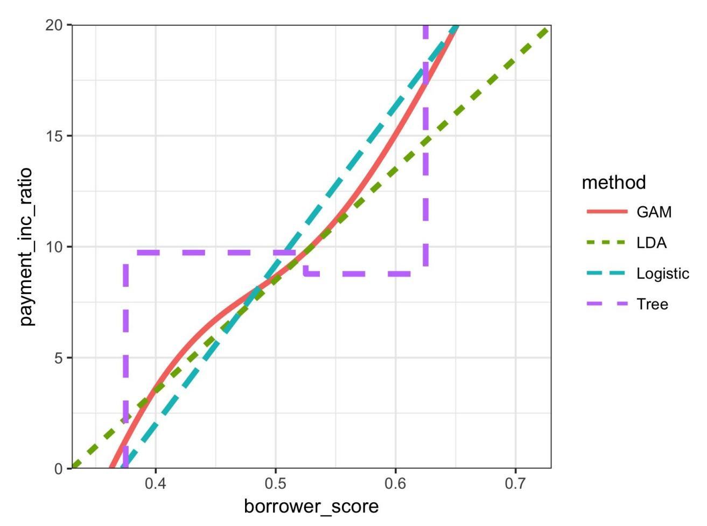

*Figure 5-8. Comparison of the classification rules for four different methods*

It is not easy to visualize the prediction rules in higher dimensions, or in the case of the GAM and tree model, even generate the regions for such rules.

In any case, exploratory analysis of predicted values is always warranted.

### **KEY IDEAS FOR IMBALANCED DATA STRATEGIES**

- Highly imbalanced data (i.e., where the interesting outcomes, the 1s, are rare) are problematic for classification algorithms.
- One strategy is to balance the training data via undersampling the abundant case (or oversampling the rare case).
- If using all the 1s still leaves you with too few 1s, you can bootstrap the rare cases, or use SMOTE to create synthetic data similar to existing rare cases.
- Imbalanced data usually indicates that correctly classifying one class (the 1s) has higher value, and that value ratio should be built into the assessment metric.

### <span id="page-368-1"></span>**Further Reading**

- Tom Fawcett, author of *Data Science for Business*, has a good article on [imbalanced](https://svds.com/learning-imbalanced-classes) classes.
- For more on SMOTE, see Nitesh V. Chawla, Kevin W. Bowyer, Lawrence O. Hall, and W. Philip [Kegelmeyer,](http://jair.org/media/953/live-953-2037-jair.pdf) "SMOTE: Synthetic Minority Oversampling Technique," *Journal of Artificial Intelligence Research* 16 (2002): 321–357.
- <span id="page-368-0"></span>Also see the Analytics Vidya Content Team's "Practical Guide to deal with Imbalanced [Classification](https://www.analyticsvidhya.com/blog/2016/03/practical-guide-deal-imbalanced-classification-problems) Problems in R," March 28, 2016.

### <span id="page-369-5"></span>**Summary**

Classification, the process of predicting which of two (or a small number of) categories a record belongs to, is a fundamental tool of predictive analytics. Will a loan default (yes or no)? Will it prepay? Will a web visitor click on a link? Will she purchase something? Is an insurance claim fraudulent? Often in classification problems, one class is of primary interest (e.g., the fraudulent insurance claim) and, in binary classification, this class is designated as a 1, with the other, more prevalent class being a 0. Often, a key part of the process is estimating a *propensity score*, a probability of belonging to the class of interest. A common scenario is one in which the class of interest is relatively rare. The chapter concludes with a discussion of a variety of model assessment metrics that go beyond simple accuracy; these are important in the rare-class situation, when classifying all records as 0s can yield high accuracy.

- <span id="page-369-4"></span><span id="page-369-0"></span>This and subsequent sections in this chapter © 2017 Datastats, LLC, Peter Bruce and Andrew Bruce, used by permission. [1](#page-311-0)
- <span id="page-369-1"></span>It is certainly surprising that the first article on statistical classification was published in a journal devoted to eugenics. Indeed, there is a [disconcerting](http://www.statistics.com/blog/1/1459877037-subject-eugenics-journey-to-the-dark-side-at-the-dawn-of-statistics) connection between the early development of statistics and eugenics. [2](#page-318-0)
- <span id="page-369-2"></span>Not all methods provide unbiased estimates of probability. In most cases, it is sufficient that the method provide a ranking equivalent to the rankings that would result from an unbiased probability estimate; the cutoff method is then functionally equivalent. [3](#page-344-1)
- <span id="page-369-3"></span>The ROC curve was first used during World War II to describe the performance of radar receiving stations, whose job was to correctly identify (classify) reflected radar signals, and alert defense forces to incoming aircraft. [4](#page-350-0)

# <span id="page-370-0"></span>**Chapter 6. Statistical Machine Learning**

<span id="page-370-3"></span><span id="page-370-2"></span>Recent advances in statistics have been devoted to developing more powerful automated techniques for predictive modeling — both regression and classification. These methods fall under the umbrella of *statistical machine learning*, and are distinguished from classical statistical methods in that they are data-driven and do not seek to impose linear or other overall structure on the data. The *K*-Nearest Neighbors method, for example, is quite simple: classify a record in accordance with how similar records are classified. The most successful and widely used techniques are based on *ensemble learning* applied to *decision trees*. The basic idea of ensemble learning is to use many models to form a prediction as opposed to just a single model. Decision trees are a flexible and automatic technique to learn rules about the relationships between predictor variables and outcome variables. It turns out that the combination of ensemble learning with decision trees leads to the top-performing off-the-shelf predictive modeling techniques.

<span id="page-370-1"></span>The development of many of the techniques in statistical machine learning can be traced back to the statisticians Leo Breiman (see [Figure](#page-371-0) 6-1) at the University of California at Berkeley and Jerry Friedman at Stanford University. Their work, along with other researchers at Berkeley and Stanford, started with the development of tree models in 1984. The subsequent development of ensemble methods of bagging and boosting in the 1990s established the foundation of statistical machine learning.

<span id="page-371-1"></span><span id="page-371-0"></span>

*Figure 6-1. Leo Breiman, who was a professor of statistics at Berkeley, was at the forefront in development of many techniques at the core of a data scientist's toolkit*

### <span id="page-372-2"></span><span id="page-372-0"></span>**MACHINE LEARNING VERSUS STATISTICS**

<span id="page-372-1"></span>In the context of predictive modeling, what is the difference between machine learning and statistics? There is not a bright line dividing the two disciplines. Machine learning tends to be more focused on developing efficient algorithms that scale to large data in order to optimize the predictive model. Statistics generally pays more attention to the probabilistic theory and underlying structure of the model. Bagging, and the random forest (see ["Bagging](#page-404-0) and the Random Forest"), grew up firmly in the statistics camp. Boosting (see ["Boosting"](#page-417-0)), on the other hand, has been developed in both disciplines but receives more attention on the machine learning side of the divide. Regardless of the history, the promise of boosting ensures that it will thrive as a technique in both statistics and machine learning.

### <span id="page-373-0"></span>**K-Nearest Neighbors**

The idea behind *K*-Nearest Neighbors (KNN) is very simple. [1](#page-430-0) For each record to be classified or predicted:

- <span id="page-373-6"></span><span id="page-373-5"></span><span id="page-373-2"></span><span id="page-373-1"></span>1. Find *K* records that have similar features (i.e., similar predictor values).
- 2. For classification: Find out what the majority class is among those similar records, and assign that class to the new record.
- <span id="page-373-3"></span>3. For prediction (also called *KNN regression*): Find the average among those similar records, and predict that average for the new record.

| KEY<br>TERMS<br>FOR<br>K-NEAREST<br>NEIGHBORS                                                                                                |
|----------------------------------------------------------------------------------------------------------------------------------------------|
| Neighbor<br>A<br>record<br>that<br>has<br>similar<br>predictor<br>values<br>to<br>another<br>record.                                         |
| Distance<br>metrics<br>Measures<br>that<br>sum<br>up<br>in<br>a<br>single<br>number<br>how<br>far<br>one<br>record<br>is<br>from<br>another. |
| Standardization<br>Subtract<br>the<br>mean<br>and<br>divide<br>by<br>the<br>standard<br>deviation.                                           |
| Synonym<br>Normalization                                                                                                                     |
| Z-score<br>The<br>value<br>that<br>results<br>after<br>standardization.                                                                      |
| K<br>The<br>number<br>of<br>neighbors<br>considered<br>in<br>the<br>nearest<br>neighbor<br>calculation.                                      |

<span id="page-373-8"></span><span id="page-373-7"></span><span id="page-373-4"></span>KNN is one of the simpler prediction/classification techniques: there is no model to be fit (as in regression). This doesn't mean that using KNN is an automatic procedure. The prediction results depend on how the features are scaled, how similarity is measured, and how big *K* is set. Also, all predictors must be in numeric form. We will illustrate it with a classification example.

### <span id="page-374-0"></span>**A Small Example: Predicting Loan Default**

[Table](#page-374-1) 6-1 shows a few records of personal loan data from the Lending Club. Lending Club is a leader in peer-to-peer lending in which pools of investors make personal loans to individuals. The goal of an analysis would be to predict the outcome of a new potential loan: paid-off versus default.

<span id="page-374-1"></span>

| Outcome     | Loan<br>amount | Income | Purpose            | Years<br>employed | Home<br>ownership | State |
|-------------|----------------|--------|--------------------|-------------------|-------------------|-------|
| Paid<br>off | 10000          | 79100  | debt_consolidation | 11                | MORTGAGE          | NV    |
| Paid<br>off | 9600           | 48000  | moving             | 5                 | MORTGAGE          | TN    |
| Paid<br>off | 18800          | 120036 | debt_consolidation | 11                | MORTGAGE          | MD    |
| Default     | 15250          | 232000 | small_business     | 9                 | MORTGAGE          | CA    |
| Paid<br>off | 17050          | 35000  | debt_consolidation | 4                 | RENT              | MD    |
| Paid<br>off | 5500           | 43000  | debt_consolidation | 4                 | RENT              | KS    |

<span id="page-374-2"></span>*Table 6-1. A few records and columns for Lending Club loan data*

Consider a very simple model with just two predictor variables: dti, which is the ratio of debt payments (excluding mortgage) to income, and payment\_inc\_ratio, which is the ratio of the loan payment to income. Both ratios are multiplied by 100. Using a small set of 200 loans, loan200, with known binary outcomes (default or no-default, specified in the predictor outcome200), and with *K* set to 20, the KNN estimate for a new loan to be predicted, newloan, with dti=22.5 and payment\_inc\_ratio=9 can be calculated in R as follows:

```
library(FNN)
knn_pred <- knn(train=loan200, test=newloan, cl=outcome200, k=20)
knn_pred == 'default'
[1] TRUE
```

The KNN prediction is for the loan to default.

While R has a native knn function, the [contributed](https://cran.r-project.org/web/packages/FNN/FNN.pdf) R package FNN, for Fast Nearest Neighbor, scales to big data better and provides more flexibility.

<span id="page-375-0"></span>[Figure](#page-375-0) 6-2 gives a visual display of this example. The new loan to be predicted is the square in the middle. The circles (default) and triangles (paid off) are the training data. The black line shows the boundary of the nearest 20 points. In this case, 14 defaulted loans lie within the circle as compared with only 6 paid-off loans. Hence, the predicted outcome of the loan is default.

### **NOTE**

While the output of KNN for classification is typically a binary decision, such as default or paid off in the loan data, KNN routines usually offer the opportunity to output a probability (propensity) between 0 and 1. The probability is based on the fraction of one class in the *K* nearest neighbors.

In the preceding example, this probability of default would have been estimated at or 0.7. Using a probability score lets you use classification rules other than simple majority votes (probability of 0.5). This is especially important in problems with imbalanced classes; see "Strategies for [Imbalanced](#page-360-0) Data". For example, if the goal is to identify members of a rare class, the cutoff would typically be set below 50%. One common approach is to set the cutoff at the probability of the rare event.

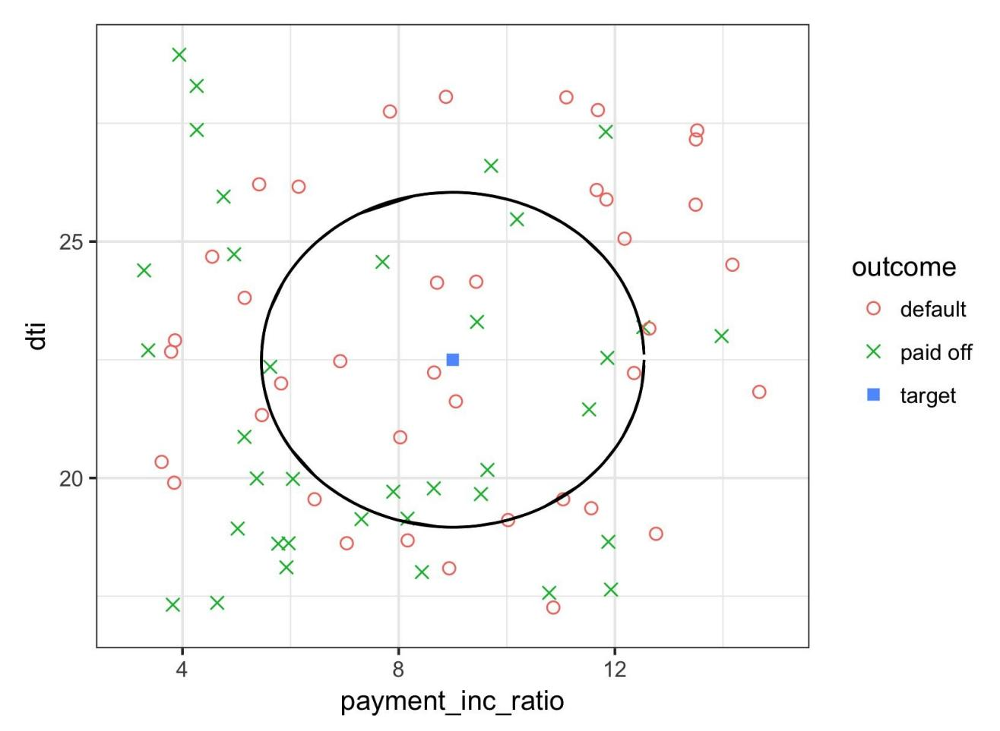

*Figure 6-2. KNN prediction of loan default using two variables: debt-to-income ratio and loan payment-to-income ratio*

### <span id="page-377-0"></span>**Distance Metrics**

<span id="page-377-1"></span>Similarity (nearness) is determined using a *distance metric*, which is a function that measures how far two records  $(x_1, x_2, \dots x_p)$  and  $(u_1, u_2, \dots u_p)$  are from one another. The most popular distance metric between two vectors is *Euclidean distance*. To measure the Euclidean distance between two vectors, subtract one from the other, square the differences, sum them, and take the square root:

<span id="page-377-2"></span>
$$\sqrt{(x_1 - u_1)^2 + (x_2 - u_2)^2 + \cdots + (x_p - u_p)^2}.$$

Euclidean distance offers special computational advantages. This is particularly important for large data sets since KNN involves  $K \times n$  pairwise comparisons where  $n$  is the number of rows.

<span id="page-377-3"></span>Another common distance metric for numeric data is *Manhattan distance*:

$$|x_1 - u_1| + |x_2 - u_2| + \cdots + |x_p - u_p|$$

Euclidean distance corresponds to the straight-line distance between two points (e.g., as the crow flies). Manhattan distance is the distance between two points traversed in a single direction at a time (e.g., traveling along rectangular city blocks). For this reason, Manhattan distance is a useful approximation if similarity is defined as point-to-point travel time.

In measuring distance between two vectors, variables (features) that are measured with comparatively large scale will dominate the measure. For example, for the loan data, the distance would be almost solely a function of the income and loan amount variables, which are measured in tens or hundreds of thousands. Ratio variables would count for practically nothing in comparison. We address this problem by standardizing the data; see "Standardization (Normalization, Z-Scores)".

### <span id="page-378-2"></span><span id="page-378-1"></span>**OTHER DISTANCE METRICS**

<span id="page-378-0"></span>There are numerous other metrics for measuring distance between vectors. For numeric data, *Mahalanobis distance* is attractive since it accounts for the correlation between two variables. This is usefulsince if two variables are highly correlated, Mahalanobis will essentially treat these as a single variable in terms of distance. Euclidean and Manhattan distance do not account for the correlation, effectively placing greater weight on the attribute that underlies those features. The downside of using Mahalanobis distance is increased computational effort and complexity; it is computed using the *covariance matrix*; see ["Covariance](#page-319-0) Matrix".

### <span id="page-379-0"></span>**One Hot Encoder**

<span id="page-379-3"></span>The loan data in [Table](#page-374-1) 6-1 includes several factor (string) variables. Most statistical and machine learning models require this type of variable to be converted to a series of binary dummy variables conveying the same information, as in [Table](#page-379-1) 6-2. Instead of a single variable denoting the home occupant status as "owns with a mortage," "owns with no mortgage," "rents," or "other," we end up with four binary variables. The first would be "owns with a mortgage — Y/N," the second would be "owns with no mortgage — Y/N," and so on. This one predictor, home occupant status, thus yields a vector with one 1 and three 0s, that can be used in statistical and machine learning algorithms. The phrase *one hot encoding* comes from digital circuit terminology, where it describes circuit settings in which only one bit is allowed to be positive (hot).

<span id="page-379-2"></span><span id="page-379-1"></span>

| Table<br>6-2.<br>Representing<br>home  |
|----------------------------------------|
| ownership<br>factor<br>data<br>as<br>a |
| numeric<br>dummy<br>variable           |

| OTHER | OWN | RENT |
|-------|-----|------|
| 0     | 0   | 0    |
| 0     | 0   | 0    |
| 0     | 0   | 0    |
| 0     | 0   | 0    |
| 0     | 0   | 1    |
| 0     | 0   | 1    |
|       |     |      |

### **NOTE**

<span id="page-379-4"></span>In linear and logistic regression, one hot encoding causes problems with multicollinearity; see ["Multicollinearity"](#page-274-0). In such cases, one dummy is omitted (its value can be inferred from the other values). This is not an issue with KNN and other methods.

### <span id="page-380-0"></span>**Standardization (Normalization, Z-Scores)**

<span id="page-380-3"></span>In measurement, we are often not so much interested in "how much" but "how different from the average." Standardization, also called *normalization*, puts all variables on similar scales by subtracting the mean and dividing by the standard deviation. In this way, we ensure that a variable does not overly influence a model simply due to the scale of its original measurement.

<span id="page-380-4"></span>
$$z = \frac{x - \overline{x}}{s}$$

<span id="page-380-5"></span>These are commonly refered to as *z-scores*. Measurements are then stated in terms of "standard deviations away from the mean." In this way, a variable's impact on a model is not affected by the scale of its original measurement.

### <span id="page-380-2"></span>**CAUTION**

*Normalization* in this statistical context is not to be confused with *database normalization*, which is the removal of redundant data and the verification of data dependencies.

<span id="page-380-1"></span>For KNN and a few other procedures (e.g., principal components analysis and clustering), it is essential to consider standardizing the data prior to applying the procedure. To illustrate this idea, KNN is applied to the loan data using dti and payment\_inc\_ratio (see "A Small Example: [Predicting](#page-374-0) Loan Default") plus two other variables: revol\_bal, the total revolving credit available to the applicant in dollars, and revol\_util, the percent of the credit being used. The new record to be predicted is shown here:

```
newloan
 payment_inc_ratio dti revol_bal revol_util
1 2.3932 1 1687 9.4
```

The magnitude of revol\_bal, which is in dollars, is much bigger than the other variables. The knn function returns the index of the nearest neighbors as an attribute nn.index, and this can be used to show the top-five closest rows in

loan\_df:

```
loan_df <- model.matrix(~ -1 + payment_inc_ratio + dti + revol_bal +
                     revol_util, data=loan_data)
knn_pred <- knn(train=loan_df, test=newloan, cl=outcome, k=5)
loan_df[attr(knn_pred,"nn.index"),]
    payment_inc_ratio dti revol_bal revol_util
36054 2.22024 0.79 1687 8.4
33233 5.97874 1.03 1692 6.2
28989 5.65339 5.40 1694 7.0
29572 5.00128 1.84 1695 5.1
20962 9.42600 7.14 1683 8.6
```

The value of revol\_bal in these neighbors is very close to its value in the new record, but the other predictor variables are all over the map and essentially play no role in determining neighbors.

Compare this to KNN applied to the standardized data using the R function scale, which computes the *z*-score for each variable:

```
loan_std <- scale(loan_df)
knn_pred <- knn(train=loan_std, test=newloan_std, cl=outcome, k=5)
loan_df[attr(knn_pred,"nn.index"),]
    payment_inc_ratio dti revol_bal revol_util
2081 2.61091 1.03 1218 9.7
36054 2.22024 0.79 1687 8.4
23655 2.34286 1.12 523 10.7
41327 2.15987 0.69 2115 8.1
39555 2.76891 0.75 2129 9.5
```

The five nearest neighbors are much more alike in all the variables providing a more sensible result. Note that the results are displayed on the original scale, but KNN was applied to the scaled data and the new loan to be predicted.

### <span id="page-381-0"></span>**TIP**

Using the *z*-score is just one way to rescale variables. Instead of the mean, a more robust estimate of location could be used, such as the median. Likewise, a different estimate of scale such as the interquartile range could be used instead of the standard deviation. Sometimes, variables are "squashed" into the 0–1 range. It's also important to realize that scaling each variable to have unit variance is somewhat arbitrary. This implies that each variable is thought to have the same importance in predictive power. If you have subjective knowledge that some variables are more important than others, then these could be scaled up. For example, with the loan data, it is reasonable to expect that the payment-to-income ratio is very important.

### <span id="page-382-0"></span>**NOTE**

Normalization (standardization) does not change the distributionalshape of the data; it does not make it normally shaped if it was not already normally shaped (see "Normal [Distribution"\)](#page-129-0).

### <span id="page-383-0"></span>**Choosing K**

<span id="page-383-1"></span>The choice of *K* is very important to the performance of KNN. The simplest choice is to set , known as the 1-nearest neighbor classifier. The prediction is intuitive: it is based on finding the data record in the training set most similar to the new record to be predicted. Setting is rarely the best choice; you'll almost always obtain superior performance by using *K* > 1-nearest neighbors.

Generally speaking, if *K* is too low, we may be overfitting: including the noise in the data. Higher values of *K* provide smoothing that reduces the risk of overfitting in the training data. On the other hand, if *K* is too high, we may oversmooth the data and miss out on KNN's ability to capture the local structure in the data, one of its main advantages.

<span id="page-383-2"></span>The *K* that best balances between overfitting and oversmoothing is typically determined by accuracy metrics and, in particular, accuracy with holdout or validation data. There is no general rule about the best *K* — it depends greatly on the nature of the data. For highly structured data with little noise, smaller values of *K* work best. Borrowing a term from the signal processing community, this type of data is sometimes referred to as having a high *signal-to-noise ratio* (*SNR*). Examples of data with typically high SNR are handwriting and speech recognition. For noisy data with less structure (data with a low SNR), such as the loan data, larger values of *K* are appropriate. Typically, values of *K* fall in the range 1 to 20. Often, an odd number is chosen to avoid ties.

### <span id="page-384-2"></span><span id="page-384-1"></span>**BIAS-VARIANCE TRADEOFF**

<span id="page-384-0"></span>The tension between oversmoothing and overfitting is an instance of the *bias-variance tradeoff*, an ubiquitous problem in statistical model fitting. Variance refers to the modeling error that occurs because of the choice of training data; that is, if you were to choose a different set of training data, the resulting model would be different. Bias refers to the modeling error that occurs because you have not properly identified the underlying real-world scenario; this error would not disappear if you simply added more training data. When a flexible model is overfit, the variance increases. You can reduce this by using a simpler model, but the bias may increase due to the loss of flexibility in modeling the real underlying situation. A general approach to handling this tradeoff is through *cross-validation*. See ["Cross-Validation"](#page-252-0) for more details.

### <span id="page-385-0"></span>**KNN as a Feature Engine**

KNN gained its popularity due to its simplicity and intuitive nature. In terms of performance, KNN by itself is usually not competitive with more sophisticated classification techniques. In practical model fitting, however, KNN can be used to add "local knowledge" in a staged process with other classification techniques.

- <span id="page-385-2"></span>1. KNN is run on the data, and for each record, a classification (or quasiprobability of a class) is derived.
- 2. That result is added as a new feature to the record, and another classification method is then run on the data. The original predictor variables are thus used twice.

At first you might wonder whether this process, since it uses some predictors twice, causes a problem with multicollinearity (see ["Multicollinearity"\)](#page-274-0). This is not an issue, since the information being incorporated into the second-stage model is highly local, derived only from a few nearby records, and is therefore additional information, and not redundant.

### <span id="page-385-3"></span><span id="page-385-1"></span>**NOTE**

You can think of this staged use of KNN as a form of ensemble learning, in which multiple predictive modeling methods are used in conjunction with one another. It can also be considered as a form of feature engineering where the aim is to derive features (predictor variables) that have predictive power. Often this involves some manual review of the data; KNN gives a fairly automatic way to do this.

For example, consider the King County housing data. In pricing a home for sale, a realtor will base the price on similar homes recently sold, known as "comps." In essence, realtors are doing a manual version of KNN: by looking at the sale prices of similar homes, they can estimate what a home will sell for. We can create a new feature for a statistical model to mimic the real estate professional by applying KNN to recent sales. The predicted value is the sales price and the existing predictor variables could include location, total square feet, type of structure, lot size, and number of bedrooms and bathrooms. The new predictor variable (feature) that we add via KNN is the KNN predictor for each record

<span id="page-386-1"></span>(analogous to the realtors' comps). Since we are predicting a numerical value, the average of the *K*-Nearest Neighbors is used instead of a majority vote (known as *KNN regression*).

Similarly, for the loan data, we can create features that represent different aspects of the loan process. For example, the following would build a feature that represents a borrower's creditworthiness:

```
borrow_df <- model.matrix(~ -1 + dti + revol_bal + revol_util + open_acc +
                         delinq_2yrs_zero + pub_rec_zero, data=loan_data)
borrow_knn <- knn(borrow_df, test=borrow_df, cl=loan_data[, 'outcome'],
               prob=TRUE, k=10)
prob <- attr(borrow_knn, "prob")
borrow_feature <- ifelse(borrow_knn=='default', prob, 1-prob)
summary(borrow_feature)
  Min. 1st Qu. Median Mean 3rd Qu. Max.
0.0000 0.4000 0.5000 0.5012 0.6000 1.0000
```

The result is a feature that predicts the likelihood a borrower will default based on his credit history.

#### <span id="page-386-0"></span>**KEY IDEAS FOR K-NEAREST NEIGHBORS**

- *K*-Nearest Neighbors (KNN) classifies a record by assigning it to the class that similar records belong to.
- Similarity (distance) is determined by Euclidian distance or other related metrics.
- The number of nearest neighbors to compare a record to, *K*, is determined by how well the algorithm performs on training data, using different values for *K*.
- Typically, the predictor variables are standardized so that variables of large scale do not dominate the distance metric.
- KNN is often used as a first stage in predictive modeling, and the predicted value is added back into the data as a *predictor* for second-stage (non-KNN) modeling.

### <span id="page-387-0"></span>**Tree Models**

<span id="page-387-10"></span>Tree models, also called *Classification and Regression Trees* (*CART*), [2](#page-430-1) *decision trees*, or just *trees*, are an effective and popular classification (and regression) method initially developed by Leo Breiman and others in 1984. Tree models, and their more powerful descendents *random forests* and *boosting* (see "Bagging and the Random Forest" and ["Boosting"\),](#page-404-0) form the basis for the most widely used and powerful predictive modeling tools in data science for both regression and classification.

#### <span id="page-387-9"></span><span id="page-387-8"></span><span id="page-387-4"></span><span id="page-387-2"></span><span id="page-387-1"></span>**KEY TERMS FOR TREES**

#### *Recursive partitioning*

Repeatedly dividing and subdividing the data with the goal of making the outcomes in each final subdivision as homogeneous as possible.

#### *Split value*

A predictor value that divides the records into those where that predictor is less than the split value, and those where it is more.

#### *Node*

<span id="page-387-6"></span>In the decision tree, or in the set of corresponding branching rules, a node is the graphical or rule representation of a split value.

#### *Leaf*

The end of a set of if-then rules, or branches of a tree — the rules that bring you to that leaf provide one of the classification rules for any record in a tree.

#### *Loss*

<span id="page-387-5"></span>The number of misclassifications at a stage in the splitting process; the more losses, the more impurity.

#### *Impurity*

The extent to which a mix of classes is found in a subpartition of the data (the more mixed, the more impure).

#### *Synonym*

<span id="page-387-3"></span>Heterogeneity

#### *Antonym*

Homogeneity, purity

#### *Pruning*

<span id="page-387-7"></span>The process of taking a fully grown tree and progressively cutting its branches back, to reduce overfitting.

A tree model is a set of "if-then-else" rules that are easy to understand and to implement. In contrast to regression and logistic regression, trees have the ability to discover hidden patterns corresponding to complex interactions in the data. However, unlike KNN or naive Bayes, simple tree models can be expressed in terms of predictor relationships that are easily interpretable.

### <span id="page-389-0"></span>**DECISION TREES IN OPERATIONS RESEARCH**

The term *decision trees* has a different (and older) meaning in decision science and operations research, where it refers to a human decision analysis process. In this meaning, decision points, possible outcomes, and their estimated probabilities are laid out in a branching diagram, and the decision path with the maximum expected value is chosen.

### <span id="page-390-2"></span>**A Simple Example**

The two main packages to fit tree models in R are rpart and tree. Using the rpart package, a model is fit to a sample of 3,000 records of the loan data using the variables [payment\\_inc\\_ratio](#page-373-0) and borrower\_score (see "K-Nearest Neighbors" for a description of the data).

```
library(rpart)
loan_tree <- rpart(outcome ~ borrower_score + payment_inc_ratio,
                   data=loan_data, control = rpart.control(cp=.005))
plot(loan_tree, uniform=TRUE, margin=.05)
text(loan_tree)
```

The resulting tree is shown in [Figure](#page-390-0) 6-3. These classification rules are determined by traversing through a hierarchical tree, starting at the root until a leaf is reached.

<span id="page-390-0"></span>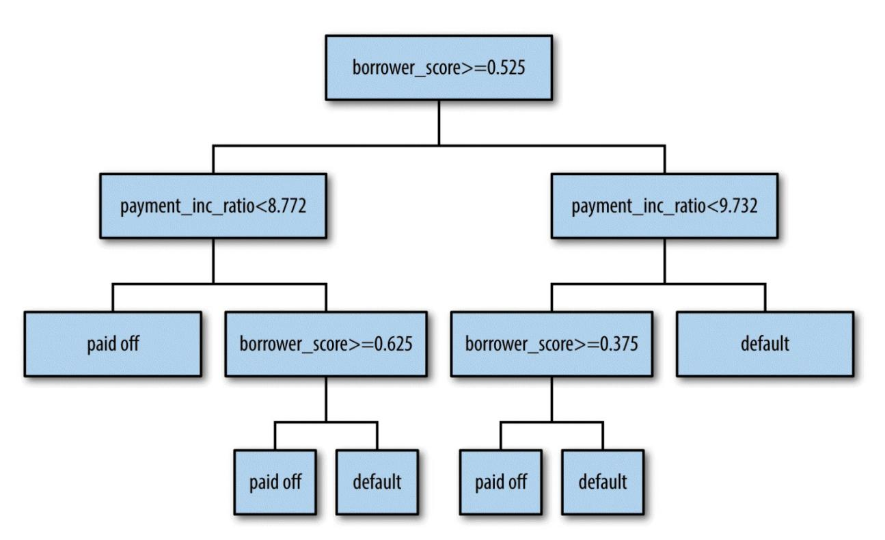

*Figure 6-3. The rules for a simple tree model fit to the loan data*

Typically, the tree is plotted upside-down, so the root is at the top and the leaves are at the bottom. For example, if we get a loan with borrower\_score of 0.6 and a payment\_inc\_ratio of 8.0, we end up at the leftmost leaf and predict the loan will be paid off.

A nicely printed version of the tree is also easily produced:

```
loan_tree
n= 3000
node), split, n, loss, yval, (yprob)
     * denotes terminal node
1) root 3000 1467 paid off (0.5110000 0.4890000)
  2) borrower_score>=0.525 1283 474 paid off (0.6305534 0.3694466)
    4) payment_inc_ratio< 8.772305 845 249 paid off (0.7053254 0.2946746) *
    5) payment_inc_ratio>=8.772305 438 213 default (0.4863014 0.5136986)
     10) borrower_score>=0.625 149 60 paid off (0.5973154 0.4026846) *
     11) borrower_score< 0.625 289 124 default (0.4290657 0.5709343) *
  3) borrower_score< 0.525 1717 724 default (0.4216657 0.5783343)
    6) payment_inc_ratio< 9.73236 1082 517 default (0.4778189 0.5221811)
     12) borrower_score>=0.375 784 384 paid off (0.5102041 0.4897959) *
     13) borrower_score< 0.375 298 117 default (0.3926174 0.6073826) *
    7) payment_inc_ratio>=9.73236 635 207 default (0.3259843 0.6740157) *
```

The depth of the tree is shown by the indent. Each node corresponds to a provisional classification determined by the prevalent outcome in that partition. The "loss" is the number of misclassifications yielded by the provisional classification in a partition. For example, in node 2, there were 474 misclassification out of a total of 1,467 total records. The values in the parentheses correspond to the proportion of records that are paid off and default, respectively. For example, in node 13, which predicts default, over 60 percent of the records are loans that are in default.

### <span id="page-392-1"></span>**The Recursive Partitioning Algorithm**

<span id="page-392-2"></span><span id="page-392-0"></span>The algorithm to construct a decision tree, called *recursive partitioning* , is straightforward and intuitive. The data is repeatedly partitioned using predictor values that do the best job of separating the data into relatively homogeneous partitions. [Figure](#page-392-0) 6-4 shows a picture of the partitions created for the tree in [Figure](#page-390-0) 6-3. The first rule is borrower\_score >= 0.525 and is depicted by rule 1 in the plot. The second rule is payment\_inc\_ratio < 9.732 and divides the righthand region in two.

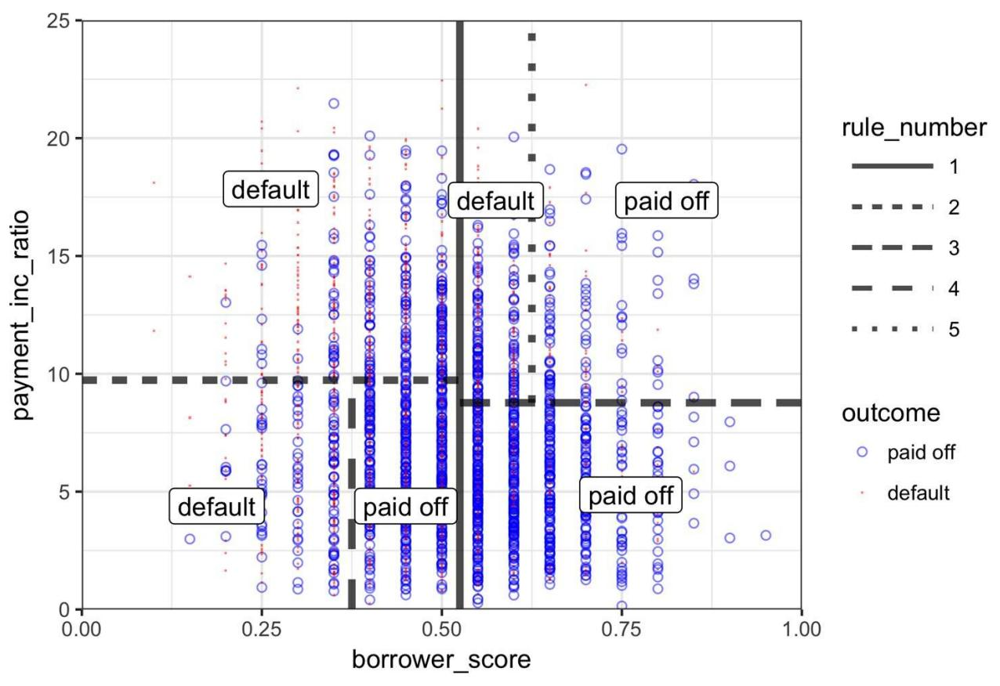

*Figure 6-4. The rules for a simple tree model fit to the loan data*

Suppose we have a response variable *Y* and a set of *P* predictor variables *X<sup>j</sup>* for . For a partition *A* of records, recursive partitioning will find the best way to partition *A* into two subpartitions:

- 1. For each predictor variable *X<sup>j</sup>* ,
  - a. For each value *s<sup>j</sup>* of *X<sup>j</sup>* :
    - i. Split the records in *A* with *X<sup>j</sup>* values < *s<sup>j</sup>* as one partition, and the remaining records where *X<sup>j</sup>* ≥ *s<sup>j</sup>* as another partition.
    - ii. Measure the homogeneity of classes within each subpartition of *A*.
  - b. Select the value of *s<sup>j</sup>* that produces maximum within-partition homogeneity of class.
- 2. Select the variable *X<sup>j</sup>* and the split value *s<sup>j</sup>* that produces maximum

within-partition homogeneity of class.

Now comes the recursive part:

- 1. Initialize *A* with the entire data set.
- 2. Apply the partitioning algorithm to split *A* into two subpartitions, *A<sup>1</sup>* and *A2* .
- 3. Repeat step 2 on subpartitions *A<sup>1</sup>* and *A<sup>2</sup>* .
- 4. The algorithm terminates when no further partition can be made that sufficiently improves the homogeneity of the partitions.

The end result is a partitioning of the data, as in [Figure](#page-392-0) 6-4 except in *P*dimensions, with each partition predicting an outcome of 0 or 1 depending on the majority vote of the reponse in that partition.

### **NOTE**

In addition to a binary 0/1 prediction, tree models can produce a probability estimate based on the number of 0s and 1s in the partition. The estimate is simply the sum of 0s or 1s in the partition divided by the number of observations in the partition.

The estimated can then be converted to a binary decision; for example, set the estimate to 1 if Prob(*Y* = 1) > 0.5.

### <span id="page-395-1"></span><span id="page-395-0"></span>**Measuring Homogeneity or Impurity**

<span id="page-395-4"></span><span id="page-395-2"></span>Tree models recursively create partitions (sets of records), *A*, that predict an outcome of *Y* = 0 or *Y* = 1. You can see from the preceding algorithm that we need a way to measure homogeneity, also called *class purity*, within a partition. Or, equivalently, we need to measure the impurity of a partition. The accuracy of the predictions is the proportion *p* of misclassified records within that partition, which ranges from 0 (perfect) to 0.5 (purely random guessing).

<span id="page-395-3"></span>It turns out that accuracy is not a good measure for impurity. Instead, two common measures for impurity are the *Gini impurity* and *entropy* or *information*. While these (and other) impurity measures apply to classification problems with more than two classes, we focus on the binary case. The Gini impurity for a set of records *A* is:

The entropy measure is given by:

$$I(A) = -p\log_2(p) - (1-p)\log_2(1-p)$$

[Figure](#page-395-0) 6-5 shows that Gini impurity (rescaled) and entropy measures are similar, with entropy giving higher impurity scores for moderate and high accuracy rates.

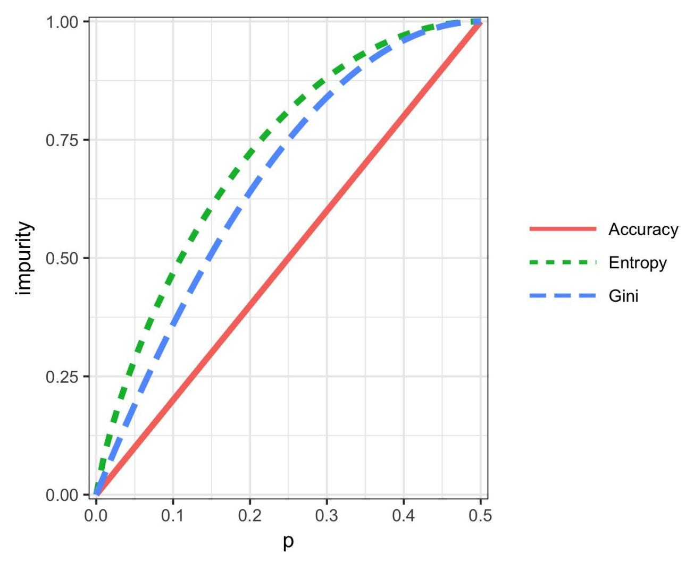

*Figure 6-5. Gini impurity and entropy measures*

### <span id="page-397-0"></span>**GINI COEFFICIENT**

Gini impurity is not to be confused with the *Gini coefficient*. They represent similar concepts, but the Gini coefficient is limited to the binary classification problem and is related to the AUC metric (see ["AUC"](#page-354-1)).

The impurity metric is used in the splitting algorithm described earlier. For each proposed partition of the data, impurity is measured for each of the partitions that result from the split. A weighted average is then calculated, and whichever partition (at each stage) yields the lowest weighted average is selected.

### <span id="page-398-1"></span>**Stopping the Tree from Growing**

<span id="page-398-0"></span>As the tree grows bigger, the splitting rules become more detailed, and the tree gradually shifts from identifying "big" rules that identify real and reliable relationships in the data to "tiny" rules that reflect only noise. A fully grown tree results in completely pure leaves and, hence, 100% accuracy in classifying the data that it is trained on. This accuracy is, of course, illusory — we have overfit (see [Bias-Variance](#page-384-0) Tradeoff) the data, fitting the noise in the training data, not the signal that we want to identify in new data.

### <span id="page-399-2"></span>**PRUNING**

A simple and intuitive method of reducing tree size is to *prune* back the terminal and smaller branches of the tree, leaving a smaller tree. How far should the pruning proceed? A common technique is to prune the tree back to the point where the error on holdout data is minimized. When we combine predictions from multiple trees (see ["Bagging](#page-404-0) and the Random Forest"), however, we will need a way to stop tree growth. Pruning plays a role in the process of crossvalidation to determine how far to grow trees that are used in ensemble methods.

We need some way to determine when to stop growing a tree at a stage that will generalize to new data. There are two common ways to stop splitting:

- Avoid splitting a partition if a resulting subpartition is too small, or if a terminal leaf is too small. In rpart, these constraints are controlled separately by the parameters minsplit and minbucket, respectively, with defaults of 20 and 7.
- <span id="page-399-0"></span>Don't split a partition if the new partition does not "significantly" reduce the impurity. In rpart, this is controlled by the *complexity parameter* cp, which is a measure of how complex a tree is — the more complex, the greater the value of cp. In practice, cp is used to limit tree growth by attaching a penalty to additional complexity (splits) in a tree.

The first method involves arbitrary rules, and can be usful for exploratory work, but we can't easily determine optimum values (i.e., values that maximize predictive accuracy with new data). With the complexity parameter, cp, we can estimate what size tree will perform best with new data.

If cp is too small, then the tree will overfit the data, fitting noise and not signal. On the other hand, if cp is too large, then the tree will be too small and have little predictive power. The default in rpart is 0.01, although for larger data sets, you are likely to find this is too large. In the previous example, cp was set to 0.005 since the default led to a tree with a single split. In exploratory analysis, it is sufficient to simply try a few values.

<span id="page-399-1"></span>Determining the optimum cp is an instance of the [bias-variance](#page-384-0) tradeoff (see Bias-Variance Tradeoff). The most common way to estimate a good value of cp is via

cross-validation (see ["Cross-Validation"](#page-252-0)):

- 1. Partition the data into training and validation (holdout) sets.
- 2. Grow the tree with the training data.
- 3. Prune it successively, step by step, recording cp (using the *training* data) at each step.
- 4. Note the cp that corresponds to the minimum error (loss) on the *validation* data.
- 5. Repartition the data into training and validation, and repeat the growing, pruning, and cp recording process.
- 6. Do this again and again, and average the cps that reflect minimum error for each tree.
- 7. Go back to the original data, or future data, and grow a tree, stopping at this optimum cp value.

In rpart, you can use the argument cptable to produce a table of the CP values and their associated cross-validation error (xerror in R), from which you can determine the CP value that has the lowest cross-validation error.

### <span id="page-401-2"></span>**Predicting a Continuous Value**

<span id="page-401-1"></span><span id="page-401-0"></span>Predicting a continuous value (also termed *regression*) with a tree follows the same logic and procedure, except that impurity is measured by squared deviations from the mean (squared errors) in each subpartition, and predictive performance is judged by the square root of the mean squared error (RMSE) (see ["Assessing](#page-249-0) the Model") in each partition.

### <span id="page-402-3"></span>**How Trees Are Used**

One of the big obstacles faced by predictive modelers in organizations is the perceived "black box" nature of the methods they use, which gives rise to opposition from other elements of the organization. In this regard, the tree model has two appealing aspects.

- <span id="page-402-2"></span>Tree models provide a visual tool for exploring the data, to gain an idea of what variables are important and how they relate to one another. Trees can capture nonlinear relationships among predictor variables.
- Tree models provide a set of rules that can be effectively communicated to nonspecialists, either for implementation or to "sell" a data mining project.

When it comes to prediction, however, harnassing the results from multiple trees is typically more powerful than just using a single tree. In particular, the random forest and boosted tree algorithms almost always provide superior predictive accuracy and performance (see ["Bagging](#page-404-0) and the Random Forest" and ["Boosting"](#page-417-0)), but the aforementioned advantages of a single tree are lost.

### <span id="page-402-1"></span><span id="page-402-0"></span>**KEY IDEAS**

- Decision trees produce a set of rules to classify or predict an outcome.
- The rules correspond to successive partitioning of the data into subpartitions.
- Each partition, or split, references a specific value of a predictor variable and divides the data into records where that predictor value is above or below that split value.
- At each stage, the tree algorithm chooses the split that minimizes the outcome impurity within each subpartition.
- When no further splits can be made, the tree is fully grown and each terminal node, or leaf, has records of a single class; new cases following that rule (split) path would be assigned that class.
- A fully grown tree overfits the data and must be pruned back so that it captures signal and not noise.
- Multiple-tree algorithms like random forests and boosted trees yield better predictive performance, but lose the rule-based communicative power of single trees.

### <span id="page-403-1"></span>**Further Reading**

- Analytics Vidhya Content Team, "A [Complete](https://www.analyticsvidhya.com/blog/2016/04/complete-tutorial-tree-based-modeling-scratch-in-python/) Tutorial on Tree Based Modeling from Scratch (in R & Python)", April 12, 2016.
- <span id="page-403-0"></span>Terry M. Therneau, Elizabeth J. Atkinson, and the Mayo Foundation, "An [Introduction](https://cran.r-project.org/web/packages/rpart/vignettes/longintro.pdf) to Recursive Partitioning Using the RPART Routines", June 29, 2015.

### <span id="page-404-0"></span>**Bagging and the Random Forest**

<span id="page-404-1"></span>In 1907, the statistician Sir Francis Galton was visiting a county fair in England, at which a contest was being held to guess the dressed weight of an ox that was on exhibit. There were 800 guesses, and, while the individual guesses varied widely, both the mean and the median came out within 1% of the ox's true weight. James Suroweicki has explored this phenomenon in his book *The Wisdom of Crowds* (Doubleday, 2004). This principle applies to predictive models, as well: averaging (or taking majority votes) of multiple models — an *ensemble* of models — turns out to be more accurate than just selecting one model.

| KEY<br>TERMS<br>FOR<br>BAGGING<br>AND<br>THE<br>RANDOM<br>FOREST                                                               |
|--------------------------------------------------------------------------------------------------------------------------------|
| Ensemble                                                                                                                       |
| Forming<br>a<br>prediction<br>by<br>using<br>a<br>collection<br>of<br>models.                                                  |
| Synonym                                                                                                                        |
| Model<br>averaging                                                                                                             |
| Bagging                                                                                                                        |
| A<br>general<br>technique<br>to<br>form<br>a<br>collection<br>of<br>models<br>by<br>bootstrapping<br>the<br>data.              |
| Synonym                                                                                                                        |
| Bootstrap<br>aggregation                                                                                                       |
| Random<br>forest                                                                                                               |
| A<br>type<br>of<br>bagged<br>estimate<br>based<br>on<br>decision<br>tree<br>models.                                            |
| Synonym                                                                                                                        |
| Bagged<br>decision<br>trees                                                                                                    |
| Variable<br>importance                                                                                                         |
| A<br>measure<br>of<br>the<br>importance<br>of<br>a<br>predictor<br>variable<br>in<br>the<br>performance<br>of<br>the<br>model. |
|                                                                                                                                |

The ensemble approach has been applied to and across many different modeling methods, most publicly in the Netflix Contest, in which Netflix offered a \$1 million prize to any contestant who came up with a model that produced a 10% improvement in predicting the rating that a Netflix customer would award a movie. The simple version of ensembles is as follows:

1. Develop a predictive model and record the predictions for a given data

set.

- 2. Repeat for multiple models, on the same data.
- 3. For each record to be predicted, take an average (or a weighted average, or a majority vote) of the predictions.

Ensemble methods have been applied most systematically and effectively to decision trees. Ensemble tree models are so powerful that they provide a way to build good predictive models with relatively little effort.

Going beyond the simple ensemble algorithm, there are two main variants of ensemble models: *bagging* and *boosting*. In the case of ensemble tree models, these are refered to as *random forest* models and *boosted tree* models. This section focuses on bagging; boosting is covered in ["Boosting"](#page-417-0).

### <span id="page-406-1"></span>**Bagging**

<span id="page-406-0"></span>Bagging, which stands for "bootstrap aggregating," was introduced by Leo Breiman in 1994. Suppose we have a response *Y* and *P* predictor variables with *n* records.

Bagging is like the basic algorithm for ensembles, except that, instead of fitting the various models to the same data, each new model is fit to a bootstrap resample. Here is the algorithm presented more formally:

- 1. Initialize *M*, the number of models to be fit, and *n*, the number of records to choose (*n* < *N*). Set the iteration .
- 2. Take a bootstrap resample (i.e., with replacement) of *n* records from the training data to form a subsample and (the bag).
- 3. Train a model using and to create a set of decision rules .
- 4. Increment the model counter . If *m* <= *M*, go to step 1.

In the case where predicts the probability , the bagged estimate is given by:

$$\hat{f} = \frac{1}{M} (\hat{f}_1(\mathbf{X}) + \hat{f}_2(\mathbf{X}) + \cdots + \hat{f}_M(\mathbf{X}))$$

### <span id="page-407-5"></span>**Random Forest**

<span id="page-407-3"></span><span id="page-407-0"></span>The *random forest* is based on applying bagging to decision trees with one important extension: in addition to sampling the records, the algorithm also samples the variables. [3](#page-430-2) In traditional decision trees, to determine how to create a subpartition of a partition *A*, the algorithm makes the choice of variable and split point by minimizing a criterion such as Gini impurity (see "Measuring [Homogeneity](#page-395-1) or Impurity"). With random forests, at each stage of the algorithm, the choice of variable is limited to a *random subset of variables*. Compared to the basic tree algorithm (see "The Recursive [Partitioning](#page-392-1) Algorithm"), the random forest algorithm adds two more steps: the bagging [discussed](#page-404-0) earlier (see "Bagging and the Random Forest"), and the bootstrap sampling of variables at each split:

- <span id="page-407-4"></span><span id="page-407-2"></span><span id="page-407-1"></span>1. Take a bootstrap (with replacement) subsample from the *records*.
- 2. For the first split, sample *p* < *P variables* at random without replacement.
- 3. For each of the sampled variables , apply the splitting algorithm:
  - a. For each value of :
    - i. Split the records in partition *A* with *X*j(k) < *s*j(k) as one partition, and the remaining records where as another partition.
    - ii. Measure the homogeneity of classes within each subpartition of *A*.
  - b. Select the value of that produces maximum within-partition homogeneity of class.
- 4. Select the variable and the split value that produces maximum within-partition homogeneity of class.
- 5. Proceed to the next split and repeat the previous steps, starting with step 2.

- 6. Continue with additional splits following the same procedure until the tree is grown.
- 7. Go back to step 1, take another bootstrap subsample, and start the process over again.

How many variables to sample at each step? A rule of thumb is to choose where *P* is the number of predictor variables. The package randomForest implements the random forest in R. The following applies this package to the loan data (see ["K-Nearest](#page-373-0) Neighbors" for a description of the data).

```
> library(randomForest)
> rf <- randomForest(outcome ~ borrower_score + payment_inc_ratio,
                    data=loan3000)
Call:
randomForest(formula = outcome ~ borrower_score + payment_inc_ratio,
             data = loan3000)
              Type of random forest: classification
                    Number of trees: 500
No. of variables tried at each split: 1
       OOB estimate of error rate: 38.53%
Confusion matrix:
        paid off default class.error
paid off 1089 425 0.2807133
default 731 755 0.4919246
```

By default, 500 trees are trained. Since there are only two variables in the predictor set, the algorithm randomly selects the variable on which to split at each stage (i.e., a bootstrap subsample of size 1).

<span id="page-408-1"></span>The *out-of-bag* (*OOB*) estimate of error is the error rate for the trained models, applied to the data left out of the training set for that tree. Using the output from the model, the OOB error can be plotted versus the number of trees in the random forest:

```
error_df = data.frame(error_rate = rf$err.rate[,'OOB'],
                      num_trees = 1:rf$ntree)
ggplot(error_df, aes(x=num_trees, y=error_rate)) +
  geom_line()
```

<span id="page-408-0"></span>The result is shown in [Figure](#page-409-0) 6-6. The error rate rapidly decreases from over .44 before stabilizing around .385. The predicted values can be obtained from the predict function and plotted as follows:

<span id="page-409-0"></span>pred <- predict(loan\_lda) rf\_df <- cbind(loan3000, pred\_default=pred[,'default']>.5) ggplot(data=rf\_df, aes(x=borrower\_score, y=payment\_inc\_ratio, color=pred\_default, shape=pred\_default)) + geom\_point(alpha=.6, size=2) + scale\_shape\_manual( values=c( 46, 4))

<span id="page-410-0"></span>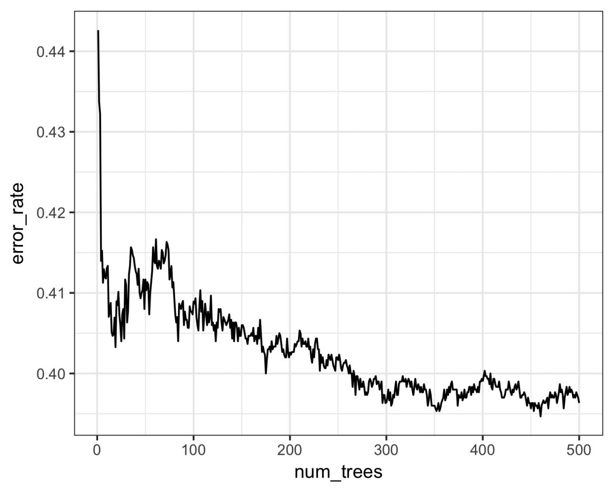

*Figure 6-6. The improvement in accuracy of the random forest with the addition of more trees*

The plot, shown in [Figure](#page-410-0) 6-7, is quite revealing about the nature of the random forest.

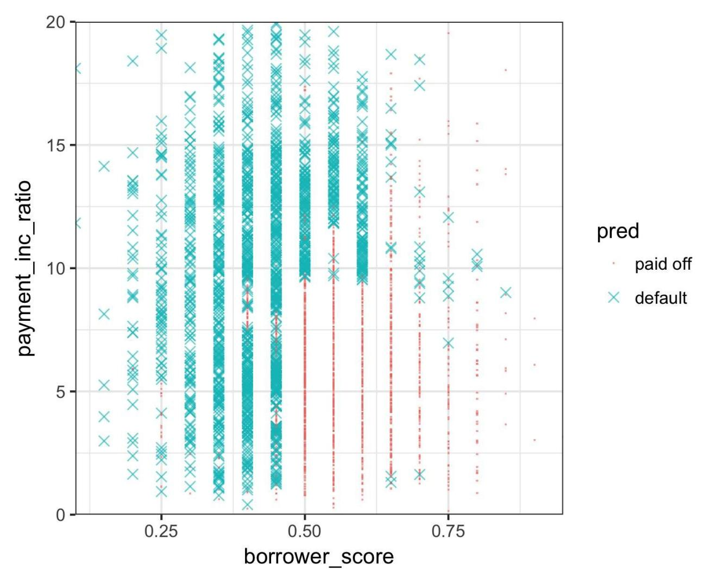

*Figure 6-7. The predicted outcomes from the random forest applied to the loan default data*

The random forest method is a "black box" method. It produces more accurate predictions than a simple tree, but the simple tree's intuitive decision rules are lost. The predictions are also somewhat noisy: note that some borrowers with a very high score, indicating high creditworthiness, still end up with a prediction of default. This is a result of some unusual records in the data and demonstrates the danger of overfitting by the random forest (see [Bias-Variance](#page-384-0) Tradeoff).

### <span id="page-412-0"></span>**Variable Importance**

<span id="page-412-1"></span>The power of the random forest algorithm shows itself when you build predictive models for data with many features and records. It has the ability to automatically determine which predictors are important and discover complex relationships between predictors [corresponding](#page-276-0) to interaction terms (see "Interactions and Main Effects"). For example, fit a model to the loan default data with all columns included:

```
> rf_all <- randomForest(outcome ~ ., data=loan_data, importance=TRUE)
> rf_all
Call:
randomForest(formula = outcome ~ ., data = loan_data, importance = TRUE)
              Type of random forest: classification
                    Number of trees: 500
No. of variables tried at each split: 3
       OOB estimate of error rate: 34.38%
Confusion matrix:
        paid off default class.error
paid off 15078 8058 0.3482884
default 7849 15287 0.3392548
```

The argument importance=TRUE requests that the randomForest store additional information about the importance of different variables. The function varImpPlot will plot the relative performance of the variables:

```
varImpPlot(rf_all, type=1)
varImpPlot(rf_all, type=2)
```

The result is shown in [Figure](#page-412-0) 6-8.

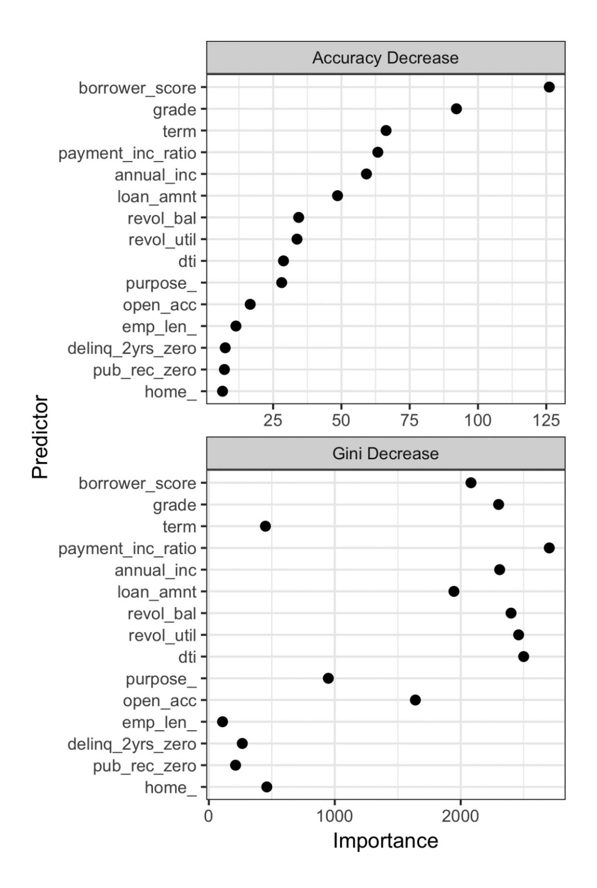

There are two ways to measure variable importance:

- By the decrease in accuracy of the model if the values of a variable are randomly permuted (type=1). Randomly permuting the values has the effect of removing all predictive power for that variable. The accuracy is computed from the out-of-bag data (so this measure is effectively a cross-validated estimate).
- By the mean decrease in the Gini impurity score (see "Measuring [Homogeneity](#page-395-1) or Impurity") for all of the nodes that were split on a variable (type=2). This measures how much improvement to the purity of the nodes that variable contributes. This measure is based on the training set, and therefore less reliable than a measure calculated on out-of-bag data.

The top and bottom panels of [Figure](#page-412-0) 6-8 show variable importance according to the decrease in accuracy and in Gini impurity, respectively. The variables in both panels are ranked by the decrease in accuracy. The variable importance scores produced by these two measures are quite different.

Since the accuracy decrease is a more reliable metric, why should we use the Gini impurity decrease measure? By default, randomForest only computes this Gini impurity: Gini impurity is a byproduct of the algorithm, whereas model accuracy by variable requires extra computations (randomly permuting the data and predicting this data). In cases where computational complexity is important, such as in a production setting where thousands of models are being fit, it may not be worth the extra computational effort. In addition, the Gini decrease sheds light on which variables the random forest is using to make its splitting rules (recall that this information, readily visible in a simple tree, is effectively lost in a random forest). Examining the difference between Gini decrease and model accuracy variable importance may suggest ways to improve the model.

### <span id="page-415-3"></span>**Hyperparameters**

The random forest, as with many statistical machine learning algorithms, can be considered a black-box algorithm with knobs to adjust how the box works. These knobs are called *hyperparameters*, which are parameters that you need to set before fitting a model; they are not optimized as part of the training process. While traditional statistical models require choices (e.g., the choice of predictors to use in a regression model), the hyperparameters for random forest are more critical, especially to avoid overfitting. In particular, the two most important hyperparemters for the random forest are:

### *nodesize*

<span id="page-415-2"></span><span id="page-415-0"></span>The minimum size for terminal nodes (leaves in the tree). The default is 1 for classification and 5 for regression.

### *maxnodes*

The maximum number of nodes in each decision tree. By default, there is no limit and the largest tree will be fit subject to the constraints of nodesize.

It may be tempting to ignore these parameters and simply go with the default values. However, using the default may lead to overfitting when you apply the random forest to noisy data. When you increase nodesize or set maxnodes, the algorithm will fit smaller trees and is less likely to create spurious predictive rules. Cross-validation (see ["Cross-Validation"](#page-252-0)) can be used to test the effects of setting different values for hyperparameters.

### **KEY IDEAS FOR BAGGING AND THE RANDOM FOREST**

- Ensemble models improve model accuracy by combining the results from many models.
- Bagging is a particular type of ensemble model based on fitting many models to bootstrapped samples of the data and averaging the models.
- Random forest is a special type of bagging applied to decision trees. In addition to resampling the data, the random forest algorithm samples the predictor variables when splitting the trees.
- A useful output from the random forest is a measure of variable importance that ranks the predictors in terms of their contribution to model accuracy.
- <span id="page-415-1"></span>The random forest has a set of hyperparameters that should be tuned using cross-validation to avoid overfitting.

### <span id="page-417-0"></span>**Boosting**

<span id="page-417-3"></span><span id="page-417-2"></span>Ensemble models have become a standard tool for predictive modeling. *Boosting* is a general technique to create an ensemble of models. It was developed around the same time as *bagging* (see ["Bagging](#page-404-0) and the Random Forest"). Like bagging, boosting is most commonly used with decision trees. Despite their similarities, boosting takes a very different approach — one that comes with many more bells and whistles. As a result, while bagging can be done with relatively little tuning, boosting requires much greater care in its application. If these two methods were cars, bagging could be considered a Honda Accord (reliable and steady), whereas boosting could be considered a Porsche (powerful but requires more care).

In linear regression models, the residuals are often examined to see if the fit can be improved (see "Partial Residual Plots and [Nonlinearity"](#page-293-0)). Boosting takes this concept much further and fits a series of models with each successive model fit to minimize the error of the previous models. Several variants of the algorithm are commonly used: *Adaboost*, *gradient boosting*, and *stochastic gradient boosting*. The latter, stochastic gradient boosting, is the most general and widely used. Indeed, with the right choice of parameters, the algorithm can emulate the random forest.

#### <span id="page-417-5"></span><span id="page-417-1"></span>**KEY TERMS FOR BOOSTING**

#### *Ensemble*

Forming a prediction by using a collection of models.

#### *Synonym*

<span id="page-417-4"></span>Model averaging

#### *Boosting*

A general technique to fit a sequence of models by giving more weight to the records with large residuals for each successive round.

#### *Adaboost*

An early version of boosting based on reweighting the data based on the residuals.

#### *Gradient boosting*

A more general form of boosting that is cast in terms of minimizing a cost function.

#### *Stochastic gradient boosting*

The most general algorithm for boosting that incorporates resampling of records and columns in

<span id="page-418-1"></span>each round.

#### *Regularization*

<span id="page-418-0"></span>A technique to avoid overfitting by adding a penalty term to the cost function on the number of parameters in the model.

#### *Hyperparameters*

Parameters that need to be set before fitting the algorithm.

### <span id="page-419-0"></span>**The Boosting Algorithm**

The basic idea behind the various boosting algorithms is essentially the same. The easiest to understand is Adaboost, which proceeds as follows:

- <span id="page-419-2"></span><span id="page-419-1"></span>1. Initialize *M*, the maximum number of models to be fit, and set the iteration counter . Initialize the observation weights for . Initialize the ensemble model .
- 2. Train a model using using the observation weights that minimizes the weighted error defined by summing the weights for the misclassified observations.
- 3. Add the model to the ensemble: where .
- 4. Update the weights so that the weights are increased for the observations that were misclassfied. The size of the increase depends on with larger values of leading to bigger weights.
- 5. Increment the model counter . If , go to step 1.

The boosted estimate is given by:

$$\hat{F} = \alpha_1 \hat{f}_1 + \alpha_2 \hat{f}_2 + \cdots + \alpha_M \hat{f}_M$$

By increasing the weights for the observations that were misclassified, the algorithm forces the models to train more heavily on the data for which it performed poorly. The factor ensures that models with lower error have a bigger weight.

<span id="page-419-5"></span><span id="page-419-4"></span><span id="page-419-3"></span>Gradient boosting is similar to Adaboost but casts the problem as an optimization of a cost function. Instead of adjusting weights, gradient boosting fits models to a *pseudo-residual*, which has the effect of training more heavily on the larger residuals. In the spirit of the random forest, stochastic gradient boosting adds randomness to the algorithm by sampling observations and predictor variables at each stage.

### <span id="page-420-0"></span>**XGBoost**

<span id="page-420-1"></span>The most widely used public domain software for boosting is XGBoost, an implementation of stochastic gradient boosting originally developed by Tianqi Chen and Carlos Guestrin at the University of Washington. A computationally efficient implementation with many options, it is available as a package for most major data science software languages. In R, XGBoost is available as the package xgboost.

The function xgboost has many parameters that can, and should, be adjusted (see ["Hyperparameters](#page-427-0) and Cross-Validation"). Two very important parameters are subsample, which controls the fraction of observations that should be sampled at each iteration, and eta, a shrinkage factor applied to in the boosting algorithm (see "The Boosting [Algorithm"](#page-419-0)). Using subsample makes boosting act like the random forest except that the sampling is done without replacement. The shrinkage parameter eta is helpful to prevent overfitting by reducing the change in the weights (a smaller change in the weights means the algorithm is less likely to overfit to the training set). The following applies xgboost to the loan data with just two predictor variables:

```
library(xgboost)
predictors <- data.matrix(loan3000[, c('borrower_score',
                                        'payment_inc_ratio')])
label <- as.numeric(loan3000[,'outcome'])-1
xgb <- xgboost(data=predictors, label=label,
               objective = "binary:logistic",
               params=list(subsample=.63, eta=0.1), nrounds=100)
```

Note that xgboost does not support the formula syntax, so the predictors need to be converted to a data.matrix and the response needs to be converted to 0/1 variables. The objective argument tells xgboost what type of problem this is; based on this, xgboost will choose a metric to optimize.

The predicted values can be obtained from the predict function and, since there are only two variables, plotted versus the predictors:

```
geom_point(alpha=.6, size=2)
```

<span id="page-421-0"></span>The result is shown in [Figure](#page-421-0) 6-9. Qualitatively, this is similar to the predictions from the random forest; see [Figure](#page-410-0) 6-7. The predictions are somewhat noisy in that some borrowers with a very high borrower score still end up with a prediction of default.

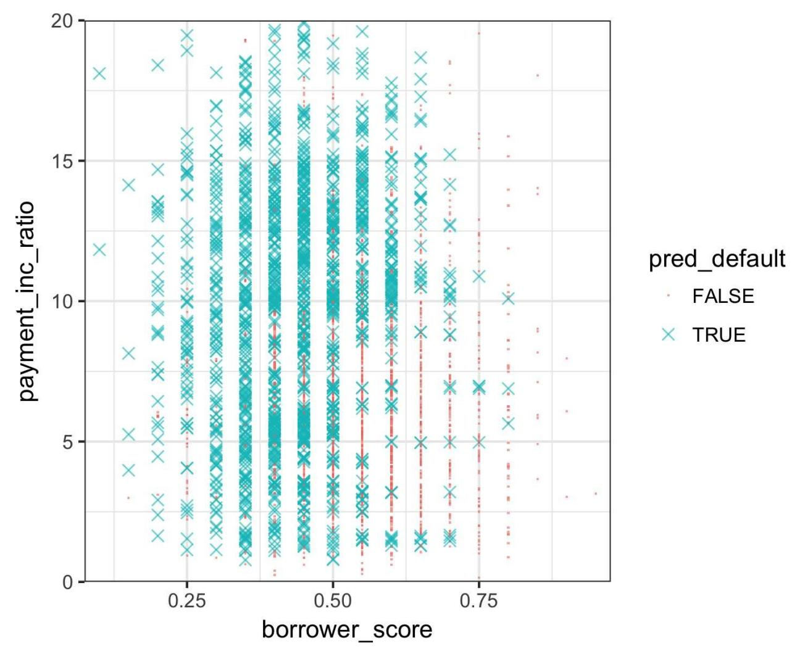

*Figure 6-9. The predicted outcomes from XGBoost applied to the loan default data*

### <span id="page-423-0"></span>**Regularization: Avoiding Overfitting**

Blind application of xgboost can lead to unstable models as a result of *overfitting* to the training data. The problem with overfitting is twofold:

- <span id="page-423-1"></span>The accuracy of the model on new data not in the training set will be degraded.
- The predictions from the model are highly variable, leading to unstable results.

Any modeling technique is potentially prone to overfitting. For example, if too many variables are included in a regression equation, the model may end up with spurious predictions. However, for most statistical techniques, overfitting can be avoided by a judicious selection of predictor variables. Even the random forest generally produces a reasonable model without tuning the parameters. This, however, is not the case for xgboost. Fit xgboost to the loan data for a training set with all of the variables included in the model:

```
> predictors <- data.matrix(loan_data[,-which(names(loan_data) %in%
                                       'outcome')])
> label <- as.numeric(loan_data$outcome)-1
> test_idx <- sample(nrow(loan_data), 10000)
> xgb_default <- xgboost(data=predictors[-test_idx,],
                         label=label[-test_idx],
                         objective = "binary:logistic", nrounds=250)
> pred_default <- predict(xgb_default, predictors[test_idx,])
> error_default <- abs(label[test_idx] - pred_default) > 0.5
> xgb_default$evaluation_log[250,]
   iter train_error
1: 250 0.145622
> mean(error_default)
[1] 0.3715
```

The test set consists of 10,000 randomly sampled records from the full data, and the training set consists of the remaining records. Boosting leads to an error rate of only 14.6% for the training set. The test set, however, has a much higher error rate of 36.2%. This is a result of overfitting: while boosting can explain the variability in the training set very well, the prediction rules do not apply to new data.

Boosting provides several parameters to avoid overfitting, including the parameters eta and subsample (see ["XGBoost"](#page-420-0)). Another approach is

*regularization*, a technique that modifies the cost function in order to *penalize* the complexity of the model. Decision trees are fit by minimizing cost criteria such as Gini's impurity score (see "Measuring [Homogeneity](#page-395-1) or Impurity"). In xgboost, it is possible to modify the cost function by adding a term that measures the complexity of the model.

There are two parameters in xgboost to regularize the model: alpha and lambda, which correspond to Manhattan distance and squared Euclidean distance, respectively (see ["Distance](#page-377-0) Metrics"). Increasing these parameters will penalize more complex models and reduce the size of the trees that are fit. For example, see what happens if we set lambda to 1,000:

```
> xgb_penalty <- xgboost(data=predictors[-test_idx,],
                         label=label[-test_idx],
                         params=list(eta=.1, subsample=.63, lambda=1000),
                         objective = "binary:logistic", nrounds=250)
> pred_penalty <- predict(xgb_penalty, predictors[test_idx,])
> error_penalty <- abs(label[test_idx] - pred_penalty) > 0.5
> xgb_penalty$evaluation_log[250,]
   iter train_error
1: 250 0.332405
> mean(error_penalty)
[1] 0.3483
```

Now the training error is only slightly lower than the error on the test set.

The predict method offers a convenient argument, ntreelimit, that forces only the first *i* trees to be used in the prediction. This lets us directly compare the insample versus out-of-sample error rates as more models are included:

```
> error_default <- rep(0, 250)
> error_penalty <- rep(0, 250)
> for(i in 1:250){
  pred_def <- predict(xgb_default, predictors[test_idx,], ntreelimit=i)
  error_default[i] <- mean(abs(label[test_idx] - pred_def) >= 0.5)
  pred_pen <- predict(xgb_penalty, predictors[test_idx,], ntreelimit = i)
  error_penalty[i] <- mean(abs(label[test_idx] - pred_pen) >= 0.5)
}
```

The output from the model returns the error for the training set in the component xgb\_default\$evaluation\_log. By combining this with the out-of-sample errors, we can plot the errors versus the number of iterations:

```
> errors <- rbind(xgb_default$evaluation_log,
                  xgb_penalty$evaluation_log,
                  data.frame(iter=1:250, train_error=error_default),
```

```
data.frame(iter=1:250, train_error=error_penalty))
> errors$type <- rep(c('default train', 'penalty train',
                       'default test', 'penalty test'), rep(250, 4))
> ggplot(errors, aes(x=iter, y=train_error, group=type)) +
  geom_line(aes(linetype=type, color=type))
```

<span id="page-425-0"></span>The result, displayed in [Figure](#page-425-0) 6-10, shows how the default model steadily improves the accuracy for the training set but actually gets worse for the test set. The penalized model does not exhibit this behavior.

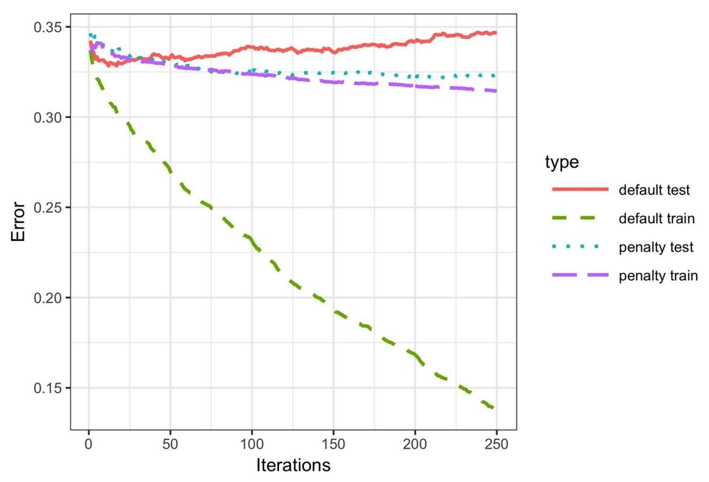

*Figure 6-10. The error rate of the default XGBoost versus a penalized version of XGBoost*

#### <span id="page-426-1"></span>**RIDGE REGRESSION AND THE LASSO**

Adding a penalty on the complexity of a model to help avoid overfitting dates back to the 1970s. Least squares regression minimizes the residualsum of squares (RSS); see "Least [Squares".](#page-239-0) *Ridge regression* minimizes the sum of squared residuals plus a penalty on the number and size of the coefficients:

<span id="page-426-2"></span>
$$\sum_{i=1}^{n} (Y_i - \hat{b}_0 - \hat{b}_1 X_i - \cdots \hat{b} X_p)^2 + \lambda (\hat{b}_1^2 + \cdots + \hat{b}_p^2)$$

<span id="page-426-0"></span>The value of determines how much the coefficients are penalized; larger values produce models that are less likely to overfit the data. The *Lasso* is similar, except that it uses Manhattan distance instead of Euclidean distance as a penalty term:

$$\sum_{i=1}^{n} (Y_i - \hat{b}_0 - \hat{b}_1 X_i - \cdots \hat{b} X_p)^2 + \alpha (|\hat{b}_1| + \cdots + |\hat{b}_p|)$$

The xgboost parameters lambda and alpha are acting in a similar mannger.

### <span id="page-427-0"></span>**Hyperparameters and Cross-Validation**

<span id="page-427-2"></span><span id="page-427-1"></span>xgboost has a daunting array of hyperparameters; see "XGBoost [Hyperparameters"](#page-423-0) for a discussion. As seen in "Regularization: Avoiding Overfitting", the specific choice can dramatically change the model fit. Given a huge combination of hyperparameters to choose from, how should we be guided in our choice? A standard solution to this problem is to use *cross-validation*; see ["Cross-Validation"](#page-252-0). Cross-validation randomly splits up the data into *K* different groups, also called *folds*. For each fold, a model is trained on the data not in the fold and then evaluated on the data in the fold. This yields a measure of accuracy of the model on out-of-sample data. The best set of hyperparameters is the one given by the model with the lowest overall error as computed by averaging the errors from each of the folds.

<span id="page-427-3"></span>To illustrate the technique, we apply it to parameter selection for xgboost. In this example, we explore two parameters: the shrinkage parameter eta (see ["XGBoost"](#page-420-0)) and the maximum depth of trees max\_depth. The parameter max\_depth is the maximum depth of a leaf node to the root of the tree with a default value of 6. This gives us another way to control overfitting: deep trees tend to be more complex and may overfit the data. First we set up the folds and parameter list:

```
> N <- nrow(loan_data)
> fold_number <- sample(1:5, N, replace = TRUE)
> params <- data.frame(eta = rep(c(.1, .5, .9), 3),
                       max_depth = rep(c(3, 6, 12), rep(3,3)))
```

Now we apply the preceding algorithm to compute the error for each model and each fold using five folds:

```
> error <- matrix(0, nrow=9, ncol=5)
> for(i in 1:nrow(params)){
> for(k in 1:5){
> fold_idx <- (1:N)[fold_number == k]
> xgb <- xgboost(data=predictors[-fold_idx,], label=label[-fold_idx],
                    params = list(eta = params[i, 'eta'],
                                 max_depth = params[i, 'max_depth']),
                  objective = "binary:logistic", nrounds=100, verbose=0)
> pred <- predict(xgb, predictors[fold_idx,])
> error[i, k] <- mean(abs(label[fold_idx] - pred) >= 0.5)
> }
> }
```

Since we are fitting 45 total models, this can take a while. The errors are stored as a matrix with the models along the rows and folds along the columns. Using the function rowMeans, we can compare the error rate for the different parameter sets:

|       |                         | > avg_error <- 100 * rowMeans(error) |
|-------|-------------------------|--------------------------------------|
|       |                         | > cbind(params, avg_error)           |
|       | eta max_depth avg_error |                                      |
| 1 0.1 | 3                       | 35.41                                |
| 2 0.5 | 3                       | 35.84                                |
| 3 0.9 | 3                       | 36.48                                |
| 4 0.1 | 6                       | 35.37                                |
| 5 0.5 | 6                       | 37.33                                |
| 6 0.9 | 6                       | 39.41                                |
| 7 0.1 | 12                      | 36.70                                |
| 8 0.5 | 12                      | 38.85                                |
| 9 0.9 | 12                      | 40.19                                |

Cross-validation suggests that using shallower trees with a smaller value of eta yields more accurate results. Since these models are also more stable, the best parameters to use are eta=0.1 and max\_depth=3 (or possibly max\_depth=6).

#### <span id="page-428-1"></span>**XGBOOST HYPERPARAMETERS**

<span id="page-428-0"></span>The hyperparameters for xgboost are primarily used to balance overfitting with the accuracy and computational complexity. For a complete discussion of the parameters, refer to the xgboost [documentation.](https://xgboost.readthedocs.io/en/latest/)

*eta*

The shrinkage factor between 0 and 1 applied to in the boosting algorithm. The default is 0.3, but for noisy data, smaller values are recommended (e.g., 0.1).

#### *nrounds*

The number of boosting rounds. If eta is set to a small value, it is important to increase the number of rounds since the algorithm learns more slowly. As long as some parameters are included to prevent overfitting, having more rounds doesn't hurt.

#### *max\_depth*

The maximum depth of the tree (the default is 6). In contrast to the random forest, which fits very deep trees, boosting usually fits shallow trees. This has the advantage of avoiding spurious complex interactions in the model that can arise from noisy data.

#### *subsample and colsample\_bytree*

Fraction of the records to sample without replacement and the fraction of predictors to sample for use in fitting the trees. These parameters, which are similar to those in random forests, help avoid overfitting.

#### *lambda and alpha*

<span id="page-428-2"></span>The regularization parameters to help control overfitting (see ["Regularization:](#page-423-0) Avoiding Overfitting").

#### **KEY IDEAS FOR BOOSTING**

- Boosting is a class of ensemble models based on fitting a sequence of models, with more weight given to records with large errors in successive rounds.
- Stochastic gradient boosting is the most general type of boosting and offers the best performance. The most common form of stochastic gradient boosting uses tree models.
- XGBoost is a popular and computationally efficient software package for stochastic gradient boosting; it is available in all common languages used in data science.
- Boosting is prone to overfitting the data, and the hyperparameters need to be tuned to avoid this.
- Regularization is one way to avoid overfitting by including a penalty term on the number of parameters (e.g., tree size) in a model.
- Cross-validation is especially important for boosting due to the large number of hyperparameters that need to be set.

### <span id="page-430-5"></span>**Summary**

<span id="page-430-3"></span>This chapter describes two classification and prediction methods that "learn" flexibly and locally from data, rather than starting with a structural model (e.g., a linear regression) that is fit to the entire data set. *K*-Nearest Neighbors is a simple process that simply looks around at similar records and assigns their majority class (or average value) to the record being predicted. Trying various cutoff (split) values of predictor variables, tree models iteratively divide the data into sections and subsections that are increasingly homogeneous with respect to class. The most effective split values form a path, and also a "rule," to a classification or prediction. Tree models are a very powerful and popular predictive tool, often outperforming other methods. They have given rise to various ensemble methods (random forests, boosting, bagging) that sharpen the predictive power of trees.

<span id="page-430-4"></span><span id="page-430-0"></span>This and subsequent sections in this chapter © 2017 Datastats, LLC, Peter Bruce and Andrew Bruce, used by permission. [1](#page-373-1)

<span id="page-430-1"></span>The term CART is a registered trademark of Salford Systems related to their specific implementation of tree models. [2](#page-387-1)

<span id="page-430-2"></span>The term *random forest* is a trademark of Leo Breiman and Adele Cutler and licensed to Salford Systems. There is no standard nontrademark name, and the term random forest is as synonymous with the algorithm as Kleenex is with facial tissues. [3](#page-407-0)

# <span id="page-431-3"></span>**Chapter 7. Unsupervised Learning**

<span id="page-431-2"></span>The term *unsupervised learning* refers to statistical methods that extract meaning from data without training a model on labeled data (data where an outcome of interest is known). In Chapters [4](#page-230-0) and [5,](#page-309-0) the goal is to build a model (set of rules) to predict a response from a set of predictor variables. Unsupervised learning also constructs a model of the data, but does not distinguish between a response variable and predictor variables.

<span id="page-431-0"></span>Unsupervised learning can have different possible goals. In some cases, it can be used to create a predictive rule in the absence of a labeled response. *Clustering* methods can be used to identify meaningful groups of data. For example, using the web clicks and demographic data of a user on a website, we may be able to group together different types of users. The website could then be personalized to these different types.

In other cases, the goal may be to *reduce the dimension* of the data to a more manageable set of variables. This reduced set could then be used as input into a predictive model, such as regression or classification. For example, we may have thousands of sensors to monitor an industrial process. By reducing the data to a smaller set of features, we may be able to build a more powerful and interpretable model to predict process failure than by including data streams from thousands of sensors.

Finally, unsupervised learning can be viewed as an extension of the exploratory data analysis (see [Chapter](#page-12-0) 1) to situations where you are confronted with a large number of variables and records. The aim is to gain insight into a set of data and how the different variables relate to each other. Unsupervised techniques give ways to sift through and analyze these variables and discover relationships.

### **UNSUPERVISED LEARNING AND PREDICTION**

<span id="page-431-1"></span>Unsupervised learning can play an important role for prediction, both for regression and classification problems. In some cases, we want to predict a category in the absence of any labeled data. For example, we might want to predict the type of vegetation in an area from a set of satellite sensory data. Since we don't have a response variable to train a model, clustering gives us a way to identify common patterns and categorize the regions.

<span id="page-432-1"></span>Clustering is an especially important tool for the "cold-start problem." In these types of problems, such as launching a new marketing campaign or identifying potential new types of fraud or spam, we initially may not have any response to train a model. Over time, as data is collected, we can learn more about the system and build a traditional predictive model. But clustering helps us start the learning process more quickly by identifying population segments.

<span id="page-432-0"></span>Unsupervised learning is also important as a building block for regression and classification techniques. With big data, if a smallsubpopulation is not well represented in the overall population, the trained model may not perform well for that subpopulation. With clustering, it is possible to identify and label subpopulations. Separate models can then be fit to the different subpopulations. Alternatively, the subpopulation can be represented with its own feature, forcing the overall model to explicitly consider subpopulation identity as a predictor.

### <span id="page-433-0"></span>**Principal Components Analysis**

Often, variables will vary together (covary), and some of the variation in one is actually duplicated by variation in another. Principal components analysis (PCA) is a technique to discover the way in which numeric variables covary. [1](#page-489-0)

#### <span id="page-433-6"></span><span id="page-433-5"></span><span id="page-433-1"></span>**KEY TERMS FOR PRINCIPAL COMPONENTS ANALYSIS**

#### *Principal component*

A linear combination of the predictor variables.

#### *Loadings*

The weights that transform the predictors into the components.

<span id="page-433-2"></span>*Synonym* Weights

#### *Screeplot*

<span id="page-433-4"></span>A plot of the variances of the components, showing the relative importance of the components.

The idea in PCA is to combine multiple numeric predictor variables into a smaller set of variables, which are weighted linear combinations of the original set. The smaller set of variables, the *principal components*, "explains" most of the variability of the full set of variables, reducing the dimension of the data. The weights used to form the principal components reveal the relative contributions of the original variables to the new principal components.

<span id="page-433-3"></span>PCA was first [proposed](http://stat.smmu.edu.cn/history/pearson1901.pdf) by Karl Pearson. In what was perhaps the first paper on unsupervised learning, Pearson recognized that in many problems there is variability in the predictor variables, so he developed PCA as a technique to model this variability. PCA can be viewed as the unsupervised version of linear discriminant analysis; se[e"Discriminant](#page-318-1) Analysis".

### <span id="page-434-2"></span>**A Simple Example**

For two variables, and , there are two principal components ( or 2):

$$Z_i = w_{i,1} X_1 + w_{i,2} X_2$$

The weights are known as the component *loadings*. These transform the original variables into the principal components. The first principal component, , is the linear combination that best explains the total variation. The second principal component, , explains the remaining variation (it is also the linear combination that is the worst fit).

### <span id="page-434-1"></span><span id="page-434-0"></span>**NOTE**

It is also common to compute principal components on deviations from the means of the predictor variables, rather than on the values themselves.

You can compute principal components in R using the princomp function. The following performs a PCA on the stock price returns for Chevron (CVX) and ExxonMobil (XOM):

```
oil_px <- sp500_px[, c('CVX', 'XOM')]
pca <- princomp(oil_px)
pca$loadings
Loadings:
    Comp.1 Comp.2
CVX -0.747 0.665
XOM -0.665 -0.747
```

The weights for CVX and XOM for the first principal component are –0.747 and – 0.665 and for the second principal component they are 0.665 and –0.747. How to interpret this? The first principal component is essentially an average of CVX and XOM, reflecting the correlation between the two energy companies. The second principal component measures when the stock prices of CVX and XOM diverge.

It is instructive to plot the principal components with the data:

```
loadings <- pca$loadings
ggplot(data=oil_px, aes(x=CVX, y=XOM)) +
  geom_point(alpha=.3) +
  stat_ellipse(type='norm', level=.99) +
  geom_abline(intercept = 0, slope = loadings[2,1]/loadings[1,1]) +
  geom_abline(intercept = 0, slope = loadings[2,2]/loadings[1,2])
```

<span id="page-435-0"></span>The result is shown in [Figure](#page-435-0) 7-1.

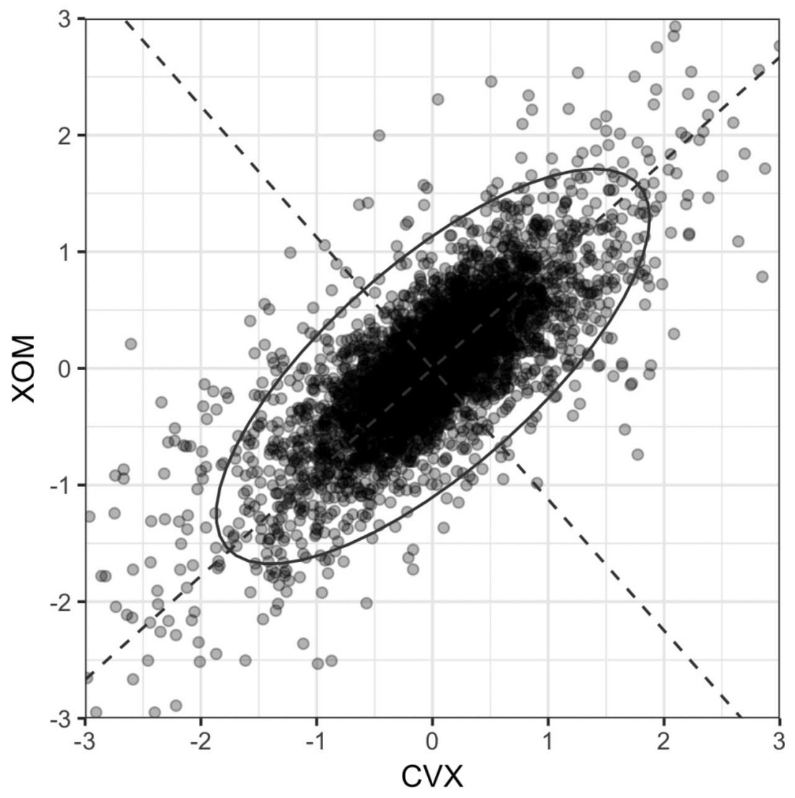

*Figure 7-1. The principal components for the stock returns for Chevron and ExxonMobil*

The solid dashed lines show the two principal components: the first one is along the long axis of the ellipse and the second one is along the short axis. You can see that a majority of the variability in the two stock returns is explained by the first principal component. This makes sense since energy stock prices tend to move as a group.

### <span id="page-437-0"></span>**NOTE**

The weights for the first principal component are both negative, but reversing the sign of all the weights does not change the principal component. For example, using weights of 0.747 and 0.665 for the first principal component is equivalent to the negative weights, just as an infinite line defined by the origin and 1,1 is the same as one defined by the origin and –1, –1.

### <span id="page-438-2"></span>**Computing the Principal Components**

<span id="page-438-1"></span>Going from two variables to more variables is straightforward. For the first component, simply include the additional predictor variables in the linear combination, assigning weights that optimize the collection of the covariation from all the predictor variables into this first principal component (*covariance* is the statistical term; see ["Covariance](#page-319-0) Matrix"). Calculation of principal components is a classic statistical method, relying on either the correlation matrix of the data or the covariance matrix, and it executes rapidly, not relying on iteration. As noted earlier, it works only with numeric variables, not categorical ones. The full process can be described as follows:

- <span id="page-438-0"></span>1. In creating the first principal component, PCA arrives at the linear combination of predictor variables that maximizes the percent of total variance explained.
- 2. This linear combination then becomes the first "new" predictor, *Z*<sup>1</sup> .
- 3. PCA repeats this process, using the same variables, with different weights to create a second new predictor, *Z*<sup>2</sup> . The weighting is done such that *Z*<sup>1</sup> and *Z*<sup>2</sup> are uncorrelated.
- 4. The process continues until you have as many new variables, or components, *Z*<sup>i</sup> as original variables *X*<sup>i</sup> .
- 5. Choose to retain as many components as are needed to account for most of the variance.
- 6. The result so far is a set of weights for each component. The final step is to convert the original data into new principal component scores by applying the weights to the original values. These new scores can then be used as the reduced set of predictor variables.

### <span id="page-439-0"></span>**Interpreting Principal Components**

<span id="page-439-2"></span><span id="page-439-1"></span>The nature of the principal components often reveals information about the structure of the data. There are a couple of standard visualization displays to help you glean insight about the principal components. One such method is a *Screeplot* to visualize the relative importance of principal components (the name derives from the resemblance of the plot to a scree slope). The following is an example for a few top companies in the S&P 500:

```
syms <- c( 'AAPL', 'MSFT', 'CSCO', 'INTC', 'CVX', 'XOM',
   'SLB', 'COP', 'JPM', 'WFC', 'USB', 'AXP', 'WMT', 'TGT', 'HD', 'COST')
top_sp <- sp500_px[row.names(sp500_px)>='2005-01-01', syms]
sp_pca <- princomp(top_sp)
screeplot(sp_pca)
```

As seen in [Figure](#page-439-0) 7-2, the variance of the first principal component is quite large (as is often the case), but the other top principal components are significant.

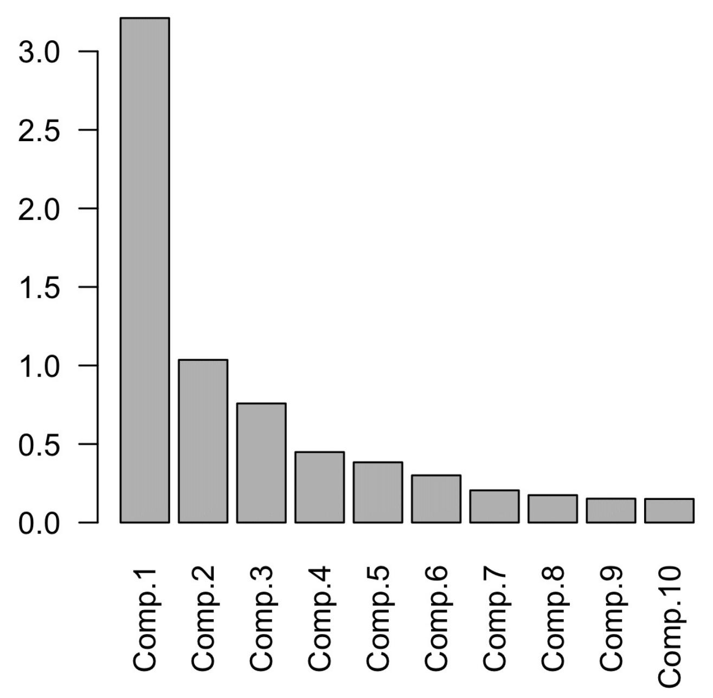

*Figure 7-2. A screeplot for a PCA of top stocks from the S&P 500*

It can be especially revealing to plot the weights of the top principal components. One way to do this is to use the gather function from the tidyr package in conjunction with ggplot:

```
library(tidyr)
loadings <- sp_pca$loadings[,1:5]
loadings$Symbol <- row.names(loadings)
loadings <- gather(loadings, "Component", "Weight", -Symbol)
ggplot(loadings, aes(x=Symbol, y=Weight)) +
  geom_bar(stat='identity') +
```

```
facet_grid(Component ~ ., scales='free_y')
```

<span id="page-441-1"></span>The loadings for the top five components are shown in [Figure](#page-441-0) 7-3. The loadings for the first principal component have the same sign: this is typical for data in which all the columns share a common factor (in this case, the overall stock market trend). The second component captures the price changes of energy stocks as compared to the other stocks. The third component is primarily a contrast in the movements of Apple and CostCo. The fourth component contrasts the movements of Schlumberger to the other energy stocks. Finally, the fifth component is mostly dominated by financial companies.

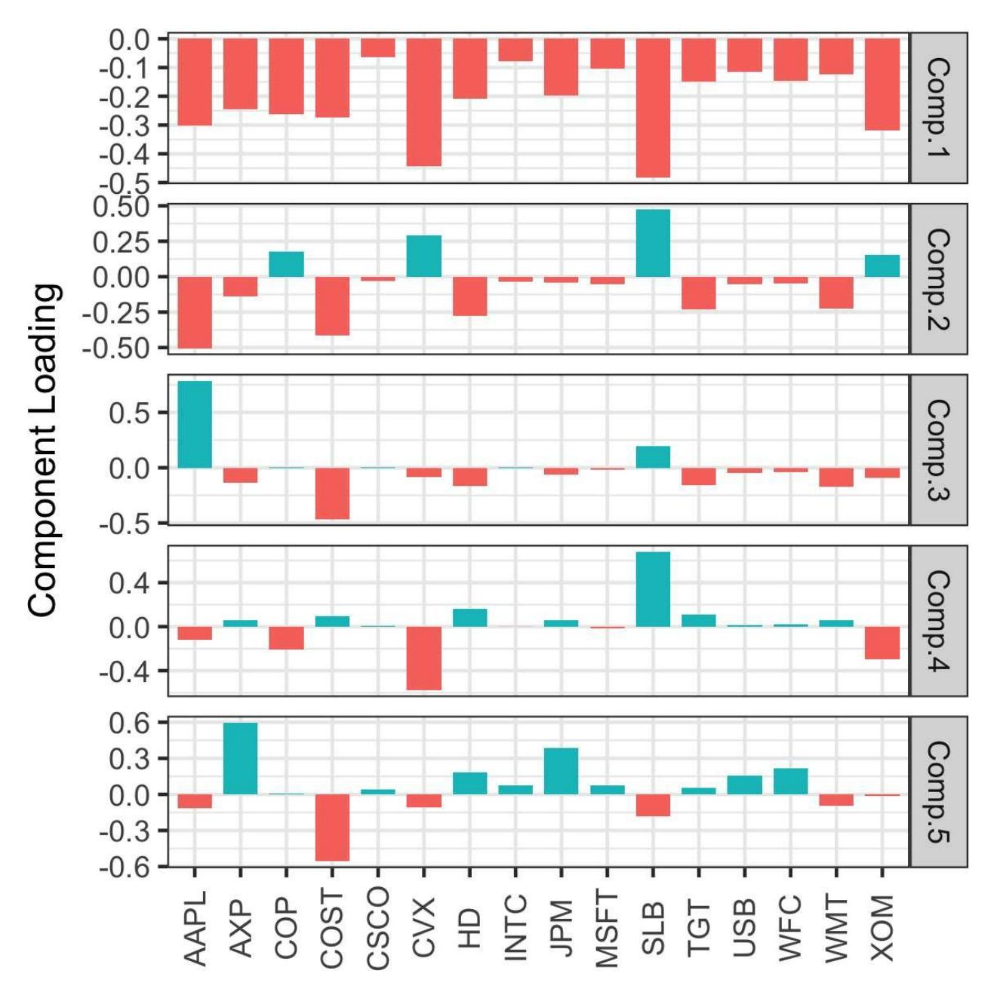

*Figure 7-3. The loadings for the top five principal components of stock price returns*

### **HOW MANY COMPONENTS TO CHOOSE?**

If your goal is to reduce the dimension of the data, you must decide how many principal components to select. The most common approach is to use an ad hoc rule to select the components that explain "most" of the variance. You can do this visually through the screeplot; for example, in [Figure](#page-439-0) 7-2, it would be natural to restrict the analysis to the top five components. Alternatively, you could select the top components such that the cumulative variance exceeds a threshold, such as 80%. Also, you can inspect the loadings to determine if the component has an intuitive interpretation. Cross-validation provides a more formal method to select the number of significant components (see ["Cross-Validation"](#page-252-0) for more).

#### <span id="page-443-0"></span>**KEY IDEAS FOR PRINCIPAL COMPONENTS**

- Principal components are linear combinations of the predictor variables (numeric data only).
- They are calculated so as to minimize correlation between components, reducing redundancy.
- A limited number of components will typically explain most of the variance in the outcome variable.
- The limited set of principal components can then be used in place of the (more numerous) original predictors, reducing dimensionality.

### <span id="page-444-1"></span>**Further Reading**

<span id="page-444-0"></span>For a detailed look at the use of cross-validation in principal components, see Rasmus Bro, K. Kjeldahl, A.K. Smilde, and Henk A. L. Kiers, ["Cross-Validation](http://bit.ly/2oW00Fl) of Component Models: A Critical Look at Current Methods", *Analytical and Bioanalytical Chemistry* 390, no. 5 (2008).

# <span id="page-445-0"></span>**K-Means Clustering**

<span id="page-445-2"></span>Clustering is a technique to divide data into different groups, where the records in each group are similar to one another. A goal of clustering is to identify significant and meaningful groups of data. The groups can be used directly, analyzed in more depth, or passed as a feature or an outcome to a predictive regression or classification model. *K-means* is the first clustering method to be developed; it is still widely used, owing its popularity to the relative simplicity of the algorithm and its ability to scale to large data sets.

<span id="page-445-3"></span>

| KEY<br>TERMS<br>FOR<br>K-MEANS<br>CLUSTERING                                             |
|------------------------------------------------------------------------------------------|
| Cluster                                                                                  |
| A<br>group<br>of<br>records<br>that<br>are<br>similar.                                   |
| Cluster<br>mean                                                                          |
| The<br>vector<br>of<br>variable<br>means<br>for<br>the<br>records<br>in<br>a<br>cluster. |
| K                                                                                        |
| The<br>number<br>of<br>clusters.                                                         |
|                                                                                          |

<span id="page-445-4"></span><span id="page-445-1"></span>*K*-means divides the data into *K* clusters by minimizing the sum of the squared distances of each record to the *mean* of its assigned cluster. The is referred to as the *within-cluster sum of squares* or *within-cluster SS*. *K*-means does not ensure the clusters will have the same size, but finds the clusters that are the best separated.

### <span id="page-446-0"></span>**NORMALIZATION**

It is typical to normalize (standardize) continuous variables by subtracting the mean and dividing by the standard deviation. Otherwise, variables with large scale will dominate the clustering process (see ["Standardization](#page-380-0) (Normalization, Z-Scores)").

### <span id="page-447-1"></span>**A Simple Example**

<span id="page-447-0"></span>Start by considering a data set with *n* records and just two variables, and . Suppose we want to split the data into clusters. This means assigning each record to a cluster *k*. Given an assignment of records to cluster *k*, the center of the cluster is the mean of the points in the cluster:

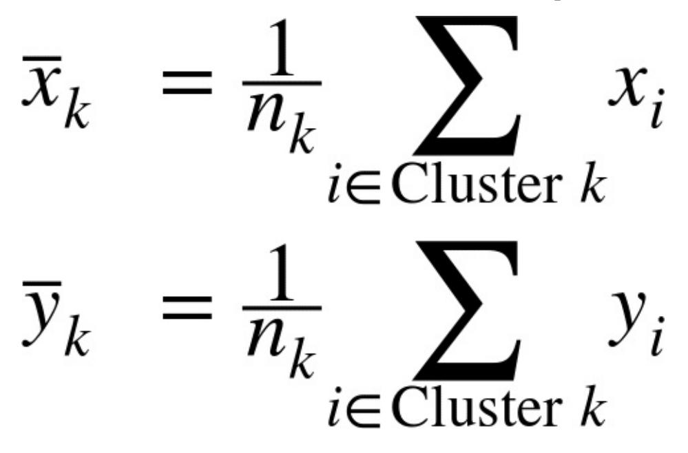

### <span id="page-448-0"></span>**CLUSTER MEAN**

In clustering records with multiple variables (the typical case), the term *cluster mean* refers not to a single number, but to the vector of means of the variables.

The sum of squares within a cluster is given by:

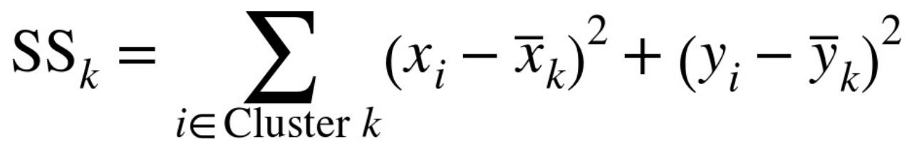

*K*-means finds the assignment of records that minimizes within-cluster sum of squares across all four clusters .

$$\sum_{k=1}^{4} SS_{i}$$

*K*-means clustering can be used to gain insight into how the price movements of stocks tend to cluster. Note that stock returns are reported in a fashion that is, in effect, standardized, so we do not need to normalize the data. In R, *K*-means clustering can be performed using the kmeans function. For example, the following finds four clusters based on two variables: the stock returns for ExxonMobil (XOM) and Chevron (CVX):

```
df <- sp500_px[row.names(sp500_px)>='2011-01-01', c('XOM', 'CVX')]
km <- kmeans(df, centers=4)
```

The cluster assignment for each record is returned as the cluster component:

```
> df$cluster <- factor(km$cluster)
> head(df)
               XOM CVX cluster
2011-01-03 0.73680496 0.2406809 2
```

| 2011-01-04 0.16866845 -0.5845157 |           | 1 |
|----------------------------------|-----------|---|
| 2011-01-05 0.02663055            | 0.4469854 | 2 |
| 2011-01-06 0.24855834 -0.9197513 |           | 1 |
| 2011-01-07 0.33732892            | 0.1805111 | 2 |
| 2011-01-10 0.00000000 -0.4641675 |           | 1 |

The first six records are assigned to either cluster 1 or cluster 2. The means of the clusters are also returned:

```
> centers <- data.frame(cluster=factor(1:4), km$centers)
> centers
 cluster XOM CVX
1 1 -0.3284864 -0.5669135
2 2 0.2410159 0.3342130
3 3 -1.1439800 -1.7502975
4 4 0.9568628 1.3708892
```

Clusters 1 and 3 represent "down" markets, while clusters 2 and 4 represent "up markets." In this example, with just two variables, it is straightforward to visualize the clusters and their means:

```
ggplot(data=df, aes(x=XOM, y=CVX, color=cluster, shape=cluster)) +
  geom_point(alpha=.3) +
  geom_point(data=centers, aes(x=XOM, y=CVX), size=3, stroke=2)
```

The resulting plot, given by [Figure](#page-450-0) 7-4, shows the cluster assignments and the cluster means.

<span id="page-450-0"></span>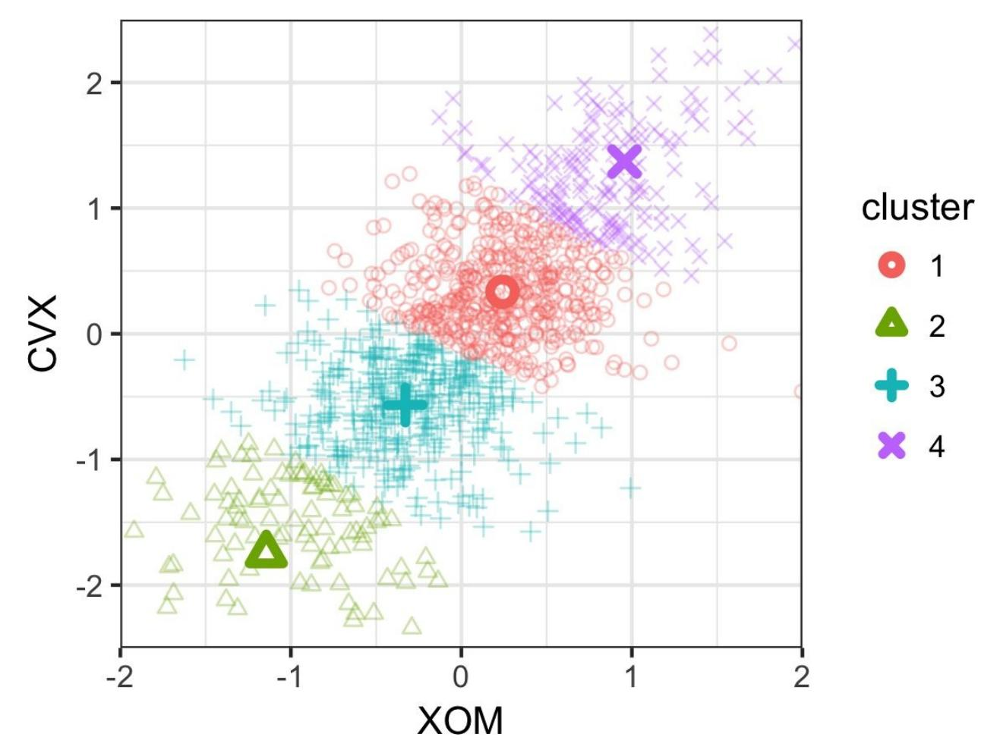

*Figure 7-4. The clusters of K-means applied to stock price data for ExxonMobil and Chevron (the two cluster centers in the dense area are hard to distinguish)*

### <span id="page-451-2"></span>**K-Means Algorithm**

In general, *K*-means can be applied to a data set with *p* variables . While the exact solution to *K*-means is computationally very difficult, heuristic algorithms provide an efficient way to compute a locally optimal solution.

The algorithm starts with a user-specified *K* and an initial set of cluster means, then iterates the following steps:

- <span id="page-451-1"></span><span id="page-451-0"></span>1. Assign each record to the nearest cluster mean as measured by squared distance.
- 2. Compute the new cluster means based on the assignment of records.

The algorithm converges when the assignment of records to clusters does not change.

For the first iteration, you need to specify an initial set of cluster means. Usually you do this by randomly assigning each record to one of the *K* clusters, then finding the means of those clusters.

Since this algorithm isn't guaranteed to find the best possible solution, it is recommended to run the algorithm several times using different random samples to initialize the algorithm. When more than one set of iterations is used, the *K*-means result is given by the iteration that has the lowest within-cluster sum of squares.

The nstart parameter to the R function kmeans allows you to specify the number of random starts to try. For example, the following code runs *K*-means to find 5 clusters using 10 different starting cluster means:

```
syms <- c( 'AAPL', 'MSFT', 'CSCO', 'INTC', 'CVX', 'XOM', 'SLB', 'COP',
           'JPM', 'WFC', 'USB', 'AXP', 'WMT', 'TGT', 'HD', 'COST')
df <- sp500_px[row.names(sp500_px)>='2011-01-01', syms]
km <- kmeans(df, centers=5, nstart=10)
```

The function automatically returns the best solution out of the 10 different starting points. You can use the argument iter.max to set the maximum number of iterations the algorithm is allowed for each random start.

### <span id="page-452-2"></span>**Interpreting the Clusters**

An important part of cluster analysis can involve the interpretation of the clusters. The two most important outputs from kmeans are the sizes of the clusters and the cluster means. For the example in the previous subsection, the sizes of resulting clusters are given by this R command:

<span id="page-452-1"></span>km\$size [1] 186 106 285 288 266

The cluster sizes are relatively balanced. Imbalanced clusters can result from distant outliers, or groups of records very distinct from the rest of the data — both may warrant further inspection.

You can plot the centers of the clusters using the gather function in conjunction with ggplot:

```
centers <- as.data.frame(t(centers))
names(centers) <- paste("Cluster", 1:5)
centers$Symbol <- row.names(centers)
centers <- gather(centers, "Cluster", "Mean", -Symbol)
centers$Color = centers$Mean > 0
ggplot(centers, aes(x=Symbol, y=Mean, fill=Color)) +
  geom_bar(stat='identity', position = "identity", width=.75) +
  facet_grid(Cluster ~ ., scales='free_y')
```

<span id="page-452-0"></span>The resulting plot is shown in [Figure](#page-453-0) 7-5 and reveals the nature of each cluster. For example, clusters 1 and 2 correspond to days on which the market is down and up, respectively. Clusters 3 and 5 are characterized by up-market days for consumer stocks and down-market days for energy stocks, respectively. Finally, cluster 4 captures the days in which energy stocks were up and consumer stocks were down.

<span id="page-453-0"></span>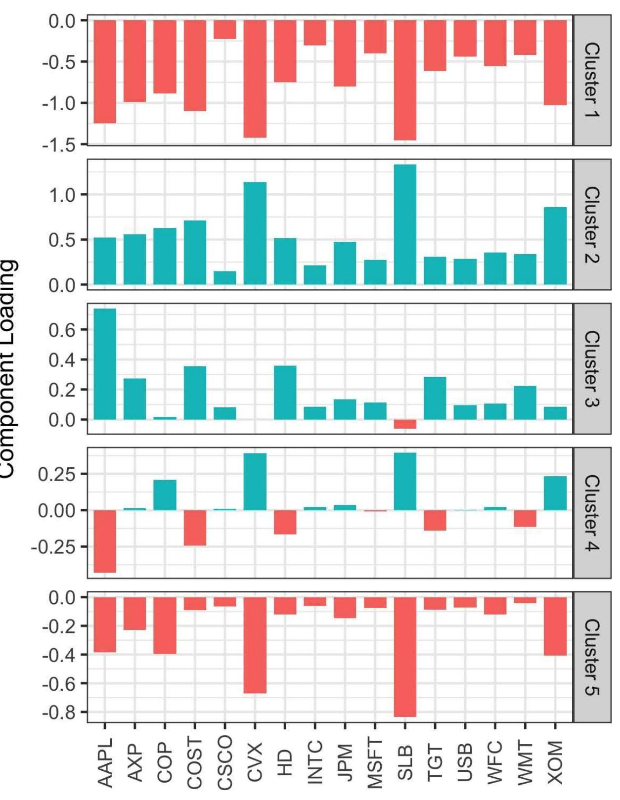

*Figure 7-5. The means of the variables in each cluster ("cluster means")*

### <span id="page-454-0"></span>**CLUSTER ANALYSIS VERSUS PCA**

The plot of cluster means is similar in spirit to looking at the loadings for principal component analysis (PCA); see "Interpreting Principal [Components"](#page-439-0). A major distinction is that unlike with PCA, the sign of the cluster means is meaningful. PCA identifies principal directions of variation, whereas cluster analysis finds groups of records located near one another.

### <span id="page-455-2"></span>**Selecting the Number of Clusters**

<span id="page-455-0"></span>The *K*-means algorithm requires that you specify the number of clusters *K*. Sometimes the number of clusters is driven by the application. For example, a company managing a sales force might want to cluster customers into "personas" to focus and guide sales calls. In such a case, managerial considerations would dictate the number of desired customer segments — for example, two might not yield useful differentiation of customers, while eight might be too many to manage.

In the absence of a cluster number dictated by practical or managerial considerations, a statistical approach could be used. There is no single standard method to find the "best" number of clusters.

<span id="page-455-1"></span>A common approach, called the *elbow method*, is to identify when the set of clusters explains "most" of the variance in the data. Adding new clusters beyond this set contributes relatively little incremental contribution in the variance explained. The elbow is the point where the cumulative variance explained flattens out after rising steeply, hence the name of the method.

[Figure](#page-456-0) 7-6 shows the cumulative percent of variance explained for the default data for the number of clusters ranging from 2 to 15. Where is the elbow in this example? There is no obvious candidate, since the incremental increase in variance explained drops gradually. This is fairly typical in data that does not have well-defined clusters. This is perhaps a drawback of the elbow method, but it does reveal the nature of the data.

<span id="page-456-0"></span>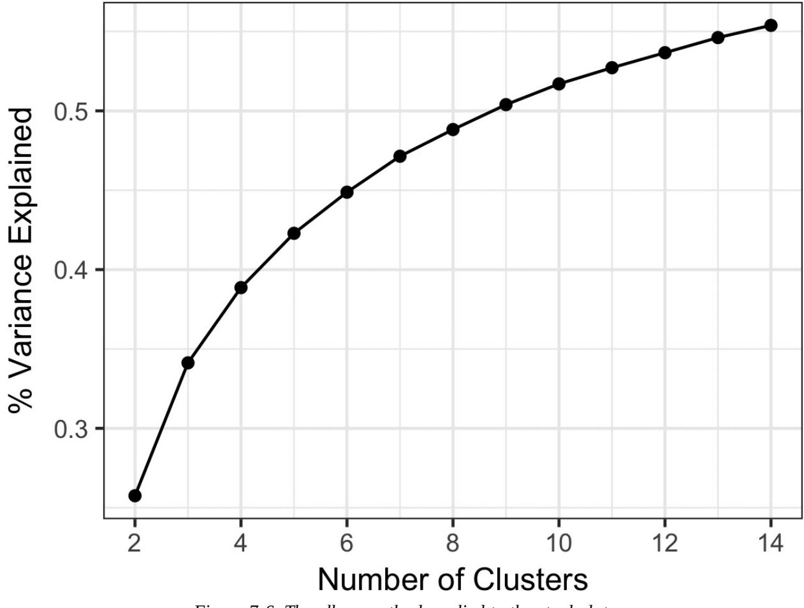

*Figure 7-6. The elbow method applied to the stock data*

In R, the kmeans function doesn't provide a single command for applying the elbow method, but it can be readily applied from the output of kmeans as shown here:

```
pct_var <- data.frame(pct_var = 0,
                      num_clusters=2:14)
totalss <- kmeans(df, centers=14, nstart=50, iter.max = 100)$totss
for(i in 2:14){
  pct_var[i-1, 'pct_var'] <- kmeans(df, centers=i, nstart=50, iter.max = 100)
    $betweenss/totalss
}
```

In evaluating how many clusters to retain, perhaps the most important test is this: how likely are the clusters to be replicated on new data? Are the clusters interpretable, and do they relate to a general characteristic of the data, or do they just reflect a specific instance? You can assess this, in part, using crossvalidation; see ["Cross-Validation".](#page-252-0)

In general, there is no single rule that will reliably guide how many clusters to produce.

### **NOTE**

There are several more formal ways to determine the number of clusters based on statistical or information theory. For example, Robert Tibshirani, Guenther Walther, and Trevor Hastie (*<http://www.stanford.edu/~hastie/Papers/gap.pdf>*) propose a "gap" statistic based on statistical theory to identify the elbow. For most applications, a theoretical approach is probably not necessary, or even appropriate.

### <span id="page-457-0"></span>**KEY IDEAS FOR K-MEANS CLUSTERING**

- The number of desired clusters, *K*, is chosen by the user.
- The algorithm develops clusters by iteratively assigning records to the nearest cluster mean until cluster assignments do not change.
- Practical considerations usually dominate the choice of *K*; there is no statistically determined optimal number of clusters.

### <span id="page-458-0"></span>**Hierarchical Clustering**

<span id="page-458-1"></span>*Hierarchical clustering* is an alternative to *K*-means that can yield very different clusters. Hierarchical clustering is more flexible than *K*-means and more easily accommodates non-numerical variables. It is more sensitive in discovering outlying or aberrant groups or records. Hierarchical clustering also lends itself to an intuitive graphical display, leading to easier interpretation of the clusters.

#### <span id="page-458-3"></span><span id="page-458-2"></span>**KEY TERMS FOR HIERARCHICAL CLUSTERING**

#### *Dendrogram*

A visual representation of the records and the hierarchy of clusters to which they belong.

#### *Distance*

A measure of how close one *record* is to another.

#### *Dissimilarity*

A measure of how close one *cluster* is to another.

Hierarchical clustering's flexibility comes with a cost, and hierarchical clustering does not scale well to large data sets with millions of records. For even modestsized data with just tens of thousands of records, hierarchical clustering can require intensive computing resources. Indeed, most of the applications of hierarchical clustering are focused on relatively small data sets.

### <span id="page-459-3"></span>**A Simple Example**

Hierarchical clustering works on a data set with *n* records and *p* variables and is based on two basic building blocks:

- <span id="page-459-2"></span><span id="page-459-0"></span>A distance metric to measure the distance beween two records *i* and *j*.
- <span id="page-459-1"></span>A dissimilarity metric to measure the difference between two clusters *A* and *B* based on the distances between the members of each cluster.

For applications involving numeric data, the most importance choice is the dissimilarity metric. Hierarchical clustering starts by setting each record as its own cluster and iterates to combine the least dissimilar clusters.

In R, the hclust function can be used to perform hierarchical clustering. One big difference with hclust versus kmeans is that it operates on the pairwise

distances rather than the data itself. You can compute these using the dist function. For example, the following applies hierarchical clustering to the stock returns for a set of companies:

```
syms1 <- c('GOOGL', 'AMZN', 'AAPL', 'MSFT', 'CSCO', 'INTC', 'CVX',
           'XOM', 'SLB', 'COP', 'JPM', 'WFC', 'USB', 'AXP',
           'WMT', 'TGT', 'HD', 'COST')
# take transpose: to cluster companies, we need the stocks along the rows
df <- t(sp500_px[row.names(sp500_px)>='2011-01-01', syms1])
d <- dist(df)
hcl <- hclust(d)
```

Clustering algorithms will cluster the records (rows) of a data frame. Since we want to cluster the companies, we need to *transpose* the data frame and put the stocks along the rows and the dates along the columns.

### <span id="page-460-0"></span>**The Dendrogram**

<span id="page-460-1"></span>Hierarchical clustering lends itself to a natural graphical display as a tree, referred to as a *dendrogram*. The name comes from the Greek words *dendro* (tree) and *gramma* (drawing). In R, you can easily produce this using the plot command:

plot(hcl)

The result is shown in [Figure](#page-460-0) 7-7. The leaves of the tree correspond to the records. The length of the branch in the tree indicates the degree of dissimilarity between corresponding clusters. The returns for Google and Amazon are quite dissimilar to the returns for the other stocks. The other stocks fall into natural groups: energy stocks, financial stocks, and consumer stocks are all separated into their own subtrees.

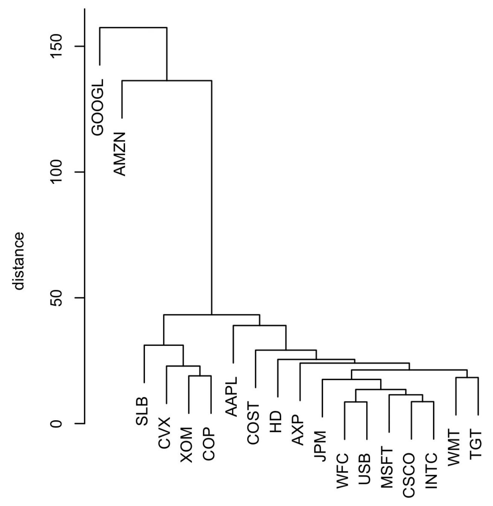

*Figure 7-7. A dendogram of stocks*

In contrast to *K*-means, it is not necessary to prespecify the number of clusters. To extract a specific number of clusters, you can use the cutree function:

| cutree(hcl, k=4) |      |      |      |      |      |     |     |     |     |     |     |
|------------------|------|------|------|------|------|-----|-----|-----|-----|-----|-----|
| GOOGL            | AMZN | AAPL | MSFT | CSCO | INTC | CVX | XOM | SLB | COP | JPM | WFC |
| 1                | 2    | 3    | 3    | 3    | 3    | 4   | 4   | 4   | 4   | 3   | 3   |
| USB              | AXP  | WMT  | TGT  | HD   | COST |     |     |     |     |     |     |
| 3                | 3    | 3    | 3    | 3    | 3    |     |     |     |     |     |     |

The number of clusters to extract is set to 4, and you can see that Google and Amazon each belong to their own cluster. The oil stocks (XOM, CVS, SLB, COP) all belong to another cluster. The remaining stocks are in the fourth cluster.

### <span id="page-463-4"></span>**The Agglomerative Algorithm**

<span id="page-463-0"></span>The main algorithm for hierarchical clustering is the *agglomerative* algorithm, which iteratively merges similar clusters. The agglomerative algorithm begins with each record constituting its own single-record cluster, then builds up larger and larger clusters. The first step is to calculate distances between all pairs of records.

<span id="page-463-3"></span><span id="page-463-1"></span>For each pair of records and , we measure the distance between the two records, , using a distance metric (see "Distance [Metrics"\).](#page-377-0) For example, we can use Euclidian distance:

$$d(x, y) = \sqrt{(x_1 - y_1)^2 + (x_2 - y_2)^2 + \cdots + (x_p - y_p)^2}$$

We now turn to inter-cluster distance. Consider two clusters *A* and *B*, each with a distinctive set of records, and . We can measure the dissimilarity between the clusters by using the distances between the members of *A* and the members of *B*.

<span id="page-463-2"></span>One measure of dissimilarity is the *complete-linkage* method, which is the maximum distance across all pairs of records between *A* and *B*:

This defines the dissimilarity as the biggest difference between all pairs.

The main steps of the agglomerative algorithm are:

- 1. Create an initial set of clusters with each cluster consisting of a single record for all records in the data.
- 2. Compute the dissimilarity ) between all pairs of clusters .
- 3. Merge the two clusters and that are least dissimilar as measured by ).

4. If we have more than one cluster remaining, return to step 2. Otherwise, we are done.

### <span id="page-465-0"></span>**Measures of Dissimilarity**

<span id="page-465-4"></span><span id="page-465-2"></span><span id="page-465-1"></span>There are four common measures of dissimilarity: *complete linkage*, *single linkage*, *average linkage*, and *minimum variance*. These (plus other measures) are all supported by most hierarchical clustering software, including hclust. The complete linkage method defined earlier tends to produce clusters with members that are similar. The single linkage method is the minimum distance between the records in two clusters:

<span id="page-465-3"></span>This is a "greedy" method and produces clusters that can contain quite disparate elements. The average linkage method is the average of all distance pairs and represents a compromise between the single and complete linkage methods. Finally, the minimum variance method, also referred to as *Ward's* method, is similar to *K*-means since it minimizes the [within-cluster](#page-445-0) sum of squares (see "K-Means Clustering").

<span id="page-465-5"></span>[Figure](#page-465-0) 7-8 applies hierarchical clustering using the four measures to the ExxonMobil and Chevron stock returns. For each measure, four clusters are retained.

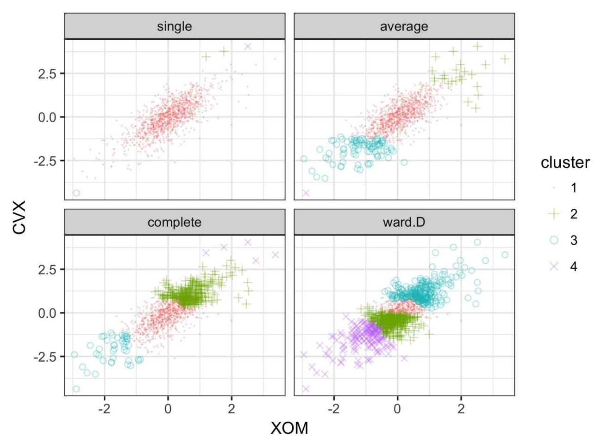

*Figure 7-8. A comparison of measures of dissimilarity applied to stock data*

The results are strikingly different: the single linkage measure assigns almost all of the points to a single cluster. Except for the minimum variance method (Ward.D), all measures end up with at least one cluster with just a few outlying points. The minimum variance method is most similar to the *K*-means cluster; compare with [Figure](#page-450-0) 7-4.

#### **KEY IDEAS FOR HIERARCHICAL CLUSTERING**

- Start with every record in its own cluster.
- Progressively, clusters are joined to nearby clusters until all records belong to a single cluster (the agglomerative algorithm).
- The agglomeration history is retained and plotted, and the user (without specifying the number of clusters beforehand) can visualize the number and structure of clusters at different stages.
- <span id="page-466-0"></span>Inter-cluster distances are computed in different ways, all relying on the set of all inter-record distances.

# <span id="page-468-1"></span>**Model-Based Clustering**

<span id="page-468-0"></span>Clustering methods such as hierarchical clustering and *K*-means are based on heuristics and rely primarily on finding clusters whose members are close to one another, as measured directly with the data (no probability model involved). In the past 20 years, significant effort has been devoted to developing *model-based clustering* methods. Adrian Raftery and other researchers at the University of Washington made critical contributions to model-based clustering, including both theory and software. The techniques are grounded in statistical theory and provide more rigorous ways to determine the nature and number of clusters. They could be used, for example, in cases where there might be one group of records that are similar to one another but not necessarily close to one another (e.g., tech stocks with high variance of returns), and another group of records that is similar, and also close (e.g., utility stocks with low variance).

### <span id="page-469-2"></span>**Multivariate Normal Distribution**

<span id="page-469-1"></span><span id="page-469-0"></span>The most widely used model-based clustering methods rest on the *multivariate normal* distribution. The multivariate normal distribution is a generalization of the normal distribution to set of *p* variables . The distribution is defined by a set of means and a covariance matrix . The covariance matrix is a measure of how the variables correlate with each other (see ["Covariance](#page-319-0) Matrix" for details on the covariance). The covariance matrix consists of *p* variances and covariances for all pairs of variables . With the variables put along the rows and duplicated along the columns, the matrix looks like this:

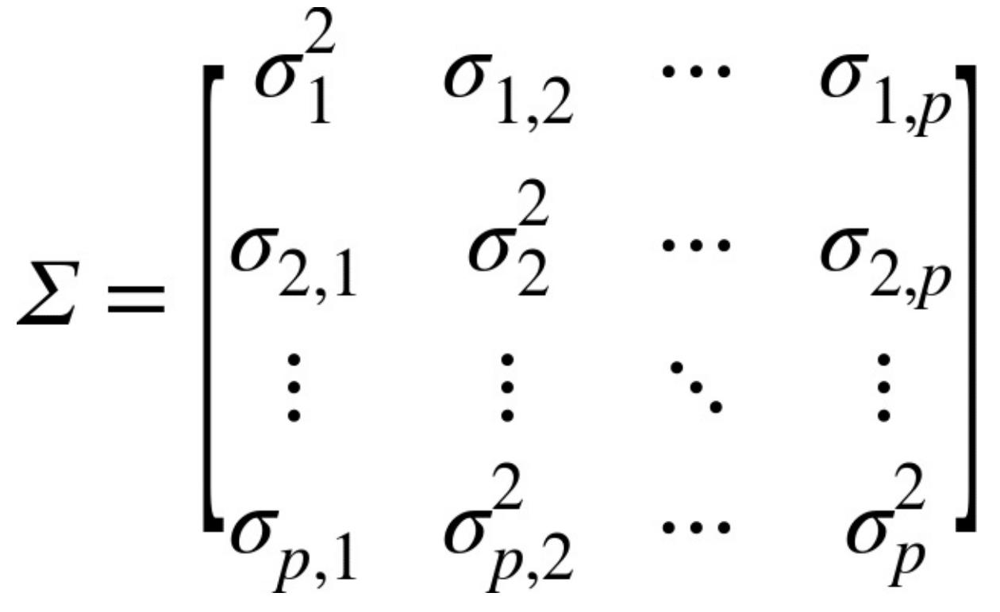

Since a covariance matrix is symmetric, and , there are only covariance terms. In total, the covariance matrix has parameters. The distribution is denoted by:

<span id="page-470-0"></span>
$$(X_1, X_2, ..., X_p)\widetilde{N}_p(\mu, \Sigma)$$

This is a symbolic way of saying that the variables are all normally distributed, and the overall distribution is fully described by the vector of variable means and the covariance matrix.

[Figure](#page-470-0) 7-9 shows the probability contours for a multivariate normal distribution for two variables *X* and *Y* (the 0.5 probability contour, for example, contains 50% of the distribution).

The means are and and the covariance matrix is:

Since the covariance is positive, *X* and *Y* are positively correlated.

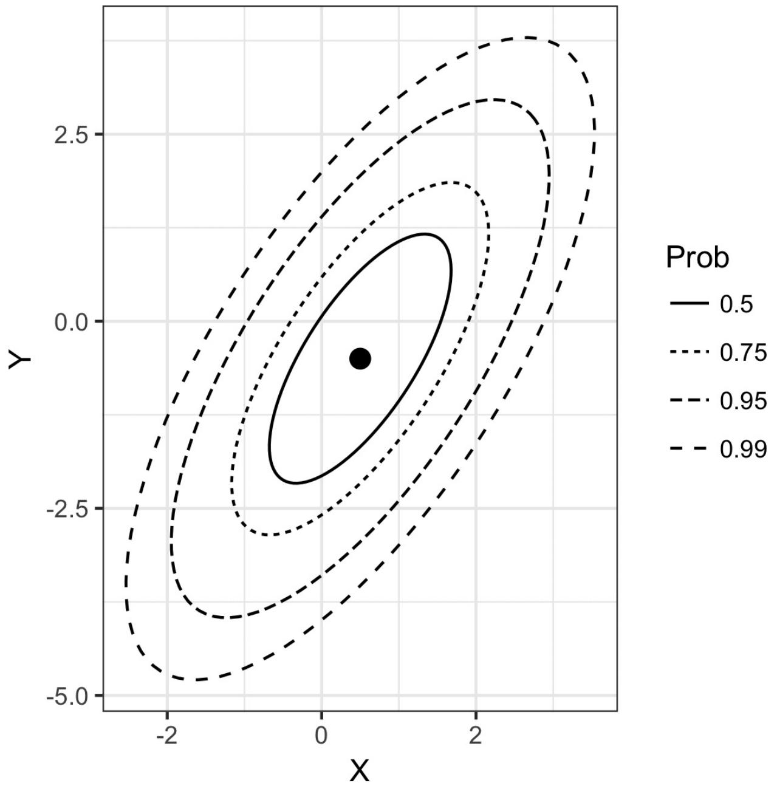

*Figure 7-9. Probability contours for a two-dimensional normal distribution*

### <span id="page-472-1"></span>**Mixtures of Normals**

<span id="page-472-0"></span>The key idea behind model-based clustering is that each record is assumed to be distributed as one of *K* multivariate-normal distributions, where *K* is the number of clusters. Each distribution has a different mean and covariance matrix . For example, if you have two variables, *X* and *Y*, then each row is modeled as having been sampled from one of *K* distributions .

R has a very rich package for model-based clustering called mclust, originally developed by Chris Fraley and Adrian Raftery. With this package, we can apply model-based clustering to the stock return data we previously analyzed using *K*means and hierarchical clustering:

```
> library(mclust)
> df <- sp500_px[row.names(sp500_px)>='2011-01-01', c('XOM', 'CVX')]
> mcl <- Mclust(df)
> summary(mcl)
Mclust VEE (ellipsoidal, equal shape and orientation) model with 2 components:
log.likelihood n df BIC ICL
     -2255.134 1131 9 -4573.546 -5076.856
Clustering table:
 1 2
963 168
```

If you execute this code, you will notice that the computation takes significiantly longer than other procedures. Extracting the cluster assignments using the predict function, we can visualize the clusters:

```
cluster <- factor(predict(mcl)$classification)
ggplot(data=df, aes(x=XOM, y=CVX, color=cluster, shape=cluster)) +
  geom_point(alpha=.8)
```

The resulting plot is shown in [Figure](#page-473-0) 7-10. There are two clusters: one cluster in the middle of the data, and a second cluster in the outer edge of the data. This is very different from the clusters obtained using *K*-means ([Figure](#page-450-0) 7-4) and hierarchical clustering ([Figure](#page-465-0) 7-8), which find clusters that are compact.

<span id="page-473-0"></span>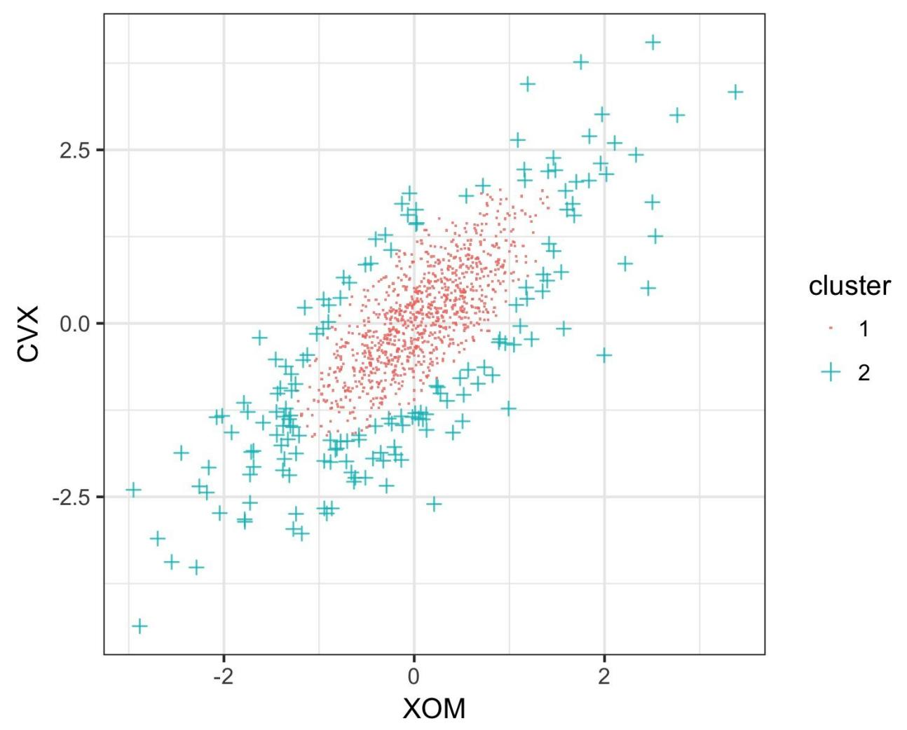

*Figure 7-10. Two clusters are obtained for stock return data using mclust*

You can extract the parameters to the normal distributions using the summary function:

```
> summary(mcl, parameters=TRUE)$mean
         [,1] [,2]
XOM 0.05783847 -0.04374944
CVX 0.07363239 -0.21175715
> summary(mcl, parameters=TRUE)$variance
, , 1
         XOM CVX
XOM 0.3002049 0.3060989
CVX 0.3060989 0.5496727
, , 2
        XOM CVX
XOM 1.046318 1.066860
CVX 1.066860 1.915799
```

The distributions have similar means and correlations, but the second distribution has much larger variances and covariances.

The clusters from mclust may seem surprising, but in fact, they illustrate the statistical nature of the method. The goal of model-based clustering is to find the best-fitting set of multivariate normal distributions. The stock data appears to have a normal-looking shape: see the contours of [Figure](#page-470-0) 7-9. In fact, though, stock returns have a longer-tailed distribution than a normal distribution. To handle this, mclust fits a distribution to the bulk of the data, but then fits a second distribution with a bigger variance.

### <span id="page-475-0"></span>**Selecting the Number of Clusters**

<span id="page-475-3"></span><span id="page-475-2"></span><span id="page-475-1"></span>Unlike *K*-means and hierarchical clustering, mclust automatically selects the number of clusters (in this case, two). It does this by choosing the number of clusters for which the *Bayesian Information Criteria* (*BIC*) has the largest value. BIC (similar to AIC) is a general tool to find the best model amongst a candidate set of models. For example, AIC (or BIC) is commonly used to select a model in stepwise regression; see "Model Selection and Stepwise [Regression".](#page-253-0) BIC works by selecting the best-fitting model with a penalty for the number of parameters in the model. In the case of model-based clustering, adding more clusters will always improve the fit at the expense of introducing additional parameters in the model.

You can plot the BIC value for each cluster size using a function in hclust:

```
plot(mcl, what='BIC', ask=FALSE)
```

The number of clusters — or number of different multivariate normal models (components) — is shown on the x-axis (see [Figure](#page-475-0) 7-11).

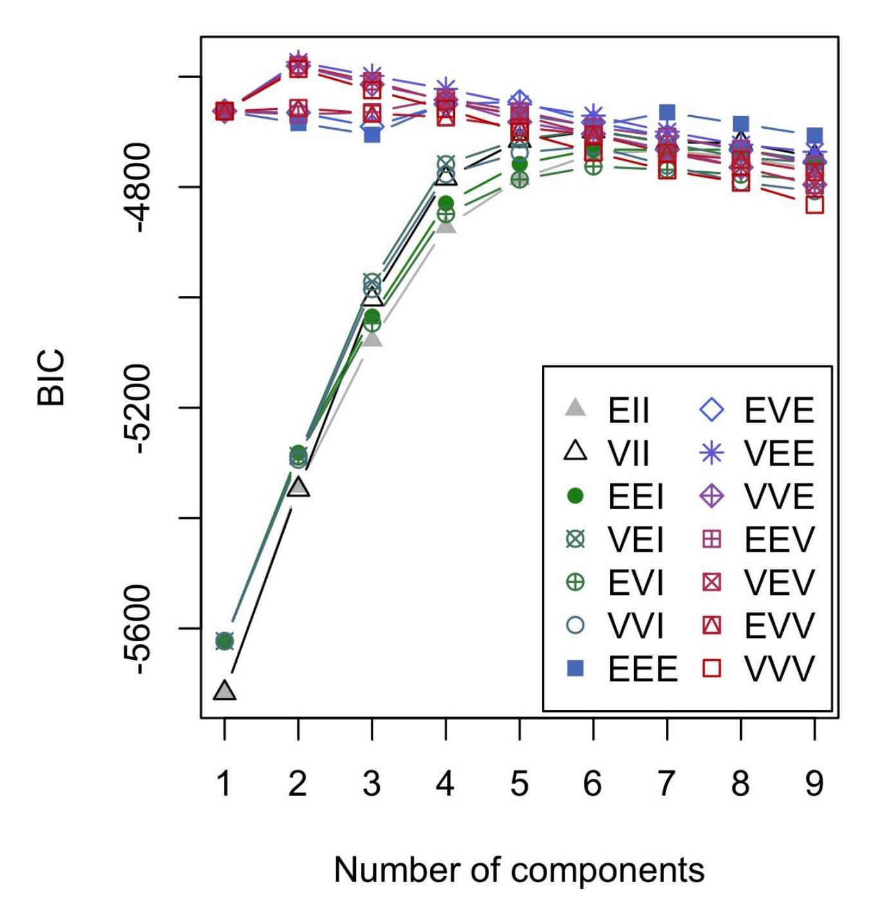

*Figure 7-11. BIC scores for the stock return data for different numbers of clusters (components)*

This plot is similar to the elbow plot used to identify the number of clusters to choose for *K*-means, except the value being plotted is BIC instead of percent of variance explained (see [Figure](#page-456-0) 7-6). One big difference is that instead of one line, mclust shows 14 different lines! This is because mclust is actually fitting 14 different models for each cluster size, and ultimately it chooses the best-fitting

model.

Why does mclust fit so many models to determine the best set of multivariate normals? It's because there are different ways to parameterize the covariance matrix for fitting a model. For the most part, you do not need to worry about the details of the models and can simply use the model chosen by mclust. In this example, according to BIC, three different models (called VEE, VEV, and VVE) give the best fit using two components.

### <span id="page-477-0"></span>**NOTE**

Model-based clustering is a rich and rapidly developing area of study, and the coverage in this text only spans a small part of the field. Indeed, the mclust help file is currently 154 pages long. Navigating the nuances of model-based clustering is probably more effort than is needed for most problems encountered by data scientists.

Model-based clustering techniques do have some limitations. The methods require an underlying assumption of a model for the data, and the cluster results are very dependent on that assumption. The computations requirements are higher than even hierarchical clustering, making it difficult to scale to large data. Finally, the algorithm is more sophisticated and less accessible than that of other methods.

### **KEY IDEAS FOR MODEL-BASED CLUSTERING**

- Clusters are assumed to derive from different data-generating processes with different probability distributions.
- Different models are fit, assuming different numbers of (typically normal) distributions.
- The method chooses the model (and the associated number of clusters) that fits the data well without using too many parameters (i.e., overfitting).

# <span id="page-478-1"></span>**Further Reading**

<span id="page-478-0"></span>For more detail on model-based clustering, see the mclust [documentation](http://www.stat.washington.edu/research/reports/2012/tr597.pdf).

# <span id="page-479-2"></span>**Scaling and Categorical Variables**

<span id="page-479-0"></span>Unsupervised learning techniques generally require that the data be appropriately scaled. This is different from many of the techniques for regression and classification in which scaling is not important (an exception is *K*-nearest neighbors; see "K-Nearest [Neighbors"\)](#page-373-0).

### **KEY TERMS FOR SCALING DATA**

#### *Scaling*

Squashing or expanding data, usually to bring multiple variables to the same scale.

### *Normalization*

One method of scaling — subtracting the mean and dividing by the standard deviation.

*Synonym*

<span id="page-479-1"></span>Standardization

### *Gower's distance*

A scaling algorithm applied to mixed numeric and categoprical data to bring all variables to a 0–1 range.

For example, with the personal loan data, the variables have widely different units and magnitude. Some variables have relatively small values (e.g., number of years employed), while others have very large values (e.g., loan amount in dollars). If the data is not scaled, then the PCA, *K*-means, and other clustering methods will be dominated by the variables with large values and ignore the variables with small values.

Categorical data can pose a special problem for some clustering procedures. As with *K*-nearest neighbors, unordered factor variables are generally converted to a set of binary (0/1) variables using one hot encoding (see "One Hot [Encoder"\)](#page-379-0). Not only are the binary variables likely on a different scale from other data, the fact that binary variables have only two values can prove problematic with techniques such as PCA and *K*-means.

### <span id="page-480-0"></span>**Scaling the Variables**

Variables with very different scale and units need to be normalized appropriately before you apply a clustering procedure. For example, let's apply kmeans to a set of data of loan defaults without normalizing:

```
df <- defaults[, c('loan_amnt', 'annual_inc', 'revol_bal', 'open_acc',
                 'dti', 'revol_util')]
km <- kmeans(df, centers=4, nstart=10)
centers <- data.frame( size=km$size, km$centers)
round(centers, digits=2)
 size loan_amnt annual_inc revol_bal open_acc dti revol_util
1 55 23157.27 491522.49 83471.07 13.35 6.89 58.74
2 1218 21900.96 165748.53 38299.44 12.58 13.43 63.58
3 7686 18311.55 83504.68 19685.28 11.68 16.80 62.18
4 14177 10610.43 42539.36 10277.97 9.60 17.73 58.05
```

The variables annual\_inc and revol\_bal dominate the clusters, and the clusters have very different sizes. Cluster 1 has only 55 members with comparatively high income and revolving credit balance.

A common approach to scaling the variables is to convert them to *z*-scores by subtracting the mean and dividing by the standard deviation. This is termed standardization or normalization (see ["Standardization](#page-380-0) (Normalization, Z-Scores)" for more discussion about using *z*-scores):

$$z = \frac{x - \overline{x}}{s}$$

See what happens to the clusters when kmeans is applied to the normalized data:

```
df0 <- scale(df)
km0 <- kmeans(df0, centers=4, nstart=10)
centers0 <-scale(km0$centers, center=FALSE,
               scale=1/attr(df0, 'scaled:scale'))
centers0 <- scale(centers0, center=-attr(df0, 'scaled:center'), scale=F)
data.frame(size=km0$size, centers0)
 size loan_amnt annual_inc revol_bal open_acc dti revol_util
1 5429 10393.60 53689.54 6077.77 8.69 11.35 30.69
2 6396 13310.43 55522.76 16310.95 14.25 24.27 59.57
3 7493 10482.19 51216.95 11530.17 7.48 15.79 77.68
4 3818 25933.01 116144.63 32617.81 12.44 16.25 66.01
```

The cluster sizes are more balanced, and the clusters are not just dominated by

annual\_inc and revol\_bal, revealing more interesting structure in the data. Note that the centers are rescaled to the original units in the preceding code. If we had left them unscaled, the resulting values would be in terms of *z*-scores, and therefore less interpretable.

### <span id="page-481-0"></span>**NOTE**

Scaling is also important for PCA. Using the *z*-scores is equivalent to using the correlation matrix (see ["Correlation"](#page-67-0)) instead of the covariance matrix in computing the principal components. Software to compute PCA usually has an option to use the correlation matrix (in R, the princomp function has the argument cor).

### <span id="page-482-2"></span>**Dominant Variables**

Even in cases where the variables are measured on the same scale and accurately reflect relative importance (e.g., movement to stock prices), it can sometimes be useful to rescale the variables.

<span id="page-482-0"></span>Suppose we add Alphabet (GOOGL) and Amazon (AMZN) to the analysis in "Interpreting Principal [Components"](#page-439-0).

```
syms <- c('AMZN', 'GOOGL' 'AAPL', 'MSFT', 'CSCO', 'INTC', 'CVX', 'XOM',
   'SLB', 'COP', 'JPM', 'WFC', 'USB', 'AXP', 'WMT', 'TGT', 'HD', 'COST')
top_sp1 <- sp500_px[row.names(sp500_px)>='2005-01-01', syms]
sp_pca1 <- princomp(top_sp1)
screeplot(sp_pca1)
```

The screeplot displays the variances for the top principal components. In this case, the screeplot in [Figure](#page-483-0) 7-12 reveals that the variances of the first and second components are much larger than the others. This often indicates that one or two variables dominate the loadings. This is, indeed, the case in this example:

```
round(sp_pca1$loadings[,1:2], 3)
     Comp.1 Comp.2
GOOGL 0.781 0.609
AMZN 0.593 -0.792
AAPL 0.078 0.004
MSFT 0.029 0.002
CSCO 0.017 -0.001
INTC 0.020 -0.001
CVX 0.068 -0.021
XOM 0.053 -0.005
...
```

The first two principal components are almost completely dominated by GOOGL and AMZN. This is because the stock price movements of GOOGLand AMZN dominate the variability.

To handle this situation, you can either include them as is, rescale the variables (see "Scaling the [Variables"\)](#page-480-0), or exclude the dominant variables from the analysis and handle them separately. There is no "correct" approach, and the treatment depends on the application.

<span id="page-483-0"></span>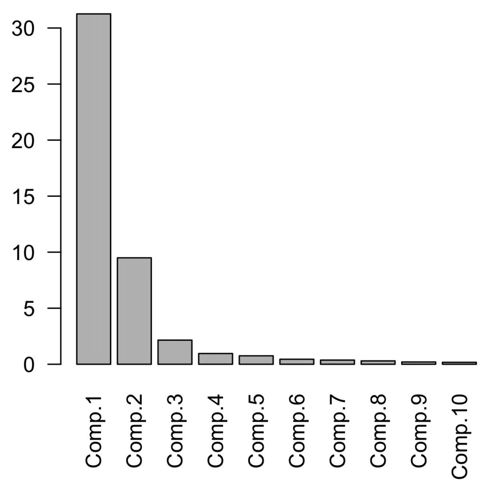

*Figure 7-12. A screeplot for a PCA of top stocks from the S&P 500 including GOOGL and AMZN*

### <span id="page-484-3"></span>**Categorical Data and Gower's Distance**

<span id="page-484-0"></span>In the case of categorical data, you must convert it to numeric data, either by ranking (for an ordered factor) or by encoding as a set of binary (dummy) variables. If the data consists of mixed continuous and binary variables, you will usually want to scale the variables so that the ranges are similar; see "Scaling the [Variables".](#page-480-0) One popular method is to use *Gower's distance*.

The basic idea behind Gower's distance is to apply a different distance metric to each variable depending on the type of data:

- <span id="page-484-2"></span><span id="page-484-1"></span>For numeric variables and ordered factors, distance is calculated as the absolute value of the difference between two records (*Manhattan distance*).
- For categorical variables, the distance is 1 if the categories between two records are different and the distance is 0 if the categories are the same.

Gower's distance is computed as follows:

- 1. Compute the distance for all pairs of variables *i* and *j* for each record.
- 2. Scale each pair so the minimum is 0 and the maximum is 1.
- 3. Add the pairwise scaled distances between variables together, either using a simple or weighted mean, to create the distance matrix.

To illustrate Gower's distance, take a few rows from the loan data:

```
> x = defaults[1:5, c('dti', 'payment_inc_ratio', 'home', 'purpose')]
> x
# A tibble: 5 × 4
  dti payment_inc_ratio home purpose
 <dbl> <dbl> <fctr> <fctr>
1 1.00 2.39320 RENT car
2 5.55 4.57170 OWN small_business
3 18.08 9.71600 RENT other
4 10.08 12.21520 RENT debt_consolidation
5 7.06 3.90888 RENT other
```

The function daisy in the cluster package can be used to compute Gower's distance:

```
> library(cluster)
> daisy(x, metric='gower')
Dissimilarities :
         1 2 3 4
2 0.6220479
3 0.6863877 0.8143398
4 0.6329040 0.7608561 0.4307083
5 0.3772789 0.5389727 0.3091088 0.5056250
```

All distances are between 0 and 1. The pair of records with the biggest distance is 2 and 3: neither has the same values for home or purpose and they have very different levels of dti (debt-to-income) and payment\_inc\_ratio. Records 3 and 5 have the smallest distance because they share the same values for home or purpose.

<span id="page-485-0"></span>You can apply hierarchical clustering (see ["Hierarchical](#page-458-0) Clustering") to the resulting distance matrix using hclust to the output from daisy:

```
df <- defaults[sample(nrow(defaults), 250),
               c('dti', 'payment_inc_ratio', 'home', 'purpose')]
d = daisy(df, metric='gower')
hcl <- hclust(d)
dnd <- as.dendrogram(hcl)
plot(dnd, leaflab='none')
```

<span id="page-485-1"></span>The resulting dendrogram is shown in [Figure](#page-486-0) 7-13. The individual records are not distinguishable on the x-axis, but we can examine the records in one of the subtrees (on the left, using a "cut" of 0.5), with this code:

```
> df[labels(dnd_cut$lower[[1]]),]
# A tibble: 9 × 4
  dti payment_inc_ratio home purpose
 <dbl> <dbl> <fctr> <fctr>
1 24.57 0.83550 RENT other
2 34.95 5.02763 RENT other
3 1.51 2.97784 RENT other
4 8.73 14.42070 RENT other
5 12.05 9.96750 RENT other
6 10.15 11.43180 RENT other
7 19.61 14.04420 RENT other
8 20.92 6.90123 RENT other
9 22.49 9.36000 RENT other
```

This subtree entirely consists of renters with a loan purpose labeled as "other." While strict separation is not true of all subtrees, this illustrates that the categorical variables tend to be grouped together in the clusters.

<span id="page-486-0"></span>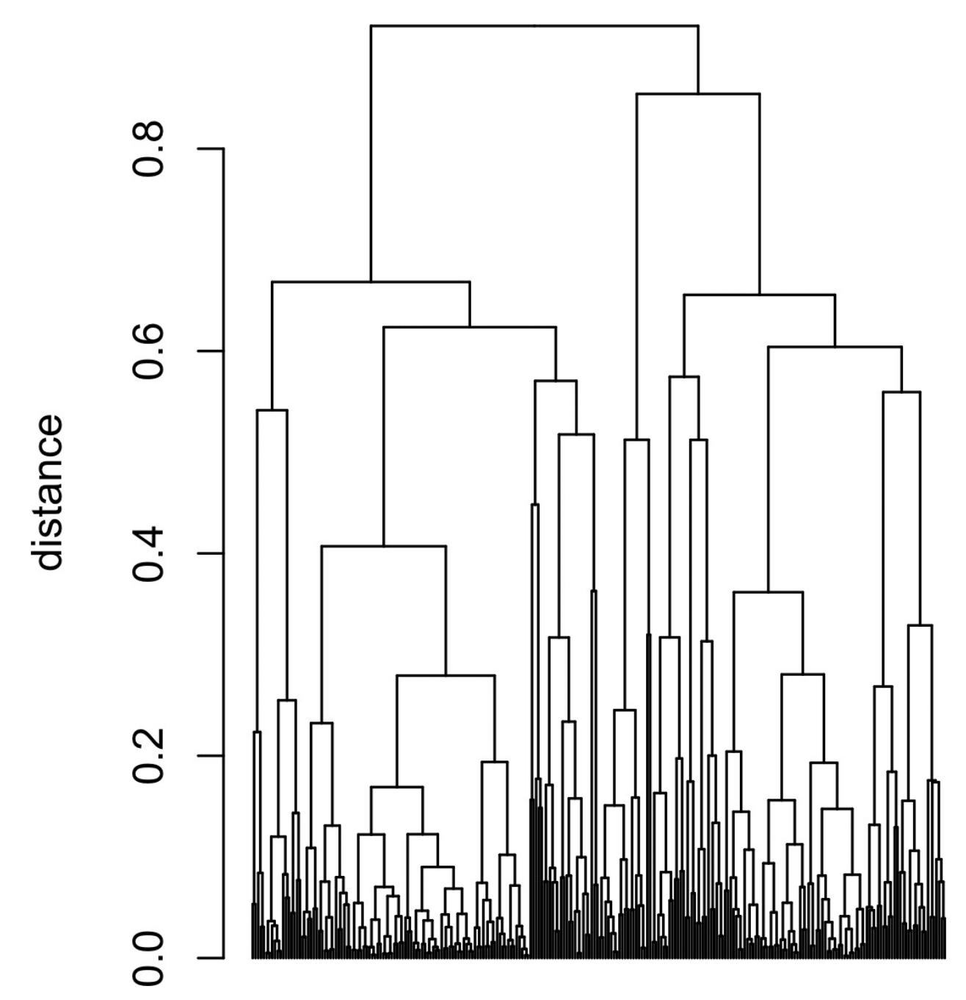

*Figure 7-13. A dendrogram of hclust applied to a sample of loan default data with mixed variable types*

### <span id="page-487-1"></span>**Problems with Clustering Mixed Data**

<span id="page-487-0"></span>*K*-means and PCA are most appropriate for continuous variables. For smaller data sets, it is better to use hierarchical clustering with Gower's distance. In principle, there is no reason why *K*-means can't be applied to binary or categorical data. You would usually use the "one hot encoder" [representation](#page-379-0) (see "One Hot Encoder") to convert the categorical data to numeric values. In practice, however, using *K*-means and PCA with binary data can be difficult.

If the standard *z*-scores are used, the binary variables will dominate the definition of the clusters. This is because 0/1 variables take on only two values and *K*-means can obtain a small within-cluster sum-of-squares by assigning all the records with a 0 or 1 to a single cluster. For example, apply kmeans to loan default data including factor variables home and pub\_rec\_zero:

```
df <- model.matrix(~ -1 + dti + payment_inc_ratio + home + pub_rec_zero,
              data=defaults)
df0 <- scale(df)
km0 <- kmeans(df0, centers=4, nstart=10)
centers0 <-scale(km0$centers, center=FALSE,
            scale=1/attr(df0, 'scaled:scale'))
scale(centers0, center=-attr(df0, 'scaled:center'), scale=F)
   dti payment_inc_ratio homeMORTGAGE homeOWN homeRENT pub_rec_zero
1 17.02 9.10 0.00 0 1.00 1.00
2 17.47 8.43 1.00 0 0.00 1.00
3 17.23 9.28 0.00 1 0.00 0.92
4 16.50 8.09 0.52 0 0.48 0.00
```

The top four clusters are essentially proxies for the different levels of the factor variables. To avoid this behavior, you could scale the binary variables to have a smaller variance than other variables. Alternatively, for very large data sets, you could apply clustering to different subsets of data taking on specific categorical values. For example, you could apply clustering separately to those loans made to someone who has a mortgage, owns a home outright, or rents.

### **KEY IDEAS FOR SCALING DATA**

- Variables measured on different scales need to be transformed to similar scales, so that their impact on algorithms is not determined mainly by their scale.
- A common scaling method is normalization (standardization) subtracting the mean and dividing by the standard deviation.
- Another method is Gower's distance, which scales all variables to the 0–1 range (it is often used

with mixed numeric and categorical data).

### <span id="page-489-3"></span>**Summary**

For dimension reduction of numeric data, the main tools are either principal components analysis or *K*-means clustering. Both require attention to proper scaling of the data to ensure meaningful data reduction.

<span id="page-489-1"></span>For clustering with highly structured data in which the clusters are well separated, all methods will likely produce a similar result. Each method offers its own advantage. *K*-means scales to very large data and is easily understood. Hierarchical clustering can be applied to mixed data types — numeric and categorical — and lends itself to an intuitive display (the dendrogram). Modelbased clustering is founded on statistical theory and provides a more rigorous approach, as opposed to the heuristic methods. For very large data, however, *K*means is the main method used.

With noisy data, such as the loan and stock data (and much of the data that a data scientist will face), the choice is more stark. *K*-means, hierarchical clustering, and especially model-based clustering all produce very different solutions. How should a data scientist proceed? Unfortunately, there is no simple rule of thumb to guide the choice. Ultimately, the method used will depend on the data size and the goal of the application.

<span id="page-489-2"></span><span id="page-489-0"></span>This and subsequent sections in this chapter © 2017 Datastats, LLC, Peter Bruce and Andrew Bruce, used by permission. [1](#page-433-1)

# <span id="page-490-9"></span>**Bibliography**

- <span id="page-490-7"></span>[bokeh] Bokeh Development Team. "Bokeh: Python library for interactive visualization" (2014). *<http://www.bokeh.pydata.org>*.
- <span id="page-490-3"></span>[Deng-Wickham-2011] Deng, H. and Wickham, H. "Density estimation in R" (2011). *<http://vita.had.co.nz/papers/density-estimation.pdf>*.
- <span id="page-490-1"></span>[Wikipedia-2016] "Diving." Wikipedia: The Free Encyclopedia. Wikimedia Foundation, Inc. 10 Mar 2016. Web. 19 Mar 2016.
- <span id="page-490-0"></span>[Donoho-2015] Donoho, David. "50 Years of Data Science" (2015). *<http://courses.csail.mit.edu/18.337/2015/docs/50YearsDataScience.pdf>*.
- <span id="page-490-2"></span>[Duong-2001] Duang, Tarn. "An introduction to kernel density estimation" (2001). *[http://www.mvstat.net/tduong/research/seminars/seminar-2001-](http://www.mvstat.net/tduong/research/seminars/seminar-2001-05.pdf) 05.pdf*.
- <span id="page-490-4"></span>[Few-2007] Few, Stephen. "Save the Pies for Dessert." Visual Intelligence Newsletter, Perceptual Edge (2007). *[https://www.perceptualedge.com/articles/visual\\_business\\_intelligence/save](https://www.perceptualedge.com/articles/visual_business_intelligence/save_the_pies_for_dessert.pdf)\_the\_pies\_for\_dessert.pdf*
- <span id="page-490-6"></span>[Hintze-Nelson-1998] Hintze, J. and Nelson, R. "Violin Plots: A Box Plot-Density Trace Synergism." *The American Statistician* 52.2 (May 1998): 181–184.
- <span id="page-490-8"></span>[Galton-1886] Galton, Francis. "Regression towards mediocrity in Hereditary stature." *The Journal of the Anthropological Institute of Great Britain and Ireland*, 15:246-273. JSTOR 2841583.
- <span id="page-490-5"></span>[ggplot2] Wickham, Hadley. *ggplot2: Elegant Graphics for Data Analysis*. Springer-Verlag New York (2009). ISBN: 978-0-387-98140-6. *<http://had.co.nz/ggplot2/book>*.
- [Hyndman-Fan-1996] Hyndman, R. J. and Fan, Y. "Sample quantiles in statistical packages," *American Statistician* 50, (1996) 361–365.

- <span id="page-491-4"></span>[lattice] Sarkar, Deepayan. *Lattice: Multivariate Data Visualization with R*. Springer (2008). ISBN 978-0-387-75968-5. *[http://lmdvr.r-forge.r](http://lmdvr.r-forge.r-project.org)project.org*.
- [Legendre] Legendre, Adrien-Marie. *Nouvelle methodes pour la determination des orbites des cometes*. F. Didot, Paris (1805).
- [NIST-Handbook-2012] *NIST/SEMATECH e-Handbook of Statistical Methods*, *<http://www.itl.nist.gov/div898/handbook/eda/section3/eda35b.htm>* (2012).
- <span id="page-491-2"></span>[R-base-2015] R Core Team. "R: A Language and Environment for Statistical Computing," R Foundation for Statistical Computing (2015). *<http://www.R-project.org/>*.
- <span id="page-491-5"></span>[seaborne] Wasdom, Michael. "Seaborn: statistical data visualization" (2015). *[http://stanford.edu/~mwaskom/software/seaborn/#](http://stanford.edu/~mwaskom/software/seaborn/)*.
- [Stigler-Gauss] Stigler, Stephen M. "Gauss and the Invention of Least Squares." *Ann. Stat.* 9(3), 465–474 (1981).
- <span id="page-491-3"></span>[Trellis-Graphics] Becker, R., Cleveland, W, Shyu, M. and Kaluzny, S. "A Tour of Trellis Graphics" (1996). *[http://polisci.msu.edu/jacoby/icpsr/graphics/manuscripts/Trellis\\_tour.pdf](http://polisci.msu.edu/jacoby/icpsr/graphics/manuscripts/Trellis_tour.pdf)*.
- <span id="page-491-0"></span>[Tukey-1962] Tukey, John W. "The Future of Data Analysis." *Ann. Math. Statist.* 33 (1962), no. 1, 1–67. *[https://projecteuclid.org/download/pdf\\_1/euclid.aoms/1177704711](https://projecteuclid.org/download/pdf_1/euclid.aoms/1177704711)*
- <span id="page-491-1"></span>[Tukey-1977] Tukey, John W. *Exploratory Data Analysis*. Pearson (1977). ISBN: 978-0-201-07616-5.
- <span id="page-491-6"></span>[Tukey-1987] Tukey, John W. Edited by Jones, L. V. *The collected works of John W. Tukey: Philosophy and Principles of Data Analysis 1965–1986*, Volume IV. Chapman and Hall/CRC (1987). ISBN: 978-0-534-05101-3.
- [UCLA] "R Library: Contrast Coding Systems for Categorical Variables." UCLA: Statistical Consulting Group. *[http://www.ats.ucla.edu/stat/r/library/contrast\\_coding.htm](http://www.ats.ucla.edu/stat/r/library/contrast_coding.htm)*. Accessed June 2016.

<span id="page-492-0"></span>[Zhang-Wang-2007] Zhang, Qi and Wang, Wei. 19th International Conference on Scientific and Statistical Database Management, IEEE Computer Society (2007).

# <span id="page-493-0"></span>**Index**

**A**

**A/B testing, A/B [Testing-](#page-154-1)For Further [Reading](#page-162-0) control group, advantages of using, Why Have a [Control](#page-158-0) Group? epsilon-greedy algorithm, [Multi-Arm](#page-221-0) Bandit Algorithm importance of permissions, Why Just A/B? Why Not C, [D…?](#page-161-0) traditional, shortcoming of, [Multi-Arm](#page-222-0) Bandit Algorithm accuracy, Evaluating [Classification](#page-344-2) Models improving in random forests, [Random](#page-408-0) Forest Adaboost, [Boosting](#page-417-1) boosting algorithm, The Boosting [Algorithm](#page-419-1) adjusted R-squared, [Assessing](#page-250-0) the Model adjustment of p-values, [Multiple](#page-191-2) Testing, [Multiple](#page-192-0) Testing agglomerative algorithm, The [Agglomerative](#page-463-0) Algorithm AIC (Akaike's [Information](#page-253-1) Criteria), Model Selection and Stepwise Regression, [Selecting](#page-475-1) the Number of Clusters variants of, Model Selection and Stepwise [Regression](#page-254-0) Akike, Hirotugu, Model Selection and Stepwise [Regression](#page-253-1) all subset regression, Model Selection and Stepwise [Regression](#page-254-1)**

**alpha, Statistical [Significance](#page-179-2) and P-Values, [Alpha](#page-183-0)**

**dividing up in multiple testing, [Multiple](#page-192-0) Testing**

**alternative hypothesis, [Hypothesis](#page-163-1) Tests, [Alternative](#page-166-0) Hypothesis**

**American Statistical [Association](#page-184-0) (ASA), statement on p-values, Value of the p-value**

**anomaly detection, [Outliers](#page-31-0), [Regression](#page-230-1) and Prediction**

**ANOVA (analysis of variance statististical test based on F-statistic, [F-Statistic](#page-204-0)**

**ANOVA (analysis of variance), [ANOVA](#page-200-0)-Further [Reading](#page-207-0) computing ANOVA table in R, [F-Statistic](#page-204-1)**

**decomposition of variance, [F-Statistic](#page-204-2)**

**two-way, [Two-Way](#page-206-0) ANOVA**

**arms (multi-arm bandits), [Multi-Arm](#page-219-1) Bandit Algorithm**

**AUC (area under the ROC curve), [AUC](#page-354-2)**

**average linkage, Measures of [Dissimilarity](#page-465-1)**

**B**

**backward elimination, Model Selection and Stepwise [Regression](#page-255-0)**

**backward selection, Model Selection and Stepwise [Regression](#page-254-2)**

**bagging, The [Bootstrap](#page-121-1), [Resampling](#page-169-1), [Statistical](#page-372-0) Machine Learning, [Bagging](#page-406-0) better predictive performance than single trees, How [Trees](#page-402-0) Are Used**

**boosting vs., [Boosting](#page-417-2)**

**using with random forests, [Random](#page-407-1) Forest**

**bandit algorithms, [Multi-Arm](#page-220-0) Bandit Algorithm**

**(see also multi-arm bandits)**

**bar charts, Exploring Binary and [Categorical](#page-59-1) Data**

**Bayesian classification, Naive [Bayes](#page-311-1)**

**(see also naive Bayes algorithm)**

**[impracticality](#page-312-0) of exact Bayesian classification, Why Exact Bayesian Classification Is Impractical**

**Bayesian infomation criteria (BIC), Model Selection and Stepwise [Regression,](#page-254-3) [Selecting](#page-475-2) the Number of Clusters**

**beta distribution, [Multi-Arm](#page-221-1) Bandit Algorithm**

**bias, [Bias](#page-97-1)**

**selection bias, [Selection](#page-105-0) Bias-Further [Reading](#page-110-0)**

**bias-variance tradeoff, [Choosing](#page-384-1) K**

**biased estimates, Standard Deviation and Related [Estimates](#page-39-1)**

**from naive Bayes classifier, The Naive [Solution](#page-315-0)**

**BIC (Bayesian [information](#page-254-3) criteria), Model Selection and Stepwise Regression, [Selecting](#page-475-2) the Number of Clusters**

**bidirectional alternative hypothesis, One-Way, Two-Way [Hypothesis](#page-167-0) Test**

**big data**

**and outliers in regression, [Outliers](#page-281-1)**

**use of regression in, Prediction versus [Explanation](#page-242-0) (Profiling)**

**value of, Size versus [Quality:](#page-101-0) When Does Size Matter?**

**binary data, Elements of [Structured](#page-15-0) Data**

**exploring, Exploring Binary and [Categorical](#page-59-2) Data-[Correlation](#page-67-1)**

**binomial, Binomial [Distribution](#page-142-0)**

**binomial distribution, Binomial [Distribution](#page-142-1)-Further [Reading](#page-145-0)**

**binomial trials, Binomial [Distribution](#page-142-2)**

**bins**

**hexagonal binning, [Hexagonal](#page-77-0) Binning and Contours (Plotting Numeric versus Numeric Data)**

**in frequency tables, Frequency Table and [Histograms](#page-50-1)**

**in histograms, Frequency Table and [Histograms](#page-51-0)**

**bivariate analysis, [Exploring](#page-76-0) Two or More Variables**

**black swan theory, Long-Tailed [Distributions](#page-134-1)**

**blind studies, Why Have a [Control](#page-159-0) Group?**

**boosting, [Statistical](#page-372-1) Machine Learning, Tree [Models](#page-387-2), [Boosting-Summary](#page-427-1) bagging vs., [Boosting](#page-417-2)**

**boosting algorithm, The Boosting [Algorithm](#page-419-2)**

**hyperparameters and cross-validation, Hyperparameters and Cross-**

### **Validation**

**overfitting, avoiding using regularization, [Regularization:](#page-423-1) Avoiding Overfitting**

**XGBoost, [XGBoost](#page-420-1)**

**bootstrap, The [Bootstrap-](#page-119-2)Further [Reading](#page-124-0), [Resampling](#page-169-2) confidence interval [generation,](#page-260-1) [Confidence](#page-125-0) Intervals, Confidence and Prediction Intervals**

**permutation tests, Exhaustive and Bootstrap [Permutation](#page-176-0) Test**

**resampling vs. bootstrapping, Resampling versus [Bootstrapping](#page-123-0)**

**using with random forests, [Random](#page-407-1) Forest**

**bootstrap sample, The [Bootstrap](#page-119-3)**

**boxplots, Exploring the Data [Distribution](#page-45-0)**

**combining with a violin plot, example, [Categorical](#page-84-0) and Numeric Data**

**example, percent of airline delays by carrier, [Categorical](#page-83-1) and Numeric Data**

**outliers in, [Outliers](#page-280-1)**

**percentiles and, [Percentiles](#page-46-2) and Boxplots**

**Breiman, Leo, [Statistical](#page-370-1) Machine Learning**

**bubble plots, [Influential](#page-283-0) Values**

**C**

**categorical data, Elements of [Structured](#page-15-1) Data**

**exploring, Exploring Binary and [Categorical](#page-59-2) Data-[Correlation](#page-67-1) expected value, [Expected](#page-65-0) Value**

**mode, [Mode](#page-64-0)**

**numerical data as categorical data, Exploring Binary and [Categorical](#page-63-0) Data**

**exploring two categorical variables, Two [Categorical](#page-81-1) Variables**

**importance of the concept, Elements of [Structured](#page-15-2) Data**

**numeric variable grouped by categorical variable, [Categorical](#page-83-1) and Numeric Data**

**scaling and categorical variables, Scaling and [Categorical](#page-479-0) Variables-[Summary](#page-489-1)**

**dominant variables, [Dominant](#page-482-0) Variables**

**Gower's distance, [Categorical](#page-484-0) Data and Gower's Distance**

**scaling the variables, Scaling the [Variables](#page-480-1)**

**categorical variables, Factor Variables in [Regression](#page-263-1)**

**(see also factor variables)**

**causation, regression and, Prediction versus [Explanation](#page-242-1) (Profiling)**

**central limit theorem, Sampling [Distribution](#page-111-0) of a Statistic, Central Limit Theorem, Student's [t-Distribution](#page-115-1)**

**data science and, Student's [t-Distribution](#page-140-1)**

**chi-square distribution, [Chi-Squared](#page-212-0) Test: Statistical Theory**

**chi-square statistic, [Chi-Square](#page-208-1) Test**

**chi-square test, [Chi-Square](#page-208-2) Test-Further [Reading](#page-218-0) detecting scientific fraud, [Fisher's](#page-214-0) Exact Test**

**Fisher's exact test, [Fisher's](#page-214-1) Exact Test**

**relevance for data science, [Relevance](#page-217-0) for Data Science**

**resampling approach, Chi-Square Test: A [Resampling](#page-209-2) Approach**

**statistical theory, [Chi-Squared](#page-212-0) Test: Statistical Theory**

**class purity, Measuring [Homogeneity](#page-395-2) or Impurity**

**classification, [Classification](#page-309-1)[-Summary](#page-369-4)**

**discriminant analysis, [Discriminant](#page-318-2) Analysis-Further [Reading](#page-326-0) covariance matrix, [Covariance](#page-319-1) Matrix**

**Fisher's linear discriminant, Fisher's Linear [Discriminant](#page-321-0)**

**simple example, A Simple [Example](#page-322-0)**

**evaluating models, Evaluating [Classification](#page-344-3) Models-Further [Reading](#page-359-0) AUC metric, [AUC](#page-354-2)**

**confusion matrix, [Confusion](#page-346-0) Matrix**

**lift, [Lift](#page-357-0)**

**precision, recall, and specificity, Precision, Recall, and [Specificity](#page-349-1) rare class problem, The Rare Class [Problem](#page-348-1)**

**ROC curve, ROC [Curve](#page-350-1)**

**K-Nearest Neighbors, [K-Nearest](#page-373-2) Neighbors**

**logistic regression, Logistic [Regression](#page-327-1)-Further [Reading](#page-343-0) and the GLM, Logistic [Regression](#page-331-1) and the GLM**

**assessing the model, [Assessing](#page-339-0) the Model**

**comparison to linear regression, Linear and Logistic [Regression:](#page-336-1) Similarities and Differences**

**interpreting coefficients and odds ratios, [Interpreting](#page-334-0) the Coefficients and Odds Ratios**

**logistic response function and logit, Logistic [Response](#page-328-0) Function and Logit**

**predicted values from, Predicted Values from Logistic [Regression](#page-333-0)**

**more than two possible outcomes, [Classification](#page-310-0)**

**naive Bayes algorithm, Naive [Bayes](#page-311-2)-Further [Reading](#page-317-0)**

**[impracticality](#page-312-0) of exact Bayesian classification, Why Exact Bayesian Classification Is Impractical**

**using numeric predictor variables, Numeric [Predictor](#page-316-1) Variables**

**strategies for imbalanced data, Strategies for [Imbalanced](#page-360-1) [Data-Further](#page-368-0) Reading**

**cost-based classification, Cost-Based [Classification](#page-365-0)**

**data generation, Data [Generation](#page-364-0)**

**exploring the predictions, Exploring the [Predictions](#page-366-1)**

**oversampling and up/down weighting, [Oversampling](#page-362-0) and Up/Down**

### **Weighting**

**undersampling, [Undersampling](#page-361-1)**

**unsupervised learning as building block, [Unsupervised](#page-432-0) Learning**

**cluster mean, K-Means [Clustering,](#page-445-1) A Simple [Example,](#page-448-0) [Interpreting](#page-452-0) the Clusters**

**clustering, [Unsupervised](#page-431-0) Learning**

**application to cold-start problems, [Unsupervised](#page-432-1) Learning**

**cluster analysis vs. PCA, [Interpreting](#page-454-0) the Clusters**

**hierarchical, [Hierarchical](#page-458-1) Clustering-Measures of [Dissimilarity](#page-466-0), [Categorical](#page-485-0) Data and Gower's Distance**

**agglomerative algorithm, The [Agglomerative](#page-463-1) Algorithm**

**dendrogram, The [Dendrogram](#page-460-1)**

**dissimilarity measures, Measures of [Dissimilarity](#page-465-2)**

**simple example, A Simple [Example](#page-459-0)**

**K-means, K-Means [Clustering-Selecting](#page-480-2) the Number of Clusters, Scaling the Variables**

**interpreting the clusters, [Interpreting](#page-452-1) the Clusters**

**K-means algorithm, K-Means [Algorithm](#page-451-0)**

**selecting the number of customers, [Selecting](#page-455-0) the Number of Clusters**

**simple example, A Simple [Example-](#page-447-0)K-Means [Algorithm](#page-451-1)**

**model-based, [Model-Based](#page-468-0) Clustering-Further [Reading](#page-478-0)**

**mixtures of normals, [Mixtures](#page-472-0) of Normals**

**selecting the number of clusters, [Selecting](#page-475-3) the Number of Clusters problems with mixed data, Problems with [Clustering](#page-487-0) Mixed Data standardizing data, [Standardization](#page-380-1) (Normalization, Z-Scores)**

**clusters, K-Means [Clustering](#page-445-3)**

**coefficient of determination, [Assessing](#page-250-1) the Model**

**coefficients**

**in logistic regression, Interpreting the [Coefficients](#page-334-1) and Odds Ratios**

**in simple linear regression, The [Regression](#page-233-1) Equation**

**estimates vs. known, Fitted Values and [Residuals](#page-236-0)**

**[interpretation](#page-248-0) in multiple linear regression, Example: King County Housing Data**

**complete linkage, The [Agglomerative](#page-463-2) Algorithm**

**complexity parameter (cp), [Stopping](#page-399-0) the Tree from Growing**

**conditional probabilities, Naive [Bayes](#page-311-3)**

**conditioning variables, [Visualizing](#page-87-1) Multiple Variables**

**confidence intervals, [Confidence](#page-125-1) [Intervals-Further](#page-260-2) [Reading,](#page-128-0) Confidence and Prediction Intervals**

**generating with bootstrap, [Confidence](#page-125-0) Intervals**

**level of confidence, [Confidence](#page-127-0) Intervals**

**prediction intervals vs., [Confidence](#page-262-0) and Prediction Intervals**

**confidence level, [Confidence](#page-125-2) Intervals[-Confidence](#page-127-0) Intervals**

**confounding variables, [Interpreting](#page-271-1) the Regression Equation, [Confounding](#page-275-2) Variables**

**confusion matrix, Evaluating [Classification](#page-344-4) Models-[Confusion](#page-346-1) Matrix**

**contingency tables, [Exploring](#page-76-1) Two or More Variables**

**example, loan grade and status, Two [Categorical](#page-81-2) Variables**

**continuous data, Elements of [Structured](#page-15-3) Data**

**continuous variable as test metric, A/B [Testing](#page-156-1)**

**predicting continuous value with a tree, Predicting a [Continuous](#page-401-0) Value**

**contour plots, [Exploring](#page-76-2) Two or More Variables**

**using with hexagonal binning, [Hexagonal](#page-78-1) Binning and Contours (Plotting Numeric versus Numeric Data)**

**contrast coding systems, Dummy Variables [Representation](#page-266-0)**

**control group, A/B [Testing](#page-154-2)**

**advantages of using, Why Have a [Control](#page-158-0) Group?**

**Cook's distance, [Influential](#page-283-1) Values**

**correlated variables, [Interpreting](#page-271-2) the Regression Equation multicollinearity, [Multicollinearity](#page-274-1)**

**predictor variables, [Correlated](#page-272-0) Predictors**

**correlation, [Correlation](#page-67-1)-Further [Reading](#page-75-0)**

**key terms for, [Correlation](#page-67-2)**

**regression vs., Simple Linear [Regression](#page-231-1)**

**scatterplots, [Scatterplots](#page-72-1)**

**correlation coefficient, [Correlation](#page-67-3)**

**computing Pearson's correlation coefficient, [Correlation](#page-68-1)**

**key concepts, [Scatterplots](#page-73-0)**

**other types of, [Correlation](#page-71-0)**

**correlation matrix, [Correlation](#page-67-4)**

**example, correlation between telecommunication stock returns, [Correlation](#page-68-2)**

**cost-based classification, Cost-Based [Classification](#page-365-0)**

**count data**

**as test metric, A/B [Testing](#page-156-2)**

**Fisher's exact test for, [Fisher's](#page-214-2) Exact Test**

**covariance, [Discriminant](#page-438-0) Analysis, [Covariance](#page-319-1) Matrix, Computing the Principal Components**

**covariance matrix**

**in discriminant analysis, [Covariance](#page-319-2) Matrix**

**in model-based clustering, [Multivariate](#page-469-0) Normal Distribution**

**using to compute Mahalanobis distance, [Distance](#page-378-1) Metrics**

**cross-validation, [Cross-Validation](#page-252-1), [Choosing](#page-384-2) K**

**for selection of principal components, Interpreting Principal [Components](#page-443-0)**

**using for hyperparameters in boosting, [Hyperparameters](#page-427-2) and Cross-Validation**

**using to estimate value of complexity [parameter,](#page-399-1) Stopping the Tree from Growing**

**cumulative gains charts, [Lift](#page-357-1)**

**D**

**d.f. (degrees of freedom), Degrees of [Freedom,](#page-197-1) [Chi-Square](#page-208-3) Test**

**(see also degrees of freedom)**

**data analysis, [Exploratory](#page-12-1) Data Analysis**

**(see also exploratory data analysis)**

**data distribution, Exploring the Data [Distribution-Further](#page-111-1) [Reading,](#page-58-0) Sampling Distribution of a Statistic**

**frequency tables and histograms, Frequency Table and [Histograms](#page-49-2)**

**key terms for, Exploring the Data [Distribution](#page-45-2)**

**percentiles and boxplots, [Percentiles](#page-46-2) and Boxplots**

**sampling distribution vs., Sampling [Distribution](#page-111-2) of a Statistic**

**data frames, [Rectangular](#page-18-0) Data**

**and indexes, Data Frames and [Indexes](#page-20-0)**

**typical data format, [Rectangular](#page-18-1) Data**

**data generation, Strategies for [Imbalanced](#page-360-2) Data, Data [Generation](#page-364-0)**

**data snoopng, [Selection](#page-105-1) Bias**

**data types**

**key terms for, Elements of [Structured](#page-14-1) Data**

**resources for further reading, Further [Reading](#page-17-0)**

**database normalization, [Standardization](#page-380-2) (Normalization, Z-Scores)**

**decile gains charts, [Lift](#page-357-2)**

**decision trees, The [Bootstrap](#page-121-2), [Statistical](#page-371-1) Machine Learning meaning in operations research, Tree [Models](#page-389-0)**

**recursive partitioning algorithm, [Random](#page-407-2) Forest**

**decomposition of variance, [ANOVA,](#page-200-1) [F-Statistic](#page-204-2)**

**degrees of freedom, Standard Deviation and Related [Estimates,](#page-39-2) Student's t-Distribution, Degrees of [Freedom-Further](#page-138-1) [Reading](#page-199-0)**

**in chi-square test, [Chi-Squared](#page-212-1) Test: Statistical Theory**

**dendrograms, [Hierarchical](#page-458-2) Clustering**

**example, dendrogram of stocks, The [Dendrogram](#page-460-1)**

**[hierarchical](#page-485-1) clustering with mixed variable types, Categorical Data and Gower's Distance**

**density plots, Exploring the Data [Distribution](#page-45-3), Density [Estimates](#page-54-0) example, density of state murder rates, Density [Estimates](#page-54-1)**

**dependent variable, The [Regression](#page-233-2) Equation (see also response)**

**deviation coding, Factor Variables in [Regression](#page-263-2), Dummy Variables [Representation](#page-266-1)**

**deviations, Estimates of [Variability](#page-36-1)**

**standard deviation and related [estimates,](#page-38-0) Standard Deviation and Related Estimates**

**directional alternative hypothesis, One-Way, Two-Way [Hypothesis](#page-167-1) Test**

**discrete data, Elements of [Structured](#page-15-4) Data**

**discriminant analysis, [Discriminant](#page-318-2) Analysis-Further [Reading](#page-326-0) covariance matrix, [Covariance](#page-319-1) Matrix**

**extensions of, A Simple [Example](#page-325-0)**

**Fisher's linear discriminant, Fisher's Linear [Discriminant](#page-321-0)**

**simple example, A Simple [Example](#page-322-0)-A Simple [Example](#page-324-1)**

**discriminant function, [Discriminant](#page-318-4) Analysis**

**discriminant weights, [Discriminant](#page-318-5) Analysis**

**dispersion, Estimates of [Variability](#page-36-2)**

**(see also variability, estimates of)**

**dissimilarity, [Hierarchical](#page-458-3) Clustering**

**common measures of, Measures of [Dissimilarity](#page-465-2)**

**measuring with, complete-linkage method, The [Agglomerative](#page-463-2) Algorithm**

**metric in hierarchical clustering, A Simple [Example](#page-459-1)**

**distance metrics, [K-Nearest](#page-373-3) Neighbors, [Hierarchical](#page-458-2) Clustering**

**Gower's distance and categorical data, [Categorical](#page-484-1) Data and Gower's Distance**

**in hierarchical clustering, A Simple [Example](#page-459-2), The [Agglomerative](#page-463-3) Algorithm**

**in K-Nearest Neighbors, [Distance](#page-377-1) Metrics**

**Donoho, David, [Exploratory](#page-13-1) Data Analysis**

**double blind studies, Why Have a [Control](#page-159-1) Group?**

**dummy variables, Factor Variables in [Regression](#page-263-3)**

**representation of factor variables in regression, Dummy Variables [Representation](#page-264-1)**

**representing string factor data as numbers, One Hot [Encoder](#page-379-2)**

**Durbin-Watson statistic, [Heteroskedasticity,](#page-290-0) Non-Normality and Correlated Errors**

### **E**

**EDA (see exploratory data analysis)**

**effect size, Power and [Sample](#page-224-1) Size, [Sample](#page-227-0) Size**

**elbow method, [Selecting](#page-455-1) the Number of Clusters**

**ensemble learning, [Statistical](#page-371-1) Machine Learning**

**staged used of K-Nearest Neighbors, KNN as a [Feature](#page-385-1) Engine**

**ensemble models, [Boosting](#page-417-4)**

**entropy, Measuring [Homogeneity](#page-395-3) or Impurity**

**epsilon-greedy algorithm, [Multi-Arm](#page-221-0) Bandit Algorithm**

**errors, Normal [Distribution](#page-129-2)**

**estimates, [Estimates](#page-27-0) of Location**

**indicated by hat notation, Fitted Values and [Residuals](#page-237-2)**

**Euclidean distance, [Distance](#page-377-2) Metrics**

**exact tests, Exhaustive and Bootstrap [Permutation](#page-176-1) Test**

**Excel, pivot tables, Two [Categorical](#page-81-3) Variables**

**exhaustive permutation tests, Exhaustive and Bootstrap [Permutation](#page-176-2) Test**

**expectation or expected, [Chi-Square](#page-208-4) Test**

**expected value, Exploring Binary and [Categorical](#page-59-3) Data, [Expected](#page-65-0) Value calculating, [Expected](#page-65-1) Value**

**explanation vs. prediction (in regression), Prediction versus [Explanation](#page-242-2) (Profiling)**

**exploratory data analysis, [Exploratory](#page-12-2) Data Analysis-[Summary](#page-91-0) binary and categorical data, Exploring Binary and [Categorical](#page-59-2) Data-[Correlation](#page-67-1)**

**correlation, [Correlation-](#page-67-1)Further [Reading](#page-75-0)**

**data distribution, Exploring the Data [Distribution-](#page-45-1)Further [Reading](#page-58-0)**

**estimates of location, [Estimates](#page-25-1) of Location-Further [Reading](#page-35-0)**

**estimates of variability, Estimates of [Variability-](#page-36-3)Further [Reading](#page-44-0)**

**exploring two or more variables, [Exploring](#page-76-3) Two or More Variables-[Summary](#page-91-1)**

**rectangular data, [Rectangular](#page-18-2) Data-[Estimates](#page-25-2) of Location Exploratory Data Analysis (Tukey), [Exploratory](#page-12-3) Data Analysis exponential distribution, Poisson and Related [Distributions](#page-146-0) calculating, [Exponential](#page-148-0) Distribution**

**extrapolation**

**dangers of, The Dangers of [Extrapolation](#page-259-0)**

**definition of, Prediction Using [Regression](#page-258-0)**

**F**

**F-statistic, [ANOVA](#page-200-2), [F-Statistic](#page-204-0), [Assessing](#page-251-0) the Model**

**facets, [Visualizing](#page-87-2) Multiple Variables**

**factor variables, Factor Variables in [Regression-](#page-263-1)Ordered Factor [Variables](#page-270-0) different codings, Dummy Variables [Representation](#page-266-0)**

**dummy variables representation, Dummy Variables [Representation](#page-264-1)**

**handling in logistic regression, [Fitting](#page-338-0) the model**

**in naive Bayes algorithm, Naive [Bayes](#page-311-4)**

**ordered, Ordered Factor [Variables](#page-269-2)**

**reference coding, [Interactions](#page-277-0) and Main Effects**

**with many levels, Factor [Variables](#page-267-1) with Many Levels**

**factors, conversion of text columns to, Elements of [Structured](#page-15-5) Data**

**failure rate, estimating, [Estimating](#page-149-0) the Failure Rate**

**false discovery rate, [Multiple](#page-191-3) Testing, [Multiple](#page-194-0) Testing false positive rate, [AUC](#page-356-0) feature selection chi-square tests in, [Relevance](#page-217-1) for Data Science using discriminant analysis, A Simple [Example](#page-323-0) features, [Rectangular](#page-18-3) Data terminology differences, Data Frames and [Indexes](#page-21-0) field view (spatial data), [Nonrectangular](#page-22-0) Data Structures Fisher's exact test, [Fisher's](#page-214-2) Exact Test Fisher's linear discriminant, Fisher's Linear [Discriminant](#page-321-1)**

**Fisher's scoring, [Fitting](#page-336-2) the model**

**Fisher, R.A., [Fisher's](#page-214-2) Exact Test, [Discriminant](#page-318-2) Analysis**

**fitted values, Simple Linear [Regression,](#page-231-2) Fitted Values and [Residuals](#page-236-1)**

**folds, [Cross-Validation](#page-252-2), [Hyperparameters](#page-427-3) and Cross-Validation**

**forward selection and backward selection, Model Selection and Stepwise [Regression](#page-254-2)**

**frequency tables, Exploring the Data [Distribution](#page-45-4)**

**example, population by state, Frequency Table and [Histograms](#page-49-2)**

**Friedman, Jerome H. (Jerry), [Statistical](#page-370-1) Machine Learning**

**G**

**gains, [Lift](#page-357-3)**

**(see also lift)**

**Gallup Poll, Random [Sampling](#page-95-0) and Sample Bias**

**Gallup, George, Random [Sampling](#page-95-1) and Sample Bias, Random [Selection](#page-99-1)**

**Galton, Francis, [Regression](#page-107-0) to the Mean**

**GAM (see generalized additive models)**

**Gaussian distribution, Normal [Distribution](#page-130-1)**

**(see also normal distribution)**

**generalized additive models, Polynomial and Spline [Regression](#page-297-1), [Generalized](#page-304-1) Additive Models, Exploring the [Predictions](#page-366-2)**

**generalized linear model (GLM), Logistic [Regression](#page-331-2) and the GLM**

**Gini coefficient, Measuring [Homogeneity](#page-397-0) or Impurity**

**Gini impurity, Measuring [Homogeneity](#page-395-3) or Impurity**

**GLM (see generalized linear model)**

**Gossett, W.S., Student's [t-Distribution](#page-138-2)**

**Gower's distance, Scaling and [Categorical](#page-479-1) Variables**

**categorical data and, [Categorical](#page-484-0) Data and Gower's Distance**

**gradient boosted trees, [Interactions](#page-278-0) and Main Effects**

**gradient boosting, The Boosting [Algorithm](#page-419-3)**

**definition of, [Boosting](#page-417-5)**

**graphs, [Nonrectangular](#page-22-1) Data Structures**

**computer science versus statistics, [Nonrectangular](#page-23-0) Data Structures**

**lesson on misleading graphs, Further [Reading](#page-66-0)**

**greedy algorithms, [Multi-Arm](#page-221-2) Bandit Algorithm**

**H**

**hat notation, Fitted Values and [Residuals](#page-236-0)**

**hat-value, Testing the [Assumptions:](#page-282-2) Regression Diagnostics, Influential Values**

**heat maps, [Hexagonal](#page-80-0) Binning and Contours (Plotting Numeric versus Numeric Data)**

**heteroskedastic errors, [Heteroskedasticity,](#page-288-1) Non-Normality and Correlated Errors**

**heteroskedasticity, Testing the [Assumptions:](#page-279-2) Regression Diagnostics, [Heteroskedasticity,](#page-287-0) Non-Normality and Correlated Errors**

**hexagonal binning, [Exploring](#page-76-4) Two or More Variables**

**example, using with contour plot, [Hexagonal](#page-77-0) Binning and Contours (Plotting Numeric versus Numeric Data)**

**hierarchical clustering, [Hierarchical](#page-458-1) Clustering-Measures of [Dissimilarity](#page-466-0), [Categorical](#page-485-0) Data and Gower's Distance**

**agglomerative algorithm, The [Agglomerative](#page-463-0) Algorithm**

**measures of dissimilarity, Measures of [Dissimilarity](#page-465-2)**

**simple example, A Simple [Example](#page-459-0)**

**histograms, Exploring the Data [Distribution](#page-45-5)**

**example, population by state, Frequency Table and [Histograms](#page-51-1)**

**homogeneity, measuring, Measuring [Homogeneity](#page-395-4) or Impurity**

**hyperparameters**

**and cross-validation in boosting, [Hyperparameters](#page-427-1) and Cross-Validation**

**for HGBoost, [Hyperparameters](#page-428-1) and Cross-Validation**

**in random forests, [Hyperparameters](#page-415-0)**

**hypothesis tests, [Hypothesis](#page-163-2) Tests-Further [Reading](#page-168-0) alternative hypothesis, [Alternative](#page-166-0) Hypothesis**

**false discovery rate, [Multiple](#page-194-0) Testing**

**null hypothesis, The Null [Hypothesis](#page-165-1)**

**one-way and two-way tests, One-Way, Two-Way [Hypothesis](#page-167-2) Test**

### **I**

**impurity, Tree [Models](#page-387-3)**

**measuring, Measuring [Homogeneity](#page-395-4) or Impurity**

**in-sample methods to assess and tune models, Model Selection and Stepwise [Regression](#page-255-1)**

**independent variables, Simple Linear [Regression,](#page-231-3) The [Regression](#page-233-3) Equation main effects, [Interactions](#page-276-1) and Main Effects**

**indexes, data frames and, Data Frames and [Indexes](#page-20-0)**

**indicator variables, Factor Variables in [Regression](#page-263-4)**

**inference, [Exploratory](#page-12-4) Data Analysis, Statistical [Experiments](#page-153-1) and Significance Testing**

**influence plots, [Influential](#page-283-0) Values**

**influential values, Testing the [Assumptions:](#page-279-3) Regression Diagnostics, [Influential](#page-282-3) Values**

**information, Measuring [Homogeneity](#page-395-3) or Impurity**

**interactions, [Interpreting](#page-271-3) the Regression Equation**

**and main effects, [Interactions](#page-276-1) and Main Effects**

**deciding which interaction terms to include in the model, [Interactions](#page-278-1) and Main Effects**

**intercepts, Simple Linear [Regression](#page-231-4)**

**in cotton exposure and lung capacity example, The [Regression](#page-235-1) Equation**

**Internet of Things (IoT), Elements of [Structured](#page-14-2) Data**

**[interquantile](#page-40-1) range (IQR), Estimates of [Variability,](#page-37-0) Estimates Based on Percentiles**

**interval endpoints, [Confidence](#page-125-3) Intervals**

### **K**

**K (in K-Nearest Neighbors), [K-Nearest](#page-373-4) Neighbors**

**k-fold cross-validation, [Cross-Validation](#page-252-3)**

**K-means clustering, K-Means [Clustering-](#page-445-2)[Selecting](#page-457-0) the Number of Clusters interpreting the clusters, [Interpreting](#page-452-1) the Clusters**

**K-means algorithm, K-Means [Algorithm](#page-451-0)**

**selecting the number of clusters, [Selecting](#page-455-0) the Number of Clusters**

**simple example, A Simple [Example](#page-447-0)-K-Means [Algorithm](#page-451-1)**

**using on unnormalized and normalized variables, Scaling the [Variables](#page-480-2)**

**K-Nearest Neighbors, Predicted Values from Logistic [Regression,](#page-333-1) K-Nearest [Neighbors-KNN](#page-373-5) as a [Feature](#page-386-0) Engine**

**as a feature engine, KNN as a [Feature](#page-385-2) Engine**

**choosing K, [Choosing](#page-383-1) K**

**distance metrics, [Distance](#page-377-1) Metrics**

**example, predicting loan default, A Small Example: [Predicting](#page-374-2) Loan Default**

**one hot encoder, One Hot [Encoder](#page-379-3)**

**standardization, [Standardization](#page-380-3) (Normalization, Z-Scores)**

**kernal density estimates, Density [Estimates](#page-54-2)**

**KernSmooth package, Density [Estimates](#page-55-1)**

**KNN (see K-Nearest Neighbors)**

**knots, Polynomial and Spline [Regression,](#page-297-2) [Splines](#page-301-2)**

**kurtosis, Frequency Table and [Histograms](#page-53-0)**

**L**

**lambda, in Poisson and related [distributions,](#page-146-1) Poisson and Related Distributions**

**Lasso regression, Model Selection and Stepwise [Regression](#page-255-2), [Regularization:](#page-426-0) Avoiding Overfitting**

**Latent Dirichlet Allocation (LDA), [Discriminant](#page-318-6) Analysis**

**leaf, Tree [Models](#page-387-4)**

**least squares, Simple Linear [Regression](#page-232-0), Least [Squares](#page-239-1)**

**leverage, Testing the [Assumptions:](#page-279-4) Regression Diagnostics influential values in regression, [Influential](#page-282-4) Values**

**lift, Evaluating [Classification](#page-344-5) Models, [Lift](#page-357-0)**

**lift curve, [Lift](#page-357-4)**

**linear discriminant analysis (LDA), [Discriminant](#page-366-2) Analysis, Exploring the Predictions**

**linear regression, Simple Linear [Regression-](#page-231-5)Weighted [Regression](#page-257-0) comparison to logistic regression, Linear and Logistic [Regression:](#page-336-1) Similarities and Differences**

**fitted values and residuals, Fitted Values and [Residuals](#page-236-1)**

**generalized linear model (GLM), Logistic [Regression](#page-331-2) and the GLM**

**least squares, Least [Squares](#page-239-1)**

**multiple, Multiple Linear [Regression-](#page-245-1)Weighted [Regression](#page-257-0) assessing the model, [Assessing](#page-249-1) the Model**

**cross-validation, [Cross-Validation](#page-252-1)**

**example, King County housing data, Example: King County Housing**

### **Data**

**model selection and stepwise [regression,](#page-253-2) Model Selection and Stepwise Regression**

**weighted regression, Weighted [Regression](#page-256-0)**

**prediction vs. explanation, Prediction versus [Explanation](#page-242-2) (Profiling)**

**regression equation, The [Regression](#page-233-4) Equation**

**Literary Digest poll of 1936, Random [Sampling](#page-99-1) and Sample Bias, Random Selection**

**loadings, Principal [Components](#page-433-2) Analysis, A Simple [Example](#page-434-0)**

**for top five components (example), Interpreting Principal [Components](#page-441-1)**

**log odds, Logistic [Regression](#page-327-2)**

**log-odds function (see logit function)**

**log-odds ratio, [Interpreting](#page-334-2) the Coefficients and Odds Ratios**

**logistic regression, Logistic [Regression-Further](#page-366-2) [Reading](#page-343-0), Exploring the Predictions**

**and the [generalized](#page-331-1) linear model (GLM), Logistic Regression and the GLM**

**assessing the model, [Assessing](#page-339-0) the Model**

**comparison to linear regression, Linear and Logistic [Regression:](#page-336-1) Similarities and Differences**

**interpreting the coefficients and odds ratios, [Interpreting](#page-334-0) the Coefficients and Odds Ratios**

**logistic response function and logit, Logistic [Response](#page-328-0) Function and Logit predicted values from, Predicted Values from Logistic [Regression](#page-333-0) logit function, Logistic [Regression](#page-327-3), Logistic [Response](#page-329-1) Function and Logit long-tail distributions, Long-Tailed [Distributions](#page-134-2)-Further [Reading](#page-137-0) loss, Tree [Models](#page-387-5)**

**loss function, [Oversampling](#page-363-0) and Up/Down Weighting**

**M**

**machine learning**

**statistics vs., [Statistical](#page-372-2) Machine Learning**

**machine learnng, [Statistical](#page-370-2) Machine Learning**

**(see also statistical machine learning)**

**Mahalanobis distance, [Covariance](#page-320-0) Matrix, [Distance](#page-378-2) Metrics**

**main effects, [Interpreting](#page-271-4) the Regression Equation**

**interactions and, [Interactions](#page-276-1) and Main Effects**

**Mallows Cp, Model Selection and Stepwise [Regression](#page-254-4)**

**Manhattan distance, [Distance](#page-377-3) Metrics, [Regularization:](#page-426-1) Avoiding Overfitting, [Categorical](#page-484-2) Data and Gower's Distance**

**maximum likelihood estimation (MLE), [Fitting](#page-336-3) the model**

**mean, [Estimates](#page-25-3) of Location**

**formula for, [Mean](#page-28-1)**

**regression to, [Regression](#page-107-1) to the Mean**

**sample mean vs. population mean, Sample Mean versus [Population](#page-103-0) Mean**

**trimmed mean, [Mean](#page-28-2)**

**weighted mean, [Mean](#page-29-0)**

**mean absolute deviation, Estimates of [Variability](#page-36-4), A/B [Testing](#page-156-3)**

**formula for calculating, Standard Deviation and Related [Estimates](#page-38-1)**

**mean absolute deviation from the median (MAD), Standard [Deviation](#page-39-3) and Related Estimates**

**median, [Estimates](#page-25-4) of Location**

**and robust estimates, Median and Robust [Estimates](#page-30-1)**

**median absolute deviation, Estimates of [Variability](#page-36-5)**

**metrics, [Estimates](#page-27-1) of Location**

**minimum variance, Measures of [Dissimilarity](#page-465-3)**

**MLE (see maximum likelihood estimation)**

**mode, Exploring Binary and [Categorical](#page-59-4) Data examples in categorical data, [Mode](#page-64-0)**

**model-based clustering, [Model-Based](#page-468-0) Clustering-Further [Reading](#page-478-0) limitations, [Selecting](#page-477-0) the Number of Clusters**

**mixtures of normals, [Mixtures](#page-472-0) of Normals**

**multivariate normal distribution, [Multivariate](#page-469-1) Normal Distribution**

**selecting the number of clusters, [Selecting](#page-475-3) the Number of Clusters moments, Frequency Table and [Histograms](#page-53-1)**

**multi-arm bandits, Why Just A/B? Why Not C, [D…?,](#page-160-0) Multi-Arm Bandit [Algorithm-Further](#page-219-2) [Reading](#page-223-0)**

**definition of, [Multi-Arm](#page-219-3) Bandit Algorithm**

**multicollinearity, [Interpreting](#page-271-5) the Regression Equation, [Multicollinearity](#page-274-1) problems with one hot encoding, One Hot [Encoder](#page-379-4)**

**[multicollinearity](#page-265-1) errors, Degrees of [Freedom](#page-198-0), Dummy Variables Representation**

**multiple linear regression (see linear regression)**

**multiple testing, [Multiple](#page-191-4) Testing-Further [Reading](#page-196-0)**

**bottom line for data scientists, [Multiple](#page-194-1) Testing**

**multivariate analysis, [Exploring](#page-76-5) Two or More Variables**

**multivariate normal distribution, [Multivariate](#page-469-1) Normal Distribution**

**N**

**n (sample size), Student's [t-Distribution](#page-138-3)**

**n or sample size, Degrees of [Freedom](#page-197-3)**

**naive Bayes algorithm, Naive [Bayes-](#page-311-2)Further [Reading](#page-317-0)**

**applying to numeric predictor variables, Numeric [Predictor](#page-316-1) Variables**

**neighbors, [K-Nearest](#page-373-3) Neighbors**

**network data structures, [Nonrectangular](#page-22-1) Data Structures**

**nodes, Tree [Models](#page-387-6)**

**non-normal residuals, Testing the [Assumptions:](#page-279-5) Regression Diagnostics nonlinear regression, Polynomial and Spline [Regression-](#page-297-3)Further [Reading](#page-307-0) definition of, Polynomial and Spline [Regression](#page-298-0)**

**nonrectangular data structures, [Nonrectangular](#page-22-2) Data Structures**

**normal distribution, Normal [Distribution](#page-129-3)-Standard Normal and [QQ-Plots](#page-133-0) key concepts, Standard Normal and [QQ-Plots](#page-133-1)**

**standard normal and QQ-Plots, Standard Normal and [QQ-Plots](#page-131-1)**

**normalization, Standard Normal and [QQ-Plots](#page-131-2), [Standardization](#page-380-4) (Normalization, Z-Scores), K-Means [Clustering](#page-446-0)**

**categorical variables before clustering, Scaling the [Variables](#page-480-1)**

**data distribution and, [Standardization](#page-382-0) (Normalization, Z-Scores)**

**in statistics vs. database context, [Standardization](#page-380-2) (Normalization, Z-Scores)**

**null hypothesis, [Hypothesis](#page-163-3) Tests, The Null [Hypothesis](#page-165-2)**

**numeric variables**

**grouped according to a categorical variable, [Categorical](#page-83-1) and Numeric Data numeric predictor variables for naive Bayes, Numeric [Predictor](#page-316-1) Variables numerical data as categorical data, Exploring Binary and [Categorical](#page-63-0) Data**

**O**

**object representation (spatial data), [Nonrectangular](#page-22-3) Data Structures**

**Occam's razor, Model Selection and Stepwise [Regression](#page-253-3) odds, Logistic [Regression](#page-327-4), Logistic [Response](#page-328-1) Function and Logit odds ratios, Interpreting the [Coefficients](#page-334-0) and Odds Ratios**

**log-odds ratio and, Interpreting the [Coefficients](#page-334-2) and Odds Ratios omnibus tests, [ANOVA](#page-200-3)**

**one hot encoder, Factor Variables in [Regression](#page-263-5), One Hot [Encoder](#page-379-3)**

**one hot encoding, Dummy Variables [Representation](#page-264-2)**

**one-way tests, [Hypothesis](#page-163-4) Tests, One-Way, Two-Way [Hypothesis](#page-167-3) Test**

**order statistics, Estimates of [Variability](#page-36-6), Estimates Based on [Percentiles](#page-40-2)**

**ordered factor variables, Ordered Factor [Variables](#page-269-2)**

**ordinal data, Elements of [Structured](#page-15-6) Data**

**importance of the concept, Elements of [Structured](#page-15-7) Data**

```
ordinary least squares (OLS), Least Squares, Heteroskedasticity, Non-
Normality and Correlated Errors
```

**(see also least squares)**

**out-of-bag (OOB) estimate of error, [Random](#page-408-1) Forest**

**outcome, [Rectangular](#page-18-4) Data**

**outliers, [Estimates](#page-26-0) of Location, [Outliers,](#page-30-2) Testing the [Assumptions:](#page-279-6) Regression Diagnostics**

**in regression, [Outliers](#page-280-2)**

**sensitivity of correlation coefficient to, [Correlation](#page-69-1)**

**sensitivity of least squares to, Least [Squares](#page-240-0)**

**variance, standard [deviation,](#page-39-4) mean absolute deviation and, Standard Deviation and Related Estimates**

**overfitting, [Multiple](#page-191-5) Testing**

**avoiding in boosting using regularization, [Regularization:](#page-423-1) Avoiding Overfitting**

**in linear regression, Model Selection and Stepwise [Regression](#page-255-3)**

**oversampling, Strategies for [Imbalanced](#page-360-3) Data, [Oversampling](#page-362-0) and Up/Down Weighting**

### **P**

**p-values, Statistical [Significance](#page-179-3) and P-Values, [P-Value](#page-182-1)**

**adjusting, [Multiple](#page-192-0) Testing**

**data science and, Data Science and [P-Values](#page-186-0)**

**t-statistic and, [Assessing](#page-251-1) the Model**

**value of, Value of the [p-value](#page-183-1)**

**pairwise comparisons, [ANOVA](#page-200-4)**

**partial residual plots, Testing the [Assumptions:](#page-279-7) Regression Diagnostics, Partial Residual Plots and [Nonlinearity](#page-293-1)**

**in logistic regression, [Assessing](#page-340-1) the Model**

**PCA (see principal components analysis)**

**Pearson residuals, Chi-Square Test: A [Resampling](#page-209-3) Approach**

**Pearson's chi-squared test, [Chi-Squared](#page-212-2) Test: Statistical Theory**

**Pearson's correlation coefficient, [Correlation](#page-68-3)**

**Pearson, Karl, [Chi-Square](#page-208-5) Test, Principal [Components](#page-433-3) Analysis**

**penalized regression, Model Selection and Stepwise [Regression](#page-255-4)**

**percentiles, Estimates of [Variability](#page-37-1)**

**and boxplots, [Percentiles](#page-46-2) and Boxplots**

**estimates based on, Estimates Based on [Percentiles](#page-40-3)**

**precise definition of, Estimates Based on [Percentiles](#page-41-0)**

**[permission,](#page-161-0) obtaining for human subject testing, Why Just A/B? Why Not C, D…?**

**permutation tests, [Resampling](#page-169-3)**

**exhaustive and bootstrap, Exhaustive and Bootstrap [Permutation](#page-176-3) Test**

**for ANOVA, [ANOVA](#page-203-0)**

**value for data science, [Permutation](#page-177-0) Tests: The Bottom Line for Data Science**

**web stickiness example, Example: Web [Stickiness](#page-171-1)**

**pertinent records (in [searches\),](#page-101-1) Size versus Quality: When Does Size Matter?**

**physical networks, [Nonrectangular](#page-22-4) Data Structures**

**pie charts, Exploring Binary and [Categorical](#page-59-5) Data**

**pivot tables (Excel), Two [Categorical](#page-81-3) Variables**

**point estimates, [Confidence](#page-125-4) Intervals**

**Poisson distributions, Poisson and Related [Distributions,](#page-332-0) Generalized Linear Models**

**calculating, Poisson [Distributions](#page-147-1)**

**polynomial coding, Dummy Variables [Representation](#page-266-2)**

**polynomial regression, Polynomial and Spline [Regression,](#page-297-4) [Polynomial](#page-299-0)**

**population, Random [Sampling](#page-94-0) and Sample Bias**

**sample mean vs. population mean, Sample Mean versus [Population](#page-103-1) Mean**

**posterior probability, Naive [Bayes,](#page-311-5) The Naive [Solution](#page-314-0)**

**power and sample size, Power and [Sample](#page-224-2) Size-Further [Reading](#page-228-0)**

**precision, Evaluating [Classification](#page-344-6) Models**

**in classification models, Precision, Recall, and [Specificity](#page-349-2)**

**predicted values, Fitted Values and [Residuals](#page-236-2)**

**(see also fitted values)**

**prediction**

**explanation vs., in linear regression, Prediction versus [Explanation](#page-242-2) (Profiling)**

**harnessing results from multiple trees, How [Trees](#page-402-1) Are Used**

**K-Nearest Neighbors, [K-Nearest](#page-373-6) Neighbors using as first stage, KNN as a [Feature](#page-385-3) Engine** **predicted values from logistic [regression,](#page-333-0) Predicted Values from Logistic Regression**

**unsupervised learning and, [Unsupervised](#page-431-1) Learning**

**using regression, Prediction Using [Regression-Factor](#page-263-6) Variables in Regression**

**confidence and prediction intervals, [Confidence](#page-260-3) and Prediction Intervals**

**dangers of extrapolation, The Dangers of [Extrapolation](#page-259-0)**

**prediction intervals, Prediction Using [Regression](#page-258-2)**

**confidence intervals vs., [Confidence](#page-262-1) and Prediction Intervals**

**predictor variables, Data Frames and [Indexes](#page-21-1), The [Regression](#page-233-3) Equation (see also independent variables)**

**correlated, [Correlated](#page-272-0) Predictors**

**in linear discriminant analysis, more than two, A Simple [Example](#page-325-0)**

**in naive Bayes algorithm, Naive [Bayes](#page-311-4)**

**main effects, [Interactions](#page-276-2) and Main Effects**

**numeric, applying naive Bayes to, Numeric [Predictor](#page-316-1) Variables**

**relationship between response and, Partial Residual Plots and [Nonlinearity](#page-293-2)**

**principal components, Principal [Components](#page-433-4) Analysis**

**principal components analysis, Principal [Components](#page-433-5) [Analysis-Further](#page-444-0) Reading**

**cluster analysis vs., [Interpreting](#page-454-0) the Clusters**

**computing the principal components, Computing the Principal [Components](#page-438-1) interpreting principal components, Interpreting Principal [Components](#page-439-1) scaling the variables, Scaling the [Variables](#page-481-0) simple example, A Simple [Example](#page-434-1)-A Simple [Example](#page-437-0) standardizing data, [Standardization](#page-380-1) (Normalization, Z-Scores) probability theory, [Exploratory](#page-12-2) Data Analysis profiling vs. explanation, Prediction versus [Explanation](#page-242-2) (Profiling) propensity score, [Classification](#page-309-2) proxy variables, Example: Web [Stickiness](#page-171-2) pruning, Tree [Models,](#page-387-7) [Stopping](#page-399-2) the Tree from Growing pseudo-residuals, The Boosting [Algorithm](#page-419-4) Q**

**QQ-Plots, Normal [Distribution](#page-129-4) example, returns for Netflix, Long-Tailed [Distributions](#page-134-1) standard normal and, Standard Normal and [QQ-Plots](#page-131-1) quadratic discriminant analysis, A Simple [Example](#page-325-1) quantiles, Estimates Based on [Percentiles](#page-40-4) R function, quantile, Estimates Based on [Percentiles](#page-41-1)**

**R**

**R-squared, Multiple Linear [Regression,](#page-245-2) [Assessing](#page-250-1) the Model**

**random forests, [Interactions](#page-278-2) and Main Effects, Tree [Models](#page-387-2), [Random](#page-407-3) Forest-[Hyperparameters](#page-415-1)**

**better predictive performance than single trees, How [Trees](#page-402-0) Are Used**

**determining variable importance, Variable [Importance](#page-412-1)**

**hyperparameters, [Hyperparameters](#page-415-2)**

**random sampling, Random [Sampling](#page-94-1) and Sample Bias-Further [Reading](#page-104-0) bias, [Bias](#page-97-1)**

**key terms for, Random [Sampling](#page-94-1) and Sample Bias**

**random selection, Random [Selection](#page-99-1)**

**sample mean vs. population mean, Sample Mean versus [Population](#page-103-0) Mean**

**size versus quality, Size versus Quality: When Does Size [Matter?](#page-101-2)**

**random subset of variables, [Random](#page-407-4) Forest**

**randomization, A/B [Testing](#page-154-3)**

**randomization tests, [Resampling](#page-169-4)**

**(see also permutation tests)**

**randomness, misinterpreting, [Hypothesis](#page-163-5) Tests**

**range, Estimates of [Variability,](#page-36-7) Estimates Based on [Percentiles](#page-40-5)**

**rare class problem, The Rare Class [Problem](#page-348-1)**

**recall, Evaluating [Classification](#page-344-7) Models, Precision, Recall, and [Specificity](#page-349-3)**

**receiver operating characteristics (see ROC curve)**

**records, [Rectangular](#page-18-5) Data, Simple Linear [Regression](#page-231-6)**

**rectangular data, [Rectangular](#page-18-2) Data-[Estimates](#page-25-2) of Location**

**terminology differences, Data Frames and [Indexes](#page-21-2)**

**recursive partitioning, Tree [Models](#page-387-8), The Recursive [Partitioning](#page-392-2) Algorithm, [Random](#page-407-2) Forest**

**reference coding, Factor Variables in [Regression-Dummy](#page-265-2) Variables [Representation,](#page-331-3) [Interactions](#page-277-0) and Main Effects, Logistic Regression and the GLM**

**regression, [Regression](#page-230-2) and Prediction-[Summary](#page-308-7) causation and, Prediction versus [Explanation](#page-242-3) (Profiling)**

**diagnostics, Testing the [Assumptions:](#page-279-8) Regression [Diagnostics-Polynomial](#page-297-3) and Spline Regression**

**heteroskedasticity, non-normality, and correlated errors, [Heteroskedasticity,](#page-287-1) Non-Normality and Correlated Errors**

**influential values, [Influential](#page-282-3) Values**

**outliers, [Outliers](#page-280-2)**

**parial residual plots and [nonlinearity,](#page-293-1) Partial Residual Plots and Nonlinearity**

**using scatterplot smoothers, [Heteroskedasticity,](#page-292-1) Non-Normality and Correlated Errors**

**different meanings of the term, Least [Squares](#page-241-0)**

**factor variables in, Factor Variables in [Regression-Ordered](#page-270-0) Factor Variables**

**ordered factor variables, Ordered Factor [Variables](#page-269-2)**

**with many levels, Factor [Variables](#page-267-1) with Many Levels**

**interpreting the regression equation, [Interpreting](#page-271-6) the Regression Equation-[Interactions](#page-278-3) and Main Effects**

**confounding variables, [Confounding](#page-275-2) Variables**

**correlated predictors, [Correlated](#page-272-0) Predictors**

**interactions and main effects, [Interactions](#page-276-1) and Main Effects**

**multicollinearity, [Multicollinearity](#page-274-1)**

**KNN (K-Nearest Neighbors), KNN as a [Feature](#page-386-1) Engine**

**logistic regression, Logistic [Regression](#page-327-1)-Further [Reading](#page-343-0) comparison to linear regression, Linear and Logistic [Regression:](#page-336-1) Similarities and Differences**

**multiple linear regression, Multiple Linear [Regression-Weighted](#page-257-0) Regression**

**polynomial and spline regression, [Polynomial](#page-297-5) and Spline Regression-[Summary](#page-308-8)**

**generalized additive models, [Generalized](#page-304-1) Additive Models**

**polynomial regression, [Polynomial](#page-299-0)**

**splines, [Splines](#page-301-3)**

**prediction with, Prediction Using [Regression-Factor](#page-263-6) Variables in Regression**

**confidence and prediction intervals, [Confidence](#page-260-3) and Prediction Intervals**

**dangers of extrapolation, The Dangers of [Extrapolation](#page-259-0) ridge regression, [Regularization:](#page-426-2) Avoiding Overfitting simple linear regression, Simple Linear [Regression-](#page-231-5)Further [Reading](#page-244-0) fitted values and residuals, Fitted Values and [Residuals](#page-236-1) least squares, Least [Squares](#page-239-1) prediction vs. explanation, Prediction versus [Explanation](#page-242-2) (Profiling) regression equation, The [Regression](#page-233-4) Equation unsupervised learning as building block, [Unsupervised](#page-432-0) Learning with a tree, Predicting a [Continuous](#page-401-0) Value regression coefficient, Simple Linear [Regression](#page-231-7) in cotton exposure and lung capacity example, The [Regression](#page-235-2) Equation regression to the mean, [Regression](#page-107-1) to the Mean regularization, [Boosting](#page-418-0) avoding overfitting with, [Regularization:](#page-423-1) Avoiding Overfitting replacement (in sampling), Random [Sampling](#page-94-2) and Sample Bias bootstrap, The [Bootstrap](#page-120-0) representativeness, Random [Sampling](#page-94-3) and Sample Bias resampling, The [Bootstrap,](#page-119-4) [Resampling-](#page-169-5)For Further [Reading](#page-178-0) bootstrapping vs., Resampling versus [Bootstrapping](#page-123-0) permutation tests, [Permutation](#page-170-1) Test**

**exhaustive and bootstrap tests, Exhaustive and Bootstrap [Permutation](#page-176-3) Test**

**value for data science, [Permutation](#page-177-0) Tests: The Bottom Line for Data Science**

**web stickiness example, Example: Web [Stickiness](#page-171-1)**

**using in chi-square test, Chi-Square Test: A [Resampling](#page-209-4) Approach**

**residual standard error, Multiple Linear [Regression](#page-245-3), [Assessing](#page-249-2) the Model**

**residual sum of squares, Least [Squares](#page-239-3)**

**(see also least squares)**

**residuals, Simple Linear [Regression](#page-232-1), Fitted Values and [Residuals](#page-236-1) computing, Fitted Values and [Residuals](#page-237-3)**

**distribution of, [Heteroskedasticity,](#page-287-1) Non-Normality and Correlated Errors**

**standardized, Testing the [Assumptions:](#page-279-9) Regression Diagnostics**

**response, Simple Linear [Regression](#page-231-8), The [Regression](#page-233-2) Equation [relationship](#page-293-2) between predictor variable and, Partial Residual Plots and Nonlinearity**

**ridge regression, Model Selection and Stepwise [Regression,](#page-255-2) [Regularization:](#page-426-2) Avoiding Overfitting**

**robust, [Estimates](#page-25-5) of Location**

**robust estimates of location**

**example, [population](#page-33-1) and murder rate by state, Example: Location Estimates of Population and Murder Rates**

**mean absolute deviation from the median, Standard [Deviation](#page-39-3) and Related Estimates**

**median, Median and Robust [Estimates](#page-30-1)**

**outliers and, [Outliers](#page-30-2)**

**ROC curve, ROC [Curve](#page-350-2)**

**root mean squared error (RMSE), Multiple Linear [Regression,](#page-249-1) Assessing the Model, Predicting a [Continuous](#page-401-1) Value**

**RSE (see residual standard error)**

**RSS (residual sum of squares), Least [Squares](#page-239-3)**

**(see also least squares)**

### **S**

**sample bias, Random [Sampling](#page-95-3) and Sample Bias, Random Sampling and Sample Bias**

**sample statistic, Sampling [Distribution](#page-111-3) of a Statistic**

**samples**

**definition of, Random [Sampling](#page-94-0) and Sample Bias**

**sample size, power and, Power and [Sample](#page-224-3) Size-Further [Reading](#page-228-0)**

**terminology differences, Data Frames and [Indexes](#page-21-3)**

**sampling, Data and Sampling [Distributions](#page-92-0)[-Summary](#page-152-1)**

**binomial distribution, Binomial [Distribution](#page-142-3)-Further [Reading](#page-145-0)**

**bootstrap, The [Bootstrap](#page-119-2)-Further [Reading](#page-124-0)**

**confidence intervals, [Confidence](#page-125-1) Intervals-Further [Reading](#page-128-0)**

**long-tail distributions, Long-Tailed [Distributions](#page-134-2)-Further [Reading](#page-137-0)**

**normal distribution, Normal [Distribution-](#page-129-3)Standard Normal and [QQ-Plots](#page-133-0)**

**oversampling imbalanced data, [Oversampling](#page-362-1) and Up/Down Weighting**

**Poisson and related distributions, Poisson and Related [Distributions](#page-146-1)-[Summary](#page-152-2)**

**estimating failure rate, [Estimating](#page-149-0) the Failure Rate**

**exponential distribution, [Exponential](#page-148-1) Distribution**

**Poisson distribution, Poisson [Distributions](#page-147-2)**

**Weibull distribution, Weibull [Distribution](#page-150-0)**

**population versus sample, Data and Sampling [Distributions](#page-92-1)**

**random sampling and sample bias, Random [Sampling](#page-94-0) and Sample Bias-Further [Reading](#page-104-0)**

**sampling distribution of a statistic, Sampling [Distribution](#page-111-4) of a Statistic-Further [Reading](#page-118-0)**

**selection bias, [Selection](#page-105-0) Bias-Further [Reading](#page-110-0)**

**Student's t-distribution, Student's [t-Distribution](#page-138-4)-Further [Reading](#page-141-0)**

**Thompson's sampling, [Multi-Arm](#page-221-3) Bandit Algorithm**

**undersampling imbalanced data, [Undersampling](#page-361-2)**

**with and without [replacement,](#page-120-0) Random [Sampling](#page-94-2) and Sample Bias, The Bootstrap, [Resampling](#page-169-6)**

**sampling distribution, Sampling [Distribution](#page-111-4) of a Statistic-Further [Reading](#page-118-0) central limit theorem, Central Limit [Theorem](#page-115-1)**

**data distribution vs., Sampling [Distribution](#page-111-2) of a Statistic**

**standard error, [Standard](#page-116-0) Error**

**scale parameter (Weibull distribution), Weibull [Distribution](#page-150-1)**

**scaling data and categorical variables, Scaling and [Categorical](#page-479-0) Variables-[Summary](#page-489-1)**

**dominant variables, [Dominant](#page-482-0) Variables**

**Gower's distance and categorical data, [Categorical](#page-484-0) Data and Gower's Distance**

**problems clustering mixed data, Problems with [Clustering](#page-487-0) Mixed Data**

**scaling the variables, Scaling the [Variables](#page-480-1)**

**scatterplot smoothers, [Heteroskedasticity,](#page-292-1) Non-Normality and Correlated Errors**

**scatterplots, [Correlation](#page-67-5)**

**example, returns for ATT and Verizon, [Scatterplots](#page-72-1)**

**scientific fraud, detecting, [Fisher's](#page-214-0) Exact Test**

**screeplots, Principal [Components](#page-439-2) Analysis, Interpreting Principal Components**

**for PCA of top stocks, [Dominant](#page-482-1) Variables**

**searches**

**search queries on Google, Size versus Quality: When Does Size [Matter?](#page-101-3)**

**vast search effect, [Selection](#page-106-0) Bias**

**selection bias, [Selection](#page-105-0) Bias-Further [Reading](#page-110-0)**

**regression to the mean, [Regression](#page-107-1) to the Mean**

**self-selection sampling bias, Random [Sampling](#page-96-0) and Sample Bias**

**sensitivity, Evaluating [Classification](#page-349-3) Models, Precision, Recall, and Specificity**

**shape parameter (Weibull distribution), Weibull [Distribution](#page-150-2)**

**signal-to-noise ratio, [Choosing](#page-383-2) K**

**significance level, Power and [Sample](#page-224-4) Size, [Sample](#page-227-0) Size**

**significance tests, [Hypothesis](#page-163-2) Tests, Data Science and [P-Values](#page-186-1) (see also hypothesis tests)**

**simple random sample, Random [Sampling](#page-94-5) and Sample Bias**

**single linkage, Measures of [Dissimilarity](#page-465-4)**

**skew, Long-Tailed [Distributions](#page-134-3)**

**skewness, Frequency Table and [Histograms](#page-53-0)**

**slope, Simple Linear [Regression](#page-231-9)**

**(see also regression coefficient)**

**in regression equation, The [Regression](#page-233-1) Equation**

**SMOTE algorithm, Data [Generation](#page-364-1)**

**spatial data structures, [Nonrectangular](#page-22-3) Data Structures**

**specificity, Evaluating [Classification](#page-349-4) Models, Precision, Recall, and Specificity**

**spline regression, [Polynomial](#page-297-6) and Spline Regression, [Splines](#page-301-3)**

**splines, [Splines](#page-301-4)**

**split value, Tree [Models](#page-387-9)**

**square-root of n rule, [Standard](#page-116-1) Error**

**SS (sum of squares), [ANOVA](#page-200-5)**

**withing cluster sum of squares, K-Means [Clustering](#page-445-4)**

**standard deviation, Estimates of [Variability](#page-36-8)**

**and related estimates, Standard Deviation and Related [Estimates](#page-38-0)**

**covariance matrix and, [Covariance](#page-319-3) Matrix**

**in statistical testing output, A/B [Testing](#page-156-4)**

**sensitivity to outliers, Standard Deviation and Related [Estimates](#page-39-5)**

**standard error vs., [Standard](#page-117-0) Error**

**standard error, Sampling [Distribution](#page-111-5) of a Statistic**

**formula for calculating, [Standard](#page-116-0) Error**

**standard deviation vs., [Standard](#page-117-0) Error**

**standard normal distribution, Normal [Distribution,](#page-131-1) Standard Normal and QQ-Plots**

**[standardization,](#page-446-0) Standard Normal and [QQ-Plots,](#page-131-2) [K-Nearest](#page-373-7) Neighbors, K-Means Clustering**

**in K-Nearest Neighbors, [Standardization](#page-380-4) (Normalization, Z-Scores) standardized residuals, Testing the [Assumptions:](#page-279-9) Regression Diagnostics examining to detect outliers, [Outliers](#page-280-3)**

**statistical experiments and significance testing, Statistical Experiments and Significance [Testing-Summary](#page-153-2)**

**A/B testing, A/B [Testing](#page-154-1)-For Further [Reading](#page-162-0)**

**chi-square test, [Chi-Square](#page-208-2) Test-Further [Reading](#page-218-0)**

**degrees of freedom, Degrees of [Freedom](#page-197-2)-Further [Reading](#page-199-0)**

**hypothesis tests, [Hypothesis](#page-163-2) Tests-Further [Reading](#page-168-0)**

**multi-arm bandit algorithm, [Multi-Arm](#page-219-2) Bandit Algorithm-Further [Reading](#page-223-0)**

**multiple tests, [Multiple](#page-191-4) Testing-Further [Reading](#page-196-0)**

**power and sample size, Power and [Sample](#page-224-3) Size-Further [Reading](#page-228-0)**

**resampling, [Resampling-](#page-169-5)Statistical [Significance](#page-179-4) and P-Values**

**statistical significance and p-values, Statistical [Significance](#page-179-4) and P-Values-Further [Reading](#page-187-0)**

**alpha, [Alpha](#page-183-2)**

**data science and p-values, Data Science and [P-Values](#page-186-0)**

**p-values, [P-Value](#page-182-1)**

**type 1 and type 2 errors, Type 1 and Type 2 [Errors](#page-185-0)**

**value of p-values, Value of the [p-value](#page-183-1)**

**t-tests, [t-Tests](#page-188-0)-Further [Reading](#page-190-0)**

**statistical inference, classical inference pipeline, Statistical [Experiments](#page-153-3) and Significance Testing**

**statistical machine learning, [Statistical](#page-370-3) Machine [Learning-Summary](#page-395-4)**

**bagging and the random forest, Bagging and the [Random](#page-404-1) Forest-[Hyperparameters](#page-415-1)**

**boosting, [Boosting-](#page-417-3)[Summary](#page-430-3) avoiding overfitting using regularization, [Regularization:](#page-423-1) Avoiding Overfitting**

**hyperparameters and cross-validation, [Hyperparameters](#page-427-1) and Cross-Validation**

**XGBoost, [XGBoost](#page-420-1)**

**K-Nearest Neighbors, [K-Nearest](#page-373-5) Neighbors-KNN as a [Feature](#page-386-0) Engine as a feature engine, KNN as a [Feature](#page-385-2) Engine**

**choosing K, [Choosing](#page-383-1) K**

**distance metrics, [Distance](#page-377-1) Metrics**

**example, predicting loan default, A Small Example: [Predicting](#page-374-2) Loan Default**

**one hot encoder, One Hot [Encoder](#page-379-3)**

**standardization, [Standardization](#page-380-3) (Normalization, Z-Scores)**

**tree models, Tree [Models](#page-387-2)-Further [Reading](#page-403-0)**

**measuring homogeneity or impurity, Measuring Homogeneity or**

### **Impurity**

**predicting a continuous value, Predicting a [Continuous](#page-401-0) Value recursive partitioning algorithm, The Recursive [Partitioning](#page-392-2) Algorithm simple example, A Simple [Example](#page-390-1) stopping tree growth, [Stopping](#page-398-0) the Tree from Growing uses of trees, How [Trees](#page-402-2) Are Used statistical moments, Frequency Table and [Histograms](#page-53-1) statistical significance, [Permutation](#page-170-2) Test statistics vs. machine learning, [Statistical](#page-372-2) Machine Learning stepwise regression, Model Selection and Stepwise [Regression](#page-254-5) stochastic gradient boosting, The Boosting [Algorithm](#page-419-5) definition of, [Boosting](#page-418-1) XGBoost implementation, [XGBoost-Hyperparameters](#page-428-2) and Cross-Validation**

**stratified sampling, Random [Sampling](#page-94-6) and Sample Bias, Random [Selection](#page-99-2) structured data, Elements of [Structured](#page-14-2) Data-Further [Reading](#page-17-1) Student's t-distribution, Student's [t-Distribution-](#page-138-4)Further [Reading](#page-141-0) subjects, A/B [Testing](#page-154-3)**

**success, Binomial [Distribution](#page-142-4)**

**sum contrasts, Dummy Variables [Representation](#page-266-1)**

**T**

- **t-distributions, Student's [t-Distribution](#page-138-4)-Further [Reading,](#page-141-0) [t-Tests](#page-188-1) data science and, Student's [t-Distribution](#page-140-2)**
- **t-statistic, [t-Tests,](#page-188-2) Multiple Linear [Regression,](#page-245-5) [Assessing](#page-250-2) the Model**

**t-tests, [t-Tests-](#page-188-0)Further [Reading](#page-190-0)**

**tail, Long-Tailed [Distributions](#page-134-4)**

**target shuffling, [Selection](#page-106-1) Bias**

**test sample, Evaluating [Classification](#page-344-8) Models**

**test statistic, A/B [Testing,](#page-154-3) [t-Tests](#page-188-3)**

**selecting before the experiment, Why Have a [Control](#page-159-2) Group?**

**Thompson sampling, [Multi-Arm](#page-221-3) Bandit Algorithm**

**time series data, [Nonrectangular](#page-22-5) Data Structures**

**time-to-failure analysis, Weibull [Distribution](#page-150-3)**

**treatment, A/B [Testing](#page-154-4)**

**treatment group, A/B [Testing](#page-154-4)**

**tree models, [Interactions](#page-387-10) and Main Effects, Exploring the [Predictions,](#page-366-2) Tree Models**

**how trees are used, How [Trees](#page-402-2) Are Used**

**measuring homogeneity or impurity, Measuring [Homogeneity](#page-395-4) or Impurity**

**predicting a continuous value, Predicting a [Continuous](#page-401-0) Value recursive partitioning algorithm, The Recursive [Partitioning](#page-392-2) Algorithm simple example, A Simple [Example](#page-390-1)**

**stopping tree growth, [Stopping](#page-398-0) the Tree from Growing**

**Trellis graphics, [Visualizing](#page-88-0) Multiple Variables**

**trials, Binomial [Distribution](#page-142-5)**

**trimmed mean, [Estimates](#page-25-6) of Location**

**formula for, [Mean](#page-28-2)**

**Tukey, John Wilder, [Exploratory](#page-12-5) Data Analysis**

**two-way tests, [Hypothesis](#page-163-6) Tests, One-Way, Two-Way [Hypothesis](#page-167-4) Test**

**type 1 errors, Statistical [Significance](#page-185-1) and P-Values, Type 1 and Type 2 Errors, [Multiple](#page-191-6) Testing**

**type 2 errors, Statistical [Significance](#page-179-6) and P-Values, Type 1 and Type 2 [Errors](#page-185-2) U**

**unbiased estimates, Standard Deviation and Related [Estimates](#page-39-6)**

**undersampling, [Undersampling](#page-361-1)**

**uniform random distribution, [Fisher's](#page-214-3) Exact Test**

**univariate analysis, [Exploring](#page-76-3) Two or More Variables**

**unsupervised learning, [Unsupervised](#page-431-2) Learning-[Summary](#page-489-2)**

**and prediction, [Unsupervised](#page-431-1) Learning**

**hierarchical clustering, [Hierarchical](#page-458-1) Clustering-Measures of [Dissimilarity](#page-466-0) agglomerative algorithm, The [Agglomerative](#page-463-1) Algorithm**

**dendrogram, The [Dendrogram](#page-460-1)**

**dissimilarity measures, Measures of [Dissimilarity](#page-465-2) simple example, A Simple [Example](#page-459-0)**

**K-means clustering, K-Means [Clustering](#page-445-2)-[Selecting](#page-457-0) the Number of Clusters interpreting the clusters, [Interpreting](#page-452-1) the Clusters**

**K-means algorithm, K-Means [Algorithm](#page-451-0)**

**selecting the number of customers, [Selecting](#page-455-0) the Number of Clusters simple example, A Simple [Example-](#page-447-0)K-Means [Algorithm](#page-451-1)**

**model-based clustering, [Model-Based](#page-468-0) Clustering-Further [Reading](#page-478-0) mixtures of normals, [Mixtures](#page-472-0) of Normals**

**multivariate normal distribution, [Multivariate](#page-469-1) Normal Distribution**

**selecting the number of clusters, [Selecting](#page-475-3) the Number of Clusters**

**principal components analysis, Principal [Components](#page-433-5) [Analysis-Further](#page-444-0) Reading**

**computing the principal [components,](#page-438-1) Computing the Principal Components**

**interpreting principal components, Interpreting Principal [Components](#page-439-1) simple example, A Simple [Example-](#page-434-1)A Simple [Example](#page-437-0) scaling and categorical variables, Scaling and [Categorical](#page-479-0) Variables-**

### **[Summary](#page-489-1)**

**dominant variables, [Dominant](#page-482-0) Variables**

**Gower's distance and categorical data, [Categorical](#page-484-0) Data and Gower's Distance**

**problems clustering mixed data, Problems with [Clustering](#page-487-0) Mixed Data**

**scaling the variables, Scaling the [Variables](#page-480-1)**

**up weight or down weight, Strategies for [Imbalanced](#page-360-4) Data, [Oversampling](#page-362-2) and Up/Down Weighting**

**uplift vs. lift, [Lift](#page-358-0)**

**V**

**validation sample, Evaluating [Classification](#page-344-8) Models**

**variability**

**variability, estimates of, Estimates of [Variability](#page-36-2)-Further [Reading](#page-44-0)**

**example, murder rate by state [population,](#page-42-1) Example: Variability Estimates of State Population**

**key terminology, Estimates of [Variability](#page-36-9)**

**percentiles, Estimates Based on [Percentiles](#page-40-6)**

**standard deviation and related [estimates,](#page-38-0) Standard Deviation and Related Estimates**

**variables**

**exploring two or more, [Exploring](#page-76-3) Two or More Variables-[Summary](#page-91-1) categorical and numeric data, [Categorical](#page-83-1) and Numeric Data**

**hexagonal binning and contours, [Hexagonal](#page-77-0) Binning and Contours (Plotting Numeric versus Numeric Data)**

**key concepts, [Visualizing](#page-88-1) Multiple Variables**

**visualizing multiple variables, [Visualizing](#page-87-1) Multiple Variables**

**importance of, determining in random forests, Variable [Importance](#page-412-1)**

**rescaling with z-scores, [Standardization](#page-381-0) (Normalization, Z-Scores)**

**variance, Estimates of [Variability](#page-36-10)**

**analysis of (ANOVA), [ANOVA](#page-200-0)**

**formula for calculating, Standard Deviation and Related [Estimates](#page-38-2)**

**sensitivity to outliers, Standard Deviation and Related [Estimates](#page-39-5)**

**vast search effect, [Selection](#page-106-0) Bias**

**violin plots, [Exploring](#page-76-2) Two or More Variables**

**combining with a boxplot, example, [Categorical](#page-84-1) and Numeric Data**

**W**

**Ward's method, Measures of [Dissimilarity](#page-465-5)**

**web stickiness example (permutation test), Example: Web [Stickiness](#page-171-1)**

**web testing**

**bandit algorithms in, [Multi-Arm](#page-220-0) Bandit Algorithm**

**deciding how long a test should run, Power and [Sample](#page-224-3) Size**

**Weibull distribution, Poisson and Related [Distributions](#page-146-2)**

**calculating, Weibull [Distribution](#page-150-0)**

**weighted mean, [Estimates](#page-25-7) of Location expected value, [Expected](#page-65-2) Value**

**weighted median, [Estimates](#page-25-8) of Location, Median and Robust [Estimates](#page-30-3) formula for calculating, [Mean](#page-29-0)**

**weighted regression, Multiple Linear [Regression](#page-245-5), Weighted [Regression](#page-256-0)**

**weights, Simple Linear [Regression](#page-231-9)**

**component loadings, A Simple [Example](#page-434-0)**

**whiskers (in boxplots), [Percentiles](#page-48-0) and Boxplots**

**wins, [Multi-Arm](#page-219-4) Bandit Algorithm**

**within cluster sum of squares (SS), K-Means [Clustering](#page-445-4)**

**X**

**XGBoost, [XGBoost](#page-420-1)-[Hyperparameters](#page-428-2) and Cross-Validation**

**hyperparameters, [Hyperparameters](#page-428-1) and Cross-Validation**

**Z**

**z-distribution, Standard Normal and [QQ-Plots](#page-131-3)**

**(see also normal distribution)**

**z-score, Normal [Distribution](#page-129-6), Strategies for [Imbalanced](#page-360-5) Data, K-Nearest Neighbors, [Standardization](#page-373-8) (Normalization, Z-Scores)**

**converting data to, Standard Normal and [QQ-Plots](#page-131-2)**

**rescaling variables, [Standardization](#page-381-0) (Normalization, Z-Scores)**

### **About the Authors**

**Peter Bruce** founded and grew the Institute for Statistics Education at Statistics.com, which now offers about 100 courses in statistics, roughly a third of which are aimed at the data scientist. In recruiting top authors as instructors and forging a marketing strategy to reach professional data scientists, Peter has developed both a broad view of the target market and his own expertise to reach it.

**Andrew Bruce** has over 30 years of experience in statistics and data science in academia, government, and business. He has a PhD in statistics from the University of Washington and has published numerous papers in refereed journals. He has developed statistical-based solutions to a wide range of problems faced by a variety of industries, from established financial firms to internet startups, and offers a deep understanding of the practice of data science.

### **Colophon**

The animal on the cover of *Practical Statistics for Data Scientists* is a lined shore crab (*Pachygrapsus crassipes*), also known as a striped shore crab. It is found along the coasts and beaches of the Pacific Ocean in North America, Central America, Korea, and Japan. These crustaceans live under rocks, in tidepools, and within crevices. They spend about half their time on land, and periodically return to the water to wet their gills.

The lined shore crab is named for the green stripes on its brown-black carapace. It has red claws and purple legs, which also have a striped or mottled pattern. The crab generally grows to be 3–5 centimeters in size; females are slightly smaller. Their eyes are on flexible stalks that can rotate to give them a full field of vision as they walk.

Crabs are omnivores, feeding primarily on algae, but also mollusks, worms, fungi, dead animals, and other crustaceans (depending on what is available). They moult many times as they grow to adulthood, taking in water to expand and crack open their old shell. Once this is achieved, they spend several difficult hours getting free, and then must hide until the new shell hardens.

Many of the animals on O'Reilly covers are endangered; all of them are important to the world. To learn more about how you can help, go to *[animals.oreilly.com](http://animals.oreilly.com)*.

The cover image is from *Pictorial Museum of Animated Nature*. The cover fonts are URW Typewriter and Guardian Sans. The text font is Adobe Minion Pro; the heading font is Adobe Myriad Condensed; and the code font is Dalton Maag's Ubuntu Mono.

### [Preface](#page-5-0)

What to [Expect](#page-6-0)

[Conventions](#page-7-0) Used in This Book

Using Code [Examples](#page-8-0)

[Safari®](#page-9-0) Books Online

How to [Contact](#page-10-0) Us

[Acknowledgments](#page-11-0)

1. [Exploratory](#page-12-0) Data Analysis

Elements of [Structured](#page-14-0) Data

Further [Reading](#page-17-2)

[Rectangular](#page-18-6) Data

Data Frames and [Indexes](#page-20-1)

[Nonrectangular](#page-22-6) Data Structures

Further [Reading](#page-24-0)

[Estimates](#page-25-0) of Location

[Mean](#page-28-0)

Median and Robust [Estimates](#page-30-0)

Example: Location Estimates of [Population](#page-33-2) and Murder Rates

Further [Reading](#page-35-1)

Estimates of [Variability](#page-36-0)

Standard [Deviation](#page-38-3) and Related Estimates

Estimates Based on [Percentiles](#page-40-0)

Example: [Variability](#page-42-2) Estimates of State Population

Further [Reading](#page-44-1)

Exploring the Data [Distribution](#page-45-6)

[Percentiles](#page-46-0) and Boxplots

Frequency Table and [Histograms](#page-49-1)

Density [Estimates](#page-54-3)

Further [Reading](#page-58-1)

Exploring Binary and [Categorical](#page-59-6) Data

[Mode](#page-64-1)

[Expected](#page-65-3) Value

Further [Reading](#page-66-1)

[Correlation](#page-67-0)

[Scatterplots](#page-72-0)

Further [Reading](#page-75-1)

[Exploring](#page-76-6) Two or More Variables

[Hexagonal](#page-77-1) Binning and Contours (Plotting Numeric versus Numeric Data)

Two [Categorical](#page-81-4) Variables

[Categorical](#page-83-2) and Numeric Data

[Visualizing](#page-87-0) Multiple Variables

Further [Reading](#page-90-0)

[Summary](#page-91-2)

2. Data and Sampling [Distributions](#page-92-2)

Random [Sampling](#page-94-7) and Sample Bias

[Bias](#page-97-2)

Random [Selection](#page-99-3)

Size versus [Quality:](#page-101-4) When Does Size Matter?

Sample Mean versus [Population](#page-103-2) Mean

Further [Reading](#page-104-1)

[Selection](#page-105-2) Bias

[Regression](#page-107-2) to the Mean

Further [Reading](#page-110-1)

### Sampling [Distribution](#page-111-6) of a Statistic

Central Limit [Theorem](#page-115-0)

[Standard](#page-116-2) Error

Further [Reading](#page-118-1)

The [Bootstrap](#page-119-0)

Resampling versus [Bootstrapping](#page-123-1)

Further [Reading](#page-124-1)

[Confidence](#page-125-5) Intervals

Further [Reading](#page-128-1)

Normal [Distribution](#page-129-0)

Standard Normal and [QQ-Plots](#page-131-0)

Long-Tailed [Distributions](#page-134-0) Further [Reading](#page-137-1)

Student's [t-Distribution](#page-138-0) Further [Reading](#page-141-1)

Binomial [Distribution](#page-142-6) Further [Reading](#page-145-1)

Poisson and Related [Distributions](#page-146-3)

Poisson [Distributions](#page-147-0)

Exponential [Distribution](#page-148-2)

[Estimating](#page-149-1) the Failure Rate

Weibull [Distribution](#page-150-4)

Further [Reading](#page-151-0)

[Summary](#page-152-3)

- 3. Statistical Experiments and [Significance](#page-153-4) Testing
  - A/B [Testing](#page-154-0)

Why Have a [Control](#page-158-1) Group?

Why Just A/B? Why Not C, [D…?](#page-160-1)

For Further [Reading](#page-162-1)

[Hypothesis](#page-163-0) Tests

The Null [Hypothesis](#page-165-0)

[Alternative](#page-166-1) Hypothesis

One-Way, Two-Way [Hypothesis](#page-167-5) Test

Further [Reading](#page-168-1)

[Resampling](#page-169-0) [Permutation](#page-170-0) Test Example: Web [Stickiness](#page-171-0)

Exhaustive and Bootstrap [Permutation](#page-176-4) Test

[Permutation](#page-177-1) Tests: The Bottom Line for Data Science

For Further [Reading](#page-178-1)

Statistical [Significance](#page-179-0) and P-Values

[P-Value](#page-182-0)

[Alpha](#page-183-3)

Type 1 and Type 2 [Errors](#page-185-3)

Data Science and [P-Values](#page-186-2)

Further [Reading](#page-187-1)

[t-Tests](#page-188-4)

Further [Reading](#page-190-1)

[Multiple](#page-191-0) Testing Further [Reading](#page-196-1)

Degrees of [Freedom](#page-197-0) Further [Reading](#page-199-1)

[ANOVA](#page-200-6)

[F-Statistic](#page-204-3)

[Two-Way](#page-206-1) ANOVA

Further [Reading](#page-207-1)

[Chi-Square](#page-208-0) Test

Chi-Square Test: A [Resampling](#page-209-5) Approach

[Chi-Squared](#page-212-3) Test: Statistical Theory

[Fisher's](#page-214-4) Exact Test

[Relevance](#page-217-2) for Data Science

Further [Reading](#page-218-1)

[Multi-Arm](#page-219-0) Bandit Algorithm Further [Reading](#page-223-1)

Power and [Sample](#page-224-0) Size [Sample](#page-226-0) Size

Further [Reading](#page-228-1)

[Summary](#page-229-2)

4. [Regression](#page-230-0) and Prediction Simple Linear [Regression](#page-231-10)

The [Regression](#page-233-0) Equation

Fitted Values and [Residuals](#page-236-3)

Least [Squares](#page-239-0)

Prediction versus [Explanation](#page-242-4) (Profiling)

Further [Reading](#page-244-1)

Multiple Linear [Regression](#page-245-0)

[Example:](#page-247-0) King County Housing Data

[Assessing](#page-249-0) the Model

[Cross-Validation](#page-252-0)

Model Selection and Stepwise [Regression](#page-253-0)

Weighted [Regression](#page-256-1)

Prediction Using [Regression](#page-258-3)

The Dangers of [Extrapolation](#page-259-1)

[Confidence](#page-260-0) and Prediction Intervals

Factor Variables in [Regression](#page-263-0)

Dummy Variables [Representation](#page-264-3)

Factor [Variables](#page-267-0) with Many Levels

Ordered Factor [Variables](#page-269-0)

[Interpreting](#page-271-0) the Regression Equation

[Correlated](#page-272-1) Predictors

[Multicollinearity](#page-274-0)

[Confounding](#page-275-0) Variables

[Interactions](#page-276-0) and Main Effects

Testing the [Assumptions:](#page-279-0) Regression Diagnostics [Outliers](#page-280-0)

[Influential](#page-282-0) Values

[Heteroskedasticity,](#page-287-2) Non-Normality and Correlated Errors

Partial Residual Plots and [Nonlinearity](#page-293-0)

[Polynomial](#page-297-0) and Spline Regression

[Polynomial](#page-299-1)

[Splines](#page-301-0)

[Generalized](#page-304-0) Additive Models

Further [Reading](#page-307-1)

[Summary](#page-308-9)

5. [Classification](#page-309-0)

[Naive](#page-311-6) Bayes

Why Exact Bayesian [Classification](#page-312-1) Is Impractical

The Naive [Solution](#page-313-0)

Numeric Predictor [Variables](#page-316-0)

Further [Reading](#page-317-1)

[Discriminant](#page-318-1) Analysis

[Covariance](#page-319-0) Matrix

Fisher's Linear [Discriminant](#page-321-2)

A Simple [Example](#page-322-1)

Further [Reading](#page-326-1)

Logistic [Regression](#page-327-0)

Logistic [Response](#page-328-2) Function and Logit

Logistic [Regression](#page-331-0) and the GLM

[Generalized](#page-332-1) Linear Models

Predicted Values from Logistic [Regression](#page-333-2)

Interpreting the [Coefficients](#page-334-3) and Odds Ratios

Linear and Logistic [Regression:](#page-336-4) Similarities and Differences

[Assessing](#page-339-1) the Model

Further [Reading](#page-343-1)

Evaluating [Classification](#page-344-0) Models

[Confusion](#page-346-2) Matrix

The Rare Class [Problem](#page-348-0)

Precision, Recall, and [Specificity](#page-349-0)

ROC [Curve](#page-350-3)

[AUC](#page-354-1)

[Lift](#page-357-5)

Further [Reading](#page-359-1)

Strategies for [Imbalanced](#page-360-0) Data

[Undersampling](#page-361-0)

[Oversampling](#page-362-3) and Up/Down Weighting

Data [Generation](#page-364-2)

Cost-Based [Classification](#page-365-1)

Exploring the [Predictions](#page-366-0)

Further [Reading](#page-368-1)

[Summary](#page-369-5)

6. [Statistical](#page-370-0) Machine Learning

[K-Nearest](#page-373-0) Neighbors

A Small Example: [Predicting](#page-374-0) Loan Default

[Distance](#page-377-0) Metrics

One Hot [Encoder](#page-379-0)

Standardization [\(Normalization,](#page-380-0) Z-Scores)

[Choosing](#page-383-0) K

KNN as a [Feature](#page-385-0) Engine

Tree [Models](#page-387-0)

A Simple [Example](#page-390-2)

The Recursive [Partitioning](#page-392-1) Algorithm

Measuring [Homogeneity](#page-395-1) or Impurity

[Stopping](#page-398-1) the Tree from Growing

Predicting a [Continuous](#page-401-2) Value

How [Trees](#page-402-3) Are Used

Further [Reading](#page-403-1)

Bagging and the [Random](#page-404-0) Forest

[Bagging](#page-406-1)

[Random](#page-407-5) Forest

Variable [Importance](#page-412-0)

[Hyperparameters](#page-415-3)

[Boosting](#page-417-0)

The Boosting [Algorithm](#page-419-0)

[XGBoost](#page-420-0)

[Regularization:](#page-423-0) Avoiding Overfitting

[Hyperparameters](#page-427-0) and Cross-Validation

[Summary](#page-430-5)

7. [Unsupervised](#page-431-3) Learning Principal [Components](#page-433-0) Analysis A Simple [Example](#page-434-2)

Computing the Principal [Components](#page-438-2)

Interpreting Principal [Components](#page-439-0)

Further [Reading](#page-444-1)

K-Means [Clustering](#page-445-0)

A Simple [Example](#page-447-1)

K-Means [Algorithm](#page-451-2)

[Interpreting](#page-452-2) the Clusters

[Selecting](#page-455-2) the Number of Clusters

[Hierarchical](#page-458-0) Clustering

A Simple [Example](#page-459-3)

The [Dendrogram](#page-460-0)

The [Agglomerative](#page-463-4) Algorithm

Measures of [Dissimilarity](#page-465-0)

[Model-Based](#page-468-1) Clustering

[Multivariate](#page-469-2) Normal Distribution

[Mixtures](#page-472-1) of Normals

[Selecting](#page-475-0) the Number of Clusters

Further [Reading](#page-478-1)

Scaling and [Categorical](#page-479-2) Variables Scaling the [Variables](#page-480-0)

[Dominant](#page-482-2) Variables

[Categorical](#page-484-3) Data and Gower's Distance Problems with [Clustering](#page-487-1) Mixed Data [Summary](#page-489-3) [Bibliography](#page-490-9)

[Index](#page-493-0)