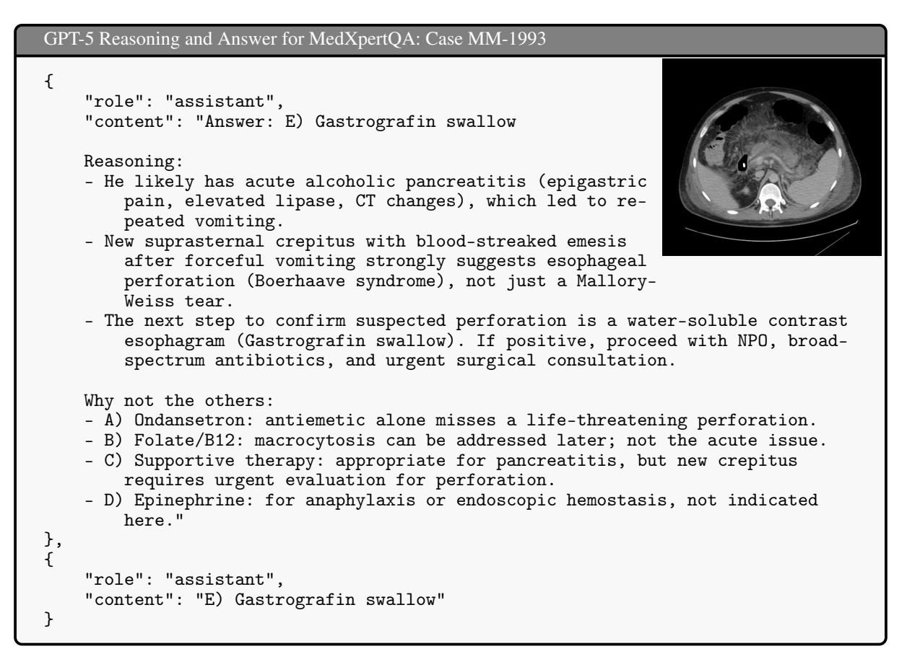

# Capabilities of GPT-5 on Multimodal Medical Reasoning

Shansong Wang<sup>1</sup> Mingzhe Hu<sup>1</sup> Qiang Li<sup>1</sup> Mojtaba Safari<sup>1</sup> Xiaofeng Yang<sup>1</sup> <sup>R</sup>

<sup>1</sup>Department of Radiation Oncology, Winship Cancer Institute, Emory University School of Medicine R Corresponding author: xiaofeng.yang@emory.edu

# Abstract

Recent advances in large language models (LLMs) have enabled general-purpose systems to perform increasingly complex domain-specific reasoning without extensive fine-tuning. In the medical domain, decision-making often requires integrating heterogeneous information sources, including patient narratives, structured data, and medical images. This study positions GPT-5 as a generalist multimodal reasoner for medical decision support and systematically evaluates its zeroshot chain-of-thought reasoning performance on both text-based question answering and visual question answering tasks under a unified protocol. We benchmark GPT-5, GPT-5-mini, GPT-5 nano, and GPT-4o-2024-11-20 against standardized splits of MedQA, MedXpertQA (text and multimodal), MMLU medical subsets, USMLE self-assessment exams, and VQA-RAD. Results show that GPT-5 consistently outperforms all baselines, achieving state-of-the-art accuracy across all QA benchmarks and delivering substantial gains in multimodal reasoning. On MedXpertQA MM, GPT-5 improves reasoning and understanding scores by +29.26% and +26.18% over GPT-4o, respectively, and surpasses pre-licensed human experts by +24.23% in reasoning and +29.40% in understanding. In contrast, GPT-4o remains below human expert performance in most dimensions. A representative case study demonstrates GPT-5's ability to integrate visual and textual cues into a coherent diagnostic reasoning chain, recommending appropriate high-stakes interventions. Our results show that, on these controlled multimodal reasoning benchmarks, GPT-5 moves from human-comparable to above human-expert performance. This improvement may substantially inform the design of future clinical decision-support systems. We make the code public at the [GPT-5-Evaluation.](https://github.com/wangshansong1/GPT-5-Evaluation)

# 1 Introduction

Rapid iteration of general-purpose large language models (LLMs) [\[1,](#page-7-0) [2,](#page-7-1) [3\]](#page-7-2) in recent years has promoted a paradigm shift from "task-specific models" to "LLM as core components". In medical scenarios, real-world problems often span multiple forms of evidence, including medical history text [\[4,](#page-7-3) [5\]](#page-7-4), structured indicators [\[6\]](#page-7-5), and medical imaging [\[7,](#page-7-6) [8\]](#page-7-7). This requires models to not only understand language, but also perform consistent reasoning and decision-making across heterogeneous modalities [\[9\]](#page-7-8). Enabling LLMs to reliably perform this type of multimodal medical reasoning without relying on extensive domain-specific fine-tuning is becoming a key issue in medical artificial intelligence (AI) [\[10,](#page-7-9) [11,](#page-7-10) [12\]](#page-7-11).

The release of GPT-3.5 [\[13\]](#page-7-12) and GPT-4 [\[1\]](#page-7-0) marked the beginning of this turning point. They brought general "promptto-use" capabilities to specialized tasks, significantly shifting the boundaries of research and application [\[9,](#page-7-8) [11\]](#page-7-10). Their robust performance in few-shot/zero-shot settings, stronger instruction following, and dialogue interaction make it possible to handle interdisciplinary problems with a unified interface. For example, since late 2022, general-purpose assistants built upon these models have garnered significant attention for their impressive out-ofthe-box performance on professional and academic benchmarks, including graduate entrance exams and subject assessments [\[1\]](#page-7-0), even achieving near-passing accuracy on the USMLE without domain-specific fine-tuning [\[14\]](#page-8-0). Across clinical specialties (e.g., neurosurgery [\[15\]](#page-8-1), hepatology [\[16\]](#page-8-2), and core internal medicine domains [\[17\]](#page-8-3)), they have exhibited promising knowledge recall and reasoning, and early studies have explored decision-support roles in radiology [\[18\]](#page-8-4), pathology [\[19\]](#page-8-5), and orthodontics [\[20\]](#page-8-6). In daily clinical workflows, such LLMs can draft clinic letters [\[21\]](#page-8-7), discharge summaries [\[22\]](#page-8-8), and cancer screening plans [\[23\]](#page-8-9). Yet most prior evaluations remain

predominantly text-centric and heterogeneous in datasets, prompting, and scoring, obscuring how these gains translate to settings that require joint reasoning over reports, images, and structured signals.

To this end, we position GPT-5 [\[3\]](#page-7-2) as a generalist multimodal reasoner and evaluate it under a unified protocol to enable controlled, longitudinal comparisons with GPT-4 on accuracy. We further investigate whether a single instruction-following model can serve as a reliable hub for multimodal medical decision support. Concretely, we evaluate GPT-5's reasoning ability on question answering (QA) and visual question answering (VQA). We standardize splits and prompts across GPT-4/5, evaluating zero-shot regimes with the same exemplars, chain-ofthought (CoT) supervision, and answers constrained to a single final choice for multiple-choice items. This design isolates the contribution of the model upgrade itself, rather than prompt engineering or dataset idiosyncrasies, in testing whether GPT-5 can act as a reliable hub for multimodal medical decision support.

# 2 Methodology

## 2.1 Datasets

To evaluate GPT-5, we consider four datasets that span both text-based and multimodal medical reasoning tasks. For question answering in text-only settings, we use MedQA[\[24\]](#page-8-10) and the medical subset of MMLU[\[25\]](#page-8-11) (MMLU-Medical). For visual question answering, we employ VQA-RAD[\[26\]](#page-8-12) and the newly introduced MedXpertQA[\[27\]](#page-8-13). Together, these datasets cover a wide range of medical knowledge domains, reasoning types, and input modalities.

- MedQA [\[24\]](#page-8-10) contains multiple-choice questions in English, Simplified Chinese, and Traditional Chinese, collected from the medical licensing examinations of the U.S., Mainland China, and Taiwan. Each question in the United States and Mainland China subsets has five answer options, with 1,273 and 3,426 questions in the respective test splits. The Taiwan subset contains 1,413 questions with 4 options per question. In addition, a simplified version of the U.S. test split provides 4-option variants of the same questions by removing one incorrect answer choice. Here, we use a simplified version of the US test set for evaluation.
- MMLU [\[25\]](#page-8-11) is a large-scale multiple-choice benchmark spanning 57 subjects across diverse domains. In this work, we focus on the MMLU-Medical to assess GPT-5's performance on a broad spectrum of specialized medical knowledge and reasoning skills.
- USMLE Self Assessment [\[28\]](#page-8-14) from official practice materials provided by the U.S. Medical Licensing Examination (USMLE) program[\\*](#page-1-0). The dataset comprises sample questions from three separate PDF files corresponding to Step 1, Step 2 CK, and Step 3, covering a broad range of clinical knowledge domains. This dataset setup follows the protocol of Harsha et al. [\[10\]](#page-7-9), who employed these sample exams to evaluate LLM performance on medical licensing assessments. In line with their approach, we preserved the original structure and content of the official sample materials.
- MedXpertQA [\[27\]](#page-8-13) is a challenging and comprehensive benchmark designed to evaluate expert-level medical knowledge and advanced reasoning. It comprises 4,460 questions spanning 17 specialties and 11 body systems, with two subsets: a text-only set and a multimodal set. The multimodal subset introduces complex clinical exam questions with diverse medical images, patient records, and examination results, going beyond traditional medical VQA datasets that rely on simplified image-caption pairs. To ensure clinical relevance and difficulty, MedXpertQA incorporates specialty board questions, rigorous filtering, data synthesis to mitigate leakage, and multiple rounds of expert review.
- VQA-RAD [\[26\]](#page-8-12) contains 2,244 question–answer pairs linked to 314 radiology images sourced from the MedPix database. The questions include both open-ended and binary yes/no formats, designed to evaluate visual understanding in clinical radiology contexts. The dataset is widely used for training and testing medical VQA systems and has undergone manual curation by clinicians to ensure quality and clinical validity. Here, we use the binary "yes/no" samples in the test set, totaling 251 samples.

#### 2.2 Prompting Design

We evaluate GPT-5 using a zero-shot CoT approach. In this setting, each interaction is a brief chat that first elicits step-by-step reasoning and then restricts the answer to a discrete choice. A system message anchors the medical domain. The first user turn presents the question and explicitly triggers CoT via "Let's think step by step." The assistant then produces a free-form rationale (stored as *prediction\_rationale*) without committing to an option. A second user turn provides a convergence cue: "Therefore, among A through {END\_LETTER}, the answer is",

<span id="page-1-0"></span><sup>\*</sup><https://www.usmle.org/prepare-your-exam>

where {END\_LETTER} denotes the last option letter computed from the number of choices. The final assistant turn returns the option letter (stored as *prediction*). For multimodal items, all images associated with the sample are appended as image\_url entries to the first user message, enabling the model to reason over text and images within a single turn while keeping the subsequent convergence step purely textual. The JSON templates below instantiate this protocol for the no-image and with-images variants, using {QUESTION\_TEXT}, {END\_LETTER}, {IMAGE\_URL\_1}, {ASSISTANT\_RATIONALE}, and {ASSISTANT\_FINAL} as placeholders. The prompting design template for the QA/VQA task is shown in Fig. [1,](#page-3-0) and a specific example is shown in Fig. [2.](#page-4-0)

# 3 Results

### 3.1 Performance of GPT-5 on QA Benchmarks

On text-based medical QA datasets (Table [1\)](#page-2-0), GPT-5 achieved consistent gains over GPT-4o and smaller GPT-5 variants. On MedQA (US 4-option), GPT-5 reached 95.84%, a 4.80% absolute improvement over GPT-4o, indicating stronger factual recall and diagnostic reasoning in clinical question contexts. The most pronounced gains appeared in MedXpertQA Text, where reasoning accuracy improved by 26.33% and understanding by 25.30% over GPT-4o. This suggests a substantial enhancement in multi-step inference and nuanced comprehension of medical narratives. In MMLU medical subdomains, GPT-5 maintained near-ceiling performance (>91% across all subjects), with notable gains in Medical Genetics (+4.00%) and Clinical Knowledge (+2.64%). The improvements were generally incremental in high-baseline categories, indicating that GPT-5's upgrades mainly benefit tasks with higher reasoning complexity rather than purely factual recall.

<span id="page-2-0"></span>Table 1: Performance on QA benchmarks (%). The blue numbers and arrows indicate changes compared to GPT-4o-2024-11-20.

| Dataset               | GPT-5              | GPT-5-mini | GPT-5-nano | GPT-4o-2024-11-20 |  |
|-----------------------|--------------------|------------|------------|-------------------|--|
| MedQA                 |                    |            |            |                   |  |
| US (4-option)         | (↑4.80%)<br>95.84  | 93.48      | 91.44      | 91.04             |  |
| MedXpertQA Text       |                    |            |            |                   |  |
| Reasoning             | 56.96<br>(↑26.33%) | 45.94      | 36.38      | 30.63             |  |
| Understanding         | (↑25.30%)<br>54.84 | 43.80      | 33.96      | 29.54             |  |
| MMLU                  |                    |            |            |                   |  |
| Anatomy               | (↑1.48%)<br>92.59  | 92.59      | 88.15      | 91.11             |  |
| Clinical Knowledge    | (↑2.64%)<br>95.09  | 91.32      | 89.81      | 92.45             |  |
| College Biology       | 99.31<br>(↑2.09%)  | 99.31      | 97.92      | 97.22             |  |
| College Medicine      | (↑1.74%)<br>91.91  | 88.44      | 85.55      | 90.17             |  |
| Medical Genetics      | (↑4.00%)<br>100.00 | 99.00      | 98.00      | 96.00             |  |
| Professional Medicine | 97.79<br>(↑1.10%)  | 97.43      | 96.69      | 96.69             |  |

#### 3.2 Performance of GPT-5 on USMLE Self Assessment

As shown in Table [2,](#page-2-1) GPT-5 outperformed all baselines on all three steps, with the largest margin on Step 2 (+4.17%). Step 2 focuses on clinical decision-making and management, aligning with GPT-5's improved CoT reasoning. The average score across steps reached 95.22% (+2.88% vs GPT-4o), exceeding typical human passing thresholds by a wide margin, demonstrating the model's readiness for high-stakes clinical reasoning tasks.

<span id="page-2-1"></span>Table 2: USMLE Sample Exam Performance (%). The blue numbers and arrows indicate changes compared to GPT-4o-2024- 11-20.

|         | GPT-5             | GPT-5-mini | GPT-5-nano | GPT-4o-2024-11-20 |
|---------|-------------------|------------|------------|-------------------|
| Step 1  | (↑0.84%)<br>93.28 | 93.28      | 93.28      | 92.44             |
| Step 2  | 97.50<br>(↑4.17%) | 95.83      | 90.00      | 93.33             |
| Step 3  | (↑3.65%)<br>94.89 | 94.89      | 92.70      | 91.24             |
| Average | (↑2.88%)<br>95.22 | 94.67      | 91.99      | 92.34             |

```
\overline{\text{Zero-shot}} + \overline{\text{CoT for QA}}
```

```
[
  {
    "role": "system",<br>"content": "You are a helpful medical assistant."
  },
    "role": "user",<br>"content": [
       {
          "type": "text",
          "text": "Q: {QUESTION_TEXT}\nA: Let's think step by step."
       }
    ]
  },
     "role": "assistant"
    "content": "{ASSISTÁNT_RATIONALE}"
  },
  {
     "role": "user"
     "content": "Therefore, among A through {END_LETTER}, the answer is"
  } {
     "role": "assistant",<br>"content": "{ASSISTANT_FINAL}"
  }
1
```

```
Zero\text{-}shot + CoT \text{ for } VQA
```

```
Г
  {
    "role": "system",<br>"content": "You are a helpful medical assistant."
  },
    "role": "user",<br>"content": [
       {
         "type": "text",
         "text": "Q: {QUESTION_TEXT}\nA: Let's think step by step."
       },
       {
         "type": "image_url",
         "image_url": { "url": "{IMAGE_URL_1}" }
      }
    ]
  },
    "role": "assistant",<br>"content": "{ASSISTANT_RATIONALE}"
  },
    "role": "user"
    "content": "Therefore, among A through {END_LETTER}, the answer is"
  },
    "role": "assistant",
     "content": "{ASSISTÁNT_FINAL}"
  }
]
```


```
A Sample from MedXpertQA
```

```
Г
  {
    "role": "system",
     "content": "You are a helpful medical assistant."
    "role": "user",
     "content": [
       {
         "type": "text",
          "text": "
              Q: A 45-year-old man is brought to the emergency department by
              police after being found unconscious in a store. He is wearing
              soiled clothing that smells of urine, and his pants are soaked
              in vomit. His medical history includes IV drug use, alcohol use
               , and fractures due to scurvy. He is not on any current medica-
              tions. Initial vital signs show a temperature of 99.5^{\circ}F~(37.5^{\circ}C), blood pressure of 90/63 mmHg, pulse of 130/min, respirations
              of 15/min, and oxygen saturation of 95% on room air. The patient<br>is treated with IV fluids, thiamine, and dextrose, after which he
              becomes more alert but continues vomiting. Physical examination<br>reveals epigastric tenderness, while cardiac and pulmonary exams<br>are unremarkable. A CT scan of the abdomen is performed, and lab-
              oratory results are as follows:
                - Serum:
                   Na+: 139 mEq/L
                                                             Creatinine: 1.1 mg/dL
                   Cl-: 102 mEq/L
                                                             Ca2+: 10.2 \text{ mg}/dLK+: 4.0 \text{ mEq/L}Lipase: 295 U/L
                   \text{HCO3-}: 26 \text{ mEq/L}AST: 57 U/L
                   BUN: 20 \text{ mg/dL}ALT: 39 U/L
                   Glucose: 73 mg/dL
                - Hematology:
                   Hemoglobin: 9 g/dL
                                                             Hematocrit: 30%
                   Mean corpuscular volume: 120 µm<sup>3</sup> Leukocyte count: 8,500/mm<sup>3</sup>
                   Platelet count: 199,000/mm<sup>3</sup>
              Several hours later, his vital signs improve to a temperature of
              99.5°F (37.5°C), blood pressure of 110/72 mmHg, pulse of 97/min,
              respirations of 15/min, and oxygen saturation of 95% on room air.
              On examination, suprasternal crepitus is noted, along with blood-
              stained vomitus in the oropharynx. Cardiac and pulmonary findings remain normal, and the lower extremities show no abnormalities.
              What is the most appropriate next step in this patient's management?
              Answer Choices:
                   (A) Ondansetron(C) Supportive therapy
                                                        (B) Folate and vitamin B12
                                                        (D) Injection of epinephrine
                    <pre>(E) Gastrografin swallow</pre>
              A: Let's think step by step."
       },
          "type": "image_url"
          "image_url": { "url": "images/MM-1993-a.jpeg" }
       }
    1
  },
     "role": "assistant"
    "content": "{ASSISTANT_RATIONALE}"
    "role": "user",
    "content": "Therefore, among A through E, the answer is"
  {
    "role": "assistant",
     "content": "E"
  }
]
```

**Figure 2:** A prompting design sample from MedXpertQA.

## 3.3 Performance of GPT-5 on VQA Benchmarks

For multimodal reasoning (Table [3\)](#page-5-0), GPT-5 achieved a dramatic leap in MedXpertQA MM, with reasoning and understanding gains of +29.26% and +26.18%, respectively, relative to GPT-4o. This magnitude of improvement suggests significantly enhanced integration of visual and textual cues.

However, in VQA-RAD, GPT-5 scored 70.92%, slightly below GPT-5-mini (74.90%). Given VQA-RAD's relatively small scale and radiology-specific nature, this difference may reflect dataset-specific overfitting in the smaller model or conservative reasoning in GPT-5. A representative example from the MedXpertQA MM benchmark (Figure [3\)](#page-6-0) illustrates GPT-5's capability to synthesize multimodal information in a clinically coherent manner.

In this case, the model correctly identified esophageal perforation (Boerhaave syndrome) as the most likely diagnosis based on the combination of CT imaging findings, laboratory values, and key physical signs (suprasternal crepitus, blood-streaked emesis) following repeated vomiting. It then recommended a Gastrografin swallow study as the next management step, while explicitly ruling out other options and justifying each exclusion. This output demonstrates the model's ability to integrate visual evidence with complex narrative context, maintain a structured diagnostic reasoning chain, and arrive at a high-stakes clinical decision that aligns with expert consensus.

<span id="page-5-0"></span>Table 3: Performance on VQA benchmarks (%). The blue numbers and arrows indicate changes compared to GPT-4o-2024-11- 20.

| Dataset       | GPT-5              | GPT-5-mini        | GPT-5-nano | GPT-4o-2024-11-20 |
|---------------|--------------------|-------------------|------------|-------------------|
| MedXpertQA MM |                    |                   |            |                   |
| Reasoning     | (↑29.26%)<br>69.99 | 60.51             | 45.44      | 40.73             |
| Understanding | 74.37<br>(↑26.18%) | 61.37             | 45.85      | 48.19             |
| Radiology     |                    |                   |            |                   |
| VQA-RAD       | 70.92              | (↑4.99%)<br>74.90 | 65.34      | 69.91             |
|               |                    |                   |            |                   |

## 3.4 Comparison with human experts

Table [4](#page-5-1) further shows a striking contrast in performance between GPT-4o-2024-11-20, pre-licensed human experts, and GPT-5. GPT-4o performed below pre-licensed human experts on most dimensions, underperforming by 5.03–15.90% across reasoning and understanding in both text and multimodal settings. In sharp contrast, GPT-5 not only closes this gap but surpasses human experts by a substantial margin, achieving improvements of +15.22% (text reasoning), +9.40% (text understanding), +24.23% (multimodal reasoning), and +29.40% (multimodal understanding). These improvements are substantial, marking a notable advancement in model capability, shifting GPT-5 from human-comparable performance to consistently exceeding that of trained medical professionals in standardized benchmark evaluations.

The magnitude of this lead is particularly striking in multimodal settings, where GPT-5's unified vision-language reasoning pipeline appears to deliver an integration of textual and visual evidence that even experienced clinicians struggle to match under time-limited test conditions. This marked improvement from GPT-4o's below-human results to GPT-5's above-human performance highlights a significant advancement in LLM capabilities, with important potential implications for their use in real-world clinical decision support.

<span id="page-5-1"></span>

| Table 4: Comparison with human experts (Text and Multimodal) |                 |               |           |               |               |           |
|--------------------------------------------------------------|-----------------|---------------|-----------|---------------|---------------|-----------|
| Model                                                        | MedXpertQA Text |               |           | MedXpertQA MM |               |           |
|                                                              | Reasoning       | Understanding | Avg       | Reasoning     | Understanding | Avg       |
| Expert (Pre-Licensed)                                        | 41.74           | 45.44         | 42.60     | 45.76         | 44.97         | 45.53     |
| GPT-4o-2024-11-20                                            | 30.63           | 29.54         | 30.37     | 40.73         | 48.19         | 42.80     |
|                                                              | (↓11.11%)       | (↓15.90%)     | (↓12.23%) | (↓5.03%)      | (↑3.22%)      | (↓2.73%)  |
| GPT-5-nano                                                   | 36.38           | 33.96         | 35.17     | 45.44         | 45.85         | 45.65     |
|                                                              | (↓5.36%)        | (↓11.48%)     | (↓7.43%)  | (↓0.32%)      | (↑0.88%)      | (↑0.12%)  |
| GPT-5-mini                                                   | 45.94           | 43.80         | 44.87     | 60.51         | 61.37         | 60.94     |
|                                                              | (↑4.20%)        | (↓1.64%)      | (↑2.27%)  | (↑14.75%)     | (↑16.40%)     | (↑15.41%) |
| GPT-5                                                        | 56.96           | 54.84         | 55.90     | 69.99         | 74.37         | 72.18     |
|                                                              | (↑15.22%)       | (↑9.40%)      | (↑13.30%) | (↑24.23%)     | (↑29.40%)     | (↑26.65%) |
|                                                              |                 |               |           |               |               |           |

<span id="page-6-0"></span>

Figure 3: GPT-5 reasoning output and final answer for MedXpertQA: case MM-1993.

# 4 Disscusion

We evaluate the reasoning capabilities of the GPT-5 family of models on a wide range of multimodal tasks, revealing several key findings:

First, GPT-5 delivers substantial gains in multimodal medical reasoning, especially in datasets like MedXpertQA MM that demand tight integration of image-derived evidence with textual patient data. The observed improvements of +26–36% over GPT-4o in multimodal settings suggest enhancements in cross-modal attention and alignment within the model's architecture or training.

Second, these gains are most pronounced in reasoning-intensive tasks, as evidenced by results from MedXpertQA Text and USMLE Step 2. Here, chain-of-thought (CoT) prompting likely synergizes with GPT-5's enhanced internal reasoning capacity, enabling more accurate multi-hop inference. In contrast, in domains with high baseline accuracy (e.g., MMLU factual subtests), we note smaller but consistent improvements, indicating that GPT-5's primary strength lies in its ability to tackle complex reasoning challenges rather than simply recalling facts.

Third, performance relative to humans is particularly noteworthy. GPT-5 not only matches but surpasses the performance of pre-licensed medical professionals in controlled QA/VQA evaluations, which raises both potential benefits and caution. On one hand, it underscores the potential for LLMs to serve as clinical decision-support systems; on the other hand, it is important to recognize that these evaluations occur within idealized, standardized testing environments that do not fully encompass the complexity, uncertainty, and ethical considerations inherent in real-world medical practice.

An unexpected observation is that GPT-5 scored slightly lower on VQA-RAD compared to its smaller counterpart, GPT-5-mini. This discrepancy may be attributed to scaling-related differences in reasoning calibration; larger models might adopt a more cautious approach in selecting answers for smaller datasets, resulting in fewer, albeit

more conservative, correct predictions. Future research could explore adaptive prompting or calibration techniques specifically tailored for small-domain multimodal tasks.

# 5 Conclusion

This study presents the first controlled, longitudinal evaluation of GPT-5's capabilities in multimodal medical reasoning, comparing its performance to GPT-4o-2024-11-20, smaller GPT-5 variants, and human experts under standardized zero-shot CoT prompting. Across diverse QA and VQA benchmarks, GPT-5 demonstrates substantial and consistent gains, particularly in reasoning-intensive and multimodal tasks. Notably, the model's ability to surpass trained medical professionals on MedXpertQA MM by large margins signifies a qualitative shift in LLM capabilities, moving from near-human performance in GPT-4o-2024-11-20 to clear super-human proficiency. These results highlight GPT-5's potential as a reliable core component for multimodal clinical decision support, capable of integrating complex textual and visual information streams to produce accurate, well-justified recommendations. However, it is important to note that the benchmarks used reflect idealized testing conditions and may not fully capture the variability, uncertainty, and ethical considerations of real-world practice. Future work should investigate prospective clinical trials, domain-adapted fine-tuning strategies, and calibration methods to ensure safe and transparent deployment. Ultimately, the advancements represented by GPT-5 mark a pivotal moment in the evolution of medical AI, bridging the gap between research prototypes and practical, high-impact clinical tools.

# References

- <span id="page-7-0"></span>[1] Josh Achiam, Steven Adler, Sandhini Agarwal, Lama Ahmad, Ilge Akkaya, Florencia Leoni Aleman, Diogo Almeida, Janko Altenschmidt, Sam Altman, Shyamal Anadkat, et al. Gpt-4 technical report. arXiv preprint arXiv:2303.08774, 2023.
- <span id="page-7-1"></span>[2] Aixin Liu, Bei Feng, Bing Xue, Bingxuan Wang, Bochao Wu, Chengda Lu, Chenggang Zhao, Chengqi Deng, Chenyu Zhang, Chong Ruan, et al. Deepseek-v3 technical report. arXiv preprint arXiv:2412.19437, 2024.
- <span id="page-7-2"></span>[3] OpenAI. Introducing gpt-5, August 7 2025.
- <span id="page-7-3"></span>[4] William S Azar, Dylan M Junkin, Charles Hesswani, Christopher R Koller, Sahil H Parikh, Kyle C Schuppe, Nicholas Williams, Daniel Nethala, Neil Mendhiratta, Alexander P Kenigsberg, et al. Llm-mediated data extraction from patient records after radical prostatectomy. NEJM AI, 2(6):AIcs2400943, 2025.
- <span id="page-7-4"></span>[5] Karan Singhal, Shekoofeh Azizi, Tao Tu, S Sara Mahdavi, Jason Wei, Hyung Won Chung, Nathan Scales, Ajay Tanwani, Heather Cole-Lewis, Stephen Pfohl, et al. Large language models encode clinical knowledge. Nature, 620(7972):172–180, 2023.
- <span id="page-7-5"></span>[6] Jiayan Guo, Lun Du, Hengyu Liu, Mengyu Zhou, Xinyi He, and Shi Han. Gpt4graph: Can large language models understand graph structured data? an empirical evaluation and benchmarking. arXiv preprint arXiv:2305.15066, 2023.
- <span id="page-7-6"></span>[7] Shansong Wang, Mojtaba Safari, Qiang Li, Chih-Wei Chang, Richard LJ Qiu, Justin Roper, David S Yu, and Xiaofeng Yang. Triad: Vision foundation model for 3d magnetic resonance imaging. arXiv preprint arXiv:2502.14064, 2025.
- <span id="page-7-7"></span>[8] Shansong Wang, Zhecheng Jin, Mingzhe Hu, Mojtaba Safari, Feng Zhao, Chih-Wei Chang, Richard LJ Qiu, Justin Roper, David S Yu, and Xiaofeng Yang. Unifying biomedical vision-language expertise: Towards a generalist foundation model via multi-clip knowledge distillation. arXiv preprint arXiv:2506.22567, 2025.
- <span id="page-7-8"></span>[9] Fenglin Liu, Hongjian Zhou, Boyang Gu, Xinyu Zou, Jinfa Huang, Jinge Wu, Yiru Li, Sam S Chen, Yining Hua, Peilin Zhou, et al. Application of large language models in medicine. Nature Reviews Bioengineering, pages 1–20, 2025.
- <span id="page-7-9"></span>[10] Harsha Nori, Nicholas King, Scott Mayer McKinney, Dean Carignan, and Eric Horvitz. Capabilities of gpt-4 on medical challenge problems. arXiv preprint arXiv:2303.13375, 2023.
- <span id="page-7-10"></span>[11] Arun James Thirunavukarasu, Darren Shu Jeng Ting, Kabilan Elangovan, Laura Gutierrez, Ting Fang Tan, and Daniel Shu Wei Ting. Large language models in medicine. Nature medicine, 29(8):1930–1940, 2023.
- <span id="page-7-11"></span>[12] Mingzhe Hu, Joshua Qian, Shaoyan Pan, Yuheng Li, Richard LJ Qiu, and Xiaofeng Yang. Advancing medical imaging with language models: featuring a spotlight on chatgpt. Physics in Medicine & Biology, 69(10):10TR01, 2024.
- <span id="page-7-12"></span>[13] OpenAI. Introducing gpt-3.5, March 1 2023.

- <span id="page-8-0"></span>[14] Zhichao Yang, Zonghai Yao, Mahbuba Tasmin, Parth Vashisht, Won Seok Jang, Feiyun Ouyang, Beining Wang, Dan Berlowitz, and Hong Yu. Performance of multimodal gpt-4v on usmle with image: potential for imaging diagnostic support with explanations. medRxiv, pages 2023–10, 2023.
- <span id="page-8-1"></span>[15] Benjamin S Hopkins, Vincent N Nguyen, Jonathan Dallas, Pavlos Texakalidis, Max Yang, Alex Renn, Gage Guerra, Zain Kashif, Stephanie Cheok, Gabriel Zada, et al. Chatgpt versus the neurosurgical written boards: a comparative analysis of artificial intelligence/machine learning performance on neurosurgical board–style questions. Journal of Neurosurgery, 139(3):904–911, 2023.
- <span id="page-8-2"></span>[16] Yee Hui Yeo, Jamil S Samaan, Wee Han Ng, Peng-Sheng Ting, Hirsh Trivedi, Aarshi Vipani, Walid Ayoub, Ju Dong Yang, Omer Liran, Brennan Spiegel, et al. Assessing the performance of chatgpt in answering questions regarding cirrhosis and hepatocellular carcinoma. Clinical and molecular hepatology, 29(3):721, 2023.
- <span id="page-8-3"></span>[17] Douglas Johnson, Rachel Goodman, J Patrinely, Cosby Stone, Eli Zimmerman, Rebecca Donald, Sam Chang, Sean Berkowitz, Avni Finn, Eiman Jahangir, et al. Assessing the accuracy and reliability of ai-generated medical responses: an evaluation of the chat-gpt model. Research square, pages rs–3, 2023.
- <span id="page-8-4"></span>[18] Rajesh Bhayana, Robert R Bleakney, and Satheesh Krishna. Gpt-4 in radiology: improvements in advanced reasoning. Radiology, 307(5):e230987, 2023.
- <span id="page-8-5"></span>[19] Mohamed Omar, Varun Ullanat, Massimo Loda, Luigi Marchionni, and Renato Umeton. Chatgpt for digital pathology research. The Lancet Digital Health, 6(8):e595–e600, 2024.
- <span id="page-8-6"></span>[20] Gizem Bozta¸s Demir, Yagızalp Süküt, Gökhan Serhat Duran, Kübra Gülnur Topsakal, and Serkan Görgülü. ˘ Enhancing systematic reviews in orthodontics: a comparative examination of gpt-3.5 and gpt-4 for generating pico-based queries with tailored prompts and configurations. European Journal of Orthodontics, 46(2):cjae011, 2024.
- <span id="page-8-7"></span>[21] Joshua Yi Min Tung, Sunil Ravinder Gill, Gerald Gui Ren Sng, Daniel Yan Zheng Lim, Yuhe Ke, Ting Fang Tan, Liyuan Jin, Kabilan Elangovan, Jasmine Chiat Ling Ong, Hairil Rizal Abdullah, et al. Comparison of the quality of discharge letters written by large language models and junior clinicians: single-blinded study. Journal of medical Internet research, 26:e57721, 2024.
- <span id="page-8-8"></span>[22] Sunjun Kweon, Jiyoun Kim, Heeyoung Kwak, Dongchul Cha, Hangyul Yoon, Kwang Kim, Jeewon Yang, Seunghyun Won, and Edward Choi. Ehrnoteqa: An llm benchmark for real-world clinical practice using discharge summaries. Advances in Neural Information Processing Systems, 37:124575–124611, 2024.
- <span id="page-8-9"></span>[23] Yuexing Hao, Zhiwen Qiu, Jason Holmes, Corinna E Löckenhoff, Wei Liu, Marzyeh Ghassemi, and Saleh Kalantari. Large language model integrations in cancer decision-making: a systematic review and metaanalysis. npj Digital Medicine, 8(1):450, 2025.
- <span id="page-8-10"></span>[24] Di Jin, Eileen Pan, Nassim Oufattole, Wei-Hung Weng, Hanyi Fang, and Peter Szolovits. What disease does this patient have? a large-scale open domain question answering dataset from medical exams. arXiv preprint arXiv:2009.13081, 2020.
- <span id="page-8-11"></span>[25] Dan Hendrycks, Collin Burns, Steven Basart, Andy Zou, Mantas Mazeika, Dawn Song, and Jacob Steinhardt. Measuring massive multitask language understanding. Proceedings of the International Conference on Learning Representations (ICLR), 2021.
- <span id="page-8-12"></span>[26] Jason J Lau, Soumya Gayen, Asma Ben Abacha, and Dina Demner-Fushman. A dataset of clinically generated visual questions and answers about radiology images. Scientific data, 5(1):1–10, 2018.
- <span id="page-8-13"></span>[27] Yuxin Zuo, Shang Qu, Yifei Li, Zhangren Chen, Xuekai Zhu, Ermo Hua, Kaiyan Zhang, Ning Ding, and Bowen Zhou. Medxpertqa: Benchmarking expert-level medical reasoning and understanding. arXiv preprint arXiv:2501.18362, 2025.
- <span id="page-8-14"></span>[28] Tiffany H Kung, Morgan Cheatham, Arielle Medenilla, Czarina Sillos, Lorie De Leon, Camille Elepaño, Maria Madriaga, Rimel Aggabao, Giezel Diaz-Candido, James Maningo, et al. Performance of chatgpt on usmle: potential for ai-assisted medical education using large language models. PLoS digital health, 2(2):e0000198, 2023.