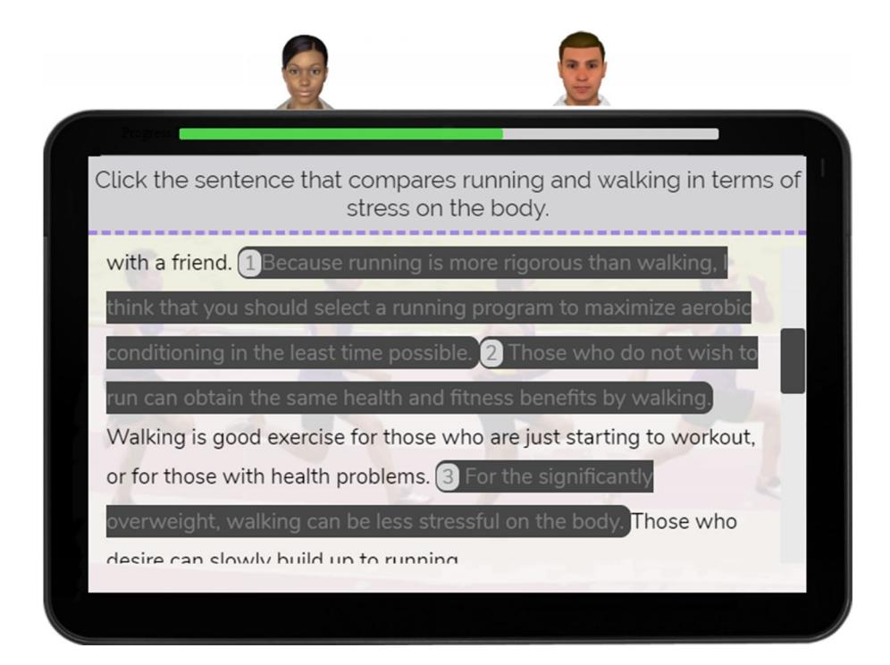
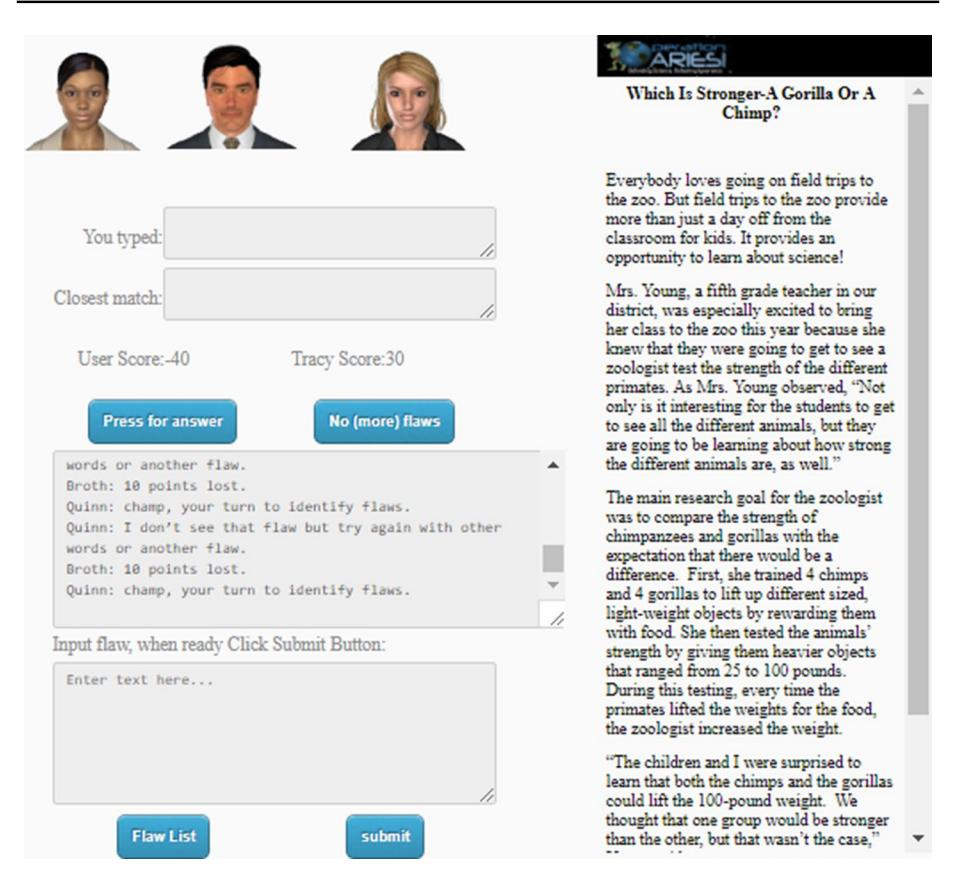

# **Multiple Agent Designs in Conversational Intelligent Tutoring Systems**

**Anne Lippert1  [·](http://orcid.org/0000-0003-3920-1582) Keith Shubeck1 · Brent Morgan1 · Andrew Hampton1 · Arthur Graesser1**

Published online: 20 December 2019 © Springer Nature B.V. 2019

#### **Abstract**

This article describes designs that use multiple conversational agents within the framework of intelligent tutoring systems. Agents in this case are computerized talking heads or embodied animated avatars that help students learn by performing actions and holding conversations with them in natural language. The earliest conversational intelligent tutoring systems were limited to a single agent that interacted with a student in the role of a teacher or expert. Technological advances have since made possible systems in which multiple agents interact with the learner and each other to model ideal behavior, strategies, refections, and social interactions. Though still an emerging technology, multi-agent intelligent tutoring systems aford pedagogical benefts that go beyond the capabilities of the singleagent system and have facilitated learning gains on a variety of subject matters and skills, including science, technology, engineering, mathematics, research methods, metacognition, and language comprehension. The present work describes some common multi-agent designs that may be used to achieve a variety of pedagogical goals. We provide examples of how these designs have been implemented in educational or experimental settings and anticipate future use within the feld of artifcial intelligence.

**Keywords** Adaptive · Artifcial intelligence · Conversational agents · Intelligent tutoring systems · Multi-agent designs · Personalized learning

# **1 Introduction**

Intelligent Tutoring Systems (ITS) are computerized learning environments that model learners' psychological states to provide instruction that is adaptive to these states and advances the educational agenda (Graesser et al. [2012a](#page-17-0); Woolf [2009\)](#page-20-0). Compared to more traditional, "static" computer assisted learning approaches that deliver the same material to students of diferent knowledge and ability levels, the ITS approach is better because it can tailor educational content and instructional methods to each individual learner. This

1 Department of Psychology and the Institute for Intelligent Systems, University of Memphis, Memphis, USA

\* Anne Lippert alippert@memphis.edu

capability to deliver a personalized learning experience separates ITSs from the more traditional methods of instructions.

A special class of ITS called Conversational Intelligent Tutoring Systems (CITS) use animated conversational agents that interact with students and help them learn by either modeling good pedagogy or by holding a conversation. The agents may take on diferent roles: mentors, tutors, peers, players in games, or avatars in the virtual worlds. The students communicate with the agents through speech, keyboard, gesture, touch panel screen, or other conventional channels. In response, the agents express themselves through speech, facial expression, gesture, posture, and other embodied actions. Within the general class of CITS, the most common design of agent interaction consists of a dialogue, in which the human student interacts with only one agent (Graesser et al. [2017a](#page-18-0)). The agent can be either a peer (approximately the same level of profciency as the learner), a student agent with lower profciency (so that the learner can teach the agent), or an expert tutor agent. We hereafter refer to such systems as single-agent CITS.

Advances in agent modeling tools and artifcial intelligence technologies have made possible systems that incorporate two or more agents (Johnson and Lester [2018;](#page-19-0) Kim and Baylor [2016\)](#page-19-1). These *multi*-*agent CITS* (MACITS) represent a milestone in the feld of ITS since they are capable of modeling more than just the typical single tutor agent-learner exchange. Additional agents can interact with the learner and each other in a range of social and informational capacities. The various roles agents may take on increases the fexibility of instructional tactics so that diferent pedagogical goals for diferent classes of students can be addressed. For example, when the design includes both a tutor agent and a peer agent, students can observe the tutor agent and peer agent interact to model good behavior, which is sometimes helpful for students with low knowledge and skills (Craig et al. [2012\)](#page-17-1). The more advanced student may attempt to teach the peer agent, with the tutor agent helping along the way. The two agents can disagree with each other and lead to cognitive disequilibrium, productive confusion, and deeper learning in the student (D'Mello et al. [2014\)](#page-17-2). In general, MACITS provide capabilities to enhance learning that are not possible with single-agent systems (Graesser et al. [2017a\)](#page-18-0).

One of the most signifcant capabilities of conversational pedagogical agents is their ability to support learning by fostering the relationship between emotions and cognition (Kim and Baylor [2006](#page-19-2)). Social cognitive theories view learning as a social process of interaction and negotiation with others (Bandura [1991](#page-16-0); Vygotsky [1978](#page-20-1)). Agents can theoretically provide the social fabric that learners typically receive in a traditional classroom environment. Agents can interact with learners as tutors, peers, teammates, and can support learners' emotional states using empathy and by building relationships with learners. Research on single agent systems backs the idea that social support can infuence learning. For example, when an agent behaves as teammates or activity partners, they provide peer support that lowers learner anxiety (Huang and Mayer [2016\)](#page-19-3). When single agents act as role models, they can enhance empathy and self-efcacy and a sense of responsibility by making mistakes that students observe and point out (Chase et al. [2009](#page-17-3)).

Whether or not additional agents are more benefcial than single agent designs in terms of social support is still up for debate. However, since multiple agent systems include within them single agent-user interactions, multiple agents systems should provide the same social scafolding to support learning as the single agent systems and more. For example, peer agents of diferent abilities may interact in the same session with the user. This afords users opportunities to mimic the skilled peers and increase their confdence around less skilled peers. Praise from a tutor agent to another peer could motivate the user, as could asking the user to assist fellow peer agents when they are stuck on a problem.

Multiple agents also make it possible to work in teams, which can encourage users to work harder to satisfy other group members (Alport [1920\)](#page-16-1), as well as motivate and facilitate a change in human opinions (Becker-Beck et al. [2005;](#page-16-2) Lee and Nass [2002\)](#page-19-4). The hope is that the pedagogical benefts that multi-party conversational frameworks aford will incite learning gains beyond those seen with the single-agent system (Graesser et al. [2017a\)](#page-18-0).

Though the ITS feld has built a number of successful systems, advances in the feld are often siloed (Craig [2018\)](#page-17-4). Systems tend to be stand alone and do not have the capability to communicate with each other. They are highly domain specifc and so are difcult to repurpose to teach diferent subjects. For example, researchers building a multi-agent system to teach reading strategies cannot easily transform it into a system for engineering instruction. As a result, the idea that multiple agent designs can aford advantages above and beyond the single agent design is under-acknowledged and understudied. The present work summarizes the capabilities, challenges and future development of MACITS, drawing heavily from our own frst-hand knowledge in developing and testing these systems. At the interdisciplinary Institute for Intelligent Systems at the University of Memphis, we have spent the past decade pursuing the multi-agent, conversational approach. We hope the insight of our own experiences promotes awareness and further research regarding multiagent designs.

We frst describe foundational elements of CITS to provide the necessary background knowledge. Next, we lay out the various capabilities aforded by diferent designs of MAC-ITS and give examples of systems that have actualized these capabilities in educational settings. When possible, we augment examples with empirical evidence regarding the system's value as a learning tool. We conclude by indicating future directions for MACITS.

# **2 Conversational Intelligent Tutoring Systems**

Previous forms of computer assisted learning are often described as static in the sense that they present the same material and instruction to all users, regardless of diferences in learner ability or knowledge. In doing so, these approaches fail to support fexible individualized learning and tutoring that incorporates knowledge about the domain, the student, and teaching strategies. The class of ITS with conversational agents, or CITS, has proliferated over the last decade, in part because of their ability to support personalized learning. *AutoTutor* and its descendants (Graesser [2016](#page-17-5); Nye et al. [2014\)](#page-19-5) have helped college students learn a range of skills and subject matter by holding a conversation in natural language. These conversation-based systems have been developed to teach topics such as computer literacy (Graesser et al. [2004\)](#page-18-1), physics (*DeepTutor*, Rus et al. [2013](#page-20-2)); *Auto-Tutor*, (VanLehn et al. [2007\)](#page-20-3), biology (*GuruTutor*, Olney et al. [2012](#page-19-6)), and scientifc reasoning (*Operation ARIES/ARA*, Halpern et al. [2012;](#page-18-2) Kopp et al. [2012](#page-19-7); Millis et al. [2017](#page-19-8)). Other examples of CITS that have improved student learning are *MetaTutor* (Azevedo et al. [2010\)](#page-16-3), *Betty's Brain* (Biswas et al. [2010](#page-16-4)), *iDRIVE* (Craig et al. [2012;](#page-17-1) Gholson et al. [2009](#page-17-6)) *iSTART* (Jackson and McNamara [2013](#page-19-9); McNamara et al. [2006\)](#page-19-10), *Crystal Island* (Rowe et al. [2011\)](#page-20-4), *My Science Tutor* (Ward et al. [2013](#page-20-5)), and *Tactical Language and Culture System* (Johnson and Valente [2009\)](#page-19-11).

CITS can vary in their simulations of human conversation mechanisms, but all of them attempt to comprehend natural language, produce adaptive responses, and capitalize on pedagogical strategies to assist more personalized learning. Those like AutoTutor and its derivatives are equipped with agents that interact with students and material in ways that apply

explanation-based constructivist theories of learning. These systems often mimic the collaborative constructive activities that occur during human tutoring (Graesser et al. [2017d\)](#page-18-3). Agents simulating tutors is a sensible frst design for a CITS because evidence suggests human tutoring efectively improves student learning and motivation. Meta-analyses comparing human tutoring to traditional classroom style instruction and similar conditions report efect sizes between *σ*=0.20 and *σ*=1.00 (Graesser et al. [2017d](#page-18-3); Cohen et al. [1982](#page-17-7); VanLehn [2011\)](#page-20-6).

Though human tutors are often considered the gold standard for producing learning gains in students (Shubeck et al. [2017](#page-20-7)), the exact mechanisms that make human tutoring so conducive to learning are open to debate. Research conducted on the discourse, language, facial expressions, gestures, and actions used in tutorial conversations provide some insight (Graesser et al. [1995](#page-18-4), [2009,](#page-18-5) [2017d](#page-18-3)). We know that tutors who attempt to get students to construct answers and solutions to problems are more efective in inducing learning than those who simply regurgitate information in the same vein as a classroom style lecture (Chi et al. [2001\)](#page-17-8). In fact, it appears that most human tutors follow a systematic conversational structure (Graesser et al. [1995\)](#page-18-4) that has been termed *expectation*- *and misconception*-*tailored* (EMT) dialogue (Graesser et al. [2008](#page-18-6), [2012b\)](#page-18-7).

The EMT dialogue occurs when a tutor asks the student a challenging question, then anticipates particular correct answers (called expectations) and particular misconceptions, while tracing the student's rationale for the response (Graesser [2016](#page-17-5)). The tutor is able to form an approximate model of what the student knows over multiple conversation turns, by comparing the student's responses to the expectations and misconceptions (Graesser [2016;](#page-17-5) Graesser et al. [2018a](#page-18-8), [b;](#page-18-9) Ma et al. [2014\)](#page-19-12). The feedback tutors give depends on the degree to which the student contributions match expectations or misconceptions (Graesser [2016\)](#page-17-5). The tutors generate dialogue that corrects student misconceptions and helps students respond in ways that that eventually fulfll the expectations (Graesser [2016](#page-17-5)).

CITS such as AutoTutor, implement EMT moves within conversations in hopes they lead to learning gains seen in human tutoring sessions (Graesser [2016;](#page-17-5) Graesser et al. [2018a,](#page-18-8) [b](#page-18-9)). Below we list tutor dialogue moves representative of EMT conversations in *AutoTutor* and in human tutoring sessions (Graesser [2016\)](#page-17-5):

*Main Question or Problem* This is the challenging question or problem the tutor asks the student. Tutor and student then spend conversational turns (anywhere from 5 to over 100 turns) trying to collaboratively solve the problem.

*Short Feedback* Quick feedback the tutor gives in response to the student's answer. Feedback takes the form of either positive ("yes," "correct," head nod), negative ("no," "almost," head shake, long pause, frown), or neutral ("uh huh", "okay").

*Pumps* The tutor issues nondirective pumps ("Anything else?" "Tell me more.") to coax the student into talking or taking action.

*Hints* The tutor supplies hints that encourage students to talk or take action along some conceptual path. The hints range from very generic ("What about X?," "Why?") to speech acts that push the student toward a particular answer. Hints encourage active student learning within the boundaries of relevant material.

*Prompts* These are leading questions asked by the tutor with the aim of getting the student to articulate a particular word or phrase. Some students say very little and prompts are needed to get the student to say something specifc.

*Prompt Completions* The tutor flls in the correct completion of a prompt.

*Assertions* The tutor states a fact or information.

*Summaries* The tutor provides a synopsis of the answer to a question

*Mini-lectures* The tutor conveys didactic material on a particular topic.

*Corrections* The tutor corrects a student's error or misunderstanding.

*Answers* The tutor answers a student's question.

*Of-Topic Comment* The tutor makes statements unrelated or tangentially related to the subject matter.

Whether the student or the tutor supplies the expectation content varies among dialogue moves. For instance, the amount of information supplied by the tutor increases with each move in the following manner: pump>hint>assertion>summary (Nye et al. [2014](#page-19-5)) Dialogues between a tutor and a more knowledgeable student have a higher proportion of tutor pumps and hints (requiring the student to ofer more input) than prompts and assertions that provide more information from the tutor (Jackson and Graesser [2006\)](#page-19-13).

Implementations of the EMT dialogue in CITS have helped students learn challenging material. Assessments from over 20 experiments in the areas computer literacy (Graesser et al. [2004\)](#page-18-1), Newtonian physics (VanLehn et al. [2007\)](#page-20-3), and scientifc reasoning (Kopp et al. [2012\)](#page-19-7) showed that students using *AutoTutor* had learning gains of approximately 0.80 sigma (standard deviation units) compared to students who read a textbook for the same amount of time (Nye et al. [2014](#page-19-5); Graesser et al. [2012b](#page-18-7)). Around a dozen measures of learning were collected in these assessments, such as number of correct answers on multiplechoice questions, essay quality when students attempt to answer challenging questions, a cloze task that has students fll in missing words of texts that articulate explanatory reasoning on the subject matter, and performance on problems that require problem solving. When researchers explored the depth of knowledge acquisition using the results of these assessments, they found that the EMT dialogue of *AutoTutor* helped to increase learning gains for measures that capture deep as opposed to shallow learning (Nye et al. [2014;](#page-19-5) Graesser et al. [2012b](#page-18-7)). In this case, shallow learning included the ability to recall simple facts, rules, and procedures whereas deeper learning required inference generation, integration of information, reasoning, and problem solving. The learning outcomes of AutoTutor on deep learning suggest that EMT dialogues found frequently in human tutoring may be used to model appropriate conversations in ITSs to help students learn, even when the material is more difcult.

# **3 MACITS Designs**

In AutoTutor and other CITS, EMT conversations are the primary pedagogical method of scafolding good student answers whether the system has a single or multiple agents (Graesser [2016](#page-17-5)). In the single-agent system, the conversations between agent and student are called *dialogues* but in a multi-agent system, the interchanges may be called *trialogues* (two agents interact with one student), *quadralogues* (three agents, one student),

*quintalogues* (four agents, one student), and so on. Though research is in its early stages, the hope is that the pedagogical benefts that multi-party conversational frameworks aford will incite learning gains beyond those seen with the single-agent system (Graesser et al. [2017a\)](#page-18-0). Some of these benefts include the ability to model social interactions, stage competitions, and manipulate cognitive disequilibrium (Graesser et al. [2017a\)](#page-18-0).

Like single-agent designs, multiple-agent designs have been incorporated in many computerized learning environments, such as Betty's Brain (Biswas et al. [2010](#page-16-4)), Tactical Language and Culture System (Johnson and Valente [2009\)](#page-19-11), iDRIVE (Gholson et al. [2009](#page-17-6)), iSTART (Jackson and McNamara [2013](#page-19-9); McNamara et al. [2006](#page-19-10)), and Operation ARA (Halpern et al. [2012](#page-18-2); Forsyth et al. [2012](#page-17-9); Millis et al. [2011](#page-19-14)). When comparing single agent designs and MACITS in their current state, a major advantage of the latter is that its conversations may be designed to encompass diferent pedagogical goals. For instance, students can observe two or more agents interacting, allowing the student to model or adopt the agents' approach to a problem. Students can hold a discussion with a tutor agent while a peer agent occasionally contributes, or can assist a struggling peer agent while a tutor advises the interaction. Agents can argue with each other over answer choices and turn to the human student for a resolution. A tutor agent can enhance motivation by spearheading a competition between the human student and peer agents in a game scenario.

As the number of MACITS continues to grow and their technology improves, they are increasingly proving useful in a variety of educational contexts outside of the traditional K-12 or college level classroom setting. For example, a multi-agent version of AutoTutor has been implemented in a virtual environment to train civilian medical personnel on mass-casualty disaster scenarios with available military resources (Shubeck et al. [2016](#page-20-8)). In the Virtual Civilian Aeromedical Evacuation Sustainment Training program (VCAEST) AutoTutor agents provide background information delivery, correct learners on specifc errors they make throughout the triage process, and guide the learners through a city block recently struck by an earthquake. An efcacy study of VCAEST with the AutoTutor agents showed that the virtual training environment was just as efective at promoting learning as a live-action training scenario on both immediate learning and transfer tests (Shubeck et al. [2016\)](#page-20-8).

MACITS have also been used to assess collaborative problem solving (CPS) in the Programme for International Student Assessment (PISA, Graesser et al. [2016](#page-18-10)). Fifteenyear-old students from over 50 countries were assessed by PISA on a host of profciencies, including CPS, and students' interactions with multiple computer agents were used in an efort to provide a reliable and valid summative assessment of CPS profciency. Available data have so far supported the validity of the PISA CPS 2015 framework. For example, Li and Liu [\(2017](#page-19-15)) conducted an assessment in Taiwan that adopted the PISA CPS 2015 assessment framework. The study developed an internet-based CPS assessment with conversational agents on fve tasks to be completed in 100 min. There were over 50,000 ninth and tenth-grade students who participated between October 2014 and February 2015. The problem-solving dimension in the PISA CPS 2015 assessment showed a similar ordering of competencies for the four problem-solving components (A>B>C>D) as were reported for the PISA 2012 assessments of individual problem solving. Although the complete data for PISA CPS 2015 is still being analyzed for over 400,000 students in three to four dozen diferent countries, the reliability of the data in feld trials is promising and should help motivate future MACIT designs that improve upon the state of technology used in PISA 2015.

Depending on the educational context, the design of the MACIT also varies. In an overview of the research, Graesser et al. ([2017a](#page-18-0)) explored several designs of MACITS and

systematically grouped them by their suitability for particular students, subject matters, and depths of learning. A major theme in these designs is the dependency on social learning. For example, in what Graesser et al. ([2017a,](#page-18-0) [b,](#page-18-11) [c,](#page-18-12) [d\)](#page-18-3) call "vicarious learning designs", users are involved in little or no active learning, and acquire knowledge by observing the interactions of others. Competition style designs pit the human user against the peer agent while the tutor agent keeps score of the competitors' correct responses. In some designs the conversations occur mainly between the tutor and human user with the student agent intermittently giving input and receiving feedback. The tutor agent may give diferent feedback to the human learner and student agent when they give similar incorrect answers. For example, the feedback to the human may be more neutral than the negative feedback given to the student agent. In "teachable agent" designs, the human learns by guiding the peer agent toward the solution. If problematic interactions occur, the tutor agent ofers assistance. Another class of designs implements peer agents that vary in knowledge and skills. This style gives the human student the opportunity to help correct incorrect input from a peer, answer a peer's question and take initiative in guiding exchanges. In some situations, the peer agent may have more knowledge and can help the human draw the appropriate conclusions in a peer like (rather than authoritarian) manner. Some systems may want an environment in which two agents express contradictions, arguments, or diferent views. The agents hold conversations in which they disagree or argue about a topic or particular solution. These discrepancies between agents stimulate cognitive disagreement, confusion, and potentially deeper learning.

The vicarious learning designs are best suited to students lacking domain knowledge, skills, and the tools required to interact with the system. Furthermore, these designs train for shallow learning rather than deep learning, assisting with the acquisition of surface level knowledge such as facts rather than higher level comprehension skills. "Teachable agent" designs and those in which agents disagree are better for the more capable students and for inciting deeper learning. Agents in any of these designs may be implemented differentially to suit the motivation and emotions of the learner. For instance, game environments motivate students through competition, a peer agent ofering incorrect responses can minimize negative feedback to the student, and arguments between agents elicit confusion (a major predictor of deep learning (D'Mello et al. [2014;](#page-17-2) Lehman et al. [2013\)](#page-19-16). Besides facilitating the social, emotional and motivational aspects of learning to various degrees, the multi-agent designs allow for student profciency to be assessed to varying degrees. Vicarious learning designs are more likely to provide little if any active assessment, whereas non-vicarious designs can measure performance by comparing student actions and verbal responses with the expectations and misconceptions.

# **4 Implementations of Multi‑agent Designs**

While researchers are exploring the initial designs of MACITS, another emerging area of research focuses on their implementations. Given that certain approaches are more suitable for particular educational purposes and students, each MACITS embodies unique considerations during implementation. In this section, we begin by discussing two MACITS that demonstrate educational benefts for populations with lower domain profciency, iDRIVE and CSAL AutoTutor. The frst, Instruction with Deep-level Reasoning questions In Vicarious Environments (iDRIVE), uses multiple agents to teach

science content by vicariously modeling deep reasoning questions in question–answer dialogues (Craig et al. [2012;](#page-17-1) Gholson et al. [2009\)](#page-17-6). The second, Center for the Study of Adult Literacy (CSAL) AutoTutor, shows how MACITS may leverage particular to facilitate reading comprehension in low literacy adults, and how social interactions play a key role. We end with a discussion of Operation ARA/ARIES, a computerized educational game in which multiple agents collaborate with a student to reach a fnal goal. Operation ARIES/ARA implements many of the seven aforementioned designs, but in this paper we explore its particular use of contradictions, which are used to incite deep learning in high knowledge populations.

#### **4.1 Vicarious Learning Through iDRIVE**

In iDRIVE a peer or student agent asks a series of deep questions about STEM content (such as physics, biology, or computer literacy) which are followed immediately with solutions provided by a teacher agent. Unlike many computerized learning environments that help students acquire shallow knowledge (e.g. identifcation of key terms, their features, simple defnitions), iDrive teaches the deep knowledge (e.g. causal reasoning, solving hard problems, integrating components in complex systems, resolving contradictions) that is more difcult for people to obtain. In particular, student and teacher agents in iDrive exchange approximately 30 deep question-solution pairs per hour as learners watch and listen. In this way, students acquire knowledge vicariously through agent conversations that model high-quality question asking and in depth, explanation-based answering that facilitates deep learning (Chi [2009](#page-17-10); Pashler et al. [2007;](#page-20-9) Rosenshine et al. [1996\)](#page-20-10). Early studies on iDRIVE revealed that in the domain of physics, students receiving vicarious learning with deep questions performed comparably to students assigned to the more interactive CITS, AutoTutor (Gholson et al. [2009\)](#page-17-6). In addition, iDrive's vicarious dialogues increased question asking by students, which is a metacognitive strategy that improves learning (Rosenshine et al. [1996;](#page-20-10) Craig et al. [2006\)](#page-17-11).

Later studies considered whether diferent types of vicarious explanations in iDrive afected learning for students who varied in domain knowledge (Craig et al. [2012\)](#page-17-1). In particular, researchers compared learning gains for high and low knowledge students among four conditions: a content monolog, questions plus answer content responses, "self-explanations" stated by a peer agent, and questions plus self-explanations. Among college students, those with low domain knowledge benefted signifcantly more from the question plus explanation condition (34% learning gain vs. 7% for high knowledge students; Craig et al. [2012.](#page-17-1) In high-school students in diferent ability tracks (honors vs. standard) but with comparable knowledge on pre-tests, both honors and standard classes signifcantly benefted from questions plus explanations (*p*<0.01), with honors students showing slightly higher learning gains (Craig et al. [2012](#page-17-1)). This suggests that low knowledge learners, even with different ability levels, beneft from vicarious "self-explanations" that help to construct a mental representation of the material. On the other hand, learning benefts may be less in highknowledge students due to mismatches between students' existing mental models and the agents' explanations (Craig et al. [2012](#page-17-1)). These results imply that vicarious deep questioning and explanations aforded by designs with multiple agents can ofer signifcant advantages for students with low knowledge. Specifcally, they help to model new skills and interactions (e.g., question-asking) that the low knowledge human learner does not possess.

One limitation of iDRIVE and other vicarious learning environments is that students observe agents interacting so they are not actively constructing information. Active

learning requires overt behaviors that elicit diferent knowledge change or learning processes and is an important component of deep learning (Chi and Wylie [2014\)](#page-17-12). iDRIVE has entirely passive afordances for learning, which is suitable for students at an introductory stage of a subject matter when they cannot actively construct much information. It is less efective for students at the more intermediate and advanced stages.

#### **4.2 CSAL AutoTutor: Trialogue Designs for Reading Comprehension**

Whereas iDrive teaches STEM material in a more passive, observational manner, CSAL AutoTutor was designed to promote active learning through discussions with pedagogical agents. CSAL AutoTutor is a MACITS that was developed as part of an intervention led by the Center for the Study of Adult Literacy (CSAL, [http://csal.gsu.edu\)](http://csal.gsu.edu), whose goal was to improve reading comprehension in adults with low literacy skills (Graesser et al. [2019](#page-18-13)). CSAL AutoTutor uses authentic adult activities (e.g. how to fll out a job application, reading a bus schedule) to help learners develop several comprehension strategies, including predicting features of text genre, acquiring vocabulary from context, clarifying the explicit meaning of text through questioning, elaborating on text through inferences, and summarizing the text. Conversational agents are especially well suited to this project because of the target population's limited reading abilities, and because of the special socio-psychological challenges they face (Greenberg [2008](#page-18-14)).

**Fig. 1** Screenshot and conversation for the MACITS, CSAL AutoTutor. The trialogue between the tutor agent, Cristina (top left), the peer agent, Jordan (top right), and the user demonstrates many of the common EMT tutoring moves

In the current version of CSAL AutoTutor, two computer agents, a teacher (Cristina) and a peer student (Jordan), hold trialogues (Graesser et al. [2014\)](#page-18-15) with a learner in 35 lessons. Trialogues consist of EMT tutoring moves (see above) such as questioning, hinting, eliciting information, giving short feedback, explaining how answers are right or wrong, and flling in gaps of information, that scafold students through various reading comprehension strategies. Figure [1](#page-8-0) shows a conversation that teaches students the compare and contrast strategy using a passage on walking and running as exercise. Blake is the human student, Cristina is the teacher agent and Jordan is the peer agent. Jordan may give incorrect answers but Cristina always provides correct solutions. The trialogue illustrates some typical agent moves in CSAL AutoTutor: main question, short feedback (negative, neutral, and positive), correction, pump, hint, and summary. The information in italics and brackets showcase some of the trialogue move categories. Throughout the conversation, Blake is encouraged to fll in information, answer questions, and resolve confusion on the part of the peer agent. In this way the human actively participates (trialogue design) rather than passively observes (as seen with iDRIVE):

*Cristina* Blake, can you help Jordan decide whether walking or running is better for his sister Natalie? Of the three highlighted sentences, which one compares running and walking in terms of stress on the body? [Main question] Select the sentence you think is correct. [Pump]

*Blake* [Chooses incorrect response]

*Cristina* Blake, ok, not exactly. [Neutral feedback]

*Cristina* The sentence you selected evaluates running and walking based on the amount of time a person has to spare and not on the amount of stress on the body [Correction].We need to fnd a sentence that discusses stress on the body and walking and running [Hint]. Try again to pick the sentence that says something about how exercise can impact the body [Pump].

*Blake* [Chooses correct response]

*Cristina* Jordan, what about you? Do you think Blake picked the right answer?

*Jordan* No. I think it's the third sentence.

*Cristina* Jordan, you are wrong. [Negative Feedback] Blake, good job, you got it right! [Positive Feedback].

*Cristina* Jordan, the sentence you picked compared the positive health benefts of walking and running. It said nothing about negative efects like stress on the body [Correction].

*Jordan* Okay, I get it. The sentence Blake picked was right. It compares walking and running and tells us walking is less stressful on the body—especially if you are overweight. [Summary].

The social-emotional aspects of the CSAL system are particularly importance for low literacy adults who face obstacles to literacy in terms of low self-esteem, anxiety, and lack of motivation (Greenberg [2008\)](#page-18-14). The CSAL AutoTutor trialogues were designed to address these obstacles in way that go beyond those implemented in single-agent systems. For

instance, in the above conversation, Cristina gives negative feedback to the student agent but only neutral feedback to the human learner in response to incorrect answers (). This means the peer agent gets the brunt of negative attributions whereas the human student is provided with either neutral or positive feedback, even if both peer and human give the exact same incorrect response. Giving negative feedback to the peer but not human student clarifes the correct answer without threatening the human's motivation to learn (Graesser et al. [2017a\)](#page-18-0).

Other CSAL lessons use multi-agent confgurations to motivate learners in diferent ways. Some involve competitions similar to *Jeopardy!* in which the human student and student agent compete on a task and accumulate points. In this mode, student agent answers are dynamically selected to ensure the human always wins or ties which can boost selfefcacy and self-esteem in adult readers. In a helping mode, the student agent is having trouble with a task (such as sending an email) and turns to the human for help. The student agent asks questions that the human answers, with the tutor agent stepping in for additional assistance if needed. Again, the human student can gain a sense of self-efcacy and confdence by ofering assistance to a fellow learner in need. The helping mode is more collaborative and demands higher levels of interaction from the human student. As such, it should be more motivating than either a testing mode type of dialogue whereby the tutor agent fres frequent questions and feedback at the learner or a lecture mode in which the tutor and student agents take turns lecturing to the human student.

Graesser et al. [\(2018b\)](#page-18-9) explored the ability of CSAL AutoTutor to teach comprehension strategies by analyzing the lesson performance of 124 adults with low literacy skills. In particular, they considered whether performance on a lesson varied by level of comprehension required. Each lesson in CSAL AutoTutor includes one or more of the following theoretical levels of comprehension as defned by Graesser and McNamara ([2011\)](#page-18-16): words, syntax, textbase, situation model, and rhetorical structure. Words and syntax represent the lower-level basic reading components while the others are discourse components, which are allegedly more difcult to master. Comprehension required for each level progresses from shallow to deep as follows: words<syntax<textbase<situational model<rhetorical structure. Throughout the lessons, agents asked learners questions that normally had three alternative responses, and performance was measured as the proportion of questions answered correctly. Lessons were coded on one or more of four theoretical levels (the 30 lesson subset excluded syntax), with one lesson declared as primary. An analysis of variance showed that theoretical level afected performance (*F*(3,374)=9.54, *MSE*=.02, *p*<.01), and post hoc comparisons (*p*<.05) supported the following trend in terms of average performance: Words (*M*=.68)=textbase (.67)<situation model (.73)=rhetorical structure (.76). In other words, adults performed better on material requiring deeper (rhetorical structure and situation model) rather than shallower (words and textbase) comprehension.

Unfortunately, administering quality adult literacy instruction is challenging (Greenberg [2008](#page-18-14)), and providing high-quality comprehension instruction is particularly difcult (Douglas and Albro [2014\)](#page-17-13). These results suggest computerized reading comprehension training, like that ofered by CSAL AutoTutor or similar multi-agent systems, may ofer a solution, though further analysis is needed to address issues such as learning gains, motivation and engagement.

#### **4.3 Learning Through Contradictions with Operation ARA/ARIES**

Whereas CSAL AutoTutor leverages multi-agent designs to improve reading comprehension in individuals with low levels of literacy, Operation ARIES! (Millis et al. [2011](#page-19-14))

**Fig. 2** Screenshot of the MACITS, Operation ARIES! The three agents from left to right are Dr. Quinn (tutor agent), Broth (tutor agent) and Tracy (peer agent). Students and peer agent compete in a game like scenario in which they both read a passage then take turns identifying faws in the described research

expands the application of MACITS by helping high school and college students critically evaluate research they encounter in various media, such as the Web, TV, magazines, and newspapers. A version of ARIES! called Operation ARA (Halpern et al. [2012](#page-18-2)) was commercialized on an experimental basis by Pearson Education. ARIES stands for Acquiring Research Investigative and Evaluative Skills whereas ARA is an acronym for Acquiring Research Acumen. The software asks students to fnd faws in research that violate good scientifc research designs (e.g. the need for control groups, random assignment, operational defnitions and the diference between correlation and causation) and how to ask appropriate questions that uncover problems with methods or interpretation (Fig. [2\)](#page-11-0).

ARIES/ARA uses many of the designs described previously in this article and implements them in ways that cater to diferent knowledge levels of players. Vicarious learning with human participation (design 2) is used for low knowledge students, tutorial learning (designs 3 or 4) is used for intermediate knowledge students and learning through teaching (design 5) is used for high knowledge students. For the purpose of this article, we are mostly interested in discussing ARIES/ARA to demonstrate how conversations between agents may be orchestrated to induce confusion in the learner (design 7). This is accomplished by having agents contradict each other or disagree during the lesson in ways that

confuse the learner. The idea is that the induced confusion will inspire learners to actively engage in deliberation, problem solving, and other forms of sense making in order to restore clarity by resolving their confusion (Rus et al. [2013\)](#page-20-2).

Researchers used conversations adopted from ARIES/ARA on potentially fawed research to investigate cognitive disequilibrium, confusion, and deep learning with trialogues (D'Mello et al. [2014;](#page-17-2) Lehman et al. [2012](#page-19-17), [2013\)](#page-19-16). In a series of experiments, agents expressed false information and contradictions as they critiqued cases studies of research methods. Learners were presented with experiments that varied on whether or not they contained errors in scientifc methodology. For instance, one study involved a new pill that claimed to help people lose weight, but the study lacked a control group and the sample size was insufcient. The human student conversed with an expert tutor agent and a peer agent in a trialogue to identify faws in the experiment. Specifcally, the tutor agent and student agent engaged in a short exchange about (a) whether there was a faw in the study and (b) if there was a faw, where it occurred. There were four possible variations on the trialogue: The True–True control condition in which the tutor agent expressed a correct assertion and the student agent agreed; the True–False condition whereby the tutor expressed a correct assertion but the student agent disagreed and gave an incorrect assertion; the False–True condition where the student agent gave the correct assertion but the tutor agent disagreed; and the False–False condition in which the student agent agreed with an incorrect assertion given by the tutor agent.

Throughout the conversation, agents intermittently asked human students for their opinions, framed as a Yes–No question. For instance, the teacher agent would ask the human student whether or not he or she agreed with the student agent. If the student agent gave a correct assertion and the human learner agreed, the response was coded as correct. If the human learner experienced uncertainty or confusion, this should appear either as an incorrect response or wavering between diferent viewpoints when asked multiple questions about a topic. In the study, confusion was said to be present if both (a) the student manifested uncertainty or incorrectness in his decisions to agent questions and (b) the student either reported being confused or the computer automatically picked up confusion (through technologies that track discourse interaction, facial expressions, and body posture—an area of research that is outside of scope of this article (D'Mello and Graesser [2010](#page-17-14); Graesser and D'Mello [2012](#page-17-15)). Ideally, confusion would lead to reasoning and learning.

The contradictions and false information did impact human learners' answers to questions that immediately followed a contradiction. The proportion of correct human responses followed this order: True–True>True–False>False–True>False–False conditions. Students were rarely confused when agents converged on a correct solution (True–True, no contradiction), but were often confused when the agents disagreed (True–False or False–True). Additional analysis showed that this confusion was benefcial to learning. Confusion generated learning at deeper levels, as refected in a delayed test on scientifc reasoning. Students experiencing False-True performed better on multiple choice questions that tapped deeper comprehension of subject matter than students receiving the True–True condition. On a delayed post-test, learners experiencing some kind of contradiction were better at identifying faws in a far transfer case study (True–True condition). Taken together, these fndings suggest contradictions between multiple agents can stimulate deep learning. Specifcally, there appears to be a causal relationship between contradictions (and the associated cognitive disequilibrium) and deep learning, in which confusion plays either a mediating, moderating, or causal role.

There are, however, restrictions to using contradiction to stimulate deep learning. One is that contradictory claims must be presented one after another and often pointed out to the learner. If too much time passes between a claim and its contradictory counterpart, the learner is likely to miss the contradiction (Graesser et al. [2017a;](#page-18-0) Baker [1985](#page-16-5)) unless he or she has a

high amount of world knowledge. This means that conversations must be scripted to ensure contiguous presentation of contradictions, which is presumably easier with more than one agent contributing to the discussion.

# **5 Future Directions**

The previous sections described CITS that have successfully implemented multi-agent designs in an efort to facilitate learning. We wrap up our conversation on MACITS by considering their role in both collaborative problem solving (CPS) and virtual environments. These two areas do not routinely implement multiple pedagogical agents but may greatly beneft from doing so.

### **5.1 Multiple Pedagogical Agents for Collaborative Problem Solving**

Whereas the research profled in the previous section focused on the use of MACITS to teach more long-standing, traditional instructional topics (e.g., literacy, STEM topics, and research methods,), there are multiple opportunities for MACITS to help foster skills needed for the twenty-frst century. In particular, it is becoming increasingly evident that solutions to many of the complex issues facing the world today (e.g. cancer, poverty, climate change), depend upon efective collaboration among teams of individuals from multiple felds. Efective collaboration, like the problems these teams try to solve, is multi-faceted and requires that members address factors associated with their team and with the task at hand (Fiore et al. [2015](#page-17-16)). A team can be threatened by an insufcient understanding of the problem, a social loafer, a saboteur, an uncooperative unskilled member, or a counterproductive alliance; the problem can be mitigated by a strong leader that flls in knowledge gaps, draws out diferent perspectives, helps negotiate conficts, assigns roles, and promotes team communication (Salas et al. [2008\)](#page-20-11). The growing recognition that collaborative problem solving (CPS) is an important skill for future generations has led some to advocate for its place within educational curricula and national and international assessments (Care et al. [2016](#page-17-17); Grifn and Care [2015](#page-18-17); Fiore et al. [2018;](#page-17-18) Hesse et al. [2015](#page-18-18); National Research Council. [2011\)](#page-19-18).

However, developing standardized computer-based assessments of CPS skills, specifcally for large-scale assessment programs, is challenging. There is inherent complexity in assessing CPS since it involves cognitive and social aspects, and the outcomes from a CPS task are generally the results of the interaction of both (Rosen [2017](#page-20-12)). In addition, CPS test designers and researchers are faced with issues that threaten the level of consistency and control of the assessment. For instance, to obtain reliable assessments in diferent circumstances, it is necessary to have multiple teams and problem scenarios per test-taker (Graesser et al. [2017b](#page-18-11)). They must also address the extreme measurement error that occurs when particular test-takers are assigned to other humans who have unpredictable collaboration difculties (Graesser et al. [2017b](#page-18-11)). In general, the adequacy of any psychometric assessment cannot be guaranteed when a small group of humans solve problems together and can wander in many diferent directions.

In addition to their role in assessment, multiple agent frameworks can be used to teach collaboration skills. MACITS, in particular, appear well suited to help students learn from collaboration environments. Students learn best when they actively contribute, receive feedback on their contributions, are exposed to multiple perspectives on the problem, and

coordinate progress among team members in solving the problem. Agents can play a role in facilitating these group processes. For example (Graesser et al. [2017c](#page-18-12)):

- 1. If the team is stuck and not producing contributions on the relevant topic, then the agent says "What's the goal here?" or "Let's get back on track."
- 2. If the team meanders from topic to topic without much coherence, then the agent says "I'm lost!" or "What are we doing now?"
- 3. If the team is saying pretty much the same thing over and over, then the agent says "So what's new?" or "Can we move on?"
- 4. If a particular team member is loafng, the agent says "What do you think, Harry?"
- 5. If a particular team member is dominating the conversation excessively, the agent says "I wonder what other people think about this?"
- 6. If one or more team members express unprofessional language, the agent says "Let's get serious now. I don't have all day."

An important next step is to identify a larger set of production rules for CPS, implement them in MACITS environments, and evaluate whether they improve collaborative problemsolving performance.

### **5.2 Multiple Pedagogical Agents in Virtual Environments**

As tools for collaborative problem solving instruction, MACITS have the potential as stand alone systems to foster skills and knowledge that are necessary for the twenty-frst century. However, MACITS can also be integrated into technology that is already revolutionizing education. Virtual learning environments (VLEs) are web-based educational tools that often mimic real-world settings so as to contextualize learning scenarios with strong social components (Rowe et al. [2009\)](#page-20-13). VLEs are often built as substitutes for live-action training scenarios because they ofer certain advantages. For instance, VLEs can simulate scenarios that cannot be easily replicated in the real world (Alison et al. [2013](#page-16-6); Patterson et al. [2009](#page-20-14); Shubeck et al. [2016\)](#page-20-8), they may be preferred by learners over traditional learning environments, and in some cases, they can be more efective than live-action training (Conradi et al. [2009](#page-17-19); Foronda et al. [2016](#page-17-20)). The game-like environments of VLEs are useful for increasing learner engagement and motivation, both of which promote learning (Papastergiou [2009](#page-19-19)). They are immersive and often times allow learners to navigate the world freely, guiding themselves through the learning experience (Hew and Cheung [2010](#page-18-19)). However, this freedom can sometimes overwhelm learners, particularly if there is no guidance, and this may inhibit rather than help their learning (Jestice and Kahai [2010](#page-19-20)). Adding pedagogical agents to these immersive and engaging environments is a natural step towards providing support and guidance to learners, ultimately enhancing the learning experience.

Since VLEs often model live-action scenarios involving interactions between multiple people, optimal scafolding would include multiple virtual agents and support for multiparty conversations between virtual and real actors. However, implementing pedagogical agents within a VLE is not routine because it can be challenging from a system design perspective. Often, the VLE must be constructed from the ground up, with pedagogical agents set up as a core component of the environment. Some eforts have been made to develop universal software allowing researchers to circumvent this requirement, for example, the Generalized Intelligent Framework for Tutoring (GIFT), which integrates agent based ITS into existing learning environments (Sottilare et al. [2013\)](#page-20-15).

# **6 Discussion**

This article described the current state of common multi-agent designs for conversational intelligent learning environments, provided examples of systems that implement these designs, and also discussed domains such as virtual learning and CPS that hold great potential for the use of MACITS. In doing so, we make known some notable advantages of MACITS over single agent CITS. For example, it is not possible to model social interactions, stage competitions, and manipulate cognitive disequilibrium without at least two agents. Furthermore, by implementing particular multi-agent designs, researchers or educators can cater to diferent student populations. Some designs appear to be more suitable for students with less domain knowledge and skills while others should incite learning in more competent students. Since MACITS are a relatively new endeavor, more research is needed regarding various aspects of the systems and their efects on learning. For example, there is a need to clarify the conditions in which particular designs are efective in facilitating aspects of learning. Only a few empirical studies back the contention that vicarious learning is best for low ability students, tutoring is best for intermediate ability students, and learning by teaching is best for high ability students. Also, work should be done to better specify the infuence of designs on learners' varying emotional states. This is particularly important so as to leverage the capabilities of MACITS for tapping into social components of learning. For example, when does competition increase versus decrease motivation and engagement, and when does cognitive disequilibrium lead to frustration and disengagement rather than confusion and deep learning. By analyzing multi-agent designs under diferent conditions, we can use meta-analyses to compare results and learn how to use agents most efectively.

Despite clear advantages of MACITS, it is important to note additional agents come at a cost. A dialog between one agent and a human is relatively easy to implement but dual agents signifcantly increase the number of communication turns and possible sequences of speech acts (e.g. greetings, questions, answers, requests, hints, evaluations, feedback, etc.). Implementations of systems with more than two agents face a combinatorial explosion problem that demands systematic computational modeling and expertise in script authoring above and beyond what is typically required. However, as we have witnessed time and again, technological breakthroughs could pave way for the seamless integration of any number of conversational agents into an ITS. Likewise, technology and research should lead to future versions of MACITS that are more computationally friendly and require less expertise to author.

In addition to making MACITS easier to use and less expensive, we expect the design of future MACITS will be informed by current research on what fosters learning gains in hypermedia environments using multiple pedagogical agents. Some of this work considers when and why students ask for help and what type of help is most efective. For example, it appears help in the form of feedback is particularly useful in multiple pedagogical systems. When this feedback is adaptive and designed to regulate learning, it facilitates learning (Azevedo et al. [2012](#page-16-7)) and produces higher learning gains than feedback from single agent designs (Martin et al. [2016](#page-19-21)). However, which multiple agents are included in the design afects learning as well, and future MACITS developers should be aware that learning gains are not always proportional to the time spent with an agent (Martin et al. [2016](#page-19-21)). It is also important to consider when is optimal for a MACITS to ofer help, since learner characteristics infuence help seeking behavior. For instance, we know that students with lower prior knowledge seek help less efectively (Puustinen

[1998](#page-20-16); Renkl [2002;](#page-20-17) Wood and Wood [1999\)](#page-20-18) so those who need help the most are the least likely to receive it when using a MACITS that provides help only on request (Aleven et al. [2003,](#page-16-8) [2016\)](#page-16-9).

If future work continues to provide insight into best practices concerning the design and development of MACITS, we expect they will become more common in the classroom. The hope is that they will be capable of autonomously help hundreds of thousands of students develop content mastery, learning strategies, critical thinking, writing profciency, and other skills in a manner that efectively integrates cognition, motivation, and emotion.

**Acknowledgements** The research on was supported by the National Science Foundation (SBR 9720314, REC 0106965, REC 0126265, ITR 0325428, REESE 0633918, ALT-0834847, DRK-12- 0918409, 1108845), the Institute of Education Sciences (R305H050169, R305B070349, R305A080589, R305A080594, R305G020018, R305C120001), Army Research Lab (W911INF-12-2-0030), and the Ofce of Naval Research (N00014-00-1-0600, N00014-12-C-0643). Any opinions, fndings, and conclusions or recommendations expressed in this material are those of the authors and do not necessarily refect the views of NSF, IES, or DoD.

**Author's Contribution** AG, AL, BM, AH, devised the project, the main conceptual ideas and outline. KS, contributed to the future directions section of the manuscript. AL, wrote the paper with input from all authors.

### **Compliance with Ethical Standards**

**Confict of interest** The authors declare no confict of interest.

### **References**

- Aleven, V., Roll, I., McLaren, B. M., & Koedinger, K. R. (2016). Help helps, but only so much: Research on help seeking with intelligent tutoring systems. *International Journal of Artifcial Intelligence in Education, 26,* 205–223. <https://doi.org/10.1007/s40593-015-0089-1>.
- Aleven, V., Stahl, E., Schworm, S., Fischer, F., & Wallace, R. (2003). Help seeking and help design in interactive learning environments. *Review of Educational Research, 73*(3), 277–320.
- Alison, L., van den Heuvel, C., Waring, S., Power, N., Long, A., O'Hara, T., et al. (2013). Immersive simulated learning environments for researching critical incidents: A knowledge synthesis of the literature and experiences of studying high-risk strategic decision making. *Journal of Cognitive Engineering and Decision Making, 7*(3), 255–272. <https://doi.org/10.1177/1555343412468113>.
- Alport, F. H. (1920). The infuence of the group upon association and thought. *Journal of Experimental Psychology, 3,* 159–182.
- Azevedo, R., Landis, R. S., Feyzi-Behnagh, R., Dufy, M., Trevors, G., Harley, J. M., et al. (2012). The efectiveness of pedagogical agents' prompting and feedback in facilitating co-adapted learning with MetaTutor. In *International conference on intelligent tutoring systems* (pp. 212–221). Berlin: Springer.
- Azevedo, R., Moos, D., Johnson, A., & Chauncey, A. (2010). Measuring cognitive and metacognitive regulatory processes used during hypermedia learning: Issues and challenges. *Educational Psychologist, 45*(4), 210–223. [https://doi.org/10.1080/00461520.2010.515934.](https://doi.org/10.1080/00461520.2010.515934)
- Baker, L. (1985). Diferences in standards used by college students to evaluate their comprehension of expository prose. *Reading Research Quarterly, 20*(3), 298–313. [https://doi.org/10.2307/748020.](https://doi.org/10.2307/748020)
- Bandura, A. (1991). Social cognitive theory of self-regulation. *Organizational Behavior and Human Decision Processes*, *50*, 248–287. [https://doi.org/10.1016/0749-5978\(91\)90022-L.](https://doi.org/10.1016/0749-5978(91)90022-L)
- Becker-Beck, U., Wintermantel, M., & Borg, A. (2005). Principles of regulating interaction in teams practicing face-to-face communication versus teams practicing computer-mediated communication. *Small Group Research, 36*(4), 499–536.
- Biswas, G., Jeong, H., Kinnebrew, J., Sulcer, B., & Roscoe, R. (2010). Measuring self-regulated learning skills through social interactions in a teachable agent environment. *Research and Practice in Technology-Enhanced Learning, 5*(2), 123–152. <https://doi.org/10.1142/s1793206810000839>.

Care, E., Scoular, C., & Grifn, P. (2016). Assessment of collaborative problem solving in education environments. *Applied Measurement in Education, 29*(4), 250–264. [https://doi.org/10.1080/08957](https://doi.org/10.1080/08957347.2016.1209204) [347.2016.1209204.](https://doi.org/10.1080/08957347.2016.1209204)

- Chase, C. C., Chin, D. B., Oppezzo, M. A., & Schwartz, D. L. (2009). Teachable agents and the protege efect: Increasing the efort towards learning. *Journal of Science Education and Technology, 18*(4), 334–352.
- Chi, M. T. (2009). Active-constructive-interactive: A conceptual framework for diferentiating learning activities. *Topics in Cognitive Science, 1*(1), 73–105. [https://doi.org/10.1111/j.1756-8765.2008.01005](https://doi.org/10.1111/j.1756-8765.2008.01005.x) [.x.](https://doi.org/10.1111/j.1756-8765.2008.01005.x)
- Chi, M. T., Siler, S. A., Jeong, H., Yamauchi, T., & Hausmann, R. G. (2001). Learning from human tutoring. *Cognitive Science, 25,* 471–533. [https://doi.org/10.1207/s15516709cog2504\\_1](https://doi.org/10.1207/s15516709cog2504_1).
- Chi, M. T., & Wylie, R. (2014). The ICAP framework: Linking cognitive engagement to active learning outcomes. *Educational Psychologist, 49*(4), 219–243. [https://doi.org/10.1080/00461520.2014.965823.](https://doi.org/10.1080/00461520.2014.965823)
- Cohen, P. A., Kulik, J. A., & Kulik, C. C. (1982). Educational outcomes of tutoring: A meta-analysis of fndings. *American Educational Research Journal, 19*(2), 237.<https://doi.org/10.2307/1162567>.
- Conradi, E., Kavia, S., Burden, D., Rice, A., Woodham, L., Beaumont, C., et al. (2009). Virtual patients in a virtual world: Training paramedic students for practice. *Medical Teacher, 31*(8), 713–720. [https](https://doi.org/10.1080/01421590903134160f) [://doi.org/10.1080/01421590903134160f](https://doi.org/10.1080/01421590903134160f).
- Craig, S. D. (Ed.). (2018). *Tutoring and intelligent tutoring systems*. New York: Nova Science Publishers.
- Craig, S. D., Gholson, B., Brittingham, J. K., Williams, J., & Shubeck, K. T. (2012). Promoting vicarious learning of physics using deep questions with explanations. *Computers and Education, 58,* 1042–1048. <https://doi.org/10.1016/j.compedu.2011.11.018>.
- Craig, S. D., Sullins, J., Witherspoon, A., & Gholson, B. (2006). The deep-level-reasoning-question efect: The role of dialogue and deep-level-reasoning questions during vicarious learning. *Cognition and Instruction, 24*(4), 565–591. [https://doi.org/10.1207/s1532690xci2404\\_4.](https://doi.org/10.1207/s1532690xci2404_4)
- D'Mello, S. K., Lehman, B., Pekrun, R., & Graesser, A. C. (2014). Confusion can be benefcial for learning. *Learning and Instruction, 29*(3), 153–170. [https://doi.org/10.1016/j.learninstruc.2012.05.003.](https://doi.org/10.1016/j.learninstruc.2012.05.003)
- D'Mello, S. K., & Graesser, A. C. (2010). Multimodal semi-automated afect detection from conversational cues, gross body language, and facial features. *User Modeling and User-Adapted Interaction, 20*(2), 147–187. <https://doi.org/10.1007/s11257-010-9074-4>.
- Douglas, K. M., & Albro, E. R. (2014). The progress and promise of the reading for understanding research initiative. *Educational Psychology Review, 26*(3), 341–355. [https://doi.org/10.1007/s1064](https://doi.org/10.1007/s10648-014-9278-y) [8-014-9278-y.](https://doi.org/10.1007/s10648-014-9278-y)
- Fiore, S. M., Carter, D. R., & Asencio, R. (2015). Confict, trust, and cohesion: Examining afective and attitudinal factors in science teams. In E. Salas, W. B. Vessey, & A. X. Estrada (Eds.), *Team cohesion: Advances in psychological theory, methods and practice* (Vol. 17, pp. 271–301). Bingley: Emerald Group Publishing Limited. ISBN 978-1-78560-283-2.
- Fiore, S. M., Graesser, A. C., & Greif, S. (2018). Collaborative problem-solving education for the twenty-frst-century workforce. *Nature Human Behaviour, 2*(6), 367–369. [https://doi.org/10.1038/](https://doi.org/10.1038/s41562-018-0363-y) [s41562-018-0363-y](https://doi.org/10.1038/s41562-018-0363-y).
- Foronda, C. L., Shubeck, K., Swoboda, S. M., Hudson, K. W., Budhathoki, C., Sullivan, N., et al. (2016). Impact of virtual simulation to teach concepts of disaster triage. *Clinical Simulation in Nursing, 12*(4), 137–144. <https://doi.org/10.1016/j.ecns.2016.02.004>.
- Forsyth, C. M., Pavlik, P., Graesser, A. C., Cai, Z., Germany, M., Millis, K., et al. (2012). Learning gains for core concepts in a serious game on scientifc reasoning. In K. Yacef, O. Zaïane, H. Hershkovitz, M. Yudelson, & J. Stamper (Eds.), *Proceedings of the 5th international conference on educational data mining* (pp. 172–175). Chania, Greece.
- Gholson, B., Witherspoon, A., Morgan, B., Brittingham, J. K., Coles, R., Graesser, A. C., et al. (2009). Exploring the deep-level reasoning questions efect during vicarious learning among eighth to eleventh graders in the domains of computer literacy and Newtonian physics. *Instructional Science, 37,* 487–493.
- Graesser, A. C. (2016). Conversations with AutoTutor help students learn. *International Journal of Artifcial Intelligence in Education, 26*(1), 124–132.<https://doi.org/10.1007/s40593-015-0086-4>.
- Graesser, A. C., Conley, M. W., & Olney, A. M. (2012a). Intelligent tutoring systems. In S. Graham & K. Harris (Eds.), *APA educational psychology handbook: Vol 3 applications to learning and teaching* (pp. 451–473). Washington, D.C.: American Psychological Association.
- Graesser, A. C., & D'Mello, S. (2012). Emotions during the learning of difcult material. In B. Ross (Ed.), *The psychology of learning and motivation* (Vol. 57, pp. 183–225). Amsterdam: Elsevier. ISBN 978-0-12-394293-7.

- Graesser, A. C., D'Mello, S. K., Hu. X., Cai, Z., Olney, A. & Morgan, B. (2012b). AutoTutor. In P. McCarthy & C. Boonthum-Denecke (Eds.), *Applied natural language processing: Identifcation, investigation, and resolution* (pp. 169–187). Hershey, PA: IGI Global. ISBN 9781609607418.
- Graesser, A. C., D'Mello, S. & Person, N. K. (2009). Metaknowledge in tutoring. In D. J. Hacker, J. Donlosky, A. C. Graesser (Eds.), *Handbook of metacognition in education* (1st ed., pp. 361–382). New York: Taylor & Francis. ISBN 0805863540.
- Graesser, A. C., Forsyth, C. M., & Foltz, P. (2016). Assessing conversation quality, reasoning, and problem solving performance with computer agents. In B. Csapo, J. Funke, & A. Schleicher (Eds.), *On the nature of problem solving: A look behind PISA 2012 problem solving assessment* (pp. 275– 297). Heidelberg: OECD Series.
- Graesser, A. C., Forsyth, C. M., & Lehman, B. A. (2017a). Two heads may be better than one: Learning from computer agents in conversational trialogues. *Teachers College Record, 119*(3), 1–20.
- Graesser, A. C., Greenberg, D., Olney, A. M., & Lovett, M. W. (2019). Educational technologies that support reading comprehension for adults who have low literacy skills. In D. Perin (Ed.), *Wiley adult literacy handbook* (pp. 471–493). New York: Wiley.
- Graesser, A. C., Hu, X., Nye, B. D., VanLehn, K., Kumar, R., Hefernan, C., et al. (2018a). ElectronixTutor: An intelligent tutoring system with multiple learning resources for electronics. *International Journal of Stem Education: Innovations and Research, 5*(1), 15.<https://doi.org/10.1186/s40594-018-0110-y>.
- Graesser, A. C., Jeon, M., & Dufty, D. (2008). Agent technologies designed to facilitate interactive knowledge construction. *Discourse Processes, 45*(4–5), 298–322. [https://doi.org/10.1080/016385308021453](https://doi.org/10.1080/01638530802145395) [95.](https://doi.org/10.1080/01638530802145395)
- Graesser, A., Kuo, B. C., & Liao, C. H. (2017b). Complex problem solving in assessments of collaborative problem solving. *Journal of Intelligence, 5*(2), 10. [https://doi.org/10.3390/jintelligence5020010.](https://doi.org/10.3390/jintelligence5020010)
- Graesser, A. C., Li, H., & Forsyth, C. (2014). Learning by communicating in natural language with conversational agents. *Current Directions in Psychological Science, 23*(5), 374–380. [https://doi.](https://doi.org/10.1177/0963721414540680) [org/10.1177/0963721414540680.](https://doi.org/10.1177/0963721414540680)
- Graesser, A. C., Lippert, A., & Hampton, A. J. (2017c). Successes and failures in building learning environments to promote deep learning: The value of conversational agents. In J. Buder & F. W. Hesse (Eds.), *Informational environments: Efects of use, efective design* (1st ed., pp. 273–298). New York: Springer. ISBN 978-3-319-64274-1.
- Graesser, A. C., Lippert, A. M. & Shi, G. (2018b). Performance of adults is higher for material tapping deep rather than shallow comprehension when using AutoTutor. In M. Lovett, D. Greenberg, Chairs, *Adult literacy learners: Evaluating reading and reading*-*related skills and intervening with blended instructional programs, symposium conducted at the meeting of the scientifc study of reading*, Brighton, United Kingdom.
- Graesser, A. C., Lu, S., Jackson, G. T., Mitchell, H. H., Ventura, M., Olney, A. M., et al. (2004). AutoTutor: A tutor with dialogue in natural language. *Behavior Research Methods, Instruments, and Computers, 36,* 180–193. [https://doi.org/10.3758/bf03195563.](https://doi.org/10.3758/bf03195563)
- Graesser, A. C., & McNamara, D. S. (2011). Computational analyses of multilevel discourse comprehension. *Topics in Cognitive Science, 3*(2), 371–398. <https://doi.org/10.1111/j.1756-8765.2010.01081.x>.
- Graesser, A. C., Person, N. K., & Magliano, J. P. (1995). Collaborative dialogue patterns in naturalistic one-to-one tutoring. *Applied Cognitive Psychology, 9*(6), 495–522. [https://doi.org/10.1002/acp.23500](https://doi.org/10.1002/acp.2350090604) [90604.](https://doi.org/10.1002/acp.2350090604)
- Graesser, A. C., Rus, V., & Hu, X. (2017d). Instruction based on tutoring. In R. E. Mayer & P. A. Alexander (Eds.), *Handbook of research on learning and instruction* (2nd ed., pp. 460–482). New York: Routledge. ISBN 978-1-315-73641-9.
- Greenberg, D. (2008). The challenges facing adult literacy programs. *Community Literacy Journal, 3*(1), 39–54.
- Grifn, P., & Care, E. (2015). The ATC21S method. In P. Grifn & E. Care (Eds.), *Assessment and teaching of 21st century skills: Methods and approach* (Vol. 2, pp. 3–33). Dordrecht: Springer. ISBN 978-94-017-9395-7.
- Halpern, D. F., Millis, K., Graesser, A. C., Butler, H., Forsyth, C., & Cai, Z. (2012). Operation ARA: A computerized learning game that teaches critical thinking and scientifc reasoning. *Thinking Skills and Creativity, 7,* 93–100. [https://doi.org/10.1016/j.tsc.2012.03.006.](https://doi.org/10.1016/j.tsc.2012.03.006)
- Hesse, F., Care, E., Buder, J., Sassenberg, K., & Grifn, P. (2015). A framework for teachable collaborative problem solving skills. In P. Grifn & E. Care (Eds.), *Assessment and teaching of 21st century skills: Methods and approach* (Vol. 2, pp. 37–56). Dordrecht: Springer. ISBN 978-94-017-9395-7.
- Hew, K. F., & Cheung, W. S. (2010). Use of three-dimensional (3-D) immersive virtual worlds in K-12 and higher education settings: A review of the research. *British Journal of Educational Technology, 41*(1), 33–55. <https://doi.org/10.1111/j.1467-8535.2008.00900.x>.

Huang, X., & Mayer, R. E. (2016). Benefts of adding anxiety-reducing features to a computer-based multimedia lesson on statistics. *Computers in Human Behavior, 63,* 293–303.

- Jackson, G. T., & Graesser, A. C. (2006). Applications of human tutorial dialog in AutoTutor: An intelligent tutoring system. *Revista Signos, 39*(60), 31–48. [https://doi.org/10.4067/s0718-09342006000100002.](https://doi.org/10.4067/s0718-09342006000100002)
- Jackson, G. T., & McNamara, D. S. (2013). Motivation and performance in a game-based intelligent tutor-
- ing system. *Journal of Educational Psychology, 105*(4), 1036–1049. [https://doi.org/10.1037/a0032580.](https://doi.org/10.1037/a0032580) Jestice, J. & Kahai, S. (2010). The efectiveness of virtual worlds for education: An empirical study. In *Pro-*
- *ceedings of the sixteenth Americas conference on information systems (AMCIS)* (pp. 512). Lima, Peru. Johnson, W. L., & Lester, J. C. (2018). Pedagogical agents: Back to the future. *AI Magazine, 39*(2), 33–44. <https://doi.org/10.1609/aimag.v39i2.2793>.
- Johnson, W. L., & Valente, A. (2009). Tactical language and culture training systems: Using AI to teach foreign languages and cultures. *AI Magazine, 30*(2), 72. [https://doi.org/10.1609/aimag.v30i2.2240.](https://doi.org/10.1609/aimag.v30i2.2240)
- Kim, Y., & Baylor, A. L. (2006). Pedagogical agents as learning companions: The role of agent competency and type of interaction. *Educational Technology Research and Development, 54*(03), 223–243.
- Kim, Y., & Baylor, A. L. (2016). Research-based design of pedagogical agent roles: A review, progress, and recommendations. *International Journal of Artifcial Intelligence in Education, 26*(1), 160– 169. [https://doi.org/10.1007/s40593-015-0055-y.](https://doi.org/10.1007/s40593-015-0055-y)
- Kopp, K. J., Britt, M. A., Millis, K., & Graesser, A. C. (2012). Improving the efciency of dialogue in tutoring. *Learning and Instruction, 22*(5), 320–330. [https://doi.org/10.1016/j.learninstruc.2011.12.002.](https://doi.org/10.1016/j.learninstruc.2011.12.002)
- Lee, E. J., & Nass, C. (2002). Experimental tests of normative group infuence and representation efects in computer-mediated communication when interacting via computers difers from interacting with computers. *Human Communication Research, 28*(3), 349–381.
- Lehman, B., D'Mello, S. K., & Graesser, A. C. (2012). Confusion and complex learning during interactions with computer learning environments. *Internet and Higher Education, 15*(3), 184–194. [https](https://doi.org/10.1016/j.iheduc.2012.01.002) [://doi.org/10.1016/j.iheduc.2012.01.002.](https://doi.org/10.1016/j.iheduc.2012.01.002)
- Lehman, B., D'Mello, S. K., Strain, A., Mills, C., Gross, M., Dobbins, A., et al. (2013). Inducing and tracking confusion with contradictions during complex learning. *International Journal of Artifcial Intelligence in Education, 22*(1–2), 85–105. <https://doi.org/10.3233/jai-130025>.
- Li, C., & Liu, Z. (2017). Collaborative problem-solving behavior of 15-year-old Taiwanese students in science education. *Eurasia Journal of Mathematics, Science and Technology Education, 13*(10), 6677–6695. [https://doi.org/10.12973/ejmste/78189.](https://doi.org/10.12973/ejmste/78189)
- Ma, W., Adesope, O. O., Nesbit, J. C., & Liu, Q. (2014). Intelligent tutoring systems and learning outcomes: A meta-analysis. *Journal of Educational Psychology, 106*(4), 901.
- Martin, S. A., Azevedo, R., Taub, M., Mudrick, N. V., Millar, G. C., & Grafsgaard, J. F. (2016). Are there benefts of using multiple pedagogical agents to support and foster self-regulated learning in an Intelligent Tutoring System? In A. Micarelli, J. Stamper, & K. Panourgia (Eds.), *Intelligent Tutoring Systems ITS, Lecture Notes in Computer Science* (Vol. 9684). Cham: Springer.
- McNamara, D. S., O'Reilly, T., Best, R., & Ozuru, Y. (2006). Improving adolescent students' reading comprehension with iSTART. *Journal of Educational Computing Research, 34,* 147–171. [https://](https://doi.org/10.2190/1ru5-hdtj-a5c8-jvwe) [doi.org/10.2190/1ru5-hdtj-a5c8-jvwe.](https://doi.org/10.2190/1ru5-hdtj-a5c8-jvwe)
- Millis, K., Forsyth, C., Butler, H., Wallace, P., Graesser, A., & Halpern, D. (2011). Operation ARIES! A serious game for teaching scientifc inquiry. In M. Ma, A. Oikonomou, & J. Lakhmi (Eds.), *Serious games and edutainment applications* (1st ed., pp. 169–196). London: Springer. ISBN 978-1-4471-2161-9.
- Millis, K., Forsyth, C., Wallace, P., Graesser, A. C., & Timmins, G. (2017). The impact of game-like features on learning from an intelligent tutoring system. *Technology, Knowledge, and Learning, 22,* 1–22. [https://doi.org/10.1007/s10758-016-9289-5.](https://doi.org/10.1007/s10758-016-9289-5)
- National Research Council. (2011). *Assessing 21st century skills*. Washington, DC: National Academies Press. ISBN 978-0-309-21793-4.
- Nye, B. D., Graesser, A. C., & Hu, X. (2014). AutoTutor and family: A review of 17 years of natural language tutoring. *International Journal of Artifcial Intelligence in Education, 24*(4), 427–469. [https](https://doi.org/10.1007/s40593-014-0029-5) [://doi.org/10.1007/s40593-014-0029-5.](https://doi.org/10.1007/s40593-014-0029-5)
- Olney, A. M., D'Mello, S., Person, N., Cade, W., Hays, P., Williams, C., et al. (2012). Guru: A computer tutor that models expert human tutors. In *Intelligent tutoring systems. Lecture notes in computer science* (pp. 256–261). [https://doi.org/10.1007/978-3-642-30950-2\\_32](https://doi.org/10.1007/978-3-642-30950-2_32).
- Papastergiou, M. (2009). Digital game-based learning in high school computer science education: Impact on educational efectiveness and student motivation. *Computers and Education, 52*(1), 1–12.<https://doi.org/10.1016/j.compedu.2008.06.004>.

- Pashler, H., Bain, P., Bottge, B., Graesser, A. C., Koedinger, K., McDaniel, M., et al. (2007). *Organizing instruction and study to improve student learning: A practice guide, NCER 2007*-*2004*. Institute of Education Sciences, Washington, DC, ERIC Number: ED498555.
- Patterson, R., Pierce, B., Bell, H. H., Andrews, D., & Winterbottom, M. (2009). Training robust decision making in immersive environments. *Journal of Cognitive Engineering and Decision Making, 3*(4), 331–361. [https://doi.org/10.1518/155534309x12599553478836.](https://doi.org/10.1518/155534309x12599553478836)
- Puustinen, M. (1998). Help-seeking behavior in a problem-solving situation: Development of self-regulation. *European Journal of Psychology of Education, 13,* 271–282.
- Renkl, A. (2002). Learning from worked-out examples: Instructional explanations supplement selfexplanations. *Learning and Instruction, 12,* 529–556.
- Rosen, Y. (2017). Assessing students in human-to-agent settings to inform collaborative problem-solving learning. *Journal of Educational Measurement, 54*(1), 36–53. <https://doi.org/10.1111/jedm.12131>.
- Rosenshine, B., Meister, C., & Chapman, S. (1996). Teaching students to generate questions: A review of the intervention studies. *Review of Educational Research, 66*(2), 181–221. [https://doi.org/10.2307/11706](https://doi.org/10.2307/1170607) [07.](https://doi.org/10.2307/1170607)
- Rowe, P. J., Mott, B. W., McQuiggan, S. W., Robison, J. L., Lee, S. & Lester, C. J. (2009). Crystal Island: A narrative centered learning environment for eighth grade microbiology. In *Proceedings of the European conference on artifcial intelligence* (pp. 11–20), Brighton, UK.
- Rowe, J. P., Shores, L. R., Mott, B. W., & Lester, J. C. (2011). Integrating learning, problem solving, and engagement in narrative-centered learning environments. *International Journal of Artifcial Intelligence in Education, 21*(1–2), 115–133.
- Rus, V., D'Mello, S., Hu, X., & Graesser, A. (2013). Recent advances in conversational intelligent tutoring systems. *AI Magazine, 34*(3), 42–54.<https://doi.org/10.1609/aimag.v34i3.2485>.
- Salas, E., Cooke, N., & Rosen, M. (2008). On teams, teamwork, and team performance: Discoveries and developments. *Human Factors, 50*(3), 540–547. <https://doi.org/10.1518/001872008x288457>.
- Shubeck, K. T., Craig, S. D. & Hu, X. (2016). Live-action mass-casualty training and virtual world training: A comparison. In *Proceedings of the human factors and ergonomics society annual meeting* (Vol. 60, pp. 2103–2107). Los Angeles, CA: SAGE Publications. <https://doi.org/10.1177/1541931213601476>.
- Shubeck, K. T., Fang, Y. & Hu, X. (2017). Math reading comprehension: Comparing efectiveness of various conversation frameworks in an ITS. In E. André, R. Baker, X. Hu, M. Rodrigo, B. du Boulay (Eds.), *Artifcial intelligence in education: 18th international conference, AIED 2017, Wuhan, China, June 28*–*July 1, 2017, Proceedings* (1st edn., Vol. 10331, pp. 617–620). Cham, Switzerland: Springer. ISBN 978-3-319-61425-0.
- Sottilare, R., Brawner, K. W., Goldberg, B. & Holden, H. (2013). The generalized intelligent framework for tutoring (GIFT). In C. Best, G. Galanis, J. Kerry & R. Sottilare (Eds.), *Fundamental issues in defense training and simulation* (pp. 223–234). Burlington, VT: Ashgate Publishing Company. ISBN 9781409447214.
- VanLehn, K. (2011). The relative efectiveness of human tutoring, intelligent tutoring systems, and other tutoring systems. *Educational Psychologist, 46*(4), 197–221. [https://doi.org/10.1080/00461](https://doi.org/10.1080/00461520.2011.611369) [520.2011.611369.](https://doi.org/10.1080/00461520.2011.611369)
- VanLehn, K., Graesser, A. C., Jackson, G. T., Jordan, P., Olney, A. M., & Rose, C. (2007). When are tutorial dialogues more efective than reading? *Cognitive Science, 31,* 3–62. [https://doi.org/10.1080/03640](https://doi.org/10.1080/03640210709336984) [210709336984.](https://doi.org/10.1080/03640210709336984)
- Vygotsky, L. S. (1978). Mind in society: The development of higher psychological processes (M. Cole, V. John-Steiner, S. Scribner, & E. Souberman, trans.) Cambridge, MA: Harvard University Press.
- Ward, W., Cole, R., Bolaños, D., Buchenroth-Martin, C., Svirsky, E., & Weston, T. (2013). My science tutor: A conversational multimedia virtual tutor. *Journal of Educational Psychology, 105*(4), 1115– 1125. [https://doi.org/10.1037/a0031589.](https://doi.org/10.1037/a0031589)
- Wood, H., & Wood, D. (1999). Help seeking, learning and contingent tutoring. *Computers and Education, 33,* 153–169.
- Woolf, B. P. (2009). *Building intelligent interactive tutors: Student-centered strategies for revolutionizing e-learning*. Burlington, MA: MorganKaufmann/Elsevier.

**Publisher's Note** Springer Nature remains neutral with regard to jurisdictional claims in published maps and institutional afliations.

