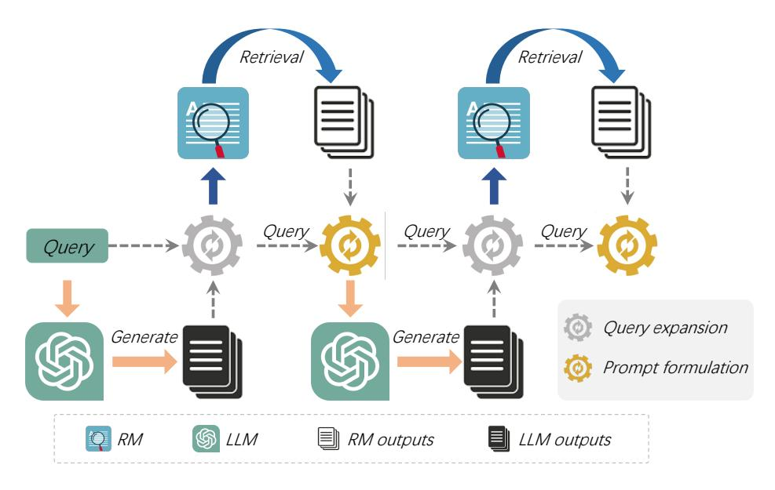
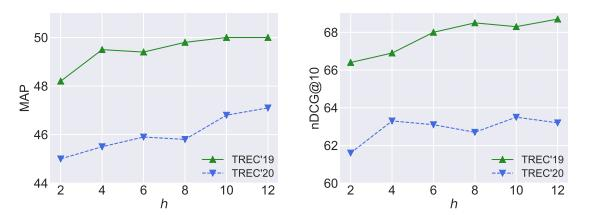

# <span id="page-0-0"></span>Synergistic Interplay between Search and Large Language Models for Information Retrieval

Jiazhan Feng♣[\\*](#page-0-0), Chongyang Tao♠[\\*†](#page-0-0) , Xiubo Geng△, Tao Shen♢, Can Xu♣, Guodong Long♢, Dongyan Zhao♣♡, Daxin Jiang△ ♠SKLSDE Lab, Beihang University ♣Peking University △Microsoft ♢AAII, FEIT, University of Technology Sydney ♡National Key Laboratory of General Artificial Intelligence {chongyang}@buaa.edu.cn {fengjiazhan,zhaody}@pku.edu.cn {xigeng,djiang}@microsoft.com {tao.shen,guodong.long}@uts.edu.au

# Abstract

Information retrieval (IR) plays a crucial role in locating relevant resources from vast amounts of data, and its applications have evolved from traditional knowledge bases to modern retrieval models (RMs). The emergence of large language models (LLMs) has further revolutionized the IR field by enabling users to interact with search systems in natural languages. In this paper, we explore the advantages and disadvantages of LLMs and RMs, highlighting their respective strengths in understanding user-issued queries and retrieving up-to-date information. To leverage the benefits of both paradigms while circumventing their limitations, we propose InteR, a novel framework that facilitates information refinement through synergy between RMs and LLMs. InteR allows RMs to expand knowledge in queries using LLM-generated knowledge collections and enables LLMs to enhance prompt formulation using retrieved documents. This iterative refinement process augments the inputs of RMs and LLMs, leading to more accurate retrieval. Experiments on large-scale retrieval benchmarks involving web search and low-resource retrieval tasks show that InteR achieves overall superior zero-shot retrieval performance compared to state-of-the-art methods, even those using relevance judgment. Source code is available at [https://github.](https://github.com/Cyril-JZ/InteR) [com/Cyril-JZ/InteR](https://github.com/Cyril-JZ/InteR).

### 1 Introduction

Information retrieval (IR) is an indispensable technique for locating relevant resources in a vast sea of data given ad-hoc queries [\(Mogotsi,](#page-10-0) [2010\)](#page-10-0). It is a core component in knowledge-intensive tasks such as question answering [\(Karpukhin et al.,](#page-9-0) [2020;](#page-9-0) [Cao](#page-8-0) [et al.,](#page-8-0) [2024\)](#page-8-0), entity linking [\(Gillick et al.,](#page-9-1) [2019\)](#page-9-1)

and fact verification [\(Thorne et al.,](#page-11-0) [2018\)](#page-11-0). Over the years, the techniques of IR have evolved significantly: from the traditional knowledge base (KB) [\(Lan et al.,](#page-9-2) [2021;](#page-9-2) [Gaur et al.,](#page-9-3) [2022\)](#page-9-3) to modern search engines (SEs) based on neural representation learning [\(Karpukhin et al.,](#page-9-0) [2020;](#page-9-0) [Yates et al.,](#page-12-0) [2021\)](#page-12-0), IR has become increasingly important in our digital world. More recently, the emergence of cutting-edge large language models (LLMs; e.g., ChatGPT [\(OpenAI,](#page-10-1) [2022\)](#page-10-1), GPT-4 [\(OpenAI,](#page-10-2) [2023\)](#page-10-2), Bard [\(Google,](#page-9-4) [2023\)](#page-9-4), LLaMA [\(Touvron](#page-11-1) [et al.,](#page-11-1) [2023a](#page-11-1)[,b\)](#page-11-2)) has further revolutionized the NLP community and given intriguing insights into IR applications as users can now interact with search systems in natural languages.

Over the decades, search engines like Google or Bing have become a staple for people looking to retrieve information on a variety of topics, allowing users to quickly sift through millions of documents to find the information they need by providing keywords or a query. Spurred by advancements in scale, LLMs have now exhibited the ability to undertake a variety of NLP tasks in a zero-shot scenario [\(Qin et al.,](#page-10-3) [2023\)](#page-10-3) by following instructions [\(Ouyang et al.,](#page-10-4) [2022;](#page-10-4) [Sanh et al.,](#page-11-3) [2022;](#page-11-3) [Min et al.,](#page-10-5) [2022;](#page-10-5) [Wei et al.,](#page-11-4) [2022;](#page-11-4) [Xu et al.,](#page-11-5) [2023\)](#page-11-5). Therefore, they could serve as an alternative option for people to obtain information directly by posing a question or query in natural languages [\(OpenAI,](#page-10-1) [2022\)](#page-10-1), instead of relying on specific keywords. For example, suppose a student is looking to write a research paper on *the history of jazz music*. They could type in keywords such as *"history of jazz"* or *"jazz pioneers"* to retrieve relevant articles and sources. However, with LLMs, this student could pose a question like *"Who were the key pioneers of jazz music, and how did they influence the genre?"* The LLMs could then generate a summary of the relevant information and sources, potentially sav-

<sup>\*</sup> Equal Contribution.

<sup>†</sup> Correspondence to: Chongyang Tao

ing time and effort in sifting through search results.

As with most things in life, there are two sides to every coin. Both IR technologies come with their own unique set of advantages and disadvantages. LLMs excel in understanding the context and meaning behind user-issued textual queries [\(Mao et al.,](#page-10-6) [2023;](#page-10-6) [Feng et al.,](#page-9-5) [2023;](#page-9-5) [Niu et al.,](#page-10-7) [2024\)](#page-10-7), allowing for more precise retrieval of information, while RMs expect well-designed precise keywords to deliver relevant results. Moreover, LLMs have the capacity to directly generate specific answers to questions [\(Ouyang et al.,](#page-10-4) [2022\)](#page-10-4), rather than merely present a list of relevant documents, setting them apart from RMs. However, it is important to note that RMs still have significant advantages over LLMs. For instance, RMs can index a vast number of up-to-date documents [\(Nakano et al.,](#page-10-8) [2021\)](#page-10-8), whereas LLMs can only generate information that falls within the time-scope of the data they were trained on, potentially leading to hallucinated results [\(Shuster et al.,](#page-11-6) [2021;](#page-11-6) [Ji et al.,](#page-9-6) [2023;](#page-9-6) [Zhang](#page-12-1) [et al.,](#page-12-1) [2023b](#page-12-1)[,c\)](#page-12-2). Additionally, RMs can conduct quick and efficient searches through a vast amount of information on the internet, making them an ideal choice for finding a wide range of data. Ultimately, both paradigms have their own unique set of irreplaceable advantages, making them useful in their respective areas of application.

To enhance IR by leveraging the benefits of RMs and LLMs while circumventing their limitations, we consider bridging Retrieval Augmented Generation (RAG) and LLM-augmented Retrieval. Fortunately, we observe that textual information refinement can be performed between two counterparts and boost each other. On the one hand, RMs can gather potential documents with valuable information, serving as demonstrations for LLMs. On the other hand, LLMs generate concise summaries using well-crafted prompts, expanding the initial query and improving search accuracy. To this end, we introduce InteR, a novel framework that facilitates information refinement through synergy between RMs and LLMs. Precisely, the RM part of InteR receives the knowledge collection from the LLM part to refine and expand the information in the query. While the LLM part involves the retrieved documents from the RM part as demonstrations to enrich the information in prompt formulation. This two-step refinement procedure can be seamlessly repeated to augment the inputs of RM and LLM. Implicitly, we assume that the outputs of both components supplement each other, leading

to more accurate retrieval.

We evaluate InteR on public large-scale retrieval benchmarks involving web search and lowresource retrieval tasks following prior work [\(Gao](#page-9-7) [et al.,](#page-9-7) [2023\)](#page-9-7). The experimental results show that InteR can conduct zero-shot retrieval with overall better performance than state-of-the-art methods, even those using relevance judgment[1](#page-0-0) , and achieves new state-of-the-art zero-shot retrieval performance. Overall, our main contributions can be summarized as follows:

- We introduce InteR, a novel IR framework bridging two cutting-edge IR products, search systems and large language models, while enjoying their strengths and circumventing their limitations.
- We propose iterative information refinement via synergy between retrieval models and large language models, resulting in improved retrieval quality.
- Evaluation results on zero-shot retrieval demonstrate that InteR can overall conduct more accurate retrieval than state-of-the-art approaches and even outperform baselines that leverage relevance judgment for supervised learning.

# 2 Related Work

Dense Retrieval Document retrieval has been an important component for several knowledgeintensive tasks [\(Voorhees et al.,](#page-11-7) [1999;](#page-11-7) [Karpukhin](#page-9-0) [et al.,](#page-9-0) [2020\)](#page-9-0). Traditional techniques such as TF-IDF and BM25 depend on term matching and create sparse vectors [\(Robertson,](#page-11-8) [2009;](#page-11-8) [Yang et al.,](#page-12-3) [2017;](#page-12-3) [Chen et al.,](#page-8-1) [2017\)](#page-8-1) to ensure efficient retrieval. After the emergence of pre-trained language models [\(Devlin et al.,](#page-8-2) [2019;](#page-8-2) [Liu et al.,](#page-10-9) [2019\)](#page-10-9), dense retrieval which encodes both queries and documents into low-dimension vectors and then calculates their relevance scores [\(Lee et al.,](#page-10-10) [2019;](#page-10-10) [Karpukhin](#page-9-0) [et al.,](#page-9-0) [2020;](#page-9-0) [Cai et al.,](#page-8-3) [2022\)](#page-8-3), has recently undergone substantial research. Relevant studies include improving training approach [\(Karpukhin et al.,](#page-9-0) [2020;](#page-9-0) [Xiong et al.,](#page-11-9) [2021;](#page-11-9) [Qu et al.,](#page-10-11) [2021\)](#page-10-11), distillation [\(Lin et al.,](#page-10-12) [2021;](#page-10-12) [Hofstätter et al.,](#page-9-8) [2021;](#page-9-8) [Zhang](#page-12-4) [et al.,](#page-12-4) [2023a\)](#page-12-4) and task-specific pre-training [\(Izacard](#page-9-9) [et al.,](#page-9-9) [2022;](#page-9-9) [Gao and Callan,](#page-9-10) [2021;](#page-9-10) [Lu et al.,](#page-10-13) [2021;](#page-10-13)

<sup>1</sup> In IR tasks, the relevance judgment illustrates the label of relevance between each pair of query and document, which is mainly used for supervised learning of an IR model.

[Gao and Callan,](#page-9-11) [2022;](#page-9-11) [Xiao et al.,](#page-11-10) [2022;](#page-11-10) [Shen et al.,](#page-11-11) [2022\)](#page-11-11) of dense retrieval models which significantly outperform sparse approaches.

Zero-shot Dense Retrieval Many prior works consider training dense retrieval models on highresource passage retrieval datasets like Natural Questions (NQ) [\(Kwiatkowski et al.,](#page-9-12) [2019\)](#page-9-12) (133k training examples) or MS-MARCO [\(Bajaj et al.,](#page-8-4) [2016\)](#page-8-4) (533k training examples) and then evaluating on queries from new tasks. These systems [\(Wang](#page-11-12) [et al.,](#page-11-12) [2022;](#page-11-12) [Yu et al.,](#page-12-5) [2022\)](#page-12-5) are utilized in a transfer learning configuration [\(Thakur et al.,](#page-11-13) [2021\)](#page-11-13). However, on the one hand, it is time-consuming and expensive to collect such a vast training corpus. On the other hand, even MS-MARCO has limitations on commercial use and cannot be used in a wide range of real-world applications. To this end, recent work [\(Gao et al.,](#page-9-7) [2023\)](#page-9-7) proposes building zero-shot dense retrieval systems that require no relevance supervision (i.e., relevance label between a pair of query and document), which is considered "unsupervised" as the only supervision resides in the LLM where learning to follow instructions is conducted [\(Sachan et al.,](#page-11-14) [2022\)](#page-11-14). In this work, we follow this *zero-shot unsupervised setting* and conduct information refinement through synergy between RMs and LLMs without any relevance supervision to handle the above issues.

Enhance Retrieval Through LMs Recent works have investigated using auto-regressive language models to generate intermediate targets for better retrieval [\(Cao et al.,](#page-8-5) [2021;](#page-8-5) [Bevilacqua et al.,](#page-8-6) [2022\)](#page-8-6) while identifier strings still need to be created. Other works consider "retrieving" the knowledge stored in the parameters of pre-trained language models by directly generating text [\(Petroni et al.,](#page-10-14) [2019;](#page-10-14) [Roberts et al.,](#page-11-15) [2020\)](#page-11-15). Some researchers [\(Mao](#page-10-15) [et al.,](#page-10-15) [2021;](#page-10-15) [Anantha et al.,](#page-8-7) [2021;](#page-8-7) [Wang et al.,](#page-11-16) [2023\)](#page-11-16) utilize LM to expand the query and incorporate these pseudo-queries for enhanced retrieval while others choose to expand the document [\(Nogueira](#page-10-16) [et al.,](#page-10-16) [2019\)](#page-10-16). Besides, LMs can also be exploited to provide references for retrieval targets. For instance, GENREAD [\(Yu et al.,](#page-12-6) [2023\)](#page-12-6) directly generates contextual documents for given questions.

Enhance LMs Through Retrieval On the contrary, retrieval-enhanced LMs have also received significant attention. Some approaches enhance the accuracy of predicting the distribution of the next word during training [\(Borgeaud et al.,](#page-8-8) [2022\)](#page-8-8) or

inference [\(Khandelwal et al.,](#page-9-13) [2020\)](#page-9-13) through retrieving the k-most similar training contexts. Alternative methods utilize retrieved documents to provide supplementary context in generation tasks [\(Joshi](#page-9-14) [et al.,](#page-9-14) [2020;](#page-9-14) [Guu et al.,](#page-9-15) [2020;](#page-9-15) [Lewis et al.,](#page-10-17) [2020\)](#page-10-17). WebGPT [\(Nakano et al.,](#page-10-8) [2021\)](#page-10-8) further adopts imitation learning and uses human feedback in a textbased web-browsing environment to enhance the LMs. LLM-Augmentor [\(Peng et al.,](#page-10-18) [2023\)](#page-10-18) improves LLMs with external knowledge and automated feedback. REPLUG [\(Shi et al.,](#page-11-17) [2023\)](#page-11-17) prepends retrieved documents to the input for the frozen LM and treats LM as a black box. Demonstrate–Search–Predict (DSP) [\(Khattab et al.,](#page-9-16) [2022\)](#page-9-16) obtains performance gains by relying on passing natural language texts in sophisticated pipelines between a LM and a RM, which is most closely related to our approach. However, they rely on composing two parts with in-context learning and target on multi-hop QA. While we aim at conducting information refinement via multiple interactions between RMs and LLMs for large-scale retrieval.

# 3 Preliminary

Document Retrieval: the RM Part Zero-shot document retrieval is a crucial component of search systems. Given the user query q and the document set D = {d1, ..., dn} where n is the number of document candidates, the goal of a retrieval model (RM) is to retrieve documents that are relevant to satisfy the user's real search intent of the current query q. To accomplish such document retrieval, prior works can be categorized into two groups: sparse retrieval and dense retrieval. Both lines of research elaborate on devising the similarity function ϕ(q, d) for each query-document pair.

The sparse retrieval, e.g., TF-IDF and BM25, depends on lexicon overlap between query q and document d. This line of RMs [\(Zhou et al.,](#page-12-7) [2022;](#page-12-7) [Thakur et al.,](#page-11-13) [2021\)](#page-11-13) ranks documents D based on their relevance to a given query q by integrating term frequency and inverse document frequency. Another works [\(Qu et al.,](#page-10-11) [2021;](#page-10-11) [Ni et al.,](#page-10-19) [2022;](#page-10-19) [Karpukhin et al.,](#page-9-0) [2020\)](#page-9-0) focus on dense retrieval that uses two encoding modules to map an input query q and a document d into a pair of vectors ⟨vq, vd⟩, whose inner product is leveraged as a similarity function ϕ:

$$\phi(q, d) = \langle E_Q(q), E_D(d) \rangle = \langle \mathbf{v_q}, \mathbf{v_d} \rangle$$
 (1)

Then the top-k documents, denoted as D¯ that have the highest similarity scores when compared with

<span id="page-3-0"></span>

Figure 1: Overall architecture of InteR.

the query q, are retrieved by RMs regardless of whether the retrieval is sparse or dense. Noting that as for dense retrieval, following existing methods (Gao et al., 2023), we pre-compute each document's vector  $\mathbf{v_d}$  for efficient retrieval and build the FAISS index (Johnson et al., 2019) over these vectors, and use Contriever (Izacard et al., 2022) as the backbone of query encoder  $E_Q$  and document encoder  $E_D$ .

Generative Retrieval: the LLM Part Generative search is a new paradigm of IR that employs neural generative models as search indices (Tay et al., 2022; Bevilacqua et al., 2022; Lee et al., 2022). Recent studies propose that LLMs further trained to follow instructions could zero-shot generalize to diverse unseen instructions (Ouyang et al., 2022; Sanh et al., 2022; Min et al., 2022; Wei et al., 2022). Therefore, we prepare textual prompts p that include instructions for the desired behavior to q and obtain a refined query q'. Then the LLMs G such as ChatGPT (OpenAI, 2022) take in q' and generate related knowledge passage s. This process can be illustrated as follows:

<span id="page-3-1"></span>
$$s = G(q') = G(q \oplus p) \tag{2}$$

where  $\oplus$  is the prompt formulation operation for q and p. For each q', if we sample h examples via LLM G, we will obtain a knowledge collection  $S = \{s_1, s_2, ..., s_h\}$ .

#### 4 InteR

On top of the preliminaries, we introduce **InteR**, a novel IR framework that iteratively performs information refinement through synergy between RMs and LLMs. The overview is shown in Figure 1. During each iteration, the RM part and LLM part refine their information in the query through interplay with knowledge collection (via LLMs) or retrieved documents (via RMs) from previous iteration. Specifically, in RM part, InteR refines the information stored in query q with knowledge collection S generated by LLM for better document retrieval. While in LLM part, InteR refines the information in original query q with retrieved document  $\bar{D}$  from RM for better invoking LLM to generate most relevant knowledge. This twostep procedure can be repeated multiple times in an iterative refinement style.

# 4.1 RM Step: Refining Information in RM via

When people use search systems, the natural way is to first type in a search query q whose genre can be a question, a keyword, or a combination of both. The RMs in search systems then process the search query q and retrieve several documents  $\bar{D}$  based on their relevance  $\phi(q,d)$  to the search query q. Ideally,  $\bar{D}$  contains the necessary information related to the user-issued query q. However, it may include irrelevant information to query as the candidate documents for retrieval are chunked and fixed (Yu et al., 2023). Moreover, it may also miss

some required knowledge since the query is often fairly condensed and short (e.g., "best sushi in San Francisco").

To this end, we additionally involve the generated knowledge collection S from LLM in previous iteration and enrich the information included in q with S. Specifically, we consider expanding the query q by concatenating each  $s_i \in S$  multiple times<sup>2</sup> to q and obtaining the similarity of document d with:

<span id="page-4-1"></span>
$$\phi(q, d; S) = \phi([q; s_1; q; s_2; ..., q; s_h], d)$$

$$= \langle E_Q([q; s_1; q; s_2; ..., q; s_h]), E_D(d) \rangle$$
(3)

where  $[\cdot;\cdot]$  is a concatenating operation for query expansion. Now the query is knowledge-intensive equipping with S from LLM part that may be supplement to q. We hope the knowledge collection S can provide directly relevant information to the input query q and help the RMs focus on the domain or topic in user query q.

# 4.2 LLM Step: Refining Information in LLM via RM

As aforementioned, we can invoke LLMs to conditionally generate knowledge collection S by preparing a prompt p that adapts the LLM to a specific function (Eq. 2). Despite the remarkable text generation capability, they are also prone to hallucination and still struggle to represent the complete long tail of knowledge contained within their training corpus (Shi et al., 2023). To mitigate the aforementioned issues, we argue that  $\bar{D}$ , the documents retrieved by RMs, may provide rich information about the original query q and can potentially help the LLMs make a better prediction.

Specifically, we include the knowledge in D into p by designing a new prompt as:

```
Given a question {query} and its possible answering passages {passages}
Please write a correct answering passage:
```

where "{query}" and "{passages}" are the placeholders for q and  $\bar{D}$  respectively from last RM step:

<span id="page-4-0"></span>
$$s = G(q') = G(q \oplus p \oplus \bar{D}) \tag{4}$$

Now the query q' is refined and contains more plentiful information about q through retrieved docu-

ments  $\bar{D}$  as demonstrations. Here we simply concatenate  $\bar{D}$  for placeholder "{passages}", which contains k retrieved documents from RM part for input of LLM G.

#### 4.3 Iterative Interplay Between RM and LLM

In this section, we explain how iterative refinement can be used to improve both RM and LLM parts. This iterative procedure can be interpreted as exploiting the current query q and previous-generated knowledge collection S to retrieve another document set  $\bar{D}$  with RM part for the subsequent stage of LLM step. Then, the LLM part leverages the retrieved documents  $\bar{D}$  from previous stage of RM and synthesizes the knowledge collection S for next RM step. A critical point is that we take LLM as the starting point and use only q and let  $\bar{D}$  be empty as the initial RM input. Therefore, the prompt of first LLM step is formulated as:

Please write a passage to answer the question. Question: {query} Passage:

We propose using an iterative IR pipeline, with each iteration consisting of four steps listed below:

- 1. Invoke LLM to conditionally generate knowledge collection S with prompt q' on Eq. 4. The retrieved document set  $\bar{D}$  is derived from previous RM step and set as empty in the beginning.
- 2. Construct the updated input for RM with knowledge collection *S* and query *q* to compute the similarity of each document *d*.
- 3. Invoke RM to retrieve the top-k most "relevant" documents as  $\bar{D}$  on Eq. 3.
- 4. Formulate a new prompt q' by combining the retrieved document set  $\bar{D}$  with query q.

The iterative nature of this multi-step process enables the refinement of information through the synergy between the RMs and the LLMs, which can be executed repeatedly M times to further enhance the quality of results.

#### 5 Experiments

#### 5.1 Datasets and Metrics

Following Gao et al. (2023), we adopt widely-used web search query sets TREC Deep Learning 2019

 $<sup>^2</sup>$ In our preliminaries, we observed that concatenating each  $s_i \in S$  multiple times to q can lead to improved performance, as the query is the most crucial component in IR.

<span id="page-5-0"></span>

| Methods                                |       | DL'19   |       | DL'20 |         |       |
|----------------------------------------|-------|---------|-------|-------|---------|-------|
|                                        |       | nDCG@10 | R@1k  | MAP   | nDCG@10 | R@1k  |
| w/o relevance judgment                 |       |         |       |       |         |       |
| BM25 (Robertson and Zaragoza, 2009)    | 30.1  | 50.6    | 75.0  | 28.6  | 48.0    | 78.6  |
| BM25 + PRF                             | 35.6  | 53.7    | 79.3  | 31.2  | 47.2    | 80.7  |
| Contriever (Izacard et al., 2022)      | 24.0  | 44.5    | 74.6  | 24.0  | 42.1    | 75.4  |
| HyDE (Gao et al., 2023)                | 41.8  | 61.3    | 88.0  | 38.2  | 57.9    | 84.4  |
| InteR (Vicuna-13B-v1.5 from LLaMa-2)   | 43.5  | 66.4    | 84.7  | 39.4  | 57.1    | 85.2  |
| InteR (Vicuna-33B-v1.3 from LLaMa-1)   | 45.8  | 68.9    | 85.6  | 45.1  | 64.0    | 87.9  |
| InteR (gpt-3.5-turbo)                  | 50.0  | 68.3    | 89.3  | 46.8  | 63.5    | 88.8  |
| w/ relevance judgment                  |       |         |       |       |         |       |
| DPR (Karpukhin et al., 2020)           | 36.5  | 62.2    | 76.9  | 41.8  | 65.3¶   | 81.4  |
| ANCE (Xiong et al., 2021)              | 37.1  | 64.5¶   | 75.5  | 40.8  | 64.6    | 77.6  |
| ContrieverFT (Izacard et al.,<br>2022) | 41.7¶ | 62.1    | 83.6¶ | 43.6¶ | 63.2    | 85.8¶ |

Table 1: Experimental results on TREC Deep Learning 2019 (DL'19) and 2020 (DL'20) datasets (%). The best results are marked in bold and the best performing w/ relevance judgment are marked with ¶. The improvement is statistically significant compared with the baselines w/o relevance judgment (t-test with p-value < 0.05)

(DL'19) [\(Craswell et al.,](#page-8-9) [2020\)](#page-8-9) and Deep Learning 2020 (DL'20) [\(Craswell et al.,](#page-8-10) [2021\)](#page-8-10) which are based on the MS-MARCO [\(Bajaj et al.,](#page-8-4) [2016\)](#page-8-4). Besides, we also use six diverse low-resource retrieval datasets from the BEIR benchmark [\(Thakur et al.,](#page-11-13) [2021\)](#page-11-13) strictly consistent with [Gao et al.](#page-9-7) [\(2023\)](#page-9-7) including SciFact (fact-checking), ArguAna (argument retrieval), TREC-COVID (bio-medical IR), FiQA (financial question-answering), DBPedia (entity retrieval), and TREC-NEWS (news retrieval). It is worth pointing out that we do not employ any training query-document pairs, as we conduct retrieval in a zero-shot setting and directly evaluate our proposed method on these test sets. Consistent with prior works, we report MAP, nDCG@10, and Recall@1000 (R@1k) for TREC DL'19 and DL'20 data, and nDCG@10 is employed for all datasets in the BEIR benchmark.

# 5.2 Baselines

Methods without relevance judgment We consider several zero-shot retrieval models as our main baselines, because we do not involve any query-document relevance scores (denoted as *w/o relevance judgment*) in our setting. Particularly, we choose heuristic-based lexical retriever BM25 [\(Robertson and Zaragoza,](#page-11-19) [2009\)](#page-11-19) (and with pseudo relevance feedback[3](#page-0-0) , denoted as BM25 + PRF), and Contriever [\(Izacard et al.,](#page-9-9) [2022\)](#page-9-9) that

is trained using unsupervised contrastive learning. We also compare our model with the state-of-theart LLM-based retrieval model HyDE [\(Gao et al.,](#page-9-7) [2023\)](#page-9-7) which shares the exact same embedding spaces with Contriever but builds query vectors with LLMs.

Methods with relevance judgment Moreover, we also incorporate several systems that utilize fine-tuning on extensive query-document relevance data, such as MS-MARCO, as references (denoted as *w/ relevance judgment*). This group encompasses some commonly used fully-supervised retrieval methods, including DPR [\(Karpukhin et al.,](#page-9-0) [2020\)](#page-9-0), ANCE [\(Xiong et al.,](#page-11-9) [2021\)](#page-11-9), and the finetuned Contriever [\(Izacard et al.,](#page-9-9) [2022\)](#page-9-9) (denoted as ContrieverFT).

#### 5.3 Implementation Details

As for the LLM part, we evaluate our proposed method on two options: closed-source models and open-source models. In the case of closed-source models, we employ the gpt-3.5-turbo, as it is popular and accessible to the general public. As for the open-source models, our choice fell upon the Vicuna models [\(Chiang et al.,](#page-8-11) [2023\)](#page-8-11) derived from instruction tuning with LLaMa-1/2 [\(Touvron](#page-11-1) [et al.,](#page-11-1) [2023a,](#page-11-1)[b\)](#page-11-2). Specifically, we assessed the most promising 13B version of Vicuna from LLaMa-2, namely, Vicuna-13B-v1.5. Additionally, we evaluated the current best-performing 33B version of Vicuna derived from LLaMa-1, which is Vicuna-33B-v1.3. As for the RM part, we con-

<sup>3</sup>As reported in the official Anserini report: [https://github.com/castorini/anserini/blob/](https://github.com/castorini/anserini/blob/279fc3eecaed4d07c0a9c42017447b6ae87b820c/docs/regressions/) [279fc3eecaed4d07c0a9c42017447b6ae87b820c/docs/](https://github.com/castorini/anserini/blob/279fc3eecaed4d07c0a9c42017447b6ae87b820c/docs/regressions/) [regressions/](https://github.com/castorini/anserini/blob/279fc3eecaed4d07c0a9c42017447b6ae87b820c/docs/regressions/)

<span id="page-6-0"></span>

| Methods                                         | SciFact           | ArguAna           | TREC-COVID        | FiQA              | DBPedia           | TREC-NEWS         |
|-------------------------------------------------|-------------------|-------------------|-------------------|-------------------|-------------------|-------------------|
| w/o relevance judgment                          |                   |                   |                   |                   |                   |                   |
| BM25 (Robertson and Zaragoza, 2009)             | 67.9              | 39.7              | 59.5              | 23.6              | 31.8              | 39.5              |
| Contriever (Izacard et al., 2022)               | 64.9              | 37.9              | 27.3              | 24.5              | 29.2              | 34.8              |
| HyDE (Gao et al., 2023)                         | 69.1              | 46.6              | 59.3              | 27.3              | 36.8              | 44.0              |
| InteR (Vicuna-13B-v1.5 from LLaMa-2)            | 69.3              | 42.7              | 70.1              | 23.6              | 39.6              | 51.9              |
| <pre>InteR (Vicuna-33B-v1.3 from LLaMa-1)</pre> | 70.3              | 39.9              | 67.4              | 26.0              | 40.1              | 51.4              |
| InteR (gpt-3.5-turbo)                           | 71.7              | 40.9              | 69.7              | 26.0              | 42.1              | 52.8              |
| w/ relevance judgment                           |                   |                   |                   |                   |                   |                   |
| DPR (Karpukhin et al., 2020)                    | 31.8              | 17.5              | 33.2              | 29.5              | 26.3              | 16.1              |
| ANCE (Xiong et al., 2021)                       | 50.7              | 41.5              | 65.4 <sup>¶</sup> | 30.0              | 28.1              | 38.2              |
| Contriever <sup>FT</sup> (Izacard et al., 2022) | 67.7 <sup>¶</sup> | 44.6 <sup>¶</sup> | 59.6              | 32.9 <sup>¶</sup> | 41.3 <sup>¶</sup> | 42.8 <sup>¶</sup> |

Table 2: Experimental results (nDCG@10) on low-resource tasks from BEIR (%). The best results are marked in **bold** and the best performing w/ relevance judgment are marked with  $\P$ .

sider BM25 for retrieval since it is much faster. For each q', we sample h=10 knowledge examples via LLM. After hyper-parameter search on validation sets, we set k as 15 for gpt-3.5-turbo, and 5 for Vicuna-13B-v1.5 and Vicuna-33B-v1.3. We also set M as 2 by default. We use a temperature of 1 for LLM part in generation and a frequency penalty of zero. We also truncate each RM-retrieved passage/document to 256 tokens and set the maximum number of tokens for each LLM-generated knowledge example to 256 for efficiency.

#### 5.4 Main Results

Web Search In Table 1, we show zero-shot retrieval results on TREC DL'19 and TREC DL'20 with baselines. We can find that InteR with selected LLMs surpass state-of-the-art zero-shot baseline HyDE with significant improvement on most metrics. Specifically, InteR with gpt-3.5-turbo has an > 8% absolute MAP gain and > 5% absolute nDCG@10 gain on both web search benchmarks. Moreover, InteR is also superior to models with relevance judgment on most metrics, which verifies the generalization ability of InteR on large-scale retrieval. Note that our approach does not involve any training process and merely leverages off-the-shelf RMs and LLMs, which is simpler in practice but shown to be more effective.

Low-Resource Retrieval In Table 2, we also present the zero-shot retrieval results on six diverse low-resource retrieval tasks from BEIR benchmarks. Firstly, we find that InteR is especially competent on TREC-COVID and TREC-NEWS and even significantly outperforms baselines with relevance judgment. Secondly, InteR also brings considerable improvements to baselines on SciFact

<span id="page-6-1"></span>

Figure 2: Performance of InteR with gpt-3.5-turbo across different size of knowledge collection (h) on TREC DL'19 and DL'20.

and DBPedia, which shows our performance advantages on fact-checking and entity retrieval. Finally, it can be observed that the performance of FiQA and ArguAna falls short when compared to the baseline models. This could potentially be attributed to the LLM's limited financial knowledge of FiQA and the RM's marginal qualification to effectively handle relatively longer queries for ArguAna (Thakur et al., 2021).

#### 5.5 Further Discussions

#### The impact of the size of knowledge collection

(h) We conducted additional research to examine the impact of the size of knowledge collection (i.e., h) on the performance of InteR. Figure 2 illustrates the changes in MAP and nDCG@10 curves of InteR with gpt-3.5-turbo on TREC DL'19 and DL'20, with respect to varying numbers of knowledge examples. Our observations reveal a consistent pattern in both benchmarks: as the number of generated knowledge increases, the performance metrics demonstrate a gradual improvement until reaching 10 knowledge examples. Subsequently, the performance metrics stabilize, indicating that additional knowledge examples do not significantly

<span id="page-7-0"></span>

| Methods         |      | DL'19   |      |      | DL'20   |      |  |  |
|-----------------|------|---------|------|------|---------|------|--|--|
| Methods         | MAP  | nDCG@10 | R@1k | MAP  | nDCG@10 | R@1k |  |  |
| InteR $(M=0)$   | 30.1 | 50.6    | 75.0 | 28.6 | 48.0    | 78.6 |  |  |
| InteR $(M=1)$   | 45.8 | 65.3    | 89.3 | 42.6 | 61.0    | 88.7 |  |  |
| InteR $(M=2)^*$ | 50.0 | 68.3    | 89.3 | 46.8 | 63.5    | 88.8 |  |  |
| InteR $(M=3)$   | 49.1 | 68.2    | 88.0 | 42.8 | 59.3    | 85.6 |  |  |

Table 3: Performance of InteR with gpt-3.5-turbo across different number of knowledge refinement iterations (M) on DL'19 and DL'20. The default setting is marked with \* and the best results are marked in **bold**.

<span id="page-7-1"></span>

| Methods        | DL'19 |             |      | DL'20 |         |      |  |
|----------------|-------|-------------|------|-------|---------|------|--|
| 1,100110dis    | MAP   | nDCG@10 R@1 | R@1k | MAP   | nDCG@10 | R@1k |  |
| InteR (Sparse) | 46.9  | 66.6        | 89.4 | 42.3  | 60.4    | 85.4 |  |
| InteR (Dense)* | 50.0  | 68.3        | 89.3 | 46.8  | 63.5    | 88.8 |  |
| InteR (Hybrid) | 48.3  | 67.6        | 89.1 | 45.1  | 62.5    | 85.2 |  |

Table 4: Performance of InteR with gpt-3.5-turbo across different retrieval strategies for constructing  $\bar{D}$  on Eq. 4 on TREC DL'19 and DL'20. The default setting is marked with \* and the best results are marked in **bold**.

enhance the results. This phenomenon could be attributed to the presence of redundant knowledge within the surplus examples generated by LLMs.

The impact of the number of information refinement iterations (M) We also investigated the effect of different numbers of information refinement iterations (M) on the performance of InteR. The results of InteR with gpt-3.5-turbo presented in Table 3 indicate a notable enhancement in retrieval capacity as M increases from 0 to 2, which verifies the effectiveness of multiple iterative information refinement between RMs and LLMs. However, if we further increase M, the performance may not improve, possibly due to a decrease in the diversity of retrieved documents from RMs. Here if we set M to 0, InteR will degenerate into BM25.

Dense retrieval v.s. sparse retrieval Furthermore, we delve into the impact of the retrieval strategy for constructing  $\bar{D}$  on Eq. 4 on the performance of InteR. Table 4 shows the experimental results of InteR with gpt-3.5-turbo, where we initiate the RM with an unsupervised sparse RM (i.e., BM25) or an unsupervised dense RM (i.e., Contriever). Additionally, we introduce a hybrid retrieval paradigm that combines half of the documents from the sparse RM with the other half from the dense RM. These components are then merged to generate the output of the hybrid RM, namely InteR (Hybrid). We can observe that the dense model is the best strategy for InteR and even outperforms the hybrid counterpart, which is consistent with the

observations from prior works (Karpukhin et al., 2020). Therefore, we use a dense RM to construct  $\bar{D}$  as default. It is noteworthy that we only use a dense RM for constructing  $\bar{D}$  during information refinement and leave the final RM as a sparse BM25 for efficiency.

Case: query\_id: 1112341, query: "what is the daily life of thai people"

**LLM outputs of** M=1: The daily life of Thai people is heavily influenced by their culture and traditions. The majority of the population practices Buddhism, and daily prayer and meditation are common. Family is also extremely important, and many Thai people live with extended family members. In terms of food, Thai cuisine is known for its spicy and savory flavors, and meals often revolve around rice and noodles. Street food is also a big part of daily life, with vendors selling snacks and meals on every corner. Work is an important aspect of daily life as well, and many Thai people work long hours in industries such as agriculture, tourism, and manufacturing. Despite the demands of work, there is a strong emphasis on taking breaks throughout the day to socialize and interact with others. Overall, the daily life of Thai people is a harmonious blend of religious practice, family values, flavorful cuisine, and hard work.

**LLM outputs of** M=2: Thailand's daily life is influenced by its diverse geography and cultural influences from India, China, Cambodia, and the rest of Southeast Asia. The country's national religion, Theravada Buddhism, is central to modern Thai identity. Social occasions in Thailand often revolve around food, which is ordered and eaten in a communal style. Thai food presentation is among the most exquisite in the world, developed primarily in the palace to please the King of Siam. Thai people love to have fun together and often ask each other if they had a good time. The population of Thailand is approximately 67.5 million people, including ethnic groups such as Chinese, Malay, Lao, Burma, Cambodia, and Indians. Unemployment rate in Thailand is relatively low, standing at 0.84% according to Thailand's National Economic and Social Development Board (NESDB). That time is divided into five sections, with different names for each section of the day. The country's primary religion is Theravada Buddhism, and important holidays include Thai New Year, or Songkran. Overall, the daily life of Thai people is diverse, vibrant and deeply rooted in their rich cultural heritage.

Case Study on LLM Outputs To better illustrate how RMs enrich the outputs of LLMs, we selected an example from TREC DL'19 and compared those outputs of gpt-3.5-turbo after the first and second iterations. Due to the limited space, we only show the first LLM-generated knowledge (i.e.,  $s_1$ ). In the initial iteration (M=1), the LLM demonstrated its capacity to generate paragraphs by leveraging its commonsense encoded within its parameters. After taking the search results of RM (documents about 'Thailand') in the prompt, LLM outputs in the second iteration M=2 became more informative. Specifically, the text highlighted

in yellow elaborated on *Thailand's population and unemployment rate*, which was absent in the first iteration, and facilitated the next RM step.

# 6 Conclusion

In this work, we present InteR, a novel framework that harnesses the strengths of both large language models (LLMs) and retrieval models (RMs) to enhance information retrieval. By facilitating information refinement through synergy between LLMs and RMs, InteR achieves overall superior zero-shot retrieval performance compared to state-of-the-art methods, and even those using relevance judgment, on large-scale retrieval benchmarks involving web search and low-resource retrieval tasks. With its ability to leverage the benefits of both paradigms, InteR may present a potential direction for advancing information retrieval systems.

## Limitations

While InteR demonstrates improved zero-shot retrieval performance, it should be noted that its effectiveness heavily relies on the quality of the used large language models (LLMs). If these underlying components contain biases, inaccuracies, or limitations in their training data, it could impact the reliability and generalizability of the retrieval results. In that case, one may need to design a more sophisticated method of information refinement, especially the prompt formulation part. We leave this exploration for future work.

### Acknowledgements

We would like to thank the anonymous reviewers for their constructive comments and suggestions. This work was supported by the National Key R&D Program of China (No.2022YFC3301905). Jiazhan Feng and Dongyan Zhao are also with the Wangxuan Institute of Computer Technology, Peking University.

# References

<span id="page-8-7"></span>Raviteja Anantha, Svitlana Vakulenko, Zhucheng Tu, Shayne Longpre, Stephen Pulman, and Srinivas Chappidi. 2021. [Open-domain question answering](https://doi.org/10.18653/v1/2021.naacl-main.44) [goes conversational via question rewriting.](https://doi.org/10.18653/v1/2021.naacl-main.44) In *Proceedings of the 2021 Conference of the North American Chapter of the Association for Computational Linguistics: Human Language Technologies*, pages 520–534, Online. Association for Computational Linguistics.

- <span id="page-8-4"></span>Payal Bajaj, Daniel Campos, Nick Craswell, Li Deng, Jianfeng Gao, Xiaodong Liu, Rangan Majumder, Andrew McNamara, Bhaskar Mitra, Tri Nguyen, et al. 2016. Ms marco: A human generated machine reading comprehension dataset. *arXiv preprint arXiv:1611.09268*.
- <span id="page-8-6"></span>Michele Bevilacqua, Giuseppe Ottaviano, Patrick Lewis, Scott Yih, Sebastian Riedel, and Fabio Petroni. 2022. Autoregressive search engines: Generating substrings as document identifiers. *Advances in Neural Information Processing Systems*, 35:31668–31683.
- <span id="page-8-8"></span>Sebastian Borgeaud, Arthur Mensch, Jordan Hoffmann, Trevor Cai, Eliza Rutherford, Katie Millican, George Bm Van Den Driessche, Jean-Baptiste Lespiau, Bogdan Damoc, Aidan Clark, et al. 2022. Improving language models by retrieving from trillions of tokens. In *International conference on machine learning*, pages 2206–2240. PMLR.
- <span id="page-8-3"></span>ZeFeng Cai, Chongyang Tao, Tao Shen, Can Xu, Xiubo Geng, Xin Alex Lin, Liang He, and Daxin Jiang. 2022. Hyper: Multitask hyper-prompted training enables large-scale retrieval generalization. In *The Eleventh International Conference on Learning Representations*.
- <span id="page-8-0"></span>Bowen Cao, Deng Cai, Leyang Cui, Xuxin Cheng, Wei Bi, Yuexian Zou, and Shuming Shi. 2024. [Retrieval](https://openreview.net/forum?id=oXYZJXDdo7) [is accurate generation.](https://openreview.net/forum?id=oXYZJXDdo7) In *The Twelfth International Conference on Learning Representations*.
- <span id="page-8-5"></span>Nicola De Cao, Gautier Izacard, Sebastian Riedel, and Fabio Petroni. 2021. [Autoregressive entity retrieval.](https://openreview.net/forum?id=5k8F6UU39V) In *International Conference on Learning Representations*.
- <span id="page-8-1"></span>Danqi Chen, Adam Fisch, Jason Weston, and Antoine Bordes. 2017. [Reading Wikipedia to answer open](https://doi.org/10.18653/v1/P17-1171)[domain questions.](https://doi.org/10.18653/v1/P17-1171) In *Proceedings of the 55th Annual Meeting of the Association for Computational Linguistics (Volume 1: Long Papers)*, pages 1870–1879, Vancouver, Canada. Association for Computational Linguistics.
- <span id="page-8-11"></span>Wei-Lin Chiang, Zhuohan Li, Zi Lin, Ying Sheng, Zhanghao Wu, Hao Zhang, Lianmin Zheng, Siyuan Zhuang, Yonghao Zhuang, Joseph E. Gonzalez, Ion Stoica, and Eric P. Xing. 2023. [Vicuna: An open](https://lmsys.org/blog/2023-03-30-vicuna/)[source chatbot impressing gpt-4 with 90%\\* chatgpt](https://lmsys.org/blog/2023-03-30-vicuna/) [quality.](https://lmsys.org/blog/2023-03-30-vicuna/)
- <span id="page-8-10"></span>Nick Craswell, Bhaskar Mitra, Emine Yilmaz, and Daniel Campos. 2021. Overview of the trec 2020 deep learning track. *arXiv preprint arXiv:2102.07662*.
- <span id="page-8-9"></span>Nick Craswell, Bhaskar Mitra, Emine Yilmaz, Daniel Campos, and Ellen M Voorhees. 2020. Overview of the trec 2019 deep learning track. *arXiv preprint arXiv:2003.07820*.
- <span id="page-8-2"></span>Jacob Devlin, Ming-Wei Chang, Kenton Lee, and Kristina Toutanova. 2019. [BERT: Pre-training of](https://doi.org/10.18653/v1/N19-1423)

- [deep bidirectional transformers for language under](https://doi.org/10.18653/v1/N19-1423)[standing.](https://doi.org/10.18653/v1/N19-1423) In *Proceedings of the 2019 Conference of the North American Chapter of the Association for Computational Linguistics: Human Language Technologies, Volume 1 (Long and Short Papers)*, pages 4171–4186, Minneapolis, Minnesota. Association for Computational Linguistics.
- <span id="page-9-5"></span>Jiazhan Feng, Ruochen Xu, Junheng Hao, Hiteshi Sharma, Yelong Shen, Dongyan Zhao, and Weizhu Chen. 2023. Language models can be logical solvers. *arXiv preprint arXiv:2311.06158*.
- <span id="page-9-10"></span>Luyu Gao and Jamie Callan. 2021. [Condenser: a pre](https://doi.org/10.18653/v1/2021.emnlp-main.75)[training architecture for dense retrieval.](https://doi.org/10.18653/v1/2021.emnlp-main.75) In *Proceedings of the 2021 Conference on Empirical Methods in Natural Language Processing*, pages 981–993, Online and Punta Cana, Dominican Republic. Association for Computational Linguistics.
- <span id="page-9-11"></span>Luyu Gao and Jamie Callan. 2022. [Unsupervised cor](https://doi.org/10.18653/v1/2022.acl-long.203)[pus aware language model pre-training for dense pas](https://doi.org/10.18653/v1/2022.acl-long.203)[sage retrieval.](https://doi.org/10.18653/v1/2022.acl-long.203) In *Proceedings of the 60th Annual Meeting of the Association for Computational Linguistics (Volume 1: Long Papers)*, pages 2843–2853, Dublin, Ireland. Association for Computational Linguistics.
- <span id="page-9-7"></span>Luyu Gao, Xueguang Ma, Jimmy Lin, and Jamie Callan. 2023. [Precise zero-shot dense retrieval without rel](https://doi.org/10.18653/v1/2023.acl-long.99)[evance labels.](https://doi.org/10.18653/v1/2023.acl-long.99) In *Proceedings of the 61st Annual Meeting of the Association for Computational Linguistics (Volume 1: Long Papers)*, pages 1762–1777, Toronto, Canada. Association for Computational Linguistics.
- <span id="page-9-3"></span>Manas Gaur, Kalpa Gunaratna, Vijay Srinivasan, and Hongxia Jin. 2022. Iseeq: Information seeking question generation using dynamic meta-information retrieval and knowledge graphs. In *Proceedings of the AAAI Conference on Artificial Intelligence*, volume 36, pages 10672–10680.
- <span id="page-9-1"></span>Daniel Gillick, Sayali Kulkarni, Larry Lansing, Alessandro Presta, Jason Baldridge, Eugene Ie, and Diego Garcia-Olano. 2019. [Learning dense representations](https://doi.org/10.18653/v1/K19-1049) [for entity retrieval.](https://doi.org/10.18653/v1/K19-1049) In *Proceedings of the 23rd Conference on Computational Natural Language Learning (CoNLL)*, pages 528–537, Hong Kong, China. Association for Computational Linguistics.
- <span id="page-9-4"></span>Google. 2023. [Google bard.](https://bard.google.com/) *https://bard.google.com/*.
- <span id="page-9-15"></span>Kelvin Guu, Kenton Lee, Zora Tung, Panupong Pasupat, and Mingwei Chang. 2020. Retrieval augmented language model pre-training. In *International conference on machine learning*, pages 3929–3938. PMLR.
- <span id="page-9-8"></span>Sebastian Hofstätter, Sheng-Chieh Lin, Jheng-Hong Yang, Jimmy Lin, and Allan Hanbury. 2021. Efficiently teaching an effective dense retriever with balanced topic aware sampling. In *Proceedings of the 44th International ACM SIGIR Conference on Research and Development in Information Retrieval*, pages 113–122.

- <span id="page-9-9"></span>Gautier Izacard, Mathilde Caron, Lucas Hosseini, Sebastian Riedel, Piotr Bojanowski, Armand Joulin, and Edouard Grave. 2022. [Unsupervised dense informa](https://openreview.net/forum?id=jKN1pXi7b0)[tion retrieval with contrastive learning.](https://openreview.net/forum?id=jKN1pXi7b0) *Transactions on Machine Learning Research*.
- <span id="page-9-6"></span>Ziwei Ji, Nayeon Lee, Rita Frieske, Tiezheng Yu, Dan Su, Yan Xu, Etsuko Ishii, Ye Jin Bang, Andrea Madotto, and Pascale Fung. 2023. Survey of hallucination in natural language generation. *ACM Computing Surveys*, 55(12):1–38.
- <span id="page-9-17"></span>Jeff Johnson, Matthijs Douze, and Hervé Jégou. 2019. Billion-scale similarity search with gpus. *IEEE Transactions on Big Data*, 7(3):535–547.
- <span id="page-9-14"></span>Mandar Joshi, Kenton Lee, Yi Luan, and Kristina Toutanova. 2020. Contextualized representations using textual encyclopedic knowledge. *arXiv preprint arXiv:2004.12006*.
- <span id="page-9-0"></span>Vladimir Karpukhin, Barlas Oguz, Sewon Min, Patrick Lewis, Ledell Wu, Sergey Edunov, Danqi Chen, and Wen-tau Yih. 2020. [Dense passage retrieval for open](https://doi.org/10.18653/v1/2020.emnlp-main.550)[domain question answering.](https://doi.org/10.18653/v1/2020.emnlp-main.550) In *Proceedings of the 2020 Conference on Empirical Methods in Natural Language Processing (EMNLP)*, pages 6769–6781, Online. Association for Computational Linguistics.
- <span id="page-9-13"></span>Urvashi Khandelwal, Omer Levy, Dan Jurafsky, Luke Zettlemoyer, and Mike Lewis. 2020. [Generalization](https://openreview.net/forum?id=HklBjCEKvH) [through memorization: Nearest neighbor language](https://openreview.net/forum?id=HklBjCEKvH) [models.](https://openreview.net/forum?id=HklBjCEKvH) In *International Conference on Learning Representations*.
- <span id="page-9-16"></span>Omar Khattab, Keshav Santhanam, Xiang Lisa Li, David Hall, Percy Liang, Christopher Potts, and Matei Zaharia. 2022. Demonstrate-searchpredict: Composing retrieval and language models for knowledge-intensive nlp. *arXiv preprint arXiv:2212.14024*.
- <span id="page-9-12"></span>Tom Kwiatkowski, Jennimaria Palomaki, Olivia Redfield, Michael Collins, Ankur Parikh, Chris Alberti, Danielle Epstein, Illia Polosukhin, Jacob Devlin, Kenton Lee, Kristina Toutanova, Llion Jones, Matthew Kelcey, Ming-Wei Chang, Andrew M. Dai, Jakob Uszkoreit, Quoc Le, and Slav Petrov. 2019. [Natu](https://doi.org/10.1162/tacl_a_00276)[ral questions: A benchmark for question answering](https://doi.org/10.1162/tacl_a_00276) [research.](https://doi.org/10.1162/tacl_a_00276) *Transactions of the Association for Computational Linguistics*, 7:452–466.
- <span id="page-9-2"></span>Yunshi Lan, Gaole He, Jinhao Jiang, Jing Jiang, Wayne Xin Zhao, and Ji-Rong Wen. 2021. [A sur](https://doi.org/10.24963/ijcai.2021/611)[vey on complex knowledge base question answering:](https://doi.org/10.24963/ijcai.2021/611) [Methods, challenges and solutions.](https://doi.org/10.24963/ijcai.2021/611) In *Proceedings of the Thirtieth International Joint Conference on Artificial Intelligence, IJCAI-21*, pages 4483–4491. International Joint Conferences on Artificial Intelligence Organization. Survey Track.
- <span id="page-9-18"></span>Hyunji Lee, Sohee Yang, Hanseok Oh, and Minjoon Seo. 2022. [Generative multi-hop retrieval.](https://aclanthology.org/2022.emnlp-main.92) In *Proceedings of the 2022 Conference on Empirical Methods in Natural Language Processing*, pages 1417–1436, Abu Dhabi, United Arab Emirates. Association for Computational Linguistics.

- <span id="page-10-10"></span>Kenton Lee, Ming-Wei Chang, and Kristina Toutanova. 2019. [Latent retrieval for weakly supervised open](https://doi.org/10.18653/v1/P19-1612) [domain question answering.](https://doi.org/10.18653/v1/P19-1612) In *Proceedings of the 57th Annual Meeting of the Association for Computational Linguistics*, pages 6086–6096, Florence, Italy. Association for Computational Linguistics.
- <span id="page-10-17"></span>Patrick Lewis, Ethan Perez, Aleksandra Piktus, Fabio Petroni, Vladimir Karpukhin, Naman Goyal, Heinrich Küttler, Mike Lewis, Wen-tau Yih, Tim Rocktäschel, et al. 2020. Retrieval-augmented generation for knowledge-intensive nlp tasks. *Advances in Neural Information Processing Systems*, 33:9459–9474.
- <span id="page-10-12"></span>Sheng-Chieh Lin, Jheng-Hong Yang, and Jimmy Lin. 2021. [In-batch negatives for knowledge distillation](https://doi.org/10.18653/v1/2021.repl4nlp-1.17) [with tightly-coupled teachers for dense retrieval.](https://doi.org/10.18653/v1/2021.repl4nlp-1.17) In *Proceedings of the 6th Workshop on Representation Learning for NLP (RepL4NLP-2021)*, pages 163–173, Online. Association for Computational Linguistics.
- <span id="page-10-9"></span>Yinhan Liu, Myle Ott, Naman Goyal, Jingfei Du, Mandar Joshi, Danqi Chen, Omer Levy, Mike Lewis, Luke Zettlemoyer, and Veselin Stoyanov. 2019. [Roberta: A robustly optimized BERT pretraining](http://arxiv.org/abs/1907.11692) [approach.](http://arxiv.org/abs/1907.11692) *CoRR*, abs/1907.11692.
- <span id="page-10-13"></span>Shuqi Lu, Di He, Chenyan Xiong, Guolin Ke, Waleed Malik, Zhicheng Dou, Paul Bennett, Tie-Yan Liu, and Arnold Overwijk. 2021. [Less is more: Pretrain a](https://doi.org/10.18653/v1/2021.emnlp-main.220) [strong Siamese encoder for dense text retrieval using](https://doi.org/10.18653/v1/2021.emnlp-main.220) [a weak decoder.](https://doi.org/10.18653/v1/2021.emnlp-main.220) In *Proceedings of the 2021 Conference on Empirical Methods in Natural Language Processing*, pages 2780–2791, Online and Punta Cana, Dominican Republic. Association for Computational Linguistics.
- <span id="page-10-6"></span>Kelong Mao, Zhicheng Dou, Haonan Chen, Fengran Mo, and Hongjin Qian. 2023. Large language models know your contextual search intent: A prompting framework for conversational search. *arXiv preprint arXiv:2303.06573*.
- <span id="page-10-15"></span>Yuning Mao, Pengcheng He, Xiaodong Liu, Yelong Shen, Jianfeng Gao, Jiawei Han, and Weizhu Chen. 2021. [Generation-augmented retrieval for open](https://doi.org/10.18653/v1/2021.acl-long.316)[domain question answering.](https://doi.org/10.18653/v1/2021.acl-long.316) In *Proceedings of the 59th Annual Meeting of the Association for Computational Linguistics and the 11th International Joint Conference on Natural Language Processing (Volume 1: Long Papers)*, pages 4089–4100, Online. Association for Computational Linguistics.
- <span id="page-10-5"></span>Sewon Min, Mike Lewis, Luke Zettlemoyer, and Hannaneh Hajishirzi. 2022. [MetaICL: Learning to learn](https://doi.org/10.18653/v1/2022.naacl-main.201) [in context.](https://doi.org/10.18653/v1/2022.naacl-main.201) In *Proceedings of the 2022 Conference of the North American Chapter of the Association for Computational Linguistics: Human Language Technologies*, pages 2791–2809, Seattle, United States. Association for Computational Linguistics.
- <span id="page-10-0"></span>IC Mogotsi. 2010. Christopher d. manning, prabhakar raghavan, and hinrich schütze: Introduction to information retrieval. *Information Retrieval*, 13(2):192– 195.

- <span id="page-10-8"></span>Reiichiro Nakano, Jacob Hilton, Suchir Balaji, Jeff Wu, Long Ouyang, Christina Kim, Christopher Hesse, Shantanu Jain, Vineet Kosaraju, William Saunders, et al. 2021. Webgpt: Browser-assisted questionanswering with human feedback. *arXiv preprint arXiv:2112.09332*.
- <span id="page-10-19"></span>Jianmo Ni, Chen Qu, Jing Lu, Zhuyun Dai, Gustavo Hernandez Abrego, Ji Ma, Vincent Zhao, Yi Luan, Keith Hall, Ming-Wei Chang, and Yinfei Yang. 2022. [Large dual encoders are generalizable retrievers.](https://aclanthology.org/2022.emnlp-main.669) In *Proceedings of the 2022 Conference on Empirical Methods in Natural Language Processing*, pages 9844–9855, Abu Dhabi, United Arab Emirates. Association for Computational Linguistics.
- <span id="page-10-7"></span>Cheng Niu, Xingguang Wang, Xuxin Cheng, Juntong Song, and Tong Zhang. 2024. Enhancing dialogue state tracking models through llm-backed user-agents simulation. *arXiv preprint arXiv:2405.13037*.
- <span id="page-10-16"></span>Rodrigo Nogueira, Wei Yang, Jimmy Lin, and Kyunghyun Cho. 2019. Document expansion by query prediction. *arXiv preprint arXiv:1904.08375*.
- <span id="page-10-1"></span>OpenAI. 2022. [Chatgpt: Optimizing language models](https://openai.com/blog/chatgpt/) [for dialogue.](https://openai.com/blog/chatgpt/) *https://openai.com/blog/chatgpt/*.
- <span id="page-10-2"></span>OpenAI. 2023. Gpt-4 technical report. *ArXiv*, abs/2303.08774.
- <span id="page-10-4"></span>Long Ouyang, Jeffrey Wu, Xu Jiang, Diogo Almeida, Carroll Wainwright, Pamela Mishkin, Chong Zhang, Sandhini Agarwal, Katarina Slama, Alex Ray, et al. 2022. Training language models to follow instructions with human feedback. *Advances in Neural Information Processing Systems*, 35:27730–27744.
- <span id="page-10-18"></span>Baolin Peng, Michel Galley, Pengcheng He, Hao Cheng, Yujia Xie, Yu Hu, Qiuyuan Huang, Lars Liden, Zhou Yu, Weizhu Chen, et al. 2023. Check your facts and try again: Improving large language models with external knowledge and automated feedback. *arXiv preprint arXiv:2302.12813*.
- <span id="page-10-14"></span>Fabio Petroni, Tim Rocktäschel, Sebastian Riedel, Patrick Lewis, Anton Bakhtin, Yuxiang Wu, and Alexander Miller. 2019. [Language models as knowl](https://doi.org/10.18653/v1/D19-1250)[edge bases?](https://doi.org/10.18653/v1/D19-1250) In *Proceedings of the 2019 Conference on Empirical Methods in Natural Language Processing and the 9th International Joint Conference on Natural Language Processing (EMNLP-IJCNLP)*, pages 2463–2473, Hong Kong, China. Association for Computational Linguistics.
- <span id="page-10-3"></span>Chengwei Qin, Aston Zhang, Zhuosheng Zhang, Jiaao Chen, Michihiro Yasunaga, and Diyi Yang. 2023. Is chatgpt a general-purpose natural language processing task solver? *arXiv preprint arXiv:2302.06476*.
- <span id="page-10-11"></span>Yingqi Qu, Yuchen Ding, Jing Liu, Kai Liu, Ruiyang Ren, Wayne Xin Zhao, Daxiang Dong, Hua Wu, and Haifeng Wang. 2021. [RocketQA: An optimized train](https://doi.org/10.18653/v1/2021.naacl-main.466)[ing approach to dense passage retrieval for open](https://doi.org/10.18653/v1/2021.naacl-main.466)[domain question answering.](https://doi.org/10.18653/v1/2021.naacl-main.466) In *Proceedings of the 2021 Conference of the North American Chapter of*

- *the Association for Computational Linguistics: Human Language Technologies*, pages 5835–5847, Online. Association for Computational Linguistics.
- <span id="page-11-15"></span>Adam Roberts, Colin Raffel, and Noam Shazeer. 2020. [How much knowledge can you pack into the param](https://doi.org/10.18653/v1/2020.emnlp-main.437)[eters of a language model?](https://doi.org/10.18653/v1/2020.emnlp-main.437) In *Proceedings of the 2020 Conference on Empirical Methods in Natural Language Processing (EMNLP)*, pages 5418–5426, Online. Association for Computational Linguistics.
- <span id="page-11-19"></span>Stephen E. Robertson and Hugo Zaragoza. 2009. [The](https://doi.org/10.1561/1500000019) [probabilistic relevance framework: BM25 and be](https://doi.org/10.1561/1500000019)[yond.](https://doi.org/10.1561/1500000019) *Found. Trends Inf. Retr.*, 3(4):333–389.
- <span id="page-11-8"></span>Zaragoza Robertson. 2009. Robertson s., zaragoza h. *The probabilistic relevance framework: Bm25 and beyond, Found. Trends Inf. Retr*, 3(4):333–389.
- <span id="page-11-14"></span>Devendra Sachan, Mike Lewis, Mandar Joshi, Armen Aghajanyan, Wen-tau Yih, Joelle Pineau, and Luke Zettlemoyer. 2022. [Improving passage retrieval with](https://aclanthology.org/2022.emnlp-main.249) [zero-shot question generation.](https://aclanthology.org/2022.emnlp-main.249) In *Proceedings of the 2022 Conference on Empirical Methods in Natural Language Processing*, pages 3781–3797, Abu Dhabi, United Arab Emirates. Association for Computational Linguistics.
- <span id="page-11-3"></span>Victor Sanh, Albert Webson, Colin Raffel, Stephen Bach, Lintang Sutawika, Zaid Alyafeai, Antoine Chaffin, Arnaud Stiegler, Arun Raja, Manan Dey, et al. 2022. Multitask prompted training enables zero-shot task generalization. In *International Conference on Learning Representations*.
- <span id="page-11-11"></span>Tao Shen, Xiubo Geng, Chongyang Tao, Can Xu, Xiaolong Huang, Binxing Jiao, Linjun Yang, and Daxin Jiang. 2022. Lexmae: Lexicon-bottlenecked pretraining for large-scale retrieval. In *The Eleventh International Conference on Learning Representations*.
- <span id="page-11-17"></span>Weijia Shi, Sewon Min, Michihiro Yasunaga, Minjoon Seo, Rich James, Mike Lewis, Luke Zettlemoyer, and Wen-tau Yih. 2023. Replug: Retrievalaugmented black-box language models. *arXiv preprint arXiv:2301.12652*.
- <span id="page-11-6"></span>Kurt Shuster, Spencer Poff, Moya Chen, Douwe Kiela, and Jason Weston. 2021. [Retrieval augmentation](https://doi.org/10.18653/v1/2021.findings-emnlp.320) [reduces hallucination in conversation.](https://doi.org/10.18653/v1/2021.findings-emnlp.320) In *Findings of the Association for Computational Linguistics: EMNLP 2021*, pages 3784–3803, Punta Cana, Dominican Republic. Association for Computational Linguistics.
- <span id="page-11-18"></span>Yi Tay, Vinh Tran, Mostafa Dehghani, Jianmo Ni, Dara Bahri, Harsh Mehta, Zhen Qin, Kai Hui, Zhe Zhao, Jai Gupta, et al. 2022. Transformer memory as a differentiable search index. *Advances in Neural Information Processing Systems*, 35:21831–21843.
- <span id="page-11-13"></span>Nandan Thakur, Nils Reimers, Andreas Rücklé, Abhishek Srivastava, and Iryna Gurevych. 2021. [BEIR:](http://arxiv.org/abs/2104.08663) [A heterogenous benchmark for zero-shot evalu](http://arxiv.org/abs/2104.08663)[ation of information retrieval models.](http://arxiv.org/abs/2104.08663) *CoRR*, abs/2104.08663.

- <span id="page-11-0"></span>James Thorne, Andreas Vlachos, Oana Cocarascu, Christos Christodoulopoulos, and Arpit Mittal. 2018. [The fact extraction and VERification \(FEVER\)](https://doi.org/10.18653/v1/W18-5501) [shared task.](https://doi.org/10.18653/v1/W18-5501) In *Proceedings of the First Workshop on Fact Extraction and VERification (FEVER)*, pages 1– 9, Brussels, Belgium. Association for Computational Linguistics.
- <span id="page-11-1"></span>Hugo Touvron, Thibaut Lavril, Gautier Izacard, Xavier Martinet, Marie-Anne Lachaux, Timothée Lacroix, Baptiste Rozière, Naman Goyal, Eric Hambro, Faisal Azhar, et al. 2023a. Llama: Open and efficient foundation language models. *arXiv preprint arXiv:2302.13971*.
- <span id="page-11-2"></span>Hugo Touvron, Louis Martin, Kevin Stone, Peter Albert, Amjad Almahairi, Yasmine Babaei, Nikolay Bashlykov, Soumya Batra, Prajjwal Bhargava, Shruti Bhosale, et al. 2023b. Llama 2: Open foundation and fine-tuned chat models. *arXiv preprint arXiv:2307.09288*.
- <span id="page-11-7"></span>Ellen M Voorhees et al. 1999. The trec-8 question answering track report. In *Trec*, volume 99, pages 77–82.
- <span id="page-11-12"></span>Kexin Wang, Nandan Thakur, Nils Reimers, and Iryna Gurevych. 2022. [GPL: Generative pseudo labeling](https://doi.org/10.18653/v1/2022.naacl-main.168) [for unsupervised domain adaptation of dense retrieval.](https://doi.org/10.18653/v1/2022.naacl-main.168) In *Proceedings of the 2022 Conference of the North American Chapter of the Association for Computational Linguistics: Human Language Technologies*, pages 2345–2360, Seattle, United States. Association for Computational Linguistics.
- <span id="page-11-16"></span>Liang Wang, Nan Yang, and Furu Wei. 2023. Query2doc: Query expansion with large language models. *arXiv preprint arXiv:2303.07678*.
- <span id="page-11-4"></span>Jason Wei, Maarten Bosma, Vincent Zhao, Kelvin Guu, Adams Wei Yu, Brian Lester, Nan Du, Andrew M. Dai, and Quoc V Le. 2022. [Finetuned language mod](https://openreview.net/forum?id=gEZrGCozdqR)[els are zero-shot learners.](https://openreview.net/forum?id=gEZrGCozdqR) In *International Conference on Learning Representations*.
- <span id="page-11-10"></span>Shitao Xiao, Zheng Liu, Yingxia Shao, and Zhao Cao. 2022. [RetroMAE: Pre-training retrieval-oriented lan](https://aclanthology.org/2022.emnlp-main.35)[guage models via masked auto-encoder.](https://aclanthology.org/2022.emnlp-main.35) In *Proceedings of the 2022 Conference on Empirical Methods in Natural Language Processing*, pages 538–548, Abu Dhabi, United Arab Emirates. Association for Computational Linguistics.
- <span id="page-11-9"></span>Lee Xiong, Chenyan Xiong, Ye Li, Kwok-Fung Tang, Jialin Liu, Paul N. Bennett, Junaid Ahmed, and Arnold Overwijk. 2021. [Approximate nearest neigh](https://openreview.net/forum?id=zeFrfgyZln)[bor negative contrastive learning for dense text re](https://openreview.net/forum?id=zeFrfgyZln)[trieval.](https://openreview.net/forum?id=zeFrfgyZln) In *International Conference on Learning Representations*.
- <span id="page-11-5"></span>Can Xu, Qingfeng Sun, Kai Zheng, Xiubo Geng, Pu Zhao, Jiazhan Feng, Chongyang Tao, Qingwei Lin, and Daxin Jiang. 2023. Wizardlm: Empowering large pre-trained language models to follow complex instructions. In *The Twelfth International Conference on Learning Representations*.

- <span id="page-12-3"></span>Peilin Yang, Hui Fang, and Jimmy Lin. 2017. [Anserini:](https://doi.org/10.1145/3077136.3080721) [Enabling the use of lucene for information retrieval](https://doi.org/10.1145/3077136.3080721) [research.](https://doi.org/10.1145/3077136.3080721) In *Proceedings of the 40th International ACM SIGIR Conference on Research and Development in Information Retrieval, Shinjuku, Tokyo, Japan, August 7-11, 2017*, pages 1253–1256. ACM.
- <span id="page-12-0"></span>Andrew Yates, Rodrigo Nogueira, and Jimmy Lin. 2021. [Pretrained transformers for text ranking: BERT and](https://doi.org/10.18653/v1/2021.naacl-tutorials.1) [beyond.](https://doi.org/10.18653/v1/2021.naacl-tutorials.1) In *Proceedings of the 2021 Conference of the North American Chapter of the Association for Computational Linguistics: Human Language Technologies: Tutorials*, pages 1–4, Online. Association for Computational Linguistics.
- <span id="page-12-6"></span>Wenhao Yu, Dan Iter, Shuohang Wang, Yichong Xu, Mingxuan Ju, Soumya Sanyal, Chenguang Zhu, Michael Zeng, and Meng Jiang. 2023. [Generate](https://openreview.net/forum?id=fB0hRu9GZUS) [rather than retrieve: Large language models are](https://openreview.net/forum?id=fB0hRu9GZUS) [strong context generators.](https://openreview.net/forum?id=fB0hRu9GZUS) In *The Eleventh International Conference on Learning Representations*.
- <span id="page-12-5"></span>Yue Yu, Chenyan Xiong, Si Sun, Chao Zhang, and Arnold Overwijk. 2022. [COCO-DR: Combating the](https://aclanthology.org/2022.emnlp-main.95) [distribution shift in zero-shot dense retrieval with con](https://aclanthology.org/2022.emnlp-main.95)[trastive and distributionally robust learning.](https://aclanthology.org/2022.emnlp-main.95) In *Proceedings of the 2022 Conference on Empirical Methods in Natural Language Processing*, pages 1462– 1479, Abu Dhabi, United Arab Emirates. Association for Computational Linguistics.
- <span id="page-12-4"></span>Kai Zhang, Chongyang Tao, Tao Shen, Can Xu, Xiubo Geng, Binxing Jiao, and Daxin Jiang. 2023a. Led: Lexicon-enlightened dense retriever for large-scale retrieval. In *Proceedings of the ACM Web Conference 2023*, pages 3203–3213.
- <span id="page-12-1"></span>Muru Zhang, Ofir Press, William Merrill, Alisa Liu, and Noah A Smith. 2023b. How language model hallucinations can snowball. *arXiv preprint arXiv:2305.13534*.
- <span id="page-12-2"></span>Yue Zhang, Yafu Li, Leyang Cui, Deng Cai, Lemao Liu, Tingchen Fu, Xinting Huang, Enbo Zhao, Yu Zhang, Yulong Chen, et al. 2023c. Siren's song in the ai ocean: A survey on hallucination in large language models. *arXiv preprint arXiv:2309.01219*.
- <span id="page-12-7"></span>Jiawei Zhou, Xiaoguang Li, Lifeng Shang, Lan Luo, Ke Zhan, Enrui Hu, Xinyu Zhang, Hao Jiang, Zhao Cao, Fan Yu, Xin Jiang, Qun Liu, and Lei Chen. 2022. [Hyperlink-induced pre-training for passage retrieval](https://doi.org/10.18653/v1/2022.acl-long.493) [in open-domain question answering.](https://doi.org/10.18653/v1/2022.acl-long.493) In *Proceedings of the 60th Annual Meeting of the Association for Computational Linguistics (Volume 1: Long Papers)*, pages 7135–7146, Dublin, Ireland. Association for Computational Linguistics.