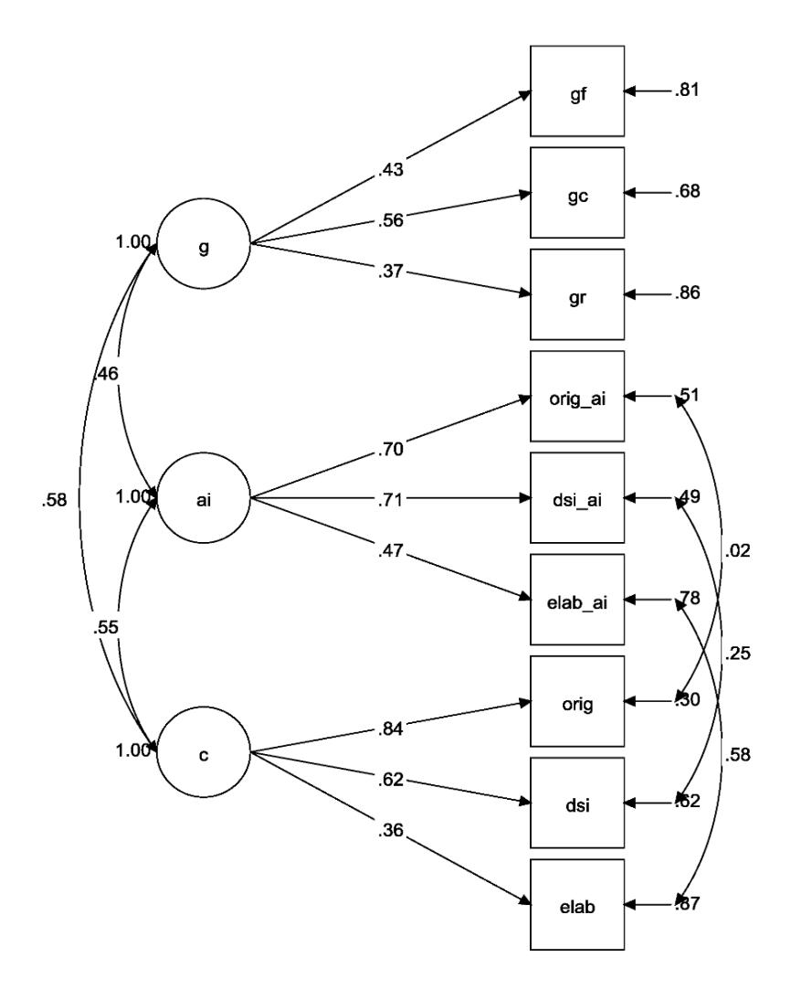
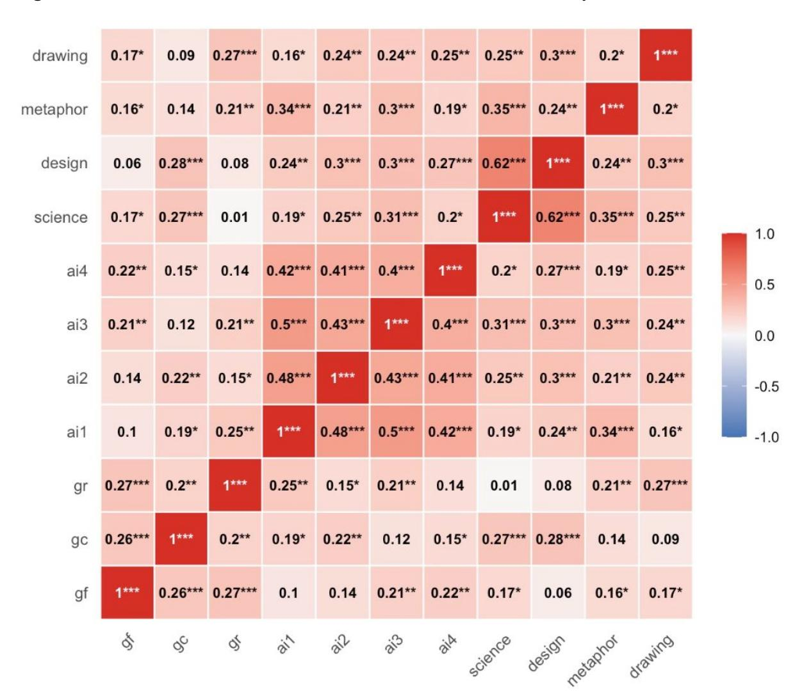
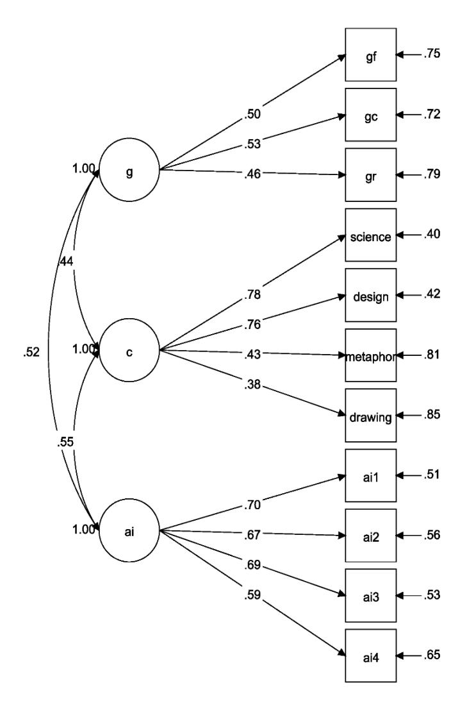
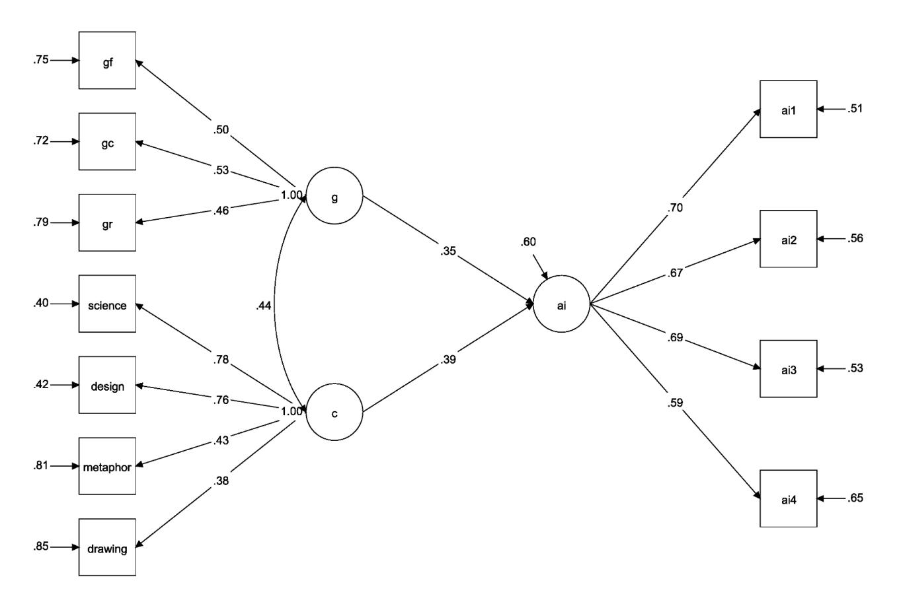

## **Generative AI Does Not Erase Individual Differences in Human Creativity**

Simone A. Luchini1 , James C. Kaufman2 , & Roger E. Beaty1

Data availability: All files and data for analyses are available at Open Science Framework: https://osf.io/b4ztn/

The authors have no conflicts of interest to disclose.

R.E.B. is supported by grants from Amazon and the National Science Foundation [DRL-240078; DUE-2155070].

Correspondence should be addressed to Simone A. Luchini, 140 Moore Building, University Park, PA 16802. Email: skl5875@psu.edu.

1 Department of Psychology, Pennsylvania State University, PA, United States

2 Neag School of Education, University of Connecticut, CT, United States

## **Abstract**

For over a century, researchers have documented robust individual differences in people's ability to think creatively. Today, however, generative AI appears to democratize creativity, potentially minimizing individual differences by offering powerful tools for anyone to generate ideas, stories, and more. Do individual differences still matter for creativity when everyone has access to the same advanced technology? Across two studies (N = 442), we tested whether two individual factors—creative ability (assessed via idea generation and story-writing tasks) and general intelligence (assessed via reasoning and knowledge tests)—predict performance in creative collaboration with large language models (LLMs). We isolate for the first time a latent construct for AI-assisted creativity, unique and separable from creativity without AI. Study 1 found that baseline creative writing ability strongly predicted AI-assisted story writing with GPT-4o (β = .42): people who wrote more original stories without AI also wrote better stories with AI. Study 2 replicated and extended this finding, showing that people who were more creative (β = .39) and intelligent (β = .35) in general performed better on entirely different creative tasks done with AI assistance. Thus, people with more creative task expertise (Study 1) and those with higher baseline cognitive abilities (Study 2) produced more original ideas, despite all participants having equal access to a powerful LLM. Our findings suggest that the successful use of generative AI may preserve individual differences in human creativity and intelligence, highlighting implications for education and the future of creative work.

*Keywords:* artificial intelligence; creativity; human-AI collaboration; individual differences; human intelligence

#### **Public Significance**

This work indicates that evaluating and fostering people's cognitive skills—for personnel selection or educational purposes—remains relevant in the age of generative AI. Specifically, we find general intelligence and creativity support a person's ability to produce creative ideas with large language models.

#### **Generative AI Does Not Erase Individual Differences in Human Creativity**

Generative artificial intelligence (AI) has the potential to democratize creativity by providing unprecedented access to powerful creative tools. Platforms like ChatGPT, Claude, and Gemini enable anyone to write stories, compose music, and generate images with remarkable ease. Yet when everyone has access to the same powerful AI tools, a crucial question arises as to whether individual cognitive skills like creativity and intelligence still matter for creative work. Should educators continue to cultivate these abilities, and should employers still prioritize recruiting the most cognitively skilled people? Understanding whether cognitive advantages persist in human-AI collaboration has profound implications for education, workforce development, and our fundamental understanding of human ability in the AI era.

For over a century, research has documented robust individual differences in creative thinking ability (Chassell, 1916)—the capacity to generate ideas that are both novel and useful (Runco & Jaeger, 2012). Creative ability shows moderate stability across the lifespan (Gilhooly & Gilhooly, 2021; Hui et al., 2019) and predicts real-world creative achievement (Feist, 1998; Kaufman et al., 2016), despite some debate about the domain-generality of creativity (Barbot et al., 2016). At the cognitive level, research has shown considerable overlap between creative thinking and general intelligence (Frith et al., 2021; Silvia, 2015). Three cognitive abilities that support creative thinking are: 1) fluid intelligence, 2) crystallized intelligence, and 3) broad retrieval ability. Fluid intelligence provides cognitive control for directing the creative thought process, including inhibiting common ideas; crystallized intelligence supplies the knowledge base necessary for combining concepts and evaluating their novelty against what is known; and broad retrieval ability enables efficient access to the knowledge base, facilitating flexible retrieval and recombination of concepts (Beaty & Silvia, 2012; Benedek et al., 2014, 2023; Frith et al., 2021; Gerver et al., 2023; Gerwig et al., 2021; Kenett & Faust, 2019; Luchini et al., 2025d; Miroshnik et al., 2023; Weiss et al., 2021). Creative thinking and general intelligence thus reflect

key individual differences that have long differentiated people and predicted success (Deary et al., 2007; Runco et al., 2010; but see Said-Metwaly et al., 2024).

Recent studies yield conflicting conclusions about the relevance of these cognitive differences when people collaborate with generative AI. Some evidence suggests AI may democratize creativity by reducing performance gaps (Doshi & Hauser, 2024; Noy & Zhang, 2023). For example, Doshi and Hauser (2024) found that access to GPT-4 particularly benefited less-creative participants—with creativity assessed via a single word association task—bringing their story quality up to match that of more-creative writers. Yet other work challenges this democratization narrative. Zhou and Lee (2024) found that artists who produced more novel artwork before the advent of generative AI (i.e., pre-2023) tended to produce more novel artwork after AI adoption, suggesting that baseline creative ability predicts successful AI collaboration. Orwig et al. (2024) and DiStefano et al. (2024) found similar patterns, showing that stronger baseline abilities and domain expertise predicted better performance on AIassisted creative tasks. Regarding intelligence, to our knowledge, no study has examined the roles of general cognitive abilities such as fluid intelligence/crystalized intelligence in human-AI co-creativity, despite the importance of such intelligence facets in explaining creative performance without AI. Taken together, whether generative AI eliminates, preserves, or amplifies individual differences in cognitive ability remains unclear.

The present research directly tests whether individual differences in intelligence and creativity predict performance on AI-assisted creative tasks. Across two studies (*N* = 442), we examined how baseline cognitive abilities—measured without AI assistance—relate to creative performance when using GPT-4o, a powerful and widely used large language model (LLM). Study 1 investigated whether baseline story-writing ability and general intelligence predict AIassisted story-writing quality. Study 2 extended this by examining whether broader creative ability—assessed through diverse tasks spanning visual, verbal, and scientific domains—predict performance on entirely different AI-assisted tasks. Our goal is to understand whether

generative AI truly democratizes creativity or whether cognitive advantages persist even when everyone has access to the same tools—a question with significant implications for education and the future of work (Cazzaniga et al., 2024; Leopold et al., 2025).

## **Study 1**

Study 1 tested whether intelligence and creative ability predict successful AI collaboration. To this end, we reanalyzed data from a recent study investigating human-AI interactions during creative story-writing (Luchini et al., 2025c). Participants completed a storywriting task with and without AI assistance from ChatGPT; they also completed an intelligence test battery measuring fluid reasoning (*Gf*), vocabulary knowledge (*Gc*), and verbal fluency (*Gr*). We hypothesized that baseline writing ability and general intelligence would uniquely predict the creative quality of stories written with AI, providing evidence of enduring individual differences in intelligence and creativity despite AI access.

#### **Method**

Data and code are openly available: https://osf.io/b4ztn/.

#### **Participants**

The dataset consisted of 263 undergraduate students enrolled at [REDACTED FOR ANONYMITY] in an introductory psychology course (see Luchini et al., 2025c). The study was approved by the [REDACTED FOR ANONYMITY]. Participants received partial course credit for their participation in the study.

#### **Procedure**

The study was conducted online using Qualtrics and a custom website built for AI collaborative writing (see below). We analyzed data from two story-writing tasks—one with AIassistance and one without—presented in randomized order to control for sequence effects. After the story writing, participants completed the intelligence tasks, as well as additional measures not analyzed here (see Luchini et al., 2025c).

#### **Story-Writing Tasks**

Participants completed two stories, one with AI-assistance and a baseline without AIassistance. The task adapted the five-sentence short-story task (FSST; Prabhakaran et al., 2014) by requiring a minimum word count of 150 words instead of the typical five sentences requirement to accommodate the AI component. Participants received three-word prompts (*penpaper-write* or *year-week-embark*) counterbalanced across conditions, previously validated as a creative writing assessment (Johnson et al., 2023; Luchini et al., 2025b). They were encouraged to spend at least 10 minutes writing, though timing was not enforced—only the word count requirement needed to be met to proceed, ensuring active engagement in this student sample. Participants were prompted to "use their imagination and be creative" while writing their stories (Harrington, 1975).

For the AI-assistance task*,* participants wrote their stories with ChatGPT-3.5-Turbo (accessed February 2025). This model was selected as it provided strong performance on natural language tasks at a more affordable price than its more advanced counterpart, GPT-4 (OpenAI, 2023). Participants were given two textboxes, one to interact with the AI and one to type their story. A system prompt constrained ChatGPT's output to bullet-point suggestions rather than full passages, ensuring the model would only act as a writing assistant for the experiment (see Supplementary Information A for the system prompt). For additional experimental controls, and to ensure compliance, copy-paste functionalities were disabled, and participants were explicitly instructed to not ask ChatGPT to write the story for them; pilot testing confirmed that the system prompt ensured this model behavior. Prior to the story tasks, participants completed a practice task (50 word-count and 2 minutes minimum) structured like the AI-assistance task. Conditions with and without AI-assistance were matched visually, removing the textbox for AI interaction for the condition without AI-assistance and displaying only the story writing textbox. Participants were also provided suggestions for story-writing brainstorming in both tasks—either by querying ChatGPT or by asking themselves the same questions when writing independently—specifically concerning four points: (1) Be specific, (2)

use open ended questions, (3) brainstorm ideas, and (4) request iterations (Supplementary Information B).

Short story performance was assessed using three natural language processing (NLP) metrics: originality, semantic distance, and elaboration. Originality was assessed using Multilingual Assessment of Short Stories (MAoSS), a transformer-based language model trained to predict human originality ratings on the five-sentence story task with high accuracy across languages (Luchini et al., 2025b). Semantic distance was assessed using Divergent Semantic Integration (DSI), which computes the cosine distance between every pair of words in a text using the Bidirectional Encoder Representations from Transformer (BERT) model, reflecting the semantic diversity of the story (Johnson et al., 2022). Elaboration was assessed using word count, reflecting the level of detail in the story. All three measures correlate moderately to strongly with human ratings, providing complimentary yet distinct metrics of creative writing performance. Taken together, a creative story was operationalized as being highly original, semantically diverse, and richly detailed.

#### **Intelligence Assessment**

We assessed three intelligence facets—*Gf*, *Gc*, and *Gr*—previously associated with creative task performance:

- *Gf.* The *series completion task* from the Culture Fair Intelligence Test (CFIT; Cattell & Cattell 1961/2008) assessed nonverbal reasoning. This task involves selecting the next image in a series of three progressively changing images from six options. Participants had 3 minutes to complete 13 problems; performance reflected the number of correct answers.
- *Gc.* The ETS advanced vocabulary test requires choosing the closest synonym from multiple options (Ekstrom et al., 1976). Participants had eight minutes to complete 25 trials; performance reflected the number of correct answers.
- *Gr.* The *animal fluency task* required participants to generate as many animals as possible (e.g., "dog", "cat") in 1 minute. This task measures associational fluency—the capacity

to retrieve conceptually related words from memory. Performance reflected the number of unique animals retrieved.

#### **Analytic Approach**

We used a structural equation modeling (SEM) framework to assess relationships among baseline creative writing ability, AI-assisted writing ability, and general intelligence. Latent variables were specified for each, predicted by their respective task indicators. Subsequently, a structural regression was conducted to examine the unique prediction of AIassisted writing ability from both baseline writing ability and general intelligence. Notably, our study is the first to our knowledge to model AI-assisted creative performance as a latent construct, testing whether it is separable from baseline creative ability.

All analyses were conducted using Mplus with robust maximum likelihood estimation (MLR). Model fit was evaluated using the comparative fit index (CFI), root mean square error of approximation (RMSEA), and standardized root mean square residual (SRMR).

# **Results**

#### **Descriptive Statistics and Correlations**

We began by computing Pearson correlations between our observed variables (Figure 1), adjusting *p*-values with the Benjamini-Hochberg false discovery rate (FDR) procedure (Benjamini & Hochberg, 1995). As expected, measures of baseline creative writing—originality, DSI, and elaboration—were moderately and positively related to each other, suggesting each metric captured common yet distinct variance in creative writing (Johson et al., 2022); a similar trend was found for AI-assisted writing. Importantly, we also found small to moderate correlations between baseline writing and cognitive ability with AI-assisted writing (see FIgure 1), pointing to contributions of general cognitive abilities in AI co-creativity.

**Figure 1.** Pearson correlations between observed variables for Study 1.

*Note.* Pearson correlations between observed variables from Study 1. *p*-values were adjusted using the Benjamini-Hochberg false discovery rate (FDR) procedure (Benjamini & Hochberg, 1995). orig = originality scores for baseline task; dsi = divergent semantic integration scores for baseline task; elab = elaboration scores for baseline task; orig\_ai = originality scores for AIassistance task; dsi\_ai = divergent semantic integration scores for AI-assistance task; elab\_ai = elaboration scores for AI-assistance task; gf = fluid intelligence; gc = crystallized intelligence; gr = broad retrieval ability. *\** = *p* < .05; \**\** = *p* < .01; *\*\*\** = *p* < .001.

## **Confirmatory Factor Analysis**

To model relations between intelligence, baseline creative writing, and AI co-creative writing, we specified a measurement model with three latent factors indicated by their respective task indicators (Figure 2). For model identification, we correlated the residuals of the baseline creative writing and AI co-creative writing variables, given the variables came from the same creative writing task. The model fit the data well, χ²(21) = 25.81, *p* = .21, RMSEA = .03 (90% CI [0.00, 0.06]), CFI = .99, TLI = .98, and SRMR = .04.

Consistent with past work (Johnson et al., 2022; Karwowski et al., 2017), general intelligence and baseline creative writing ability were strongly correlated: β = .58, *p* < .001, indicating that people with higher cognitive ability also wrote better stories without AI assistance. Importantly, co-creative writing correlated with both general intelligence (β = .46, *p* < .001) and baseline creative ability (β = .55, *p* < .001). These results provide preliminary evidence that individual differences in intelligence and creative task expertise predict creative performance with LLMs.

#### **Structural Equation Model**

Next, we specified a structural equation model to test the relative contribution of general intelligence and baseline creative writing ability in predicting AI co-creative writing. Interestingly, although both intelligence and baseline writing correlated strongly with AI co-creativity, only baseline writing significantly predicted AI writing (β = .42, *p* = .002); general intelligence showed a small and nonsignificant effect (β = .21, *p* = .212). Thus, controlling for general cognitive ability, only task-specific creative writing ability predicts AI co-creative writing.

**Figure 2.** Confirmatory Factor Analysis of General Intelligence, AI-Assisted Creativity, and Baseline Creative Ability for Study 1.

*Note.* Measurement model from Study 1, testing the relationships between general intelligence, AI-assisted creativity and creative ability. g = general intelligence; ai = AI-assisted creativity; c = baseline creative ability; gf = fluid intelligence; gc = crystallized intelligence; gr = broad retrieval ability; orig\_ai = originality scores for AI-assistance task; dsi\_ai = divergent semantic integration scores for AI-assistance task; elab\_ai = elaboration scores for AI-assistance task; orig = originality scores for baseline task; dsi = divergent semantic integration scores for baseline task; elab = elaboration scores for baseline task.

#### **Study 2**

Study 1 provided initial evidence that baseline creative ability predicts AI-assisted creative performance: students who were more creative without AI were also more creative with AI, supporting the relevance of baseline cognitive skills despite AI access. Moreover, although general intelligence correlated strongly with co-creative writing performance, only baseline writing ability remained a significant predictor of co-creative writing in the regression model, suggesting task-specific expertise plays a larger role in explaining AI collaboration.

Study 1 focused on a single creative task (story writing) in a single creative domain (narrative creativity) using a homogenous sample of mostly female university students. Does higher cognitive ability *in general* predict successful AI collaboration? To test this question in a broader sample, Study 2 examined whether general intelligence and creative abilities predict performance on AI-assisted creative tasks. Importantly, the creativity tasks differed substantially between baseline assessments (e.g., drawing, hypothesis generation) and AI-assisted (e.g., crafting social media posts, pitching business ideas) to differentiate domain-specific creative expertise from more broad creative abilities. We hypothesized that both general intelligence and creative ability would predict performance on the AI-assisted creativity tasks. Study 2 further aimed to disentangle the relative contributions of our indicators of intelligence and creativity in their prediction of AI-assisted creativity. We thus conducted multiple regression analyses to determine which individual difference measures were most predictive of AI-assisted creativity.

# **Method**

Data and code are openly available: https://osf.io/b4ztn/.

#### **Participants**

A total of 212 participants were recruited online through Prolific. Inclusion criteria included being located in the United Kingdom, United States, or Canada, aged 18–55, having a 99–100% approval rate, and being fluent in English. 3 participants were removed for having missed attention checks and 25 for having provided less than 2 responses per minute on the

verbal fluency tasks, indicating disengagement. Our final sample included 184 participants (86 female, 96 male, 2 other; mean age = 35.9 years, SD = 9.02).

Based on results from Study 1, a power analysis was conducted to determine the minimum sample size required to detect an effect of baseline creative ability on AI-assisted creativity (β = .42) in a structural equation model that simultaneously includes general intelligence (β = .21). A Monte-Carlo simulation was conducted with 5000 iterations per sample size (Muthén & Muthén, 2002), indicating that a minimum sample size of *N* = 125 is required to achieve > 99% power for detecting an effect at α = .050. Participants received \$15.00 for the estimated 75-minute study (an hourly rate of \$12.00/hr). The study was approved by [REDACTED FOR ANONYMITY].

# **Procedure**

The study was conducted online using a custom web application built using Replit (http://www.replit.com). Participants first completed four AI-assisted creativity tasks with ChatGPT-4o integration (accessed July 2025), with task order randomized across participants to control for order effects. Then, participants completed intelligence assessments without AI assistance (test battery similar to Study 1), a metaphor completion task (Patel et al., 2025), and additional creativity tasks on an external platform (cap.ist.psu.edu).

## **AI-Assisted Creativity Tasks**

Four co-creativity tasks were developed to reflect common real-world applications of AI assistance. To enhance engagement, participants were encouraged to draw from their own life experiences when completing the tasks. They were also instructed to craft creative and compelling responses. Instructions for the four tasks are provided below:

*Social Media Post*: "Write a social media post about an actual experience from the last few months—something memorable that stands out to you. Tell your story in a creative and interesting way, using AI assistance but making it sound like you."

*Review Your Experience*: "Think of a product, restaurant, movie, or service you recently tried. Write an honest and creative review that effectively conveys your experience and helps others decide whether to try it, using AI assistance but keeping it in your own voice."

*Dream Business Pitch*: "Imagine your dream business—one you've always wanted to start or a problem you're passionate about solving. Craft a creative and persuasive pitch that would convince someone to invest \$10,000 in your vision, using AI assistance but making it sound like you."

*Job Interview Challenge*: "During a job interview, you're asked: 'Tell me about a significant challenge you've faced and how you overcame it.' Draw from your own life experiences and craft a creative and compelling response that impresses the interviewer, using AI assistance but maintaining your own voice."

Like Study 1, participants worked within a split-screen interface featuring an AI chat panel (left) and writing workspace (right). The AI assistant (GPT-4o) was available throughout via an integrated chat interface, configured with task-specific system prompts to provide brief suggestions and support (Supplementary Information C). Participants could interact with the AI naturally—asking for brainstorming help, feedback on drafts, or refinement suggestions. Copypaste was again disabled to ensure authentic engagement with the task (Rilla et al., 2025).

Participants were encouraged to work on each task for about 6 minutes and to target a response length of about 100 words; both limits were not enforced, but participants could see a timer counting down and a word counter counting up. The system captured complete interaction logs, including all chat exchanges and writing progression.

#### **Scoring Procedure**

Creative writing responses were evaluated using multiple large language models (LLMs) as automated raters to assess creative quality (Schoenegger et al., 2024). Recent research demonstrates that LLMs can provide reliable creativity assessments, with studies finding that "zero-shot" LLM scoring—where only a detailed prompt (e.g., how to score response) and no

examples are provided to the model—achieves equal or even higher criterion validity than human raters on divergent thinking tasks (Saretzki & Benedek, 2025). This "LLM as judge" approach has become widely adopted in AI research for evaluating subjective outputs (Li et al., 2024).

Three LLMs served as independent raters: GPT-4.1 (OpenAI), Gemini 2.5 Flash (Google), and Claude Sonnet 4 (Anthropic). Each model independently evaluated every response using identical scoring prompts to ensure consistency. Models were presented with the original task instructions and participant responses, then asked to rate creativity on a scale from 10 (not creative at all) to 50 (very creative; Organisciak et al., 2023). The scoring prompt emphasized that creative responses should be both novel and effective, consistent with established creativity definitional frameworks (Runco & Jaeger, 2012).

Each model was configured with temperature settings of 0 to ensure consistency and reliability of ratings, i.e., the models produce the same rating every time. The scoring system was designed to return only the numerical score (10-50; Supplementary Information D). We evaluated inter-rater reliability between our three LLMs, and found excellent agreement based on the intra-class correlation coefficient (ICC = .88) for the absolute agreement on the average ratings using a two-way random model.

## **Intelligence Assessments**

- *Gf.* To measure fluid reasoning, participants completed the *series completion task*, the same *Gf* task from Study 1.
- *Gc.* To measure vocabulary knowledge, participants completed the *ETS advanced vocabulary test*, the same *Gc* task from Study 1
- *Gr.* To measure retrieval ability, participants completed two category fluency tasks: listing animals (from Study 1) and grocery items (Goecke et al., 2025), one minute each. A second fluency task was used to broaden the assessment of *Gr* beyond the single 1-minute task

used in Study 1. Total fluency score was derived by summing the unique items retrieved for the two tasks.

#### **Creativity Assessments**

Creativity was assessed using the Creativity Assessment Platform (CAP), which provides both administration and automated scoring of creativity tasks (Patterson et al., 2025). All responses were scored for originality using validated automated methods.

*Scientific Creative Thinking Task (SCTT).* The SCTT (Beaty et al., 2024) assesses the ability to generate hypotheses, research questions, and experiment designs through three subtests. Participants received these instructions: "In this task, you'll think of creative ideas related to scientific problems. The goal is to come up with ideas that are novel (original, unique, and innovative), while also being scientifically possible (practical, efficient, and feasible)." Participants had unlimited time for each trial to formulate 1 research question, hypothesis, and experiment for prompts such as "You look outside one night and see stars disappearing one by one from the sky. What hypotheses do you have about why that is?" and "Your cousin claims they can read minds, but it only works when a person doesn't know their mind is being read. How could you test to see if this superpower is real?" Participants completed 6 trials total.

*Drawing Task.* The drawing task (Barbot, 2018) assesses divergent thinking through sketching line drawings. Participants had unlimited time for each trial to complete 1 drawing per item based on incomplete shapes, under these instructions: "For this task, you'll use your mouse to create drawings. You'll be given an incomplete shape that you must incorporate into your drawings. Be as creative as you can!" Participants completed 6 trials total.

*Design Problems Task.* The design problems task (Luchini et al., 2025a; Shealy & Gero, 2019) assesses the ability to generate solutions to engineering challenges. Participants received the following instructions: "In this task, you'll think of solutions to real-world design problems. The goal is to come up with ideas that are novel (original, unique, and innovative), while also being effective (practical, efficient, and feasible)." They were given unlimited time for each trial to generate 1 solution per item for prompts such as "Develop as many design ideas as you can to improve access to clean water in remote areas" and "Develop as many design ideas as you can to help people with mobility impairments navigate stairs." Participants completed 6 trials total.

*Metaphor Generation.* Participants completed 10 metaphor completion trials, creating original metaphors for target concepts (Benedek et al., 2014; Patel et al., 2025), with these instructions: "A METAPHOR is a word that creatively compares one thing to another. When thinking of a metaphor, the aim is to come up with a one-word creative response: something clever, humorous, or original. Your response should be ONE NOUN." Participants completed sentence stems such as "The strong wind is..." "The soft pillow is..." and "The shiny coin is..." with single-word metaphorical responses. The metaphor task is not currently available on CAP and was thus completed on Replit.

Metaphor responses were evaluated using the same three LLMs that assessed the cocreativity tasks: GPT-4.1, Gemini 2.5 Flash, and Claude Sonnet 4. Following the zero-shot approach used for the co-creativity scoring, each model independently rated metaphor creativity on a scale from 10 (not creative) to 50 (very creative), with temperature settings of 0 to maximize rating consistency. The scoring prompt instructed models to evaluate how creative, uncommon, remote, and clever each metaphorical response was for its corresponding prompt. We again evaluated inter-rater reliability between the three LLMs, and found good agreement based on the intra-class correlation coefficient (ICC = .63) for the absolute agreement on the average ratings using a two-way random model.

#### **Analytic Approach**

Similar to Study 1, we used SEM to model relationships among baseline creativity, general intelligence, and AI-assisted co-creativity performance. Latent variables were specified for each construct, predicted by their respective task indicators. For baseline creativity, indicators included originality scores from the Scientific Creative Thinking Task (SCTT), Drawing Task, Design Problems Task, and Metaphor Generation task. For general intelligence, indicators included *Gf*, *Gc*, and *Gr*. For AI-assisted co-creativity, indicators included creativity ratings (averaged across the three LLM raters) from the four co-creativity tasks.

We first conducted confirmatory factor analyses (CFAs) to evaluate the measurement models for each latent construct. Subsequently, we conducted a structural regression to examine the unique prediction of AI-assisted co-creativity performance from both baseline creativity and general intelligence. All analyses were conducted using Mplus with robust maximum likelihood estimation (MLR).

#### **Results**

#### **Descriptive Statistics and Correlations**

We first ran several Pearson correlations between our observed variables (Figure 4), again by adjusting p-values with the Benjamini-Hochberg false discovery rate (FDR) procedure (Benjamini & Hochberg, 1995). We again found significant positive correlations between our intelligence measures of *Gf*, *Gc*, and *Gr* (*p* < .01-.001; *r* ≥ .20). We then observed that our different tasks of AI-assisted creativity were all strongly related to each other (*p* < .001; *r* ≥ .40). The measures of baseline creative ability were also positively correlated with each other, but more moderately (*p* < .05-.001; *r* ≥ .20).

## **Confirmatory Factor Analysis**

We began with a CFA to model the relationships between intelligence (g), creative ability (c), and AI-assisted creative performance (ai). The three-factor correlated model fit the data adequately, χ²(41) = 74.27, p = .001, RMSEA = .07 (90% CI [0.04, 0.09]), CFI = .91, TLI = .89, and SRMR = .06 (Figure 5). All factor loadings were significant and in the expected direction, with generally moderate to strong magnitudes. Notably, all AI co-creativity tasks loaded highly and significantly on the latent factor, despite being novel measures scored entirely with zeroshot LLMs. Likewise, diverse baseline creative tasks—including both verbal and visual converged on a common latent factor, supporting a general creative ability factor.

**Figure 4.** Pearson correlations between observed variables for Study 2.

*Note.* Pearson correlations between observed variables from Study 2. *p*-values were adjusted using the Benjamini-Hochberg false discovery rate (FDR) procedure (Benjamini & Hochberg, 1995). gf = fluid intelligence; gc = crystallized intelligence; gr = broad retrieval ability; science = originality scores for scientific creativity task; design = originality scores for design problems task; metaphor = originality scores for metaphor generation; drawing = originality scores for drawing task; ai1 = originality scores for social media post; ai2 = originality scores for review your experience; ai3 = originality scores for dream business pitch; ai4 = originality scores for job interview challenge. *\** = *p* < .05; \**\** = *p* < .01; *\*\*\** = *p* < .001.

**Figure 5.** Confirmatory Factor Analysis of General Intelligence, Baseline Creative Ability, and AI-Assisted Creativity for Study 2.

*Note.* Measurement model from Study 2, testing the relationships between general intelligence, AI-assisted creativity and baseline creative ability. g = general intelligence; ai = AI-assisted creativity; c = baseline creative ability; gf = fluid intelligence; gc = crystallized intelligence; gr = broad retrieval ability; science = originality scores for scientific creativity task; design = originality scores for design problems task; metaphor = originality scores for metaphor generation; drawing = originality scores for drawing task; ai1 = originality scores for social media post; ai2 = originality scores for review your experience; ai3 = originality scores for dream business pitch; ai4 = originality scores for job interview challenge.

The latent factors were moderately to strongly correlated: intelligence with creativity (*r* = .44), intelligence with AI co-creativity (*r* = .52), and creativity with AI co-creativity (*r* = .55; all *p*s < .001). These results replicate and extend the patterns observed in Study 1: people who were more intelligent and creative in general tended to score higher on the AI-assisted creativity tasks. Interestingly, general intelligence was as strongly correlated with AI-assisted creative performance as general creativity, accounting for 27% of the variance, compared to 30% for baseline creative ability.

## **Structural Equation Model**

Next, we specified a structural regression model to test the relative contribution of general intelligence and baseline creative ability in predicting AI co-creative performance (Figure 6). We found both general intelligence and baseline creativity significantly predicted AI co-creative performance. General intelligence showed a moderate effect (β = .35, *p* = .014), while baseline creativity demonstrated a similar effect size (β = .39, *p* = .002). Together, these cognitive abilities explained 40% of the variance in AI-assisted creative performance. These results replicate Study 1—showing joint contributions of intelligence and creative ability to cocreative performance—and extend it by demonstrating generality: people who were more creative in general also performed better when co-creating with AI, confirming that individual cognitive advantages persist despite AI access.

#### **Multivariate Analysis of Variance (MANOVA)**

Finally, we conducted a Multivariate Analyses of Variance (MANOVAs) to investigate which measures of baseline creative ability were most predictive of AI-assisted creativity. We ran a construct-specific model, conducting our MANOVA specifically for baseline creative ability. A Type II test was used to assess the unique contribution of each predictor while controlling for the other predictors in the model (Olson, 1976; Pillai, 1955).

**Figure 6.** Regression Model Testing the Relative Contributions of General Intelligence and Baseline Creative Ability on AI-Assisted Creativity.

*Note.* Regression model for Study 2, testing the relative contributions of general intelligence and baseline creative ability on AI-assisted creativity. g = general intelligence; ai = AI-assisted creativity; c = baseline creative ability; gf = fluid intelligence; gc = crystallized intelligence; gr = broad retrieval ability; science = originality scores for scientific creativity task; design = originality scores for design problems task; metaphor = originality scores for metaphor generation; drawing = originality scores for drawing task; ai1 = originality scores for social media post; ai2 = originality scores for review your experience; ai3 = originality scores for dream business pitch; ai4 = originality scores for job interview challenge.

We ran a MANOVA with all observed variables of baseline creative ability as predictors (*science*, *design*, *metaphor*, *drawing*) and the observed variables of AI-assisted creativity as outcome variables (*ai1*, *ai2*, *ai3*, *ai4*). When accounting for the influence of other creativity measures, we found a significant multivariate effect for metaphor creativity, Pillai's trace = .084, *F*(4, 169) = 3.87, *p* < .01.

We found that drawing ability, Pillai's trace = .046, *F*(4, 169) = 2.02, *p* = .09, design ability, Pillai's trace = .039, *F*(4, 169) = 1.73, *p* = .15., and scientific creativity, Pillai's trace = .021, *F*(4, 169) = .91, *p* = .46, did not significantly predict performance across the AI tasks when controlling for other creativity measures. In sum, when controlling for each variable's influence, our model reflected the importance of domain-specificity in creativity assessment. Specifically, only domain-general, verbal creativity remained predictive of AI-assisted creativity.

#### **General Discussion**

The rise of generative artificial intelligence has fundamentally challenged assumptions about the future relevance of human cognitive abilities, with many suggesting that powerful AI tools might make creativity or intelligence less essential to being able to produce a creative output. Across two studies, we provide clear evidence that individual differences in intelligence and creativity remain consequential for AI collaboration success. Study 1 demonstrated that people who wrote more creative stories without AI assistance also produced better stories when collaborating with ChatGPT. Study 2 extended this finding across diverse creative domains, showing that people with higher general intelligence and creative ability consistently outperformed others on entirely different AI-assisted creative tasks. These converging findings suggest that generative AI does not eliminate cognitive advantages but rather preserves robust individual differences in human intelligence and creativity.

We isolate for the first time a general factor of AI-assisted creativity, related but independent from creative ability and general intelligence. Past work has focused on comparing or correlating baseline creative ability and AI-assisted creativity, without exploring the structural

properties of either construct (Dell'Acqua et al., 2023; Noy & Zhang, 2023; Orwig et al., 2024). This finding is particularly noteworthy, as it indicates that separable mechanisms underlie creative performance with and without AI-assistance. Indeed, performance on an AI-assisted task (e.g., writing a clever social media post) was predictive of performance on other AI-assisted tasks (e.g., generating compelling business ideas), even if the nature of these tasks varied considerably. Unique to AI-assisted creativity is the quantity and quality of human-AI interactions, which have been found to predict creativity on collaborative story-writing (Luchini et al., 2025c). More broadly, past work on human-AI collaboration in solving multiple-choice questions was able to identify dynamic fluctuations in perspective taking that are predictive of task performance (Riedl & Weidmann, 2025). A general factor of AI-assisted creativity may reflect individual differences that are driving these interactions, such as personality factors, attitudes towards AI, or AI-related skills. Our findings thus highlight the importance of treating creative ability and AI-assisted creativity as structurally independent constructs.

Across both studies, we find that creativity without AI is a strong to moderate predictor of AI-assisted creativity, even when accounting for general intelligence. Researchers have raised concerns that adoption of generative AI could mask individual differences in creativity, invalidating previous assumptions and requiring the development of new tests of AI-assisted creativity (Rafner et al., 2023). Our findings indicate that both creative task expertise (Study 1) and general creative ability (Study 2) are viable predictors of creativity in AI-assisted settings. For Study 2, general creative ability predicted 30% of the variance in performance on a broad battery of AI-assisted creative tasks. When including general intelligence, cognitive abilities predicted a combined 40% of this variance, showing that generative AI preserves individual differences in creativity and intelligence.

Meanwhile, general intelligence only predicted AI-assisted creativity beyond baseline creative ability in Study 2. Indeed, the correlation between general intelligence and the AIassisted creativity factor demonstrated greater magnitude in Study 2. Crucially, this study

involved more diverse and naturalistic tasks as measures of AI-assisted creativity. These findings indicate that general intelligence is more relevant for human-AI collaboration in naturalistic settings. In contrast, Study 1 focused on narrative creativity, with a short-story writing task for both AI-assisted and baseline creativity. One possibility is general intelligence plays a smaller role in driving AI-assisted creativity in artistic contexts such as story-writing, which would be consistent with general intelligence being more related to creative achievement in science and invention than to creative achievement in the arts (de Manzano & Ullén, 2018). Creative task expertise, measured with the baseline story-writing from Study 1, accounted for the relationship between general intelligence and AI-assisted creativity. Our findings show that creative task expertise is a stronger predictor of AI-assisted narrative creativity than general intelligence, although intelligence may remain of value in other domains of AI-assisted creativity.

## **Implications and Future Directions**

This work has clear implications for all settings where individuals are selected on the basis of differences in creativity or intelligence, including educational (Kaufman, 2010) and organizational settings (Reiter-Palmon & Hunter, 2023). The adoption of generative AI has surged in both education (Freeman, 2025) and the workplace (Crane et al., 2025), questioning assumptions regarding the importance of cognitive abilities for success. However, our results suggest that AI-assisted creativity is yet another separate but related cognitive ability that is distinct from general creativity and intelligence. The strength of correlations between AI-assisted and baseline creativity tasks aligns with what has been observed when correlating different creativity tasks with each other, such as verbal creativity and scientific creative thinking tests (Beaty et al., 2024). For Study 2, correlations between AI-assisted and baseline creativity tasks ranged from *r* = .14 to *r* = .35, while correlations observed between verbal creativity and scientific creative thinking tests have been found to range between *r* = .17 to *r* = .37. Thus, while our work indicates that AI-assisted creativity is a separate factor from creative ability, the two may be unique facets under a general construct of creativity. Educators and employers can

therefore rely on classical cognitive ability tasks and expect these to predict creative performance in the context of generative AI.

Our research employed ChatGPT-3.5 (Study 1) and GPT-4o (Study 2), as these were amongst the most advanced and popular generative AI models at the time of data collection (LMArena, 2025). However, AI research advances at a rapid pace, with newer models being released that demonstrate both superior performance and novel features such as multimodality (Ferrag et al., 2025). Future research could investigate whether individual differences are preserved in the context of multimodal AI, such as incorporating both visual and text communication. Researchers could also expand their analysis to the broader creative process and explore if individual differences relate to the ways how individuals interact with AI in a creative setting. Research on human-AI interactions is critical in this era of accelerated technological adoption, so as to guide AI policies and development (Corazza et al., 2025; Rafner et al., 2025).

Past work has suggested AI may reduce the importance of cognitive abilities (Moșoi et al., 2025), including creativity (Noy & Zhang, 2023), on tasks such as problem-solving or writing which typically require both abilities. Regarding creativity, we find that individual differences in cognitive abilities are preserved when using AI in a diverse sample of healthy individuals, though additional work is required to extend this research to clinical cohorts. For example, one of AI's applications for special education (Yang et al., 2024) is its potential to alleviate learning difficulties in students (Habib et al., 2022); thus, it would be ideal to examine this question for this population. In addition, while our tasks from Study 2 were designed to be highly naturalistic (e.g., preparing for a job interview), it would also be important to not only specifically examine students and workers but also to design AI-assisted tasks that are highly valid for educational or business contexts. Finally, it is notable that the metaphor generation task was the most predictive measure of AI-assisted creativity. Rather than being an indicator that visual art and scientific creativity are less important, this is more likely evidence for domain-specificity of how

human creativity impacts AI-assisted creativity (given that all AI-assisted creativity were verbal in nature). Future studies could not only explore this possibility but also examine how the results might change or stay consistent when the AI-assisted tasks were reflective of more diverse domains (perhaps also including music).

Our study reinforces the importance of human creative expertise and abilities, thereby reaffirming their continued value in a world that is increasingly embracing AI. One specific application and potential area of future research is related to the concern that the shift to AI for creative work could have implications for equity (Wang et al., in press). Creativity has shown minimal differences by ethnicity (Kaufman, 2006; Kaufman et al., 2010), socioeconomic status (Acar et al., 2023), and gender (Taylor et al., 2024), yet is still a predictor of academic achievement (Gajda et al., 2017) and standardized tests (Kaufman et al., 2023). It has thus been proposed as a supplement to college admissions (Kaufman, 2010) and giftedness assessment (Luria et al., 2016) as well as a way to enhance equity in the classroom (Luria et al., 2017, 2025). Future studies examining how intelligence, creative abilities, and creative task expertise predict AI-assisted creativity across ethnicity, socioeconomic status, and gender could offer suggestions on how to continue to try to use creativity for equitable purposes. Relatedly, our sample for Study 2 was predominantly female, thus requiring further work to replicate our findings in a demographically balanced sample.

## **Conclusion**

In summary, our work demonstrates for the first time that AI-assisted creativity is a unique and identifiable ability, which is separate from baseline creativity and intelligence. We show that individuals with stronger creative task expertise and baseline cognitive abilities perform better on tasks of AI-assisted creativity. This clarifies the link between individual differences and AI-assisted creativity, demonstrating the robust predictive value of creativity and intelligence tests. Our research indicates that selecting individuals, in education or work, based on cognitive abilities continues to be viable and likely beneficial in the age of generative AI. In

light of our findings, we recognize the importance of fostering creativity in the age of generative AI. Cultivating creativity will empower individuals to thrive in AI-assisted environments. With the rapid adoption of AI in both schools and the workplace, understanding its relationship with cognitive abilities will be crucial to ensure informed policy and decision-making.

## **References**

- Acar, S., Tadik, H., Uysal, R., Myers, D., & Inetas, B. (2023). Socio-economic status and creativity: A meta-analysis. *The Journal of Creative Behavior*, *57*(1), 138-172. <https://doi.org/10.1002/jocb.568>
- Barbot, B. (2018). The Dynamics of Creative Ideation: Introducing a New Assessment Paradigm. *Frontiers in Psychology*, *9*, 2529.<https://doi.org/10.3389/fpsyg.2018.02529>
- Barbot, B., Besançon, M., & Lubart, T. (2016). The generality-specificity of creativity: Exploring the structure of creative potential with EPoC. *Learning and Individual Differences*, *52*, 178-187. https://doi.org/10.1016/j.lindif.2016.06.005
- Beaty, R., Cortes, R. A., Luchini, S., Patterson, J. D., Forthmann, B., Baker, B. S., Barbot, B., Hardiman, M., & Green, A. (2024). The Scientific Creative Thinking Test (SCTT): Reliability, Validity, and Automated Scoring. *PsyArXiv*. https://doi.org/10.31234/osf.io/y5fbs
- Benedek, M., Jauk, E., Sommer, M., Arendasy, M., & Neubauer, A. C. (2014). Intelligence, creativity, and cognitive control: The common and differential involvement of executive functions in intelligence and creativity. *Intelligence*, *46*, 73-83. https://doi.org/10.1016/j.intell.2014.05.007
- Beaty, R. E., Silvia, P. J., Nusbaum, E. C., Jauk, E., & Benedek, M. (2014). The roles of associative and executive processes in creative cognition. *Memory & Cognition*, *42*, 1186-1197.<https://doi.org/10.3758/s13421-014-0428-8>
- Benjamini, Y., & Hochberg, Y. (1995). Controlling the false discovery rate: A practical and powerful approach to multiple testing. *Journal of the Royal Statistical Society: Series B (Methodological)*, *57*(1), 289-300.<https://doi.org/10.1111/j.2517-6161.1995.tb02031.x>
- Brynjolfsson, E., Li, D., & Raymond, L. R. (2023). Generative AI at work. *National Bureau of Economic Research Working Paper*.

- Cattell, R. B., & Cattell, A. K. S. (1961/2008). *Measuring intelligence with the Culture Fair Tests*. Oxford, UK: Hogrefe.
- Cazzaniga, M., Jaumotte, M. F., Li, L., Melina, M. G., Panton, A. J., Pizzinelli, C., ... & Tavares, M. M. M. (2024). *Gen-AI: Artificial intelligence and the future of work*. International Monetary Fund. *2024*(1). https://doi.org/10.5089/9798400262548.006
- Chassell, L. M. (1916). Tests for originality. *Journal of educational psychology*, *7*(6), 317-328. https://psycnet.apa.org/doi/10.1037/h0070310
- Crane, L., Green, M., & Soto, P. (2025). Measuring ai uptake in the workplace. FEDS Notes. Washington: Board of Governors of the Federal Reserve System, February 05, 2025, https://doi.org/10.17016/2380-7172.3724.
- Cropley, A. (2006). In praise of convergent thinking. *Creativity Research Journal*, *18*, 391-404. https://doi.org/10.1207/s15326934crj1803\_13
- Corazza, G. E., Agnoli, S., Jorge Artigau, A., Beghetto, R. A., Bonnardel, N., Coletto, I., ... & Lubart, T. (2025). Cyber-Creativity: A Decalogue of Research Challenges. *Journal of Intelligence*, *13*(8), 103. https://doi.org/10.3390/jintelligence13080103
- Cook, R. D. (1977). Detection of influential observation in linear regression. *Technometrics*, *19*(1), 15-18. https://doi.org/10.1080/00401706.1977.10489493
- de Manzano, Ö., & Ullén, F. (2018). Genetic and environmental influences on the phenotypic associations between intelligence, personality, and creative achievement in the arts and sciences. *Intelligence*, *69*, 123-133.<https://doi.org/10.1016/j.intell.2018.05.004>
- Dell'Acqua, F., McFowland, E., Mollick, E. R., Lifshitz-Assaf, H., Kellogg, K., Rajendran, S., ... & Lakhani, K. R. (2023). Navigating the jagged technological frontier: Field experimental evidence of the effects of AI on knowledge worker productivity and quality. *Harvard Business School Technology & Operations Mgt. Unit Working Paper*. https://dx.doi.org/10.2139/ssrn.4573321

- Deary, I. J., Strand, S., Smith, P., & Fernandes, C. (2007). Intelligence and educational achievement. *Intelligence*, *35*(1), 13-21. https://doi.org/10.1016/j.intell.2006.02.001
- DiStefano, P. V., Zeitlen, D., Rafner, J., de Chantal, P. L., Peng, A., Miller, S., & Beaty, R. (2025). Evaluating ai's ideas: The role of individual creativity and expertise in human-ai co-creativity. *PsyArXiv*. https://osf.io/5fa38/
- Ekstrom, R. B., French, J. W., Harman, H. H., & Dermen, D. (1976). *Manual for Kit of Factor-Referenced Cognitive Tests*. Princeton, NJ: Educational Testing Service.
- Feist, G. J. (1998). A meta-analysis of personality in scientific and artistic creativity. *Personality and Social Psychology Review*, *2*(4), 290-309. http://dx.doi.org/10.1207/s15327957pspr0204\_5
- Ferrag, M. A., Tihanyi, N., & Debbah, M. (2025). From llm reasoning to autonomous ai agents: A comprehensive review. *arXiv*. https://doi.org/10.48550/arXiv.2504.19678
- Freeman, J. (2025). Student generative AI survey 2025. *Higher Education Policy Institute: London, UK*.
- Frith, E., Elbich, D. B., Christensen, A. P., Rosenberg, M. D., Chen, Q., Kane, M. J., ... & Beaty, R. E. (2021). Intelligence and creativity share a common cognitive and neural basis. *Journal of Experimental Psychology: General*, *150*(4), 609-632. https://doi.org/10.1037/xge0000958
- Gajda, A., Karwowski, M., & Beghetto, R. A. (2017). Creativity and academic achievement: A meta-analysis. *Journal of Educational Psychology*, *109*(2), 269-299. [https://doi.org/10.1037/edu0000133](https://psycnet.apa.org/doi/10.1037/edu0000133)
- Gerver, C. R., Griffin, J. W., Dennis, N. A., & Beaty, R. E. (2023). Memory and creativity: A meta-analytic examination of the relationship between memory systems and creative cognition. *Psychonomic Bulletin & Review*, *30*(6), 2116-2154. https://doi.org/10.3758/s13423-023-02303-4

- Gerwig, A., Miroshnik, K., Forthmann, B., Benedek, M., Karwowski, M., & Holling, H. (2021). The relationship between intelligence and divergent thinking—A meta-analytic update. *Journal of Intelligence*, *9*(2), 23. https://doi.org/10.3390/jintelligence9020023
- Gilhooly, K. J., & Gilhooly, M. L. (2021). *Aging and creativity*. Academic Press.
- Guilford, J. P. (1967). *The nature of human intelligence*. McGraw-Hill.
- Goecke, B., Weiss, S., & Wilhelm, O. (2025). Driving factors of individual differences in broad retrieval ability: *Gr* is more than the sum of its parts. *Journal of Experimental Psychology: Learning, Memory, and Cognition, 51*(2), 301–319. https://doi.org/10.1037/xlm0001336
- Guzik, A., Hubert, E., Farris, S., Sosina, V., Brueck, J., Gatica-Perez, D., & Jagdev, K. (2023). AI and the transformation of social science research. *Science*, *380*(6650), 1108-1109. https://doi.org/10.1126/science.adi1778
- Haase, J., & Hanel, P. H. P. (2023). Artificial muses: Generative artificial intelligence chatbots have risen to human-level creativity. *Journal of Creativity*, *33*(3), 100066. <https://doi.org/10.1016/j.yjoc.2023.100066>
- Habib, H., Jelani, S. A. K., & Najla, S. (2022). Revolutionizing Inclusion: AI in Adaptive Learning for Students with Disabilities. *Multidisciplinary Science Journal*, *1*(1), 1-11.
- Harrington, D. M. (1975). Effects of explicit instructions to "be creative" on the psychological meaning of divergent thinking test scores. *Journal of Personality*, *43*, 434-454. https://doi.org/10.1111/j.1467-6494.1975.tb00715.x
- Hui, A. N., He, M. W., & Wong, W. C. (2019). Understanding the development of creativity across the life span. *The Cambridge handbook of creativity*, 69-87. https://doi.org/10.1017/9781316979839.006
- Johnson, D. R., Kaufman, J. C., Baker, B. S., Patterson, J. D., Barbot, B., Green, A. E., ... & Beaty, R. E. (2023). Divergent semantic integration (DSI): Extracting creativity from

- narratives with distributional semantic modeling. *Behavior Research Methods*, *55*(7), 3726-3759. https://doi.org/10.3758/s13428-022-01986-2
- Karwowski, M., Kaufman, J. C., Lebuda, I., Szumski, G., & Firkowska-Mankiewicz, A. (2017). Intelligence in childhood and creative achievements in middle-age: The necessary condition approach. *Intelligence*, *64*, 36-44. https://doi.org/10.1016/j.intell.2017.07.001
- Kaufman, J. C. (2006). Self-reported differences in creativity by ethnicity and gender. *Applied Cognitive Psychology*, *20*(8), 1065-1082.<https://doi.org/10.1002/acp.1255>
- Kaufman, J. C. (2010). Using creativity to reduce ethnic bias in college admissions. *Review of General Psychology*, *14*(3), 189-203.<https://psycnet.apa.org/doi/10.1037/a0020133>
- Kaufman, J. C., Kapoor, H., Patston, T., & Cropley, D. H. (2023). Explaining standardized educational test scores: The role of creativity above and beyond GPA and personality. *Psychology of Aesthetics, Creativity, and the Arts, 17*(6), 725–734. [https://doi.org/10.1037/aca0000433](https://psycnet.apa.org/doi/10.1037/aca0000433)
- Kaufman, J. C., Niu, W., Sexton, J. D., & Cole, J. C. (2010). In the eye of the beholder: Differences across ethnicity and gender in evaluating creative work. *Journal of Applied Social Psychology*, *40*(2), 496-511.<https://doi.org/10.1111/j.1559-1816.2009.00584.x>
- Kaufman, S. B., Quilty, L. C., Grazioplene, R. G., Hirsh, J. B., Gray, J. R., Peterson, J. B., & DeYoung, C. G. (2016). Openness to experience and intellect differentially predict creative achievement in the arts and sciences. *Journal of Personality*, *84*(2), 248-258. <https://doi.org/10.1111/jopy.12156>
- Leopold, T., Di Battista, A., Jativa, X., Sharma, S., Li, R., & Grayling, S. (2025). Future of jobs report 2025. In *World Economic Forum. https://www. weforum. org/reports/the-futureofjobs-report-2025*.
- Li, H., Dong, Q., Chen, J., Su, H., Zhou, Y., Ai, Q., ... & Liu, Y. (2024). Llms-as-judges: a comprehensive survey on llm-based evaluation methods. *arXiv*. https://doi.org/10.48550/arXiv.2412.05579

- LMArena. (2025). Leaderboard. *LMArena*. Accessed September 20th 2025[.](https://lmarena.ai/leaderboard) <https://lmarena.ai/leaderboard>
- Luchini, S., Beaty, R., Boyce, A., Zappe, S., & Forthmann, B. (2025a). Automating creativity assessment in engineering design: A psychometric validation of AI-generated design problems. *PsyArXiv*. https://doi.org/10.31234/osf.io/e6t8k\_v1
- Luchini, S. A., Moosa, I. M., Patterson, J. D., Johnson, D., Baas, M., Barbot, B., ... & Beaty, R. E. (2025b). Automated assessment of creativity in multilingual narratives. *Psychology of Aesthetics, Creativity, and the Arts*. Advance online publication. https://doi.org/10.1037/aca0000725
- Luchini, S., Pronchick, J., Ceh, S., Kaufman, J. C., Johnson, D., Rafner, J., & Beaty, R. (2025c). The Roles of Idea Generation and Elaboration in Human-AI Collaborative Creativity. *PsyArXiv*.<https://doi.org/10.31234/osf.io/xm2f5>
- Luchini, S. A., Kaufman, J. C., Goecke, B., Wilhelm, O., Kenett, Y. N., Lei, D., ... & Beaty, R. E. (2025d). Creativity supports learning through associative thinking. *npj Science of Learning*, *10*(1), 42.<https://doi.org/10.1038/s41539-025-00334-1>
- Luria, S. R., O'Brien, R. L., & Kaufman, J. C. (2016). Creativity in gifted identification: Increasing accuracy and diversity. *Annals of the New York Academy of Sciences*, *1377*(1), 44-52. <https://doi.org/10.1111/nyas.13136>
- Luria, S. R., Sriraman, B., & Kaufman, J. C. (2017). Enhancing equity in the classroom by teaching for mathematical creativity. *ZDM*, *49*(7), 1033-1039. https://doi.org/10.1007/s11858-017-0892-2
- Luria, S. R., Xie, L., & Kaufman, J.C. (2025). Social change creativity: Dovetailing pedagogies for justice*.* In J. Katz-Buonincontro & T. Kettler (Eds.), *Oxford Handbook of Creativity and Education* (pp. 407-428)*.* Oxford University Press.

- McGrew, K. S. (2009). CHC theory and the human cognitive abilities project: Standing on the shoulders of the giants of psychometric intelligence research. *Intelligence*, *37*(1), 1-10. https://doi.org/10.1016/j.intell.2008.08.004
- Miroshnik, K. G., Forthmann, B., Karwowski, M., & Benedek, M. (2023). The relationship of divergent thinking with broad retrieval ability and processing speed: A meta-analysis. *Intelligence*, *98*, 101739. https://doi.org/10.1016/j.intell.2023.101739
- Mollick, E. R., & Mollick, L. (2023). Using AI to implement effective teaching strategies in classrooms: Five strategies, including prompts. *The Wharton School Research Paper*. <https://dx.doi.org/10.2139/ssrn.4391243>
- Moșoi, A. A., Maican, C. I., Cazan, A. M., & Sumedrea, S. (2025). Do students need to think hard? The interplay of AI and cognitive abilities in solving problems. *Education and Information Technologies*, 1-28.<https://doi.org/10.1007/s10639-025-13738-8>
- Muthén, L. K., & Muthén, B. O. (2002). How to use a Monte Carlo study to decide on sample size and determine power. *Structural equation modeling*, *9*(4), 599-620. https://doi.org/10.1207/S15328007SEM0904\_8
- Noy, S., & Zhang, W. (2023). Experimental evidence on the productivity effects of generative artificial intelligence. *Science*, *381*(6654), 187-192. <https://doi.org/10.1126/science.adh2586>
- OpenAI. (2023). GPT-4 Technical Report. *arXiv*.<https://arxiv.org/abs/2303.08774>
- Orwig, W., Bellaiche, L., Spooner, S., Vo, A., Baig, Z., Ragnhildstveit, A., ... & Seli, P. (2024). Using AI to generate visual art: Do individual differences in creativity predict AI-assisted art quality?. *Creativity Research Journal*, 1-12. https://doi.org/10.1080/10400419.2024.2440691
- Patterson, J. D., Pronchick, J., Panchanadikar, R., Fuge, M., van Hell, J. G., Miller, S. R., ... & Beaty, R. E. (2025). CAP: The creativity assessment platform for online testing and

- automated scoring. *Behavior research methods*, *57*(9), 264. https://doi.org/10.3758/s13428-025-02761-9
- Prabhakaran, R., Green, A. E., & Gray, J. R. (2014). Thin slices of creativity: Using single-word utterances to assess creative cognition. *Behavior Research Methods*, *46*(3), 641-659. https://doi.org/10.3758/s13428-013-0401-7
- Rafner, J., Beaty, R. E., Kaufman, J. C., Lubart, T., & Sherson, J. (2023). Creativity in the age of generative AI. *Nature Human Behaviour*, *7*(11), 1836-1838. <https://doi.org/10.1038/s41562-023-01751-1>
- Reiter-Palmon, R., & Hunter, S. (Eds.). (2023). *Handbook of organizational creativity: Individual and group level influences*. Elsevier.
- Riedl, C., & Weidmann, B. (2025). Quantifying Human-AI Synergy. *PsyArXiv*. https://doi.org/10.31234/osf.io/vbkmt\_v1
- Rilla, R., Werner, T., Yakura, H., Rahwan, I., & Nussberger, A. M. (2025). Recognising, Anticipating, and Mitigating LLM Pollution of Online Behavioural Research. *arXiv*. https://doi.org/10.48550/arXiv.2508.01390
- Runco, M. A., & Jaeger, G. J. (2012). The standard definition of creativity. *Creativity Research Journal*, *24*(1), 92-96. https://psycnet.apa.org/doi/10.1080/10400419.2012.650092
- Runco, M. A., Millar, G., Acar, S., & Cramond, B. (2010). Torrance tests of creative thinking as predictors of personal and public achievement: A fifty-year follow-up. *Creativity Research Journal*, *22*(4), 361-368.<https://doi.org/10.1080/10400419.2010.523393>
- Said-Metwaly, S., Taylor, C. L., Camarda, A., & Barbot, B. (2024). Divergent thinking and creative achievement—How strong is the link? An updated meta-analysis. *Psychology of Aesthetics, Creativity, and the Arts, 18*(5), 869–881. [https://doi.org/10.1037/aca0000507](https://psycnet.apa.org/doi/10.1037/aca0000507) Schoenegger, P., Tuminauskaite, I., Park, P. S., Bastos, R. V. S., & Tetlock, P. E. (2024). Wisdom of the silicon crowd: LLM ensemble prediction capabilities rival human

- crowd accuracy. *Science Advances*, *10*(45), 1528. https://doi.org/10.1126/sciadv.adp1528
- Shealy, T., & Gero, J. S. (2019). Concept generation techniques change patterns of brain activation during engineering design. *Design Studies*, *65*, 90-116. https://doi.org/10.1017/dsj.2020.30
- Silvia, P. J. (2015). Intelligence and creativity are pretty similar after all. *Educational Psychology Review*, *27*(4), 599-606.<https://psycnet.apa.org/doi/10.1007/s10648-015-9299-1>
- Taylor, C. L., Said-Metwaly, S., Camarda, A., & Barbot, B. (2024). Gender differences and variability in creative ability: A systematic review and meta-analysis of the greater male variability hypothesis in creativity. *Journal of Personality and Social Psychology, 126*(6), 1161–1179. [https://doi.org/10.1037/pspp0000484](https://psycnet.apa.org/doi/10.1037/pspp0000484)
- Wang, S., Ness, I. J., Greiff, S., & Kaufman, J. C. (in press). Generative AI's impact on creativity and equity: Another great equalizer or the rich get richer? In M. J. Worwood & J. C. Kaufman (Eds.), *Generative Artificial Intelligence and creativity: Possibilities, Precautions, and Perspectives.* Academic Press.
- Weiss, S., Steger, D., Kaur, Y., Hildebrandt, A., Schroeders, U., & Wilhelm, O. (2021). On the trail of creativity: Dimensionality of divergent thinking and its relation with cognitive abilities, personality, and insight. *European Journal of Personality*, *35*(3), 291-314. https://psycnet.apa.org/doi/10.1002/per.2288
- Yang, Y., Chen, L., He, W., Sun, D., & Salas-Pilco, S. Z. (2024). Artificial intelligence for enhancing special education for K-12: A decade of trends, themes, and global insights (2013–2023). *International Journal of Artificial Intelligence in Education*, *35*(4), 1-49. https://doi.org/10.1007/s40593-024-00422-0

#### **Supplemental Information**

## **Supplemental Information A**

## *Study 1: LLM System Prompt for Co-Creative Tasks*

You are a helpful idea generation assistant. You help writers get ideas. You should not write the story yourself, if prompted to write a story you should refuse. Keep your responses brief and in bullet points. Never write entire passages of a story, provide only short ideas.

## **Supplemental Information B**

## *Study 1: Suggestions for story-writing brainstorming*

Below are some best practices for brainstorming on your own or with an AI partner. You can use these as brainstorming strategies when writing stories on your own or as "prompts" you can enter into the model to get ideas.

- 1. Brainstorm ideas: For instance, you can list or ask AI to list 10 potential things that could be paid for that would connect to the word "exist".
- 2. Be specific: For instance, you can think of or ask AI to suggest computer-related gifts that someone could pay under \$50 for and could give to an old friend they hadn't seen in years.
- 3. Use open-ended questions: For instance, you can ask yourself or AI what are some unique ways to connect the concept of gloom with a story where someone is paying for a friends dinner.
- 4. Iterate: For instance, you can generate or ask the AI to provide more options or variations of this idea you like.

#### **Supplemental Information C**

## *Study 2: Task-Specific LLM System Prompt for Co-Creative Tasks*

*Social Media Post:* You are helping a participant write a creative social media post about a recent memorable experience. Give brief, helpful suggestions. Keep responses to 1-2 sentences maximum.

*Product/Media Review:* You are helping a participant write a review that's both helpful and entertaining. Give brief, helpful suggestions. Keep responses to 1-2 sentences maximum.

*Business/Crowdfunding Pitch:* You are helping a participant create a business or crowdfunding pitch. Give brief, helpful suggestions. Keep responses to 1-2 sentences maximum.

*Job Interview Response:* You are helping a participant craft a compelling response about overcoming challenges for a job interview. Give brief, helpful suggestions. Keep responses to 1- 2 sentences maximum.

## **Supplemental Information D**

## *Study 2: LLM Scoring Prompt for Co-Creative Tasks*

You are evaluating creative writing responses from a research study on AI-assisted writing.

Study Context: Participants completed personal writing tasks with optional AI assistance.

Original Task Prompt for Participant: {task\_description}

Scoring Instructions: Evaluate how creative the following writing response is for the task described above. A creative response should be novel (unusual, original, unique, or surprising) and effective (appropriate, useful, clever, or interesting). Rate the response on a scale from 10 (not creative at all) to 50 (very creative). Return only the integer 10-50, no extra text.